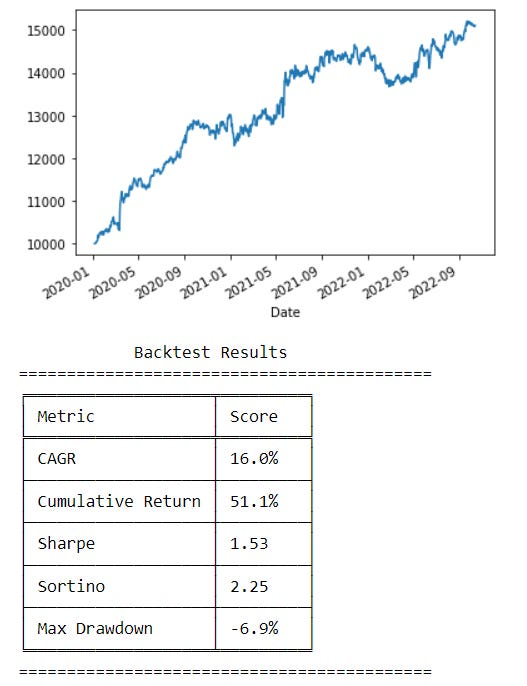
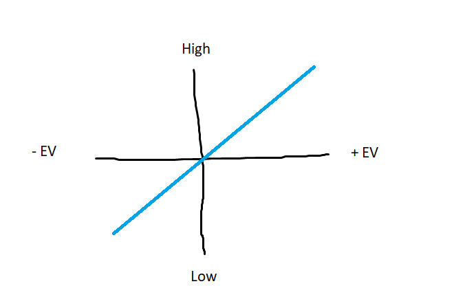
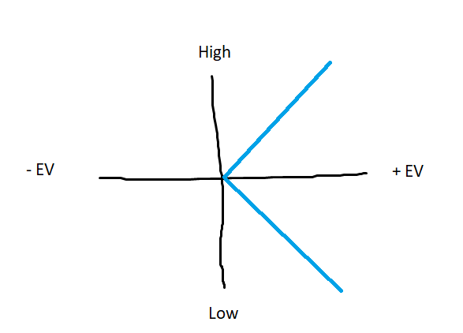
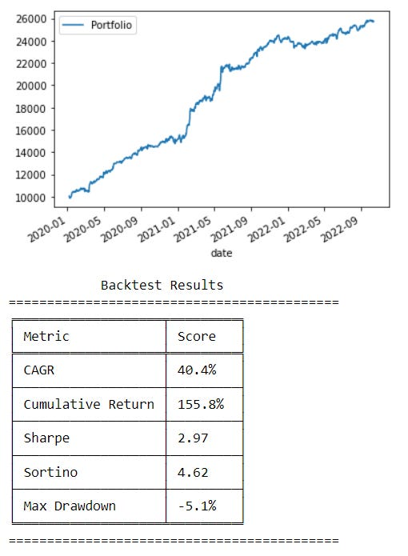

# Ranked L/S - Turning a formula into a strategy

Source HTML: [`html/2023-02-07-ranked-ls-turning-a-formula-into.html`](../html/2023-02-07-ranked-ls-turning-a-formula-into.html)

# Ranked L/S - Turning a formula into a strategy

| 항목 | 값 |
| --- | --- |
| 날짜 | 2023-02-07 |
| 접근 | 무료 |
| URL | https://www.algos.org/p/ranked-ls-turning-a-formula-into |
| 부제 | A very dirty way to translate an alpha (formula) into a strategy without the need for complex machine learning or portfolio optimization. |

---

The standard process I think of for creating alpha-based strategies goes as such:

Data → Formula → Prediction → Portfolio Optimization → Execution

Quant’s Substack is a reader-supported publication. To receive new posts and support my work, consider becoming a free or paid subscriber.

Ranked Long / Short (RLS) is a way we can simplify the two parts of this which normally require a pretty significant amount of head-scratching to build into your research platform. This is prediction and portfolio optimization.

Normally, you take your formula and feed it into an ML model to spit out a prediction of the expected return for different assets. You may also want to predict volatility, but most people will just use historical values. Either way, you need EV and volatility.

Linear regression is entirely fine for the ML component, maybe a non-parametric regression if there is some fundamental reason you need non-linearity. The formula / rule is called the alpha for a reason, it is 95%+ of where your alpha, edge, cash money PNL, or whatever you call it, comes from (people often get confused by the fact that people will use the word alpha to mean the formula / rule, whilst also using the same word to mean having returns in excess of the market on a risk-adjusted basis).

Once you have your expected value + volatility, you feed this into your portfolio optimization model. There are many libraries in both R and Python for this, although the best solution will be from banging your head against a convex optimization textbook, grinding through the literature, and creating a custom optimizer.

This is in many ways why your research platform can make or break your performance as a quant team. If you handle data and automate deployment / execution, then all you need to do is create a formula / rule. You wouldn’t even need to write code, you could just have it parse the formula you type into a dashboard and generate the feature. These types of systems take years to build and are often highly custom.

Every night, I dream of having an incredibly comprehensive system like this. Alas, most people capable of building such things prefer to spend their time creating alpha so end up with far dirtier systems. Lucky for me, my current work doesn’t so much need a system like that as it is more about capturing nuance effectively.

This is where we present one of the best tools for doing things “eh good enough” - the RLS method. Ranked Long / Short (RLS) involves taking assets, ranking them on the alpha, then longing the top xx %, and shorting the bottom xx %.

For example:

Our alpha might be some metric, we calculate this metric for each asset, then we rank all assets on the metric. Our metric is mean 0, with a standard deviation of 1 since we z-score it. We calculate the 0.9 and the 0.1 quantiles. Then we use these quantiles as cutoffs to select our top and bottom 10%. Finally, we long all the assets in the top 10%, and short all the assets in the bottom 10%. We get the below result using an assumption of top-taker fees, and a roughly accurate value for spreads (we only use top 10-20 liquid assets otherwise our spread assumptions are either way too conservative or too liberal depending on which assets are in the portfolio at that time). We also volatility adjust in both the upper and lower deciles. We could use the top/bottom 20%, 5%, etc but 10% works fine here. I’m not revealing the metric, but keep experimenting and you may find it :)

What about prediction? Well, the graph shown below is effectively what we assume when we use the RLS method. We draw a cutoff at xx % since our EV must beat fees plus some risk premium for us to do well. Linear is true in most cases, but if it isn’t linear then we can also fix that easily.

What if the relationship between the value of my alpha and the expected value (EV) of the asset in the future looks more like this (not so linear):

In this case, we can just take the absolute value of our feature, and we get back to the original straight line. You may wonder “what if the low value is 5, and the high value is 50? Doesn’t that give me the same result?” (5 and 50 are arbitrary what matters is that both are positive).

The reason taking the absolute value works is that you can always z-score your features. If you do this, your low is negative and your high is positive, both to equal degrees. Taking the absolute value puts your low at 0, and high at some positive number (you could z-score it again, but there isn’t a real reason in my view), either way, you get back to the original image once again.

The arguments against RLS are not from its inability to adapt to non-linearity, you can usually embed that in your feature by changing the formula. The main drawback is actually the excessive turnover the model creates.

Let’s look at an example:

Say I have a long / short portfolio that currently is expected to deliver 14 basis points over the next hour. My cost to transact is ~3.5 bps for futures if I have top taker fees (1.53 \* 2 for fees + round it off to 3.5 to account for spread). If getting the new best portfolio requires me to turnover my portfolio on both legs, then I see an increase in costs of 7 bps relative to my current portfolio. I pay 3.5 bps to get flat on both my long and short side, then another 3.5 to get long and short on the new portfolio. Pricey.

We assume that there are 16 basis points of edge in the new portfolio. Standard RLS would say switch. This is because it has no concept of transaction costs. If it did consider transaction costs then it would not switch since we go from 14 bps to 9 bps (16 - 7) which is -EV relative to our current position.

We can of course improve this by using a method I call Optimized RLS (ORLS) this is a trick I came up with that I decided to name all of a sudden. It is a bit more complicated and requires you to pull out a bit of ML, but if you are just using linear regressions (my recommendation) it won’t be much harder. We use our regression to get a quick forecast, finding the relationship between the metric and the EV.

Then we can say that 7 bps of EV is equal to a metric that is 0.24 or -0.32. (Often the buy/sell sides of the trade have different amounts of edge). If the amount of EV we use is equal to our fees (hence why I used 7 bps above), then we can adjust the metric of every asset other than our current holdings by that amount (if we have -0.1 for an asset we would subtract the negative number, -0.32, but since we don’t want to make it positive so we just set it to 0. If it was 0.1 we would subtract 0.24 which makes it negative, so we just set it to 0). For a score like 0.5, we would subtract 0.24 and get 0.26. Then we rank all the assets again after adjusting them to get our new rankings. Note that we do not adjust any of the assets we already are holding since there is no cost to have them in our new portfolio, we already own them!

This is also helpful since we could say our cutoff is x times the cost of trading and we only trade if both the buy / sell side are above their respective cutoffs to ensure we are always delta neutral. The next step beyond that would be to do actual portfolio optimization and ML, but this is about as far as we can go whilst still claiming a “quick and dirty solution”.

In most cases, we do not even use ORLS because RLS works fine. We also may be using RLS to briefly check if an alpha is worth exploring, so we simulate RLS without fees, or with very low fees. This is because it is just a dirty test. We want to see if the idea is correct or not. If the returns are good without fees, and of course, this requires some experience/judgment, but if they look good enough that you could guess it will also be decent after fees (this is where the judgment comes in) then you would spend time properly testing it with machine learning + portfolio optimization.

Some people will use RLS as their final solution anyways, and for many applications it is fine, but please remember that it is also probably not the best way to do it.

For context, we can look at the performance of the previous alpha when we apply a proprietary portfolio optimization / machine learning system I developed. The majority of the improvement comes from it accurately accounting for costs when making its decisions. The difference between a linear regression, decision tree, or non-parametric regression is almost insignificant (important to note so I don’t have people coding up neural nets thinking it will massively improve performance).

#### Bonus Trick:

One fun bonus tip / trick that I thought I would share is that you can use RLS as a way to discover if your alpha is robust to overfitting or not. Most people will take the top 10%, and of course, the threshold somewhat depends on your transaction costs, but a good way to tell if an alpha is robust is to test it out at different thresholds. If it works at 20%, 10%, and 5% you can be very confident that it is genuine. If it looks wildly different when you change the quantiles a bit then your alpha is not robust and there is a good chance it was overfit. This is a really great tool I use often.

This was a trick I learned from other quants, but I don’t see it talked about much. Perhaps one day we will see an RLS quantile plot being a common quant tool (a plot of the Sharpe ratio across a range of quantiles, perhaps 5% increments from 30% to 5%).

#### Conclusion

Hopefully, you’ve found a really easy way to deploy your ideas without the need to spend ages experimenting with machine learning and portfolio optimization. This is a great tool I use regularly, as well as many quants. The overfitting detection technique is also super cool and helpful so worth giving it a go when in doubt.

Quant’s Substack is a reader-supported publication. To receive new posts and support my work, consider becoming a free or paid subscriber.
