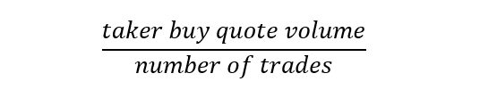
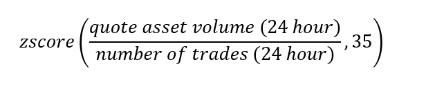
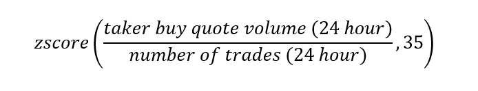
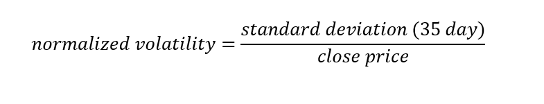
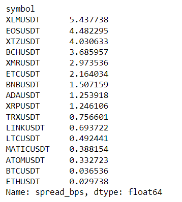
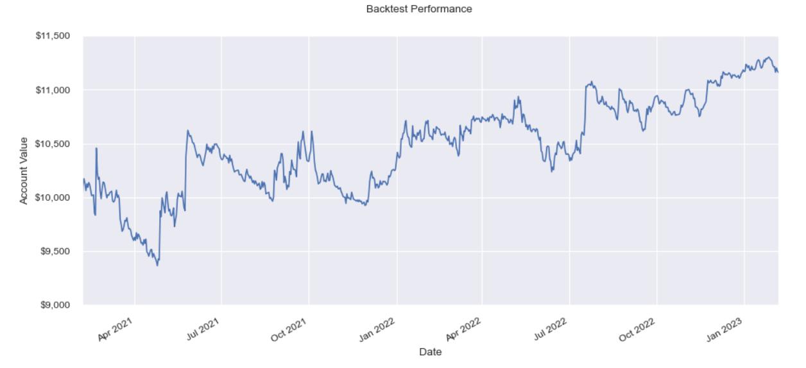
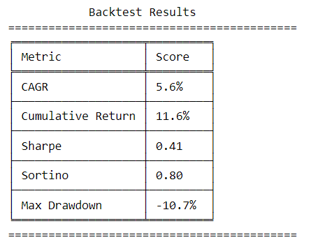
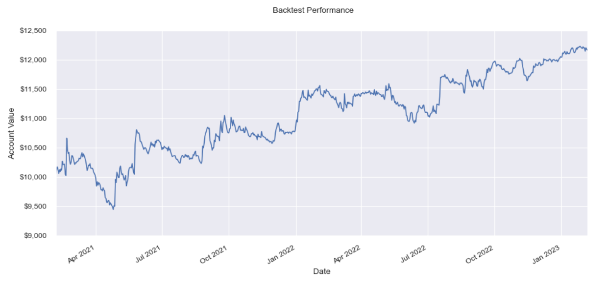
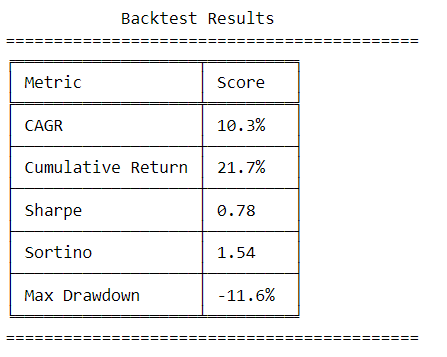

# Using Order Size For Alpha

Source HTML: [`html/2023-02-08-using-order-size-for-alpha.html`](../html/2023-02-08-using-order-size-for-alpha.html)

# Using Order Size For Alpha

| 항목 | 값 |
| --- | --- |
| 날짜 | 2023-02-08 |
| 접근 | 유료 |
| URL | https://www.algos.org/p/using-order-size-for-alpha |
| 부제 | Using a proxy for order sizes to create a delta neutral strategy for digital assets |

---

#### Introduction

---

For my first research article where I publish an actual strategy, we discover a novel alpha based on order sizes. We are able to find two variations of this strategy that perform reasonably well on a risk-adjusted basis. These are very similar strategies, but the fact that both variations perform well gives confidence in the significance of the effect. To my knowledge, this has not been published anywhere else.

#### Strategy Overview

---

This strategy is based on an approximation of the average order size submitted over a 24-hour period. We normalize our alpha over a 5-week (35-day) rolling period. The first variation of the alpha is formulated below:

We take the quote asset volume, which is effectively the volume in USDT since all our assets are quoted in USDT, and divide by the number of trades. We use the USDT volume instead of the base asset volume to help normalize this metric. The second variation of this alpha is formulated below:

We use the volume of taker buy orders instead of the overall volume since taker buy orders are the most likely order to be used by retail traders. This is a well-known relationship that is often exploited by execution algorithms to hide their flow. Retail traders tend to prefer market orders and tend to send buy orders more than sell orders. This is a relationship that can be found across many assets such as equities and not just digital assets. HFT orders are more likely to be short-term bets that provide a lot less information about the time horizons we consider here.

It is usually a good idea to take the z-score of our alpha over a rolling basis (5 weeks is an amount I personally like to use). This means that we are now looking at which assets have had a sudden change in average order size instead of ranking assets based on their current average order size. There will be differences in average order sizes between assets, and these will be persistent, the more interesting information is which assets have seen a recent increase in their order sizes. These metrics use daily bars so are calculated over a 24-hour period. This gives us the full formula below:

Doing this for the variation that approximates retail flow we get:

Our logic here is that if participants on average want to trade more of an asset it is likely a signal to purchase the asset. Retail buy orders increasing shows that they are very interested in this asset all of a sudden. This is potentially a signal to buy, or if it is decreasing, a signal to sell.

We then rank our selection of liquid assets based on this metric and divide by the 35-day normalized volatility. We define this below:

We adjust for volatility since we want to penalize high-volatility assets. There is a strong positive relationship between the volatility of portfolio constituents and turnover. Thus, we penalize for volatility as a way to decrease turnover, lower total trading costs, and generally improve performance. Reducing trading costs is key.

#### Cost Assumptions

---

In our analysis, we use the below spread assumptions (basis points). This is not exactly the most accurate way to do it since this is just the current list of spreads when I did the analysis, not the spreads when trades were actually made. It is likely fine, and certainly not worth the large increase in research time to properly simulate.

This is also a list of the assets we will be using. These are all Binance perpetual futures, and the lowest fee of 1.53 basis points (1.7 bps with a 10% BNB discount) is assumed for exchange fees. All trades are assumed to be entirely taker, but further optimization could include limit orders as there is a fairly decent amount of time to execute daily alphas.

#### Portfolio Formation

---

We use a variation of the RLS (Ranked Long / Short) method to turn this alpha into a strategy. You can read my previous article on this method for more details. This does not optimize for trading costs or turnover, but I have limited time, and the main objective is to see if this works. We can optimize it later. Often the upper 10% is longed and the lower 10% is shorted (after ranking assets on the alpha - in descending order). Here we take the buy the top asset and sell the bottom asset. I did this, because it is easier to code, and I am lazy. The portfolio is rebalanced at the close price daily.

#### Performance

---

This is the part everyone skips to, but please note it is just a backtest, and this is only for educational purposes. This is not investment advice, and the main focus here is on the research process. That said, the strategy does manage to perform reasonably well.

For the first variation, we end up with this equity curve:

Here is a quick table of the metrics most will care about. I used 10% sizing on both the short and long legs (relative to the cash balance of the portfolio). Using small sizing is ideal as your Sharpe ratio will decrease with leverage. Thus, it is usually a smart idea to use somewhat consistent leverage when backtesting or comparison gets harder.

For the second variation, we see better results:

Our Sharpe ratio almost doubles, and the curve looks better in general.

#### Final Remarks

---

Giving some concluding comments, you should always be cautious with backtests, and in many cases, a Sharpe ratio below 1-1.5 is often noise. There is a reasonable explanation as to why this alpha works, and we showed a clear improvement by following this logic. This gives more confidence, but as always this is not meant to be financial advice. I try my best, but don’t expect to find alpha on Twitter / within the public domain. This is only to show (my personal) research process after all.

In the spirit of full disclosure, I wouldn’t run a strategy with a Sharpe this low, hence why I can share it (capacity isn’t where I need it either which is probably the largest factor), but performance could likely improve with proper turnover optimization, and better execution using limit orders. Most statistical arbitrage managers might have 10-20+ alphas which together are able to generate Sharpe ratios much higher than their average. Never be discouraged if you don’t get to a 3+ Sharpe on your first strategy, it is probably overfit if you can’t come up with a really good explanation as to why it hasn’t been arbitraged away anyways. Alpha takes time to develop so keep going!
