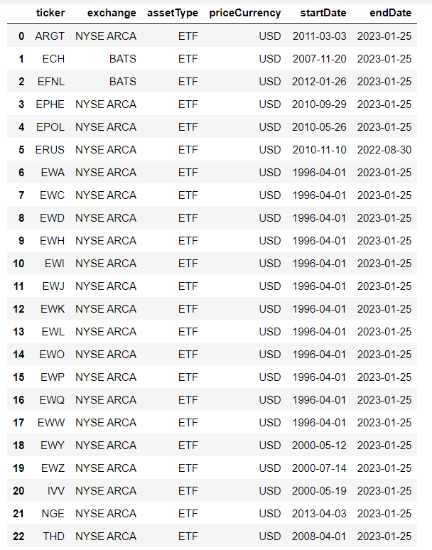
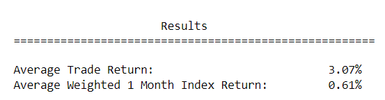
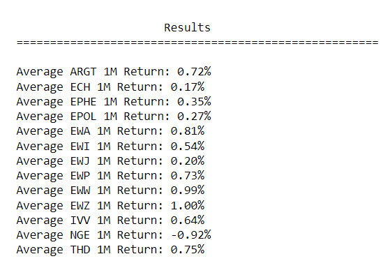
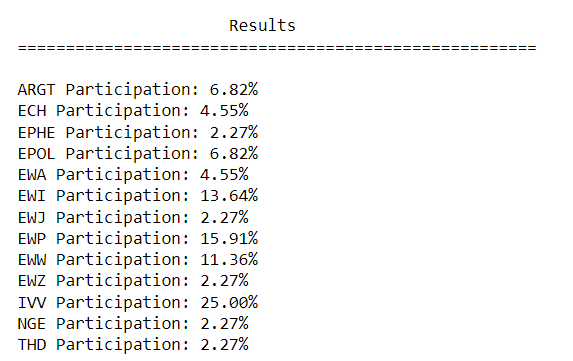

# Election Cycle Seasonality Effects

Source HTML: [`html/2023-02-26-election-cycle-seasonality-effects.html`](../html/2023-02-26-election-cycle-seasonality-effects.html)

# Election Cycle Seasonality Effects

| 항목 | 값 |
| --- | --- |
| 날짜 | 2023-02-26 |
| 접근 | 무료 |
| URL | https://www.algos.org/p/election-cycle-seasonality-effects |
| 부제 | Uncovering the election risk premium across the globe (CODE INCLUDED) |

---

#### Introduction

Elections can be a large driver of variance for many countries. As a result of this, there exists a risk premium around elections that we will research in this article. This is an effect that has been documented by others (papers at the end), but I thought I would do my own research on the topic using my own approach. It is likely similar to other methodologies, but the methodology I came up with was entirely freestyle so it is somewhat original. This article includes the code needed to replicate it as a special treat. Nobody is allowed to comment on the quality of my code, it runs so it is fine.

If you enjoy the content please consider subscribing to the newsletter. I’ve decided to make this one free since it wasn’t part of my previously planned articles / comes with an off-topic article that was also free (would be a tease otherwise).

Quant’s Substack is a reader-supported publication. To receive new posts and support my work, consider becoming a free or paid subscriber.

#### Sections

1. Methodology
2. Data
3. Trade Simulation
4. Results
5. Further Improvements
6. Alternative Methodologies
7. Implementation Guidance
8. Conclusion
9. References

#### Methodology

I won’t dive too deep into the logic I went with as readers will see it as I walk through the code, but I do want to discuss the idea I decided on before conducting research.

It is incredibly important to come up with your hypothesis BEFORE you start testing. Sometimes you are just looking to see if an effect exists, and that is fine, but it is wise to try and write some notes on what you expect to see, and some fundamentals as to why. If you explore the data before you have a strategy idea outlined, that is also fine (as long as you keep it exploratory), but you should sit down after this step and try to design your strategy with both the results and fundamental ideas as your guides.

If your logic fails to generate alpha you should sit down and do this step again before running another backtest, otherwise you will overfit.

In this article, we will use ETFs that capture the market return for different countries. These will be the assets our prices are coming from in the below logic.

Briefly explaining the logic:

1. Take the first day of the month the election occurs on. Use the most common month between states/constituencies since some will vote early.
2. Record the close price of the respective ETF for this day. If this day falls on a weekend/holiday, use the nearest date prior to this day where the market is open (and prices are available for).
3. Do this again, but add 30 days to the 1st of the month date to get the close price for when we exit the trade.
4. Generate average 1-month returns for each ETF, and then weight these returns by the % of trades that used this ETF. Sum up the values to get your participation weighted average return which we can use as our benchmark.
5. Generate the average return for our trades. This is roughly a 1-month trade, hence the use of monthly average returns as our benchmark.
6. Compare these numbers. If they are significantly different then you get to make a backtest.

Whilst my results warranted a backtest based on this logic, I did not produce one. The aim of these articles is to educate readers about the research process, not to hand out strategies - that part is up to you. This strategy trades infrequently and is well-known, but I think we can still find many ways to improve it.

#### Data

I took a fair few of these tickers from one of the QuantConnect example strategies that looked at momentum in countries’ ETFs. I did also add quite a few on my own. The list is shared below.

```
country_tickers =  ["EWJ",  # iShares MSCI Japan Index ETF
                    "EFNL", # iShares MSCI Finland Market Index ETF
                    "EWW",  # iShares MSCI Mexico Inv. Mt. Idx
                    "ERUS", # iShares MSCI Russia ETF
                    "IVV",  # iShares S&P 500 Index
                    "EWQ",  # iShares MSCI France Index ETF
                    "EWH",  # iShares MSCI Hong Kong Index ETF
                    "EWI",  # iShares MSCI Italy Index ETF
                    "EWY",  # iShares MSCI South Korea Index ETF
                    "EWP",  # iShares MSCI Spain Index ETF
                    "EWD",  # iShares MSCI Sweden Index ETF
                    "EWL",  # iShares MSCI Switzerland Index ETF
                    "EWC",  # iShares MSCI Canada Index ETF
                    "EWZ",  # iShares MSCI Brazil Index ETF
                    "EWO",  # iShares MSCI Austria Investable Mkt Index ETF
                    "EWK",  # iShares MSCI Belgium Investable Market Index ETF
                    "EPOL", # ishares MSCI Poland ETF
                    "THD",  # iShares MSCI Thailand ETF
                    "NGE",  # GlobalX MSCI Nigeria ETF
                    "ARGT", # GlobalX MSCI Argentina ETF
                    "EPHE", # iShares MSCI Philippines ETF
                    "EWA",  # iShares MSCI Australia ETF
                    "ECH"]  # iShares MSCI Chile Investable Market Index ETF
```

We start by importing libraries:

```
# Import libraries
import pandas as pd;
import numpy as np;

import requests;
import json;

from tqdm import tqdm;
```

Then we read the supported tickers file, which can be downloaded from Tiingo. We use data from Tiingo for this article as it is quite affordable at only $10 a month.

```
supported_tickers = pd.read_csv("supported_tickers.csv")
```

We then filter out assets that are not ETFs, drop rows with NaN values (usually these are tickers with unknown availability dates), and filter out tickers that are not in our country\_tickers list. I also reset the index because I don’t like looking at indexes that have gaps - there wasn’t a practical reason to do this.

```
supported_tickers = supported_tickers[supported_tickers.assetType == "ETF"];
supported_tickers = supported_tickers.dropna(0);
supported_tickers = supported_tickers[supported_tickers.ticker.isin(country_tickers)].reset_index(drop=True);
```

Here is a quick print-out of what the supported\_tickers table looked like after (end dates are a month old because I didn’t pull this data today)

[](images/5941f2c5fa7f.png)

I then filtered out ETFs that didn’t have recent data available, which is basically just Russia. Russia is also a bit of a non-democracy right now so it doesn’t belong anyways.

```
supported_tickers = supported_tickers[supported_tickers.endDate == "2023-01-25"]
```

I then imported my Tiingo API token from a JSON file so that nobody gets to see it, but you can hardcode it if you want.

```
token_file = open('secrets.json')
token_json = json.load(token_file)
tiingo_token = token_json['tiingo_token']
```

Then we make the request headers, which I pretty much copied from the Tiingo docs.

```
headers = {
'Content-Type': 'application/json',
'Authorization' : f'Token {tiingo_token}'
}
```

We then define the columns we want (which is the adjusted OHLCV values, not the non-adjusted ones) and rename them because I like my columns named a certain way.

```
select_columns = ["date", "adjClose", "adjHigh", "adjLow", "adjOpen", "adjVolume"];
rename_columns = ["Timestamp", "Close", "High", "Low", "Open", "Volume"];
```

We then scrape the data and save each file into the folder I made for this data. (keep your data organized or you will waste a lot of time).

```
# Scrape Data From Tiingo

for ticker, start_date, end_date in tqdm(supported_tickers[["ticker", "startDate", "endDate"]].values):
    try:
        url = f"https://api.tiingo.com/tiingo/daily/{ticker}/prices?startDate={start_date}&endDate={end_date}&format=json&resampleFreq=daily";

        r = requests.get(url, headers=headers).json()

        df = pd.DataFrame(r)
        df = df[select_columns];
        df.columns = rename_columns;
        df.Timestamp = pd.to_datetime(df.Timestamp)

        df.to_parquet(f"Data/Tiingo/OHLCV/daily_{ticker}_ohlcv_tiingo.parquet")
    except Exception as e:
        print(f"Error Occured With {ticker}: ", e)
```

I saved them as parquet files because compared to CSVs they are smaller on the disk, faster to open, and keep the formatting from Pandas when saved. Sometimes I use HDF5 files if my data is very large as this is much faster to open (specifically if all data types are numeric then it is 5-10x faster - on my computer at least). Reformatting your data is a really smart idea if you expect file I/O to be the biggest source of latency - which is very often the case. If your data is in the GBs then it is worth converting slow GZ-compressed CSV files to HDF5 or parquet. Luckily, our data is not very big here, but we still use parquet to keep our formatting.

For the election data, I pulled it from the link below, but you can use whatever data you like, and I’ve included some alternative sources at the end.

https://electiondataarchive.org/data-and-documentation/clea-upper-chamber-elections-archive/

#### Trade Simulation

Now that our data is scraped we can proceed with our analysis. As usual, we import the libraries we plan on using, and in my case some ones I often use - but may not end up using here. This is also because I am almost always copying and pasting my imports from another notebook to save time.

The data\_address\_manager import is a custom tool that holds all of the functions I regularly use for managing data. I’m not sharing it, but you can easily figure out what the functions do by reading the function names.

```
## Import Libraries
import pandas as pd;
import numpy as np;

import matplotlib.pyplot as plt;
import seaborn as sns;

from tqdm import tqdm;
import warnings;
warnings.filterwarnings("ignore");
from datetime import datetime as dt, timedelta;

import data_address_manager as dam;
```

I have no respect for warnings whatsoever, this is terrible coding practice, but I do not care - it saves time so it is worth it for me.

We start by pulling a list of all the file names inside the folder storing our data.

```
etf_file_names = dam.get_file_names("Data/Tiingo/OHLCV")
```

We then hardcode a map between the tickers used by Tiingo and the country names used in our election data. A fair few of these countries aren’t in our election data or were excluded, such as Russia. I figured I’d code them all up in case I found a better election dataset halfway through (which I did, but not worth swapping it at that point).

```
country_name_map = {"EWJ" : "Japan", "EFNL" : "Finland",
                    "EWW" : "Mexico", "ERUS" : "Russia",
                    "IVV" : "US", "EWQ" : "France",
                    "EWH" : "Hong Kong", "EWI" : "Italy",
                    "EWY" : "South Korea", "EWP" : "Spain",
                    "EWD" : "Sweden", "EWL" : "Switzerland",
                    "EWC" : "Canada", "EWZ" : "Brazil", 
                    "EWO" : "Austria", "EWK" : "Belgium",
                    "ECH" : "Chile", "EPOL" : "Poland",
                    "THD" : "Thailand", "NGE" : "Nigeria",
                    "ARGT" : "Argentina", "EPHE" : "Philippines",
                    "EWA" : "Australia"};
```

We then read in our election data CSV file which we downloaded earlier.

```
election_data = pd.read_csv("Data/ElectionData/clea_uc_20220111.csv")
```

Once again, we are renaming columns / removing ones we don’t care about.

```
selected_columns = ["id", "ctr_n", "yr", "mn"]
renamed_columns = ["election_id", "country_name", "year_num", "month_num"]

election_data = election_data[selected_columns]
election_data.columns = renamed_columns
```

Next, we aggregate our election data by election ID, taking the most common value (mode) for each column. This is because our data is at the constituency level and as mentioned earlier different constituencies may hold elections early.

```
election_data = election_data.groupby("election_id").agg(pd.Series.mode)
```

After this, we save the country names to a list so that we can drop the ones that we don’t have an ETF for using this list.

```
available_names = election_data.country_name.unique().tolist()
```

We then replace all the country names with their tickers and filter out the ones that still have their actual country names (ones we don’t have an ETF for).

```
for ticker, country_str in country_name_map.items():
    election_data["country_name"] = election_data["country_name"].replace(country_str, ticker)

election_data = election_data[~election_data.country_name.isin(available_names)]
```

We then use the year number column and the month number column to create a DateTime of the first day of the month.

```
election_data["election_month_start"] = pd.to_datetime(election_data.year_num.astype(str) + "-" + election_data.month_num.astype(str) + "-01")
```

Next, we read all of our files and put them into a multi-index data frame (which are horrible to work with unless it is simple data manipulation like this).

```
etf_data = pd.DataFrame()

for etf_file_str in etf_file_names:
    etf_temp = pd.read_parquet(f"Data/Tiingo/OHLCV/{etf_file_str}")
    etf_name = etf_file_str.split("_")[1]
    etf_temp["Ticker"] = [etf_name for x in range(len(etf_temp))]
    etf_temp = etf_temp.set_index(["Ticker", "Timestamp"], drop=True)

    etf_data = etf_data.append(etf_temp)
```

After that, we sort the data into chronological order. This is actually totally useless now that I’m writing this since we are just looking at average trade return, but if we were making a backtest we would do this so a helpful manipulation to apply anyways.

```
election_data = election_data.sort_values(by='election_month_start').reset_index(drop=True)
```

We then run the originally discussed methodology, saving our results into a list.

NOTE: you should see quite a few of these errors, this is just elections from the 1900s that we don’t have ETF prices for so it got an error finding the date. These are fine and it is quicker just to catch and ignore the errors than to add a filter for the date.

```
single positional indexer is out-of-bounds


event_record = []

for i_idx in election_data.index.tolist():
    current_election = election_data.iloc[i_idx];
    election_country = current_election.country_name;
    month_start = current_election.election_month_start;

    try:
        start_price = etf_data.loc[(election_country)][: month_start].iloc[-1].Close
        end_price = etf_data.loc[(election_country)][: month_start + timedelta(days=30)].iloc[-1].Close
        price_chg = (end_price/start_price);
        event_record.append([election_country, month_start, start_price, end_price, price_chg])

    except Exception as e:
        print(e)
```

The above code is inefficient since it indexes into the same ETF twice, but performance is not a concern here. Otherwise, it is a good idea to check your logic.

We then put this in a data frame, could have done this with a data frame from the start, but this was easier for me.

```
results_table = pd.DataFrame(event_record, columns=["Ticker", "Date", "StartPrice", "EndPrice", "Chg"])
```

After this, we produce a data frame containing the number of times an ETF ticker was used in a trade, a list of tickers that were traded, and a count of all the trades we made.

```
tick_counts = pd.DataFrame(results_table.groupby('Ticker').count().Chg)

traded_tickers = tick_counts.index.tolist()

total_count = len(results_table)
```

Finally, we compute our average monthly returns by ETF and save it alongside the % of trades that each ETF was used for.

```
country_monthly_returns = []

for i in range(len(traded_tickers)):
    index_1M_avg_ret = 1 + etf_data.loc[(traded_tickers[i])].resample("1M").last().Close.pct_change().dropna(0).mean();
    sample_wgt = tick_counts.loc[traded_tickers[i]].Chg / total_count;
    country_monthly_returns.append([traded_tickers[i], index_1M_avg_ret, sample_wgt])
```

Please forgive me for indexing into the list of traded tickers 3 different times. Should have really just done this instead:

```
country_monthly_returns = []

for traded_tick in traded_tickers:
    index_1M_avg_ret = 1 + etf_data.loc[(traded_tick)].resample("1M").last().Close.pct_change().dropna(0).mean();
    sample_wgt = tick_counts.loc[traded_tick].Chg / total_count;
    country_monthly_returns.append([traded_tick, index_1M_avg_ret, sample_wgt])
```

As before, we slap that bad boy into a data frame.

```
cmr = pd.DataFrame(country_monthly_returns, columns=["Ticker", "AvgReturn", "SampleWgt"])
```

We then compute average returns for our trades and our benchmark:

```
avg_trade_ret = (results_table.Chg.mean() - 1) * 100
avg_index_return = ((cmr["AvgReturn"] * cmr["SampleWgt"]).sum() - 1) * 100
```

Finally, we print them out using a pretty format because people will have to actually read these results that are not me so might as well make it pretty.

```
print("")
print("                      Results                         ")
print("======================================================")
print("")
print('Average Trade Return:                          {:.2f}%'.format(avg_trade_ret))
print('Average Weighted 1 Month Index Return:         {:.2f}%'.format(avg_index_return))
```

#### Results

Here is the print-out of average returns. We could run statistical tests, but it is pretty clear that this is worth continuing with given how much larger trade returns are. No trading costs were simulated because I am not spending all that time grabbing spread data for these ETFs, nor does it matter when returns are in the single digit %s.

[](images/146bcc7a652f.png)

We also look at the 1-month index returns for each ETF individually to make sure that our 3.07% return is larger than even the luckiest ETFs.

[](images/85464a844727.png)

For bonus points, here is a printout of participation rates:

[](images/cfcb06f2d42a.png)

#### Further Improvements

Here are some ideas on how to further optimize this trade. The first of these would be to experiment with holding periods and try to juice better returns.

Next, and likely one of the most valuable improvements would be to add more countries. There are far more ETFs out there, and many countries like Canada were not in the election dataset despite holding elections and having an ETF available.

We could also look at lower constituency elections or look at which industries stand to be the most affected by elections, then using industry-specific ETFs for countries where that is available. Some countries don’t have ETFs but are in regional ETFs.

#### Alternative Methodologies

We looked at 1-month returns, mostly because I couldn’t find specific announcement dates, only months (although they could probably be found with more searching). The literature usually looks at the 5-day period prior to election day so that is a strong alternative approach for capturing this effect. Especially since you will probably end up hardcoding these dates in for live trading unless you can find an API for this shit.

#### Implementation Guidance

To give some advice on how to deploy this strategy, I recommend using QuantConnect as it is not a complex strategy and it is much easier to code using QC that a custom implementation. These tickers should for the most part be available with QC and can be traded through an IBKR account, but custom data can be imported from Tiingo anyways so this won’t create issues if it pops up.

You will have to find an API for these elections, web-scraping investing (dot) com or Yahoo Finance might be your best bet. Otherwise, you will have to manually input these dates. The data for election dates can be imported as custom data for QC also (both the historical CSV data and any live data API you manage to find).

As with most of my articles, they aren’t intended to provide readers with profitable strategies, but you are free to attempt to implement them regardless. This is a strategy that made 44 trades over a 20-year period (in my testing), so you certainly won’t make a fortune here, but this could definitely be pushed far past 200 trades if more countries were added with much broader election data.

#### Conclusion

To conclude, these effects exist for a reason. Elections are not exactly common events, and there is certainly a risk premium attached. Despite this, we’ve seen that a global consideration of elections is clearly capable of improving this trade.

Our research resulted in success, but there is definitely a lot more work to be done. That I will leave up to the eager reader. It certainly would be a simpler project to attempt compared to other strategies, especially since the groundwork has been laid.

As always, if you enjoyed the article then feel free to subscribe so that I am motivated to post more of this shit.

[Subscribe now](https://www.algos.org/subscribe?)

#### References

***Election data:***

https://electiondataarchive.org/data-and-documentation/clea-upper-chamber-elections-archive/

http://www.globalelectionsdatabase.com/index.php/index

***ETF data:***

https://api.tiingo.com/

***QuantConnect strategy I stole half the tickers from:***

https://www.quantconnect.com/learning/articles/investment-strategy-library/momentum-effect-in-country-equity-indexes

***Election Seasonality Papers:***

<https://papers.ssrn.com/sol3/papers.cfm?abstract_id=3531847>

<https://www.proquest.com/docview/2543521949?pq-origsite=gscholar&fromopenview=true>

<https://www.sciencedirect.com/science/article/pii/1059056095900365>

<https://www.emerald.com/insight/content/doi/10.1108/MF-May-2012-0126/full/pdf?title=effects-of-election-results-on-stock-price-performance-evidence-from-1980-to-2008>

***US Election Research:***

<https://www.archives.gov/electoral-college/key-dates>

<https://www.usa.gov/election#item-36072>
