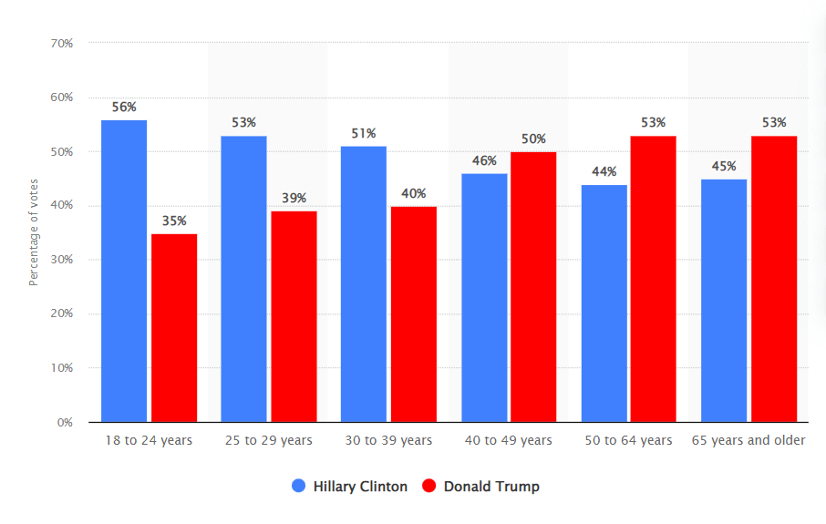
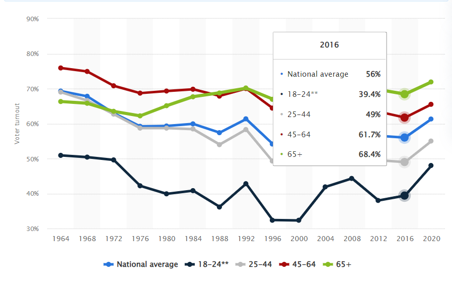
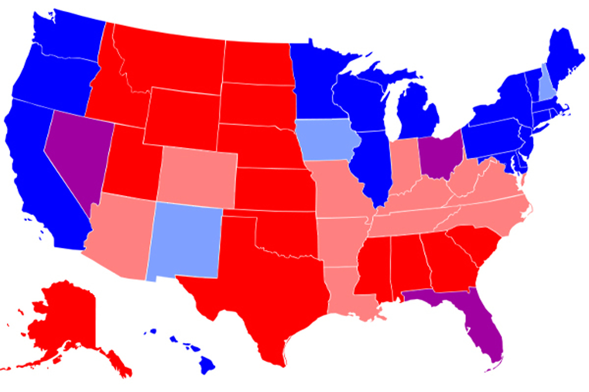
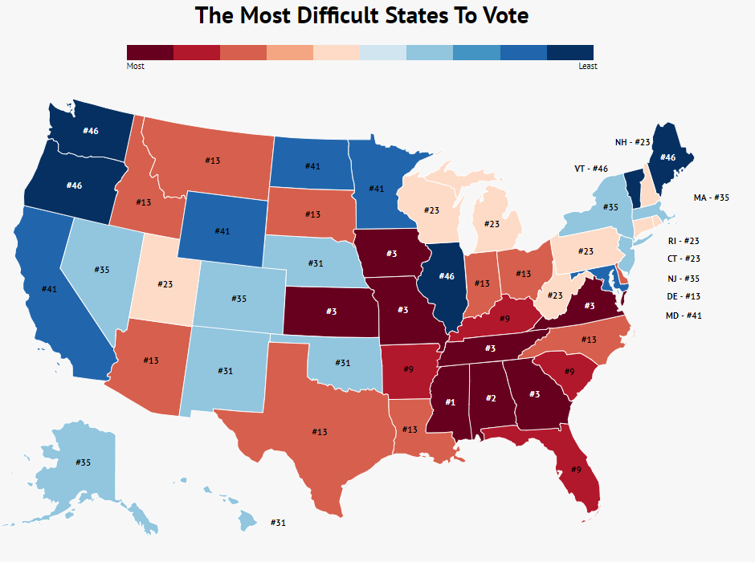

# Manipulating Elections With Statistics

Source HTML: [`html/2023-02-26-manipulating-elections-with-statistics.html`](../html/2023-02-26-manipulating-elections-with-statistics.html)

# Manipulating Elections With Statistics

| 항목 | 값 |
| --- | --- |
| 날짜 | 2023-02-26 |
| 접근 | 무료 |
| URL | https://www.algos.org/p/manipulating-elections-with-statistics |
| 부제 | How one simple policy could massively skew votes into the blue |

---

Discover more from The Quant Stack

Articles about cool quantitative research

Over 23,000 subscribers

Subscribe

By subscribing, you agree Substack's [Terms of Use](https://substack.com/tos), and acknowledge its [Information Collection Notice](https://substack.com/ccpa#personal-data-collected) and [Privacy Policy](https://substack.com/privacy).

Already have an account? Sign in

# Manipulating Elections With Statistics

### How one simple policy could massively skew votes into the blue

[Quant Arb](https://substack.com/@quantarb)

Feb 26, 2023

7

Share

#### DISCLAIMER:

This post is basically all statistics and watered-down game theory. No political views are expressed, and I intend to keep it that way. We are a little off-topic in this post, so consider it more of a special edition post. Next post we will talk about some seasonality effects around election dates, carrying the theme, but back to markets.

Quant’s Substack is a reader-supported publication. To receive new posts and support my work, consider becoming a free or paid subscriber.

Subscribe

#### Some Statistics From The 2016 US Election

Using the below table from the 2016 election, we can see that there is a clear relationship between age and political preference. I’m using 2016 since it was a lot closer to 50/50 (by popular vote) than the 2020 election. This makes our results more generalizable.

For our second chart, we can see voter turnout by age group for the 2016 election. We can also see a pretty clear trend, one that is reinforced by historical data, that younger voters have a lower turnout

How could this be exploited? For the Democrats, this is done by getting young people to vote. This is why there was a massive push for this coming from the democrats during the 2020 elections. There is also a strategic, although a little less democracy-friendly way to do this in reverse.

If you can lower the turnout of younger people, you favor the Republicans. You can also exploit the fact that lower-income people favor Democrats and increase the cost of voting (mostly time cost) through adding extra “background checks” etc. This is why the map of hard vs easy to vote states lines up nicely with red vs blue states.

Here is our map of red vs. blue states.

Here is our map of hard vs. easy-to-vote states:

The relationship here is pretty self-explanatory.

#### 

#### Some Strategy

If Democrats manage to gain control, they can pass one of two laws:

-        Everyone must vote by law (like in Australia)

-        You get a stimmy check if you vote (regardless of how you vote)

Both of these increase the chance that poor or young voters will go out and vote. This would skew the probability in the Democrats’ favor for a long time.

#### Some Dirty Math

18-24-year-olds have a 21% edge in favor of the Democrats, and 24-29-year-olds have a 14% edge in favor of the Democrats. These populations are similar in size so we can roughly assume a 17.5% avg edge. 65+ year-olds have an 8% edge in favor of Republicans (according to 2016) data.

18-29-year-olds are also roughly similar in size to the population of people over 65 in the US. We will ignore the middle age ranges as these are closer to 50/50, and also, I am lazy. As a rough figure, we will use 42% as the turnout for 18-29-year-olds, and 68% for 65+-year-olds.

Both population groups are about 55 million people, maybe a little more. This works out to 9,625,000 net votes in favor of democrats for 18-29 (with 100% turnout) and 4,400,000 net votes in favor of Republicans for 65+ (also 100% turnout). A net difference of 5,225,000 for democrats.

Applying our turnout rates, we get 4,042,500 net democrat votes for 18-29 and 2,992,000 net republican votes for 65+. This is only 1,050,500 net votes toward democrats. Our net difference increases 5x, by over 4 million votes, when we force everyone to vote.

This of course does not include the middle age ranges but the general idea still stands. An enormous edge is given to the Democrats by passing a single law, now that’s what I call strategy.

As always, please leave political views at the door and focus on the statistics :)

Quant’s Substack is a reader-supported publication. To receive new posts and support my work, consider becoming a free or paid subscriber.

Subscribe

7 Likes

7

Share
