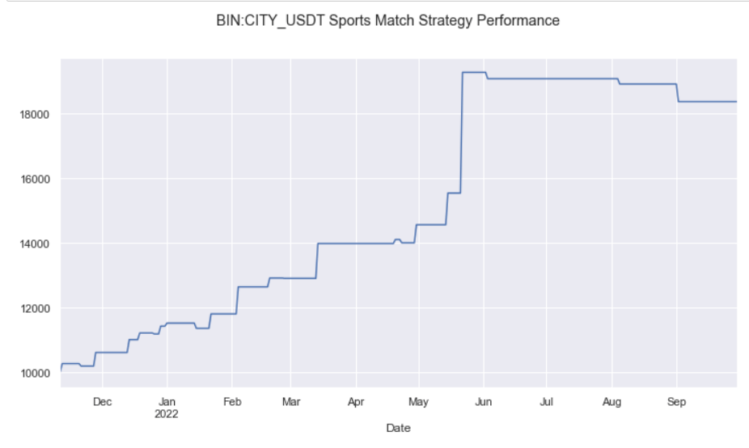
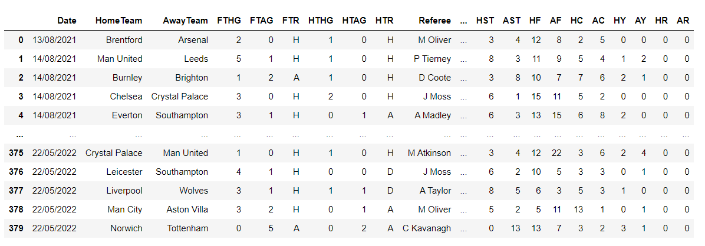
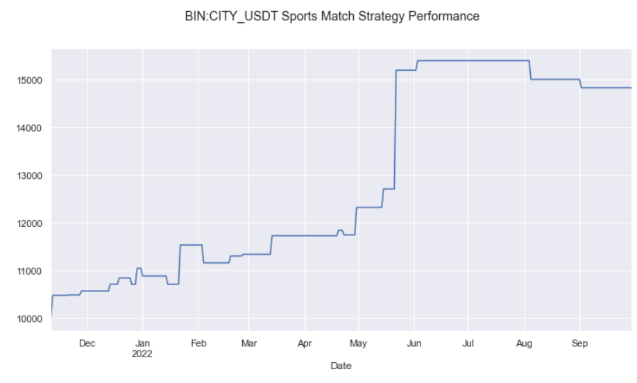
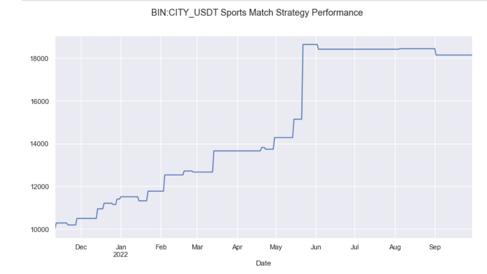
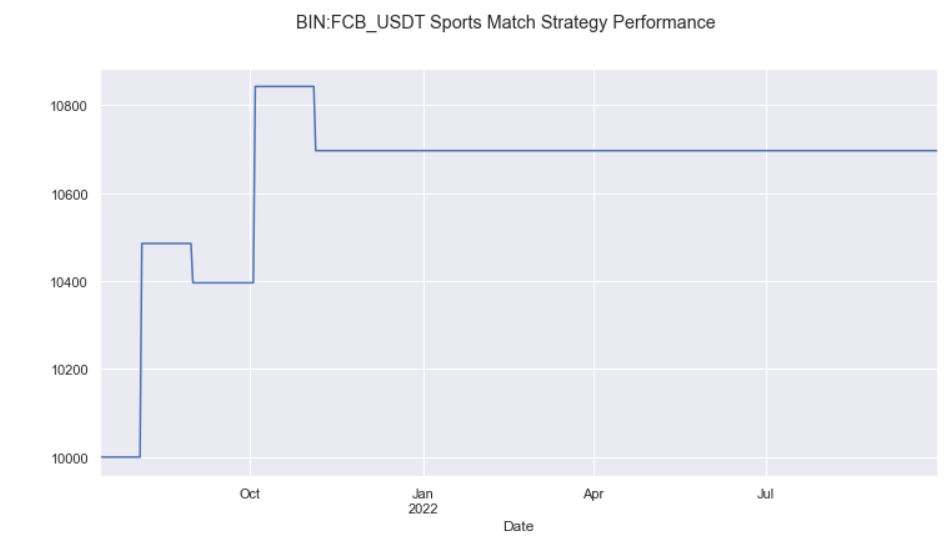
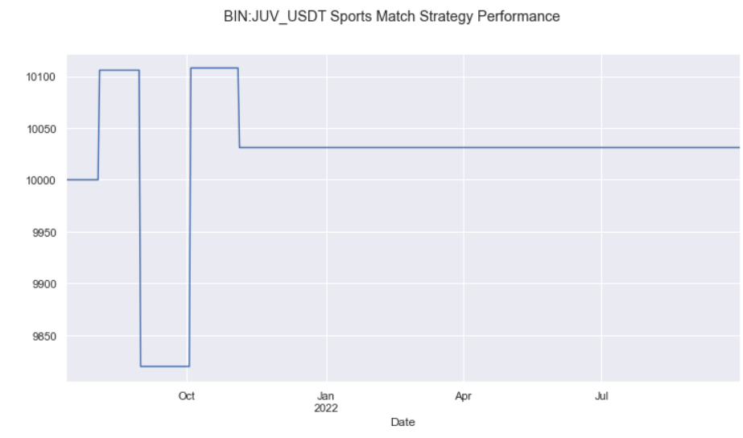
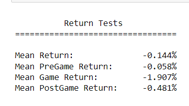

# A Novel Approach to Frontrunning Drunk Brits

Source HTML: [`html/2023-03-01-a-novel-approach-to-frontrunning.html`](../html/2023-03-01-a-novel-approach-to-frontrunning.html)

# A Novel Approach to Frontrunning Drunk Brits

| 항목 | 값 |
| --- | --- |
| 날짜 | 2023-03-01 |
| 접근 | 유료 |
| URL | https://www.algos.org/p/a-novel-approach-to-frontrunning |
| 부제 | Diving into the match date effect in sports team stocks & their digital fan tokens |

---

#### Introduction

---

Sports teams have large fanbases and their performance in matches is often speculated on by these fans. This is then reflected in the performance of assets associated with these teams. Many teams will either have a publically traded stock or a fan token cryptocurrency. In this article, we will explore how match dates can be traded to generate some shitcoin alpha. This is a partially novel piece of research.

Quant’s Substack is a reader-supported publication. To receive new posts and support my work, consider becoming a free or paid subscriber.

Subscribed

Results on just the Man City football club token were found to be attractive. Only, CITY, FCB, and JUV were tested but there are many more fan tokens. We only tested these 3 since they were the only ones in the first dataset I found. Capacity does severely limit it, this is discussed later on in the research article.

#### Methodology

---

Sports teams tend to see their associated stocks or tokens collapse in price prior to a match. To profit from this we take a short position on the day before the match. In equities, we tend to see this collapse take place the day, or even days before a match occurs. This is likely frontrunning of this effect by traders as prices collapse on the day of the match instead for fan tokens.

To exploit this effect in digital assets we short any sports team token on the day before the match, and then wait until the end of the next day to close our short position.

We further improve the risk/ return profile of the strategy by introducing a delta-neural hedge. We not only short fan tokens, but we also hedge with a long in BTC. This is wise as shitcoins will follow BTC to the moon on a pump day, and you definitely don’t want to be on the other side of that.

The application to digital assets of this effect is not currently in the literature so this article is partially novel, but the original effect in equities has been documented before in research papers.

#### Fundamentals

---

This effect is present in both stocks and cryptocurrencies, but the question of why it exists is still important for assessing the reliability of this effect.

Potentially, this could be a risk premium that is created by market makers reducing their inventory (selling) prior to a match.

The other hypothesis is that fans sell prior to games because if they wanted to bet on the match they would have done it on bet365.

In my view, the market maker explanation is probably the most viable, and you could certainly test this by looking at the change in orderbook liquidity around events.

#### Data

---

Binance has partnered with quite a few sports teams over its history and as such there are many different fan tokens. Some aren’t even on the website anymore like FCB, JUV, and CITY, but they still trade on the exchange. The latest fan tokens Binance is pumping are the Alpine F1 team and some other teams I couldn’t find event data for.

We will be using the VWAP price because these are shitcoins, so you can’t use close. Trading at the close is often unrealistic for certain coins so we try to avoid it. There are also large spreads on shitcoins so if the spread is 20 bps and a buy trade ends a candle, then a new candle is ended by a sell trade you will see a 40 bps change in price just from the bid/ask bounce. This is how you find mean-reversion where it doesn’t exist like a goon.

#### Testing

---

We first look at the Man City token, we generate the below performance using the first method that does not hedge in Bitcoin. The win rate can be improved by using the improved approach which hedges in Bitcoin.

The below results are with the improved approach:

We achieve a smoother and fundamentally safer PNL curve. Note that this performance is without leverage, these are just unbelievably volatile.

The performance for the above FCB and JUV tokens is much less because the strategy didn’t put in many trades for these assets. This was because my match dates dataset was shitty and I’m not paying for a better one. If you compare the first 2 or 3 trades for CITY you can see that the PNLs of FCB and JUV are not enough to accurately model them.

Using this results table from CITY we can see that this performance is significant not just before or during the game, but even after it has occurred. This was sampled with hourly data.

The effect has been documented in the literature for equities and is clearly strong in CITY so we can pretty comfortably conclude that this effect is genuine. Eager readers are open to replicate this analysis with more teams and better match dates, with emphasis on the better match dates.

#### What’s the catch?

---

There’s a good reason this effect exists and at such a profitable level. If someone actually bothered to get the data for the 10 or so teams then they could make hundreds of % returns based on the CITY performance of 80%, but of course, there are catches.

The first and least painful catch is that the teams are hard to find. The 10 team tokens figure from before is a rough estimate of the ones I know exist. The CITY, JUV, and FCB ones are practically hidden since Binance has new favorite tokens. A quant would need to search for them all for a bit - probably pulling the full token names for each ticker from the Binance API would do well.

The second catch is plainly the poor liquidity. You would probably only be able to get a hundred grand through this trade. Maybe 200k if you got a more liquid one. Good execution days before the match could likely get this higher. Bitcoin will easily eat that size so no worries about the hedge. The trade returns are over 2.5% so there is room for market impact but it costs about 1% to execute 50k on CITY. Lower liquidity in this current market, it used to be about 100k, but still terrible size.

The last catch is the hardest to get around. This is the short-margin problem. You can sometimes get a few hundred dollars worth of margin on these coins, but to get any real margin you would have to get an OTC deal with someone who owns a lot of these tokens. Perhaps try haggle Binance OTC (they probably are sitting on a few) or speak to Man City - unlikely.

#### Conclusion

---

Everything has a catch, there are reasons these effects exist. If the reason is someone is very dumb and you have found a good one, but they tend to be short-lived and eventually decay. Here we have an amazingly profitable strategy, but only tradeable in size (if there was even much to begin with) after serious operational hurdles are overcome.

The two lessons of this research are that alpha is hard - you have to earn it and also that unusual but simple ideas are often some of the best ones to dig into.

If someone wants to give me more data for different leagues, even other sports like F1 I would greatly appreciate it.

Subscribed
