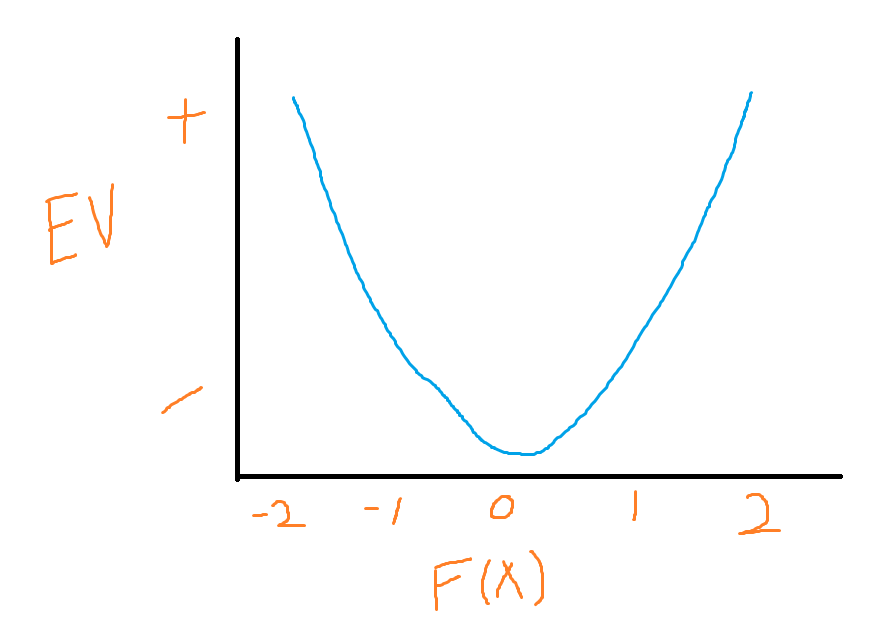
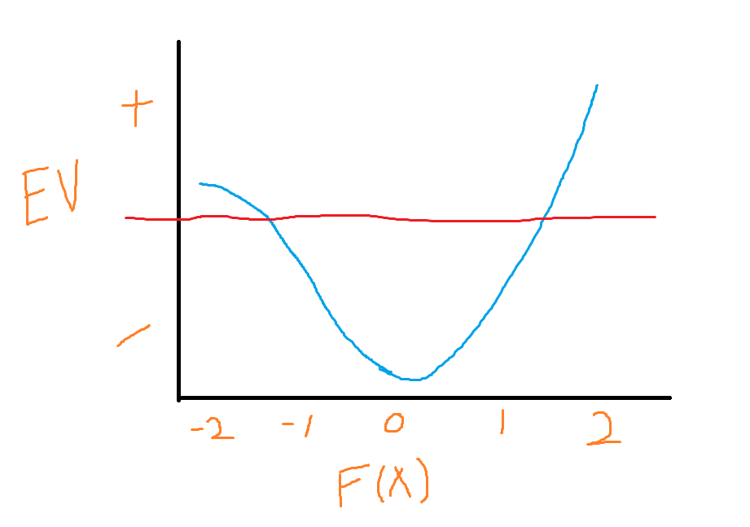
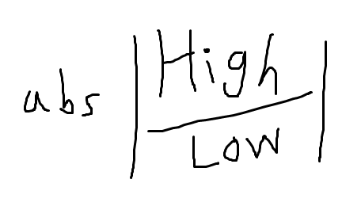
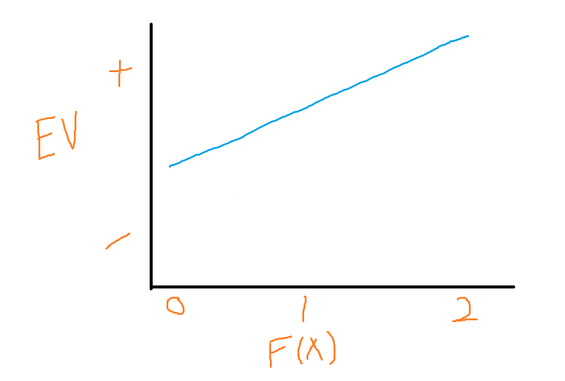
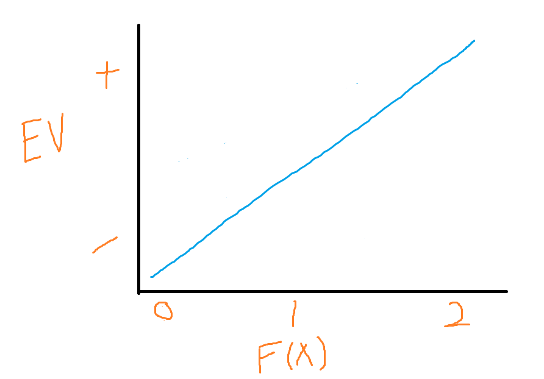
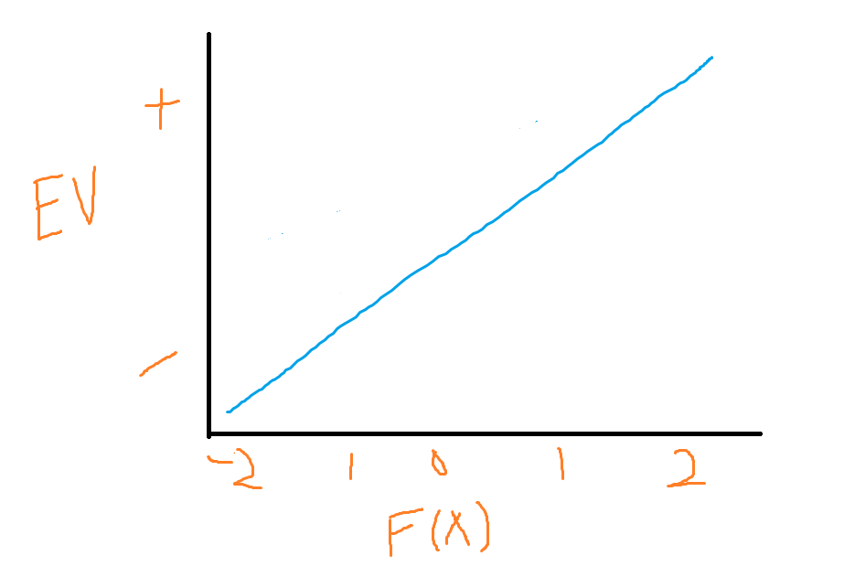
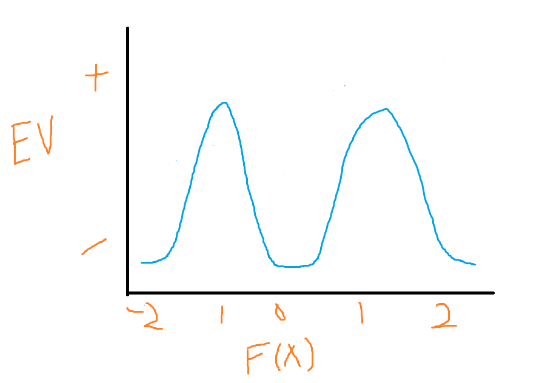
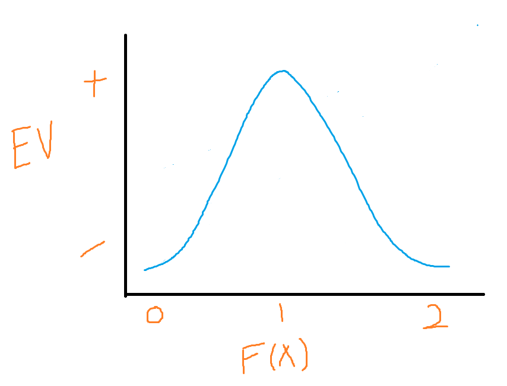

# Non-Linearity Without Machine Learning

Source HTML: [`html/2023-04-16-non-linearity-without-machine-learning.html`](../html/2023-04-16-non-linearity-without-machine-learning.html)

# Non-Linearity Without Machine Learning

| 항목 | 값 |
| --- | --- |
| 날짜 | 2023-04-16 |
| 접근 | 무료 |
| URL | https://www.algos.org/p/non-linearity-without-machine-learning |
| 부제 | How quants actually deal with non-linearity in their features, a visual walkthrough |

---

#### Introduction

---

A lot of people think of neural networks or fancy machine learning when they hear “non-linearity”. Yes, the market has a LOT of non-linearity, but it also has a lot of dimensionality and noise. Things that scare off any of these models when used to capture this non-linearity.

In this article, we will show how to actually deal with non-linearity through the fundamental design of alphas. I’ll keep it nice and visual so that there is a lot of intuition. Intuition and fundamental reasoning about things are what guide the research process, not complicated black boxes.

All of these examples will look at how we can capture a non-linear effect without doing anything more than using ranked long/short or linear regressions.

Quant’s Substack is a reader-supported publication. To receive new posts and support my work, consider becoming a free or paid subscriber.

#### The Absolute Transform

---

Expect to see the below diagram quite often throughout this article, but effectively our Y axis will represent our expected value (EV), this is our edge, or otherwise, whether this predicts the market positively or negatively. On the X axis, we will have our feature, our alpha, our metric, our function. Any formula that we use to predict the market. We note this as f(x) and it could be as simple as high/low.

We can see pretty clearly that this alpha has some non-linear behavior. If we tried to do ranked long/short, ranking each asset on this alpha, then long the top 10%, short the bottom 10%. Our long portfolio makes a fortune, but our short portfolio loses a fortune. How would we check for this? Well, we would look at the long positions as a PNL curve and the short positions as a PNL curve. Then, we look at them both without fees.

Why do we do this? We are checking for non-linearity where it isn’t the direction of the alpha, only the magnitude that predicts markets. When we observe the long portfolio doing really well, we know that it is fine to leave, but the short leg is bleeding, let’s dig into that.

After we remove fees we can answer the question: “Is it just losing money because it is a hedge leg that is flat EV (pre-fees) but hedges out or risk?”. If it still loses money maybe we are trading it short when it really should be long. Maybe it doesn’t beat fees when we flip it long because our relationship actually looks like this:

In this scenario, it is definitely not a short hedge since it is still slightly +EV, but it is only slightly above EV and maybe that isn’t far enough to beat fees. The very positive values for f(x) on the other hand have a much higher EV and can beat fees.

What is the solution for these two charts? Well, for the first chart, our solution is to take our formula (let’s go with metric 1 / metric 2 (maybe high/low???), but I did just make this up so it isn’t a real alpha) and absolute it.

With this new formula, we take our chart (the first one) and turn it into this:

We’ve basically got a long-only alpha so maybe we add a short market index position to get delta neutral instead of a hedge leg that is betting in the wrong direction.

#### 

#### The Z-Score

---

It could also end up looking like this. What do we do here? We take the z-score of our alpha, on top of the absolute value transform we already made. We then have this:

We could have ranked our alphas and done long/short top/ bottom 10% without the z-score, but now we get a bit more intuition with the z-score and can size it with this information in hand.

#### When not to mix them together

---

Let’s go back to our second chart:

This one is such that it doesn’t make sense to apply the absolute transform because the short side is a LOT weaker than the long side. If we do that we will throw a load of less attractive positions into our portfolio having thrown away the info necessary to discriminate between them. Here it makes sense to throw away the values below 0. Long the top 10%, and use the market as our short hedge.

#### An example from pairs trading

---

Here we have one with quite an odd shape, we can see that it probably makes sense to take the absolute first. We then end up here:

For pairs trading this is very often the case. Too far a deviation and the regime has shifted, but too little and you won’t beat fees. We would probably put a long on at 2SD and a stop loss at 3SD with a take profit at the mean for this. Then we know our exits are only when we have no alpha (either because the edge turned against us or because we captured the mean reversion so the trade is over).

If this was an alpha perhaps it might be momentum. We want to see if the price has a drift, but we don’t want too sharp/sudden of a move because that will probably reverse. For momentum, we would prefer to think fundamentally about it, however (more on this next).

I’m sure the reader can still figure out what transformation would be needed to put the relationship back into a nice line that can be traded easily (hint: z-score it, absolute it, invert it).

#### Conditionals & Fundamentals

---

Back into the context of momentum, we can now move away from just the relationship of this feature to our expected value and think of conditionals. Let’s list some conditionals & fundamental flows:

1. Volume
2. Long Term % Change (OR Moving Average) To Filter Regime
3. Volatility
4. Hurst Exponent
5. Information Discreteness

Volume is a good one, this is something we can condition on, perhaps we adjust for the z-score so that we are now looking at each asset’s relative “unexpected interest/disinterest” from the market. Do we z-score against past volume or relative to other assets? Up to you, that’s part of the research. Many different effects are very conditional on one asset moving more than the other, if this is influenced by volume perhaps this is a risk premium (people forced to hedge blows out prices) and we expect it to revert OR maybe it is a sign that the other asset has been ignored and is yet to catch up. It is YOUR job to do this research and determine whether it will revert (this is momentum, unexpected-high-volume → overreaction → reversal) or if another will catch up (pairs trading / lagged relationships).

The long-term % change of the market index or generally if above or below the moving average can help classify flows. Okay, so our alpha pretty clearly predicts when a lot of non-price-sensitive flow will hit the market, but gosh darn it only works in bull markets. Perhaps this flow isn’t one-directional. If it is hedging flow you should try to figure out what they are hedging, maybe this is the market direction, but this is only an example - you should think long and hard about this to make sure you get the right filter. Then you test it. Otherwise, you’ll overfit trying a million solutions. If you test and fail → consider it a game over. Any more tries and you’ll overfit. If it is a massively significant and robust alpha after retrying maybe we make an exception, but everything should be informed by robustness & fundamental reasoning. If we have a pretty eh reasoning and it works with an okay-ish Sharpe, then let’s call it a day and give up.

Volatility comes back to non-price-sensitive flows. Perhaps this alpha only works when people are in a panic. They aren’t hedging like with the regime filter, they are FUDing out of this asset. You should also use volatility to size anyways.

Hurst is your mean-reversion, this is just another way to classify the market. Mean reversion is a bear market typically. Trending in a bull market. It could also give us information about the participants we are profiting off of if the price doesn’t have a clear direction.

Information discreteness was covered in the last article on momentum and is just whether this move was sharp or gradual. Generally, we can look at the shape of this move. Do we see large sudden spikes being the most profitable or the killer of performance? Maybe we want the slow and steady OR perhaps the slow and steady means that a trade is slowly getting overcrowded and eventually must collapse (slowly milking a dead trade)?

#### Thinking long and hard

---

It may sound a bit like you could justify anything here. In this case, it worked, but here it didn’t → it must all be noise. This is not the way to go about it. For momentum, we want a slow gradual move because we want our effect to be driven by flow/psychology, NOT news that will be overreacted to and then reverse. We need to think long and hard about the why. These transforms and conditionals are merely tools for us to express our hypothesis.

We have shown charts in this article, but if you just look at the relationship, then modify, test, and repeat until it looks good you will probably overfit. The two humps example from pairs trading has a fundamental reason. A deviation can either be news or noise. Noise should not have fat tails (risk premiums can, but noise typically doesn’t), the larger the deviation, the less likely it is to be noise and thus it is a true shift of the regime/relationship which we don’t want to bet against.

If on the other hand, we felt that this was a risk premium, and maybe we have some way to determine if there was any news (maybe even just having to do it manually so we aren’t buying a company that just announced bankruptcy) then we would have to look at it from another perspective. Maybe this is some sort of overreaction we want to capture when it reverses. If it is a slow and steady move then that probably isn’t FUD/anything in the category of events that cause overreactions.

#### Fundamentals Come First

---

We cannot just sit and test every conditional until it makes our alpha work. We must sit and think about why it doesn’t work. You should try to limit how much of the actual data you look at. Just peeking at the long portfolio and the short portfolio might just be the hint you need to then reason about it.

We have chimp brains, if you give us a scenario where it worked we will always make up some reason that confirms this. If someone said I tested it with 1 condition and a second condition and despite being quite different conditions. it worked for both then, I wouldn’t be confident in their alpha. If they then said that both conditions confirm the same hypothesis, a hypothesis they came up with and stuck with before testing, and then saw that all the conditions that were inverse to their hypothesis failed, I’d suddenly be quite interested in this alpha.

There is a lot of intuition to master, and the balance between peaking at the data to get some ideas vs. peaking at the data to make up a reason is a hard one. Make sure you approach with a hypothesis before testing, then test like hell to try and prove yourself wrong. Your alpha needs to be unquestionable and what that threshold is should depend on the strength of the effect, the reasonability of your idea, how robust it is to little parameter changes/noise, and how much you had to test to find it.

#### Conclusion

---

We have given many examples of scenarios where a conditional means something entirely different than another. It is much like any other thing in life: seeing someone use a wooden plank to smack someone in the face isn’t a sign that a wooden plank is always a dangerous sign, in fact, it was conditional on their angry face it being raised over their head. This is our short analogy :) Our long might just be someone relaxing on their porch sitting on a chair, resting on many planks. A beer in their hand is our conditional that it is a good thing. The same concept applies to alphas.

It is not necessarily that these transforms/conditionals always are a sign that every alpha will now be positive, they are merely a tool that is used differently in a variety of scenarios. This was a bit different than my normal articles and isn’t nearly as formal nor as instructive/ practically driven, but I hope I’ve provided some valuable intuition by shooting off thoughts over some examples.

I’ll conclude with a nice long list of key points:

- Machine learning cannot do cool fundamental reasoning like humans so is equivalent to you testing each transform until one works. It isn’t a great idea.
- The hypothesis comes first, otherwise, you will just make one up after the fact.
- Different effects/reasoning lines beg different conditions. X condition is not always bear or bull.
- Some alphas just do better on the long/short side and it makes sense to capture them as such.
- Non-linear relationships can be made linear with simple transforms, but check why this relationship exists and think about it first.
- Note how much you had to test to get here, that influences how robust an alpha is.
- If your hypothesis fails - give up. It sucks, but we have to be strict so our alphas are unquestionable.
- Reason about when an alpha will make or lose money before you run the backtest.
- It will lose money in a bear market is generally true of many things, a regime filter only works if there is flow that will trade in line with the regime. Otherwise, it is a risk premium and sadly you have to put up with that drawdown to earn it.
- Think about non-price-sensitive flow long and hard. FUD or hedging? FUD may cascade so we ride the momentum and exit with a trailing stop, or maybe it’ll reverse and we capture that. Hedging is much calmer and we don’t expect reversals unless the hedge direction changes.
- Think about human behavior, is this what we expect to see happen?
- The best alphas are very simple but the process to make them took a lot of brain power from some extremely smart people reasoning about the world. It may just take a simple conditional to turn a simple effect into a great alpha, but that is true of most overfit-able alphas so think about why. More testing / weaker idea → need to see a much stronger Sharpe on this effect.
- Did news / new information drive this move? What are the implications? Is this a good thing (reversal captured and I get some alpha) or a bad thing (false flag move not caused by any sort of risk premium or psychological effect)?

Subscribe so you don’t miss the next article. It is not always that I post them on Twitter so you may miss them otherwise. I also enjoy seeing the number go up.

Quant’s Substack is a reader-supported publication. To receive new posts and support my work, consider becoming a free or paid subscriber.
