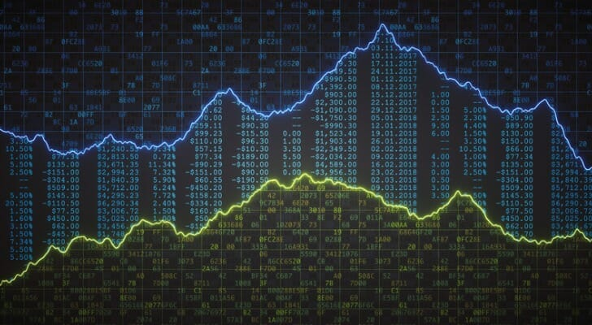
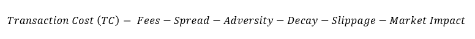

# Execution - Without The Fluff

Source HTML: [`html/2023-04-24-execution-without-the-fluff.html`](../html/2023-04-24-execution-without-the-fluff.html)

# Execution - Without The Fluff

| 항목 | 값 |
| --- | --- |
| 날짜 | 2023-04-24 |
| 접근 | 무료 |
| URL | https://www.algos.org/p/execution-without-the-fluff |
| 부제 | A deep dive into execution models and how things really work. |

---

#### Introduction

---

There isn’t a lot of high-quality information when it comes to market-making and execution. It is important to note that a lot of execution is effectively the same problem as market-making. Especially when it comes to the transaction cost part of the problem, it is very similar to market making.

In this article, we will take a deep dive into execution and market making. What to actually look at, and what is just academic fluff. A great deal of the literature is an afterthought for most practitioners and doesn’t readily apply to markets.

#### Two Objectives

---

When it comes to execution, we can generally break it down into 2 objectives. How we prioritize these objectives greatly affects the mental framework used to solve the problem. Generally, these two objectives are:

1. Transaction Cost
2. Capacity

The first one of these, transaction cost, is made of these components:

Our second objective, capacity, is plainly how much size can we execute. Our concern changes drastically as we move from executing an order with a reasonable size to get the best possible TC all the way to “How can I execute a lot of size as best possible?”.

This all comes down to what market forces you are fighting against. For execution problems where you are executing large size, you are the one creating the adversity. Your own impact on the market and the liquidity present is what hurts your execution. On the other hand, we could have a strategy with an arbitrarily small size, say $1,000 - this is small enough that we aren’t likely to get past the best bid/ask. Our main goal here is to avoid adversity from others that are more informed as well as prevent the decay of our strategy’s signal.

#### Scenarios Across The Spectrum

---

We can view the need for capacity vs the need for transaction cost efficiency as a spectrum.

At one extreme we have an agent that simply wants to get the most money possible out of an enormous amount of size. Perhaps this is the CEO of a pump-n-dump company who wants to sell all their shares, they know their company is an overvalued SaaS blockchain AI tech company and have a very small utility from owning these shares (because they aren’t worth shit in reality).

This company is worth maybe 1% of its current price, but how do we compare this to a quant strategy with an alpha signal? Well, we can just view it as a signal that the price will go from 100 to 1 over some long horizon and with a strong level of probability/confidence. Unlike a short-term alpha, we have a LOT of room to pay for transaction costs since our signal is so strong (in both confidence and magnitude).

Our signal is so strong that we might be willing to pay a 99% transaction cost since our view is that it will be worth 1% of its current price if not sold anyways. I will add that we can never have 100% confidence (although some clients of execution desks may trade as if they have 100% confidence) so would want to discount our signal by its probability (meaning we wouldn’t quite be willing to pay 99% transaction costs in theory, but perhaps this CEO is very convinced and will treat it as 100% confidence).

There is no point thinking about adverse fills or costs related to other participants being smarter than us (other than in detecting our flow), we are simply trying to absorb as much liquidity as possible. In our extreme example, we are entirely our own enemy, and it is our impact on the market which costs us. Exchange fees, slippage, and adversity all become close to negligible. Spread and market impact overlap in some ways, but I like to keep them separate. If we place a limit order inside the spread (tighter than BBA) we will have an impact on the market, even if we don’t get filled / deal with any spread, we will still move the price. Finally, we are concerned with signal decay. Maybe we know that a short seller is about to release a report in 30 days on our company, if we fail to execute in 30 days, our signal will have decayed as the price moves and we are unable to capture it.

Going to the other side of the extremes, we have an agent with a short-term signal, perhaps a few hours, and $1 of size. Their alpha does incredibly well if they can get costs to 0.5 bps, and does very poorly above 3 bps. Their base case is taking BBA, say this is a BTCUSDT perpetual on Binance, we would pay 1.57 bps in taker fees and 0.5 bps of spread. This spread will vary a lot and is only a rough number. We can see <0.1bps all the way up to 60 bps+ during a CPI release. It may not always make sense to be a maker, and we will explore this in a later section, but assuming maker is optimal we now need to prevent getting adverse filled. Adversity and ensuring we earn the rebate (-0.5 bps for our example) are our key focus if we are making. Taking has slightly different concerns and will be covered later.

The most common example is somewhere in the middle. Whether this is such that we want to try and execute $100m for a large hedge fund or just trying to efficiently trade a short-term alpha with <$100k running through it. Whilst I am using absolute USD terms it is important to normalize this amount by the liquidity of the market. I won’t do this explicitly, but remember that $100k executed into a shitcoin is quite a big impact vs. not even getting past the first level for BTC.

#### Signal Horizon & Execution

---

It is important to note that where we fall on the spectrum is usually influenced heavily by the timeframe of our strategy and its signal horizon. When executing large sizes you cannot get around the fact that there will be a high cost of trading so you must use alphas that have more EV and can afford said costs. This is almost always a longer-term strategy that trades less but makes more on each trade. If I introduce 20 bps of cost into an HFT strategy, then it is pretty likely I will lose a lot of money. If I give this to a multi-billion dollar hedge fund that rebalances sparsely then 20 bps might even be a good deal.

One end of the spectrum (cost concerned rather than size) is more a task for HFT & MFT firms which have high turnover and make small, but frequent gains. The other end is primarily occupied by execution desks / large funds / banks selling execution algorithms.

#### Transaction Cost Breakdown

---

As seen we have 6 key costs (or potential credits) toward our final TC. Listing them again:

1. Exchange Fees
2. Spread
3. Market Impact
4. Adversity
5. Signal Decay
6. Slippage

The first of these is the simplest to calculate, this is just the fee we get charged by the exchange. Most exchanges use a maker/taker model where we earn different fees based on whether our order got paid or crossed the spread. For the majority of exchanges, the maker fee (at the highest tier) will be negative, earning us a rebate. Otherwise, we expect to see a positive fee (and for many lower tiers we may still pay a positive fee on the maker side). The optimization here is mostly about haggling with the exchange / making a lot of volume to move up the fee tiers.

The spread is the difference between the bid and the ask price, if we buy at the bid we earn the spread, but we pay it if we buy at the ask. I like to swap between spread and market impact based on which end of the spectrum we are on. The majority of firms that sell execution as a service will be looking at the size side of the spectrum - market impact. HFT / MFT firms will be looking at the spread because there is more focus on how can we not cross it. We will have far less consideration of how we actually impact price. Despite this, we will still see some impact even when using limit orders.

Adversity is a big one for the HFT / MFT side of things. We want to make sure our quotes are not easily arbitrageable so that we don’t get adverse filled. The simplest way to do this is to quote wider (how wide our spreads are can be thought of as our error term, a larger error term lets our price prediction be less accurate), but this will likely be inefficient and will take a long time to get filled. Thus, if we post wide we will see a lot of cost from signal decay while waiting for a fill. We will talk about adversity and its main sources later in the article.

Signal decay is another big component. This relates mostly to how aggressive your execution should be. If this will decay in a few seconds because you are reacting to an event it probably makes sense to take, but if this is an alpha that is realized smoothly over a few hours you have a lot of room to use limit orders to get filled. This was touched on in the recent podcast episode with Chris Kvamme.

Finally, slippage is the difference between the price you see and the price you get. This is best thought of as latency cost / being too slow to catch the trade. You may also see this if you are getting frontrunned (some exchanges in crypto, even major ones, do this) where you hit non-existent levels. This is another one that applies mostly to HFT / MFT execution problems. Not every alpha competes on latency and if slippage is a make-or-break component then you probably aren’t getting your edge from the alpha, the edge is in the latency. Think about whether this is worth competing on, “What is the cost-benefit to optimization?”, and if not move on.

#### Trying Not To Get Adverse Filled

---

I’ll dig into adversity and how to optimize it first because the HFT/MFT perspective on execution is probably an area I am more knowledgeable in / one that has a lot less available information.

Our most basic implementation would be to place a limit order at some fixed bps offset from the midprice and follow the midprice to keep it in line. Our first optimization is to find the sweet spot between getting filled and being wide enough to minimize error cost. If our adversity model is poor we will have to accept a low fill rate if we want to keep our costs attractive by posting our order wide.

Speaking about digital asset markets specifically (not the case in equities), the largest source of adversity is arbitrage. This is why execution is a lot of work, you now have to consume data from multiple other exchanges to ensure that your quotes don’t create an easy arbitrage for someone else. Many exchanges will be irrelevant, and it is important to make sure you only consider exchanges that will affect the price. Small exchanges may create an arbitrage, but if it is for $300 and the BBA on Binance is close to a million dollars, we probably won’t see any meaningful % of it even if we are on BBA (which we don’t have to be). The main ones to worry about are large dislocations on major exchanges caused by impactful orders moving the book.

This is a very hard task, but luckily with execution, we don’t actually have to make money executing the alpha. If we were market-making, quoting these prices with the intention of staying flat and earning from our negative cost, then we would have to worry, but if the taker fee is 1.57 bps + 0.5 bps of spread, 0.5 bps of cost is still very attractive even if it is positive.

It becomes important to take into account these alphas with execution. We still don’t beat the threshold needed to actually make use of this arbitrage / make money doing it, but this is the simple stuff everyone is doing and we should be doing it as well.

The next one is to look at the imbalance of the order book (OFI - order flow imbalance) and make sure to quote properly in line with that. Generally taking signs from other market makers is also a smart idea. If the market gets wide all of a sudden, that likely means news has happened and we shouldn’t be quoting so tight.

Market making is very hard and not getting arbitraged + accounting for OFI is really just the basics that all smart participants will be doing. It is unlikely to make you any money as a market maker, but it sure helps you beat the much easier baseline of taker cost as an execution algorithm.

#### Signal Decay

---

Signal decay, fill probability, and signal strength will be the main factors when deciding whether to make or take as an MFT or HFT player. If your signal has a strong strength then you can afford to take, but if it is weak (and especially if the spreads are wide) then you can’t afford to be a taker no matter what.

Sometimes in the scenario where you can’t afford to take you may have to give up because you aren’t going to get filled either, but other times - especially with more mid-frequency alphas you will have time.

Signal decay is central to this problem. If we are reacting to news information we have many elements that make taking worthwhile:

- Strong & Clearly Causal Signal (large EV per trade gives us more room on costs)
- Reasonable Spreads (only if you get there first, if you are slow this is an issue)
- Rapid Signal Decay (News is priced in within seconds, and spreads blowout in milliseconds)
- Persistent Price Behaviour (will touch on this in the next section)
- Low Fill Probability (MMs are pulling quotes, and the amount of uninformed flow that occurs over this period will be swamped by the massive amount of toxic flow)

If we try to make we will not get filled, and end up moving our limit order constantly to chase the price (regularly putting ourselves at the back of the queue on each modify - queue position doesn’t matter much for most exchanges, but BitMEX has a large tick size so for that exchange it does matter). I think most people would realize that taking is the way to go here.

Now our middle ground case is trading price action directly after the news, in this case, we are merely trading the effects left by the news and don’t actually need to have the news release data ourselves (large events create a lot of volatility, panic, and room for mispricing). We end up with:

- Weaker Statistical / Less Causal Signal (less room for paying away costs)
- Spreads Wide AF (high cost as a taker + fairly large benefit if filled)
- Antipersistent Price Behaviour (easier fills, but this gets its own section next)
- Lower Signal Decay (longer window, the market will have clear reaction effects for all the beyond an hour after the news if it causes enough FUD, but likely the first 15 mins we care about - more time to get filled)

We know we won’t make much money as a taker because the costs are too high and our signals are weaker, but we do have a little more room to get filled. This is still a middle-ground case because getting filled is not easy and we need to really think about how to nail a fill.

Finally, we might have an alpha that is realized steadily over 1 hour. Perhaps this is a momentum or mean-reversion trade that doesn’t suddenly jump up or down, but slowly continues its trend (for momentum) or converges at a steady pace (for mean-reversion). It is realized over a longer period so MMs quoting against it will receive far less adversity (50 bps [arbitrary #] of toxicity is easier to manage when it occurs over an hour, with plenty of time for MMs to get in / out, vs. over a few seconds where they will likely take the full brunt of this).

#### Persistence, Persistence, Persistence

---

I’ve talked about Hurst a fair bit in my articles because it is a very useful indicator. We are basically balancing mean-reversion vs momentum, but this is quite interesting in how it relates to execution as well - not just alphas.

It is generally true that we will have a hard time buying into a trend / order-book imbalance. A trend should create an imbalance, and then we are stuck behind the same asymmetric queue on our limit order and end up chasing the price. We can generally think of it as “What direction does everyone and their mother want to trade into?”. If everyone wants to buy, and we see that clearly in the imbalance (which will often occur because the price has positive momentum) then we will have a pretty easy time getting filled as a seller.

Now, this requires us to have a very good alpha because if we are betting against the trend (betting on a reversal) then the imbalance will shift the second it starts turning around. We need to be able to know when it will turn around before it does, and more importantly, before everyone else realizes it is going to turn.

How does this play into our news reaction example? Well, for our first case, the price would have been flat/unmoved prior to the news release as well as during the short period when no one has reacted to the news yet. Then once the price moves in reaction to the news we will be trying to buy/sell in the same direction, everyone is trying to trade. If the news is positive - we would need a down move to buy into first which is just not going to happen.

Now for our second example, if the price moves up a lot on the positive news and we are then trading the reversal we now have a large move we can trade against in order to get filled. Then when the reversal turns around and we see the much longer duration momentum shock cycle we can sell into the buying pressure of that. In our case, we benefitted from a large swing opposite to our view prior (and even after on the momentum front) which made fills easier.

Finally, for our mid-frequency duration example, we get a different dynamic. It is important to think about your counterparty - “Who is losing money when I make money?”. For the above example, this was probably either degens FUDing into the news, but also it was likely to be made up of HFT firms trading taker alphas into this news. We can use a model for how many degens we expect to punt / FUD into this as part of our alpha since this will make it easier to get filled, but in our second example, it was largely made up of informed flow that we managed to outsmart (which is hard so takes a lot of optimization).

Our mid-frequency example has a lot of time to get filled and what we really want is for uninformed flow to fill us. If the market is relatively stable over this period then we will not get much toxicity from added volatility and generally will have an easier time getting filled. In our second example, we wanted the extra volatility since it stood to make us more money on the alpha side - a stable price in this scenario didn’t really matter for our fills because the signal decay was still too short to get any meaningful amount of fills during it. So hence we had to try to exploit other traders to get our fill. We have a lot more time in our mid-frequency example and instead should focus on getting uninformed flow to fill us.

I like to think of this as “Who is the toxicity?”. If you are the toxicity and are outsmarting less informed (but still very smart players) then this anti-persistent price behaviour helps. Otherwise, if we are just trying to not get adverse filled and pick up uninformed flow then the roles have reversed and now we are the one trying not to get outsmarted and want a stable / calm price.

This basically means we should ensure our quotes don’t get adverse filled (instead of tricking another trader into filling us, thinking that they are the toxic flow). We try to quote well and slowly pick up some uninformed flow, ensuring our quotes are such that they are unattractive to informed traders (which is not an easy task still).

#### Liquidity Hunting

---

Liquidity hunting is focused on the market impact side of things. We want to prevent ourselves from getting detected. In digital asset markets, the fractured nature of liquidity creates a huge difference between the maker and taker liquidity available.

If we send 10 maker orders to 10 different exchanges to try and soak up as much liquidity as possible, we will easily be detected in the flow and we will have caused a lot of market impact by the time we get filled. Thus, we can only trade a few exchanges when using limit orders to execute large sizes so that we prevent detection. This likely limits us to Binance which is the main source of liquidity.

On the other hand, if we are taking, we can send 10 orders all at once and sure it will have a large amount of market impact because it is easy to detect if someone has sent 10 orders all at once, but if our size is small enough we might be able to send the entire order at once to many exchanges. Then if the market moves as a result of our easily detectable trade we don’t care because we’ve already executed.

There is an element of timing on when we get to play this card (sweeping all the books at once) because we may not find it optimal to execute the entire order like this. Perhaps it makes sense to slowly execute half of it on Binance without being detected and then once we get to the point where sweeping multiple exchanges for all of the remaining size gives us a cost we deem acceptable we sweep.

Duplicate orders are the real source of liquidity here. Many exchanges, especially the smaller ones, have the majority of their quotes based on a larger exchange like Binance. These market makers are simply requoting the same size, then hedging on Binance once filled. We are screwing over these smart players by sweeping all at once because we are also taking their exit liquidity on Binance. This is one of the main reasons these sorts of arbitrage strategies have lost their alpha. A lot of the arbitrages are merely risk premiums that reflect the fact that you’ll pay the arbitrage back once you get swept and have to hedge at a loss.

Timing is also part of it. There is a reason that large hedge funds execute at the close, it is when the liquidity is deepest. There is a clear seasonality pattern in liquidity, and we should make use of this. We also cannot expect to dump a truly enormous order in one go. Whether it makes sense to try and remain undetected and then sweep or sweep multiple times is a question each researcher must answer themselves. There will be a decay curve from the market A. detecting that someone is executing size and B. from market makers on smaller exchanges increasing their markup on Binance to compensate for the increased risk of getting swept at a loss.

We try to optimally time this decay to get the best execution. Perhaps if we only do it once and wait an hour the market will have assumed that all the size we wanted to execute was sent in that order and then we catch the market off guard for a second time on our next sweep. Whether that is optimal is very specific to each market so I won’t go much beyond this.

#### Conclusion

---

I haven’t dug much into the other end of the spectrum where we are working to reduce our market impact instead of preventing adverse fills. There is a lot of literature here and a lot of the ideas are along the lines of preventing detection / trying to blend in. I know a lot more about the mid-frequency & HFT side of execution so I’ve talked about that a fair bit more.

I’ll summarize quickly by reiterating a few key points below:

1. Execution is a whole different task depending on the alpha:

   1. HFT taking & reacting (Need to be fast to get spreads before they blow out)
   2. Making into informed flow (Informed flow is filling you, not uninformed, you need to outsmart them)
   3. Making into uninformed flow (Horizon is long enough that we can collect enough uninformed flow, we just need to prevent our quotes from getting picked off by informed flow. No need to outsmart them, just don’t let people outsmart us).
   4. Trading large size (Preventing market impact & detection + hunting for liquidity wherever we can find it).
2. Hunting for liquidity is important for large sizes (find the market makers requoting Binance and screw them over / try to execute at the optimal time of day)
3. Preventing detection is also important for large sizes (so we don’t get frontran).
4. Anti-Persistence helps us execute when our goal is to outsmart other informed players.
5. We don’t have to be right, we just don’t want to be wrong when we are trying to get filled by informed flow. Our spreads are our error term (one that costs us through our fill rate). Finding the optimal spread to get both a good fill rate and make sure we don’t get adverse filled is important.
6. The basics of avoiding adversity start with OFI & keeping prices out of arbitrage bounds.
7. Signal horizon is a big determinant of our execution approach. Longer-term trades have more EV per trade and more room for fees, but shorter-term ones have less room for fees and less time to execute.
