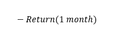

# Alpha Pipeline: Raw Data -> Trades

Source HTML: [`html/2023-05-15-alpha-pipeline-raw-data-trades.html`](../html/2023-05-15-alpha-pipeline-raw-data-trades.html)

# Alpha Pipeline: Raw Data -> Trades

| 항목 | 값 |
| --- | --- |
| 날짜 | 2023-05-15 |
| 접근 | 무료 |
| URL | https://www.algos.org/p/alpha-pipeline-raw-data-trades |
| 부제 | The most popular approaches to go from raw data to a live trade |

---

#### Introduction

---

For a lot of beginners, it can be a bit ambiguous how you go from the raw data all the way to trades. I’ve spoken previously about some of the most common approaches, but this article will dive a lot deeper and put it all together as a guide for how to construct an alpha pipeline.

What is an alpha pipeline? It is simply the steps taken to transform raw data into trade ideas. This can be as simple as a conditional where we buy at a certain price, but usually, there is some transformation of the data involved, and often much more than simple conditions.

#### 

#### Features & Conditionals

---

I’ll quickly describe what a feature is. For an easy example, we could use the inverse of our return for a mean reversion alpha. For a monthly reversion alpha, it would look something like this:

I’ve written multiple articles on alpha design and one specifically for momentum alphas for readers who want to dig into the feature generation part. Here are two:

[Quant’s SubstackNon-Linearity Without Machine LearningIntroduction…Read more3 years ago · 10 likes · Quant Arb](https://www.algos.org/p/non-linearity-without-machine-learning?utm_source=substack&utm_campaign=post_embed&utm_medium=web)

[Quant’s SubstackBreaking Down Momentum Strategies Introduction…Read more3 years ago · 29 likes · Quant Arb](https://www.algos.org/p/breaking-down-momentum-strategies?utm_source=substack&utm_campaign=post_embed&utm_medium=web)

The other type is conditions. These are pretty self-explanatory (IF, ELSE, AND, OR) - on these conditions we take some position.

We can turn conditions into a feature like the above mean reversion example using a dummy variable or utility function. I’ll cover this a bit more later in the article. Perhaps if we wanted to buy on Monday, and sell on Fridays we would have 1 as our value for Mondays, -1 on Fridays, and 0s otherwise.

(weekly seasonality flips all the time so I won’t dig into the effectiveness of this)

#### Three Common Approaches

---

I’m sure others may call them by different names, but generally, I’ll walk through the critical building blocks for the main ones. These can be interchanged and look different depending on the researcher and their preferences.

1. ML + Portfolio Optimization (ML+PO)
2. Ranked Long / Short
3. Conditional Based Trading

All of these have their own section, but here’s a quick brief on each:

1. For the ML+PO approach, we need to have some sort of statistical feature which we feed into our model. The goal is to produce 2 things from this feature. We need a measure of expected value for any assets we intend to trade and a forecast of their volatility. This is then passed into a portfolio optimizer, giving us our target portfolio. We then trade into this portfolio. Machine learning is used to get our expected forecast (can just be a linear regression) and our volatility can be forecasted or we can just take the historical (much easier).
2. Ranked long short takes the same style of statistical feature as our input, but is specifically designed for cross-sectional alphas. We take our feature, rank our traded assets on this metric, and long/short the top/bottom xx percentile.
3. Conditionals are as simple as they sound. We have an explicit condition and we trade based on that. We will discuss later how we can take conditions and use them within the first method (which sometimes is more optimal, but not always).

#### Machine Learning + Portfolio Optimization

---

Now that I’ve done a brief introduction for it, I’ll show a nice diagram of our process:

Ignoring how poorly aligned / sized my boxes are, this is a good representation for how we transform our raw data for this process.

We start with the raw data, this could just be the monthly close prices for each asset. Making sure this data is clean and representative is essential. Vendors often provide incorrect data such as volume data created by wash trading (for crypto).

Next, we move to the most important component, the feature. I’ll use the previous feature example. We take our monthly close prices and calculate the 1-month returns. Then, multiply by -1 to get the inverse % return.

This part is often a rabbit hole beginners waste a lot of time on. We need to turn this cool little metric we’ve made up into a forecast for the returns of an asset. Maybe we forecast 1 month-forward returns and apply a linear regression (simple, easy, and if your alpha is well constructed to incorporate any non-linearity should be fine). We now have a forecast for the future returns of each asset in our portfolio.

(Optional) We can repeat this step for volatility, and attempt to forecast that, but this is probably a bad idea. If we had an edge forecasting volatility we would probably look at trading that specifically instead so we can use the previous volatility as our future volatility forecast. Our alpha works on a monthly basis so we can safely assume that IV (Implied Volatility) figures will be relevant (vs quite intraday where it probably isn’t). You’ll need to adjust for the VRP / translate it into a forecast for realized volatility, but this is another easy way to do it that makes sense. This step is only optional in the sense that we can make it complicated - a forecast for volatility is required but using historical counts as “skipping” this step in my book.

These forecasts all get fed into our portfolio optimizer. Mean-variance optimization is not very robust because of errors in our forecasts so we should modify the method to incorporate this. The main benefit here is that we can fine-tune our objectives a lot better, but mostly we want to keep it simple. Adding turnover costs into our optimization so that we only trade when the increase in edge for our new portfolio vs. current is greater than transaction costs. Building our portfolio optimization toolbox is a real pain and takes time to get it right (KISS is a good policy as you progress), but it is a tool you get to re-use on every alpha so well worth it for many firms.

Finally, we take the difference between our current portfolio and target portfolio and figure out the trades needed to get to our target portfolio. This ends with execution which is covered in detail in this article:

[Quant’s SubstackExecution - Without The FluffIntroduction There isn’t a lot of high-quality information when it comes to market-making and execution. It is important to note that a lot of execution is effectively the same problem as market-making. Especially when it comes to the transaction cost part of the problem, it is very similar to market making…Read more3 years ago · 13 likes · Quant Arb](https://www.algos.org/p/execution-without-the-fluff?utm_source=substack&utm_campaign=post_embed&utm_medium=web)

#### Ranked Long / Short (RLS)

---

This method is very simple to use and is a great way to get some intuition about the behavior of your alpha.

We start with our feature, then rank our assets on this feature. We take our top picks and long them, then short our bottom-ranked assets. Typically, this is the top and bottom decile, but playing around with this % cutoff is one of the best tests for overfitting. A strong alpha is robust at top/bottom 20%, 10%, and 5% unless you can think of a reason why extreme values should behave differently.

If ranking and selecting the top/bottom 5% is the only one that works we should consider moving on. The scenario where this is worth trading is that there is some rapid increase in predictability for extreme values of this alpha. We will want to test this out empirically. If it only performs best because only extreme values have enough alpha to beat fees, we might want to move on as this will be really noisy to trade. We also lose a lot of diversification and can harm our Sharpe ratio by using higher %s.

On the other hand, we take weaker trades when using high percentiles but get a lot more diversification. Figuring out the optimal is part of our process on the optimization side, but we need to be careful not to overfit. Especially with monthly alphas, this is going to be so strict to the point where you shouldn’t try anything other than 10% other than to confirm robustness.

The benefits of this method are primarily how simple it becomes to test an idea without the need for a complicated research platform. ML+PO on the other hand requires models and portfolio optimizers to be built. The model part can be easy, but a good portfolio optimization setup isn’t easy. We also get a fantastic robustness test out of ranked long/short through parameter modification - even if using ML+PO it is worth using RLS for this purpose before concluding your research.

Our main drawback is that this is sub-optimal to maximize Sharpe and does not let us trade only when it makes sense. We can tune this manually by adjusting assets by volatility in their ranking and using volatility targeting. For some alphas like mean-reversion, we want to incorporate this at the alpha level to prevent high volatility assets that haven’t made a large move relative to their usual behavior from being at the top/bottom of our list.

We turn over our portfolio with this method at a specific frequency. Some people will use the very dirty method of just rebalancing less frequently to avoid excessive turnover issues, but ideally, we use a shitty ML add-on that forecasts our portfolio’s expected value and then compares it against our current portfolio to see if this new change in the portfolio will beat fees. Otherwise, we might be adding 2 bps of edge (or any arbitrary figure) but paying 4 bps of transaction costs to do so (or any larger but also arbitrary figure).

#### Conditional Based Trading

---

I believe conditionals are best suited for HFT strategies where the order book is very mechanical or a discrete event causes us to want to trade.

Otherwise, we can easily convert this into a standard feature as described before. There isn’t much to be said here other than you get a condition and trade.

Conditions are often triggered by discrete events with very strong signals; hence, we want to execute them as such. We should consider the alpha decay on something like “if Elon tweets about $DOGE : BUY” and whether this means taking or making is more optimal (often taking).

#### Dummy Variables For Dummies

---

This section is going to be a very detailed example for conditionals in essence as I feel I haven’t contributed much here so I’ll give a good bit of methodology:

Let’s say we wanted to capture day-of-week and day-of-month seasonality effects if we used an IF XX condition we would have a very noisy framework for testing so we use dummy variables instead.

Using a bit of math, [2,3,5] are a very optimal set of dummies. 2*3*5 = 30, this means we can capture up to a 30-day period (for daily data). This is just a variable that every X data points is a 1, otherwise 0. So for 5 every 5 data points (which for daily data is every 5 days), it shows as a 1.

We then can take a linear regression to these dummy variables and trade it within the usual framework. This is much better than simple “buy on X day and sell on Y day” since you can now optimize for turnover.

This is an excellent example of how a rule-based strategy can be traded far more efficiently (and still quite easily) by transforming it into a set of features.

#### Conclusion

---

We’ve reviewed some of the critical elements of an alpha pipeline and demonstrated a pipeline that can optimally use our trading ideas.

The alphas themselves are still the driver of our performance, but we are potentially leaving money on the table by not incorporating them into the proper pipeline.

Large firms will have complicated systems to optimize turnover / complimentary signals as one portfolio. This is a bit advanced for most, but most of what we’ve discussed here can be used effectively by a single researcher.
