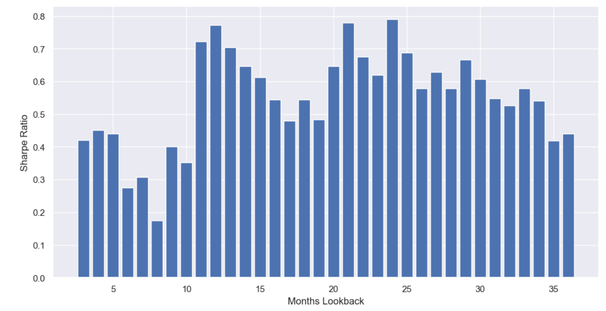

# Timeframe Crowding - An Interesting Effect

Source HTML: [`html/2023-05-19-timeframe-crowding-an-interesting.html`](../html/2023-05-19-timeframe-crowding-an-interesting.html)

# Timeframe Crowding - An Interesting Effect

| 항목 | 값 |
| --- | --- |
| 날짜 | 2023-05-19 |
| 접근 | 무료 |
| URL | https://www.algos.org/p/timeframe-crowding-an-interesting |
| 부제 | Exploring how popular lookback periods can outperform via crowding effects |

---

#### Introduction

---

For this article, we will include the complete code needed to replicate the results at home and I’ve used freely available data (Yahoo Finance) to simplify this. No transaction costs were simulated, but this shouldn’t have much hold on the accuracy of our findings. To the best of my knowledge, the effect we will discuss is not present in the literature and is something I’ve managed to find for myself.

Put simply, momentum strategies with a lookback period (in months) that is a multiple of 3 tend to outperform. Common choices for the number of months to look back typically include 6, 9, & 12 when viewing the literature. This suggests that many practitioners use these same timeframes (typically a multiple of 3) when developing momentum strategies.

Quant’s Substack is a reader-supported publication. To receive new posts and support my work, consider becoming a free or paid subscriber.

#### The Momentum Strategy

---

It is important to note that the strategy I will present is pretty shit. I made it with ChatGPT and as a result, it has a few issues.

Those being:

- The universe should be updated on a rolling basis.
- Beta should be calculated on a rolling basis.
- Transaction costs are not simulated.
- Trade price data is used instead of mid-price data.

Whilst these errors don’t make our backtest an accurate depiction of actual performance, none of these should inadvertently produce the effect we observe in our data. Thus, we can ignore that our Sharpe ratios won’t be accurate. Often time saved is more valuable than being perfectly accurate, this is one of those cases.

This is a pretty simple momentum strategy. We pull data for all S&P500 constituents, filter out the top 10% assets by beta, use dual momentum with frog in the pan for the relative momentum component, and finally, we use volatility targeting to improve our Sharpe ratio and penalize for volatility.

This makes use of 4 known improvements for momentum strategies:

- Filter out assets in the top decile for beta.
- Ensemble both relative and absolute momentum to make dual momentum.
- Use FIP (frog-in-the-pan) to avoid returns driven by news.
- Volatility targeting (Volatility is correlated to worse momentum returns and higher turnover - thus we penalize for this. It also helps optimize our Sharpe).

Additional improvements exist, but ChatGPT fucked up half of them and I didn’t want to hold its hand the whole way through so this is what we are going with.

Here is the code for our implementation (lookback is hardcoded as 12 here) :

```
import pandas as pd
import numpy as np
import yfinance as yf

def get_sp500_tickers():
    url = 'https://en.wikipedia.org/wiki/List_of_S%26P_500_companies'
    table = pd.read_html(url)
    df = table[0]
    sp500_tickers = df['Symbol'].tolist()
    return sp500_tickers

sp500_tickers = get_sp500_tickers()

# Define the period
start_date = '2010-01-01'
end_date = '2022-12-31'

# Momentum lookback period in months
lookback = 12

# Create a DataFrame to store the adjusted close price of the stocks
stock_data = pd.DataFrame()

# Download historical adjusted close price of the stocks from Yahoo finance
for stock in sp500_tickers:
    stock_data[stock] = yf.download(stock, start=start_date, end=end_date)['Adj Close']

# Compute returns
returns = stock_data.pct_change()

# Download S&P 500 data for beta calculation
sp500 = yf.download('^GSPC', start=start_date, end=end_date)['Adj Close']
sp500_returns = sp500.pct_change()

# Compute beta for each stock
betas = returns.apply(lambda x: x.cov(sp500_returns) / sp500_returns.var())

# Remove the top 10% highest beta assets
filtered_stocks = betas[betas <= betas.quantile(0.9)].index

# Filter returns for the remaining assets
returns = returns[filtered_stocks]

# Compute volatility for each stock
volatility = returns.rolling(lookback).std()

# Compute inverse volatility weights
weights = 1 / volatility

# Normalize the weights so they sum up to 1
weights = weights.div(weights.sum(axis=1), axis=0)

# Compute absolute momentum
absolute_momentum = returns.rolling(lookback).sum() > 0

# Compute "Frog in the Pan" measure for each stock
fip_scores = -np.abs(returns).divide(returns.rolling(lookback).std())

# Compute relative momentum based on "Frog in the Pan" scores
relative_momentum = fip_scores.rank(axis=1, ascending=False)

# Combine absolute and relative momentum to get dual momentum
dual_momentum = absolute_momentum & (relative_momentum <= 5)  # Buy if stock is in the top 5

# Apply the weights to the dual momentum signal
weighted_signal = dual_momentum.mul(weights)

# Compute the portfolio returns
portfolio_returns = (weighted_signal.shift() * returns).sum(axis=1)

# Compute the cumulative returns
cumulative_returns = (1 + portfolio_returns).cumprod()

# Plot the cumulative returns
cumulative_returns.plot()
```

#### Timeframe Crowding Analysis

---

Now that we have our “momentum strategy” to generate Sharpe ratios for, we can run some simulations. I backtested this strategy with the lookback (months) parameter set to all values between 3-36 and recorded the Sharpe ratio. This is the bar chart:

[](images/575c0f441b77.png)

We can see some general areas that work best, but it is most interesting to look at how months that are a multiple of 3 perform. This is especially true for values that are popular in the literature. They tend to be slightly higher than their neighbors.

[9, 12, 18, 21, 24, 36] are some of the most common timeframes in the literature and all of them are local peaks on this chart. The outlier is six months. It is a pretty noisy effect, but it does appear that there are slightly higher returns for lookback periods that are more common in the literature. The 1-year multiples also do well [12, 24, 36].

A proper analysis would use data from commodities markets / international stock markets, but there does appear to be a weak signal in favor of using the most popular approach. This is commonly observed with CTAs that the best strategy is often the one everyone else is using so the effect has some backing just from that.

The average Sharpe ratio was 0.55, periods that were not a multiple of 3 had an average of 0.53, and those that are a multiple of 3 had an average of 0.57. The 1-year multiples had an average Sharpe ratio of 0.67.

#### Conclusion

---

The effect presented today is very noisy and needs a lot more data to properly conclude whether it is real or not. That said, the results so far seem to suggest there might be a weak relation here. This should probably be confirmed using different strategies and in various markets to see if popular strategies tend to perform best when used with their most popular settings.

This article can be viewed more as a research idea/implementation of a basic momentum strategy than anything rigorously scientific - I’d probably write a paper if that were the case.

The other part of this article was to demonstrate a basic momentum strategy that uses a few smart ideas. Those looking to take this further should read my (much longer) article on momentum strategies and the improvements that can be made. The code was written mostly by ChatGPT-4 so this shouldn’t be hard for anyone to implement.

I’ll probably do a part 2 on this article eventually where I bring out global equities and commodities data, but for now, this is fine and it shouldn’t be too much work anyways in case someone decides to take this on as a research project in the meantime.

Quant’s Substack is a reader-supported publication. To receive new posts and support my work, consider becoming a free or paid subscriber.
