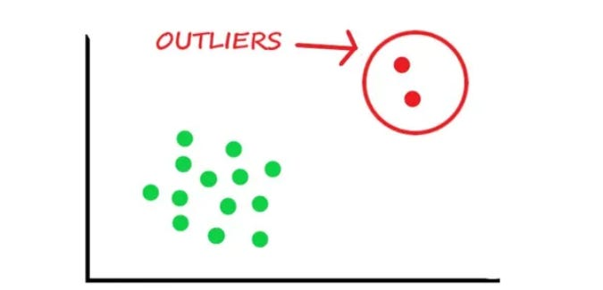

# Outliers - A Deep Dive (PART 2)

Source HTML: [`html/2023-06-08-outliers-a-deep-dive-part-2.html`](../html/2023-06-08-outliers-a-deep-dive-part-2.html)

# Outliers - A Deep Dive (PART 2)

| 항목 | 값 |
| --- | --- |
| 날짜 | 2023-06-08 |
| 접근 | 유료 |
| URL | https://www.algos.org/p/outliers-a-deep-dive-part-2 |
| 부제 | Dealing with extreme values as a quantitative researcher. |

---

#### Introduction

---

This is the second part of our series on outliers. In the last article, we looked at outliers as our enemies and discussed ways to deal with them. Now, we will take the opposite approach and treat them as a potential source of alpha.

We will discuss techniques and ideas for finding alpha in the extreme values of our datasets. I’ve also added a lot of practical inputs and nuances I’ve found. Things you only get through experience. Understanding which effects (trend, risk premiums, reversals, divergent hedging pressures) are suited to different conditions and why we apply things differently based on our hypothesis.

#### Index

---

##### Part 1 (in the previous article):

1. Outlier Detection

   1. Plotting data
   2. Quantile Regression
   3. IQR
   4. Z-Score Quantiles
   5. Clustering Approaches
2. Transforming Data

   1. Winsorising
   2. Log Transforms
   3. Min/Max Scaling
   4. Median Absolute Deviation
   5. Non-Linear Scaling
3. Robust Modelling Approaches

   1. Ridge
   2. LASSO
   3. PLS
   4. MAD
   5. The L0, L1, & L2 norm.

##### Part 2:

1. General Thoughts
2. Feature Engineering

   1. Min/Max
   2. Quantiles
   3. Volume
   4. Volatility
   5. Return Discreteness
   6. Time

#### General Thoughts - Finding Alpha With Outliers

---

We don’t always find that outliers are easy to predict (when adjusting for the smaller sample size), and often they can be absurdly noisy because they are each caused by different factors. This is part of the research process and involves finding cases where the outliers happen for a more uniform reason and create predictable price effects.

There is also the issue of smaller sample sizes. It may not be possible to model outliers due to a pure lack of samples, but in other cases, you may have enough. That said, you also need this to be worth your time. If the edge is not far larger than usual, you may have enough data, but the overall PNL will still be small from a lack of trades.

If I trade very infrequently, I can’t make small gains on each trade, or I won’t be able to deliver much value. We can, of course, lever into these trades, so much of it boils down to how deterministic this trade is. If there is a clearly mechanical cause-and-effect relationship, then we can put on a lot of leverage and realize large gains on each trade.

Extreme values tend to occur during extreme environments, which means our costs tend to be similarly extreme. Spreads often become far wider during these occasions and this gives dimension to our determinism needs. If we need to make more than 20 bps to cover the cost of the spread then even if the trade makes 15 bps, we are underwater. We not only need to be right, but we also need to make sure we take opportunities where both the direction and magnitude are nailed.

We should also think about why these are extremely predictable. These are events where traders panic or when information is not being disseminated evenly (among many other causes). An example of this is the momentum that occurs after a large news shock as well as the clear reversal effects after. People panic, hedge, and generally react in ways that aggregate into the asset returns. If we can get ahead of this (not just via getting the news, but the reactions after) and all the flow is for this brief period driven by one single large news shock, then we no longer have a million factors driving the market. During a short and extreme situation, the few dominant factors are plainly laid out for us.

#### Feature Engineering

---

I’ll discuss a few features and conditions which help us identify when there are extreme scenarios and dominant deterministic factors driving pricing. These are by no means features you can brute-force test out; think of them more as Legos. You need to develop a hypothesis; these just help capture these drivers in your hypothesis in an algorithmic logic. Use these building blocks to build your logic and conditions to see how your hypothesis is actually expressed in the market and then trade it. You can start with something like a large sudden move and then develop your hypothesis by looking at the chart / exploring the data to see what is driving it in different cases, but then as you build this hypothesis, the conditions and transforms we discuss below come into the picture. These are used to identify the cases that fit the specific driver we are capturing.

***Min/Max*** transforms are a great start. We can apply them to the price on a rolling or online basis. These are points where parameters get recalculated. Prices are venturing into new territory (relative to very, very recent history), and all the other algorithms/traders will be adjusting for this. This can aggregate into effects where you can get paid to take risk off someone’s balance sheet for a stellar premium. Prices that have traded recently will not have much new flowing waiting to come, but higher highs or lower lows may have stop losses, hedgers, and risk dumpers that are sitting there. It is wise to pair this with others to know if this will be the case, but there are potentially yet-to-be-seen orders waiting to come once we hit new territory.

A note on higher highs especially is that we sometimes see weak bearish conditions boost strong bullish trends as people FUD from their positions and feed the rally. A rally needs fuel to continue, and these are the people paying out their money from fear to fund it. This is kind of uncommon though, would take it with a grain of salt, similarly FOMO can drive rallies, but too much positive sentiment (extreme value) is strangely bad for returns.

***Quantiles*** are more feature-level transforms, but if we see an asset that has a very high value for its alpha/ feature, we may not see it behave in the usual fashion. A large trend may eventually reverse when it gets past an extreme point; it can’t continue forever after all. It’s great when we see an alpha that flips its direction after a certain magnitude. An alpha that is normally positive (trend) to returns but becomes strongly negative (reversal) in its extreme values is easy to get a limit fill on. Many will continue this positive view, and you can sell into the flow, buying the trend to earn an attractive spread. A great example is doing this on news reversals where there is a lot of uninformed flow to hit you.

***Volume*** is pretty simple to condition on. Lots of people want to trade around this. Why? Lots of flow relative to the expected volume likely means there are some mispricing effects. These are times of far larger trading volumes and potentially a sign that many players are aggregating via market panic or a large player is doing something silly and moving the market in a way we can capture.

***Volatility*** is a clear regime filter for when a trend becomes a reversal. For trend or mean-reversion strategies, volatility is a great go-to. If we feel there are some forced traders and we earn a premium, then we may want to think about when high volatility has been sustained, whereas, for trend / mean-reversion, we are looking at when volatility becomes unexpectedly high. Often it makes sense to wait until high volatility has been there for a bit with risk premiums because we want to start selling this premium when all the previous sellers have blown up and it becomes very attractive. I’ve given 2 ways to look at it here. High volatility causing a sudden increase / change in flow in a direction, or high volatility wiping out all the premium sellers making it very juicy. We see this with VRP, where medium volatility is better than high volatility to harvest because it comes after high volatility - once the short VIX bandwagon has blown up and whilst there is still fear in the market, ready to buy. Similar ideas but captured a bit differently.

***Return Discreteness*** is more just the shape of our move. Is it smooth or sudden? Sudden moves are interesting and unexpected. They can be driven by news, or they can be caused by someone needing to take risk off very fast. Many more reasons as well, of course, but thinking about what conditions capture each of them after we have created our logic to identify jumps / sudden moves is where we find an edge.

***Time*** is a simple but absurdly effective feature when used right. Perhaps we adjust the expected time by the size of the move or have some modification, but often when news is released, you can literally just use a number of seconds or minutes multiplied or divided by some factor related to the shape, size, or conditions the move occurred under to then time a reversal. I’ve found alpha from some stupid simple conditions like 15s after move; it reverses (and it worked incredibly well with sensible reasons behind it). Returning to volume, it can also be after a certain amount of volume or imbalance has been traded we time the reversal.

#### Conclusion

---

I’ve given quite a bit of information about how to think about these extreme events that I haven’t discussed much. The time/accumulation of volume (or volume imbalance) part is surprisingly powerful around large shocks like news.

Identify the extreme scenario, what is driving it, then what conditions are specific to each possible driver. Then once we model each driver for (say large jumps for example) we can then trade specifically things like sudden hedging pressures, FOMO, FUD, news, and such with all their idiosyncrasies.

Modelling each specifically is super valuable because of the nuances related to execution and our need for determinism. Works in general is less valuable when the cost is high. We need to be a lot more correct and this requires understanding the little details. This is not to say that tons of conditions will make it more deterministic - you’ll overfit. We need a driver that will move the price in a deterministic fashion then, we are simply filtering everything else. We are ignoring price moves that are not extremely likely to be from this driver.
