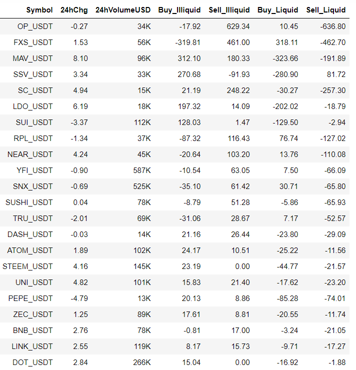
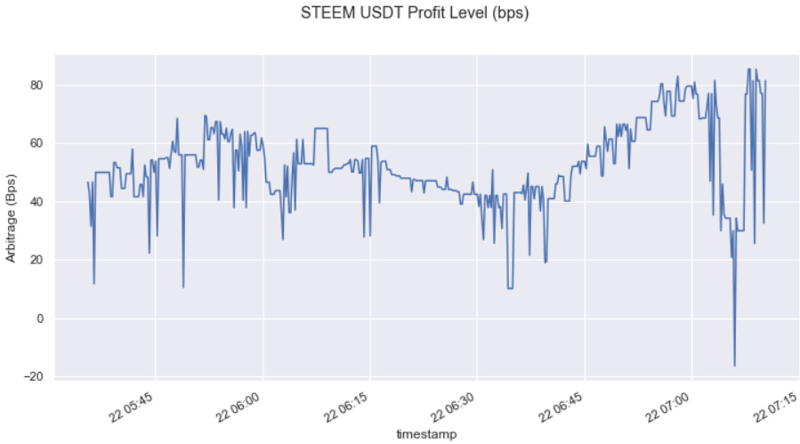

# Small Trader Alpha - Another Real Strategy

Source HTML: [`html/2023-07-03-small-trader-alpha-another-real-strategy.html`](../html/2023-07-03-small-trader-alpha-another-real-strategy.html)

# Small Trader Alpha - Another Real Strategy

| 항목 | 값 |
| --- | --- |
| 날짜 | 2023-07-03 |
| 접근 | 유료 |
| URL | https://www.algos.org/p/small-trader-alpha-another-real-strategy |
| 부제 | Those who know don't care, and those who would care don't know. |

---

#### Introduction

---

I’ve subtitled this article with a quote I think describes these sorts of alphas very nicely. They exist because they require the same skills (although in a much less competitive form) as many HFT strategies but have extremely limited capacity. Those with the knowledge to build and operate these strategies have bigger fish to fry, and the group that would be happy to make 500k of absolute PNL on 1/10th the capital lacks the knowledge to take advantage of it.

Today we will be educating all those degens about small-capacity shitcoin arbitrage. There are a LOT of nuances that you can only really figure out by doing it in production, but I’ll do everyone a favor and break these components down in a nice digestible article.

We fully break down the strategy in this article with real exchanges/opportunities used as examples. These are the sorts of strategies that are great to start with because of how uncompetitive they are. They’re very well suited to one-man teams that are running their own capital / don’t require large capacity.

#### Index

---

1. Introduction
2. Index
3. General Idea
4. Two Types, One Favorite
5. Fixed vs. Variable Costs
6. Hedging:

   1. Futures
   2. Spot Borrow
   3. Correlated Assets
7. Risks:

   1. Sweep Risk
   2. Transfer Risk
   3. Basis Risk
   4. Early Convergence Risk
   5. Inventory Threshold Risk
   6. Inventory Holding Risk
   7. API Failure Risk
   8. Counterparty Risk
8. Quantifying Capacity
9. Quantifying Risks
10. Conclusion

#### General Idea

---

Spot markets may seem on the surface like the most straightforward of all asset classes to trade, but in reality, they are the most complicated to actually arbitrage. This is why we still manage to find alpha here; futures inherently have the ability to short without needing to secure borrow or leave the position unhedged and, as a result, converge cross-exchange extremely fast. We want to get our alpha from opportunities that require more work than others are willing to put in to capture, not ones that require us to be latency experts to try and take them. Hence why spot markets are where we will apply our focus.

We start by defining our liquid and illiquid exchanges. The liquid exchange is where we get our fair value from and where we reconcile our mispricing against. The illiquid exchange is where we get our alpha; this is the mispriced exchange due to imbalanced supply and demand, moving prices into a mispricing.

For our example, we will use these exchanges:

- Liquid Exchange: Binance
- Illiquid Exchange: Poloniex

We can assume that the price on Binance is close to fair value. More advanced systems may use multiple major exchanges, but this gets very complicated because of the transfer threshold considerations we discuss later.

These opportunities tend to appear in low market cap. tokens as they have worse capacity, borrowing ability, and risks meaning they get ignored - leaving bread crumbs on the table. Very profitable breadcrumbs.

We can go in two directions, buy or sell:

If we sell on the illiquid exchange, then we will start by first buying inventory on the liquid exchange and then transferring it to the illiquid exchange, selling it for a profit. We finally transfer back our USDT (or stablecoins in general) to end up with more USDT than we started with on our liquid exchange account.

If we buy on the illiquid exchange, then we start by purchasing inventory on the illiquid exchange before then transferring it to the liquid exchange, selling, and ending up back in USDT. If we are buying on the illiquid exchange, we will need to have USDT already on the illiquid exchange. Otherwise, we need to wait for the USDT to arrive from our liquid exchange account - risking the arbitrage disappearing whilst we wait. At the end of this, we will need to transfer USDT back to the illiquid exchange to replenish our stock of USDT for the next arb, that is, unless we keep all our USDT on the liquid exchange beforehand.

It is rarely the case that counterparty risk is great enough for us to refuse to hold USDT on the illiquid exchange when we aren’t doing a trade because we pay for this counterparty risk aversion by losing opportunities waiting for our USDT to arrive on the illiquid exchange.

Some of these opportunities can make double-digit daily returns on our admittedly small capital, so counterparty risk is less of a concern unless the opportunity exists because everyone thinks the exchange is about to blow up.

#### Two Types, One Favorite

---

Below is a table of real opportunities between Binance & Poloniex sampled at 22:38 UTC 7/1/2023:

Our first columns are pretty self-explanatory, but the last 4 I’ll give an explanation on. These 4 columns are the arbitrage before transfer costs in basis points. 6.29% is pretty damn attractive for OP/USDT - not a lot of explanation there in terms of anything other than it having $34,000 of daily volume (real smol).

Buy\_Illiquid denotes we are using a limit order at the top of the book on the illiquid exchange to purchase the asset before taker ordering out of the position on the liquid exchange. Sell\_Illiquid is the opposite; we taker buy inventory on the liquid exchange, transfer it to the illiquid exchange, and then sell out of it using a limit order at the top of the book.

Buy\_Liquid & Sell\_Liquid are full-taker versions of this arbitrage. We buy/sell on the liquid leg, transfer to the illiquid exchange, and then sell/buy as a taker into the illiquid exchange. We see these opportunities far less frequently, and they converge really fast, usually before we can complete the spot transfer.

Yes, there are two more ways to do this. The first is where we are a maker on the liquid leg and taker on the illiquid leg, but thinking about which exchange has the larger spread (the illiquid leg) also explains why this isn’t such a great idea. The other would be a fully maker version where we make on both legs, but the illiquid exchange likely has 10x or more the spread, so we are wasting time / adding risk for a tiny gain. This is not a great idea.

Breaking down the two types of arbitrages we actually focus on (maker illiquid/taker liquid & taker both), we can start to understand what causes these arbitrages to occur. Here are what we are actually arbitraging:

1. Midprice Arbitrage
2. Spread Arbitrage

If we can take on both legs, then we are always paying a positive spread cost net between the two exchanges. This implies the midprices of the asset on each exchange are severely misaligned. This is quick to arbitrage because we don’t have to wait for fills, and (in theory) involves far less risk because we aren’t holding inventory whilst waiting for our fills. In reality, we find these have MORE risk because they are so easy to arbitrage and hence revert before our transfer arrives cross-exchange. Thus, if we are going to take these, we need to understand why it has occurred (often because transfer has been disabled, making the arb impossible). If taking these arbitrages, we can’t get away with holding the risk in between transfers and need to hedge the risk using futures or spot borrow - otherwise, the early convergence risk will consume all our profits.

Our second type of arbitrage is much better, the favorite. It occurs because whoever has been executing their orders has not properly distributed them in accordance with where the exchange liquidity is. We are effectively transferring liquidity from where it is (Binance) to where it is needed (Poloniex). We can have an arbitrage despite having the exact same midprice between the exchanges; here, we are arbitraging the fact that the illiquid exchange has much wider spreads because of its lower liquidity. There’s much more of a fundamental reason with spread arbitrages (maker + taker instead of taker + taker). This is what we will focus on in this article and where I recommend readers place their attention.

#### Fixed vs. Variable Costs

---

This is the first nuance we run into, and it’s a big one - perhaps the primary reason this is such a pain to take advantage of and scale horizontally. A great opportunity for small traders nonetheless.

Trading fees and spread are variable costs, variable with respect to the amount of capital we put through each opportunity. These can be calculated easily. If we have a 5% arbitrage and 10 bps of fees, then we simply have 4.9% as our arbitrage (pre-fixed costs). Spread costs are built in since we use quote data instead of midprice data to calculate the arbitrages. Hedge costs can be unpredictable if we need to estimate the cost of perp funding / spot borrow since the time the trade will take to complete is unknown, but most of the cost can be roughly estimated from the start.

The fixed costs are where we run into issues. These are the withdrawal fees imposed by each exchange. Binance, for example, imposes a 1 USDT withdrawal fee, so every time we transfer USDT to Poloniex, we incur this cost. If we send 1,000 USDT, then our cost is 10 bps, but if we send 10,000 USDT, it is only 1 bp. Large volume opportunities where we can get a lot of inventory and minimize this cost as a % of our capital also tend to have lower arbitrages as a result. The holy grail is high volume and high arbitrage. Not only does this mean we net more profit because fixed costs are a lower % of costs, but we also can put more capital through the arb.

We need to normalize everything to a % so we cannot work with a withdrawal cost for an asset that is $10, for example. This creates the problem of estimating the amount we can get filled. Let’s say we can get filled on $10,000 of size; then this equates to a 10 bp cost. Say the arbitrage is 50 bps net of trading fees. We get 40 bps after our withdrawal fee on the risk asset (non-USDT) minus another bp (for our USDT transfer of $10,000), for an overall profit of 39 bps. This problem gets even more complicated, and we discuss this in the risk section later.

#### Hedging

---

In most cases, we won’t hedge at all and instead focus on estimating our risk, then factoring this into the arbitrage itself. If we have a 50/50 chance of the arbitrage converging before we can reconcile with the liquid leg, then we need to double the costs to account for this.

We will still discuss hedging as this is an advancement we can add to the strategy, but running this in production will lead you to the answer that the best profits come with a bit of risk. This risk is quantified, factored in, and then averages out very nicely because our ROI is so high. Losing 10% of our capital is only $1,000 on $10,000 of capital. If we cycle a 3% arbitrage (net of costs) every hour for a few hours, we've made this back. Hell, the exchange could go bankrupt, and we would be more annoyed about losing time implementing the APIs / losing future arbs than any lost capital. The capital we trade is so small relative to the absolute PNL that we are relatively unbothered about risks to said capital.

#### Hedging - Futures

---

This is the best kind of hedge because it is usually very cheap as spreads are tighter on perps than spot for most assets, but it may not even be worth trying to hedge in perps because most assets we see arbitrages for are so illiquid there isn’t even a perpetual for it on Binance.

We would need to estimate the cost of funding over the lifetime of the arbitrage, and of course, adding on spread/trading fees is a pretty simple computation. This makes perpetual hedge-able opportunities very rare, and if they do occur, they tend to disappear incredibly fast - often to the point where we end up competing on latency, and this is not the edge we have, so hence we pass.

#### Hedging - Spot

---

Most assets will have incredibly high borrow costs, but relative to the size of these arbitrages and the length we hold the trade for, they tend not to be the main blocker. The primary issue we run into is the availability of the borrow in the first place. If you see an arbitrage regularly and manage to get a borrow for it, then it may make sense to hold the borrow open even when the arbitrage isn’t being exploited so you don’t lose the borrow. This is a cost we have to factor in if we are holding and adds to the list of questions we often have to eyeball (deciding whether this is the right move requires discretionary involvement and limits scalability).

If you do manage to get spot borrow, it needs to be for a lot of size since we have the fixed withdrawal cost. Some arbitrages are so large (like the >6% arbitrage we saw earlier) that we are willing to pay an absurdly large % of the profit away in withdrawal fees. Say we only can get $500 of borrow and have a $10 withdrawal fee; we are happy to pay away 2% of the capital away because our arbitrage is so large, but we still have an issue of limited PNL capacity. If we net 3% after trading fees / borrow costs / USDT transfer costs, that’s only $15. If we automate this every hour, then it starts to add up to some nice daily profits, but we are still making a really small amount of money for our work.

#### Hedging - Correlated Assets

---

I don’t really think this one is a good solution because we are hedging out the arbitrage converging. Any beta exposure to BTC, for example, will be negligible in the long run and well worth taking. There is no adversity with beta exposure because it is not driven by our arbitrage. It is random (from our view, at least). Early convergence, on the other hand, is very much correlated to our opportunity and is what we want to hedge out. This can only really be done by hedging in the same asset, but I’ll mention this option regardless. One tip is that finding tokens with dead Githubs are usually good hedges for other tokens with dead Githubs. Again this is more of our shitcoin beta exposure, which isn’t really what we want to hedge (early convergence risk is adverse to our opportunities and hence can only come from the same asset).

#### Risks

---

This is where we dive into the weeds of the strategy and the considerations that really make us our money. The section after this will explore how we can quantify them and factor them into the attractiveness of each opportunity. We must understand the risks first before we incorporate them into our attractiveness of each opportunity (how we take this strategy to the next level).

#### Risks - Sweep Risk

---

This tends to be the reason why we see small arbitrages for major liquid names. There is always the risk that someone will slam our limit order, giving us inventory, and then slam the book on Binance - taking away our hedge and forcing us to exit at a loss.

Sweep risk is typically not something we need to consider because we are transferring liquidity to ultra-illiquid exchanges where people aren’t going to source liquidity from and also because we are quoting so wide that someone would need to absolutely wipe out every inch of liquidity on the liquid exchanges before they come looking for liquidity on illiquid exchanges. If you have enough impact to start picking up 5% wide limit orders on Poloniex, then you should also be smart enough to VWAP instead of taker dumping, so it isn’t extremely relevant.

If we are transferring liquidity between liquid exchanges, say Binance to KuCoin, then we will face this risk because KuCoin is actually a reasonable place to source liquidity if we are using an aggregator to execute against the global orderbook. The difference between KuCoin and Binance for most assets will be so small it doesn’t overcome costs, so we only see this risk become a big issue when liquidity gets sparse. This is either because someone is executing huge size or if volatility has spiked massively. Otherwise, we won’t see enough of a mispricing to start doing liquid-to-liquid arbitrages. Liquid-to-liquid arbitrage typically exists as a risk management solution to prevent large inventory balances from building up during said tail events whilst doing normal liquid exchange market making, so isn’t very relevant to our shitcoin arbitrage strategy. We note it down anyways.

#### Risks - Transfer Risk

---

This isn’t a large risk and is a mix of a few risks I have lumped into one here. The first is that we may not be able to withdraw the asset because it has been disabled. Checking this in the API is important, but the API can be incorrect, so it does still exist. Usually, we can just double-check that withdrawals are enabled and be done with it.

The other risk components are on the operational side. We have the risk that someone could hack our account and steal money. Whitelisting wallets / generally smart cybersecurity practices cover us here.

Finally, we have the risk that we somehow manage to fuck up the transfer and send our money to the wrong wallet. If you make this mistake regularly enough to ruin the arbitrage, then I recommend a different arbitrage. This arbitrage is called the minimum wage arbitrage and involves getting a job at McDonald’s since copy-pasting a wallet address is too hard to do correctly.

#### Risks - Basis Risk

---

This is exclusive to futures hedging versions of this strategy and is very simply the idea that the future may not perfectly hedge spot. Listing all risks is important to me when understanding a strategy, but not all of them are worth caring about. This is one of those we probably don’t need to worry too much about unless we start seeing losses in the PNL and find out it is a problem.

#### Risks - Early Convergence Risk

---

This is quite a big risk and one we will focus a lot of our efforts into quantifying. We also need to understand how this risk materializes. This is the risk that during the time we are transferring between the exchanges (10-15 minutes), the arbitrage could converge. If we are not hedged, which we have already explained is probably the best way to do it (you’ve got to risk it for the biscuit), then we will need to account for this risk.

We can do this by looking at how long an arbitrage has lasted. Simply taking the history for a few hours can be more than enough. The below screenshot was from a couple of months ago, but STEEM/USDT has been a popular arbitrage that has been nicely into the double-digit bps range for most days over the past few months, especially prior to this screenshot. We thus have a lot of confidence that this arbitrage will maintain during our transfer.

We expect that convergence will only come from the illiquid exchange moving towards the liquid exchange, so buying on the illiquid exchange is less risky than selling. If we sell on the illiquid exchange (as a maker), then we will start with our prices based on Binance; since we start by purchasing from Binance, we have locked that in. Knowing that Poloniex (the illiquid exchange) is the one at risk of moving, we prefer to lock this one in. Hence, the buy illiquid side of the equation, where we start by purchasing inventory on Poloniex (hence locking that price in, leaving Binance variable), is more attractive. We actually see this in the data where arbitrages on the sell illiquid side of things tend to be more attractive to account for said risk. A lot of this is risk & effort to implement premiums, and yes, they are very large premiums relative to their risk/effort requirements, but we still see this risk scaling.

In the later section on quantifying risks, we will show a quantitative method for pricing in this risk.

#### Risks - Inventory Threshold Risk

---

This is a risk driven by the previous risk and volumes. If we cannot get enough inventory to cross the break-even threshold for inventory (since transfers are fixed costs, we end up with a break-even inventory we need to acquire more than), then we end up taking a loss. This is either wound down via limit orders (for a more advanced market-making system that can exit this way to save costs) or via a standard transfer / completing the arbitrage normally but at a loss.

If the arbitrage converges before we get enough inventory, then we will lose money; this is the risk with early convergence. If we are on the sell side, we have to make the transfer before we have done our illiquid exchange trades, meaning we add an extra 15-minute wait, but for the buy illiquid side of the trade, then we are far less likely to lose money once we transfer as it is the illiquid price that tends to vary, not the liquid price.

The other risk is that, for some reason, we cannot get enough flow because we overestimated volume or the orderbook was more competitive than originally thought. One problem you only figure out by doing this is the risk of getting into a bidding war. If you try to price improve instead of placing at BBA, you could end up in a bidding war with other market makers - killing the arbitrage. Generally, we need an accurate estimate of the amount of volume we can get filled on and how long that will take. We will need to balance the objective of maximizing inventory (by extending the time we spend acquiring it before transferring) with minimizing risk (by decreasing the time we spend acquiring inventory before transferring).

#### Risks - Inventory Holding Risk

---

This is somewhat related to early convergence risk, but here we are talking about the global fair value changing whilst we hold the inventory. This is very important to consider since we don’t want to arbitrage LUNA at 10% arbitrage if we have an expected value of -30% per hour since LUNA is cratering. We can price this in using a very dirty method - the 1h or 24h price change. This can be something a discretionary trade manually monitors, turning arbitrages on/off based on the risk after eyeballing.

Market risk should, in most cases, average out so we are less bothered by it, but we do want to make sure that this premium is due to a liquidity shock from someone executing large size on the illiquid exchange instead of the liquid exchange and not a risk premium against an asset that is plummeting. Assets with high price risk can still be profitable, but we need to ensure the premium is worthwhile so we don’t end up losing a fair bit of money.

#### Risks - API Failure Risk

---

Another risk we face whilst doing this trade, and most trades in general, is the risk that the exchange API could fail or produce incorrect data. We can have system checks to try to ensure data correctness, but we also need to make sure we are comfortable leaving positions on for a few hours if we are entirely unable to trade. Even major exchanges like Binance have had brief 1h periods where the API basically shut itself down. This is also during extreme market volatility events, so we have a really large risk.

Luckily, our capital in the trade is quite small relative to the absolute PNL capacity (since returns are super high and capacity is low) so we are comfortable having these tail risks exist. Being aware of them so, we have plans, even if we may have to manually open up the website and trade this way for these events or perhaps just hold this risk.

#### Risks - Counterparty Risk

---

This is another example of a really significant tail risk that could destroy our capital, but when it comes down to it, we don’t care that much because we could blow the account and still be up for the month/week, depending on the return of the arbitrage we take. Just exercise due diligence, and don’t be an idiot. You likely won’t be trading exchanges in the extremely risky category because we want the sweet spot of being illiquid to create arbitrages but also has enough volume for us to find it worthwhile.

Users may find even lower-ranked exchanges more valuable as they have extremely low-capacity needs, and those can be interesting, but generally, doing your research on the exchange should be a given. Also, I’d note that you may have KYC issues with certain exchanges, so keep that in mind when deciding which exchanges to integrate with; they can be tricky on certain matters.

On the point of discussing with exchanges, small exchanges are easy to negotiate with, so don’t be afraid of asking for top fees and custom withdrawal costs (that are actually in line with what gas is since it isn’t always in line). They are very accommodating in my experience, whereas you won’t even be able to get an audience with Binance VIP if you are a small independent trader.

#### Quantifying Capacity

---

When determining how much we can get filled on over a specific amount of time, we need to do a bit of analysis. Our first step is to split buy & sell trades. If we are selling, we want to see who is buying. It isn’t always 50/50, and we can often see 80%+ of the volume be in one direction, hence causing the arbitrage.

Once we know this, look at the orderbook - how much size is on BBA? I’ve seen flow where every 20s, $3,000 would be sent for a few hours straight. We can look at BBA and see how much of this 3k we would be able to take for ourselves and how much we will have to concede. We can further optimize this by looking at whether it makes sense to price improve or whether that will get us into a bidding war.

On the other hand, if these are infrequent but very large orders, perhaps we just want to post our orders wide and get all our inventory in a few large trades. Start by assuming you can take half the flow on the buy/sell side of volume, then work from there, refining this assumption as you learn more in production.

Say we leave our time to get filled fixed at 1h if we can get filled on $10,000 on a 50 bps arb during this time. We discount by 5 bps for market price risk, say it is a sell trade, so we also discount another 10 bps because of convergence risk, and then finally, we take off transfer costs of 1 bp for the USDT and withdrawal costs of 10 bps for the underlying asset. We have a risk-adjusted return of 24 bps per hour, which is not bad at all. If this is over our threshold, then we start arbitraging. Some of these arbs can last all day, so we can discount for convergence risk in accordance with this.

We also want to put 2x the capital needed to do the trade in the account since we will want to have the USDT ready to repeat the trade the second the trade is reconciled. We want to have this excess capital so we don’t need to wait for the USDT transfer to do it again. This way, we already have the USDT transferred and can start at it all over again. Whilst repeating the arbitrage, we replenish our USDT with a new transfer. This is a way to save 15 mins of unnecessary waiting. Our return is so high that this is still worthwhile in most cases.

#### Quantifying Risks

---

This is not always a straightforward problem since we don’t actually know the best amount of time to spend acquiring inventory. We will be a lot more aggressive if we are doing this on the buy illiquid side since all the inventory we have acquired is not at risk of convergence since illiquid moves to liquid, not inverse. We can just keep adding USDT and building up inventory on the buy illiquid side, but we do still have market risk and will max out our capital eventually.

Grid searching is likely the best way to approach this, or even more simply using a fixed timeframe. We start with, say, 30 mins, then increase 15 mins each iteration, testing what the risk vs. return is until we end up maximizing this ratio. Alternatively, we can just assume 1h (or 2x the time to acquire the breakeven amount, whatever you want to use as your heuristic) and then calculate the risk for this period and go ahead if the risk/return makes sense.

Once we know how long we will hold this risk, we can find good methods for estimating convergence and market risk, especially as we run this in production; our understanding of these risks will grow, and we can price them in far better.

The longer we hold, the larger the arbitrage (assuming it doesn’t converge). If we hold for 2h instead of 1h and get $20,000 instead of $10,000, then our 10 bps transfer cost from our previous example is now 5 bps as it is a fixed cost. Thus, instead of walking away with 24 bps, we end up with 29.5 bps (half the USDT transfer cost, half the risk asset transfer cost in bps terms). This is then balanced by the fact that the risk adjustment is larger because we have a market risk that is much larger by holding more inventory for longer, and if we are on the sell side of the trade convergence, risk for 2h is typically greater than 2x 1h since it decays over time.

I’ve only given the problem to solve and what to look at to estimate the risks; it is up to the quant implementing it to improve on this and tune it. Yes, you can eyeball these risks, and the premium is typically still very large, but as you progress, you’ll want to automate this so that it scales across multiple exchanges and makes more money. I expect anyone with the skills to implement and manage a system like this can eventually figure out how to solve these, so there is no need for me to write out a very explicit logic for quantifying everything.

#### Conclusion

---

We’ve covered this strategy in great detail. Using this information, readers should be able to implement code that takes advantage of this arbitrage and then tune it as they get more familiar with the risks described. Eventually, the goal is to scale this out so it isn’t just 500k per year on Poloniex but scaling into the millions by adding many other exchanges and systematizing it. This is a lot of developer work mostly, and hence these opportunities exist.

Having the knowledge of these risks and automating them into the system takes a lot of time and experience to get a grip on. We then need to implement every single system to manage all this, build a dashboard to view all the arbitrages (as this strategy benefits from manual intervention given how discretionary some risks are to estimate), and develop all the exchange connectors to keep an order at BBA.

Say we assume we want to take the arbitrage if the arbitrage is within XX amount; we calculate what this means in terms of where our order should be. If we want to maximize volume, we may decide to stay on BBA, so then we need to build a chase system where we cancel any order that is no longer on BBA and replace it with one on BBA. Order management systems are a nightmare to code up, but this is all really important experience to build for getting better at HFT but also for utilizing this strategy.

This is a strategy that took me a few months of testing it passively to build an idea of what risks and nuances would need to be considered, but I’m sure anyone running this in production would discover more insights than I’ve already put together. It isn’t something anywhere near the capacity I’d be looking for, but I keep a dashboard and monitor them out of interest. These sorts of nuances I’ve already handed over are only found through this. You need to be actively looking through your PNL and the opportunities to come up with ideas on how it can be improved/ what is causing PNL.
