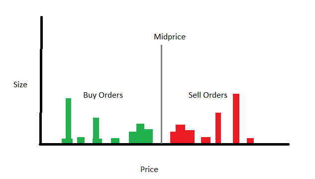
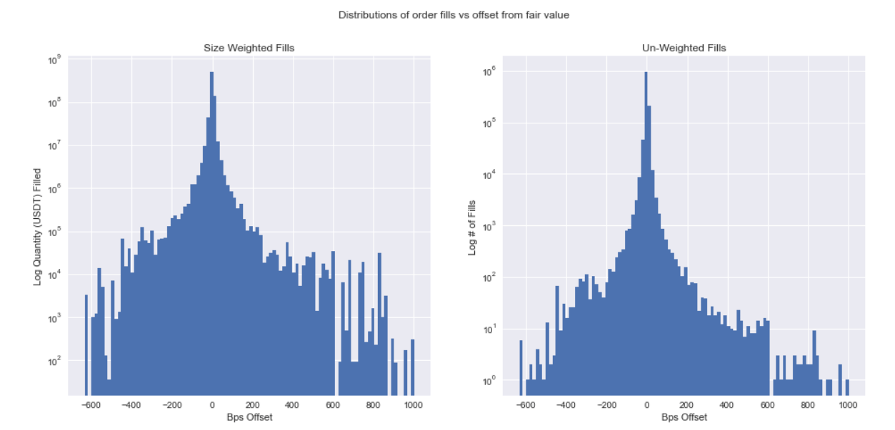
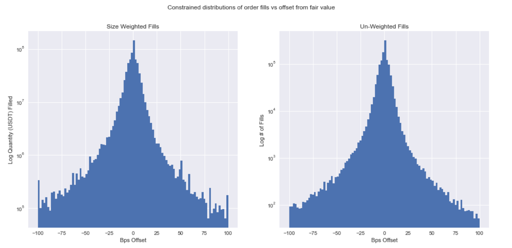

# Small Trader Alpha #2 - Advanced Approaches

Source HTML: [`html/2023-07-17-small-trader-alpha-2-advanced-arbitrage.html`](../html/2023-07-17-small-trader-alpha-2-advanced-arbitrage.html)

# Small Trader Alpha #2 - Advanced Approaches

| 항목 | 값 |
| --- | --- |
| 날짜 | 2023-07-17 |
| 접근 | 유료 |
| URL | https://www.algos.org/p/small-trader-alpha-2-advanced-arbitrage |
| 부제 | Expanding on the previous article's strategy with additional improvements. |

---

#### Introduction

---

In the previous article, I broke down a strategy for arbitraging shitcoins. There’s a bit more to uncover with this strategy, so this will be a part 2, where we explore 5 advanced modifications to the strategy. Some of these are more of a modification than others, so I’ll leave it up to the reader to decide which ones count as separate strategies in their own right.

They all share many of the risks and considerations discussed in the previous article, which I would recommend reading prior to this, or you may end up a little confused.

#### Index

---

1. Introduction
2. Index
3. Going Deeper
4. Getting Aggressive
5. Why not both?
6. Spotting idiots
7. Not-so-pure
8. Wrapping it all up

#### #1 - Going Deeper

---

All of this talk about best bid/ask gets boring after a while, it’s time to go deeper.

Deep where? The orderbook, obviously!

The first modification we discuss is therefore, how to place limit orders wider than the average West Virginia resident¹. We can catch much larger arbitrages in both size and % by doing this, and all with a much lower risk (only for the buy side of the trade - tough luck on the sell side). This pairs very nicely with advancement #4 (spotting idiots).

In the poorly drawn diagram above, we can see my sketch of a shitcoin orderbook. This is mostly informed by experience seeing these books, but certainly isn’t a general model to describe all assets. Hopefully, by providing some context of the causes behind what we’re seeing, readers will be able to adapt this generalization across assets.

I’ll first start by defining some terms to help us describe what’s going on:

- Tight liquidity - This is the liquidity near the top of the book. You can clearly see a cluster of liquidity near midprice for both the buy/sell sides of the book. We will refer to this liquidity as “tight liquidity”.
- Monster levels - I’ve drawn these a lot smaller (in terms of size) than they usually are (relative to tight liquidity), but for both the buy/sell side of the book, I’ve drawn 2 large levels we will refer to as “monster levels”.
- Offset - This is a metric we will use heavily in our optimization process and essentially means the bps difference between the price an order is placed (or traded) at and fair value (we’ll use midprice for FV). You may also hear me refer to this as the bps offset of an order.
- Deep liquidity - Pretty much anything in the book that isn’t tight liquidity.
- Idiots - Anyone who executes size like an idiot. This includes: using an illiquid exchange instead of Binance, dumping too much size too fast, and using a hilariously obvious execution algorithm. We will make fun of (and, on a lighter note, be thankful for the stupidity of) these market participants extensively throughout this article.

**Tight liquidity** is where most orders will end up getting filled, but aren’t these opportunities often caused by idiots executing large sizes into illiquid assets/exchanges (should’ve used Binance RIP)? Shouldn’t this imply that there is an increased probability of getting filled on wide orders when this occurs? Yes. Yes, indeed. But also, maybe not.

When should we be joining tight liquidity, and when should we be taking a step back in the orderbook to a deeper level? The answer depends on the reason the opportunity exists, which we can classify as one of the below:

- Risk Premium (Our chosen asset, or the market overall, is very volatile that day)
- Idiots (Idiots sending large orders into the book and gobbling up liquidity)
- Shit^2Coin (So illiquid/ low volume that no one can be bothered to arbitrage it)
- Wide fills just happen and this can be profitable. Not much more here other than noting that orderbooks may lack sufficient liquidity and as a result be profitable to place wide - without much detectable reason for why any specific large order was sent.

If the reason is idiots, then we will want to go deeper. It can still be worth going deeper when there is a risk premium, but for extremely low-volume assets, we will want to get as much size as possible to overcome the fixed transfer cost. So for low-volume assets, the tight liquidity is usually where we want to be.

**Monster levels** are the very large orders that make up the deep liquidity, along with some scattered (but small in size) levels in between. Especially for less liquid books, these tend to be very concentrated at single price levels instead of being spread out over multiple (hence monster levels, not monster liquidity).

We tend to see large sizes placed exclusively at a few levels, and this is a defining characteristic of monster levels in shitcoin orderbooks. It’s a result of an asset not having many market makers actively providing liquidity for it and the fact that it is easier to manage 3 orders than 30 orders in your order management system (OMS).

Thus, we can roughly say that these large levels are the orders of a handful of market makers or often the order of a single market maker. An interesting outcome of this is that these monster orders may be placed at predictable levels due to market-making agreements. A market maker may, for example, be required to place 100k worth of liquidity at a 1% spread, as well as another 100k at a 3% spread on both sides of the book. Most market makers earn their profit from the tokens/ options they receive for this service and aren’t making much money (if any) on the actual trading. If you’re a market maker and you know there isn’t any financial benefit to placing any tighter than required, then you’ll just place it near this 1% spread level - hence we often see monster orders have an offset close or equal to whole number %s.

This is not the case for all market makers, but certainly for many. How does this help us? Well, we can place our orders 1 tick tighter than these monster orders and hog all the flow for only a marginally lower spread without much chance that we will end up in a bidding war (no incentive for them to one-up us).

These orders will be very sticky (tend not to be moved much) and are less likely to react to changing market conditions such as risk premiums (because of agreements). This often makes wide orders less attractive for opportunities caused by risk premiums as deep liquidity more-or-less stays at the same offset.

I’d like to stress that this is not always the case, and orderbooks with more market makers will have an increasingly even distribution of deep liquidity. Other traders may also be doing the same thing as you without the bounds of a market making agreement and can provide another exception to this.

---

So now, after some context, we can finally look at how to optimize our limit order placement in a quantitative manner. This is accomplished through our good friend - the empirical distribution.

We take the bps offset for each trade over some lookback window and plot the empirical distribution. We align quote data with trade data and then calculate the midprice prior to each trade. This is then used alongside our trade price to find the bps offset from midprice that an order was filled at.

Above is the empirical distribution for an undisclosed shitcoin weighted by size and again without weighting. We can see that there isn’t really enough data for the tail values to give an accurate measure, so below is the same distribution, but cutting off fills greater (less) than +/- 100 bps.

I’ve used over a month of data to calculate this, so we can think of this as a longer-term distribution for trade offsets. Longer-term distributions are helpful when we are simply making money from an asset being illiquid and do not have any expectation of large orders being extra likely in the short run (i.e., no idiots TWAPing at present).

We can smooth this distribution using Kernel methods, or we can try to fit one of the many distributions out there to the data. Smoothing is mostly for longer-term distributions where we want a robust estimate of order offsets and their probabilities. Even then, smoothing is an optional extra and is mostly so that we can work with the limited data we have - if this asset trades a fair bit, then we will have more data.

Some other extras include: preferentially weighting more recent data points, attempting to find a general model for all assets (with adjustments for the liquidity/volume of each asset since this varies a lot and has a large impact on results), and (not very optional, in fact mandatory) capping the size of orders in our dataset to account for capital limitations (we might only have the budget (or exit liquidity) to place 10k in the book so if the average order size for >2% offsets is 100k we will be estimating 10x the expected fill qty per minute for >2% offsets because we can only take 1/10th of these 100k orders. This math is sort of inaccurate since our order size / average order size is not exactly the overestimation ratio, but the point stands).

---

Now, to compute the optimal offset for our limit orders, we simply loop over a range of possible offsets and calculate the expected APR for placing at that offset. It is recommended that you use information about the liquid exchange orderbook to estimate the actual EV as well as including fees in your calculations.

On top of this, we have other considerations to bring into our optimization process that will help the accuracy of our model. These include:

- Adjusting for the probability that our transfer threshold (the amount we need to beat fixed costs + profit margin) will be filled up in one go (this is the dream, placing a buy order so that we don’t have to hold inventory and getting our threshold filled up with one order so we only have to hold this inventory whilst transferring).
- Accounting for the risk of only getting part of our transfer threshold quantity filled (we may have to hold this inventory for a while if we’re placing wide and don’t expect any more wide orders from TWAPs in the immediate future). As well as developing trading logic to get more aggressive when this does happen. I will note that your transfer quantity won’t be that large when placing wide because of the fucking huge amount of spread you’ve just earnt + only large orders fill wide (high chance of crossing the threshold in one go), so can expect to overcome transfer costs much easier.
- Partially aggregating trades. Using aggregate trades is not ideal because we will only see the average trade price, but using individual trades (one order can result in multiple trades if it hits multiple levels) may give us an inaccurate estimate of the probability of getting filled in one-go / sizes not properly capped to account for what we can actually take. Thus, all trades with the same order ID that filled at or greater than each offset should be aggregated so that all of their size is treated as being from one order (for our probability of having our threshold met in one go and for capping order sizes)

Once we’ve done all of this and have accounted for the fact that we’ll be sharing this flow with the other orders placed on each level (I prefer to assume that all our orders will be at the back of the queue to avoid making it complicated), we now have an estimate for the APR at any offset from midprice. Then, pick the biggest.

To extend this to multiple limit orders, we start by optimizing the first limit order as described above, but for the next limit order, we simply account for the size our previous limit order(s) would have added to the book and optimize. If our first limit order had 30 bps as its optimal offset, the second limit order’s optimal offset will be greater than or equal to the offset of the first (or generally the largest offset so far for N limit orders), so we do not need to compute the expected APR for offsets below 30 bps and so on.

Multiple limit orders are preferable when the exit liquidity is costly, and we want to put more size through the trade. Our hedge exchange (Binance) should absorb our order quite easily, so this isn’t really a case where multiple limit orders on each side of the book are optimal (exit liquidity is not that costly - exit impact is worth accounting for in our model though).

1. *According to the most recent Behavioral Risk Factor Surveillance System (BRFSS) data, adult obesity rates now exceed 35% in 19 states. West Virginia has the highest adult obesity rate at 40.6%, and the District of Columbia has the lowest at 24.7%.*

#### #2 - Getting Aggressive

---

If it only costs me 1 tick more to get all of the buy/sell flow, then why shouldn’t I price improve (PI)? The short answer is that being aggressive tends to piss people off and make them aggressive in return.

Placing tighter than BBA to receive more flow can drastically improve the performance of the strategy, but it can also send the performance straight to 0.

This is because of bidding wars. If you place tighter than BBA, others may try to one-up you and place their orders a little tighter. You then end up repeating this process until all of the profit is gone - not ideal.

I can’t give you the answer here because there isn’t one that applies globally. Instead, I’ll give the next best thing - the tools to find out & approaches based on the results.

The first way of finding out is simply implementing an algorithm that places 1-tick tighter than BBA until it gets to a point where the arbitrage is no longer attractive. We can then see if and for which assets bidding wars occur.

If the answer is no bidding wars in sight, then lucky you, time to make some money.

But more likely, the answer will be that they do occur, and we then need to develop logic to de-escalate bidding wars. This will also depend on how far bidding wars will go and in what cases they are most likely to continue/occur in the first place.

Does a 1-tick PI cause a bidding war, but a larger PI avoids a bidding war? Is the stopping point different depending on whether I price improve a lot from the start or whether this happens gradually at a 1-tick pace? Is everyone just placing at BBA so if I price improve 1-tick, they’ll move their orders, but to the same price as me (making me front of the queue for very little cost)? How often does BBA change, and how much does that make queue priority worth? All of these are answered by testing in production and iterating.

If the answer is yes, bidding wars always occur, then any PI will be followed by further PI, so there is no benefit to PI.

To de-escalate a bidding war, we only have to place at BBA. If you are in a bidding war and you are the one who de-escalates, then you’ll be back of the queue and at a worse price than before. If we would be joining from the back of the queue anyways and have some probability of no bidding war, then we may find it optimal to “test the market” by price improving and immediately de-escalating if further price improvement follows. We’ve only lost 2 ticks (although they may not place 1 tick wider) off the price if we have to de-escalate (not much at all on the downside), but have the upside of being able to take much more of the flow / being front of the queue if others move to BBA on top of us.

#### #3 - Why Not Both?

---

If I have part of my order filled and the spreads are so wide on both sides of the book (and midprices cross-exchange are close to each other), then it can often make sense to place on both sides of the book using our inventory.

Most opportunities are a result of very wide spreads on the illiquid exchange and not a result of midprice misalignment, so we might as well make use of whatever inventory we have accrued in the book.

If we are buying shitcoins and have some inventory filled already, we can make some extra profit by placing this inventory on the other side of the book. If it gets filled, then we’re likely to walk away with much more than if we had transferred this inventory after reaching the threshold.

When doing this, we need to adjust our transfer threshold and our expected fill time to account for the fact that we can now remove as well as accumulate inventory. If we expect the arbitrage to disappear after 1 hour, then our estimate of how long it will take to get filled will need to account for the reduced rate of inventory accumulation. Especially if we are on the sell side of this trade (starting with inventory), we shouldn’t naively keep our threshold quantity fixed as we may end up with tons of inventory to execute when the arbitrage disappears - potentially creating a loss.

#### #4 - Spotting Idiots

---

You can do this in many ways. The easiest is just by looking at the trade feed for orders over a certain size (removes noise) and seeing if any particular size (or better yet, size bucket - ie 2k +/- 50) is very common. I’ve seen cases where people execute every XX seconds sizes within $1 of each other.

I’ll break this down into 2 main approaches:

1. Comparing against the empirical distribution / historical probability.
2. Global orderbook trade/ order frequency.

The first approach, which I won’t dive too deep into, is to use the historical probability of seeing a large order/probability of multiple large orders hitting the book near each other (near each other in terms of time).

If there is a very high probability that this is a TWAP algorithm, then we will want to exploit it (detected either through comparing against past TWAP examples or through comparing against the overall probability of these orders happening normally - keep in mind that large orders may cluster historically, so we may want to look at the conditional probability of another large order given one has hit recently).

I find that an easy + simple approach is to just look at the past few hours of offsets and see if there were multiple wide fills + judge if the TWAP has finished yet. A large BBA spread should suggest that liquidity is being taken aggressively anyways, so this is a good sign to look deeper.

The second approach, which isn’t so much my preference, is to explore the somewhat vast literature of TWAP detection algorithms. Fourier spectrum methods, and so on. This can get quite complicated, but it is a potentially valuable detection system to have.

When doing this, it is wise to compare against the global orderbook. If there is a lot of volume on this exchange for an asset when compared with others, then this suggests that there is an idiot or two hiding in the orderbook.

Going beyond volume, we can also look at net volume imbalance or break it down by order size quantiles (adjusted to be a % of volume - use with the previously mentioned volume comparison so that we don’t adjust away the recently high volume from our results).

#### #5 - Not-So-Pure Arbitrage

---

Sometimes withdrawals are disabled. This prevents arbitrage but can still be very profitable. ATOM had withdrawals disabled on Poloniex for over a month, and during the course of this month, the spread between Binance and Poloniex oscillated from almost nothing to above 10%.

This is a special case where these arbitrages can occur for liquid assets that have futures we can hedge with, like ATOM, so as long as it is in the right direction (spot borrow is still hard, we can only trade one side), we can earn a profit.

Not much to it. Slap on some Bollinger bands, and keep in mind that the spread will close out very fast once withdrawals are enabled (might be worth bugging the exchange for this timeline if it’s a small exchange which will bother responding).

#### Wrapping It All Up

---

Optimizing what you do with your limit orders and detecting the best opportunities is how you make more money. This is also competing for your time with the goal of expanding to more exchanges to increase strategy capacity, so allocate wisely - all can add to the profit you make a fair bit.

Hopefully, this was quite an informative read that provided some valuable nuggets about how these strategies get optimized (or at least this specific case). As always, these are shitcoins, so the capacity isn’t enormous. Prime alpha for small traders, but certainly not a strategy I would end up running - hence this article is able to exist for readers to enjoy instead of being stashed away in my notes. Happy trading!
