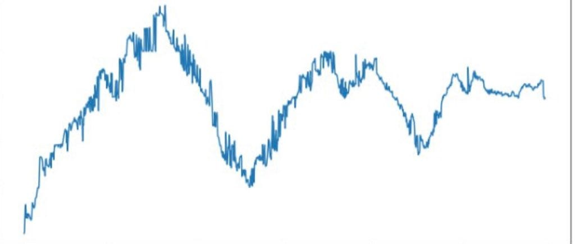
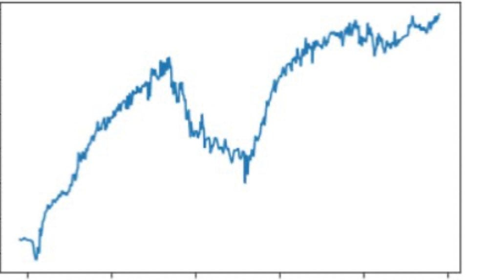

# Sentiment & News Data

Source HTML: [`html/2023-07-31-sentiment-and-news-data.html`](../html/2023-07-31-sentiment-and-news-data.html)

# Sentiment & News Data

| 항목 | 값 |
| --- | --- |
| 날짜 | 2023-07-31 |
| 접근 | 유료 |
| URL | https://www.algos.org/p/sentiment-and-news-data |
| 부제 | A few insights into using sentiment & news data to find alpha. |

---

#### Introduction

---

Today we’ll talk about alternative data and some practical guidance on how to use it successfully. We cover quite a range of cases going from longer-term strategies down to HFT strategies, but the theme they all share is the utilization of alternative data.

#### Index

---

1. Introduction
2. Index
3. Specific v.s. General
4. Nothing New Here
5. Noisy Sources & Quality Issues
6. Spending Money
7. Machine Learning & Models
8. Event Arbitrage
9. Regime Dependence
10. Hybrid Strategies
11. Feature Engineering Notes
12. Final Remarks

#### Specific v.s. General

---

There’s a big difference between taking a very specific view of sentiment and taking an aggregated picture of what everyone thinks. It’s a lot easier to find untapped data when it is specific since the universe of possible sources/ideas is so much larger. Let’s start by giving a quick definition of specific and general sentiment:

1. ***Specific***\*\*\*\* Sentiment refers to a constrained and filtered down selection of alternative data, often to a certain topic or person.

   1. One well-known example is the race to price in whatever Elon Musk says about Dogecoin, but of course, this has become nothing but a latency race that is hard to win. The better approach would be either having a notification bot that detects Elon mentioning crypto and discretionarily betting against the clearly incorrect ones. Elon mentions the word people → PEOPLE token (the one that wanted to buy the constitution) goes to the moon → everyone realized these bots are below room temperature IQ and he wasn’t talking about the token → a bit later, it reverted. You could also do this with the use of better models, ChatGPT is slow, but this isn’t that latency concerned - but obviously, the capacity on shitcoins is low.
   2. The above example is a more reactionary approach and shows how you would develop a trade in its complexity/ nuance so you aren’t fighting everyone on latency. If you aren’t fast, the book will blow out, and the liquidity is gone, so it has to be automated (can’t react discretionary), and that’s a v. competitive game. Specific sentiment-based alphas do have a shorter window where the information is relevant, but they can also be about topics where there is less focus on reacting to a single event, and instead, focus is placed on the evolution of a topic in public discussion.
2. ***General*** Sentiment may still have some constraints, so this is more a spectrum than a binary classification. This could be the overall Twitter sentiment on a stock from which we build a feature. I’ll discuss some nuances that occur with feature construction, especially for more general sentiment, in a later section. You’ve really got 2 choices for how to find alpha in general sentiment:

   1. Better data - Your data quality, originality, or breadth needs to be superior to the competition.
   2. Better features - You are able to find more nuanced effects that aren’t just a linear regression of average sentiment vs. forward return.

#### Nothing New Here

---

These next 2 chapters are going to discuss the data itself, starting off with originality. There’s a real balance when it comes to finding original data sources or at least lesser scraped data sources. You want something that is niche so that others won’t have looked at it but not so niche that the impact on prices is small & low capacity in nature.

As with much of my writing, the advice I share is anecdotal and derived from my own experiences. The rules I have may be entirely wrong, and there may be alpha in the places I discard, but overall I find these tips useful, and at least for those new to this topic, they can serve as great guidance on how to approach the problem until you’ve got some observations of your own. I do not run any sentiment strategies currently, but have (often quite successfully) researched such strategies in the past.

My first piece of advice is that the best sentiment strategies are a mix of many components, not just having great data. Often this is as simple as looking toward Reddit/ Discord instead of Twitter. Still heavily scraped but not as much as Twitter. It’s a small thing to change, and I can’t say Reddit is very original, but you will see that whilst they both aren’t exciting when applying simple logic, there is a stark difference between performance when we expand on this logic.

For a very arbitrary example, let’s say there is some metric of how scraped to shit a source is. If we say Twitter has 90% and Reddit has 60% - we might expect Reddit to perform 1.5x better for a general sentiment strategy. In reality, we see a very non-linear relationship where both will have horrible performance if we apply very basic logic, but a well-thought-out logic that captures a nuanced view of sentiment might perform okay-ish on Twitter data and amazingly on Reddit data.

This is not to say that complex logic outperforms, but if you invest a lot of time into the logic development and build a really great feature/model, you can get a huge boost just by changing the data to one that is still quite well known and doesn’t necessarily force you to spend all your energy on thinking about what data sources are as unique as possible.

Sources that get very little traffic are usually alpha-scarce. It isn’t the same as small caps, where you find a niche and make amazing returns (but on a smaller capacity). Instead, you get an extremely noisy signal because you don’t have a similarly niche asset to trade this information in. A niche signal is a noisy one because it is so little of the variance. You may still be able to find alpha if there is a clear way to isolate this (i.e. it spans a broad range of assets - equities are very suitable here because of liquid universe size - so you can have a delta-neutral long/short portfolio of your signals).

One example of a place where there’s alpha that hasn’t been scraped heavily, mostly because it’s a pain in the ass, is chats. Telegram and Discord servers require a lot of work to be put in when creating the scrapers, but equally a lot of work on how your process and filter this data. They have a lot of traffic and are far less looked at, but come with a heavy workload before you get high-quality data. You’ll spend most of your time on the data part of things, but you probably won’t need a super complex logic to monetize the data.

#### Noisy Sources & Quality Issues

---

Speaking of noisy data, Telegram and Discord are prime examples. If a 13-year-old on Discord is bullish on GME, then it probably isn’t such a valuable data point, but if the leader of a pump & dump chat is commanding his degen army to purchase a shitcoin, then maybe that is more of an exciting data point.

Reddit, for example, you need to control for the Karma of the user, and if you’re looking at Telegram signal chats, you want to control for things like:

1. Size of their audience
2. How often do they come out with signals
3. Market cap or volume of what they are expressing sentiment on
4. Have they historically had an effect on prices

The size of their audience should be quite simple. How many people is this sentiment going to propagate towards, and how compelling will this be? If it’s a signals chat, then people are likely to copy it, but if it’s the random thoughts of a large Twitter account that isn’t really known for posting trades, then not so much.

The frequency of their signals is specifically for cases where the post is going to be taken as a call to action by others (or generally people wanting to copy them), but it is going to be important because of two things:

1. Less frequent signals will have more volume per trade as people will tend to miss them less.
2. More frequent signals will give you more data to work with when figuring out whether they actually have an effect on prices.

Adjusting for market capitalization (or volume) is only necessary when your sentiment is in nominal terms. If you are looking at the number of tweets (hopefully, you’ve adjusted for the viewership & credibility of each poster to remove bots & small children on Robinhood with their parent’s credit card), then that will need to be adjusted because AAPL's baseline level of Tweets is much larger than a small cap. However, this can be resolved by looking at a signal relative to its historical levels. What is the z-score of the sentiment?

There is no clear answer as to whether to look at the relative change in sentiment or the overall level of sentiment in nominal terms but then adjusted for the mkt cap. If you are using the z-score of sentiment (which is my preference), then you need to note that 1 tweet → 5 tweets are not very useful. 1 tweet → 5000 tweets will create a huge z-score, obviously, and is probably the right trade to make, but now your z-score doesn't tell you much information about sizing. You’ll overallocate if you don’t adjust for this.

Covering some considerations:

1. Filter out bots
2. The intensity of the call to action
3. How novel is this view relative to the current conversation
4. How popular was this post, and do people feel strongly about it
5. What is the average audience, is this actually an unpopular post, but coming from a famous account that gets lots of views anyways? (just because a big account posted it doesn’t mean it will move prices if everyone who saw it laughed at it)
6. What is the credibility of the user (Reddit karma etc)?
7. Is this historically a market-moving account (certain accounts have a clear market impact, but this is more for specific sentiment now)

#### Spending Money

---

Scraping data is a pain in the ass, and a lot of quants don’t feel their alpha is in the data but instead in what you do with that data. Many vendors sell alternative data, but the quality of this data varies immensely.

There are ones that will cost you 100k/year and definitely have alpha in the data, but the research reports these firms send you will be on their historical data. Was this data available to clients at the time of the backtest? If this was data no one had, then sure, it will be 6 Sharpe, but now that many managers have it, will that stay the same? Probably not. Always get a trial and test first.

A lot of vendors will really constrain your ability to add value on the modeling side as they often don’t provide the text but instead the topic and sentiment score of the post. Many add other features, but it’s harder to find an edge when you (and everyone else) already have these features, and it’s forcibly the same feature for all clients.

All of this puts focus on not committing to expensive subscriptions until you are sure you have found real alpha that will continue to perform without severe decay into the future. Yes, it is nice to have things done for you, but you also need some space there where you can add your own touch and find alpha. Think of where this might be and what avenues are left open to the client to solve.

#### Machine Learning & Models

---

I’ve never been a person that derives their edge from this area, and frankly, I find it overrated, but I have found good results using AI like ChatGPT to correct mistaken reactions from the market where the strategies are simply looking for the mention of a word by an account - regardless of whether they are actually talking about the asset.

There are many libraries that can get the sentiment from text, and I get great results from ensembling many / culling the terrible ones. As I said, many bots are very simple and do not even try to find the sentiment - merely the mention or epidemic-like propagation of information may be enough to have a strong signal.

All I will say here is that I know people who have made a lot of money creating their own models, but I think this is vastly outweighed by the sheer amount of people that come into these strategies and try to find their edge this way. It is not about getting the best possible sentiment, simple rules that come from thinking about why / when a strategy works/fails will improve models significantly. There’s not going to be some complex model you can pull from other fields to model sentiment propagation as an epidemic process (example) - instead, you will find corner cases and rules where there is a clear and strong impact on returns conditional on certain things aligning.

This is why I prefer the feature side of things. If a certain group of accounts, in a short span of time, are talking about a topic, then perhaps there’s alpha. Then you bring in the model side of things, where you figure out which types of conversations move markets. Vitalik getting caught with a hard-on probably isn’t that bearish/bullish for ETH (even if the VitalikBigDickInu token did then moon), but a rapid spread of FUD might be a bad sign for an exchange token - especially if there has recently been no doubt in the safety of said exchange.

Post-FTX, we saw many FUD cases on other exchanges, and there’s a lot of nuance to this. On one hand, everyone cared about this, and any FUD had a huge impact on prices, but at the same time, using a historical z-score of sentiment for each topic would have been unreliable because all exchanges had an elevated level of FUD. Your z-scores for everything would have all been high. This is a case where you needed to normalize for the overall level of discussion on this topic, not just specific to each exchange token. A 5 z-score on KuCoin FUD discussions means nothing if this is actually quite mild compared to all the others sitting at a 20 z-score.

This has drifted off into feature construction, mostly because I haven’t got much to say about ML. I have used libraries when I needed a sentiment, but even this was less common because I find more alpha in the topic / how it evolves than the sentiment of said topic. I did have a random idea to use ChatGPT to correct misinterpreted events, but that’s my only claim to fame where the model made the difference. Correction cases were rare, and the wait time on ChatGPT didn’t make it useful for the initial reaction, only the price action that comes after. There was a signal there, but not worth the time (more of a research punt) as the events were rare, capacity was low, and frankly, it would be a pain to implement.

#### Event Arbitrage

---

This is a strategy that is only for specific sentiment. You have a shorter timeframe to react, but in my opinion, this is one of the best places to look for alpha if having a large capacity isn’t the main concern. Here, we are pricing in information that has just been released - reacting to a specific event. Whether this is genuinely new information or if it is just a large account which moves the market, whether their comments have substance or not depends, and both can move the market.

I’d break this strategy down into 3 versions:

1. Pure event arbitrage
2. Post-event strategies
3. Topic growth/epidemic models

The first of these is the one that truly counts as event arbitrage, but they all share the commonality of being focused on actively trading around an event and its evolution.

Pure event arbitrage is simple. We get information, and we react faster than everyone else to price it in. There are really 2 types of events we react to fast:

1. New information
2. Source that moves the market when they talk about certain things

Often these bleed into the same category where an account has a clear history of moving the market when they comment because their comments tend to be new information to the market. Certain journalist accounts on Twitter fall into this category.

In other cases, we may need to ascertain how original this information is. If this is FTX bankruptcy news that is new, then it will have a very large impact relative to its views compared to people talking about FUD. We may look at how this has propagated, and this then falls into the 3rd category, where we monitor the epidemic-like propagation of information to tell if people think this is new information or perhaps the spread of FUD.

There is a winner takes all nature to the capacity of pure event arbitrage. If you are the first to react, you get access to all of the liquidity before it has been pulled. You get to be less bothered about the accuracy of signals because you pay a low spread cost and can put large size into it. There is still plenty of opportunity once the spreads have blown out, and these things take minutes to properly price in and even longer for the effects to fully play out. You will have a high cost to enter and lower capacity, though, so you need a strong signal that can overcome these costs.

Post-event arbitrage strategies are generally divided into two areas:

1. Hybrid Strategies (2nd next chapter)
2. Corrections

Corrections are simply when there has been a mistake in the pricing because most of these bots are running extremely simple logic. The example I gave earlier of PEOPLE token and Elon covers this nicely. I’d say this requires more of a discretionary take, or you need to have a clear model edge.

Hybrid strategies are the combination of well-known effects and sentiment.

Epidemic approaches to topic modeling can perform very well, but there isn’t much alpha in applying a model from epidemiology. Instead, you have to look at whether this information is truly relevant to prices, who is talking about it, and how the market tends to deal with this, and then after all of this, you get to build a model for how the information propagates, but this isn’t where your alpha truly lies.

#### Regime & Market Mood

---

I’ll kick off this chapter with a market story:

- ANCHOR announces a Microsoft partnership. Asset shoots up 50% + continues in that direction.

If you looked at this as an educated market participant, you would instantly think, “Everyone has a partnership with Amazon, Microsoft, or Google - it’s a glorified discount on cloud computing for spending more than half a million”, and then would have taken the contrarian bet on a reversal.

Oh, how our educated participant would have been wrong. Greater fool theory triumphed in this case, and any slightly positive news would have sent ANCHOR to the moon, regardless of the magnitude of said news.

This isn’t a lesson on greater fool theory, it is instead a note on understanding the regime and how the market will respond to the information. At the time, the market was bearish, and the regime was such that for any small-cap, the sentiment magnitude had no effect on the upside. Any slightly positive news would be treated as maximum positive news and would send shitcoins skyrocketing. The market regime will affect:

1. Magnitude’s relevance
2. Direction a signal gives

Sometimes there will be a default magnitude where all news gets treated roughly the same as long as it is positive/negative, other times magnitude of a signal will have a proportional effect on returns. The start of a bear market will see any slightly negative news cause very negative returns, and in my example, small caps were looking for hope - of any kind - that could be cause for a degen pile in.

Direction can change as well. In a bull market, FUD will have a positive effect on returns as the shorts get liquidated, feeding the rally. Someone has to feed the rally, after all.

Once again, this is a mix of regime, topic, asset, direction, and magnitude. Do small caps respond differently to large caps? (Yes, those reacting are fucking degens when it comes to small caps). The topic comes into the ANCHOR example because this was a press release by the company; this was likely one of the main reasons it had such a large impact. In another regime, it could have very well been ignored without the desperation for hope/optimism that had captivated the market for such shitcoins at the time.

Regime changes are worth monitoring. These aren’t necessarily applying an EWMA crossover to the benchmark asset for that asset group and calling that the regime. The meteoric rise of PEPE created a shift in the regime for ultra-small cap coins because there was suddenly a tale of people turning a few hundred dollars into millions in such a short span. People suddenly had this tale front of mind and were looking to live up to the same glory. Thus, this contributed heavily to the regime of small caps mooning on even the slightest positive news. It takes a lot of skill and time to be tuned into the regime, but we can roughly break down the factors for the small-cap regime:

1. PEPE driving increased flow towards lottery-like assets.
2. The market was looking for hope to latch on to.

This was not an isolated event. PEPE created a feedback loop where people became inspired to pump shitcoins and briefly established the idea that PEPE was not a one-off event. In many people’s minds, the market was rife for such trades, with many new examples of rags to riches created as this idea became an epidemic.

#### Hybrid Strategies

---

Hybrid strategies are simply combining a well-known or otherwise simple effect with sentiment or an event. I’ll list off some of these for general and specific sentiment individually.

**Specific:**

- Initial Jump Momentum

  - This is the initial reaction to the news. The pricing in of news may occur with some jumps, but it tends to happen quite smoothly over a period of 10 seconds up to a few minutes (depending on whether this is SPX or a random small cap). This is best used as a secondary condition on top of an event arbitrage signal to ensure the best results. It doesn’t really work without already having a good initial event signal and knowledge that this is a news-driven price shock.
- Post-Shock Reversal

  - There tends to be a reversal after the initial momentum, but spreads will have blown out, so the edge comes from getting a limit order fill as a contrarian against the initial momentum.
  - Below is an example graph for 2 unnamed assets/events post-event. These are major liquid assets. We can spot the initial momentum (it’s not an instant jump as many would think), but there’s a clear reversion that tends to ripple out.

- Post-Shock Momentum

  - How can you have reversals and momentum in the same time series? Well, that’s because they fade and occur on different timescales. We have seen the initial momentum, but there is a longer-term momentum that occurs alongside mean-reversion ripples fading away within it.

I’m sure others can find many nuances here. What timescales do reversions and momentum occur on? How does this change based on the type of event/asset/ all sorts of factors we’ve discussed already?

**General:**

- Overnight return effect + sentiment (paper on this was published, their strategy has obviously decayed, but the idea applies to other areas).
- Momentum + sentiment.

  - The best momentum comes from behavioral effects, not prices moving from news. We want to filter out news-driven moves and isolate momentum from a gradual and smooth increase in sentiment toward an asset.
- Seasonality. There are many well-known effects here, but these are also easy to overfit, so care must be taken.
- Reversals on junk momentum.

  - We’ve already talked about post-shock mean-reversion, but a good example for longer-term reversals would be filtering for assets with the largest volatility-adjusted gains/losses (a poorly done momentum portfolio) and then picking off the assets which will be allocated to by momentum managers. These are really false flags that will revert after it becomes clear that the price move was news-driven and not persistent.

#### Feature Engineering Notes

---

Throughout the article, there has been a fair bit of discussion on how to engineer features by thinking carefully about how effects occur and what might drive them. I’ll add a bit more here, although it will be short, as I don’t want to repeat myself.

One quite unintuitive idea is that a lack of sentiment can be a very strong positive signal, especially when made into a hybrid strategy. Assets that have had very low levels of discussion relative to history had a tendency to outperform for a Reddit dataset I was punting around with. This was a very clear effect and improved by adding a conditional that assets with a large amount of discussion previously should be excluded (a sign that an asset has become old news, hence the low standard deviation of chatter coming from a high baseline level of chatter we normalize against).

A highly positive sentiment may be bearish because we are now expecting a reversal, how strong the current price momentum is and how old the information is will be factors here. This is where it pays to combine simple price effects with sentiment because there is usually a timing factor, and we want to capture the reversal or momentum when it makes sense and not just assuming one will be the case.

#### Final Remarks

---

I originally set out with a plan to write a detailed guide on sentiment strategies. Instead, I ended up making a mildly organized collection of tips and learnings from my own experiences on the subject. I’d argue this is the best type of content because it is rarely shared knowledge - even if it is a mix of examples and teachings rather than a step-by-step guide.

Summarizing my most important points:

- Alpha doesn’t only come from one part of the process. You don’t just build an amazing model and neglect features, data quality controls, and source of data.
- Positive sentiment doesn’t instantly mean an asset will go up. Regime, topic, and the price action that is occurring all can flip a signal from a buy to a sell. Where’s the reversal (if any), am I timing it wrong?
- A great machine-learning model doesn’t guarantee alpha - it is only when we specified that we are looking to correct false flag events that things became interesting.
- Topic and the type of information aren’t something you can systematically engineer. Use your brain and think about why people are talking about something to find the most worthwhile cases.
- Hybrid strategies rock.
- Post-shock price action is extremely clear, but the spreads tend to be so wide that you need to have good execution (playing into the initial momentum flow to get filled on a post-shock reversal trade) and/or need to be extremely confident in the signal.
- There are many dimensions: magnitude of sentiment, direction of sentiment, level of discussion, regime, market capitalization of asset, timeframe of signal, topic people are talking about, evolution of the sentiment, account/person a comment was made by, and much more.
