# Seasonality - A Comprehensive Overview

Source HTML: [`html/2023-08-18-seasonality-a-comprehensive-overview.html`](../html/2023-08-18-seasonality-a-comprehensive-overview.html)

# Seasonality - A Comprehensive Overview

| 항목 | 값 |
| --- | --- |
| 날짜 | 2023-08-18 |
| 접근 | 유료 |
| URL | https://www.algos.org/p/seasonality-a-comprehensive-overview |
| 부제 | An in-depth look into seasonality effects across different markets. |

---

#### Introduction

---

This article will be quite long by requirement as we aim to cover all the known seasonality effects. We backtest and analyze the performance of many, but not all, seasonality effects. Some effects are specific to foreign markets where the data is harder to acquire, such as Saudi Arabian markets.

Our definition of seasonality will be anything where time is the primary component of the feature in the strategy. This could be the minute of the hour all the way up to the month of the year.

For many of these strategies, we will add custom improvements because I hate the idea of simply summarizing material that a competent researcher could discover themselves. I will also suggest ideas for improvements to the strategy, leaving the actual testing of the ideas to the reader. I hope this article can inspire many research projects.

Some of the highly intraday effects clearly won’t beat fees. There isn’t much point in backtesting these because we already know the curve will be terrible. We will instead look at the average market return conditional on our seasonal period relative to other times. This is still valuable for execution, where we can get a few extra bps of return just by executing at a slightly different time.

#### Index

---

1. Introduction
2. Index
3. General Overview
4. Seasonality Effects

   1. Day-of-week
   2. Turn-of-month
   3. Turn-of-candle
   4. Turn-of-hour
   5. Hour-of-day
   6. Options Expiration Effect
   7. Overnight Seasonality
   8. Weekend Effect
   9. Pre-Holiday Effects
   10. Hajj Effect
   11. Ramadan Effect
   12. Month-of-year
   13. Election Seasonality
   14. Sales Seasonality Effect
   15. Management Earnings Forecast Seasonality
5. Capturing Seasonality Tips
6. Volatility As An Alternative To Returns
7. Conclusion
8. Papers

#### General Overview

---

There are a LOT of seasonality effects to discuss, and I will try to go into as much detail as possible for each, but it obviously won’t be to the degree that I normally would, given the vast amount of them.

Giving a list of all the seasonality effects we will be covering:

1. Day-of-week
2. Turn-of-month
3. Turn-of-candle
4. Turn-of-hour
5. Hour-of-day
6. Options Expiration Effect
7. Overnight Seasonality
8. Weekend Effect
9. Pre-Holiday Effects
10. Hajj Effect
11. Ramadan Effect
12. Month-of-year
13. Election Seasonality
14. Sales Seasonality Effect
15. Management Earnings Forecast Seasonality

We’ll cover mostly equities and digital asset markets, as these are the markets that are easiest for me to backtest in (just having the data ready, being familiar with them, and having experience with that data). I have data for many other markets, but I am a hoarded, not so much a user, of said data, so we’ll focus on those markets.

#### 1 - Day of Week

---

A very common seasonality effect observed in equities is the day-of-the-week seasonality effect. We will use BTC & ETH because I already have the data open from testing other effects. The idea is that people hate Mondays, and that carries over into their market sentiment on Mondays, leading to lower returns. Additionally, we hypothesize that Fridays are great and lead to higher returns. Let’s see if this is expressed in the data:

[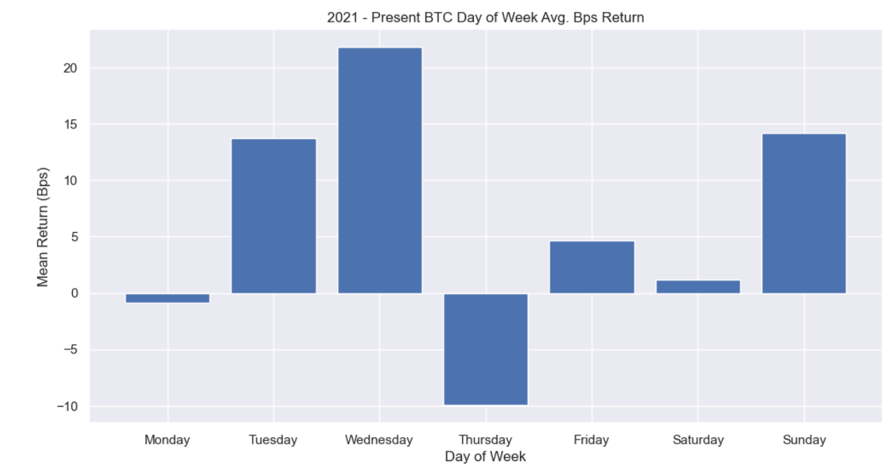](images/342b295a603c.png)

[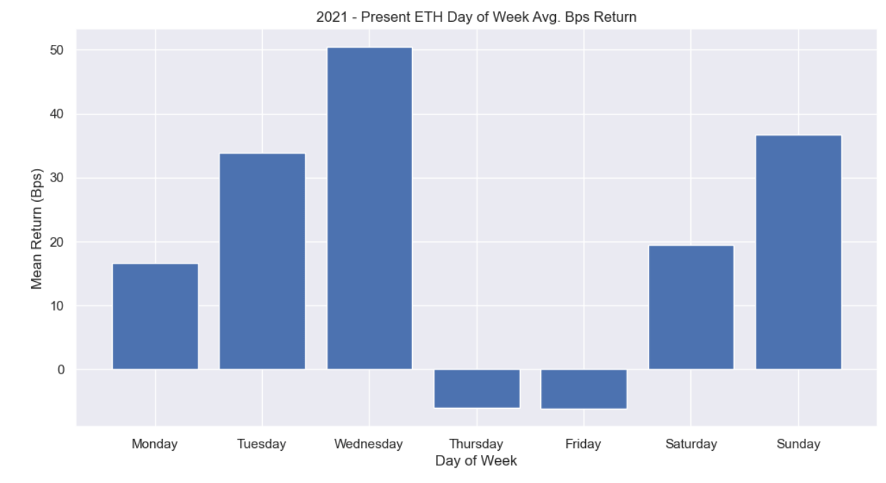](images/235fd929daed.png)

Well, that’s obviously not fucking true, then. In fact, let’s look at 2021 and 2022 alone to see how “robust” this effect is:

[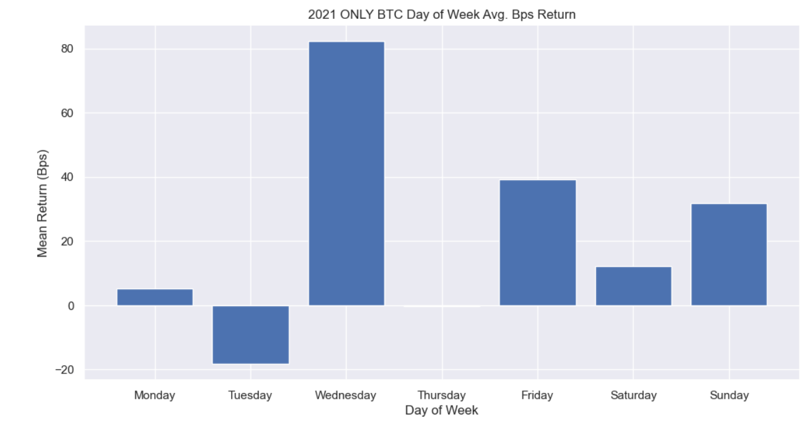](images/39d5d531232c.png)

[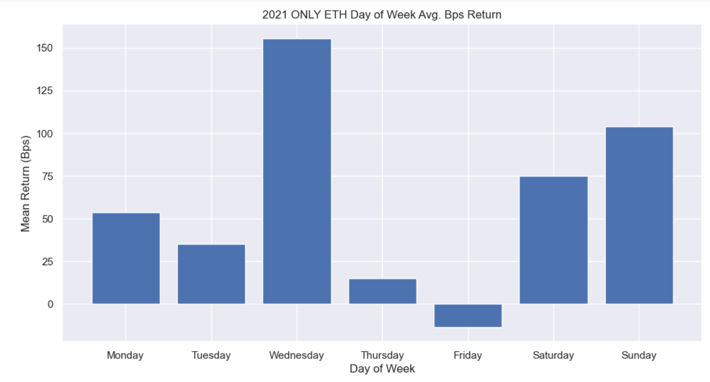](images/a1f1410e65a8.png)

[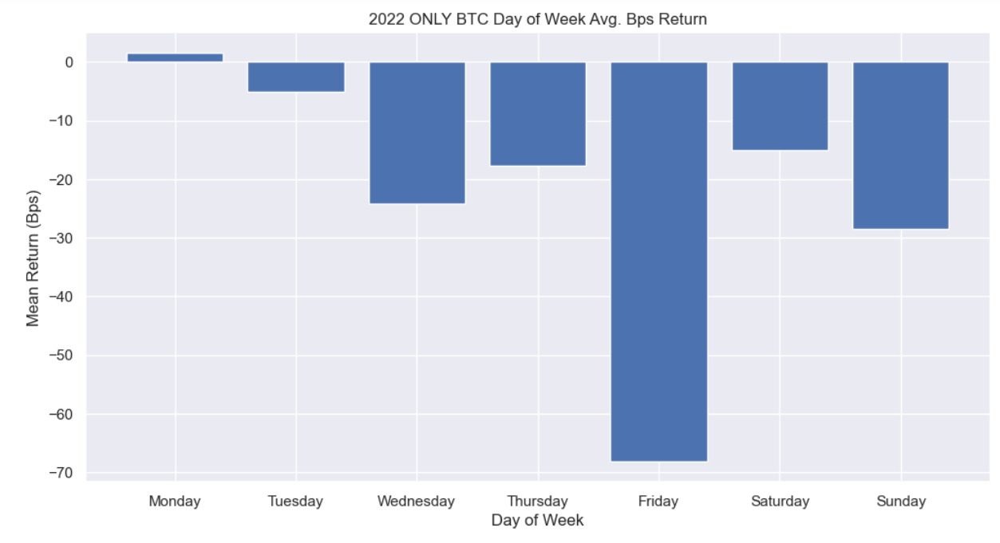](images/b32584e0ce92.png)

[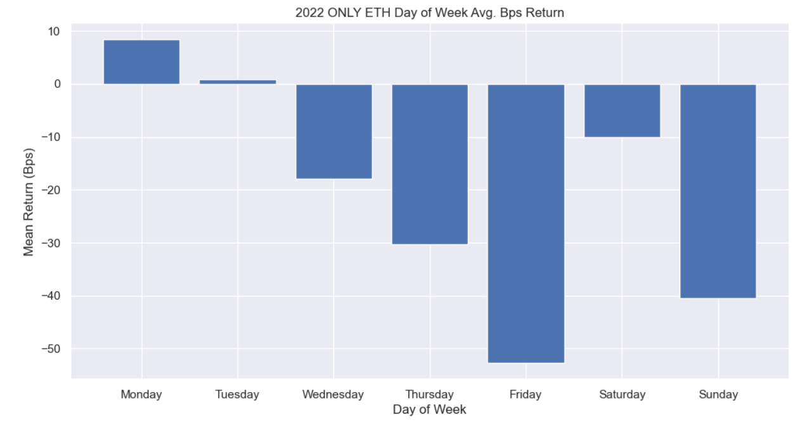](images/3e5bbed42a79.png)

As I expected, this isn’t very robust at all. This effect swaps all the time and really is not robust in the slightest.

#### 2 - Turn-of-Month

---

This is often referred to as the end-of-month, day-of-month, or paycheck effect in addition to the turn-of-month effect. The idea here is that most people receive their paycheck on the last day of the month and subsequently will invest that into the market. Many people may have auto-deposit setup with their broker to enable this, creating a non-price-sensitive flow that we can front-run. The other explanation is simply that hedge funds will rebalance portfolios at the end of the month.

Our strategy logic here is that we will buy the S&P100 at the open on the last day of the month and then hold for 3 more days after this to make sure we capture all of those paychecks. Here’s the backtest:

[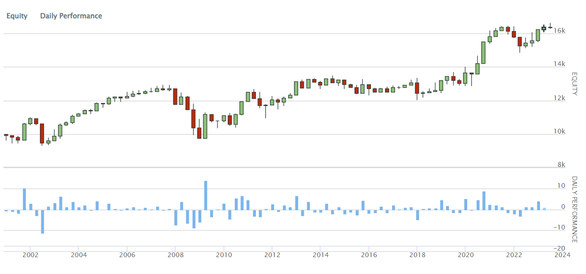](images/44fd6f6591d5.png)

This one isn’t actually that bad and is pretty robust across multiple markets. It does depend on the market itself, which days the effect occurs on though. For commodities, we tend to see the last 3 days of the month have this effect instead of the last day + the first 2 days for equities. This is explained quite well by the participants in each market. For commodities, we expect that most of the flow will be driven by institutional players rebalancing their portfolios, which happens prior to the end of the month. Whereas, for the S&P100, the flow is mostly driven by retail investors depositing their paycheck, which will hit on the last day of the month + a couple of days after.

\*Our equities backtest uses quote-level data and is inclusive of fees based on those charged by IBKR

#### 3/4 - Turn-of-Candle & Turn-of-Hour

---

I’m lumping these two together because they are explained by the same plot. We will use BTC & ETH data to show this. The idea is that many traders will use hourly bars and 15-minute bars, so we expect the returns in the minute after the candle is released to be strongest. Let’s have a look:

[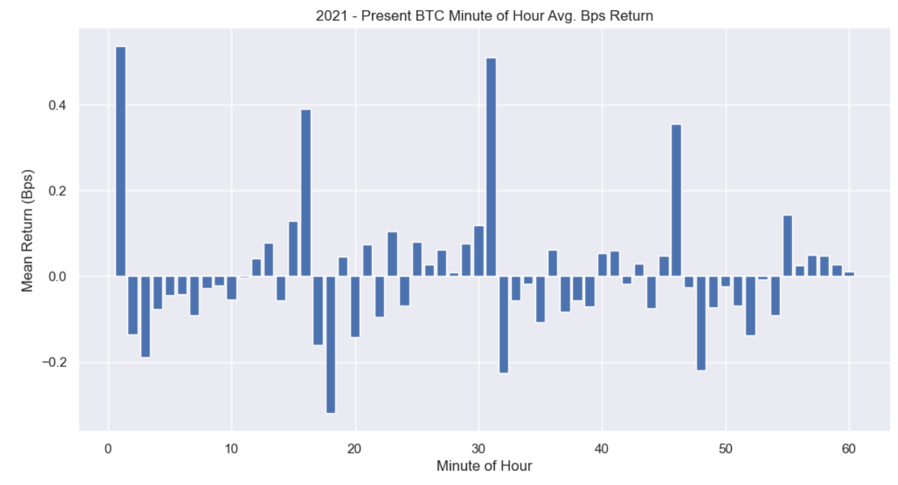](images/0b0b4b5acbf0.png)

[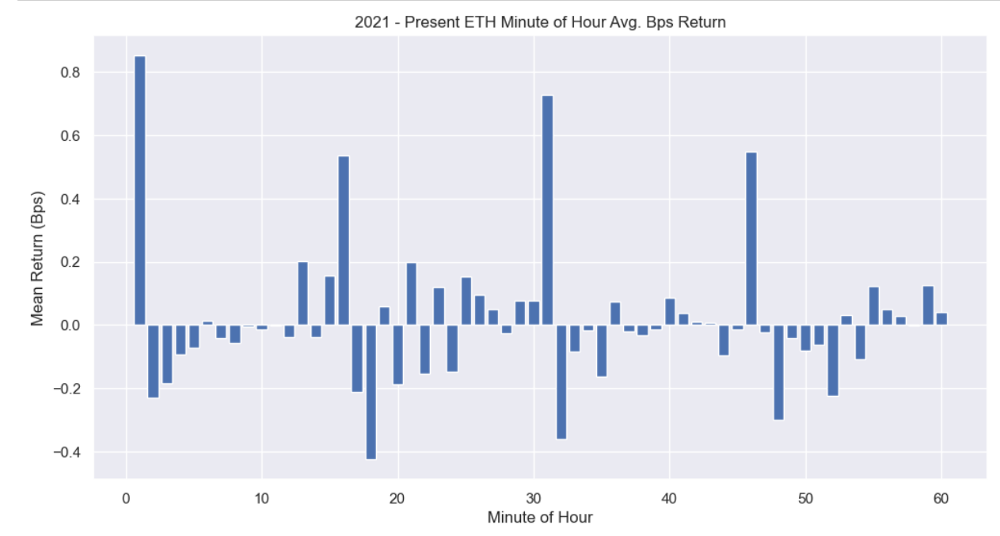](images/09a9229d9570.png)

Pretty clear that this is a real effect, but it is also very clear that this will not be able to beat fees based on the y-axis and knowledge of the cost to trade BTC & ETH. What if we look at the first hour of the day:

[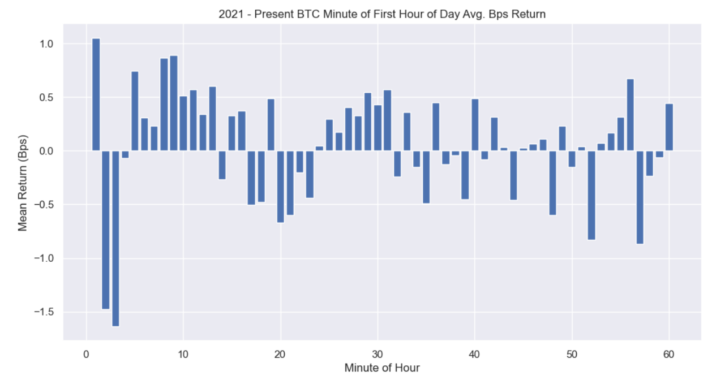](images/4045b252706a.png)

[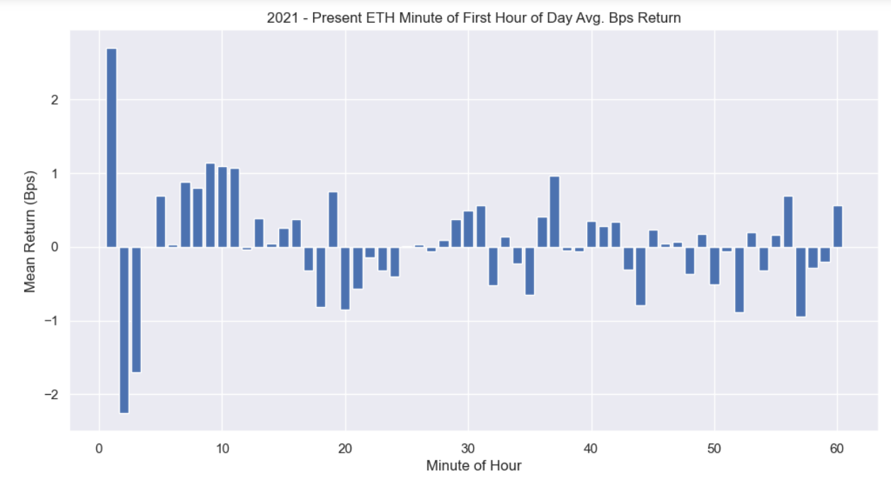](images/505da5ce3171.png)

The effect is clearly a LOT stronger. In fact, this one may actually beat fees if we are working with Binance 0 fee spot pairs & focus on getting short for the 2nd & 3rd minute of the day, but someone else can backtest it. I think the zero-fee spot pairs still exist for /TUSD pairs, and it probably still does for other exchanges like Crypto (dot) com. Spread should be in the pennies range.

The first hour of the day minute of hour seasonality is not in any of the literature to my knowledge so perhaps this one is especially worth exploring.

#### 5 - Hour of Day

---

The idea behind this effect is that there is an outperformance of assets during certain hours of the day. We will use BTC & ETH as our assets since these trade 24/7, which lets us test all the hours of the day. Taking a quick look at the mean return (in basis points) for BTC and ETH by hour of the day, we see:

[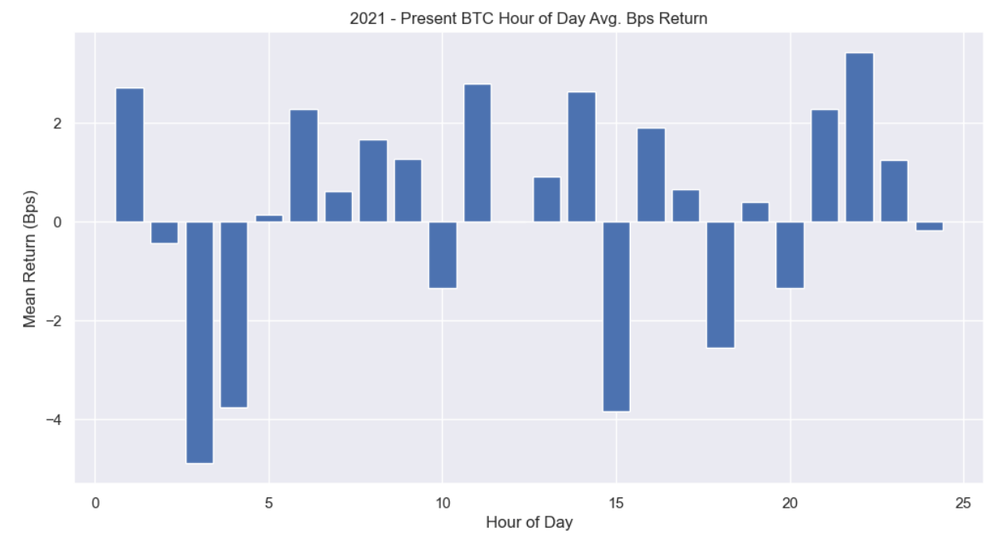](images/213922880c10.png)

[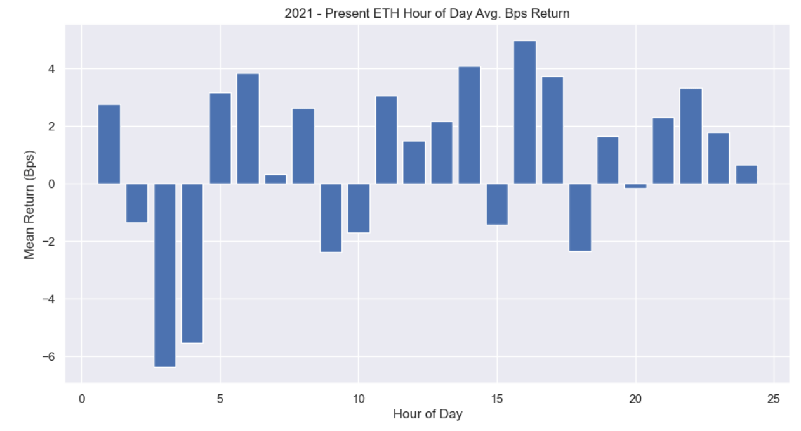](images/6974a6b92c90.png)

There isn’t an awful lot of confidence here in terms of any specific hour of day generating statistically significant returns and if you specifically look at 2021, 2022, or 2023, you will see a very different plot. To me this implies that there is not much signal here.

We will instead look at the hours that the NYSE is closed (first image) compared to the time that the NYSE is open (second image). The performance of this in BTC is shown below:

[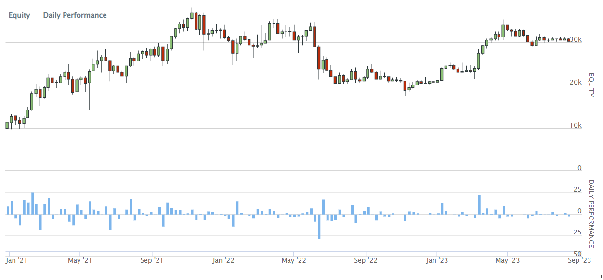](images/0545e2cbc585.png)

[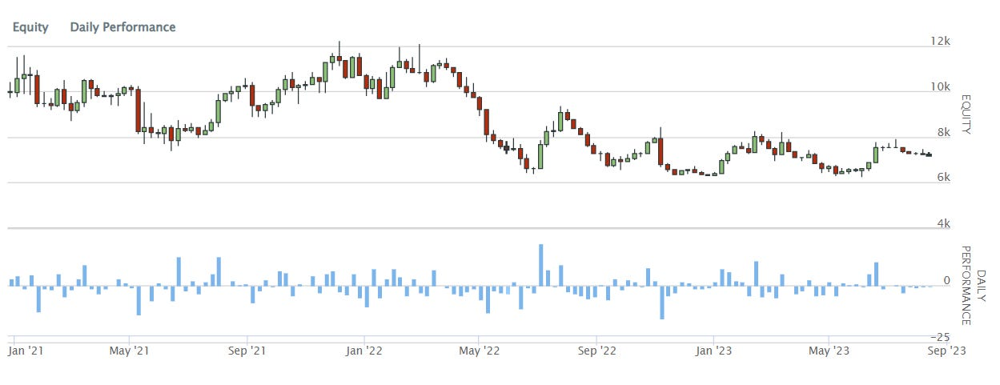](images/488f05f4943d.png)

Again, not much signal here. Not convinced. What if we long during the period when the NYSE is closed and short when the NYSE is open? This is shown below:

[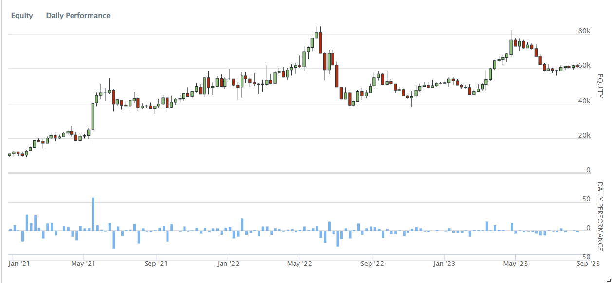](images/390b6ffb88ca.png)

This is a lot better, but it still has a lot of volatility, and I am not anywhere near the confidence I’d need to say it’s a significant effect. I also assumed 0 trading fees (but quote data was used, so spreads were included) for all of these performance curves since I know they’ll probably be terrible if we include costs, so even if you are convinced by the last plot, it isn’t realistic to run.

#### 6 - Options Expiration Effect

---

This strategy exploits the fact that monthly options, which are the most traded options, expire consistently on the same date. This leads to seasonal effects in underlying returns. To take advantage of this, we long the S&P100 for 5 days prior to the expiration of the monthly options, exiting on the expiration date.

Below is the performance of this strategy:

[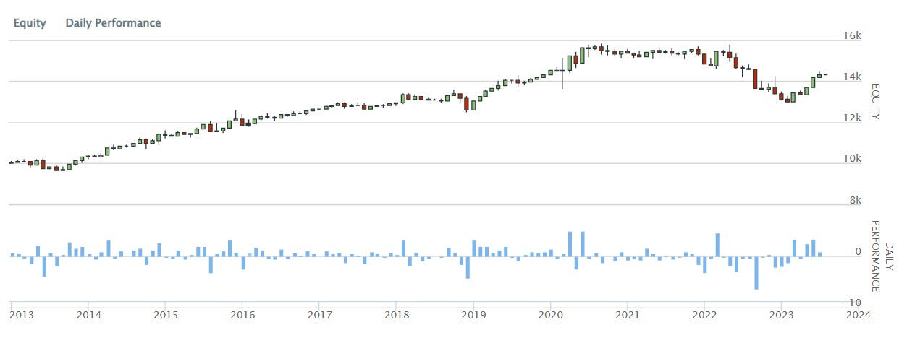](images/756147d2a67f.png)

As we can see there is a lot of beta exposure to the benchmark underlying performance which we show below:

[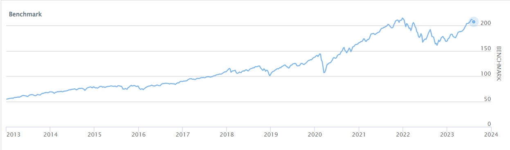](images/aad9923b6dce.png)

We have a Sharpe ratio of 0.449 and a beta of 0.153. We are comparing this to a benchmark where we are holding for a lot more time than our 5-day exposure. This probably means that our beta is far less than reality because the volatility is not equivalent.

When we use a volatility-adjusted hedge for the underlying to try and remove the beta, we get this result. We hedge on days other than the option expiration days:

[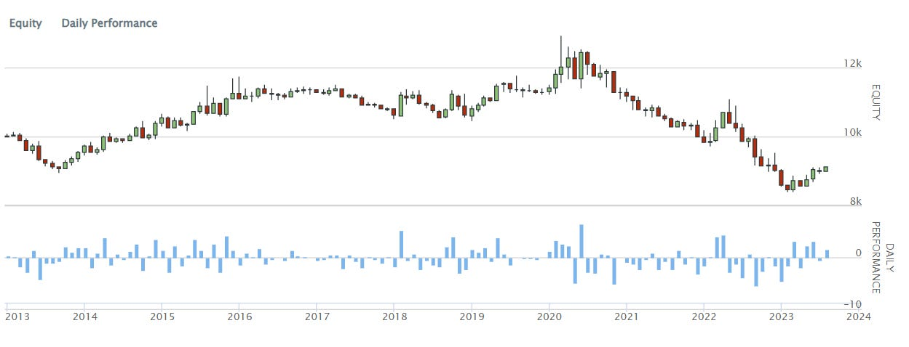](images/73ce198909f8.png)

This is even worse, and frankly, it is a common result to have this happen. Need to risk it for the biscuit.

Potential improvements would follow along the lines of attempting to forecast the direction of the flow. This could be done by using below filters:

- X day EWMA
- Open Interest
- Dealer Gamma Exposure

I would be cautious with all of these. GEX is calculated in a way that isn’t actually very accurate at all, and frankly, I am not a fan of it. Open interest could be an interesting candidate and so could using an EWMA regime filter, but both of those come with the added risk of overfitting given the limited number of data point.

#### 7 - Overnight Seasonality

---

In equities markets, it is well known that the returns overnight are far greater than the intraday returns. Let’s see how a strategy where we buy at the close and sell at the open does for the S&P500:

[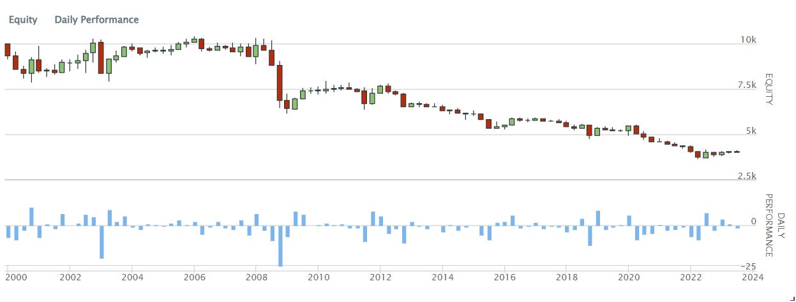](images/b276b8e13294.png)

As many already know, this one fucking sucks. What if we assume no trading fees (we still include the spread)?

[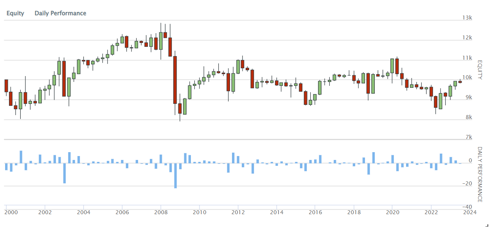](images/3e4d9af77ca9.png)

Yep, still terrible.

#### 8 - Weekend Effect

---

In equities markets, there is no trading over the weekend. Hence, we find that returns over the weekend tend to be much larger than returns during the week. This effect has been documented extensively. Therefore we can attempt to profit from it by buying at the close on Friday, and selling at the open on Monday. We will backtest it on the S&P500:

[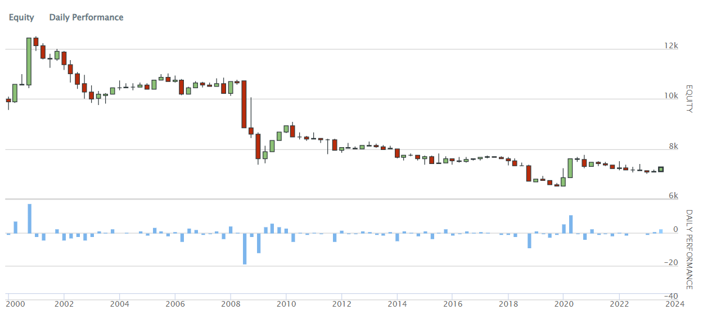](images/c8e66fee3d15.png)

This used the costs that would be expected using IBKR as the broker. Let’s see what happens if we remove trading fees (we will keep spread):

[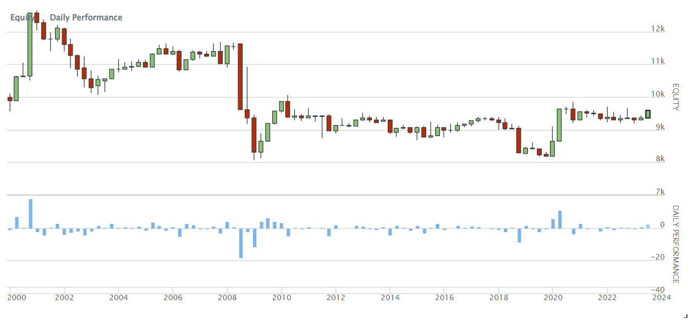](images/a8e2a53675b5.png)

This still is pretty terrible. Perhaps the literature used a longer sample and probably excluded spreads from their analysis, but even then this is not very significant compared to other effects we have seen.

#### 9 - Pre-Holiday Effect

---

Prior to holidays, returns tend to be extra high, and volatility tends to be lower. This we can capture by buying 2 days before US holidays and selling at the close prior to the day of the holiday. This is backtested on the S&P500:

[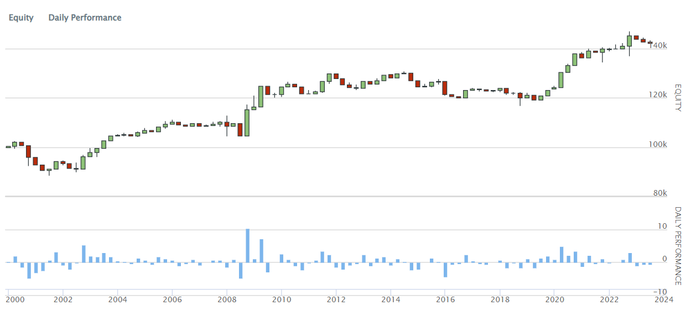](images/9da89d9f1880.png)

Looks like this one performs okay-ish, but at 0.25 Sharpe, it isn’t much to bet on, and as before, we assumed the same costs a trader using IBKR would have and simulated against quote data.

#### 10/11 - Hajj & Ramadan Effect

---

These are effects where the performance during Ramadan and during Hajj is significantly higher than on other days. I am not going to go find Muslim countries’ stock market data to test this, but I will link the papers at the end.

#### 12 - Month of The Year

---

It is well known that returns in January tend to be the highest, and this is roughly true, but honestly, it is very hard to tell because of the lack of data. There is also the saying of, “Sell in May and go away”. This one also has some backing, but again the data is very limited. The idea behind both of these is that fund managers will be risk-off around May since if you have generated returns, you will then not want to lose them, so will be more conservative - May is roughly when most funds get to this point, I suppose. January, of course, occurs because people are hopeful for the new year.

We will not be backtesting this because the data is so limited, and I don’t believe in betting on noisy alphas, but I will offer up a fun alternative. We will use January as an indicator for the year as a whole. If the performance during the month of January is positive, we will hold the S&P500 for the rest of the year, otherwise, we will put our money in treasuries. Let’s see how this does:

[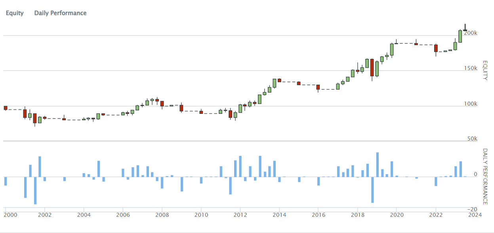](images/f08b19ec67b2.png)

We get about 0.29 Sharpe which isn’t impressive. I’d rather use trend equity to prevent drawdowns if I was trying to be long only the index but rotating into treasuries before crashes (based on some indicator).

#### 13 - Election Seasonality

---

This is an effect we have explored in a previous article, so I will link back here instead of repeating myself. The backtest, which was not included in the article, achieved 0.8 Sharpe for the US elections only and 0.7 Sharpe for all international elections.

[Election Cycle Seasonality Effects[Quant Arb](<https://substack.com/profile/101799233-quant-arb>)·February 26, 2023[Read full story](<https://www.algos.org/p/election-cycle-seasonality-effects>)](https://www.algos.org/p/election-cycle-seasonality-effects)

#### 14 - Sales Seasonality Premium

---

The idea here is that we will buy stocks during their low-sales season and sell stocks during their high-sales season. This isn’t really seasonality in terms of the market, but seasonality in terms of each individual companies sales:

[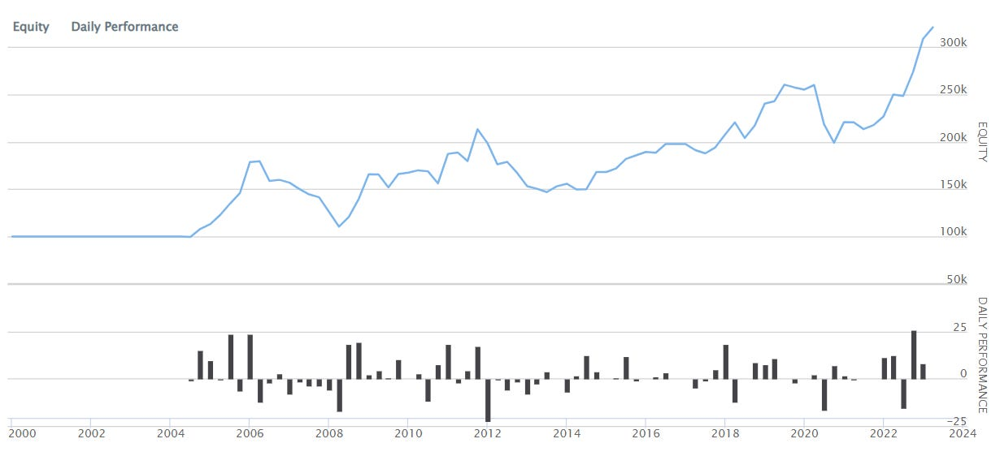](images/6c062647b1fc.png)

I have a full backtest report below:

Sales Seasonality Premium

2.88MB ∙ PDF file

[Download](https://www.algos.org/api/v1/file/3d27f5e1-00d4-452c-bc1d-add722e9269b.pdf)

[Download](https://www.algos.org/api/v1/file/3d27f5e1-00d4-452c-bc1d-add722e9269b.pdf)

This was originally presented by Quant Galore so I will link back to his article:

[The Quant's PlaybookCapturing The Sales Seasonality EffectBackground To understand this strategy, you first have to understand the base concept of seasonality. Seasonality refers to the tendency for certain investments or markets to perform better or worse at specific times of the year. An example of this can be found in electricity markets. As summer approaches, the demand for electricity increases (e.g. air conditioners, pools), and the price goes up. When the weather cools and shifts to fall/winter, prices go back down as electricity demand decreases(e.g. heating oil / natural gas heating). Take a look…Read more3 years ago · 4 likes · 2 comments · Quant Galore](https://quantgalore.substack.com/p/capturing-the-sales-seasonality-effect?utm_source=substack&utm_campaign=post_embed&utm_medium=web)

This was him replicating a paper which is linked below:

Sales Seasonality Premium Paper

2.13MB ∙ PDF file

[Download](https://www.algos.org/api/v1/file/b5708a77-99b7-4438-8c7a-1d438b4e2a1f.pdf)

[Download](https://www.algos.org/api/v1/file/b5708a77-99b7-4438-8c7a-1d438b4e2a1f.pdf)

#### 15 - Management Earnings Forecast Seasonality

---

This is another one where I will not be backtesting it as it requires having management forecasts of earnings and the original paper works with Chinese equities data which I also do not have.

It is very similar to #14 but adds an extra dimension to the problem by using management forecasts of earnings instead of the actual earnings. There are some additional relationships there related to how the disclosures of management forecasts occur (voluntary vs. mandatory & time to earnings announcement when the forecast is made).

Paper below:

Earnings Seasonality Management Forecast

464KB ∙ PDF file

[Download](https://www.algos.org/api/v1/file/9afa4196-de4b-413f-b947-fccd79e0d816.pdf)

[Download](https://www.algos.org/api/v1/file/9afa4196-de4b-413f-b947-fccd79e0d816.pdf)

#### Capturing Seasonality Tips

---

Now that we have concluded our review, it is now time for me to add a bit more original content to this article. There was still a fair bit of this, but I would like to add more.

The first of these is that seasonality is usually strongest on the long-only side. I wrote a paper with HangukQuant where we systematically found seasonality effects in commodities markets. This long-only rule was seen very clearly. This method works nicely in small-cap digital assets, but you need to have good execution because costs are so high; otherwise, it won’t beat fees. Prior to costs, the Sharpe ratios are very high (2-3), with a lot of seasonality being specific to each asset.

[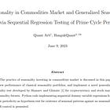Seasonality in Commodities Markets[Quant Arb](<https://substack.com/profile/101799233-quant-arb>) and [HangukQuant](<https://substack.com/profile/42788676-hangukquant>)·June 10, 2023[Read full story](<https://www.algos.org/p/seasonality-in-commodities-markets>)](https://www.algos.org/p/seasonality-in-commodities-markets)

Another important component is costs. There are many effects that are brutally obvious and don’t require much analysis to see that they are significant, but what really kills you is the trading costs. This is why it makes sense to try and find overlapping periods. If there is still a little bit of alpha to hold an extra hour/day/etc. then it often makes sense because we don’t want to just hold for a single hour (or whatever period); otherwise, costs will be an issue.

Some seasonality effects are very asset specific, especially the intraday ones, but for other assets, you can’t actually go down to the individual asset level and must look at whatever the benchmark is for that asset class. For digital assets, this is BTC, and for equities, this is the S&P500. This all comes down to the driver of the effects. If it is psychological/general mispricing, then it will be asset specific, but for effects like turn-of-month, you are unlikely to see people putting their paycheck into any individual assets to a degree that would make the extra costs for trading individual assets worthwhile. Hence, for effects like turn-of-month we want to find the asset that people will be putting their paycheck into (probably SPY).

Revisiting the turn-of-month effect, we see this a lot more in developed markets which again aligns with our hypothesis. We want to think about what assets people will be depositing their paychecks into, and this sort of passive investing is far less common in other emerging markets.

You may also want to go beyond the asset level and look at industries or factor portfolios and their seasonality. In my own research, I have not found much seasonal effects on factor portfolios (momentum & volatility signals are best for timing factor portfolios), but industry portfolios are still an untested topic for me.

Finally, intraday effects are often still very valuable even if they don’t beat fees. If we could trade without any costs, then it would have an amazing Sharpe because these effects tend to be so much stronger. This is why we should incorporate such effects into our execution model, which is really the only time when we can trade for “free” since we would be making the trade anyways.

Seasonality effects are great because they generalize to many markets. One of the best ways to find unique opportunities is to test many different markets and assets. Avoiding overfitting is important, but when you find an amazing effect, you’ll know - if you aren’t sure, then you probably should move on, it will pop out at you instantly, like the first hour of the day minute seasonality.

#### Volatility As An Alternative To Returns

---

Market returns are not the only form of seasonality we can profit from. There is also volatility. This article would be too long if we also covered this, but many of these effects can be applied to options markets, and there are potentially some interesting results to be found.

Option markets also have their own seasonality effects, such as the behavior of volatility around FOMC or earnings announcements, but these have been arbitraged to death. That said, the majority of the effects we have outlined could be tested on volatility to see how it extends in a much less data-mined application.

#### Conclusion

---

Seasonality is a fun effect because it often has a very clear explanation behind it and can be generalized across many markets and even beyond returns to volatility mispricing effects. There are also quite a lot of variations, and it so plenty to test with. What events occur that might warrant a risk premium? Think hard on that one, and you may end up finding alpha.

There is a large risk of overfitting, and the performance is often quite noisy. That said, intraday seasonality is very strong for many markets and when combined with other profitable signals, can then beat fees (execution use).

I’ve talked enough today, so I’ll leave you with some reading from others. Note that many of these papers are written by researchers who have never managed actual capital (academics), and frankly, their p-scores don’t mean much in the end. Get an understanding of how the effects work at a high level, think of some unique ways to apply them, and try to find improvements. Your own experimentation will be far more useful in the end, where you can truly see how strong some of these effects are.

#### Papers

---

Note that not all of these had papers behind them, and I didn’t read much of the papers linked below (skimmed abstracts) because I already knew how the effects worked, and their results are usually a bit useless beyond the notion that these effects exist + some cases where the relationship is stronger / weaker. P-scores mean nothing if you can’t profitably capture it or if it is really just market beta. As a result, I don’t have a paper for every single effect, but google scholar can easily sort that out. I have linked 2 of the papers already, but the rest of the papers that went into the article are linked below:

Common Factors Seasonality

355KB ∙ PDF file

[Download](https://www.algos.org/api/v1/file/0e5b8497-7fc7-4d32-be35-a7f5b5c76a97.pdf)

[Download](https://www.algos.org/api/v1/file/0e5b8497-7fc7-4d32-be35-a7f5b5c76a97.pdf)

Data Mining Dangers Calendar Effects

431KB ∙ PDF file

[Download](https://www.algos.org/api/v1/file/cf959e47-4137-4d3a-a9d9-0d93a182a422.pdf)

[Download](https://www.algos.org/api/v1/file/cf959e47-4137-4d3a-a9d9-0d93a182a422.pdf)

Day Of Week Effect Intl Evidence

243KB ∙ PDF file

[Download](https://www.algos.org/api/v1/file/21422e77-11f7-4ec9-967d-70f6520dea04.pdf)

[Download](https://www.algos.org/api/v1/file/21422e77-11f7-4ec9-967d-70f6520dea04.pdf)

Day Of The Week Commodities Volatility

1.65MB ∙ PDF file

[Download](https://www.algos.org/api/v1/file/f2dd9482-7e1e-4a1a-9fb5-973263904d12.pdf)

[Download](https://www.algos.org/api/v1/file/f2dd9482-7e1e-4a1a-9fb5-973263904d12.pdf)

Day Of Week Effect Stock Mkt Diff Countries

6.14MB ∙ PDF file

[Download](https://www.algos.org/api/v1/file/455f3916-dc76-4160-a1b2-315ecd41f983.pdf)

[Download](https://www.algos.org/api/v1/file/455f3916-dc76-4160-a1b2-315ecd41f983.pdf)

Anomalies Seasonal Movements

398KB ∙ PDF file

[Download](https://www.algos.org/api/v1/file/63d05db6-c175-401f-b962-c6b5b936f44e.pdf)

[Download](https://www.algos.org/api/v1/file/63d05db6-c175-401f-b962-c6b5b936f44e.pdf)

Ramadan Effect

81.3KB ∙ PDF file

[Download](https://www.algos.org/api/v1/file/76190b62-ccbe-497b-9b76-2d9c6af68b7c.pdf)

[Download](https://www.algos.org/api/v1/file/76190b62-ccbe-497b-9b76-2d9c6af68b7c.pdf)

Political Cycles Seasonal

571KB ∙ PDF file

[Download](https://www.algos.org/api/v1/file/d80f88c7-a342-411d-a9ee-6cb82b394226.pdf)

[Download](https://www.algos.org/api/v1/file/d80f88c7-a342-411d-a9ee-6cb82b394226.pdf)

Rise And Fall Calendar Effects Over A Century

3.91MB ∙ PDF file

[Download](https://www.algos.org/api/v1/file/2049d32e-2ab8-4f79-a0bd-4d158ff3a88b.pdf)

[Download](https://www.algos.org/api/v1/file/2049d32e-2ab8-4f79-a0bd-4d158ff3a88b.pdf)

Weekend Effect

203KB ∙ PDF file

[Download](https://www.algos.org/api/v1/file/439455bc-448d-4583-8cb7-5b9b4bac8787.pdf)

[Download](https://www.algos.org/api/v1/file/439455bc-448d-4583-8cb7-5b9b4bac8787.pdf)

Sentiment And Returns Ramadan

560KB ∙ PDF file

[Download](https://www.algos.org/api/v1/file/f799d5b8-a4e6-4aa4-b752-39d7d6616c4e.pdf)

[Download](https://www.algos.org/api/v1/file/f799d5b8-a4e6-4aa4-b752-39d7d6616c4e.pdf)

Seasonality Hajj Effect

631KB ∙ PDF file

[Download](https://www.algos.org/api/v1/file/f08a7db8-38eb-4eb0-81f9-8b5c01418448.pdf)

[Download](https://www.algos.org/api/v1/file/f08a7db8-38eb-4eb0-81f9-8b5c01418448.pdf)

Seasonality Advanced Vs Emerging

690KB ∙ PDF file

[Download](https://www.algos.org/api/v1/file/fbcbafe4-8c1d-44d6-9d15-6b2da98e2fe2.pdf)

[Download](https://www.algos.org/api/v1/file/fbcbafe4-8c1d-44d6-9d15-6b2da98e2fe2.pdf)

Size Related Anomalies And Seasonality

1.26MB ∙ PDF file

[Download](https://www.algos.org/api/v1/file/7e74abe6-17a2-4536-9f88-6f51384b2a19.pdf)

[Download](https://www.algos.org/api/v1/file/7e74abe6-17a2-4536-9f88-6f51384b2a19.pdf)

Seasonality Lottery Returns

3.43MB ∙ PDF file

[Download](https://www.algos.org/api/v1/file/ec013fca-574b-4c3c-8f6e-3f0802e108f6.pdf)

[Download](https://www.algos.org/api/v1/file/ec013fca-574b-4c3c-8f6e-3f0802e108f6.pdf)
