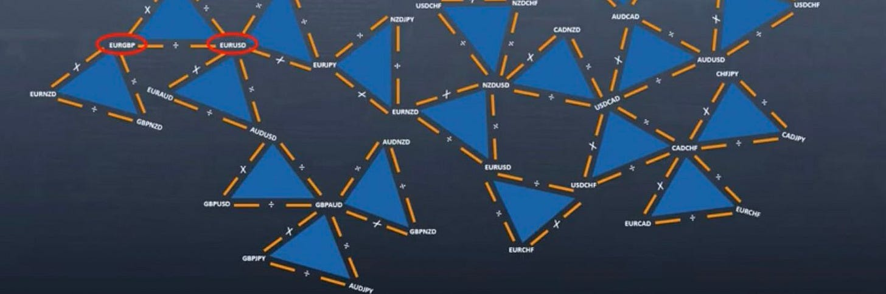
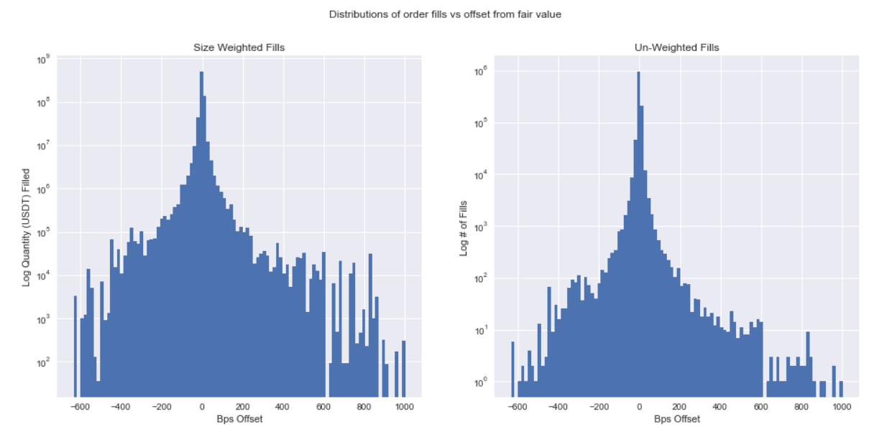
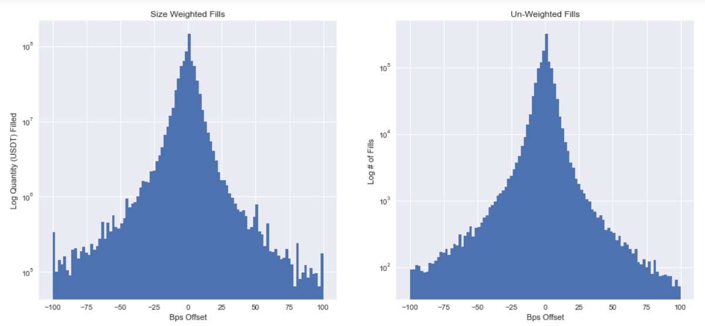
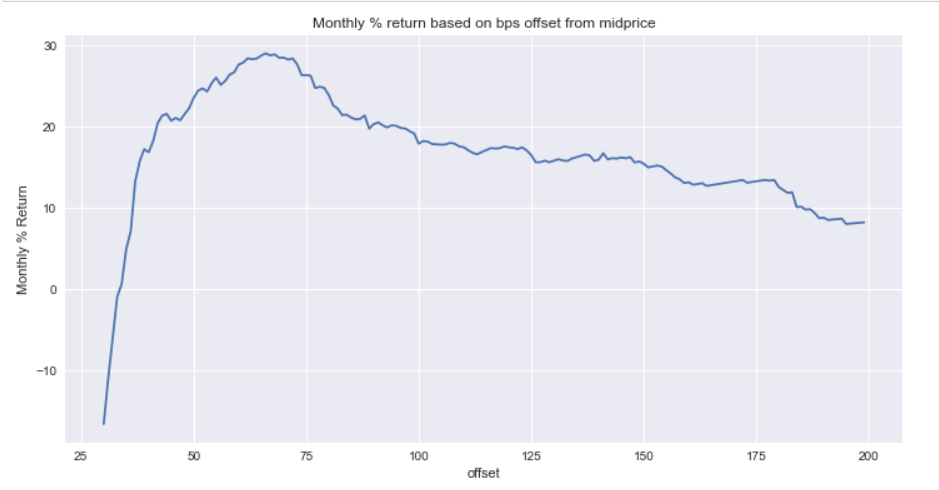
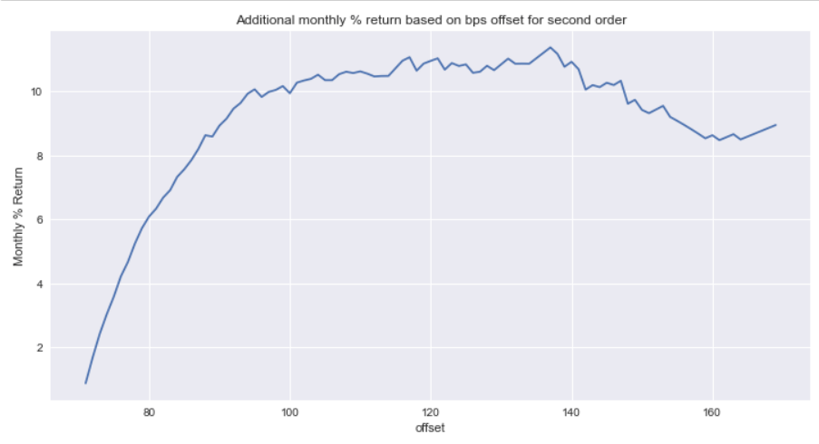

# Small Trader Alpha #3 - Triangles

Source HTML: [`html/2023-09-17-small-trader-alpha-3-triangles.html`](../html/2023-09-17-small-trader-alpha-3-triangles.html)

# Small Trader Alpha #3 - Triangles

| 항목 | 값 |
| --- | --- |
| 날짜 | 2023-09-17 |
| 접근 | 유료 |
| URL | https://www.algos.org/p/small-trader-alpha-3-triangles |
| 부제 | Everything is better with limit orders, including triangles. |

---

#### Introduction

---

Today’s episode of Small Trader Alpha dives into triangular arbitrage and the remaining pieces of this strategy that still have an edge in illiquid markets. There are many ways to approach this strategy, and they all have quite a lot of overlap, so in this article, we will try to cover as much of the useful information related to the strategy as possible.

Triangular arbitrage, or TriArb, was how my team got started in HFT, first on the taker side of the trade and then later moved to market making around TriArb bounds.

#### Index

---

1. Introduction
2. Index
3. Triangles and Circles
4. Taker
5. Partial
6. Maker
7. Extra Latency Boosting
8. Full Maker
9. Cross-Exchange
10. Conclusion

#### Triangles & Circles

---

Triangular arbitrage is often called circular arbitrage because you end up back where you started, and because triangles are not necessarily the shape you are forced to go in. You can have any N number of legs if you want, but if you go below 3 then the orderbook must be crossed, so in most cases, 3 is the minimum.

A lot of people will use fancy graph algorithms to find the optimal path in record time, but frankly, brute force is fast enough if you use a sparse matrix and write optimized code. You should be able to get the speeds into the double-digit microseconds even for a reasonably large matrix.

In general, the first approach should always be to optimize at the code/data structure level before going on to using graph algorithms. Many of the ones designed for FX markets are not useful in digital asset markets either because they assume mostly complete matrices which just isn’t the case over in the world of Shitcoins. Tokens may have only 3-4 connections if they’re lucky for small caps so many of these are not much faster than brute force.

#### Taker

---

The most well-known version of the strategy is taker. This is very capital efficient, especially if you are not going cross-exchange, because you will exit the trade incredibly fast, and have your capital back in hand.

For this approach, the edge is usually in having a high rate limit, top fees, and being willing to hold inventory of these coins. If you want to be the fastest you need to send all 3 legs of the triangle simultaneously which means you need to have inventory of the shitcoin you are arbitraging. This reduces capital efficiency a fair bit, but it also gives you a fairly large moat protecting your alpha - one of the reasons there’s still some money here (but not much, better versions exist, as we shall see).

The reason for the top fees is because everyone has the same opportunity so if others can take the arbitrage 1 bp earlier, then they will take all of the flow. Taker strategies, especially the simpler ones, are very much a winner-takes-all game, so keep this in mind.

We want to have a high rate limit because this enables our final competitive trick - spamming. We can spam limit IOC orders at a price where a triangular arbitrage would occur when we see the price nearing that level. You often need to negotiate with the exchange to get these limits or find workarounds such as using sub-accounts to get there.

Finally, there’s one more latency trick that uses your rate limit, and that’s the Gatling gun approach with orders. This is not the same as spamming limit IOCs, but instead relies on sending (usually I find 5 is optimal) multiple orders at once. These are the same order and have the same client ID. Our goal is for the first one to arrive and trade, and then for the rest of them to all fail.

We either do this by limiting the amount of capital in our account and moving money between sub-accounts rapidly to adjust or we use the client ID to cause the next orders to fail. This client ID trick only works on some exchanges so results will vary. The reason it improves latency is because your latency is not deterministic. If I send one order and then immediately send another, the second order could very well arrive at the exchange first due to the jitter on the wire. This exploits the jitter to our advantage.

For some exchanges like KuCoin, this works but only if the orders are sent within a few seconds of each other. Every exchange has its own weird set of tricks, some work on certain exchanges, some don’t, and some, like KuCoin, mostly work.

Then, of course, we want to locate in the AWS AZ closest to our exchange server - usually Tokyo.

#### Partial

---

This is a modification of taker where you trade it as a lead-lag. Typically you’ll see that all of the profit is generated by the illiquid asset and the rest are just there to loop back around. This is quite self-explanatory in that you take the leg that is mispriced and long it, wait for convergence, then exit.

You can achieve better speed and lower cost, but on the other hand, you must exit this position after and do so into the most illiquid book so this can work against you the same way.

Worth a mention, but as indicated by the brevity of this section, not the main source of edge.

#### Maker

---

The maker version is truly the juicy part of this strategy. This is where we get the best profitability. We will work with the token BiSwap, with the ticker BSW, and on the exchange Binance for our example here. This data is a bit old, but it does still work across illiquid markets (with a bit of tuning and some more advances later).

We don’t need to use a graph algorithm since each coin will have at most ~10 connections and those that have more are likely far too liquid to produce arbitrages. We want to get a coin that is just liquid enough for there to be exit liquidity on our triangles but illiquid enough where there is an ability to get a wide fill. We place a limit order in the book, and then if we get hit, we immediately TriArb out of the position.

Our orders are placed in accordance with the exit liquidity, but it is wise to discount this liquidity by a little bit if your latency isn’t quite there. We tend to see about 1/2 of the liquidity pulled by market makers when there is a large order that impacts the USDT pair (liquidity pulled from triangles) and you may not always be fast enough to pull. We do have one advantage on the latency side due to data feed mechanics, however. Most exchanges, in fact, all I can think of, will send out fill information before they send out trades so you have a latency edge here if the market makers for the triangles are not quoting on the main USDT pair (this tends not to be the case however).

In general, the order that information is sent out is: to fill information to private endpoints, trade data, orderbook change updates, quotes, and orderbook snapshots.

Readers should be familiar with the term offset from the previous articles, but here are the offset distributions from midprice for fills:

The bottom graph is a constrained version of the top graph. This is data over 3 months for BSW/USDT on Binance. I think I even used this graph in the prior article to explain the concept of a midprice offset.

Doing this and then immediately exiting into triangular arbitrages (with 1 second of latency as our assumption, a very slow assumption to be conservative) gave the below performance (per month) based on the offset. Keep in mind you would really only expect to deploy $4,000-$6,000 into this (on each side of the book). Your capacity comes with scale, so you need to add many symbols / have a method for dynamically evaluating the most profitable. Capacity has also gone down since as we are in a shittier market now :(

We can juice a little extra capacity with additional limit orders:

Results vary across coins. Some return hundreds of % a year, others do a couple of % a month. This was all calculated with the fees I had with our prime broker at the time (small team trading personal money back then, but still managed to get great fees using PBs).

#### Extra Latency Boosting

---

A lot of this trade on the taker side comes down to speed so here are some tricks I’ve found along the way:

1. Use proxies and spam the REST endpoint for your current fill status as this on occasion will give you the information faster.
2. Stream every endpoint/base URL available. One may become faster.
3. Watch how different AWS Availability Zones become faster, even if there usually is one that is faster 99% of the time, one may be faster in the tails - when it matters.
4. Stream 3x of a feed, and then every X seconds, drop the one that was the slowest to receive data on average. If you imagine them sending out data with an imaginary for loop (with random inserts on the creation of a new feed) then you are climbing this list. There’s also jitter so this helps.
5. Using Terraform or automated libraries for AWS to automatically spin up and terminate instances until you get as close to the matching engine as possible.
6. Gatling Gun & Limit IOC spam methods mentioned earlier.
7. Stream every possible version: HTTP 1, 2, 3 - IPv4, IPv6 - when in doubt do it all. Then you can slowly chuck away the parts that clearly are a total waste, but duplicates are your friend here and you may find tricks on which is faster.
8. If there are a 500ms and a 100ms feed, stream them both because the 500ms feed is not actually redundant to the 100ms feed in most cases. It could end up becoming misaligned, getting you that data up to 50ms faster.
9. Ask the exchange for colocation or benefits that may improve your speed. FTX used to have a risk check queue where if I sent 3 orders at once, they would all sit in the same queue to check my account’s risk. This happened even if they were on different instruments. Luckily, all you had to do was ask and FTX would hand you 40 parallel queues for your account (or for other exchanges where they don’t offer this you can use sub-accounts).
10. On BitMEX & and some other smaller exchanges you can place a limit order and then modify it so that it instantly matches as a taker and you will skip the matching engine queue because it will read the original timestamp it was placed, not the time it was modified and use that as your priority.

#### Full Maker

---

We’ve talked about a maker example which is really maker/taker since we immediately take out onto the other legs. This takes a lot of the profit away since we are then pushing size through an even less liquid book (even if it temporarily is tighter because the impact hasn’t been propagated to it yet). In general, BSW/USDT should be far more liquid than BSW/ETH or BSW/BUSD - hence we will want to make on this leg.

There isn’t any point in simulating this because it’s all going to be inaccurate, but this is 100% worth advancing towards as it expands capacity and improves profitability - although for a lot more work and risk.

There isn’t much point making on the last leg since that will be ETH/USDT or something incredibly liquid.

#### Cross-Exchange

---

Extending the trade to cross-exchange can work, but then we run into the issue of borrow and margin. We would probably end up doing this then for assets where borrow can be acquired or where we are comfortable buying the spot and hedging in the future (which means it needs to have a future).

Thus, for cross-exchange, you will need to target slightly more liquid tickers, but you also have far more of an ability to profit. This is a nice advancement if you are already familiar with cross-exchange spot arbitrage as we discussed in the previous articles because it comes with similar borrow & transfer considerations.

You can of course combine cross-exchange, and maker to further the strategy. Coming up with fast ways to implement cross-exchange and maker versions of the strategy that work without needing bulky and complex-to-implement logic behind them is where the opportunity lies.

#### Conclusion

---

In previous articles, we have had a much lengthier discussion because of the sheer volume of topics that require explaining. Now that we have the background needed to understand concepts like offsets from midprice and using the empirical distribution to evaluate the attractiveness of placing limit orders as part of a maker/taker strategy we can make the information far more compact.

We discussed the key considerations for taker & maker, gave performance examples for maker TriArb to demonstrate the small capacity opportunity on Binance (many other exchanges exist), showed the key expansions (maker & cross-exchange), and then gave a lot of latency tricks as this is often a consideration for TriArb.

The latency tricks alone are just as valuable as the strategy-related knowledge in my view, but of course, these are semi-known tricks to many, so they’ll give you the leg up in uncompetitive trades like this where there are only a couple (or for us at the time no competitors in the maker tri arb, only makers pulling quotes) other algos to compete with. For competitive books, these tricks won’t help and the latency tricks at the advanced level are far more complicated, with full teams behind them doing latency optimization as their primary edge.
