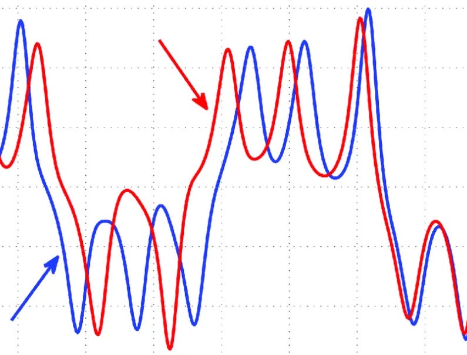
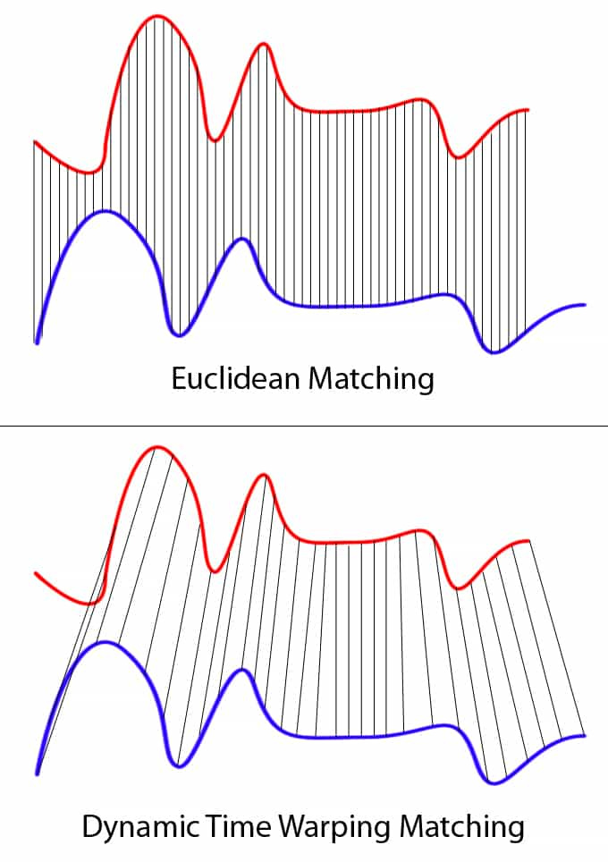

# Strategy Discussion: Lead Lag

Source HTML: [`html/2023-11-04-strategy-discussion-lead-lag.html`](../html/2023-11-04-strategy-discussion-lead-lag.html)

# Strategy Discussion: Lead Lag

| 항목 | 값 |
| --- | --- |
| 날짜 | 2023-11-04 |
| 접근 | 유료 |
| URL | https://www.algos.org/p/strategy-discussion-lead-lag |
| 부제 | Thoughts and insights into the world of lead-lag strategies |

---

#### Introduction

---

Lead-lag strategies are very well-known in the literature, and effects of this type can still be found across many timeframes. There are a few tricks of the trade when it comes to lead-lag that I’d like to explore + a bit of detail on the popular models behind lead-lag strategies.

#### Simplest Method

---

Simple is often best, and especially when working with noisy financial data, it pays to have a robust method. That’s where our linear regression comes in; there’s nothing fancy here, just standard linear regression.

We take a regression between the returns of one asset and the returns of another asset to model our lead-lag relationship. The only difference is the timeframe of the returns since we need to shift our returns based on the lead-lag interval we are modeling.

This does create an awkward issue of needing to estimate the delay between them, but we can find this using statistical tests or simply plotting the returns.

Once we have our regression, we can predict how much a lagging asset will move based on the move in the leading asset.

#### Cheap Convergence Trading vs. Event Driven

---

Lead-lag strategies can be thought of in two ways: either as a cheaper method for executing a relative value trade where you would normally put on a spread but instead have opted to take the more mispriced leg (and reduce trading costs) OR as an event-driven trade.

The event could simply be a large price shock, but the key differentiator here is that we expect to realize our alpha in discrete vs. continuous time. With an event, we see a sudden move in the leading asset and a sudden move in the lagging asset - this tends to be more of an HFT trade, and because our alpha decays extremely fast, we probably need to execute as a taker.

For a relative value trade, we will not have such a sudden realization of our edge and instead can look into smarter forms of execution without worrying about missing the trade. This is the mid-frequency to low-frequency version of lead lag and is a bit more statistically driven because causality is harder to establish. Sudden moves are rare; one following another is a clear causal relationship, but smaller moves are common, and thus, gradual convergence is noisier.

#### Big Moves

---

When it comes to the HFT side of lead-lag trades, we care a lot about the size of the move. We can either use a quantile regression or simply control our dataset in the first place so that we ensure only large moves are considered. Small moves are likely just noise and won’t beat fees, regardless.

Thus, it is really only worth looking at moves where the cost to trade it is at minimum, equal to or less than the size of the move. We may adjust this for beta if our lagging asset is a shitcoin, but generally, we want to have this control to reduce noise.

We also just generally see the trade behave differently based on the size of the move and why the move happened.

#### Using Volume

---

A lot of volume is a good proxy for a move being important and is one of the most powerful features to integrate into your lead-lag strategy and boost performance.

Simply taking the z-score of volume may be a bit too elementary and missing the point, however. We want to think about why volume is important?

It’s typically a sign that people care about the move and, thus, that it isn’t noise. Noise doesn’t carry over to other assets well, but real changes in fair value do.

To develop our volume features further, we can classify large moves into categories:

- Liquidations
- Market Impacts
- News

We can figure out whether it was news or a market impact by examining trade sizes, and if there is liquidation data available, we can figure this part out as well. Liquidation data may be harder to find, though.

Even within the news category, we will see unexpected news impact the market in a distinct and unique way when compared to scheduled news such as CPI. As a further note, scheduled news events give advanced warning to market makers, so quotes will be very wide from the start. This kills most alpha.

#### Obvious Relationships

---

It’s easy to overfit these sorts of trades, so we want to make sure that our pairs fundamentally make sense. If two companies have a lead-lag relationship, we should try to understand why one should affect the other. Indexes, or assets that behave like indexes (BTC or S&P500), will obviously lead to other assets, but there’s more niche alpha to be found when looking at companies that supply others or commodity prices vs. commodity-dependent stocks.

Manually verifying relationships is tedious and unlikely to be worthwhile for a production strategy (other than the big-name relationships), but diving into examples helps improve the research process when coming up with proxies for what makes a good lead-lag pair.

Ensuring that the pairs we test make sense from the start is a great way to prevent overfitting. Perhaps we might require two companies to share industries or cryptocurrencies to share type.

In the digital asset space, there are different chains, so we can find the largest market cap coin for that chain and test whether it leads other assets on that chain.

Fundamentally connected assets are the best.

#### Basket Trades

---

The leader does not have to be any specific asset, and since we don’t even want to trade the leading asset, we can make it something that is quite hard to trade.

Industry ETFs can serve as a good basket to benchmark on, or we can create our own industry ETFs, by using a VARIMAX decomposition (Box-Tiao Canonical Decomposition, see previous articles) and using the leading eigenportfolio as our index.

One final approach for constructing baskets is to treat it as an optimization problem when we maximize similarity. This could be an average correlation or any chosen metric. We then use a greedy algorithm to maximize this (again, see previous articles where we use this method for pairs trading).

#### Causality Testing

---

When it comes to systematically selecting pairs and estimating the lag between them, we can use causality tests (keep it simple; no need to be fancy; Granger works fine) and goodness of fit metrics for our regression. We test different pairs and lag parameters through this, using these tests as our optimization function.

#### Graphical Approaches

---

Network momentum is an example of a recent alpha where graph algorithms have been used to find alpha in the markets successfully, but these methods have existed outside of trading for a while now and are readily available with good libraries for those who want to test without much work.

PCMCI is an interesting example where it has been applied outside of trading. This makes it easy to test, with papers readily explaining the model, but with less likelihood of alpha decay from the method already being shown in the literature to have alpha. (Paper below)

https://arxiv.org/abs/1702.07007

#### DTW

---

Dynamic Time Warping is a really interesting approach to lead-lag modeling and has been used in the physics world for a while already.

Plenty of literature and libraries are available online to help you use DTW so I doubt there’s much point in me explaining it. IDTW (Indexed Dynamic Time Warping) was also a really interesting alpha I remember working years ago. Can test it and see if that is still true (my money is on no, but testing unlikely ideas is most of quant research, so we shall see).

#### Final Remarks

---

HFT lead-lag is a very discrete trade where volume and trade size / impact plays a large role. In fact, a lot of it is thinking about how market impacts or news propagate.

Then, for higher timeframes it becomes more statistical. We want to look at how firms are connected, through using methods like optimization for similarity, clustering, graphical methods, and ones we know make sense (oil price vs oil companies). This gives us confidence, and we very well might find some niche undiscovered relationship using simple regression methods, but we can also use more complex models.

I find models are fun, but they’re also absurdly inefficient. It takes a lot of time to build, and with quantitative research, the 80/20 rule is key. How can I get 80% of the way there for 20% of the work? That’s how you need to implement these models. ChatGPT + public libraries + skimming + building tools to save time. That’s how you do well because most will fail, and you will also fail if you spend all your time on a limited range of projects. This is also something that naturally happens as you get more experienced and learn efficiency tricks / build up code you can re-use.

#### Further Reading

---

I’ve included a few papers for the reading list below. Don’t read them in full; these are not information-dense, they are information sparse, as with most papers. You should practice skimming. That is not to say that these aren’t valuable, but that it will be a bit of a waste to spend all that time reading them in full. Skim, if one is interesting, read it and implement.

Download

185KB ∙ PDF file

[Download](https://www.algos.org/api/v1/file/3b4ee24d-28d4-48cb-802b-551f8a2c4998.pdf)

[Download](https://www.algos.org/api/v1/file/3b4ee24d-28d4-48cb-802b-551f8a2c4998.pdf)

Download (1)

198KB ∙ PDF file

[Download](https://www.algos.org/api/v1/file/9c1d0c39-74e5-4462-b544-19eb27182aea.pdf)

[Download](https://www.algos.org/api/v1/file/9c1d0c39-74e5-4462-b544-19eb27182aea.pdf)

Rr96

315KB ∙ PDF file

[Download](https://www.algos.org/api/v1/file/972c3a14-53f2-4244-a4e2-a9fae9eea238.pdf)

[Download](https://www.algos.org/api/v1/file/972c3a14-53f2-4244-a4e2-a9fae9eea238.pdf)

1106

796KB ∙ PDF file

[Download](https://www.algos.org/api/v1/file/78e3520a-42f8-4d20-942e-1f15b9ced16e.pdf)

[Download](https://www.algos.org/api/v1/file/78e3520a-42f8-4d20-942e-1f15b9ced16e.pdf)

2005 Gc Snde

135KB ∙ PDF file

[Download](https://www.algos.org/api/v1/file/5c961781-aaca-40ca-b21c-a4b34499ba61.pdf)

[Download](https://www.algos.org/api/v1/file/5c961781-aaca-40ca-b21c-a4b34499ba61.pdf)

1 S2

1.01MB ∙ PDF file

[Download](https://www.algos.org/api/v1/file/7fc9116d-a34e-4ee9-a5dd-2641076b25e9.pdf)

[Download](https://www.algos.org/api/v1/file/7fc9116d-a34e-4ee9-a5dd-2641076b25e9.pdf)

Investigating Causal Relations By Econometric Models And Cross Spectral Methods

1.52MB ∙ PDF file

[Download](https://www.algos.org/api/v1/file/c72b4375-9496-4dac-8644-37c62af0cd2e.pdf)

[Download](https://www.algos.org/api/v1/file/c72b4375-9496-4dac-8644-37c62af0cd2e.pdf)

Florens Lineartheorynoncausality 1985

572KB ∙ PDF file

[Download](https://www.algos.org/api/v1/file/9772dba9-0ab7-438b-bba3-870680fdb053.pdf)

[Download](https://www.algos.org/api/v1/file/9772dba9-0ab7-438b-bba3-870680fdb053.pdf)

1 S2

912KB ∙ PDF file

[Download](https://www.algos.org/api/v1/file/971497ec-1abf-43b4-b851-ce745ab41170.pdf)

[Download](https://www.algos.org/api/v1/file/971497ec-1abf-43b4-b851-ce745ab41170.pdf)

1701

156KB ∙ PDF file

[Download](https://www.algos.org/api/v1/file/d2c103b1-8a7c-4a55-af70-b08d3ed6e52f.pdf)

[Download](https://www.algos.org/api/v1/file/d2c103b1-8a7c-4a55-af70-b08d3ed6e52f.pdf)

1 S2

872KB ∙ PDF file

[Download](https://www.algos.org/api/v1/file/63586269-a704-4b0e-a9f5-0a752f41842d.pdf)

[Download](https://www.algos.org/api/v1/file/63586269-a704-4b0e-a9f5-0a752f41842d.pdf)

Florens Notenoncausality 1982

363KB ∙ PDF file

[Download](https://www.algos.org/api/v1/file/4a42ee36-0c6b-426d-b968-08c962aeb722.pdf)

[Download](https://www.algos.org/api/v1/file/4a42ee36-0c6b-426d-b968-08c962aeb722.pdf)

Hosoya Grangerconditionnoncausality 1977

233KB ∙ PDF file

[Download](https://www.algos.org/api/v1/file/3b6bc179-c18f-404a-8976-613fe52aaae1.pdf)

[Download](https://www.algos.org/api/v1/file/3b6bc179-c18f-404a-8976-613fe52aaae1.pdf)

Geweke Measurementlineardependence 1982

1.78MB ∙ PDF file

[Download](https://www.algos.org/api/v1/file/8f1ec5be-99a9-4be0-891a-8c5beccea796.pdf)

[Download](https://www.algos.org/api/v1/file/8f1ec5be-99a9-4be0-891a-8c5beccea796.pdf)

Uai Time 07

218KB ∙ PDF file

[Download](https://www.algos.org/api/v1/file/0db5c4f8-d042-41d0-9a22-49cf93490267.pdf)

[Download](https://www.algos.org/api/v1/file/0db5c4f8-d042-41d0-9a22-49cf93490267.pdf)

Snde2013 87

122KB ∙ PDF file

[Download](https://www.algos.org/api/v1/file/309b7ebc-1ec1-4678-a8dc-fcae1f02acab.pdf)

[Download](https://www.algos.org/api/v1/file/309b7ebc-1ec1-4678-a8dc-fcae1f02acab.pdf)

0602183

136KB ∙ PDF file

[Download](https://www.algos.org/api/v1/file/09bd27b0-61c0-432f-9f2a-6c3982cbcf9e.pdf)

[Download](https://www.algos.org/api/v1/file/09bd27b0-61c0-432f-9f2a-6c3982cbcf9e.pdf)

1 S2

1.47MB ∙ PDF file

[Download](https://www.algos.org/api/v1/file/85756889-4515-4b4c-8178-7144cf5266ae.pdf)

[Download](https://www.algos.org/api/v1/file/85756889-4515-4b4c-8178-7144cf5266ae.pdf)

1 S2

171KB ∙ PDF file

[Download](https://www.algos.org/api/v1/file/89e08d2b-9df6-4ec3-b131-42bf2ca3f903.pdf)

[Download](https://www.algos.org/api/v1/file/89e08d2b-9df6-4ec3-b131-42bf2ca3f903.pdf)

Synchronization As Adjustment Of Information Rates

153KB ∙ PDF file

[Download](https://www.algos.org/api/v1/file/09292c8d-f05d-4240-a249-c3f07ec40fd1.pdf)

[Download](https://www.algos.org/api/v1/file/09292c8d-f05d-4240-a249-c3f07ec40fd1.pdf)

1305

346KB ∙ PDF file

[Download](https://www.algos.org/api/v1/file/8f604372-567b-4b8b-8126-9e2cb69a0bed.pdf)

[Download](https://www.algos.org/api/v1/file/8f604372-567b-4b8b-8126-9e2cb69a0bed.pdf)

0502511

132KB ∙ PDF file

[Download](https://www.algos.org/api/v1/file/e2e7bd0e-b919-474f-a948-307c77ecc339.pdf)

[Download](https://www.algos.org/api/v1/file/e2e7bd0e-b919-474f-a948-307c77ecc339.pdf)

Hijo94

2.69MB ∙ PDF file

[Download](https://www.algos.org/api/v1/file/2ecfdc15-af39-403a-8ef1-183b1b023688.pdf)

[Download](https://www.algos.org/api/v1/file/2ecfdc15-af39-403a-8ef1-183b1b023688.pdf)
