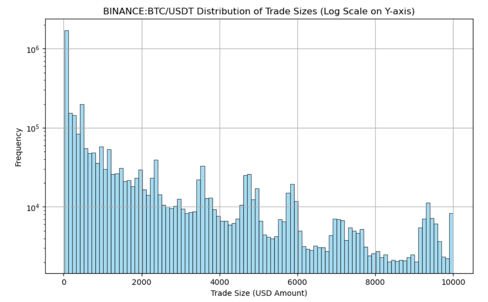
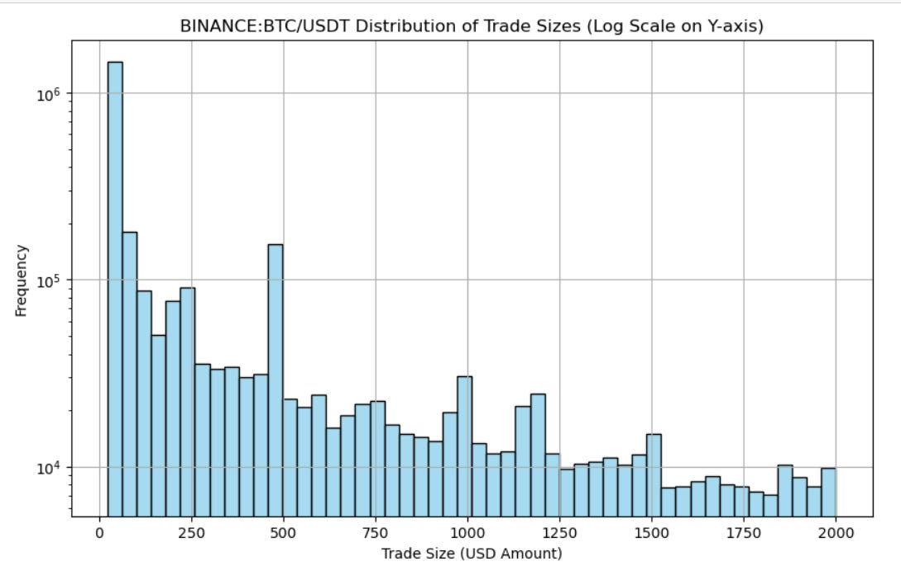
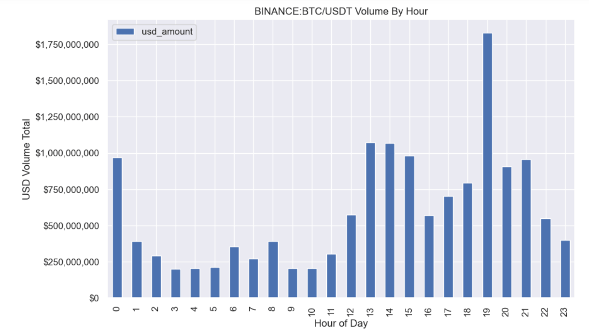

# Hide N' Seek Pt.1 - Avoiding Detection

Source HTML: [`html/2023-11-19-hide-n-seek-pt1-avoiding-detection.html`](../html/2023-11-19-hide-n-seek-pt1-avoiding-detection.html)

# Hide N' Seek Pt.1 - Avoiding Detection

| 항목 | 값 |
| --- | --- |
| 날짜 | 2023-11-19 |
| 접근 | 유료 |
| URL | https://www.algos.org/p/hide-n-seek-pt1-avoiding-detection |
| 부제 | How to reduce market impact through disguising your flow when executing |

---

#### Introduction

---

This is the 1st in a 3 part series where we explore the games behind hiding and detecting flow from market participants. Here’s a brief overview of what this series should look like (subject to small changes):

1. Avoiding Detection (How to hide your flow: algorithms, rules & tricks)
2. Detecting Order Execution Algorithms (Swapping roles, how to detect flow)
3. A Real Strategy (We’ll make a strategy from #2, showing the research process start-to-finish, regardless of failure or success)

I have an existing article on execution algorithms, but we focused mostly on one side of the problem - the cost side (assuming an arbitrarily small size). Obviously, in most cases, we care both about how much size we can push through AND the cost for that, but you typically end up making a distinction based on what you care about more.

For more details on the difference between the two sides of execution, and some exploration of execution holistically, feel free to check out this prior article:

[Execution - Without The Fluff[Quant Arb](<https://substack.com/profile/101799233-quant-arb>)·April 25, 2023[Read full story](<https://www.algos.org/p/execution-without-the-fluff>)](https://www.algos.org/p/execution-without-the-fluff)

#### Index

---

1. Randomization
2. When Detection Doesn’t Matter Anymore
3. Aggression
4. Retail Flow
5. Matching Size Distributions
6. Hiding In High Volume
7. Wash Flow & Manipulation
8. Adversarial Games

#### Randomization

---

For our basic model, there are two dimensions we need to randomize:

- Order Size
- Order Frequency

If we sent $2,000 every 20 seconds, that would be easily detectable, even by someone sitting and watching the trade feed. We want to make sure that our flow does not have any regularity in its sizing or in its frequency.

We have a parameter that we must tune to decide exactly how random we are willing to be. If there is a real need to have this size executed within a period, then random sizes and intervals will lead to a random execution finish time. This means we need to trade off the potential for predictability with the benefits of executing within a certain window.

On top of this, we will have times when it makes sense to execute more size compared to others. Liquidity is very seasonal and at certain times of day, there is a lot more of it so disguising it may not necessarily make sense.

We also don’t care an awful lot if we get detected near the end of our execution schedule, but we do care if we get detected right at the start before we’ve put much flow through the market.

As a result of both our need to have a non-random end time and the potential benefits of tuning our aggression level in real-time, we often won’t have a truly random frequency and order size.

For a good example of a simple execution algorithm, it is worth looking at the IBKR Accumulate-Distribute Algorithm:

https://www.interactivebrokers.com/en/trading/accumulate-distribute.php

#### When Detection Doesn’t Matter Anymore

---

There are two reasons why we would want to get detected (or be indifferent to it). Either there is enough liquidity to sweep the book and finish executing in one go, or the signal that you intend to put a lot of flow into the market will attract more liquidity providers.

For some products such as options, there will be much better execution by letting participants know that you want to put a lot of flow through the market. OTC markets are invented specifically for this and allow you to get much better execution using them.

With options, the majority of volume happens through OTC channels. This is because, at a high level, the Greeks are very very liquid, but when you split that liquidity over 100s of strikes, expirations, and products, you end up with individually illiquid options. Importantly, there is a lot of liquidity in the Greeks and inventory can be created from thin air, so market makers are only quoting thin books because their capital is spread thin, and they expect a higher return per trade to compensate for the lack of flow. If there was enough flow, they would price it much closer to the true liquidity of the Greeks behind the options.

Thus, when there is a lack of liquidity strictly because of a lack of flow, and not because the product is expensive inventory to hold (or risky, etc), then it often is wise to signal our intentions to the market. Options can be hedged in the much more liquid underlying or with other options so are a great example of this. Assets that are highly correlated to much more liquid assets (cost-effective to hedge) also will have this effect, even if they are not derivatives like options.

Our second scenario where we would want to ignore any constraints related to detection is when we have the ability to take liquidity all in one go. If toxicity has become very low, then we will typically see a lot of liquidity cluster on BBA. Execution is toxicity because your orders move the market and you know this will happen, so you effectively are an informed trader, even if you are moving the price instead of predicting it well. So if the liquidity is priced with low toxicity in mind, and you are able to sweep in, take all of it, and be done with your execution, all before market makers can adjust their quotes to account for the newly higher toxicity, then this is a very optimal decision.

We can see an even more extreme version of this toxicity knowledge asymmetry in digital asset markets where much of the liquidity rests on the assumption that the market maker can immediately hedge (as a taker) on a highly liquid exchange like Binance. These market makers are not willing to take on the size they are quoting so will immediately take on Binance. They will do this at a loss likely if you sweep their quotes and the Binance quotes at once, in fact, this is why you often see ripples as these impacts cascade after large impacts that have swept multiple exchanges at once.

#### Aggression

---

There are models for estimating who was the aggressor in each trade, but many exchanges will just tell you which side was the aggressor. This is the trader that pays the taker fee (whereas the counterparty paid/earned the maker fee).

If you are the only participant trying to execute at midprice and price improving constantly then it’ll be easy to detect your flow. We established our original two dimensions, order size & frequency, but we should also think about matching the market profile for aggression as best we can.

We’ll most likely increase the average level of aggression in the market, but if we exclusively execute using an uncommon order type/style then we will be extra detectable. Obviously, there are limit orders and market orders, but how aggressive our limit orders are adds more detail to our choice so that is why I say style and not just type. BBA or market orders are pretty common, but of course, if you are aiming for midprice then the rate of price improvement in one direction will spike massively. You would also see taking rates become imbalances if you only did market orders so ideally we want to spread our orders across:

- taker aggression
- price improvement aggression
- best bid/ask
- potentially even passive levels if we have time

Our goal here is to match the market distribution for aggression so that even if we create an imbalance in the volume overall, it will not be clear that all of the orders are from one participant. If you know that it is all from one participant you can then start frontrunning them, whereas if it is from many then there is a much lower chance that the flow is price-insensitive. The fact that execution algorithm flow is price insensitive and will execute even if the price gets hiked on them is the exploited part. A lot of flow from many participants holds no guarantee that at a higher price that flow will continue buying, it may see that as fair value and then start selling.

#### Retail Flow

---

We don’t actually want random order sizes or order frequencies because orders and the rate at which they occur are not really random. They have a distribution, and it isn’t a very smooth one either. People trade a hell of a lot more 100-size orders than 99 or 101-size orders. Why? Retail traders love whole numbers. Thus, when we are executing we want to make sure we are also hiding some of our orders in with the retail flow.

What else do retail traders enjoy? Market orders. They especially love market orders that are in the direction of the overall regime (retail has a much higher imbalance in their flow compared to institutions) so if we are in a bull market, then we will have a pretty low impact with buy market orders.

Again, this comes back to the previous point about matching the aggression level of the market. We will always create an imbalance of volume, but the rate of aggression that we do this with will potentially give us away. That said, we need to tune aggression for other reasons because how aggressive our orders are directly affects our spread cost (and fee rate, taker vs. maker). There is a sweet spot and with most things markets there is no clear answer so I can only leave you with the questions + tools and the market shall have to give you the answers.

#### Matching Size Distributions

---

We talked about how retail traders have a preference for whole numbers, but here’s a bit of a visual to get some more intuition (2023, Early February Data):

We can zoom in a bit more to see this as again:

One interesting issue with digital assets is that there is a USD distribution and a raw amount distribution. People will cluster around $1,000 sizes, but also 0.1 BTC sizes. So, we need to work on matching both of these distributions.

You can detect that someone is executing a lot of size if suddenly the range between $3,000 - $4,000 (as an example) orders is massively higher than it should be compared to historical data, but in the same vein, we can tell something is awry if the retail round numbers don’t show up in our histogram.

#### Hiding In High Volume

---

Volume tends to be quite seasonal throughout the day, and this is also true for toxicity or liquidity. The below graph shows the total volume, by hour, over our sample period:

These are, of course, UTC timestamps, but we can clearly see where all the volume is and where it isn’t.

We want to play into this and make sure that 1) we do not alter this distribution in a way that would let people onto our activities and 2) exploit it so that we execute the most when there is the most book depth.

Often, in illiquid books, a single market participant can be half of the volume over a multi-day period, so it’s very easy for them to shift this distribution and attract suspicion from other traders looking to front-run.

#### Wash Flow & Manipulation

---

Whilst we’re on the topic of looking at trade distributions, we can apply this analysis to exchange volume data in order to detect manipulation and wash trading.

Wash trades often fail to have rounded order sizes to mimic retail flow, or, even worse, they will cluster around a certain range. When you zoom out, you can see that there are a ton of large trades and barely any small trades. There are many ratios and distributions you can look at to try and tell whether wash flow is common on an exchange.

Some exchanges make it even more obvious than this and will have trades inside of the spread. The only time this should happen is when 2 market orders match against each other. If more than 10% of the trades happen inside of the spread, then you know with extremely high confidence that the flow in the book is not real.

#### Adversarial Games

---

The best way to build the stealthiest execution algorithm is to be your own enemy. Trying to detect your own algorithm and then learning lessons from this should be the research process behind a strong algorithm.

We can try to match size distributions and match the distributions around order frequency, but advanced signal processing techniques can still pick up patterns.

In the next article, we will explore some methods for detecting execution algorithms other than comparing histograms.
