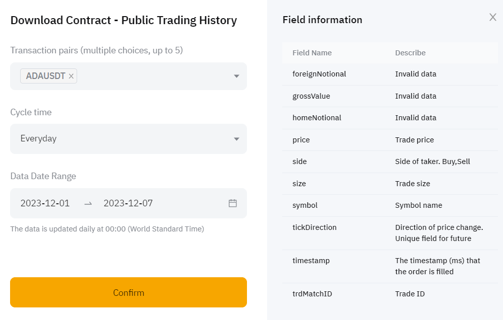

# Hide N’ Seek Pt.2 - Detection

Source HTML: [`html/2023-12-09-hide-n-seek-pt2-detection.html`](../html/2023-12-09-hide-n-seek-pt2-detection.html)

# Hide N’ Seek Pt.2 - Detection

| 항목 | 값 |
| --- | --- |
| 날짜 | 2023-12-09 |
| 접근 | 유료 |
| URL | https://www.algos.org/p/hide-n-seek-pt2-detection |
| 부제 | Detecting execution algorithms: tips, ideas, & models |

---

[](images/427c67c9c1c5.webp)

#### Introduction

---

In our last article, we looked at how to avoid detection through some simple distribution matching techniques. We want to make sure that for any variable that describes the market (order size, frequency, type, etc) our orders do not significantly skew the distribution as to give ourselves away.

These are fine for most cases and even if there is some signal of our execution, we will probably have made it very noisy with our efforts. That said, there are more detailed approaches to detecting execution algorithms.

In this part of our 3 part series, we will explore multiple models and techniques for detecting execution algorithms. That said, we will not yet have a complete strategy - that will be the final article in the series where we put it all together into a real trading strategy.

#### Index

---

1. Introduction
2. Index
3. Data
4. Overview of Methodologies
5. Simple Methods

   1. Recurring Frequencies
   2. Binning
6. Fourier Approach

   1. How it works
   2. Math + Formulas
7. Global Orderbook Method
8. Conclusions
9. Appendix:

   1. Data Scraping Code
   2. Background Reading

#### Data

---

We will be using aggregate trade data pulled directly from major digital asset exchanges for this article. Code for scraping & pre-processing will be shown in the appendix.

We will look at both spot and futures markets:

- Binance (Futures)
- Binance (Spot)
- Bybit (Futures)

There isn’t an immediate need for us to have multiple exchanges, but you’ll tend to find that strategies around flow and participant behavior will work amazingly on some exchanges and have no hint of effectiveness on others. Thus, we will shop around.

#### Overview of Methodologies

---

Whilst there are certainly quite a few methods for detecting execution algorithms, we will discuss roughly 4 approaches to this:

1. Recurring Sizes
2. Binned Repetition
3. Fourier Detection
4. Global Orderbook Method

#### Simple Methods

---

We won’t walk through the code for the simpler methods as there isn’t much of a model there, only a heuristic.

The most basic model would be to test for any sizes that have been recurring. If the size 2000 gets printed every 20 seconds then we know someone is executing an order.

I’ve seen this happen directly in front of me before, but the reason the model would not have picked it up is because of small differences in the size. It was 1999.53 then 1998.26 (arbitrarily made-up example, I can’t remember the sizes, but I did tweet about it at the time so maybe you can find it - it was roughly around 2k and every 20s though)

Whilst a high recurrence of a certain size is certainly helpful, we want to make sure that we figure out the time schema - this then requires us to see if there is equal spacing (either in the time or volume spectrum depending on whether we are detecting TWAP or VWAPs) between the orders.

This should be enough to detect any large TWAP or VWAP orders, but of course, people tend to be more complicated with their approaches and the binning approach still requires a fair bit of parameter tuning.

#### Fourier Approach

---

`How It Works:`

The Fourier Transform is a mathematical operation that transforms a time-domain signal (a function of time) into a frequency-domain representation (a function of frequency). This transformation reveals the different frequency components (sinusoidal waves of different frequencies, amplitudes, and phases) that make up the original time-domain signal.

`Math + Formulas:`

**Discrete Fourier Transform (DFT)** :

For digital signals (like those in computers and digital processors), we use the DFT, which is the discrete version of the Fourier Transform. The DFT is given by the formula:

X[k]=∑n=0N−1x[n]⋅e−i2πNkn

Where:

X[k] is the k-th element of the output (frequency domain).

x[n] is the n-th element of the input (time domain).

N is the total number of samples.

e−i2πNkn is the complex exponential (a rotating phasor), i is the imaginary unit.

**Fast Fourier Transform (FFT)** :

The FFT is an algorithm to compute the DFT more efficiently. The most common FFT algorithm, the Cooley-Tukey algorithm, reduces the computational complexity from *O*(*N^* 2) (for DFT) to *O*(*N* log *N*), which is a significant improvement for large *N*.

The Cooley-Tukey algorithm is a divide-and-conquer algorithm that recursively breaks down the DFT of any composite size *N* = *n* 1​ *n* 2​ into many smaller DFTs of sizes *n* 1​ and *n* 2, exploiting the periodicity and symmetry properties of the complex exponential function.

X[k]=∑n=0N/2−1x[2n]⋅e−i2πN(2n)k+e−i2πNk∑n=0N/2−1x[2n+1]⋅e−i2πN(2n)k

We need to use the Non-Uniform Fast Fourier transform instead of normal FFT due to the non-uniformity of our trade data time series. The trades do not arrive at regular intervals and thus we must adapt to this. To save time the pynufft library (linked below) is used:

https://jyhmiinlin.github.io/pynufft/

I will leave it to the reader to dive more into the modifications behind NUFFT.

#### Global Orderbook Approach

---

`How It Works:`

This is likely one of the best methods for detecting the execution of large sizes. We simply compare the global order book and the local order book of an exchange. The global order book is the aggregate of all exchanges’ order books put together, whereas the local order book is the one specific to that exchange.

We can also use global vs local volume - this is also a powerful tool and frankly, they should be used together alongside each other.

Spreads will widen after a large impact, and there will be other signs related to the toxicity of flow in the book so by looking at where spreads are relative to the global order book, we can detect if it is unusually high and also work with a much more normalized metric for applying Fourier too.

In equities, it is a lot harder to try this approach as it is rare to see the same asset listed in many places, but for digital assets, it makes sense.

#### Appendix - a) Data Scraping Code

---

The snippets of code below are for 3 different sources. These are simply examples to show that data is very much freely available. The sheer amount of data processed in this research article means that proxies with parallelized scrapers were utilized (overkill for most applications, but it’s built into my scraping tool so not that bad). Technically not the full data scraping code, but this is code that I’ve tested & it works.

**Imports:**

```
import pandas as pd;
import requests;
from tqdm import tqdm;
from datetime import datetime as dt, timedelta;
```

**Binance (Futures):**

```
binance_futures_base_url = "https://fapi.binance.com";
binance_futures_agg_trades = "/fapi/v1/aggTrades";

ts_24h_ago = int((dt.now() - timedelta(days=1)).timestamp() * 1_000);

symbol = "BTCUSDT";

r = requests.get(f"{binance_futures_base_url}{binance_futures_agg_trades}?symbol={symbol}&startTime={ts_24h_ago}&limit=1000").json()

start_id = r[-1]['a'] + 1

df = pd.DataFrame(r)

for i in tqdm(range(100)): # replace range with how many trades you want /1000
    r = requests.get(f"{binance_futures_base_url}{binance_futures_agg_trades}?symbol={symbol}&fromId={start_id}&limit=1000").json()
    start_id = r[-1]['a'] + 1
    df = pd.concat([df, pd.DataFrame(r)])

    if len(r) < 1000:
        break

df.columns = ['tradeId', 'px', 'qty', 'firstId', 'lastId', 'timestamp', 'buyerMaker']
df.to_parquet('Data/Binance/Futures/BTCUSDT_trades.parquet', index=False)
```

More help here:

https://binance-docs.github.io/apidocs/futures/en/

**Binance (Spot):**

```
binance_spot_base_url = "https://api.binance.com";
binance_spot_agg_trades = "/api/v3/aggTrades";

ts_24h_ago = int((dt.now() - timedelta(days=1)).timestamp() * 1_000);

symbol = "BTCUSDT";

r = requests.get(f"{binance_spot_base_url}{binance_spot_agg_trades}?symbol={symbol}&startTime={ts_24h_ago}&limit=1000").json()

start_id = r[-1]['a'] + 1

df = pd.DataFrame(r)

for i in tqdm(range(100)): # replace range with how many trades you want /1000
    r = requests.get(f"{binance_spot_base_url}{binance_spot_agg_trades}?symbol={symbol}&fromId={start_id}&limit=1000").json()
    start_id = r[-1]['a'] + 1
    df = pd.concat([df, pd.DataFrame(r)])

    if len(r) < 1000:
        break

df.columns = ['tradeId', 'px', 'qty', 'firstId', 'lastId', 'timestamp', 'buyerMaker', 'bestMatch']
df.to_parquet('Data/Binance/Spot/BTCUSDT_trades.parquet', index=False)
```

More help here:

https://binance-docs.github.io/apidocs/spot/en/

**Bybit (Futures):**

For a full history, we will need to access the archive on the website of Bybit. Binance has a similar service, but of course, the API is much easier and thus preferred where available:

[](images/2823e215527a.png)

https://www.bybit.com/derivatives/en/history-data

(get winRAR to open the GZ files, free and does the job - that or used the gzip library)

(we could also get Spot data but there isn’t a lot of flow for Bybit Spot)

#### 

#### Appendix - b) Background Reading

---

https://scholar.harvard.edu/files/schwartz/files/lecture8-fouriertransforms.pdf

https://homepage.univie.ac.at/lukas.exl/files/NUFFT.pdf

https://www.worldscientific.com/doi/abs/10.1142/S2382626617500058


Trading Anonymity And Order Anticipation

422KB ∙ PDF file

[Download](https://www.algos.org/api/v1/file/28224c41-24a3-46b2-bef1-b47e1c6357a2.pdf)

[Download](https://www.algos.org/api/v1/file/28224c41-24a3-46b2-bef1-b47e1c6357a2.pdf)


Ssrn Id2828363

2.98MB ∙ PDF file

[Download](https://www.algos.org/api/v1/file/35921ce7-9a63-4611-a570-045fbc757398.pdf)

[Download](https://www.algos.org/api/v1/file/35921ce7-9a63-4611-a570-045fbc757398.pdf)
