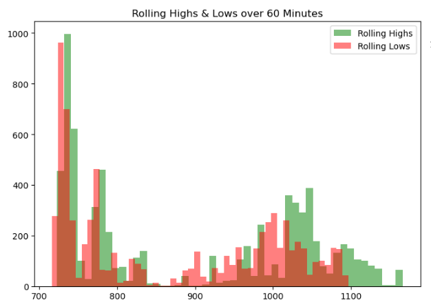
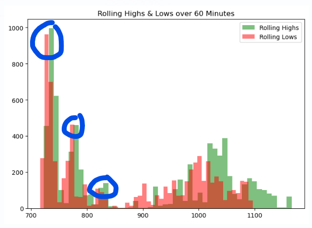
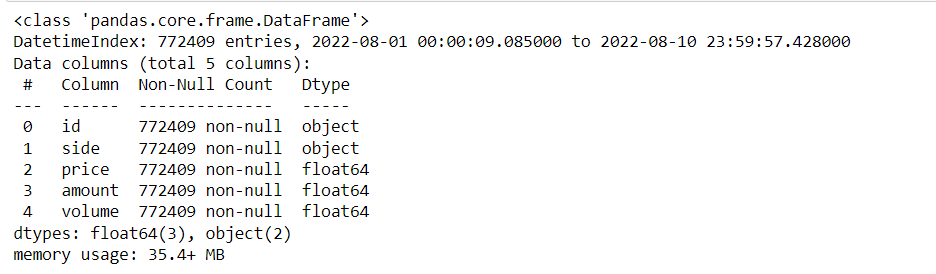
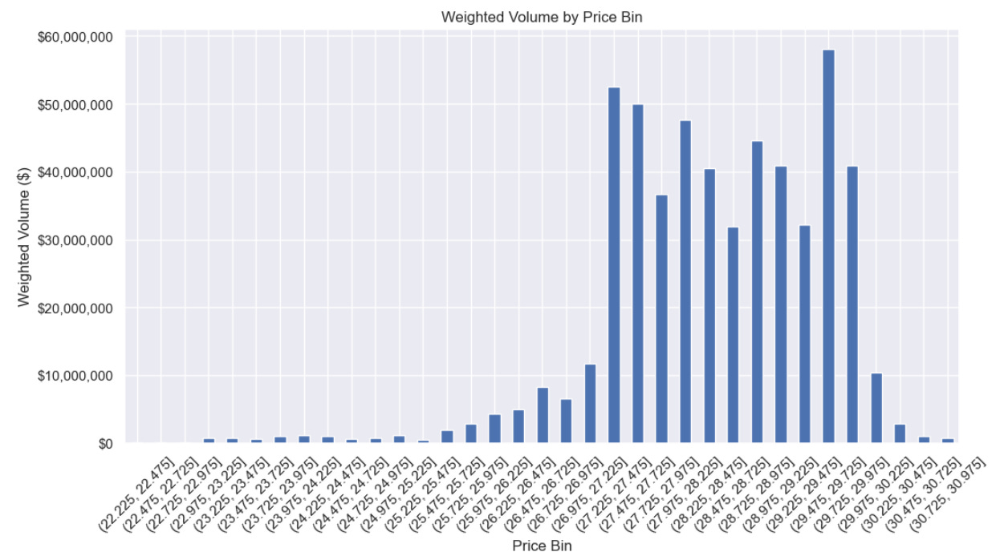
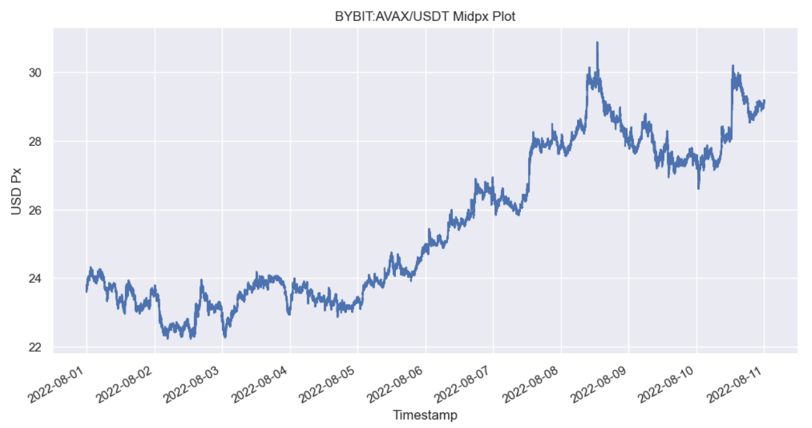
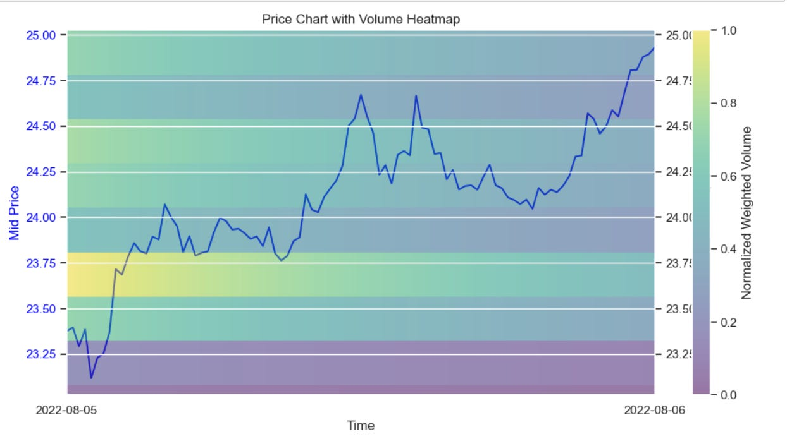

# Automating Charting - Slightly Less Degen

Source HTML: [`html/2023-12-29-automating-charting-slightly-less.html`](../html/2023-12-29-automating-charting-slightly-less.html)

# Automating Charting - Slightly Less Degen

| 항목 | 값 |
| --- | --- |
| 날짜 | 2023-12-29 |
| 접근 | 유료 |
| URL | https://www.algos.org/p/automating-charting-slightly-less |
| 부제 | Using AI & heuristic methods to systematically trade support & resistance. |

---

[![A futuristic and sleek cover photo for a Substack article about automated technical analysis in finance. The focus is on a large, high-resolution technical chart displaying various financial data like stock prices and trends. Superimposed on this chart is an advanced, metallic robot with a modern design, visually engaged in analyzing and charting the data. The robot has a screen on its chest displaying intricate financial algorithms. The background is minimalistic and professional, emphasizing the theme of systematic and automated financial analysis, with a color scheme of blue and silver to convey a sense of technology and precision.](images/5f0a7274c5a0.webp)](images/0e564fd80edd.webp)

#### Introduction

---

Today’s article is a bit of a deviation from the usual areas and instead explores 2 examples where we formulate novel implementations of a hypothesis. We start with a well-known discretionary trading strategy and come up with methods to automate it. Whilst a fun topic to play around with, it also demonstrates the important skill of being able to neatly formulate logic to capture an idea.

We will look at a couple approaches to try and systematically capture support and resistance. This is a strategy well-known within the technical analysis community and is beloved by degenerate gamblers the world over. Many call it bullshit, but others defend it with the logic that if enough people believe in it and trade it - then there must be some patterns in the market from it.

Today, we will finally settle this argument by making systematic a once thought to be impossible to make systematic strategy - support and resistance. Our attempts at doing so follow these lines:

1. Cumulative volume traded with exponential decay.
2. Regressing Pivot Points

Our first methods use heuristics to try and capture what humans normally do manually, whereas the 2nd method goes straight down the machine route in order to find support and resistance areas.

I really like the below graph as a way to visualize what this effect really is:

[](images/2f8bde045060.png)(Overlapping of 1h rolling highs/lows for 1 minute mid-price bars - BYBIT:ETH/USDT, 2021-01-01 → 2021-01-05)

We are simply exploiting the effect where market highs and lows tend to occur at similar prices.

[](images/5250543cce48.png)

Of course there is a lot of noise to this, and things don’t always line up perfectly, but this helps us illustrate the idea behind this alpha in a much more quantitative way.

#### Index

---

1. Introduction
2. Index
3. Data & Research Methodology
4. Cumulative Volume Traded
5. Pivot Points Method
6. Conclusions

#### Data & Research Methodology

---

We will test our models on the two markets with the highest presence of gambling addicts, and those are the FX & crypto markets.

Our FX universe includes the 10 most liquid currency pairs and the 10 most liquid crypto pairs. Our data will be sourced from Tiingo. Here is our universe:

```
fx_pairs = [
    "eurusd",
    "gbpusd",
    "usdjpy",
    "usdcad",
    "audusd",
    "usdchf",
    "nzdusd",
    "eurgbp",
    "eurjpy",
    "audjpy"
]

crypto_pairs = [
    "btcusd",
    "ethusd",
    "bnbusd",
    "xrpusd",
    "solusd",
    "adausd",
    "avaxusd",
    "dogeusd",
    "trxusd",
    "dotusd"
]
```

For each of our methods, we start with a general overview of the strategy, where we map out the rough idea of what it involves and the thinking behind it.

Next, we will walk through the code and logic components step by step before backtesting our strategy and giving some final remarks on the results/takeaways.

Let’s start with the code for our FX data:

```
tiingo_api_key = "XXXXXXXXXXXXXXXXXXXXXXXXXXX"

for ticker in tqdm(fx_pairs):
    url = f"https://api.tiingo.com/tiingo/fx/{ticker}/prices?startDate=2022-01-01&resampleFreq=5min&token={tiingo_api_key}"
    r = requests.get(url).json()
    df = pd.DataFrame(r)
    df.to_parquet(f'Data/FX/{ticker}.parquet', index=False)
```

Then, to adapt it to crypto, we only need to make some small modifications:

```
for ticker in tqdm(crypto_pairs):
    url = f"https://api.tiingo.com/tiingo/crypto/prices?tickers={ticker}&startDate=2022-01-01&resampleFreq=5min&token={tiingo_api_key}"
    r = requests.get(url).json()
    df = pd.DataFrame(r[0]['priceData'])
    df['date'] = pd.to_datetime(df['date'])
    df.to_parquet(f'Data/Crypto/{ticker}.parquet', index=False)
```

Our first method uses trade data from Tardis to find the cumulative volume at each specific price instead of just taking bars (more accurate). We will not show how this is collected, but this can be learned from the website “tardis.dev”.

#### Cumulative Volume Traded

---

For this approach to support and resistance, we are using volume to weight the prices instead of simply trying to see what prices we tend to cluster at the most. We will then use an exponential decay on this to make it an online method.

Here is our trade data for AVAX/USDT on Bybit Futures:

[](images/5b7459e698cb.png)

We then can use the below code to calculate the exponentially decayed volume traded at each level, and plot it as a histogram:

```
import pandas as pd
import numpy as np
import matplotlib.pyplot as plt
import matplotlib.ticker as ticker

def exponential_decay(trade_time, current_time, half_life):
    return np.exp(-np.log(2) * (current_time - trade_time) / half_life)

def create_weighted_histogram(df, timestamp, bin_size, half_life='1D'):
    current_time = pd.Timestamp(timestamp)
    half_life = pd.Timedelta(half_life)
    df['weight'] = df.index.map(lambda x: exponential_decay(x, current_time, half_life))
    df['weighted_volume'] = df['volume'] * df['weight']
    df['price_bin'] = pd.cut(df['price'], bins=np.arange(df['price'].min(), df['price'].max() + bin_size, bin_size))
    histogram = df.groupby('price_bin')['weighted_volume'].sum()
    return histogram

def dollar_formatter(x, pos):
    return f'${x:,.0f}'

timestamp = '2022-08-09 12:00:00'
bin_size = 0.25 
histogram = create_weighted_histogram(df_trades, timestamp, bin_size)

sns.set_theme()

plt.figure(figsize=(12, 6))
ax = plt.subplot(111)
histogram.plot(kind='bar', ax=ax)
ax.yaxis.set_major_formatter(ticker.FuncFormatter(dollar_formatter))
plt.title('Weighted Volume by Price Bin')
plt.xlabel('Price Bin')
plt.ylabel('Weighted Volume ($)')
plt.xticks(rotation=45)  
plt.show()
```

[](images/94e60b79014e.png)

[](images/e9799e5ac97b.png)

We use the arbitrary timestamp of UTC 1200hrs on the 9th of August 2022. Since this is an online metric it’s a bit more useful to visualize it as a heatmap for the select window of the 5th to the 6th:

[](images/61fd89c5ea79.png)
