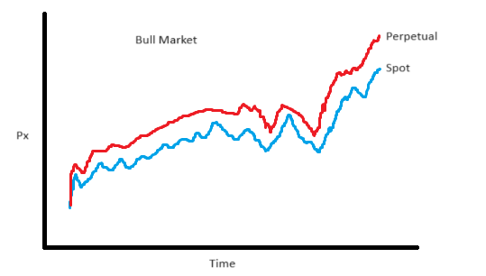
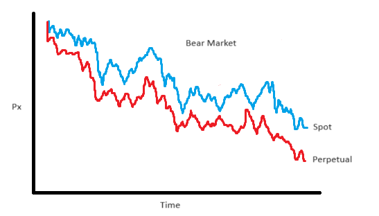
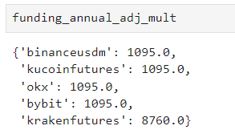
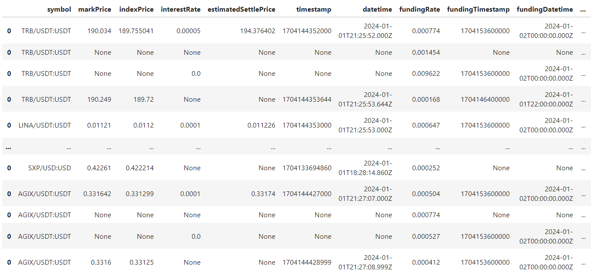
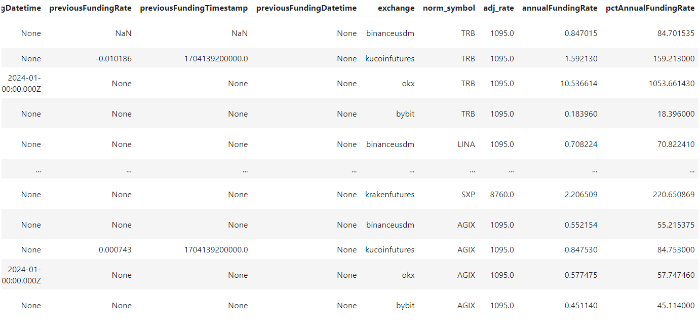

# Small Trader Alpha #4 - Funding Arbitrage

Source HTML: [`html/2024-01-30-small-trader-alpha-4-funding-arbitrage.html`](../html/2024-01-30-small-trader-alpha-4-funding-arbitrage.html)

# Small Trader Alpha #4 - Funding Arbitrage

| 항목 | 값 |
| --- | --- |
| 날짜 | 2024-01-30 |
| 접근 | 유료 |
| URL | https://www.algos.org/p/small-trader-alpha-4-funding-arbitrage |
| 부제 | Exploiting niche funding arbitrage opportunities for financial gain |

---

[](images/0327df2fff92.png)

#### Introduction

---

In the heyday of funding arbitrage strategies, back in 2020 & 2021, it was quite normal to see people making 100% returns on 8 figure sums, but as we entered the bear market and as people caught onto the strategy, it began to fade. Now, as the bull market re-emerges, and with many of the traditional market participants removed, we are seeing a renaissance in the funding arbitrage strategy. Better yet, with the explosion of decentralized perpetual exchanges, there is now far more of an opportunity for the niche trader - without needing to engage in the headache of KYC’ing with tons of exchanges.

Small exchanges are great for niche arbitrages, especially when they have factors that keep away large players, such as liquidity faults and cybersecurity/compliance risks.

There are two main versions:

1. Spot / Perpetual
2. Perpetual / Perpetual

Funding arbitrage involves collecting funding payments in exchange for holding positions that bet on the convergence of two mechanically tied assets. While we need to consider how the convergence or continued divergence of the two assets may affect our trade, betting on this basis is not the core part of the trade; instead, we focus on the differential of payments.

For spot against perpetual arbitrages, we need to acquire cheap borrowing of spot on the short side and own spot on the long side (we will see how regimes then affect this later). For perpetual to perpetual, we usually are taking a perpetual on the same instrument, either slightly different types (coin margined vs USD margined) or across exchanges (most common).

A code demonstration on how to build this into a system is provided at the end, with some technical guidance on implementation.

More great content coming soon, subscribe to stay up to date.

Subscribed

#### Index

---

1. Introduction
2. Index
3. Regime Variability
4. Managing Shock Risk & Margin
5. Sources For Borrow
6. Expected Holding Times
7. Entry & Exit Timing
8. Risk Premiums
9. Reducing Impact & It’s Importance
10. When Is Cross-Exchange Funding Priced-In?
11. Differences In Funding Intervals
12. Implementation Guidance [CODE INCLUDED]

#### Regime Variability

---

One characteristic of the funding arb strategy is its dependence on the directional state of the market. When there is a bull market, futures tend to be the asset above spot most of the time:

[](images/923d39b93d28.png)

However, we see the opposite in a bear market, where the perpetual tends to be below spot prices. One effect not shown, is that when there is a bear market we tend to see a lack of opportunities in general as people become more desperate for opportunities.

[](images/65c8010694f4.png)

But why do we care which is above which?

In the bull scenario, we buy the spot and short the perpetual. We earn funding on the perpetual and pay no cost to hold the spot - we may lever into the spot position, but this is relatively cheap because we are borrowing stablecoins.

In the bear scenario, we need to short spot - this introduces short borrowing costs. While we may get paid on the long perpetual leg, it is typically very expensive to short spot, and it is tricky to find the borrowing availability. This culminates to mean that funding arbitrage is much harder to make money on in bear markets.

#### Managing Shock Risk & Margin

---

Funding arbitrage is a leveraged strategy for almost everyone who runs it. This means that we need to manage risks and control our margin. It is easier when the position is on one exchange, say if we were doing spot to futures on Binance, in which case we simply need to rebalance the position to take profits on one leg and cover losses on the other. We may even be able to leave the losses/profits because the exchange counts our profits between the two (depends on the exchange).

The more likely case, though, is that we will have complex cross-exchange positions. We can have our spot borrow sources from a DEX, but then our perpetual position is traded on a CEX, or even have two perpetual positions between CEXs that we are arbitraging.

There are real cases I know where friends of mine blew up because they overleveraged into basis spreads between two exchanges. Then, a large 100% move happened on one asset, resulting in huge gains on one exchange, but also huge losses on the other exchange. They couldn’t move capital in time to cover the margin difference, and this resulted in a liquidation. This is VERY expensive. Not only because you have exited the trade at the worst possible time, when the basis has gone against you, but that you now have a naked leg to close on another exchange, plus are paying huge liquidation fees (often 1%+ \* your leverage, so potentially double digits).

To model this sort of risk, you should use shock analysis. What would happen if this one asset shocked up XX % suddenly? What is the probability of that happening? If it’s a shitcoin, then look at other shitcoins, not just it’s price history. Understand that if BTC has a large move, then all the other tokens will follow, likely in a much more pronounced magnitude. Make sure that your portfolio can survive these shocks without getting liquidated.

It is also important to have automated systems to remove the second leg then if you get liquidated on one exchange and to automate transfers of margin between exchanges to reduce the waiting time (this can pose a cybersecurity risk to have APIs moving capital; some firms will avoid this practice as a result).

#### Sources For Borrow

---

***Exchange Borrow:***

Most exchanges allow users to borrow spot directly on the exchange. This can often be done through the API, and there is often scarce availability for borrowing when an asset is in demand. Hence, it is wise to programmatically check the API for availability, sniping any borrow the second it becomes available.

Markets for borrowing should move to borrow rates to a level that means there is always some supply; if there is no borrowing available, the cost should increase. However, in reality, this does not happen. You can often get a loan at rates that are very attractive, so there becomes a scarcity where no one can find a loan for that asset. Attractive rates get locked in, and each exchange has its own nuance when it comes to this, so taking the time to understand the mechanics of every exchange pays off.

Both CEXs and DEXs will offer borrowing this way, where the loan stays on the exchange the whole time.

***On-Chain Borrow:***

When it comes to borrowing on-chain, AAVE & Compound are the most well-known. They’re the safest of the options, which there are many of, each with a degree of potential upside for the risk of being counterparty to them.

[DeFi Llama](https://defillama.com/borrow) offers an aggregator with many options, all of which should be researched before using them.

There are also alternative platforms that can be found via a Google search, such as Euler and MarginFi. Again, there is a lot of risk here, so it is best to do your research on the platform before using it.

Borrow is, of course, only needed for spot/perpetual funding arbitrage. If it is simply cross-exchange funding between perpetuals, then this is not necessary to dive into.

#### Expected Holding Times

---

When putting on a carry trade, you don’t know exactly how much profits you will make from it up front because you have no clue how long the trade will last for.

This leads to our first unknown quantity to estimate, and that is the true value of putting on the position. We can get a very good estimate of the cost to put it on, and it’s fair to assume that the cost to take it off will be similar so we the overall cost of the trade is a known, but we need to weigh this against our best guess of the profits.

Analysis and modelling of the historical data comes in handy here. We can look at the long term mean of the basis to ensure that it isn’t just a temporary spike, and can develop accurate models for the convergence time of a spread.

There are many tasks in the world of quant that are like this. Many beginners think that forecasting is always this incredibly complex task where noise drowns out the signal so much that it takes an incredible amount of intuition to make sense of the data. This is certainly the case for some tasks relating to alpha signals, but for others they are more clear cut.

We can often find simple methods like an EMA of the basis to remove sudden spikes and build features based on how long this basis has lasted (either now or historically).

All of this should factor into the decision making process. With the trade becoming ever more competitive, especially for larger capacity tickers, this has become part of the alpha itself and accurately spotting which funding arbitrage opportunities will last the test of time is important.

#### Entry & Exit Timing

---

While the primary source of income for our strategy is from the collection of funding payments, we are still making a bet on the convergence of two assets that tie our PnL into the timing of the basis. Every basis point counts, and this is no exception.

Sudden spikes in the basis can be good times to enter / exit. These spikes do not always represent permanent changes in price though, and most of the time will mean-revert. A large spike down to the mean often comes straight back, making it unwise to exit a position that would’ve gone back to printing straight after.

It’s wise to use a combination of opportunism and planning. This means we already want to consider the spread worthwhile to be carrying from the beginning (or worthwhile to exit), and only then do we start looking at entry and exit thresholds.

The best way to design these thresholds is the tried and tested Bollinger Bands + optimization of the parameters of the bands. Once we have decided that the spread is converging soon / past the point of attractiveness, so as to make it no longer worth holding, we may set a threshold, which is a combination of current price and convergence.

There’s a trade-off here. We want to make sure we are on a spike down when we exit to get the best possible exit, but if we’re already at convergence, then the probability / expected magnitude of a spike down is going to be lower. Thus, we should make our Bollinger Bands based not just on the variance of the spread but the overall level of it in the first place.

For entry, we already have a view that this will stick around for a while. We should take our time on the entry because if we were in any rush, then it’s probably unlikely it’ll be a good spread anyway (unless the funding is absurdly good).

This section, and in large part the article itself, focuses on highlighting the research problems/parts to optimize as opposed to handing over an exact solution. These strategies change all the time, and it’s better to know how to adapt than to know the previously working way to do it. With the guidance of knowing what to research, the development of your own logic is not an incredibly consuming task - although lessons will be learned. Hence, whilst I haven’t given exact methods - I have shared the problem set + how to go about solving it. The rest should be easy for an eager quant.

#### Risk Premiums

---

We often see an exchange risk premium baked into funding arbitrage opportunities following a risk event. Giving two examples:

For our CEX example, Huobi, now rebranded to HTX, regularly sees larger opportunities when scanned compared to similar-sized exchanges. As a matter of not so coincidence, it also has a much higher insurance rate from prime brokers, almost double that of other exchanges of comparative market share. It’s a risky counterparty, not much more complexity to it.

As an example of a DEX, there is currently a large number of dislocations on Mango markets, which, of course, is considered far riskier because of the market manipulation/hack event it endured previously. Whilst this is unlikely ever to happen again, the fact that it did happen and could theoretically happen once more if someone had the capital and guts put an additional risk premium on this counterparty. That said, this is more than just risk; my view is that there is a lot of premium here in excess of risk.

Some opportunities are simply risky because of the nature of the coin. If the coin is very volatile or there is good reason to suspect that it could head to 0 / the moon (manipulated pump and dumps), then the funding rate may well reflect a premium in not wanting to be exposed to the asset. The funding rate situation may not be as plain as spot vs futures. Cross-exchange spreads with differing funding rules may offer premiums for more complicated risks.

#### Reducing Impact & It’s Importance

---

Estimating your impact on the price before you trade is important. Not only does it increase your costs, but it can also remove the opportunity entirely. If you have enough impact to push the prices back into alignment, then the arbitrage is gone. You exit, and then it’s back again!

The square root model is a good model, but of course, fit it to the market and adjust your parameters as necessary.

[Quick Intro To Impact Models (Ask ChatGPT To Code It Up / Save Time)](https://mfe.baruch.cuny.edu/wp-content/uploads/2017/05/Chicago2016OptimalExecution.pdf)

Once you estimate your impact and ensure that you don’t move it back into alignment, you can find the optimal amount to put through these opportunities. You’ll find that the best opportunities come with the smallest capacities, so milking as much capacity from them as possible is going to be key to maximizing overall profit.

Finally, you will need to check how much of the open interest you are. If you slowly accumulate a large position and then need to exit all of a sudden, this can lead to disaster and is an important risk factor to keep an eye on.

#### When Is Cross-Exchange Funding Priced-In?

---

Funding is not always what it seems, and when there exists cross-exchange funding arbitrage opportunities, you may often find that as you try to capture this difference, when one leg’s funding pays out, the basis swings wildly against you as people exit and causes large losses which counteract any profits you may have earnt.

This one isn’t nearly as easy to describe as the rest of my points, but watch the market, and you will see that not every opportunity is exactly what it seems. Especially if there is a lot of capacity for it and the market is relatively calm. Even on volatile days, things can be very priced in.

#### Differences In Funding Intervals

---

Prior to FTX closing down, there was an easy trade that took advantage of its 1-hour funding rate and Binance’s 8-hour funding rate. You could enter a position, earn funding, and exit before the 8-hour mark. As discussed in the previous section, these sorts of trades tend to get priced into the basis nowadays, but back then, they were not priced very well and made for a super easy trade.

This was a trade that existed for major liquid tickers, but of course, these things are never perfectly priced in, and there are often opportunities to take on risks. Exchanges also have different rules about how funding is calculated. Is it the average basis over the period? or simply the basis at the end of the period? This will have an impact on the risks, rewards, calculations, and payoffs of a cross-exchange spread.

Studying these details is important because each exchange may have different instrument funding intervals.

#### Implementation Guidance (A Quick Code Demo)

---

Here’s a quick demonstration of pulling funding rates from multiple exchanges and then calculating the opportunities available. From here, there is still tons of work to do in terms of estimating how long they will last, building systems to manage your book / execute on opportunities, scrapers to pull funding arbitrage histories for your estimation models, accounting systems, order management systems, notifiers, and so much more. All of this would be impossible to demonstrate in one article, but we can at least make a dent at it:

```
import ccxt
import pandas as pd
```

We start with two imports. CCXT is a great library that is 100% worth using in your system. It generalizes many exchange clients into one so that you can effortlessly integrate new exchanges - this is important when one of the core parts of our alpha is being able to scan and trade on many exchanges. It would be hell if we needed to code up each API individually without any generalization. Try to generalize as much as possible. Pandas is, of course, a gimme.

```
exchanges = [
    "binanceusdm",
    "kucoinfutures",
    "okx",
    "bybit",
    "krakenfutures",
]
```

We define a handful of exchanges, there’s plenty more than this, but we’ll use these to start.

```
all_tickers = {}
for exchange_id in tqdm(exchanges):
    exchange_client = getattr(ccxt, exchange_id)()

    if exchange_id == "krakenfutures":
        x = exchange_client.fetchTickers()
        tickers = list(x.keys())
        tickers = [y for y in tickers if y.split(":")[0][-4:] == "/USD"]
    elif exchange_id == "kucoinfutures":
        x = exchange_client.fetchMarkets()
        tickers = [x['symbol'] for x in x if x['symbol'][-5:] == ":USDT"]
    elif exchange_id == "okx":
        x = exchange_client.fetchTickers()
        tickers = list(x.keys())
        tickers = [y for y in tickers if y[-5:] == "/USDT"]
    elif exchange_id == "bybit":
        x = exchange_client.fetchTickers()
        tickers = list(x.keys())
        tickers = [y for y in tickers if y[-5:] == ":USDT"]
    elif exchange_id == "gate":
        x = exchange_client.fetchTickers()
        tickers = list(x.keys())
        tickers = [y for y in tickers if y[-5:] == "/USDT"]
    elif exchange_id == "binanceusdm":
        x = exchange_client.fetchTickers()
        tickers = list(x.keys())
        tickers = [y for y in tickers if y[-5:] == ":USDT"]

    all_tickers[exchange_id] = tickers
```

This is quite a dirty way that I’ve done this, but there is a need to go symbol by symbol for most of these exchanges, and we need a way to normalize. Ideally, we would create a ticker (or universe) manager class which would handle all this normalization as part of it’s functionality, but for now, this works.

```
unique_tickers = {}

for exchange_id, tickers in all_tickers.items():
    for ticker in tickers:
        ticker = ticker.split("/")[0];
        if ticker not in unique_tickers:
            unique_tickers[ticker] = 1;
        else:
            unique_tickers[ticker] += 1;

df_tickers = pd.DataFrame(unique_tickers.items(), columns=['Ticker', 'FreqCount'])
df_tickers = df_tickers[df_tickers.FreqCount == 5]
symbols = df_tickers.Ticker.tolist()

symbol_map = {}

for symbol in symbols:
    mapped_values = {}
    for exchange_id in exchanges:
        search_space = all_tickers[exchange_id]
        for tick in search_space:
            if tick.split("/")[0] == symbol:
                mapped_values[exchange_id] = tick
    symbol_map[symbol] = mapped_values
```

We then do a bit more mapping. Keep in mind, this code is quite dirty and you shouldn’t write code the same way as this when building a production system - this is simply because I’ve done it in a Jupyter notebook, and care mostly about getting my data transformed as fast as possible (which mostly comprises of time taken for me to code it and come up with the code).

```
clients = { exchange_id : getattr(ccxt, exchange_id)({"options":{'defaultType': 'swap'}}) for exchange_id in exchanges }
```

We then create our clients, setting the default instrument type to swap.

```
data=pd.DataFrame()
for symbol, norm_to_raw in tqdm(symbol_map.items()):
    try:
        for exchange_id, raw_symbol in norm_to_raw.items():
            if exchange_id == "okx":
                raw_symbol = raw_symbol.replace("/", "-") + "-SWAP"

            r=clients[exchange_id].fetch_funding_rate(raw_symbol)
            row = pd.DataFrame(r, index=[0]).drop('info', axis=1)
            row['exchange'] = [exchange_id]
            row['norm_symbol'] = [symbol]
            data = pd.concat([data, row])
    except:
        continue
```

Now, we pull our data. Please don’t ever handle your errors like this in a proper system. There is no bad code or good code. Only code that makes money and code that doesn’t. This code makes money when in a Jupyter notebook because I can manually fix the errors. When done in a production system, it loses money because you can’t sit and watch it 24/7… or at least you should, even though many quants I know have tried.

```
funding_intervals = {
    "binanceusdm" : 8,
    "kucoinfutures" : 8,
    "okx" : 8,
    "bybit" : 8,
    "krakenfutures" : 1,
}

funding_annual_adj_mult = { exchange_id : 365*(24/x) for exchange_id, x in funding_intervals.items() }
```

We then write down our funding intervals, found through a quick bit of Google searches (be careful, there may be multiple funding intervals by exchange, which varies for certain symbols; we mentioned this earlier). After this, we use it to get our funding adjustment multiplier.

[](images/5df79707cd78.png)

```
data['adj_rate'] = data.exchange.apply(lambda x: funding_annual_adj_mult[x])
data['annualFundingRate'] = data['fundingRate'] * data['adj_rate']
data['pctAnnualFundingRate'] = data['annualFundingRate'] * 100
```

Finally, we can calculate our % annual funding rate.

[](images/4a331a310094.png)

[](images/6c310445bd1d.png)

Our data is not exactly normalized for every column and, of course, reflects the various differences between exchange endpoints, but the main thing is that we have been able to calculate the annualized funding rate for all tickers.

There is one quick consideration we have overlooked. The quote asset is not the same. Some are USDT, others USDC, others USD. Keep this in mind, and do not assume they are fungible.
