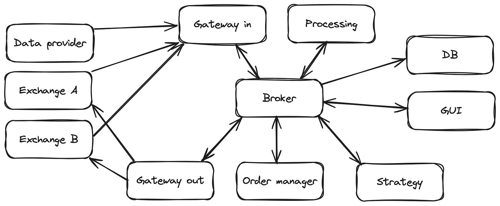
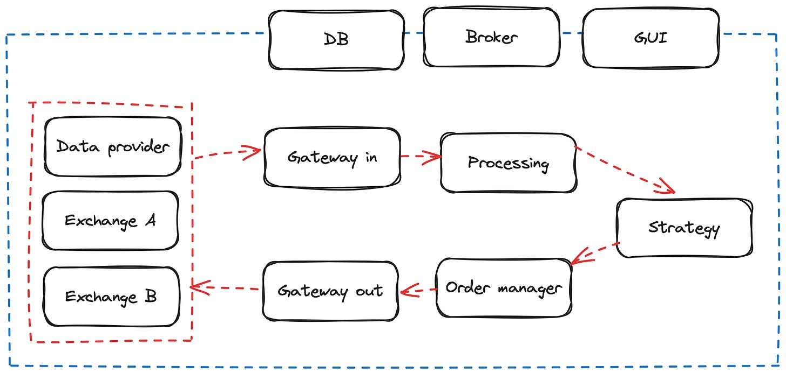

# Starting your Quant trading Business

Source HTML: [`html/2024-02-18-starting-your-quant-trading-business.html`](../html/2024-02-18-starting-your-quant-trading-business.html)

# Starting your Quant trading Business

| 항목 | 값 |
| --- | --- |
| 날짜 | 2024-02-18 |
| 접근 | 무료 |
| URL | https://www.algos.org/p/starting-your-quant-trading-business |
| 부제 | Overview of the necessary components any quant trader needs. |

---

#### Introduction

---

Are you serious about quant trading? This is a high level overview of how the architecture of a professional trading desk looks like and it’s what you will need if you want to make a business out of your quant trading skills. And I really mean “need”, if you already have something built, I guarantee you may not need it now but you will in the future.

Lets start with this diagram:

Quantitative trading system architecture

As you can see there are a lot of parts, all of them are connected to a message broker in the centre, which is the main avenue of communication between each component.

It may look a bit confusing so let’s remove the Broker component from the centre and focus on how the information “generally” flows, data coming in → data coming out. The diagram would look like the following:

Data-flow diagram

If you have subscribed, feel free to subscribe to both of our newsletters:

The Quant Stack is a reader-supported publication. To receive new posts and support my work, consider becoming a free or paid subscriber.

### → [Ninja Quant Substack Link](https://substack.com/@ninjaquant) ←

#### Data providers

---

The raw data is generated on each data provider, exchange or service. This can be alternative, quotes, depth, trades, weather data. Whatever data our strategy needs. This data however is raw, we can ingest it but we can’t use it to trade, we would have to normalise it.

Here’s a prior article on data sourcing available to everyone:

#### Gateway in

---

Takes care of the normalisation part. It doesn’t matter how the raw data looks, as soon as it enters our system it will get transformed into a format that is understandable by all other components.

This way we can use any kind of data from any kind of source, it doesn’t really matter where it comes from as soon as it touches our system, they all share the same format.

#### Processing

---

Data is normalised but it’s most likely not going to be ready for our strategy, especially if its order book data. This kind of data is streamed very frequently and it’s important that our strategy is capable of ingesting this data and generate trading signals faster than the time elapsed in between messages. So let’s say our strategy takes 100ms to produce a signal, if the data ingested comes in every 50ms, there’s going to be a clog and our strategy won’t be able to keep up with that throughput of data.

But you most likely won’t need to process every single order book update in order to produce a trading signal. The way it’s done is by adding some logic that will process the data and filter it so your strategy only receives the data needed. A widely used case would be your strategy only needing best bid and ask data, or top 5-10 levels of the order book, however this data is generated from your processing module that ingests level2 data.

This part is one of the most important ones, it’s what you use to generate trades. Make sure you test every single line of code of this module, accounting for all edge cases. It will save you money and time in the future.

#### Strategy

---

This is the most creative part of the system. All there is to say on this post is it ingests just the normalized-processed data it needs, updates the forecast or view, and sends orders to express or capture that updated view.

It also usually has a risk-manager component that has notion of account equity, positions and other metrics that are not a part of the strategy per se, but can influence how it’s traded.

#### Order Manager

---

May sound as simple as just creating an order and sending it but it’s not. What to do if an order couldn’t get executed, amended or canceled? Should probably share this information with the strategy, right?

Some people like to integrate the execution strategy here, others in the **Strategy** component. The execution strategy slices an order into smaller ones to optimise its execution or reduce the market impact.

#### Gateway out

---

De-normalises the orders into an exchange-specific format for its execution. The implementation of this component and **Gateway in** will normally lie in the same directory, its just a simple API implementation, but called from different parts in our code.

Whilst it has many imperfections and most people will implement their own clients, CCXT is a good example of how data is normalized and de-normalized for digital asset exchanges. It’s at least a first example to learn from and gather ideas.

#### Message Broker

---

Just a message broker. The goal of this component it to share information in the most efficient manner between components. So all data is available to any component that is subscribed to the Broker.

Note that the Broker architecture is not needed, just handy. You could perfectly share data without the Broker but the diagram would look a bit more messy. The other scenario would be to have independent message queues between each component. I prefer a centralised and isolated component, easier to maintain and scale.

#### DB

---

Simply a database, to store trading data for analytics and reporting purposes mainly. It’s normally not a good idea to plug in a database in the middle of our strategy, try to use cache as much as you can.

DynamoDB is a great option for systems in AWS. Make sure writing to your database does not block your trading algorithm (can be solved async with aioboto3 in Python).

Many other ways to do it exist and none is strictly better than another - just do what works best. It’s not like the database makes you money after all - although remembering to log and trace everything certainly makes you money in the long run through an improved ability to solve complex debugging tasks.

#### GUI & Monitoring

---

To monitor key metrics, set alarms, handle parameters for our strategy, restart strategy, cancel all orders, list goes on. Ideally you would be able to monitor and manage your strategy without modifying the code each time.

There are two main sides of why you need a GUI (or otherwise an interface to interact with and monitor your algorithm sufficiently). The first is for analysis of your performance and the other is for live monitoring + control of the algorithm itself.

Before going too deep into this part, I want to warn all beginners to approach this component on an as needed basis strictly. It’s a shame to see so many junior quants with dashboards that clearly got more of their time than the algorithm itself. The dashboard is for the algorithm - NOT the other way around! Remember that and although it may be tempting, don’t go down the rabbit hole or pretty UIs.

Grafana is in (quant\_arb) my view the hands down best solution for historical metrics and viewing PnL performance although you can also easily emit metrics to an AWS CloudWatch dashboard for similar results.

For the control and live monitoring though you’ll probably need to build it yourself in which case React is great for this with a Django or Flask backend as my personal choices.

Monitoring can again be done through these systems but the best solution until your algorithm is in a mature stage where all the work is on fine tuning it and not adding new components (what a dashboard is very useful for and the right time to start developing one) is Telegram. It’s absurdly easy to send a message update in a channel or a photo (can convert positions data frame to a photo and send that). This is the solution everyone should use before they build anything fancy.

#### Conclusion

---

Arguably one the most important metrics for your trading system is the **tick-to-trade**. It’s the time your system takes to process the data from **Gateway in** to **Gateway out**. It’s just a benchmark that will help you establish conversations at a bar with other quant traders. The lower the number is the more cool you will look.

Jokes aside, it’s helpful as a high level benchmark when you’re optimising your system. But in practice you will be measuring times for each critical component:

- How much time does it take for the raw data from Exchange A to come to my system?
- How much time to process/normalise it?
- How much time to run the strategy component?
- How much time to share messages from Component A to component B?
- How much time, how much time, how much time…

Knowing these metrics will help you tune some parts of your system for better performance. Generally, the faster you ingest and process data, and send orders than other traders, the more edge you will gain. Many strategies are very correlated, imagine two traders trading the same or a similar strategy, the winner will be the fastest one to execute, the slower one will pick up just the leftovers.

So are you serious about quant trading? This is what you need. Of course this post is a just a high level overview but you get the idea. If any of these components is missing in your system I guarantee you will need it in the future, the more attention to detail the better.

Feel free to reach out to any of us [@quantarb](https://twitter.com/quant_arb) or [@ninjaquant\_](https://twitter.com/ninjaquant_) for any constructive feedback! Mention which components you would like to learn more about and we will make it a priority to do a deep dive for upcoming posts.
