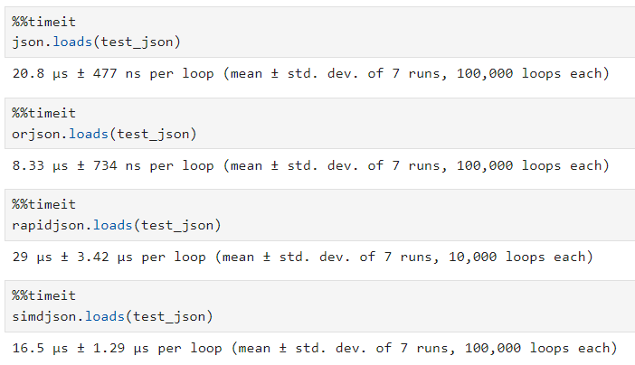

# Developing Trading Algorithms (Python)

Source HTML: [`html/2024-04-16-developing-trading-algorithms-python.html`](../html/2024-04-16-developing-trading-algorithms-python.html)

# Developing Trading Algorithms (Python)

| 항목 | 값 |
| --- | --- |
| 날짜 | 2024-04-16 |
| 접근 | 유료 |
| URL | https://www.algos.org/p/developing-trading-algorithms-python |
| 부제 | Best practices, Advice, Pro Tips, Tricks, and Libraries |

---

[](images/7176419434fd.webp)

#### Introduction

---

When it comes to building trading algorithms, there tends to be a lot of knowledge you can only get by actually going out and developing and talking to others who have about their shared experiences. This information is not published online from our findings, so in this article, we share the learnings from our experience building trading algorithms. This article focuses specifically on the language Python, and gives advice on how to develop trading algorithms effectively, sharing knowledge that is otherwise only accrued through much trial and error. It is still very worthwhile to test this out for yourself and build your own trading algorithms to maximize learning and information absorption.

Whilst there is advantages and disadvantages to Python, it usually comes down to the question of how much you value time to implementation and your need for compute efficiency. Python can be made efficient but there are certain bottlenecks you really can’t cross no matter what. That said, for non-HFT and often less intense HFT algorithms (not too many data sources), these efficiency limitations are vastly outweighed by the speed at which you can implement. It’s also far more beginner friendly. I often hear of firms, and frankly have had similar experiences myself, where the initial version of the system is in Python or JS and then it eventually moved to Rust or C++.

This will tend to look at trading with a crypto focus as this is my current market of choice and in my view is a great one to start in for beginners since you can realistically be competitive (albeit likely on smaller exchanges) with very little capital.

I’d like to make it clear before we start that I’m not a developer and work as a researcher. This does mean I’ve implemented trading algorithms still, but my knowledge I’m sharing in this article today mostly revolves around tips and tricks I’ve come across along the way. I won’t write the cleanest of code, although I hope to think it’s not awful quality - AND you certainly shouldn’t take advice from me about data structures and algorithms, BUT there are certain tricks you figure out from observing what kills latency over the course of having deployed many algorithms, and seeing consistent solutions which work well and deliver results.

#### Index

---

1. Introduction
2. Index
3. API Interaction
4. Pandas = SLOW!
5. Optimizing I/O
6. Hybrid Systems
7. Multiple Methods of State Verification
8. Doing Logging Properly
9. Algorithm Management
10. Dashboards

#### API Interaction

---

One of the core parts of a trading algorithm will be how you interact with the exchange, and this is where our first decision on how scrappy we want to be comes in.

There’s 3 options for crypto exchanges:

1. Custom Implementation
2. CCXT
3. Exchange Library

If you’re in equities you’ll just use your brokers API so of course you don’t need to generalize your exchange interaction framework as you go through an already generalized version (your broker). You may have multiple data vendors however which then requires normalization of data and generalization of implementation for that side of things.

##### Custom Implementation:

Starting with custom implementations, if you’re either looking to implement exchanges that won’t be very popular and have existing libraries or generally want the highest quality solution, then a custom implementation is the right move.

I’ll usually make use of a base class where I try to have as many of the functions come from this class as possible but you then make exchange specific versions of functions available for the individual exchange interface classes.

You’ll also typically do this for the client and margin calculators. Sometimes the exchange interface is separated from the client as some exchanges have existing clients we may want to use for a partially custom implementation or just generally to keep the API implementation part separate to the data extraction and normalization parts.

##### CCXT:

We can also choose CCXT. CCXT is a generalized library for crypto exchanges which covers many of the leading exchanges and with strong normalization built in. With CCXT we are able to integrate exchanges much faster and with the ability to ensure that our code can generalize to other exchanges that are already implemented in CCXT.

That said, many people find CCXT to be slow (although for its purpose it works fine). It could be optimized in many ways, but it all comes back to how you value your time. If the exchanges you need are all in CCXT and you don’t have any real speed constraints, then it probably makes sense to use it.

##### Exchange Library

Most exchanges offer an SDK or have a library that is specific to that exchange - in my view this is the worst possible route to take in terms of quality and should only be done if you find a suitable library and really need to save on implementation time. Most libraries are shitty and ill maintained and generally the quality of it will correspond to the popularity of the exchange so it’s a rare exception to find a good library that also is for an exchange where CCXT is not available. At most you’ll use this as a guiding tool in your own understanding of how to implement the exchange (in case they’ve gone and done something funky as many exchanges will).

#### Pandas = SLOW!

---

Often, people will use Pandas to store their data, and whilst this is a very good solution that I use myself - it is painfully slow and can quickly become the cause of a slow trading system.

The difference between NumPy and Pandas is the difference between 700 nanoseconds and 700 microseconds for some operations. This may still sound like it is within the real of being ignore-able, but for operations you repeat many times a second, it eventually piles up.

So obviously, if doing anything that’s compute heavy - do it with a NumPy array.

Assigning columns to a Pandas DataFrame is the most expensive part in a lot of cases, even for small DataFrames. You can convert to numpy with the .to\_numpy() function, do all of your calculations and then create a DataFrame at the end of it, and in many cases this will be miles faster.

The Pandas to\_numeric function is quite slow, especially because you’ll use it so much. The fastest way I’ve found is to do .astype(float) and error handle this to default back to to\_numeric:

```
def make_df_numeric(df: pd.DataFrame) -> pd.DataFrame:
    for col_name in df.columns.tolist():
        try:
            df[col_name] = df[col_name].astype(float)
        except:
            df[col_name] = pd.to_numeric(df[col_name])
```

Similarly, pd.to\_datetime() is an insanely expensive operation, and the NumPy version is actually even slower from what I’ve found by a factor of 5. The best way is simply to try and avoid as much datetime conversion as possible until you explicitly need it.

#### Optimizing I/O

---

The first place I’ll start is with JSON parsing. It’s an easy place to begin because we simply need to swap out a library for a faster one. In the tests so far it appears orjson is by a mile the fastest and thus, we should prefer it:

[](images/f74fd2801b7e.png)

When working with async, asyncio has significantly less overhead than multithreading and when we combine it with uvloop as shown below:

```
import asyncio
import uvloop
asyncio.set_event_loop_policy(uvloop.EventLoopPolicy())
```

This should provide a 2-2.5x speedup in the runtime.

When it comes to WebSocket connections, we have a few library options:

1. websockets [https://websockets.readthedocs.io/en/stable/]
2. aiohttp [https://docs.aiohttp.org/en/stable/]
3. tornado [https://www.tornadoweb.org/en/stable/index.html]

websockets appears to be the fastest from my testing and general profiling of my Python algorithms and thus should be preferred. Tornado is designed to be faster, but faster as a server, not as a client and I believe that’s why it ends up being slower (it’s a larger library whereas websockets is very lightweight).

Looking at REST requests, here are our choices:

1. aiosonic
2. aiohttp
3. httpx
4. requests

The order I’ve listed them in is basically the order of speed, with aiosonic being about twice as fast as aiohttp, which is, in turn, faster by a significant margin than its next best. Use a session for further optimization here.

#### Hybrid Systems

---

We can usually optimize away most bottlenecks but streaming websocket data and coming up with quotes or arbs (for an MM or arbitrage specific implementation) will usually be a bottleneck where no matter how much you optimize, you just can’t beat the constraints of Python.

It’s very common to see hybrid systems where you have the quoter or data server in Rust / some performant language then have execution, portfolio management, hedging, risk management, etc all contained within Python.

HFT algorithms will have most of their compute spent on data streaming and perhaps some basic transformation of that data to find quotes. If you are quoting a lot of books you may also have some costs from signing orders.

Py03 is also a valid solution for extremely expensive compute tasks such as calculating portfolio margin, or mostly options related calculations use a lot of compute in every single run so may be worth coding in Rust.

The time it takes to implement a data stream and calculate quotes is honestly not that much relative to the time it takes to make a full trading system, that’s actually very easy and fast so you can put all the compute heavy stuff on Rust And reap the performance benefits whilst keeping the less compute intensive parts in Python where it’ll be far faster to implement.

#### Multiple Methods of State Verification

---

Our system should use all available sources of information in order to keep an accurate picture of the state of its portfolio and orders at all times. This means we should:

- Send REST requests regularly
- Subscribe to private (and, where applicable, public) WebSockets
- Use the REST responses

When we send an order, we should extract as much information from the response as possible (i.e., was there an immediate network failure, and now our pending order can be marked as failed).

Private WebSockets should give us the fastest updates on our positions and their fill status, so of course, these are worth taking full advantage of. There are many optimizations regarding the network side of this and I cover it in a previous article below (one benefit of Python being how much faster all these many tricks can be implemented):

#### Doing Logging Properly

---

Logging is often an aside for many people but for trading systems it’s worth giving it your full attention as it’ll help you debug complex errors down the line.

Proper logging helps in monitoring algorithm performance, debugging issues, and understanding market behavior impacts on the algorithm.

**Understanding the Python Logging Module**

The logging module is a flexible framework that allows Python applications to log events with different severity levels. It comprises four main components:

- **Loggers** : The entry point of the logging system. Each logger instance corresponds to a specific area of your application.
- **Handlers** : Responsible for dispatching the logged messages to the configured destinations, such as standard output, files, or network sockets.
- **Filters** : Provide additional control over which log messages to output.
- **Formatters** : Define the layout of log messages, allowing customization of the output format.

**Best Practices for Python Logging**

1. **Use the Standard Logging Levels Appropriately**

Python defines several standard logging levels (DEBUG, INFO, WARNING, ERROR, and CRITICAL) to indicate the severity of events. Use these levels consistently across your application to make log analysis more straightforward. For instance, use DEBUG for detailed diagnostic information and ERROR for logging exceptions or significant issues.

1. **Configuring Loggers**

Create loggers using the logging.getLogger(**name**) factory function. Naming loggers according to the module's name (**name**) helps maintain a hierarchical structure and makes it easier to configure logging at different levels of your application. For example:

```
import logging

logger = logging.getLogger(__name__)
```

1. **Setting the Logging Level**

Set the logging level on your loggers to control what gets logged. The level can be set globally using the basicConfig function or individually on each logger. Setting the appropriate level for your environment (e.g., DEBUG for development, WARNING for production) helps manage the volume of log output.

1. **Use Handlers for Log Routing**

Configure handlers to route your logging output to the appropriate destination, like console or file. The RotatingFileHandler or TimedRotatingFileHandler can be used to manage log files, automatically rotating them based on size or time, preventing them from growing indefinitely.

1. **Formatting Log Messages**

Use formatters to define the layout of log messages. Including timestamps, log levels, and other contextual information in the log output can significantly aid in troubleshooting and analysis. For example:

```
formatter = logging.Formatter('%(asctime)s - %(name)s - %(levelname)s - %(message)s')
```

1. **Exception Logging**

Utilize logger.exception() within exception blocks to automatically log the stack trace along with a log message. This practice is invaluable for debugging.

1. **Avoid Hardcoding Configuration**

Prefer loading logging configuration from a file or dictionary using logging.config.dictConfig() or logging.config.fileConfig() for flexibility. This approach allows changing logging behavior without modifying the application code.

1. **Incorporate Contextual Information**

Use LoggerAdapter to enhance your logs with contextual information, making them more informative. This can be particularly useful for web applications where you might want to log request-specific data.

1. **Performance Considerations**

Be mindful of the impact of logging on application performance. Use lazy formatting to defer the string interpolation until it is necessary, and consider the logging level to avoid unnecessary logging calls in performance-critical paths. You can also use a buffer to reduce the number of writes as these are expensive.

#### Algorithm Management

---

It’s important to have external monitoring scripts that help with the operational risk aspects of a trading algorithm. Any market-making algorithm should need to check in regularly to ensure that it is still live so that the monitoring script does not close all of its limit orders (the last thing we want is the algorithm crashing and leaving open orders that haven’t been filled yet).

We also want to ensure that all the trades made were intentional and tracked.

Notifications are a core part of this as well, and Telegram provides an effective solution for quickly getting alerts.

You can also use Telegram to send portfolio updates and trade execution logs. Simply convert your positions table to a PNG and send it over Telegram.

#### Dashboards

---

Dashboards are often a time sink for people, especially when people come from a primarily developer focused background they’ll build excessive visual dashboards and graphical displays for their trading algorithms… only for those algorithms to not make a single time in real production trading. This is why you should focus on the MVP (minimum viable product) before anything else… and this excludes the dashboard.

Really we want 2 main things, visibility and quick control. You can get quick control using a Telegram bot that takes commands or many other simple solutions so I wouldn’t worry too much on that front (this is about how you stop your algo if you are away from the desk etc).

Visibility on the other hand comes from many things. Being able to see interesting events occur live and get all the details you need then and there is a part of what a dashboard delivers, BUT you also need things like PNL analysis libraries which format your trades and reconstruct PNL so you can highlight which trades were the worst and best out of them.

There are many pieces of tooling, and they go far beyond the dashboard and mostly towards analysis tools to get intuition about what’s happening in your algorithm and potentially loss causing factors. You can then have them run automatically and put them into the dashboard, but you can also leave them as a library and run the analysis in a notebook.

Visibility in the shorter term also relates to alarms, and AWS CloudWatch is useful for emitting metrics like latency and uptime in order to quickly fix the algorithm when it is broken (or even emitting errors via Telegram - this works very well).

When it comes to visibility there are really 2 horizons. You have the first that we outlined, which is on the analysis front and relates to what has happened in the past, and is concerned with improving the algorithm from there on, and the other half is the live side such as CloudWatch metrics or knowing when risk limits have been hit.

I’ve even had the two sides split where I have one system for reporting on errors and risk limits (live) and another for post-trade analysis. In fact, this is a common setup.

#### Final Remarks

---

Hopefully this was useful, but a lot of tricks can only really be discovered through going out and building algorithms. These should give you some guidance to avoid mistakes in the first place, but beyond that work is required to learn and build on it.

Enjoy the day!
