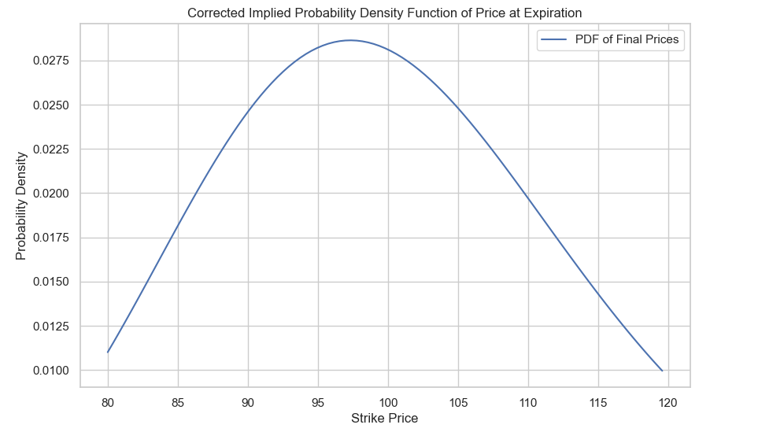
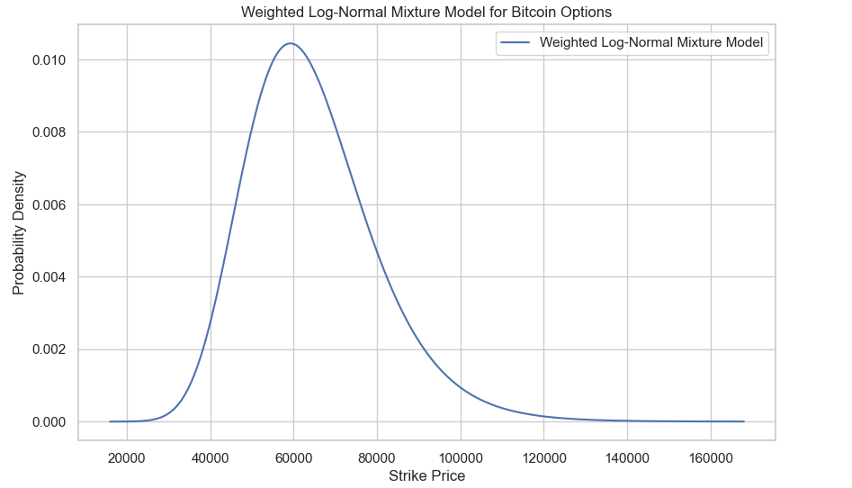
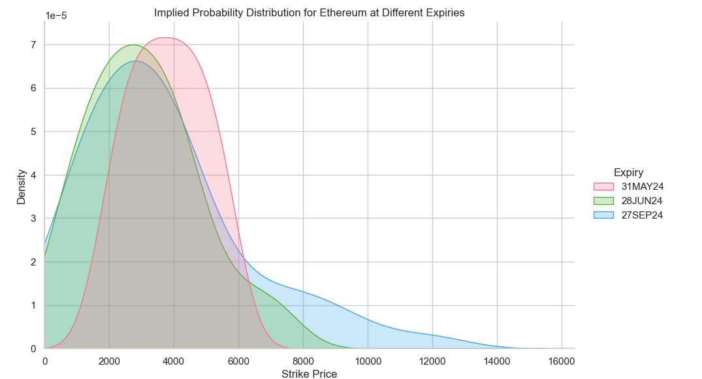
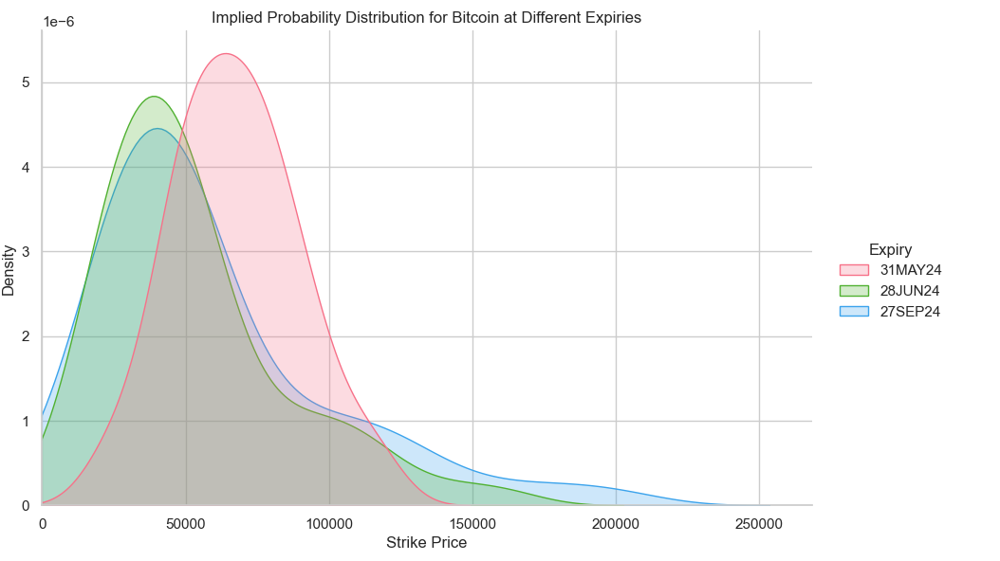
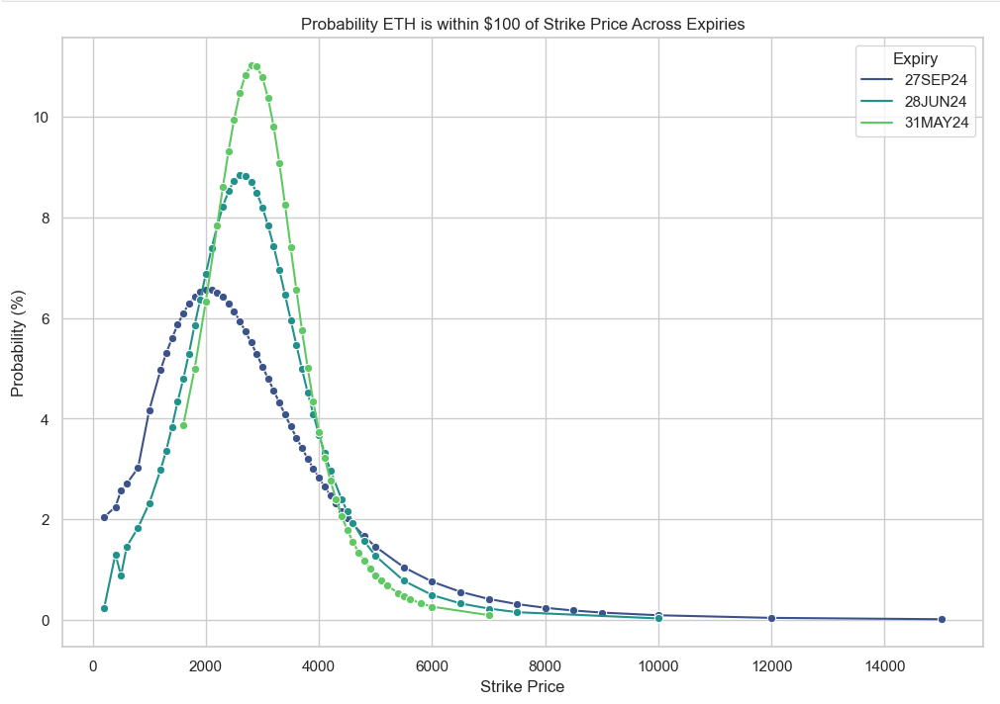
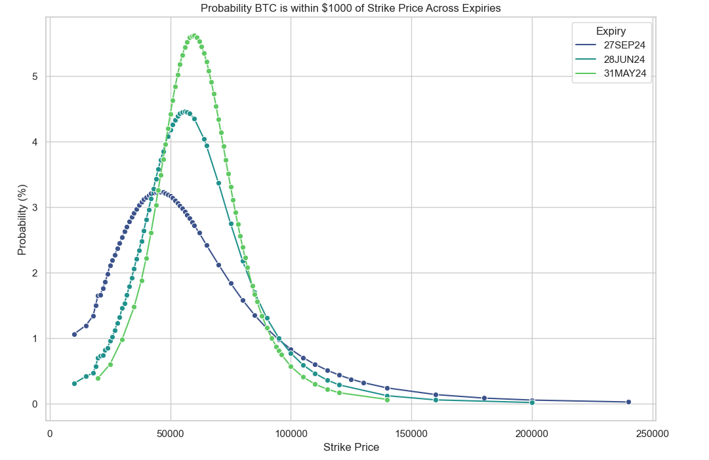
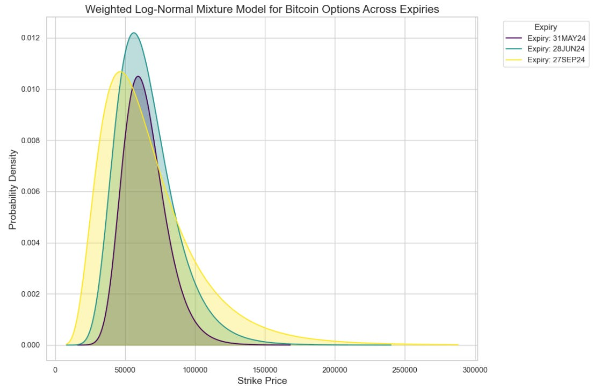
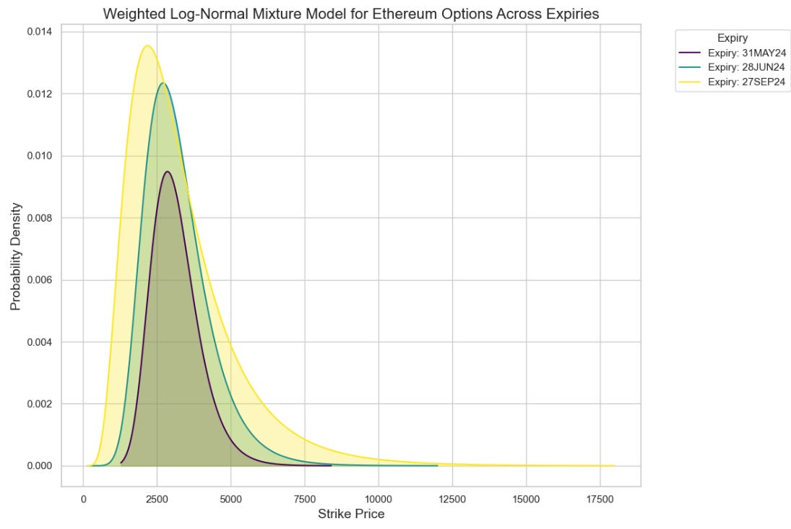
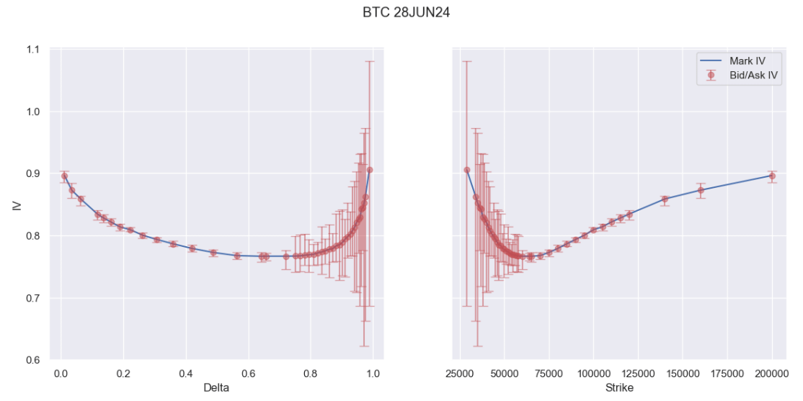
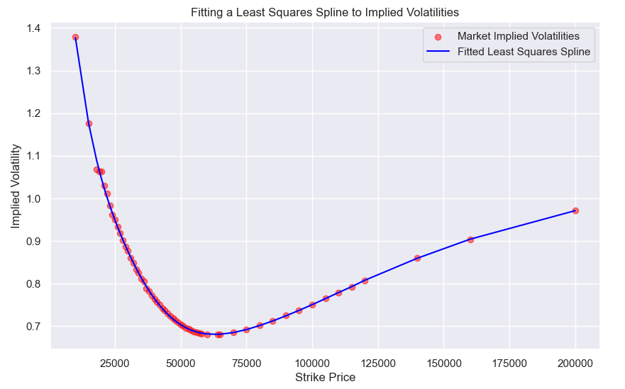

# Where will crypto go?

Source HTML: [`html/2024-04-18-where-will-crypto-go.html`](../html/2024-04-18-where-will-crypto-go.html)

# Where will crypto go?

| 항목 | 값 |
| --- | --- |
| 날짜 | 2024-04-18 |
| 접근 | 무료 |
| URL | https://www.algos.org/p/where-will-crypto-go |
| 부제 | Understanding the markets view on BTC and ETH over various timescales |

---

#### Introduction

---

In this (much shorter than usual) article, we will try to have a guess at where the market believes BTC and ETH will be going soon. Our analysis will be results focused, and in two follow up articles we will dive a bit more into ways to estimate this effectively.

The Quant Stack is a reader-supported publication. To receive new posts and support my work, consider becoming a free or paid subscriber.

#### Methodology - A Naïve Approach

---

When I first thought about this topic, my immediate thought was to look at using the d2 of the options and use that to fit a surface to the probabilities of each. For readers unfamiliar with some of the math:

Where:

- C(S, t) is the price of the call option
- S is the current spot price
- K is the strike price of the option
- T is the expiration time
- t is the current time
- r is the risk free rate
- Phi is the cumulative distribution function (CDF) of the standard normal distribution
- d\_1 and d\_2 are intermediate variables calculated as part of the model.

This is article will tend to become a bit math heavy - it’s option afterall, but what really is worth understanding is that d\_1 plugs into a CDF and gets you your delta and if you adjust it for time and volatility, you get d\_2 or the probability the option will expire ITM.

We can see quite simply how d\_1 becomes d\_2 with a quick adjustment:

Giving a basic code example for this:

```
import numpy as np
import matplotlib.pyplot as plt
from scipy.stats import norm

# Define the parameters
S = 100       # Current price
r = 0.01      # Annual risk-free rate
sigma = 0.20  # Volatility (standard deviation per year)
T = 0.5       # Time to expiration in years

# Range of strike prices
Ks = np.linspace(80, 120, 100)  # Strike prices from 80 to 120

# Function to calculate d2
def calculate_d2(S, K, r, sigma, T):
    return (np.log(S / K) + (r - 0.5 * sigma**2) * T) / (sigma * np.sqrt(T))

# Calculate d2 for each strike price
d2s = calculate_d2(S, Ks, r, sigma, T)

# Calculate CDF values at each d2, which is N(d2)
cdf_values = norm.cdf(d2s)

# Adjust the PDF calculation by taking the negative of the derivative if necessary
pdf_values = -np.diff(cdf_values) / np.diff(Ks)

# Replot with the corrected PDF values
plt.figure(figsize=(10, 6))
plt.plot(Ks[:-1], pdf_values, label='PDF of Final Prices')
plt.xlabel('Strike Price')
plt.ylabel('Probability Density')
plt.title('Corrected Implied Probability Density Function of Price at Expiration')
plt.legend()
plt.grid(True)
plt.show()
```

Which then produces this plot:

[](images/b3bce5d54309.png)

We do a few modifications to this as we then also look at the probability that the price will end up within $100 and $1000 of each strike (for ETH and BTC respectively), but I will touch on this in a later article.

#### Improving on this

---

It’s not a terrible method for estimating the probability that prices will be within X amount of a strike (which we will show after), but when it comes to uniform distributions we get a pretty terrible job.

That said, we do capture bumps in the curve which I personally think are valuable. For the sake of uniformity we will assume a log-normal distribution, and weight by the bid-ask spread.

```
# Constants and Price Range
MINIMAL_WEIGHT = 1e-5
price_range = np.linspace(min(df['Strike Price']) * 0.8, max(df['Strike Price']) * 1.2, 400)
distributions = []

# Calculate the weighted PDF for each option
for index, row in df.iterrows():
    bid_iv = row['bid_iv']
    ask_iv = row['ask_iv']
    mid_iv = row['mid_iv']
    spread = ask_iv - bid_iv
    weight = (1 / spread) if spread > 0 else MINIMAL_WEIGHT

    sigma = mid_iv * np.sqrt(row['T'])
    scale = np.exp(np.log(S) - 0.5 * sigma**2 * row['T'])

    dist = lognorm(s=sigma, scale=scale)
    pdf_values = dist.pdf(price_range) * weight  # Multiply by weight here

    if not any(np.isnan(pdf_values)):
        distributions.append(pdf_values)

# Sum the distributions index-wise
weighted_pdf = np.sum(distributions, axis=0)
weighted_pdf /= np.sum(weighted_pdf)  # Normalize the final weighted PDF

# Plot the result
plt.figure(figsize=(10, 6))
plt.plot(price_range, weighted_pdf, label='Weighted Log-Normal Mixture Model')
plt.title('Weighted Log-Normal Mixture Model for Bitcoin Options')
plt.xlabel('Strike Price')
plt.ylabel('Probability Density')
plt.legend()
plt.grid(True)
```

There’s some earlier computation here, but this gives us the below plot for the 31st of May 2024. This isn’t so present-able so we will of course add a bit of fun to the plots and show it all the next section.

[](images/5f59f38a9968.png)

#### What the Market Thinks

---

Here’s our probability distributions estimated from our more naïve approach to things that plainly uses d2:

[](images/070fdaf7ecd8.png)

[](images/a36421debd2d.png)

These plots are nice and all, but they don’t tell us an awful lot in intuitive terms about where the price will go, so it isn’t so easy to visualize.

[](images/4d5cdc5e5ece.png)

[](images/3edfd39baedf.png)

Plotting our mixture model approach:

[](images/3778c90eeabd.png)

[](images/fc56794c4af4.png)

#### Notes

---

There are many caveats to note here… and they really should not be ignored. The first is that we do not really believe that the market implied volatility will be the realized volatility of the market. To estimate this we would need to do work on estimating the realized volatility against the markets implied over time, and infer from this a rough guess of the true implied distribution.

The distributions also had very fat tails because we have OTM options which are not being weighted down in their presence. We can see below how illiquid options form a large part of the curve:

[](images/284aa7962e88.png)

We would be much better served by fitting a least squares spline and weighting by bid-ask spread in our distribution.

[](images/c6c77795ffb9.png)

Least squares splines will tend to overshoot with sparse data however and so we would prefer to use Fengler’s method which preserves convexity and monotonicity of the implied volatility surface. I’ll demonstrate this some other time.

There’s much more to this topic, and many methods exist:

- Log-normal Mixture (Already looked at today)
- Stochastic Collocation
- Andreasen-Huge (w/ Tikhonov regularization ideally)
- Butterflies Method
- Breeden-Litzenberger

These methods are often used by real practitioners. We’ll dive into this in later articles. In the meantime, feel free to check out this prior article where we dove into splines for options with a focus on market making:
