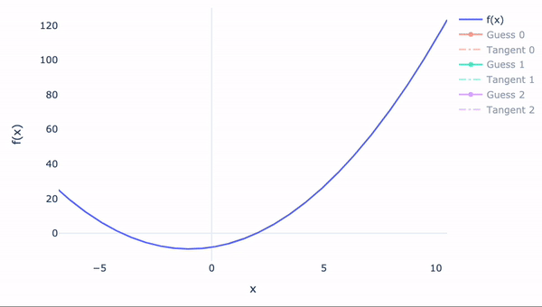
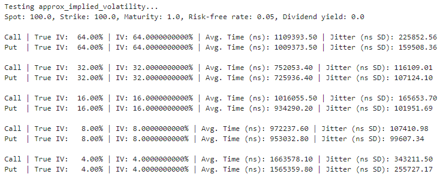
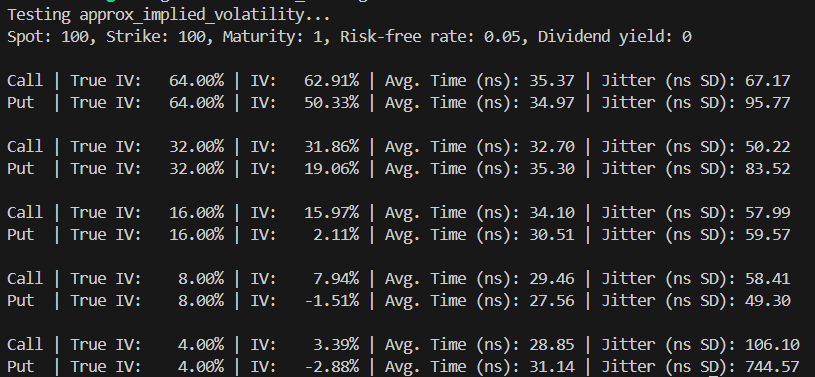
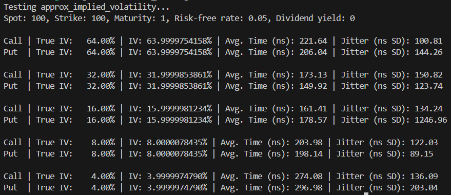
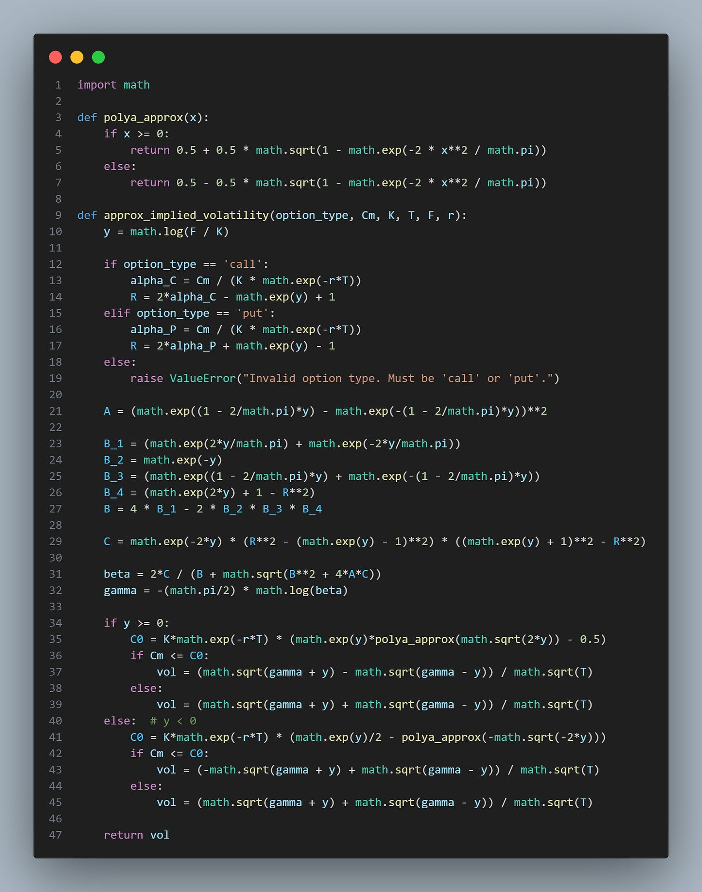
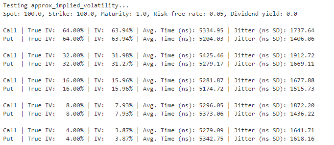
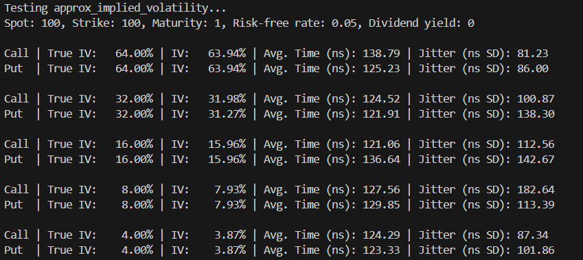
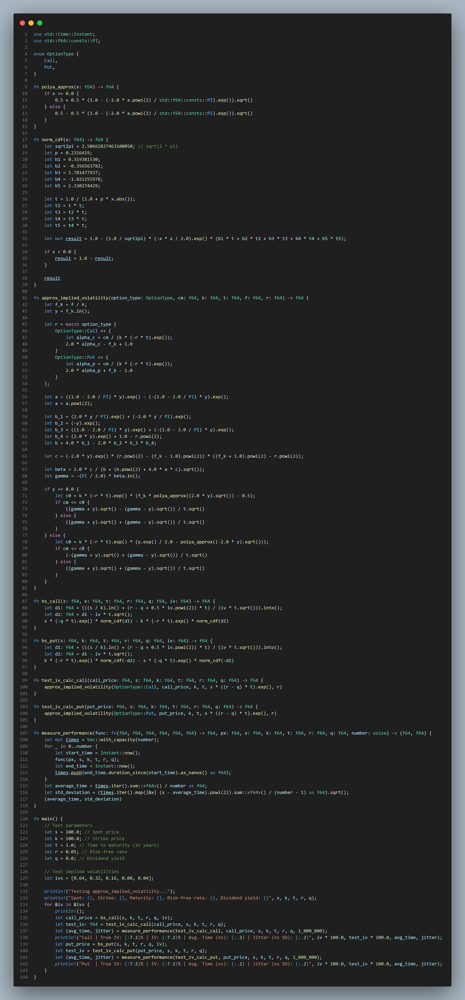
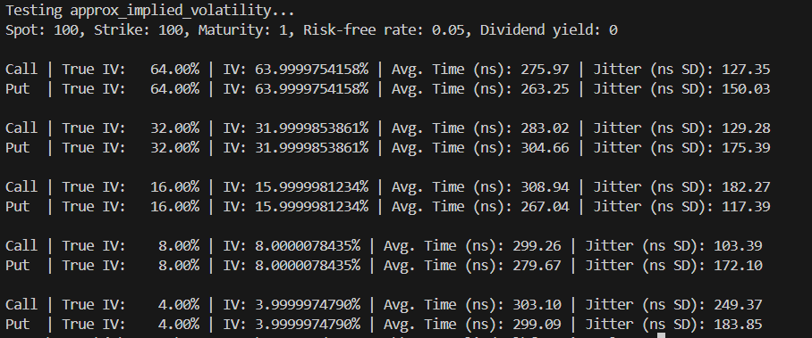

# Calculating Implied Volatility... Fast

Source HTML: [`html/2024-05-08-calculating-implied-volatility-fast.html`](../html/2024-05-08-calculating-implied-volatility-fast.html)

# Calculating Implied Volatility... Fast

| 항목 | 값 |
| --- | --- |
| 날짜 | 2024-05-08 |
| 접근 | 유료 |
| URL | https://www.algos.org/p/calculating-implied-volatility-fast |
| 부제 | How to calculate IV in a computationally effective manner. |

---

#### Introduction

---

I wasn’t entirely sure this topic would be interesting to most readers—it sure wasn’t to me at first. Despite this, I still managed to encounter it in my work, and my bet is that you’ll probably find it useful, too. This is if you ever work with a large (they’re almost all massive so this is perhaps redundant) dataset of option prices and require IV values, which I think isn’t too unlikely for most researchers. The libraries available are great, but knowing how it works under the hood to fit your needs will save you a lot of sitting about waiting for calculations to finish.

It is often overlooked that there is a lot of computational work that goes into efficiently calculating implied volatilities from option prices. If you are working with orderbook data, and performing research on the data - you will 100% encounter the issue of calculating Greeks and implied volatility being a compute bottleneck. Any large-scale data analysis using Greeks will require this, and if you need to accurately figure out how your risk has shifted after every market event, even the beefiest of trading systems will become clogged without fast calculations.

Fast Greek calculations are not simply about being cutting edge on the latency front - they are often about being able to do certain data analysis tasks or have specific risk management update frequencies AT ALL.

In this article, we will look at how to calculate this efficiently using Rust and Python. We will compare multiple methods and benchmark their performance across various option prices.

#### Index

---

1. Introduction
2. Index
3. Newton
4. Really Fast Newton???
5. SR
6. Low Accuracy
7. Let’s Be Rational
8. How does Optiver etc. do it

#### Newton

---

The Newton-Raphson method is a root-finding algorithm that uses iterations to find successively better approximations to the roots (or zeroes) of a real-valued function. The formula for the Newton-Raphson method is:

xn+1=xn−f(xn)f′(xn)

Where:

- *x\_n* ​ is the current guess,
- *f*(*x\_n* ​) is the function value at 𝑥\_𝑛​,
- 𝑓′(*x\_n* ​) is the derivative of the function at 𝑥\_𝑛​,
- 𝑥\_𝑛+1​ is the next guess.

When applied to finding the implied volatility, the function *f* becomes the difference between the market price of the option and the theoretical price of the option calculated using the Black-Scholes formula:

f(σ)=CBS(σ)−Cmarket

Here 𝜎 \_\_ is the implied volatility, 𝐶\_𝐵𝑆​ is the Black-Scholes price of the option, and 𝐶\_𝑚𝑎𝑟𝑘𝑒𝑡 is the actual market price of the option. The derivative 𝑓′(𝜎) is the Vega of the option or the rate of change of the option price with respect to changes in volatility.

Visually:

[](images/fe823bc6b92c.gif)

Implementing a demonstration of this in Python:

```
from scipy.optimize import newton
import numpy as np
import scipy.stats as si

def bs_call(S, K, r, sigma, T):
    """Calculate Black-Scholes call option price."""
    d1 = (np.log(S / K) + (r + 0.5 * sigma ** 2) * T) / (sigma * np.sqrt(T))
    d2 = d1 - sigma * np.sqrt(T)
    return S * si.norm.cdf(d1) - K * np.exp(-r * T) * si.norm.cdf(d2)

def bs_put(S, K, r, sigma, T):
    """Calculate Black-Scholes put option price."""
    d1 = (np.log(S / K) + (r + 0.5 * sigma ** 2) * T) / (sigma * np.sqrt(T))
    d2 = d1 - sigma * np.sqrt(T)
    return K * np.exp(-r * T) * si.norm.cdf(-d2) - S * si.norm.cdf(-d1)

def bs_vega(S, K, r, sigma, T):
    """Calculate Vega of an option, which is the derivative of the price with respect to sigma."""
    d1 = (np.log(S / K) + (r + 0.5 * sigma ** 2) * T) / (sigma * np.sqrt(T))
    return S * si.norm.pdf(d1) * np.sqrt(T)

def nr_solve(option_type, price, S, K, r, T, initial_guess = 0.2):
    """Function to estimate the implied volatility for both call and put options using Newton-Raphson method."""
    if option_type == 'call':
        price_fn = bs_call
    elif option_type == 'put':
        price_fn = bs_put
    else:
        raise ValueError("Invalid option type. Must be 'call' or 'put'.")

    obj_fn = lambda sigma: price_fn(S, K, r, sigma, T) - price
    dfn = lambda sigma: bs_vega(S, K, r, sigma, T)

    try:
        result = newton(func=obj_fn, x0=initial_guess, fprime=dfn, tol=1e-5, maxiter=100)
        return result
    except RuntimeError as e:
        print("Failed to converge:", e)
        return None
```

We get these performance results:

[](images/c4dfb4a04a3a.png)

It isn’t exactly the fastest, that’s for sure, but it’s very accurate. This is our first method, so don’t be too disappointed; we’ll get Newton up to standard in no time. We also wrote it in Python… let’s try some Rust instead.

#### Really Fast Newton

---

How can we make Newton faster? Well, we already got a speed boost from using Scipy, but we can further improve it by using Rust and nrfind::find\_root. Something that might look a bit like this:

```
pub fn call_iv_guess(
    price: f64,
    s: f64,
    k: f64,
    rate: f64,
    maturity: f64,
    initial_guess: f64,
) -> Result<f64, f64> {
    let obj_fn = |sigma| call(s, k, rate, sigma, maturity) - price;
    let dfn = |sigma| call_vega(s, k, rate, sigma, maturity);
    let precision = 0.000001;
    let iterations = 10000;
    nrfind::find_root(&obj_fn, &dfn, initial_guess, precision, iterations)
}
```

The next idea is to use a closed-form approximation for the initial guess:

```
const SQRT_TWO_PI: f64 = 2.0 * SQRT_2 / FRAC_2_SQRT_PI;
//Corrado and Miller (1996)
fn approximate_vol(price: f64, s: f64, k: f64, rate: f64, maturity: f64) -> f64 {
    let discount = (-rate * maturity).exp();
    let x = k * discount;
    let coef = SQRT_TWO_PI / (s + x);
    let helper_1 = s - x;
    let c1 = price - helper_1 * 0.5;
    let c2 = c1.powi(2);
    let c3 = helper_1.powi(2) / PI;
    let bridge_1 = c2 - c3;
    let bridge_m = if bridge_1 > 0.0 { bridge_1.sqrt() } else { 0.0 };
    coef * (c1 + bridge_m) / maturity.sqrt()
}
```

Both of these code snippets are actually from the [black\_scholes](https://docs.rs/black_scholes/latest/black_scholes/) library in Rust. The Corrado and Miller implementation is very fast:

[](images/f174d79ef0ea.png)

But it’s not exactly the most accurate in existence. That said, when we look at using it as our initial guess and then using Newton from there, we get a very attractive picture:

[](images/60c51ac6ad07.png)

#### SR

---

In their paper “An Explicit Implied Volatility Formula”, Stefanica and Radoicic (SR) introduce a novel approach for rapidly computing implied volatilities to a high degree of accuracy. Their method leverages an approximation to the normal cumulative distribution function (CDF) known as the Polya approximation.

The key insight is to replace the normal CDF terms in the Black-Scholes option pricing formula with the Polya approximation. This allows them to derive an explicit, closed-form approximate solution for the implied volatility. Unlike the true Black-Scholes implied volatility, which has no analytical solution and requires numerical methods, their approximation yields a direct formula to calculate implied volatility.

The authors claim that their implied volatility approximation has a relative error uniformly bounded between -4.18% and 11.38% compared to the true Black-Scholes implied volatility, for options of any moneyness, maturity, and volatility level. The accuracy is even higher for options within typical trading ranges. For example, the absolute error is less than 10 percentage points for options with a total integrated volatility of less than 4.

Additionally, they show their approximation provides a sharp lower bound for the true Black-Scholes implied volatility. This enables its use as an initial estimate in numerical root-finding methods to boost their speed and accuracy. An open-source C++ implementation using their approximation reportedly runs 2-3 times faster than previous state-of-the-art implied volatility solvers.

I’ve coded up my own implementation in Python below:

[](images/ee847cfbff8c.png)

```
import math

def polya_approx(x):
    if x >= 0:
        return 0.5 + 0.5 * math.sqrt(1 - math.exp(-2 * x**2 / math.pi))
    else:
        return 0.5 - 0.5 * math.sqrt(1 - math.exp(-2 * x**2 / math.pi))

def approx_implied_volatility(option_type, Cm, K, T, F, r):
    y = math.log(F / K)

    if option_type == 'call':
        alpha_C = Cm / (K * math.exp(-r*T))
        R = 2*alpha_C - math.exp(y) + 1
    elif option_type == 'put':
        alpha_P = Cm / (K * math.exp(-r*T))
        R = 2*alpha_P + math.exp(y) - 1
    else:
        raise ValueError("Invalid option type. Must be 'call' or 'put'.")

    A = (math.exp((1 - 2/math.pi)*y) - math.exp(-(1 - 2/math.pi)*y))**2

    B_1 = (math.exp(2*y/math.pi) + math.exp(-2*y/math.pi))
    B_2 = math.exp(-y)
    B_3 = (math.exp((1 - 2/math.pi)*y) + math.exp(-(1 - 2/math.pi)*y))
    B_4 = (math.exp(2*y) + 1 - R**2)    
    B = 4 * B_1 - 2 * B_2 * B_3 * B_4

    C = math.exp(-2*y) * (R**2 - (math.exp(y) - 1)**2) * ((math.exp(y) + 1)**2 - R**2)

    beta = 2*C / (B + math.sqrt(B**2 + 4*A*C))
    gamma = -(math.pi/2) * math.log(beta)

    if y >= 0:
        C0 = K*math.exp(-r*T) * (math.exp(y)*polya_approx(math.sqrt(2*y)) - 0.5)
        if Cm <= C0:
            vol = (math.sqrt(gamma + y) - math.sqrt(gamma - y)) / math.sqrt(T)
        else:
            vol = (math.sqrt(gamma + y) + math.sqrt(gamma - y)) / math.sqrt(T)
    else:  # y < 0
        C0 = K*math.exp(-r*T) * (math.exp(y)/2 - polya_approx(-math.sqrt(-2*y)))
        if Cm <= C0:
            vol = (-math.sqrt(gamma + y) + math.sqrt(gamma - y)) / math.sqrt(T)
        else:
            vol = (math.sqrt(gamma + y) + math.sqrt(gamma - y)) / math.sqrt(T)

    return vol
```

This yields the below performance tests on my computer:

[](images/ffc234db50c3.png)

Of course, this is Python, which is incredibly unoptimized code. Let’s try it in Rust instead.

[](images/3e98feb8f2a7.png)

With code:

[](images/580e8f3e9f6c.png)

```
use std::time::Instant;
use std::f64::consts::PI;

enum OptionType {
    Call,
    Put,
}

fn polya_approx(x: f64) -> f64 {
    if x >= 0.0 {
        0.5 + 0.5 * (1.0 - (-2.0 * x.powi(2) / std::f64::consts::PI).exp()).sqrt()
    } else {
        0.5 - 0.5 * (1.0 - (-2.0 * x.powi(2) / std::f64::consts::PI).exp()).sqrt()
    }
}

fn norm_cdf(x: f64) -> f64 {
    let sqrt2pi = 2.50662827463100050; // sqrt(2 * pi)
    let p = 0.2316419;
    let b1 = 0.319381530;
    let b2 = -0.356563782;
    let b3 = 1.781477937;
    let b4 = -1.821255978;
    let b5 = 1.330274429;

    let t = 1.0 / (1.0 + p * x.abs());
    let t2 = t * t;
    let t3 = t2 * t;
    let t4 = t3 * t;
    let t5 = t4 * t;

    let mut result = 1.0 - (1.0 / sqrt2pi) * (-x * x / 2.0).exp() * (b1 * t + b2 * t2 + b3 * t3 + b4 * t4 + b5 * t5);

    if x < 0.0 {
        result = 1.0 - result;
    }

    result
}

fn approx_implied_volatility(option_type: OptionType, cm: f64, k: f64, t: f64, f: f64, r: f64) -> f64 {
    let f_k = f / k;
    let y = f_k.ln();

    let r = match option_type {
        OptionType::Call => {
            let alpha_c = cm / (k * (-r * t).exp());
            2.0 * alpha_c - f_k + 1.0
        }
        OptionType::Put => {
            let alpha_p = cm / (k * (-r * t).exp());
            2.0 * alpha_p + f_k - 1.0
        }
    };

    let a = ((1.0 - 2.0 / PI) * y).exp() - (-(1.0 - 2.0 / PI) * y).exp();
    let a = a.powi(2);

    let b_1 = (2.0 * y / PI).exp() + (-2.0 * y / PI).exp();
    let b_2 = (-y).exp();
    let b_3 = ((1.0 - 2.0 / PI) * y).exp() + (-(1.0 - 2.0 / PI) * y).exp();
    let b_4 = (2.0 * y).exp() + 1.0 - r.powi(2);
    let b = 4.0 * b_1 - 2.0 * b_2 * b_3 * b_4;

    let c = (-2.0 * y).exp() * (r.powi(2) - (f_k - 1.0).powi(2)) * ((f_k + 1.0).powi(2) - r.powi(2));

    let beta = 2.0 * c / (b + (b.powi(2) + 4.0 * a * c).sqrt());
    let gamma = -(PI / 2.0) * beta.ln();

    if y >= 0.0 {
        let c0 = k * (-r * t).exp() * (f_k * polya_approx((2.0 * y).sqrt()) - 0.5);
        if cm <= c0 {
            ((gamma + y).sqrt() - (gamma - y).sqrt()) / t.sqrt()
        } else {
            ((gamma + y).sqrt() + (gamma - y).sqrt()) / t.sqrt()
        }
    } else {
        let c0 = k * (-r * t).exp() * (y.exp() / 2.0 - polya_approx((-2.0 * y).sqrt()));
        if cm <= c0 {
            (-(gamma + y).sqrt() + (gamma - y).sqrt()) / t.sqrt()
        } else {
            ((gamma + y).sqrt() + (gamma - y).sqrt()) / t.sqrt()
        }
    }
}

fn bs_call(s: f64, k: f64, t: f64, r: f64, q: f64, iv: f64) -> f64 {
    let d1: f64 = (((s / k).ln() + (r - q + 0.5 * iv.powi(2)) * t) / (iv * t.sqrt())).into();
    let d2: f64 = d1 - iv * t.sqrt();
    s * (-q * t).exp() * norm_cdf(d1) - k * (-r * t).exp() * norm_cdf(d2)
}

fn bs_put(s: f64, k: f64, t: f64, r: f64, q: f64, iv: f64) -> f64 {
    let d1: f64 = (((s / k).ln() + (r - q + 0.5 * iv.powi(2)) * t) / (iv * t.sqrt())).into();
    let d2: f64 = d1 - iv * t.sqrt();
    k * (-r * t).exp() * norm_cdf(-d2) - s * (-q * t).exp() * norm_cdf(-d1)
}

fn test_iv_calc_call(call_price: f64, s: f64, k: f64, t: f64, r: f64, q: f64) -> f64 {
    approx_implied_volatility(OptionType::Call, call_price, k, t, s * ((r - q) * t).exp(), r)
}

fn test_iv_calc_put(put_price: f64, s: f64, k: f64, t: f64, r: f64, q: f64) -> f64 {
    approx_implied_volatility(OptionType::Put, put_price, k, t, s * ((r - q) * t).exp(), r)
}

fn measure_performance(func: fn(f64, f64, f64, f64, f64, f64) -> f64, px: f64, s: f64, k: f64, t: f64, r: f64, q: f64, number: usize) -> (f64, f64) {
    let mut times = Vec::with_capacity(number);
    for _ in 0..number {
        let start_time = Instant::now();
        func(px, s, k, t, r, q);
        let end_time = Instant::now();
        times.push(end_time.duration_since(start_time).as_nanos() as f64);
    }
    let average_time = times.iter().sum::<f64>() / number as f64;
    let std_deviation = (times.iter().map(|&x| (x - average_time).powi(2)).sum::<f64>() / (number - 1) as f64).sqrt();
    (average_time, std_deviation)
}

fn main() {
    // Test parameters
    let s = 100.0; // Spot price
    let k = 100.0; // Strike price
    let t = 1.0; // Time to maturity (in years)
    let r = 0.05; // Risk-free rate
    let q = 0.0; // Dividend yield

    // Test implied volatilities
    let ivs = [0.64, 0.32, 0.16, 0.08, 0.04];

    println!("Testing approx_implied_volatility...");
    println!("Spot: {}, Strike: {}, Maturity: {}, Risk-free rate: {}, Dividend yield: {}", s, k, t, r, q);
    for &iv in &ivs {
        println!();
        let call_price = bs_call(s, k, t, r, q, iv);
        let test_iv: f64 = test_iv_calc_call(call_price, s, k, t, r, q);
        let (avg_time, jitter) = measure_performance(test_iv_calc_call, call_price, s, k, t, r, q, 1_000_000);
        println!("Call | True IV: {:7.2}% | IV: {:7.2}% | Avg. Time (ns): {:.2} | Jitter (ns SD): {:.2}", iv * 100.0, test_iv * 100.0, avg_time, jitter);
        let put_price = bs_put(s, k, t, r, q, iv);
        let test_iv = test_iv_calc_put(put_price, s, k, t, r, q);
        let (avg_time, jitter) = measure_performance(test_iv_calc_put, put_price, s, k, t, r, q, 1_000_000);
        println!("Put  | True IV: {:7.2}% | IV: {:7.2}% | Avg. Time (ns): {:.2} | Jitter (ns SD): {:.2}", iv * 100.0, test_iv * 100.0, avg_time, jitter);
    }
}
```

Combining this with our Newton approach as our initial guess, we get these results:

[](images/08e5610323ae.png)

It is pretty clear that there is no point in making the initial guess super accurate at the cost of additional compute

#### Low Accuracy

---

What if we don’t need high accuracy? Surely it’s best to just use SR? What about Corrado and Miller? Well, you’ve got to think about the tails, and that’s really where it gets you.

The closed-form approximations lose accuracy MASSIVELY when you start looking at 0DTEs and are really nasty to price options. SR handled the 4% IV case quite well, but it still will be a nightmare when prices start violating traditional bounds.

Using Newton brings additional challenges because when you have extreme values, the algorithm will take up to 20x as long to get an answer. If the market is super volatile, like in crypto or certain commodity options markets, then your average calculation will be a 20x’er…

Coming back to the case where we only need 1 digit or so of accuracy, nothing more than that (i.e. the real-world case we encounter most of the time), the best way to achieve both speed for extreme cases and ensure that accuracy remains within our allowance is actually to modify the black\_scholes library in Rust to limit the number of iterations.

It gets close enough without spending 100s of extra iterations (instead of 10 in the first place) to try gain you a few additional decimals of precision.

#### Let’s Be Rational

---

Jäckel's paper “[Let’s be Rational](http://www.jaeckel.org/LetsBeRational.pdf)” takes a different approach. One that has been used by larger firms for a while.

The approach builds upon previous work by himself and a handful of others, while introducing quite a few novel techniques to improve both speed and precision.

A key element of Jäckel's method is the definition of a robust initial guess function for the implied volatility. This function is split into four segments, each using rational approximations to capture the behavior of the implied volatility across different price regimes. Notably, two of these segments employ non-linear transformations to ensure the correct asymptotic behavior of the initial guess in the extreme cases of very low and very high prices. By carefully constructing this initial guess function, Jäckel ensures that the subsequent root-finding procedure converges rapidly to the true implied volatility.

Another crucial component of the approach is the specification of a three-branch objective function. This function measures the difference between the given market price and the price computed using the Black formula at a given volatility level. Jäckel applies different transformations to this price difference depending on the price regime, which helps to improve the convergence properties of the root-finding algorithm. Specifically, he uses the reciprocal of the logarithm of the price for low prices, the price difference itself for intermediate prices, and the logarithm of the distance from the maximum possible price for high prices.

To find the root of the objective function (i.e., the implied volatility), Jäckel employs two iterations of a fourth-order root-finding method called Householder’s. This method is a generalization of the well-known Newton-Raphson and Halley's methods, offering rapid convergence to the true solution. By using a higher-order method and a carefully constructed initial guess, Jäckel is able to achieve maximum machine precision in the computed implied volatility with just two iterations across all possible input scenarios.

Finally, a critical aspect of Jäckel's approach is implementing a refined version of the Black formula itself. He notes that the standard implementation of this formula can suffer from significant roundoff errors and numerical inaccuracies, particularly in certain parameter regimes (e.g., very low or high volatilities, or options near expiry). To mitigate these issues, Jäckel introduces several modifications to the Black formula implementation, such as using a Taylor series expansion for small volatilities and employing the "scaled complementary error function" for large volatilities. These refinements ensure that the Black formula is evaluated accurately across all relevant parameter ranges, which is essential for the overall accuracy of the implied volatility computation.

C++ code is available publicly online, and I have implemented my own version of this code in Rust. That said, it’s a bit too large of a codebase to share here, but you can still easily try it out using the py\_vollib\_vectorized library, which uses this behind the scenes to achieve incredibly fast speeds.

In my own tests (using real trading data, but performed maybe 6 or 7 months ago), it came out to be about 2x as slow as a hyper-optimized Newton but with incredibly consistent performance. It depends on what you care about in the end. Average speed was the main goal in that case, so Newton won out, and the code has been a bit dusty since.

#### How does Optiver etc. do it

---

How do the pros do it? Well, they usually just pre-compute all the possible values, perhaps with some smoothing or resampling, and then use those in production. These obviously require much computing to produce and use, but are the lowest latency way to for live trading.

You simply compute the range of prices you expect to see and what this means for the Greeks. Then, when the event occurs, you already have the numbers on hand.

However, how do they calculate the pre-computed values? Optimized Newton is most common, but the initial guesses may vary between firms and the optimizations they have in place there.

Pre-computation does not just extend to trying to be the fastest on the latency front; it also applies to working with big data, where you are more concerned about the total time to compute a lot of implied volatilities. Similar to Jackel, but with a heavier focus on brute forcing it, they pre-compute a grid of possible values and then either save those or try to find a function to match it.

I’ve always found optimized Newton sufficient, and I didn’t have the requirements to necessitate this approach, but it’s a very open secret in the industry that pre-computing is how the larger shops take to it.

With all this said, this is how the larger firms do it in production. It doesn’t mean that every options researcher is doing it this way. It’s a hell of a lot of effort to produce these pre-computed values, and most won’t have access. In fact, most will find the available libraries sufficient (they usually use the best approach in the first case anyway). If they do it themselves, I’d expect Newton + initial guess + tuning the precision (same as most would). If they aren’t, expect “Let’s Be Rational” (if using py\_vollib), pre-computing / whatever their firm’s internal tooling is if they’ve got proprietary tooling available, and Newton if using Rust (and good chance in C++ / a few other languages’ popular libraries as well)
