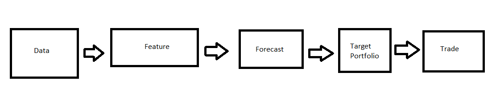
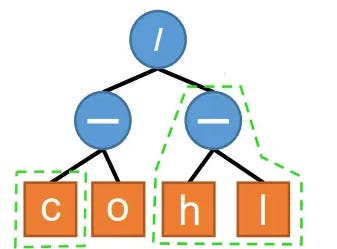
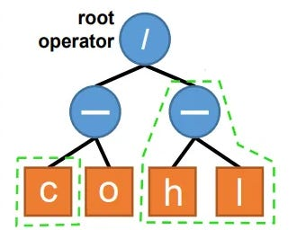
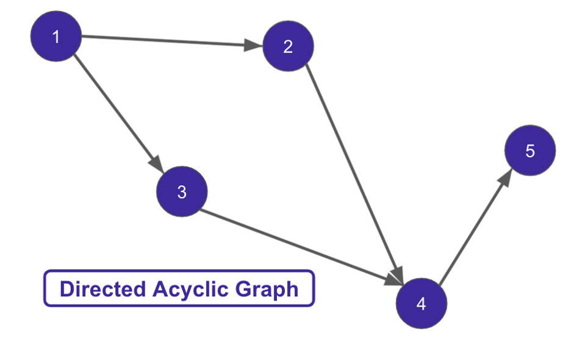

# Automating Alpha Pt.1 - The Overview

Source HTML: [`html/2024-05-22-automating-alpha-pt1-the-overview.html`](../html/2024-05-22-automating-alpha-pt1-the-overview.html)

# Automating Alpha Pt.1 - The Overview

| 항목 | 값 |
| --- | --- |
| 날짜 | 2024-05-22 |
| 접근 | 유료 |
| URL | https://www.algos.org/p/automating-alpha-pt1-the-overview |
| 부제 | A new series on automated alpha discovery |

---

#### Introduction

---

Every so often I get a question “Couldn’t we just create an algorithm for generating the formulas for our alphas from scratch” and end up explaining the rabbit hole of what is already quite a developed topic.

It’s mostly developed on the private firm research side, but much literature exists within the public domain. It’s an extensive subject that has a lot of potential for alpha, but also a lot of potential to become a nerd hole / overfitting mess.

Thus, today, I give a general overview of how this works, and then in the following articles, we will explore the specific approaches to implementing them.

I’ve kept the amount of code quite limited today, other than the odd example to build intuition, but as we go into more depth in later articles, the level of code and ability to use that code for the reader will follow.

#### Index

---

1. Introduction
2. Index
3. Intuition of an Alpha

   1. Pipeline Pieces
   2. Features Are Maximally Flexible
   3. Rule-Based Strategies as Forecasts
   4. What is a formulaic alpha?
4. Flows, Graphs, & Trees

   1. The Need For Data Structures
   2. Whole Pipeline As One Graph
   3. Rule Based Strategies
5. Two construction paths

   1. Statistical
   2. Mechanical
6. Base Alphas
7. Caution
8. Efficient-ish Markets
9. Manual Exploration
10. Researchers Who Behave Like Robots
11. Wrapping Up

#### Intuition of an Alpha

---

***Pipeline Pieces:***

It helps to start by thinking of alpha as a pipeline:

This is a diagram I’ve taken from a previous article where we really go into depth on how this all works:

The key part is that we go from data to a trade and this follows many steps. You will have the rawest possible data, your individual book signals, and trades. Your data provider may aggregate this into X-minute bars or you may do so yourself from a desire to ensure data integrity and add valuable boosters like midprice-based bars instead of trade price-based bars.

Regardless, we start with our data. This is where things get murky - I know… Already! Automated alpha generation usually means the part related to the feature, but sometimes we include the forecast stage, and sometimes we do all 3 at once.

We can keep these separated where we find a feature, and then find the best model for it, and then apply some portfolio optimizer on top…

OR

We can mash it all into one thing where we are building trading logic on if-then-but style conditions. If price > 4, sell, else get balls deep long.

Whilst, you could think about even automating the data part (i.e. we decide whether we want 5 or 10-minute bars), this is a dumb idea for reasons we’ll get into in Chapter 7 of the article.

The 5 stages in our pipeline are an example of when we break it down at the maximum level. Keep in mind that the trade stage itself is not necessarily a finish point where we simply send an order, many people assume this is simply “send buy for X qty” - there could be an entire execution algorithm here and for many firms, there is just as much work put into this. Optimizing how you time your execution and your aggression in doing so is closely related to your feature itself. The slope/speed at which the forecast strength decays, which is specific to each feature, also determines how the best execution solution should be constructed.

Most parts can be combined, you can combine the model and feature part and use a deep neural network - I wouldn’t recommend this, it’ll suck, but you can do it.

You can combine the ML and portfolio optimization part using ranked long/short, another topic I’ve discussed before- this isn’t optimal, but unlike the DNN example, it’s less work to do so as opposed to more work, and thus is often chosen to save time and get things in prod.

We can combine many steps in the process, but it’s not always the right decision. Keeping it separate works well, but throughout this series, we will discuss many approaches - not all of them because some like the DNN approach objectively suck, but we will cover a lot of ground.

***Features are Maximally Flexible:***

With a feature, you can usually capture whatever you want to capture… without the need for much more complicated matters in the next or previous stages, so it is somewhat standard, especially when we are focused on statistically driven research to go at it on the feature level.

For more information about what “statistically driven research” is I have an article below (top), and for more information on how you can incorporate non-linearity into the features and get the same results as if you had done so with non-linear machine learning models, I have another article on the topic below (bottom):

Thus, we can incorporate anything we would want to get out of a complicated machine learning setup in the feature itself, so we don’t want to merge them - simple will work fine.

Features are not always formulaic (written as a formula such as x = z\_score(high/low, 30\_days)), but they can also be conditional such as if 30\_day\_SMA > 90\_day\_SMA, and we can express this as 1, 0, or -1. This can, of course, cause issues as we try to use it in the machine-learning process in terms of how a regression would fit compared to a continuous feature.

***Rule-Based Strategies as Forecasts:***

Certain event-based trading strategies might not explicitly utilize forecasts. Instead, these strategies deploy rules that dictate when to enter and exit positions. A rule-based strategy can be expressed in terms of a target function:

To integrate such strategies with those based on forecasts, the rules need to be converted into forecasts, which can be thought of as reversing the portfolio construction process. We can adapt a utility function for the deviation from the target 𝑄∗ and also incorporate a penalty for risk factor exposure by applying constraints:

Where 𝐹(𝑄) represents the adapted utility function, and 𝐸 indicates the space of possible positions. Ignoring constants that do not depend on the position 𝑄, this formulation is analogous to having a forecast function:

Here, *A* is a normalization factor necessary to maintain an appropriate scale for the forecast. This adjustment ensures the forecast remains meaningful when comparing expected returns with transaction costs. A potentially complex term structure for the forecast 𝑓(𝑡) may also be included.

Thus, we can automatically generate rule-based strategies (data to trade is all one optimization) with feature-driven strategies (features are the only part we optimize automatically and the rest of the pipeline remains separated).

***What is a Formulaic Alpha? :***

Whilst, it may seem somewhat trivial how we visualize our alphas. For the example alpha below, we write the formula:

We can also visualize this as a tree:

Our root operator is the highest point on the tree which joins everything together:

Our lowest row is purely input data, and everything above that is a transform of that data. We can thus, think of it as a mix-and-match problem between our input data and our transforms.

By using a tree, we can limit overfitting by controlling the tree’s height.

We can see that there are two parts highlighted in green. Any given node, other than the root operator, can be swapped out for an equal-sized node from another tree OR our pool of operators/input data sources. Thus, we see how the Close is a component we could swap, but equally, a whole branch (High-Low) could be swapped out instead.

#### Flows, Graphs, & Trees

---

***The Need For Data Structures:***

Why do we even need to put our feature in a tree in the first place though, and why should we spend time thinking about the data structure of our alphas?

Well, your computer does not understand what close-low is. It does, however, understand what a tree of data (lowest nodes) and functions (other nodes) is, and we have existing optimization tools for shuffling it about to get to the best feature.

So, we not only influence how the overall optimization process occurs by using a structure to represent our alphas, but need to have one for us to even attempt to optimize it in the first place.

***Whole Pipeline as One Graph:***

Trees are powerful, but they don’t necessarily allow us to easily represent our whole pipeline. Thus, when we want to introduce variability in our choice of machine learning or portfolio optimization - we can use DAGs. A Directed Acyclic Graph means we do not need to separate ML and optimization into their own stages and can optimize this all at once.

In most cases, it is best to simply optimize the feature on its own, BUT we do get a lot of advantages from the graphical route when we consider the practical aspects of deployment. When we use a graph, we can concurrently run each path, and then our machine learning and optimization components are also run as functions. Every node in the graph is simply a function in this way.

If we leave certain nodes as “fixed” such that they cannot be optimized (because it generally isn't very useful to do all the parts at once, we only really want the features optimized here), then we can represent our ENTIRE trading strategy graphically.

This means that if we can drag and drop it into place on a nice GUI, we have a strategy. It’s a very nice interface for modifying strategies and provides an effective data structure that your system can automatically build into a fully deployable strategy in its backend.
