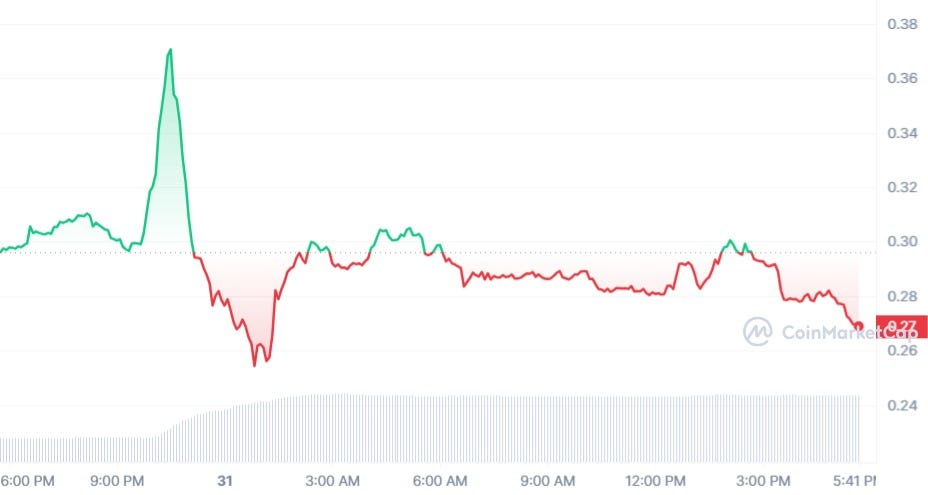
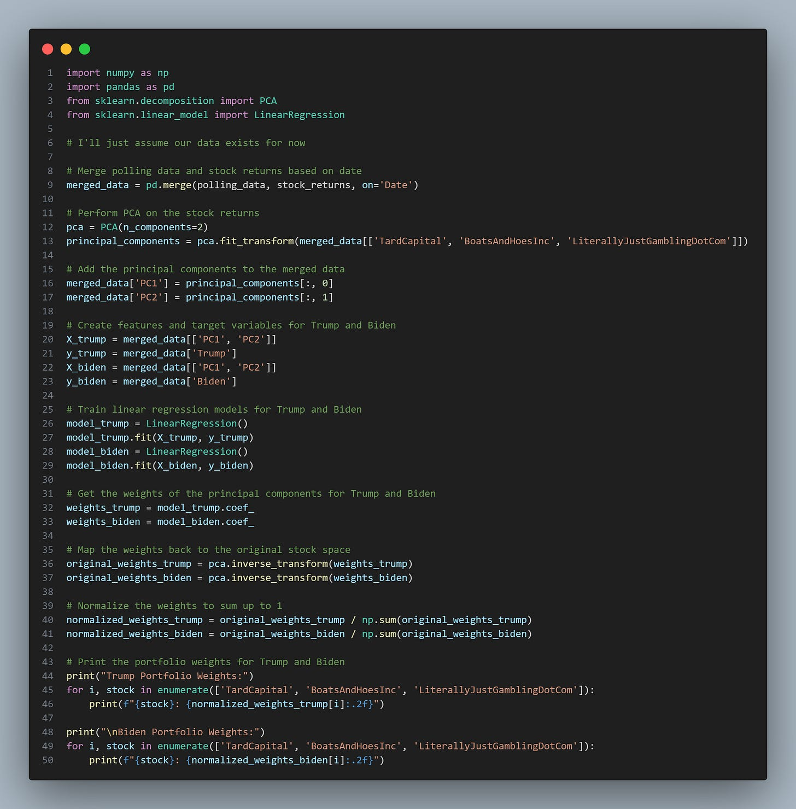
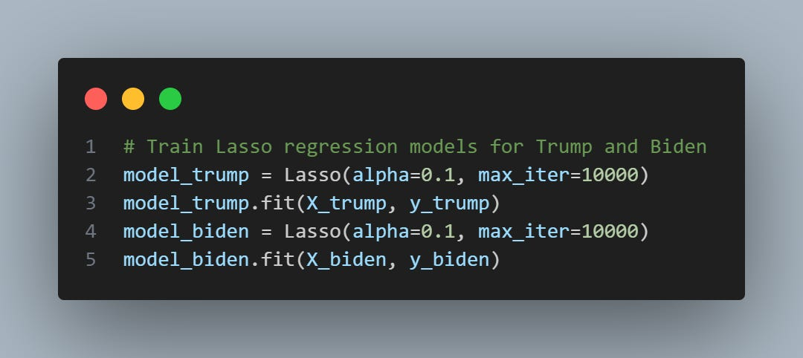

# Event-Based Alpha: A Quick Guide

Source HTML: [`html/2024-05-31-event-based-alpha-a-quick-guide.html`](../html/2024-05-31-event-based-alpha-a-quick-guide.html)

# Event-Based Alpha: A Quick Guide

| 항목 | 값 |
| --- | --- |
| 날짜 | 2024-05-31 |
| 접근 | 무료 |
| URL | https://www.algos.org/p/event-based-alpha-a-quick-guide |
| 부제 | A tutorial guide to event-based trading |

---

### **Introduction:**

---

Whilst it was only today (31/05/2024) that I opened up my feed and saw Jeo Boden had popped up massively, whilst Doland Tremp had dumped, in the wake of news relating to Trump's judicial woes, the topic of event-based alphas has been one of my areas of interest for a while.

More than interest, I have worked on real strategies related to these ideas before - those I won't discuss, but I will break down some more general parts of it all. You can be reassured that I've found out through fucking around on this topic and that the insights will not be so poorly thought out as I often see in my feed from so-called "quant experts".

What even is an event-based strategy? This is often a term macro traders will use when they bet on an event occurring before it does and then trade to express this view. That's not really what we are doing here. We're not guessing what will happen - we are finding out what happened and then trading faster than everyone else.

It's a short period of time (an event occurring) where we know that a certain asset or group of assets are going in a direction with a lot of force - and quickly. It's not hard to research because of this discreteness to the signal; it all realizes very fast, and thus, we don't have much concern about causality. Event occurs, the price spikes 20% in 10 seconds, "Gosh, I wonder what caused that." - the analysis is easy, so put away your neural nets and get Matplotlib out.

This was originally posted on my [Twitter](https://x.com/quant_arb/status/1796643112703381558), thought I’d try that out for a fun change of pace, but we’re going back to Substack after this. Certainly, for the automating alpha series, which is in the works (big one coming!).

This article has a lot of overlap with my previous work writing about sentiment. Worth the read:

<https://www.algos.org/p/sentiment-and-news-data>

### **Index**

---

1. Introduction
2. Index
3. Having Something To Trade
4. Expectations Come Priced In
5. What is Reactionworthy?
6. Technical Considerations of Implementation
7. Data Sources
8. Fun Chart Patterns
9. Spread Stuff
10. The End

### **Having Something To Trade**

---

How can we expect to make money if we don't have anything to trade? We can't. So that's why we need to find something. The criteria are:

1. Liquid
2. Will React To The Event
3. Cost Effective
4. (Ideally) Slow Enough To React

Our first option is prediction markets. You can trade almost anything on there, but it fails at our first hurdle. Many traders may think, "But I'm just a small trader with a small size", but you should really see how small the liquidity on many of these bets is and revise whether this is true. Some have a couple thousand in liquidity; some have tons. Especially if an event is expected to occur (perhaps we don't know the outcome, but we know it will be settling one way or the other), then we will see liquidity get boosted. Bets around whether Trump will be found guilty are obviously very actively traded prior to the conviction, but on the other hand, if there's an orderbook involved - expect thin liquidity pre-announcement as market makers aim to avoid losses.

We don't need to necessarily trade the bet that Trump will be convicted; we can trade the bet that he wins the election - it's noisier, but it's still strongly tied to the occurrence of the event.

Option 2 is shitcoins. There's basically a shitcoin for everything nowadays, and there sure enough is one for Trump and another one for Biden. There's also the trade about a celebrity (perhaps one known for moving prices like Elon) tweeting about a coin - it's an easy play with a simple signal setup to catch a tweet. It's also become quite competitive, so don't get too excited unless you have figured out the special network tricks on how to be the fastest for this stuff (they do exist, and it's mostly on the getting the data side, so don't worry - you can program in Python and execute somewhat normally). On the point of optimizing execution, Elon's tweets require you to optimize execution time to the exchange, not just tweet fetching. That stuff is insanely fast to price, but that's so well known that it's scarcely a low-hanging fruit anymore.

Option 3 is to make a synthetic index using math. What kind of math? PCA and regressions. Here's a simple example from my [thread](https://x.com/quant_arb/status/1796573523798106544):

We do PCA on our data, regress the principal components against polling data (or whatever our signal is), and then do an inverse transform.

Doesn't this mean that every asset in our universe will get a weight then? Yes. That's not good, so how can we fix it? We can use LASSO instead.

We do not simply swap out our linear regression for a LASSO (like the snippet below), but instead, skip the PCA all-together. If we work with PCs, each PC contains a weight for all of our universe. Even if we reduce the number of PCs, we will still have a non-sparse solution, as there will be non-zero weights for all stocks.

This is pretty compute-heavy and will scale exponentially with the size of your universe. I wouldn't be able to run LASSO on the entire S&P500. So what else can we use?

Truncation is our next best bet. We take the weights that are the largest (assuming our prices were normalized since a weight of 0.5 for a stock with 10 price is not the same as a weight with 0.5 for a stock with 100 price), and drop the rest. Most weights actually do nothing, so it isn't a big deal.

We can do dirty things as well - like heuristic-based optimization. Usually, for regressions, we use mean **squared** error because we want to exponentially penalize larger deviations. In our case, we want to exponentially discount larger deviations (and instead prefer large but consistent deviations). So, we take mean root error (or log error, or apply whatever norm, we aren't doing it convex optimization wise so you can mess about here). What is our error? It's not actually an error, it's the amount of price movement we saw % wise during our "reaction window". Usually, there is not a related piece of data that we can use alongside our time series, like polling numbers, and we must instead look at previous events like this, label the release windows, and train it on those reactions. Thus, we find the assets which (penalized for spread, maybe a ratio, maybe a mix, your call - I doubt it matters) had the best mean squared move over our target windows. We should also then adjust this so that the sign of the event (bad or good news) is multiplied with sign of the move. Add the signage back in after the sqrt transform (i.e. sqrt(abs(move)) \* np.sign(move)).

The lowest 10 are your losers in this event, and your best 10 are your winners. Hey, you may even be able to build a hedged portfolio, but you really don't need to because the alpha realizes so fast that it's a waste to spend any time thinking about being hedged (you're done and dusted after a few minutes regardless).

### **Expectations Come Priced In**

---

If you are looking to trade CPI, you shouldn't trade whether the inflation number is positive or negative (yes, I know this is technically then deflation) - you need to think about what the expected outcome was. If it's a binary event (guilty or not guilty), figure out what people think is the odds. Maybe only one outcome is tradeable. Not guilty may be the expectation, one that receives a small move that isn't worth trading, but guilt might come with a huge price move. I doubt this was the case; both would've moved the price, but it serves as a good example that the size of the move is based on the difference between the expectation that has been priced in and the actual outcome.

You can see this very clearly for prediction markets. If the pre-event odds are 90% not guilty and the event comes out guilty, you make a hell of a return if you can get in at 10c on the dollar to buy guilty odds. This is a lot less clear with assets, and we do need a bit of guessing in terms of the expected outcome. Whilst illiquid, prediction markets can be a very good tool here, even without us actually trading them.

### **What is Reactionworthy**

---

What is news that warrants a reaction in the price? It needs to be novel, relevant, and impactful. A news article that someone thinks a coin is worth buying isn't really going to move the price if it's some random journalist. If it's Goldman Sachs - that's a different story, of course. Opinion-based articles are only impactful if the person/org who writes them has an opinion that matters.

Similarly, a discussion about old news will have very little impact. If we are analyzing news data directly, we really need to be aware of what is novel or not.

There is a lot of modelling and machine learning that can go into analyzing raw news, but it's best to find a topic where we know the event ahead of time that we are looking for. It doesn't need to be expected - it could be someone mentioning a coin's ticker in a tweet. That's very easy to model.

I wrote about sentiment and news data previously, and perhaps some of this article will be repeated here, but there's novel information relating to this topic in both this article and the one below (same article as I linked at the start):

<https://www.algos.org/p/sentiment-and-news-data>

### **Technical Considerations of Implementation**

---

Should we be using C++ with colocation and high-performance optimizations in order to stand a chance? Probably not. It's unlikely that compute latency will make a difference when your logic is:

if "doge" in elon\_tweet: buy

and the latency of your input data / sending the order is in milliseconds...

Our main latency problem is the input data. Focus on this. It's by far the slowest part of the system, and it's going to be the thing that makes you all your money if you get it right. You also may not even need to be fast. It's often the case that markets are slow and stupid. CPI takes multiple (5-15) seconds to fully price in... and that's in equities!!! In all fairness, that's likely because the spreads are super wide, the data gets sent out via an email, and getting consensus on the implied expectation for it from market prices is tricky, to say the least. It's not a free lunch, after all, but it's also not a fully efficient market.

It takes a couple of seconds to get the data for CPI because it comes through an email. I don't care about 100ms of latency to trade it after I get my info; the difference is none. Python is fine. MIT Scratch is fine. If you can code it in Excel - that's probably also fine.

Elon's tweets. Let's talk about that. You'll probably use the Twitter API to get it the fastest. Periodically requesting the status, doing this often, and perhaps a bit of messing about with your AWS EC2 region to find the fastest source latency-wise are all reasonable optimizations. I am not sure how competitive the trade is, I haven't researched it with the data out, but it could turn out to be simple enough to take your time and skip the AWS optimizations, OR you may need to hammer the crap out of those, and then even on top of that optimize the speed to trade (ideally trading on the closest exchange AWS-wise to the Twitter servers).

I also have no clue how the setup is structured for Twitter (all I know is how to test it - which I do not have the time to do today, and we'll call it a reader exercise instead). If it's distributed across the globe and we find that the location which produces the fastest update varies randomly (not necessarily update latency, the update could show no change in tweets, but the fastest one to have the new tweet in its database when one comes out) then we may opt for a distributed system. We send it to the same exchange under this model for every single one of our distributed nodes, but they all use the same client order ID (CID). If we ensure that this exchange does not allow you to use duplicate CIDs, then our fastest node will trade first, and the rest will see their orders fail. That's the neat trick of latency optimization - you get to do spooky stuff like this to be the fastest.

I have a whole article on latency optimization for sending the orders to the exchange and getting data from the exchange, so that's linked below. I've only really touched on things specific to my examples so far:

<https://www.algos.org/p/low-latency-dup-data-aggregation>

### **Data Sources**

---

We have a lot of places to get our data. These include:

1. Custom Scrapers (building a scraper for CNN and such)
2. News Feeds
3. Direct Use (I.e. Twitter with Tweets)
4. Ravenpack
5. Prediction Markets
6. Faster Markets
7. Price Data / Volume Stuff

Custom scrapers are the best option if you need to be fast. Get ChatGPT to help you write them because otherwise it will take ages, or as a sufficiently workable proxy, run a Google search periodically and use the article titles of whatever comes up + check against a list of reputable sources to filter out junk (using the top results is also useful).

News feeds are available, which will do all the parsing, but you only get the raw text, with no machine learning applied. I can't think of providers off the top of my head, and the ones that come to mind, like Tiingo - I'm not sure if they're really that fast at updating (so not great for anything event-driven). I doubt it'll be hard to find this beyond some Googling.

Direct use works really well if it's Twitter, BLS (Bureau of Labour Statistics - it's an email, don't waste time on the site) for CPI or any example where the source of the event will be clear. It really lets you optimize and have a lot of fun when this is the case. It also simplifies the problem. Not all sources of alpha are created equally, and the ones you can easily implement and find some edge in (through custom & source-specific speed optimization) will be the money generators for most. Certainly for those without the resources to build custom scrapers for hundreds of sources and advanced ML models for that data.

You can also pay for the services of a firm that does just that. Except it's thousands of sources, and they charge you a fortune for that. I have mentioned Ravenpack enough to deserve a referral link at this point, which is ironic since I dislike them as a firm. Despite all that, they offer a great service which is fast and gives you information about whether news is novel, the exact tickers it relates to, topics, sentiment score, etc. If you want to price in specific events for shitcoins like Jeo Boden or a basket of Trump stocks (the edge is, in this case, knowing how to convert Trump news into price changes and for what company, Ravenpack's alpha is milked to shit already) (or the edge is being the only person willing to convince senior management at your firm to drop 60k a year to do event-driven trades on Solana shitcoins). It's $60,000 a year for the crypto feed and $100,000 a year for the equities feed. Pricey, but it's an option. They'll sort you out with a trial for free so you can always test this.

Prediction markets are quite direct and the odds should adjust very quickly in the case of an event occurring. As opposed to a basket of stocks that represents the beta to an event is a much more complicated thing to incorporate the information into, so that may be slower to price in. I have no idea here; I'm making it up. This could be the case, but it could not be the case. Test it out; that's how you make money - by testing random ideas like this.

Faster markets, such as equities, could price it faster than crypto. For CPI, I know this is absolutely not the case, and if you are working with a large index to price it in, it definitely won't work. Firms have radio and all sorts of crazy optimizations to do the NASDAQ/BTC lead-lag (or at least back when it used to be a great trade they did), so you can bet your ass if NASDAQ jumps off CPI, then BTC will too. That's only because BTC and NASDAQ are both highly efficient assets in terms of their lead lag, but a super illiquid coin like Boden may not be as efficient as the Biden equities basket. Again, like my last data source, it will be case-specific, and the only way to know is to run some tests.

Finally, if you are making a statistical trade off of the event (i.e. not pricing it in, but trading the momentum that comes off it), you can try to detect the event using volume and price patterns (z-score of volume). I talk about this in extra detail within the sentiment article (linked earlier).

### **Fun Chart Stuff**

---

If you are pricing in the event, and it's a very strong move, you've got a free trade if you want to make a bet on the momentum (which is great because the spreads will be super wide, and this is an easy effect to exploit - one that others can't without paying the spread, which ideally is covered by your original trade to price it in).

You'll find lots of patterns, such as when reversals happen (perhaps the best time to exit). You can see this in the Boden chart when I originally wrote about this in my thread:

<https://x.com/quant_arb/status/1796573523798106544>

It's worth trying to add a bit of a statistical alpha to your event-based trading. You walk away with more profits, and the effects are honestly really dumb. I talk about my theory of how markets behave in the face of events across many articles on this blog. Easy to get inspiration there, but you can also just plot average returns by seconds after the event.

### **Spread Stuff**

---

Spreads kill. You'll get destroyed if you get in late and the spreads hit you. Spreads hit 50-100 bps before CPI, when they're sub-bp on BTC normally. It's a painful price to pay and will destroy most of your profits, so ideally, you avoid the trades where the event is known when it is announced.

In fact, the competitors you need to worry about are not people who will buy enough to fully move the price. The person who gets there first is unlikely to push the price towards the full distance it'll go. You can come late to witness that if you want, but they'll let the MMs know to blow out their spreads - especially when the other speedy event-based traders hammer the book after them and give off all the signals the MMs need (trading-wise) that something big just occurred.

If you want to make a lot of money doing this - be faster than the MMs are to pull their quotes, and do it when they don't expect to be hit by news. You get a really profitable strategy if you do that. That's where the money is.

### **The End**

---

The end. Thanks for reading.

The Quant Stack is a reader-supported publication. To receive new posts and support my work, consider becoming a free or paid subscriber.
