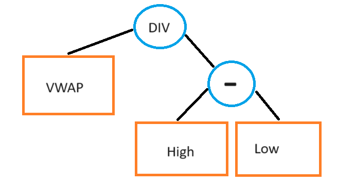

# Automating Alpha Pt.2 - Best Practices

Source HTML: [`html/2024-06-18-automating-alpha-pt2-best-practices.html`](../html/2024-06-18-automating-alpha-pt2-best-practices.html)

# Automating Alpha Pt.2 - Best Practices

| 항목 | 값 |
| --- | --- |
| 날짜 | 2024-06-18 |
| 접근 | 유료 |
| URL | https://www.algos.org/p/automating-alpha-pt2-best-practices |
| 부제 | Best Practices, Tips, and Tricks For Automating Alpha Discovery |

---

#### Introduction

In the previous article, we provided a very high level run-through for automated alpha generation. We’ll continue down the path of a Birds Eye view in this article, but the next will be much more code focused. It’s taken a fairly long while because of the heavy focus on code, so hence a later part of the series.

I think a bit of code is useful for getting people experimenting faster, which of course, is the only real way to grasp any of what I tell you to the fullest extent, but it’s hard to convey high-level ideas across code, such as mental frameworks for approaching the challenge itself.

#### Index

---

1. Introduction
2. Index
3. Input Data Normalization
4. Tuning of Selection Likelihoods
5. Known Strategies as Base Alphas
6. Too Many Inputs & Unrelated Data
7. Automated Alpha is Great For Bad Researchers
8. Breadth Beats Depth
9. Exponential Temporal Weighting
10. The Many Outweigh The Few
11. Wholistic Perspective

#### Input Data Normalization

---

It is important to ensure that our data has been properly normalized before we use it as input data for our genetic algorithm. This means that we should ensure that our data is homogenous and comparable. Raw price and financial data are not comparable. From high - low, this would mean that stocks with a larger price on average will have a much larger score. This adds additional noise to the process and makes it harder for us to work with.

We can choose to only work with returns, but this again limits us by preventing us from using perfectly acceptable formulas such as:

α=(high−low)close

This is fine because we are normalizing it to ensure that our prices do not scale with the overall value of close, which is something we, as the researcher know, is not a place to find any real alpha at all. Thus, we embed this rule to ensure that the algorithm knows it as well.

For financial data, we can adjust with the market capitalization, or simply the price if it is already on a per-share basis.

This leaves us with 4 options:

1. Unconstrained optimization, and we simply assume that alphas like high - low will evolve into a normalized version of themselves in the algorithm’s attempt to reduce noise.
2. Forcefully normalize everything, and use close-to-close returns (instead of close) or P/E ratio (instead of profits).
3. Use normalized-based alphas instead of the raw data. I.e. for High, we turn it into High/VWAP, where VWAP is our chosen normalization variable for all raw price-based input data sources. Under this model, all raw price inputs must be divided by VWAP as it is our normalization variable.

Option 3 is by far the best option here, where we set a default normalization source for every single type of raw data that we have. If we have the equation:

α=high−low

It then becomes:

α=highVWAP−lowVWAP=(high−low)VWAP

This is a great solution because the VWAP will eventually factor out if we introduce something like a divide by close to the equation:

α=(high−low)VWAPCloseVWAP=(high−low)Close

Normally, we would have to increase the height of the tree from 2 layers (bottom layer is high and low, top layer is subtract) to 3 layers:

When all we are really doing is normalizing the equation, and not attempting to add any complexity here. However, if we decided to deviate from the default standard normalization metric that all the raw price data inputs have to use (VWAP), and used Close to divide it instead, then we would end up with 3 layers:

Thus, when we are counting the height of the tree, we should ignore it if it meets the following criteria:

1. Division operation
2. Denominator is a default normalization variable
3. All numerators are in the raw input group associated with the denominator’s default normalization variable status

Thus, we can normalize our alphas without penalizing the search process for this normalization, without strictly forcing them into one choice for normalization if it decides it’s worth increasing the complexity.

#### Tuning of Selection Likelihoods

---

For any given operator, we will have some probability, and it does not necessarily need to be the same for each one of them. A very niche transform should not be given a high probability, the same with niche pieces of input data.

Price data is quite common to use, but a piece of alternative data like corporate lobbying spending is a much rarer piece of information.

Whilst this decreases the time we will spend in some search spaces, it is worthwhile because our goal here is to only explore the most valuable search spaces, and any possible place of finding profit (at a certain point the benefit to potentially finding an alpha gets wiped away by the cost of increased overfitting).

Certain input data sources also work very well with certain operators. An example of this is dollar volume and the log transform. Experienced researchers will have many of these combinations they know well and can take advantage of these.

#### Known Strategies as Base Alphas

---

Well-documented strategies such as cross-sectional momentum and trend-following strategies can be improved by using them as the base alphas. There are many papers detailing how incorporating signals like volume, sentiment, and volatility into the construction of momentum, reversal, and trend-following strategies drastically improves performance.

Thus, we can avoid searching in the dark, and instead build off what we already know has a fundamental reason for working (momentum) and then looking at how we can better isolate it.

Sentiment and volume make sense because they align with the idea that momentum comes from behavioural biases. If people have a strong sentiment towards the stock this could imply that the stock is trendy in people’s minds. That said, we would only want slow and steady sentiment. Otherwise, it could imply that the company has been in the news recently. This is why a high amount of frequency over social domains, regardless of sentiment, negatively correlates to the strength of momentum in practice because the price change is from news, not a behavioural bias. The same effect can be seen where you can get better momentum portfolios by conditioning on lower volume.

#### Improved Combinations

---

If we take something like the pct\_change in price, we may end up with a value like 0.05 for a 5% increase. The issue with this is that if we then match the log operator to it, we get the same value regardless of whether that is positive or negative 5%. We would have:

α=log(rt)

We know that log returns are useful, and a valuable inclusion, but we also know this is not how you calculate them. Instead, we should recognize that when we apply the log transform to returns, we want to get back “log returns” and in this case, we would do so by calculating as such:

α=log(1+rt)

We automatically replace log(r\_t) with log(1 + r\_t) to prevent wasting time.

#### Too Many Inputs & Unrelated Data

---

Oftentimes we will change the choice of data and operators as we focus on new timeframes. If we are looking at short-term returns, then it makes plenty of sense to use orderbook-based input data like the imbalance, but on the other hand, it wouldn’t make sense to use fundamental data for such a timeframe.

Too many input data sources, especially when the sources are from quite unrelated data categories, is one of the fastest ways to introduce noise and lower the effectiveness of the search algorithm. The best way to do it is to decide which data sources go well with everything (price, volume, etc), and then for every category (sentiment, fundamental, options data, etc), we run those searches individually where each search has the specific data category related to it + the sources that work well globally included.

In my own practical experience, there is very little alpha to be found from combining data sources from far apart categories into the same formula. There is a highly limited set of data categories that are worth combining with every other category (those generally applicable sources are mostly price / flow-based data). Sometimes there are exceptions but focus on the hypothesis behind why they work together before you go ahead and do it.

We do encounter the issue of certain features being highly correlated because we trained them each in their own separate batches by category when taking this approach, but it can easily be fixed by removing the weaker of highly correlated alphas.

#### Automated Alpha is Great For Bad Researchers

---

If you feel that your edge is in the data - and that the other parts are not your forte, then automating the alpha discovery process on that data is a very effective way to allow you to focus your time on what makes the money. Data is no use if you can’t extract alphas from it, but for firms where there is not any edge in their research ability, it’s easier, and oftentimes a better solution, to automate it away.

This requires that you produce edge still. The automated alpha search does not produce alpha, not unless you are good at building the search algorithm which is unlikely if you are already bad at researching them manually. It’s the concept of “What makes the money?”. Is it the trader’s intuition? Is it the access to proprietary data like foot traffic counts collected using hidden cameras? Is it the ability to analyze data better than others? If the answer to that is the data, then an automated search algorithm should extract that alpha smoothly.

Sure, “most public data has alpha in it”, but nobody makes money because they have sources like price data in front of them… they make money because they can find patterns in that data better than anyone else.

Automated alpha discovery will not make you able to find patterns better than anyone else. Therefore, unless you can build an alpha search system that is also better than the vast majority of other ones, it will not make money on well-mined data.

However, if your data is not well mined, you don’t need to analyze it better than everyone else, and automated alpha discovery becomes a great time saver for quants focused on other things.

#### Breadth Beats Depth

---

Another rule of thumb that will improve the performance of your trading strategies is to focus on breadth not depth. We want to find many different operators and input data sources to improve our performance. This is opposed to the option of increasing the complexity of our alphas.

There is still a limit to the amount of operators we can have, and the same goes for input data sources (as we discussed), but through tuning the system to avoid unlikely search spaces, and removing overlapping data sources when we know there are too many of them, we can mitigate this issue.

Frequently, researchers become tempted to try and increase the height limits of their trees in order to improve their performance, but this will not yield results.

Many, reasonably low-complexity alphas, from various data sources, and a wide range of operators is a much better solution.

That is not to say there is value in dumping as many possible transforms and sources together as possible - some are incredibly correlated and we only add noise by doing so. Every new data source of transform you add increases the level of noise in your search and the propensity for overfitting so it is wise to ensure that it is truly able to provide a greater benefit than this cost through its novelty.

#### Exponential Temporal Weighting

---

Exponential temporal weighting. Quite the string of buzzwords. I wasn’t really sure how to describe this one, but in the simplest of terms: “Alpha decays over time so why do we care about finding alpha that worked 20 years ago and doesn’t now”. Following this idea, our alpha’s correlation to forward returns should be weighted higher for the more recent samples.

In practice, we find it is only necessary to do this when we have quite a long lookback period, one long enough to extend into the durations where alphas can entirely decay.

#### The Many Outweigh The Few

---

A lot of people think about automated alpha generation as how to find the best possible strategy when really you need to consider the overall portfolio.

Often quants will be very happy with having found a seemingly low Sharpe effect 1-2 Sharpe perhaps, but with the saving grace that it is entirely orthogonal.

When you have many many low Sharpe strategies that are reasonably uncorrelated, you can easily combine them to create a very high Sharpe strategy overall.

From an initial perspective, you may think it’s easier to find a smaller group of high Sharpe alphas, but when that’s actually tested out of sample you’ll realise how bad the risk of overfitting destroys you.

It’s far far easier to generate many lower Sharpe alphas that are uncorrelated and combine into a high Sharpe portfolio. Thus, this is a much more recommended route.

It’s also a reason as to why I earlier recommended that people search for breadth in their data sources and operators instead of depth in the complexity of any individual alpha.

#### Wholistic Perspective

---

This is a mindset shift. Don’t think about individuals. Think about generating a portfolio of strategies. Think about how they all combine and see that whole as what you are truly generating.

Once you change to this mindset the results are far better because you consider how everything combines as one of the primary focuses.

Lack of correlation is perhaps one of the most important factors in determining the success of an automated alpha generation system.
