# Small Trader Alpha #6: Perpetual Arbitrage

Source HTML: [`html/2024-07-09-small-trader-alpha-6-perpetual-arbitrage.html`](../html/2024-07-09-small-trader-alpha-6-perpetual-arbitrage.html)

# Small Trader Alpha #6: Perpetual Arbitrage

| 항목 | 값 |
| --- | --- |
| 날짜 | 2024-07-09 |
| 접근 | 유료 |
| URL | https://www.algos.org/p/small-trader-alpha-6-perpetual-arbitrage |
| 부제 | Arbitrage between perpetuals and a deep dive into the world of global lead-lag |

---

### Introduction

---

The most liquid way to trade in digital assets is through the perpetual markets. However, they’re not precisely the same instrument, even if they have the same ticker, so this adds quite a bit of complexity to the equation.

We’ll tease some PNL - this is one coin only, between 2 exchanges, and top-of-book. The shape is the part to focus on; the scaling part is trivial.

[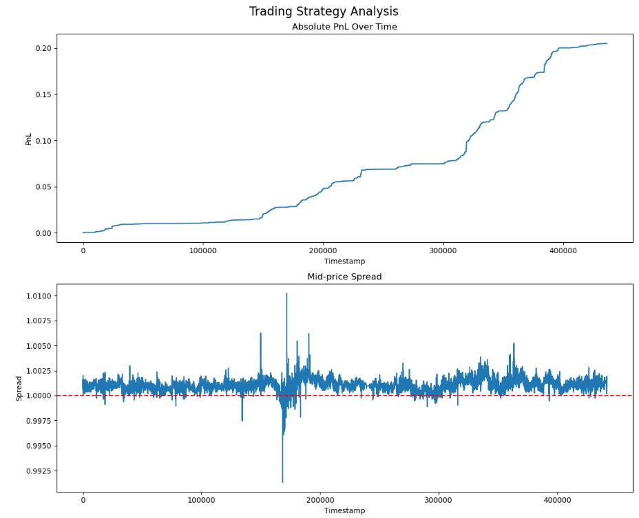](images/c14996b6574f.png)

### Index

---

1. Introduction
2. Index
3. Part 1: Basics

   1. Overview of Perpetual Arbitrage
   2. Stable-coin basis
   3. Normalisation of contracts
   4. Entry / Exit Timing
4. Part 2: Implementation

   1. Data Scraping
   2. Pre-Processing
   3. Checking For Opportunities
   4. Taker Backtest
5. Part 3: Advanced Trading

   1. Maker / Taker Execution
   2. Volume & Lead-Lag
   3. Latency & Message Ordering
   4. Mean Estimate Free Reversion
   5. Global Lead Lag
6. Conclusion
7. Further Reading

### Part 1: Basics

---

To start, it’s worth mapping out the trade and how to achieve a simplified version of it. These don’t work so well in the modern market, although they did previously, but that’s why we have the advanced trading section - to get readers up to speed on the state of the art.

#### Overview of Perpetual Arbitrage

---

Like most of the trades we’ve covered, perpetual arbitrage has a statistical element to it. In fact, it’s not even technically a pure arbitrage and is counted as a statistical arbitrage - although it relies on mechanical forces which pull assets back together (unlike a purely statistical trade).

We are effectively betting on the convergence of two perpetual contracts, likely cross-exchange.

It mimics pairs trading in the regard that we have some entry threshold for the spread and an exit thread (usually the mean), and similarly we use methods from pairs trading to time this spread.

In the below sketch, we can see the cross exchange prices of 2 Solana perpetuals on different exchanges:

[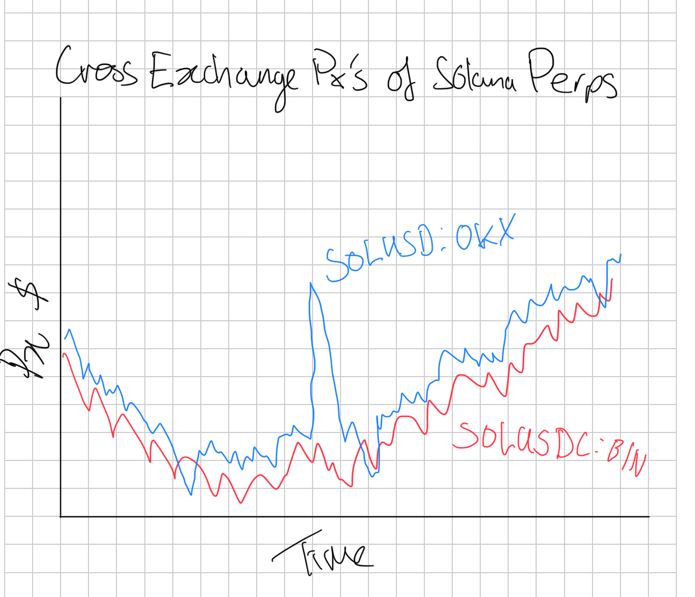](images/0002edeb2939.jpeg)

Three things that are important to notice:

1. Our perpetuals use different quoting assets (USD v.s. USDC)
2. The OKX perpetual trades consistently higher than the Binance perpetual
3. They are strongly tied to one another

Our first and second observations both tie into each other. The consistency in the price difference can be any of 3 causes:

1. Stablecoin differences (USDC / USD)
2. Structural differences
3. Contract differences

With stablecoin driven differences we can easily adjust by tracking the prices of different stablecoins and with contract differences we can investigate how different the contracts between two exchanges are manually (we will explore contract normalization as a topic soon).

Finally, our differences may be entirely structural and related to the specific flows that occur on each platform. Whilst theories as to why may vary, it’s no secret that certain exchanges simply trade higher relative to others. Likely because of how their indexes are constructed.

There’s also differences in their basis volatility due to how the indexes are constructed. A good proxy for this is the closeness to a total share of total market volume that the index covers. An index made of Bybit, Okex, and Binance will be very stable, but if it’s driven entirely by an exchange’s own spot market, especially a smaller exchange

When we divide the two assets by another, we get the spread ratio. This is useful for timing as it’s a lot more normalized between assets, but is not directly trade-able:

[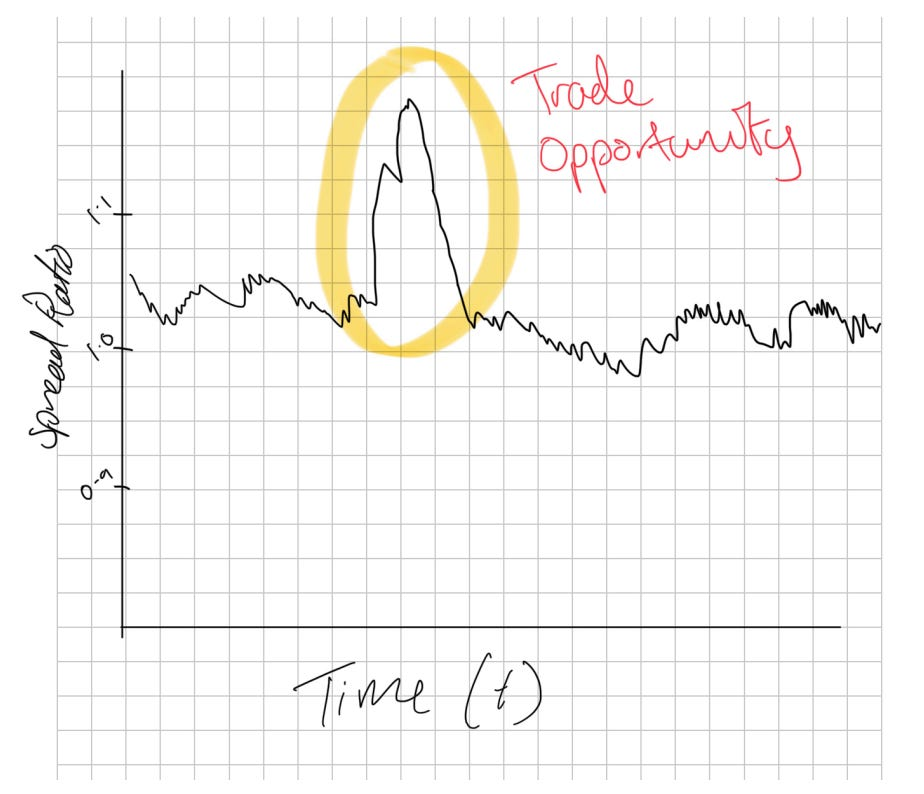](images/f3a0d4ccbafd.png)

What we can actually trade is the difference - where we subtract the price of one asset from another.

#### Stablecoin Basis

---

As we touched on earlier, the first step to normalizing our spreads is to account for Stablecoin basis. The price of stablecoins, much like the perpetuals, varies by exchange so we need to normalize based on this. If the exchange has the stablecoin market pair listed, then it’ll be best to use this.

In the event of a depegging, we will want to switch off the system so it’s critical that the system has an edge scenario for this. Otherwise we may end up betting on the depeg due to large discrepancies in stablecoin prices cross exchange. This is not because the depeg will cause the prices to be different, since we would of course have adjusted for this, but because during a depeg the prices vary drastically.

We can look at Coinbase which got as low as 93c on the dollar when USDC depegged whereas other exchanges only depegged a few cents. KuCoin also depegged a lot more than others. Hence, unless we adjusted for the exchange-specific prices of stablecoins, instead of trying to apply some global price, we would’ve seen a basis between perpetuals that was a bet on USDC. Even if we did manage to adjust well, there’s a good chance we would’ve still needed to monitor the system because of the significant variance introduced by the stablecoin basis.

It’s also worth remembering that some exchanges will write -USD on the ticker symbolism, but when you read the documentation, they’re marking it against USDC or USDT. There may also be USDC, USDT, and USD perpetuals for the same asset on a given exchange, and you can **usually** use the ratio between these to get an idea of the exchange-specific rate for stablecoins (if one is not present). You can only use this proxy if the contracts settle the same way and have the same funding payment specifications. They don’t always, sometimes the USD ones are coin margined, and I’ve seen coin margined have different funding intervals to stablecoin margined perpetuals before.

#### Normalization of Contracts

---

Converting perpetual prices from one venue, like Binance, to another, such as Bybit, Okx, or Hyperliquid, is complex.

Using Binance's perpetual prices directly is not optimal, especially for platforms with shorter perpetual durations, like hourly ones on DEXs. This is because perpetual prices tend to converge towards the spot price in a pattern that resembles descending stairs until a funding payment occurs, which then causes a jump. We don’t want to make trades that get us into a bad position on funding payments.

An alternative approach of relying solely on spot prices is also flawed. It may lead to imbalanced positions, favouring underperforming coins while shorting the surging ones. A potential solution is to "clean" the perpetual prices from a platform like Binance by accounting for accrued but unpaid funding payments, adjusting for rate differences, and then subtracting the accrued coupon for the specific platform you're converting to.

This method is only moderately effective due to various challenges:

1. Different indices used across platforms can lead to discrepancies, especially during volatile market conditions.
2. There are limits on how high funding payments can go, which vary by exchange.
3. Funding rates change frequently, affecting the conversion due to the non-linear nature of common funding formulas.
4. Practical implementation issues, such as determining accrued funding payments and adjusting for rate differences, considering the intricacies of funding rate formulas.

The closest approach to a practical solution involves taking Binance's perpetual prices, adjusting for accrued funding payments and rate differences, and then recalculating the funding payments.

However, there's no one-size-fits-all formula for this, and you’ll turn off specific exchange pairs or increase their entry thresholds in your system to try to counter this.

An effective strategy involves analyzing data to understand how funding payments evolve relative to premiums and devising cross-venue adjustments based on empirical evidence.

This should include models for predicting how spot prices will converge across different venues. These are mostly driven by relative volumes on each exchange.

We want to remember the notion of confidence throughout. If we deem two perps to be very similar, we can give a higher confidence to it and then size up on a divergence to a greater extent. How that score is developed is up to you as the reader, but generally, it should include components like interval, index price formula, funding limits, and accrual formula.

In any of these trades, the funding rate can play a significant role in divergence if contracts are misaligned. Thus, we should take these into account for our final live version.

#### Entry / Exit Timing

---

Timing our entries and exits for most firms is a simple moving average or perhaps even an exponentially weighted moving average with a set lookback period. This look-back period can be equated between the parameters for an SMA and an EMA using the formula below:

In addition to this, we have a parameter, typically with a value of 2 to set the number of standard deviations from this threshold that we will enter into a trade, with the baseline assumption being that we exit when the price reaches the mean.

We do not have to exit when price reaches the mean and can instead exit earlier.

[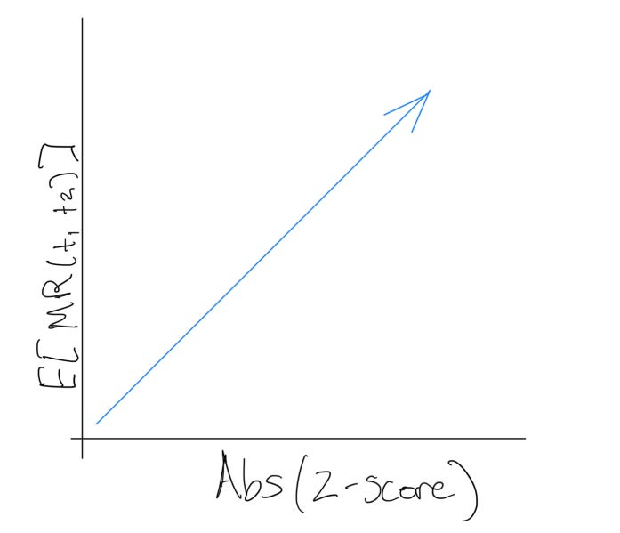](images/5ec33fc62651.png)

As we can see in the above diagram, the expected mean reversion between t1 and t2, written as E[MR(t1, t2)] in our diagram, is proportional to the absolute z-score of the spread. The expected mean reversion roughly says how much we expect the absolute z-score to decrease by (towards 0) between two different time steps. I’ve drawn the relationship as linear, but it could be exponential or plateau out at a higher score - maybe even going negative (likely due to liquidation-based momentum / caps on funding rates that you’d see these effects); we’d need to look empirically to see the true relationship, but the general idea stands for now.

The issue is that the volatility of our spread can roughly be assumed to be constant; if anything, it is proportional to the absolute z-score, but let’s call it a constant because it’s an acceptable assumption for the explainer. The expected mean reversion is our edge, so we have a ratio between our edge and the volatility. As we see more of a reversion, the edge shrinks, but our volatility stays the same. So, we get a worse risk-reward ratio as the spread reverts. When we add in the risk of mean estimation errors (differences in moving average parameters can lead to different results), it starts to become questionable whether we should hold entirely to the mean or exit slightly before.

Thus, we may have a 3rd parameter, our exit z-score.

It is worth noting that these trades compete aggressively on the ability to beat fees/costs of trading. We could end up tying up capital for ages… sure, but we also could end up giving away a couple extra bps that mean the world to us when we’re only working with a few bps after transaction costs in all likelihood. I write this all down so that traders can make their own decisions and so that you know what the experiments are that need to be conducted - not so I can spoon-feed the alpha step by step. No one will do that for you.

### Part 2 - Implementation

---

This section implements a backtest for a basic taker version of the strategy. We will explore a few different days of interest and go from data scraping all the way to our PNL plot.

For me, at least, the pipeline looks exactly like this every time:

1. Data Scraping
2. Data Pre-Processing
3. Analysis
4. Analysis Cont. [Optional]
5. Expanded Analysis [Optional]

In this case, I expect the analysis to be a basic opportunity test, and then, from there, the analysis will develop a backtest. Then, finally, we would do an expanded analysis, which would include additional factors. Those additional factors would likely be latency or trading costs, which we vary to see their impact.

Each of these five steps represents an .ipynb notebook. The alternative for me would be to open a .py file and start building tooling if I am expecting this analysis to be more than just research (other researchers need to validate my findings too, if it’s going to take up lots of implementation resources like this strategy would since lots of the alpha is on latency)

#### Data Scraping

---

We’ll be using [Tardis](https://tardis.dev/) as our data source today since our analysis is historical, but because of the nature of this strategy, you can always open up Rust, subscribe to the WebSocket feeds of all the exchanges you want, start scanning, and log those opportunities to a dataset. You can also use this to scrape your own dataset.

To start, we import our libraries:

```
# Import Libraries

import aiohttp
import asyncio
import requests
import nest_asyncio
import json
from urllib import parse
from tardis_dev import datasets
from tqdm import tqdm
```

Half of these are my ‘default imports’ because the cost of importing is very low, and I typically copy-paste the imports block from another notebook, so realistically, there is no cost to importing libraries I expect to be using. Technically speaking, we can get away with just these:

```
# Import Libraries

import nest_asyncio
import json
from tardis_dev import datasets

# and maybe, but you can edit the code to remove this
import tqdm
```

We are using Python from an IPython environment (Jupyter), so we need nest\_asyncio, JSON will be used to open the JSON file with my Tardis API key, and tardis\_dev is of course, the Tardis library for downloading.

TQDM is a helpful library that makes the loops a lot easier to track the progress of. It's pretty helpful when you have hours-long downloads.

We could end up using requests if we were fetching symbols from the exchange using:

```
exchange_name = 'binance-futures'
r = requests.get("https://api.tardis.dev/v1/exchanges/{exchange_name}).json()
results = r.json()
```

Before we do that, let’s define out exchanges, and ticker formats. If we use the requests approach to tickers we don’t need to define ticker formats:

```
# list[(exchange-name, exchange-ticker-format)]

exchange_list = [
    ["okex-swap", "-USDT-SWAP"],
    ["bybit", "USDT"],
    ["dydx", "-USD"],
    ["gate-io-futures", "_USDT"],
    ["binance-futures", "USDT"],
]
```

For tickers, I wanted to filter by market capitalization, and I already have a hardcoded list, so we’ll use these:

```
base_assets = [
    'CORE', 'BAT', 'MAGIC', 'LDO', 'API3', 'CHZ', 'CVC', 'FITFI',
    'LOOKS', 'SWEAT', 'GMX', 'WAVES', 'LINK', 'BTC', 'AVAX', 'CELO', 'ETC',
    'SAND', 'SOL', 'MASK', 'APT', 'KLAY', 'BAND', 'GRT', 'DOGE', 'FIL',
    'KSM', 'FTM', 'DYDX', 'BICO', 'GALA', 'NEO', 'IMX', 'AAVE', 'OP', 'EGLD',
    'LRC', 'YGG', 'ATOM', 'ONT', 'ETHW', 'SNX', 'MINA', 'QTUM', 'CRV', 'LPT',
    'COMP', 'MANA', 'GMT', 'BCH', 'TRB', 'MATIC', 'ZIL', 'ZEN', 'OMG', 'AXS',
    'ETH', 'DOT', 'REN', 'ANT', '1INCH', 'SLP', 'JST', 'EOS', 'SUSHI', 'APE',
    'PEOPLE', 'XMR',
]
```

Now, let’s define our lookback date, data types, and open our Tardis key:

```
# Define parameters for data to be scraped

dtypes_list = ["quotes", "trades", "book_snapshot_25"]
start_date = "2024-01-01"
end_date = "2024-01-02"
tardis_api_key = json.loads(json.load(open("secrets.json")))['tardis_key']
```

Time to scrape our data. Here is my big chunk of code I usually copy and paste about:

```
nest_asyncio.apply()

print_exceptions = True # Some will print errors, but worth checking first run that they're all ticker not found errors

# Loop through available exchanges
for exchange_name, exchange_suffix in exchange_list:
    # Loop through base tickers
    for symbol_prefix in tqdm(base_assets):
        for current_data_type in dtypes_list:
            # Normalizing Ticker Names Based On Exchange
            current_symbol = symbol_prefix + exchange_suffix

            # Some tickers will not be available so are caught with an error
            try:
                datasets.download(
                    exchange=exchange_name,
                    data_types=[
                        current_data_type
                    ],
                    from_date=start_date,
                    to_date=end_date,
                    symbols=[
                        current_symbol
                    ],
                    download_dir=f"D:/Market_Data/Digital_Assets/Tardis_Data/{exchange_name}/Futures/{current_symbol}/{current_data_type}",
                    api_key=tardis_api_key,
                )
            except Exception as e:
                if print_exceptions:
                    print(f"Error occurred: {e}")
```

My download\_dir is specifically set up based on the data structure of my research data on my laptop. You may ask, why not do it all at once with multiple data types and multiple symbols? Well, that's because it has a fit if you give it too much data to download at once so I prefer to do it in smaller chunks, but it is really up to you to experiment with a bit more concurrency in your downloads.

[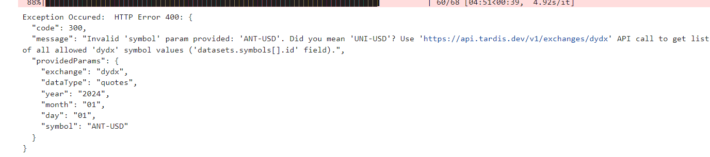](images/5d4426477a72.png)

Don’t worry if you get a ton of these. It just means that the symbol isn’t on that exchange. Remember, all we need is for the symbol to be on at minimum 2 exchanges. It doesn’t need to be on them all.

You may also want to increase the date range we pull for. I made mine short to save time, but I’ve used whole years for this kind of analysis in the past. I usually recommend doing a day and then going straight into writing the backtest code. Then, you can re-run the data scraper to scrape more data. This prevents you from sitting at the desk reading a book/paper/whatever you do in this time because you can claim the data is scraping.

#### Data Pre-Processing

---

Our data is normalized already because of the Tardis formatting, but it’s also GZ compressed and has a load of useless columns. Here’s how we merge multiple exchanges into a format we can use for analysis:

```
import pandas as pd
import warnings
import os
from tqdm import tqdm

warnings.filterwarnings("ignore")

# Constants
BASE_DATA_DIR = r"D:/Market_Data/Digital_Assets/Tardis_Data/"
MERGED_DATA_BASE_FOLDER = r"D:/MergedData/MergedTradeQuotes/"

exchange_list = [
    ["okex-swap", "-USDT-SWAP"],
    ["bybit", "USDT"],
    ["dydx", "-USD"],
    ["gate-io-futures", "_USDT"],
    ["binance-futures", "USDT"],
]

def get_folder_names(path):
    return [f for f in os.listdir(path) if os.path.isdir(os.path.join(path, f))]

def isolate_base_asset(exchange_ticker: str, exchange_name: str) -> str:
    append_str = next((append for exch, append in exchange_list if exch == exchange_name), "")
    if not append_str:
        raise ValueError(f"Unknown exchange: {exchange_name}")
    if append_str.startswith(("-", "_")):
        base_asset = exchange_ticker.rsplit(append_str, 1)[0]
    else:
        base_asset = exchange_ticker.rstrip(append_str)
    return base_asset

def create_exchange_ticker(base_asset: str, exchange_name: str) -> str:
    append_str = next((append for exch, append in exchange_list if exch == exchange_name), None)
    if append_str is None:
        raise ValueError(f"Unknown exchange: {exchange_name}")
    if append_str.startswith(("-", "_")):
        full_ticker = f"{base_asset}{append_str}"
    else:
        full_ticker = f"{base_asset}{append_str}"
    return full_ticker

def get_valid_symbols(exchanges, threshold=2):
    all_symbols = {}
    for exchange in exchanges:
        symbol_folder = os.path.join(BASE_DATA_DIR, exchange, "Futures")
        symbols = os.listdir(symbol_folder)
        normalized_symbols = [isolate_base_asset(symbol, exchange) for symbol in symbols]
        all_symbols[exchange] = set(normalized_symbols)

    # Find common symbols across all exchanges
    common_symbols = set.union(*all_symbols.values())
    valid_symbols = [symbol for symbol in common_symbols 
                     if sum(symbol in exchange_symbols for exchange_symbols in all_symbols.values()) >= threshold]

    return valid_symbols

def create_folder_structure(tickers):
    for ticker in tickers:
        os.makedirs(f"{MERGED_DATA_BASE_FOLDER}{ticker}/merged_taq", exist_ok=True)
        os.makedirs(f"{MERGED_DATA_BASE_FOLDER}{ticker}/merged_quotes", exist_ok=True)

def create_exchange_ticker(base_asset: str, exchange_name: str) -> str:
    append_str = next((append for exch, append in exchange_list if exch == exchange_name), None)
    if append_str is None:
        raise ValueError(f"Unknown exchange: {exchange_name}")
    return f"{base_asset}{append_str}"

def get_common_dates(base_asset, exchanges):
    common_dates = None
    for exchange in exchanges:
        ticker = create_exchange_ticker(base_asset, exchange)
        quotes_folder = os.path.join(BASE_DATA_DIR, exchange, "Futures", ticker, "quotes")
        trades_folder = os.path.join(BASE_DATA_DIR, exchange, "Futures", ticker, "trades")

        quotes_files = os.listdir(quotes_folder)
        trades_files = os.listdir(trades_folder)

        quote_dates = set(x.split("_")[2] for x in quotes_files)
        trade_dates = set(x.split("_")[2] for x in trades_files)

        exchange_dates = quote_dates & trade_dates

        if common_dates is None:
            common_dates = exchange_dates
        else:
            common_dates &= exchange_dates

    return list(common_dates)

def process_quotes(base_asset, exchanges, selected_date):
    all_data = []

    for exchange in exchanges:
        ticker = create_exchange_ticker(base_asset, exchange)
        quotes_folder = os.path.join(BASE_DATA_DIR, exchange, "Futures", ticker, "quotes")        
        quotes_path = f"{quotes_folder}/{exchange}_quotes_{selected_date}_{ticker}.csv.gz"

        try:
            df = pd.read_csv(quotes_path, compression='gzip')  
            df['timestamp'] = pd.to_datetime(df['timestamp'], unit='us')      
            df = df.sort_values(by='timestamp')
            df['mid_price'] = (df['ask_price'] + df['bid_price']) / 2.0            
            columns_to_keep = ['timestamp', 'ask_price', 'bid_price', 'bid_amount', 'ask_amount']
            df = df[columns_to_keep]
            df.columns = [f'{exchange}_{col}' if col != 'timestamp' else col for col in df.columns]
            all_data.append(df)

        except Exception as e:
            print(f"Error processing {exchange} data for {base_asset} on {selected_date}: {e}")

    if not all_data:
        print(f"No data processed for {base_asset} on {selected_date}")
        return

    merged_df = all_data[0]
    for df in all_data[1:]:
        merged_df = pd.merge_asof(merged_df, df, on='timestamp', direction='nearest')
    merged_df.sort_values('timestamp', inplace=True)
    output_path = f"{MERGED_DATA_BASE_FOLDER}{base_asset}/merged_quotes/{base_asset}_{selected_date}_merged-quotes.parquet"
    merged_df.to_parquet(output_path, index=False)

def process_data(base_asset, exchange, selected_date):
    all_data = []

    ticker = create_exchange_ticker(base_asset, exchange)
    quotes_folder = os.path.join(BASE_DATA_DIR, exchange, "Futures", ticker, "quotes")
    trades_folder = os.path.join(BASE_DATA_DIR, exchange, "Futures", ticker, "trades")

    quotes_path = f"{quotes_folder}/{exchange}_quotes_{selected_date}_{ticker}.csv.gz"
    trades_path = f"{trades_folder}/{exchange}_trades_{selected_date}_{ticker}.csv.gz"

    try:
        df_quotes = pd.read_csv(quotes_path, compression='gzip')
        df_trades = pd.read_csv(trades_path, compression='gzip')

        df_quotes['timestamp'] = pd.to_datetime(df_quotes['timestamp'], unit='us')
        df_trades['timestamp'] = pd.to_datetime(df_trades['timestamp'], unit='us')

        df_quotes = df_quotes.sort_values(by='timestamp')
        df_trades = df_trades.sort_values(by='timestamp')

        # Merge trades and quotes
        df = pd.merge_asof(df_trades, df_quotes, on='timestamp', direction='forward', 
                           suffixes=('_trade', '_quote'))

        df = df.sort_values(by='timestamp')

        # Calculate mid price and is_buy
        df['mid_price'] = (df['ask_price'] + df['bid_price']) / 2.0
        df['is_buy'] = df['side'].map({'buy': True, 'sell': False})

        # Select and rename columns
        columns_to_keep = ['timestamp', 'price', 'amount', 'mid_price', 'is_buy', 'ask_price', 'bid_price', 'bid_amount', 'ask_amount']
        df = df[columns_to_keep]
        df.columns = [f'{col}' if col != 'timestamp' else col for col in df.columns]

        all_data.append(df)

    except Exception as e:
        print(f"Error processing {exchange} data for {base_asset} on {selected_date}: {e}")

    if not all_data:
        print(f"No data processed for {base_asset} on {selected_date}")
        return

    # Merge all exchanges data
    merged_df = all_data[0]
    for df in all_data[1:]:
        merged_df = pd.merge_asof(merged_df, df, on='timestamp', direction='nearest')

    # Sort by timestamp
    merged_df.sort_values('timestamp', inplace=True)

    output_path = f"{MERGED_DATA_BASE_FOLDER}{base_asset}/merged_taq/{exchange}_{base_asset}_{selected_date}_merged-taq.parquet"
    merged_df.to_parquet(output_path, index=False)

def merge_exchanges_quotes(exchanges, threshold=2):
    valid_tickers = get_valid_symbols(exchanges, threshold)
    create_folder_structure(valid_tickers)
    for base_asset in valid_tickers:
        common_dates = get_common_dates(base_asset, exchanges)

        for selected_date in tqdm(common_dates, desc=f"Processing {base_asset}"):
            try:
                process_quotes(base_asset, exchanges, selected_date)
            except Exception as e:
                print(f"Error occurred processing the data: {e}")

def merge_exchange_taq(exchange, threshold=1):
    valid_tickers = get_valid_symbols([exchange], threshold)
    create_folder_structure(valid_tickers)
    for base_asset in valid_tickers:
        try:
            common_dates = get_common_dates(base_asset, [exchange])
            for selected_date in tqdm(common_dates, desc=f"Processing {base_asset}"):
                try:
                    process_data(base_asset, exchange, selected_date)
                except Exception as e:
                    print(f"Error occurred processing the data: {e}")
        except:
            print(f"Skipping {base_asset}")
```

[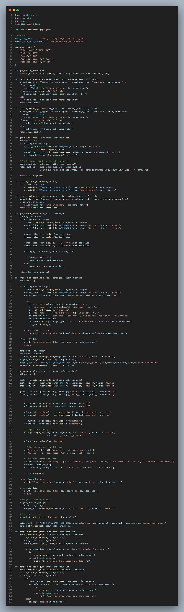](images/420dc40d8666.png)

If we run the code like this:

```
exchanges_to_merge = ['bybit', 'okex-swap']
merge_exchanges_quotes(exchanges_to_merge)
[merge_exchange_taq(exchange) for exchange in exchanges_to_merge]
```

Then, we should end up with an output that looks like the below:

[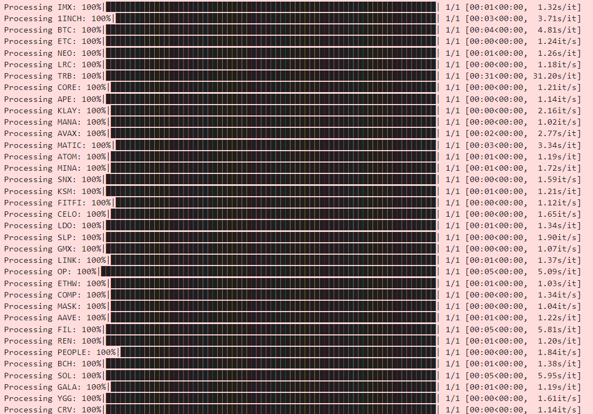](images/1fb31b13c5ff.png)

We have two functions here. One merges TAQ (Trades & Quotes) on a per-exchange basis, and another merges quotes cross-exchange. We will use the TAQ data for the limit order optimization analysis and the quote data for the initial opportunity exploration + backtest.

Our data appears to be processed (although our data selection is limited):

[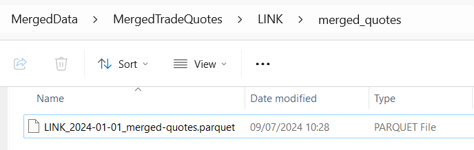](images/6b9a70a89ae7.png)

[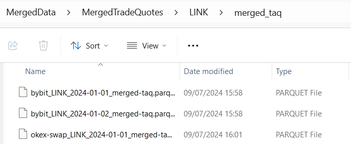](images/57f9fdf4d8c1.png)

(Ignore the extra day I added; I scraped that after for the backtest).

A quick test in our notebook reveals this has worked properly:

[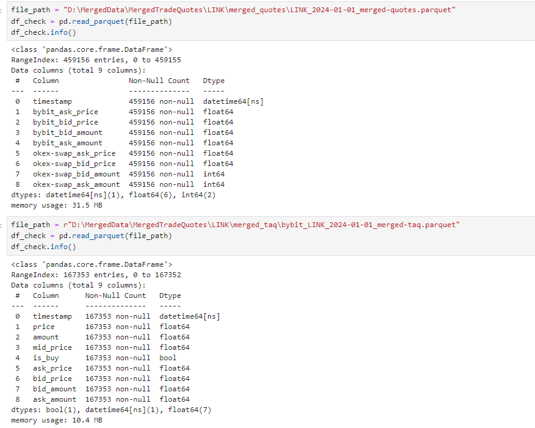](images/142dcd228f6b.png)

This is all satisfactory, and on further inspection the data looks well formatted:

[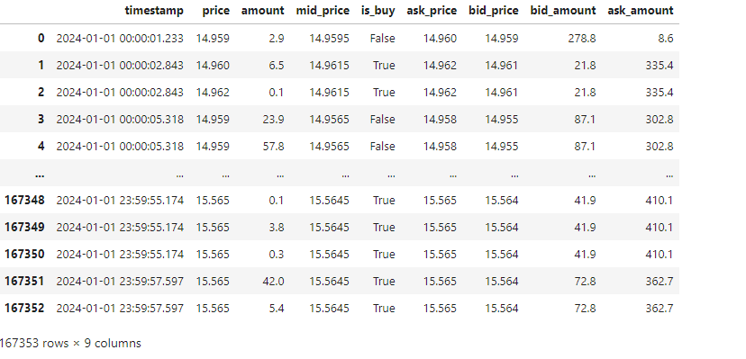](images/b2cf0b317823.png)

If you want to open multiple of them at once, then you can use this snippet to aggregate them by date range:

```
import os
import pandas as pd
from datetime import datetime as dt

def load_parquet_files_in_date_range(folder_path: str, start_date: str, end_date: str) -> pd.DataFrame:
    start_date = dt.strptime(start_date, '%Y-%m-%d')
    end_date = dt.strptime(end_date, '%Y-%m-%d')
    dataframes = []
    for file_name in os.listdir(folder_path):
        if file_name.endswith('.parquet'):
            file_date_str = file_name.split('_')[1]
            file_date = dt.strptime(file_date_str, '%Y-%m-%d')
            if start_date <= file_date <= end_date:
                file_path = os.path.join(folder_path, file_name)
                df = pd.read_parquet(file_path)
                dataframes.append(df)
    if dataframes:
        combined_df = pd.concat(dataframes).sort_index()
        return combined_df
    else:
        return pd.DataFrame()
```

os and pandas should be imported already, so you only need to import datetime.

Let’s wrap up by talking about how the code works:

We have decided to use quote data as our events, but typically, we would have quotes and trades simultaneously and then fill forward only the quote values. We would loop through it by saying if the trade column of our choice is NaN, then it’s a quote update, and if it’s not NaN, then it’s a trade update.

We’re allowed to fill forward quote values but not trade values. Once we get a quote message, we can assume that the quote is valid until the following quote is given. There are some very low latency issues here when you start to care about the sub-100ms, and especially the sub-30ms frequencies of data. Even orderbook events will be aggregated (roughly 30ms updates on Binance real-time updates). As long as you assume some decently sized latency between your deciding to make a trade and you actually simulating your fill, you should be fine.

For context, we include trades in our data because trade data is very useful for lead-lag analysis, which we will discuss later (volume plays a prominent role and at a very trade-focused level). Still, we won’t be implementing this, so I didn’t feel there was a need. We do still need trade data, but not all the trades for all exchanges at once since we estimate limit fill probabilities on a per-exchange basis.

#### Checking For Opportunities

---

Let’s start by looking at a single asset and scanning for arbitrages between 2 exchanges. It’s the best way to check that something is there. We’ll re-use LINK, which we used to test earlier whether our data was correct.

Quick import:

```
import pandas as pd

import matplotlib.pyplot as plt
import seaborn as sns
```
