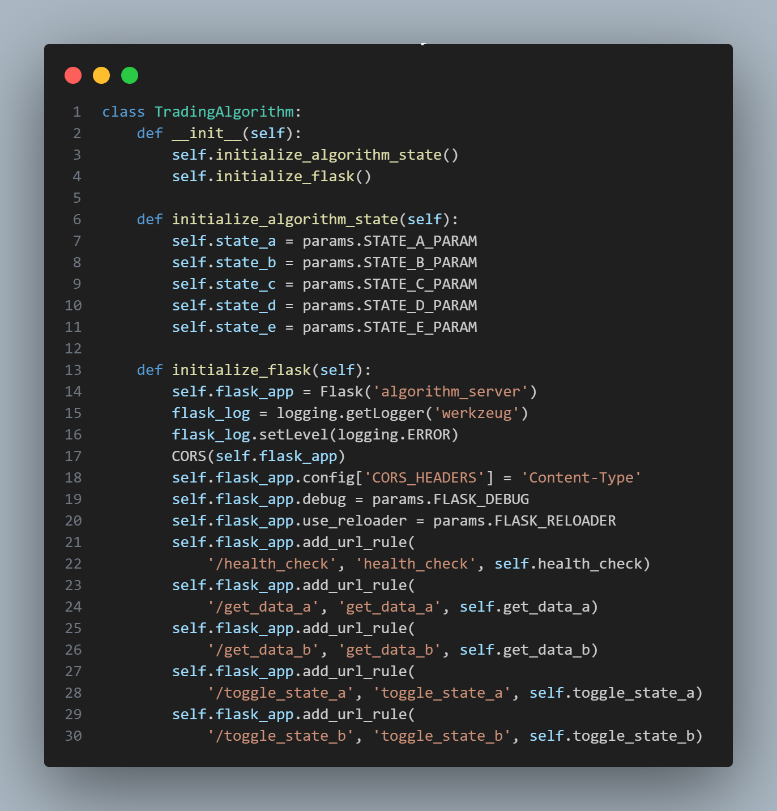
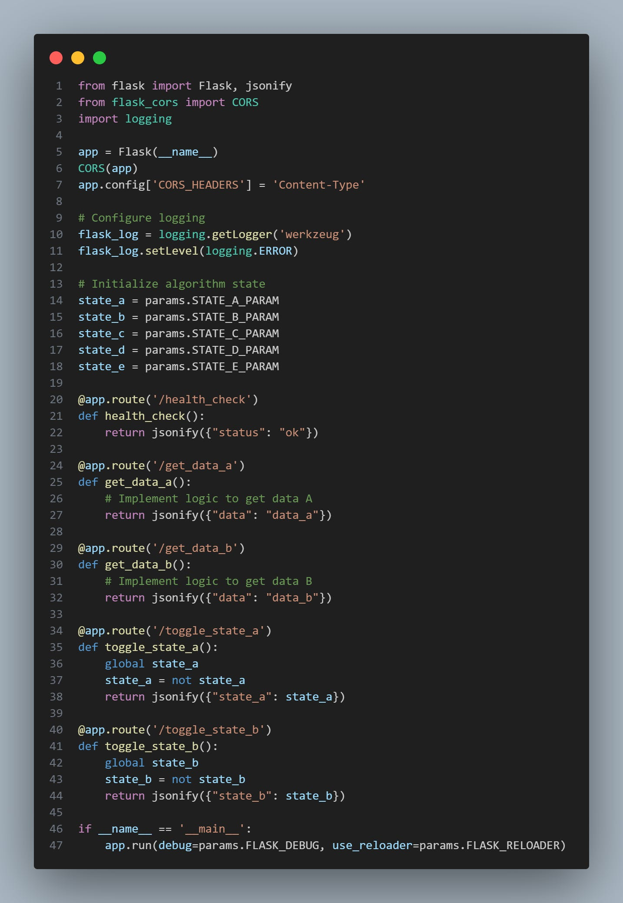
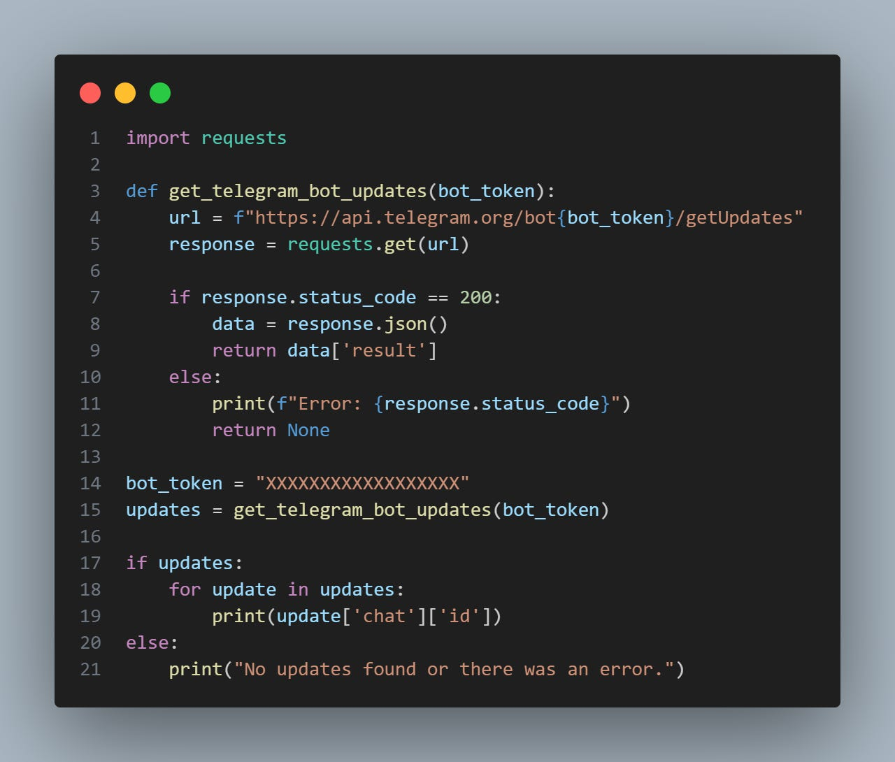
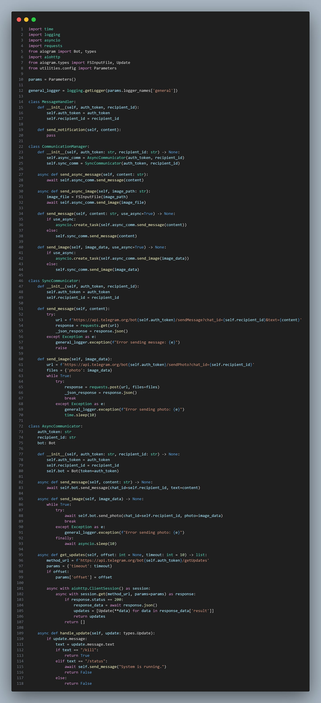

# Deploying Strategies - Helpful Advice

Source HTML: [`html/2024-07-18-deploying-strategies-helpful-advice.html`](../html/2024-07-18-deploying-strategies-helpful-advice.html)

# Deploying Strategies - Helpful Advice

| 항목 | 값 |
| --- | --- |
| 날짜 | 2024-07-18 |
| 접근 | 무료 |
| URL | https://www.algos.org/p/deploying-strategies-helpful-advice |
| 부제 | An assortment of helpful advice, tips, and tricks to pass on to you! |

---

#### Introduction

---

As with most things in quantitative trading, you eventually build habits and learn about valuable tricks whilst working in the field. It is those habits that then lead to you being able to be more efficient, make less mistakes, and generally be better at the work you do.

I always love it as a result, when a colleague, friend, or someone I’ve met through Twitter passes on a helpful trick for how they do a task I’m working on that then saves me a lot of time. Maybe some of these ideas are not new to you, but I hope that you’ll walk away with at least one or two things to try on on your next trading algorithm.

The Quant Stack is a reader-supported publication. To receive new posts and support my work, consider becoming a free or paid subscriber.

#### SageMaker

---

I often find that when I need to deploy a very simple task and want to set it up in as minimal time as possible, using AWS SageMaker is an effective way to get things done. It’s straightforward to debug when you write it in Jupyter, and it’s not very hard to deploy, either.

I have often had a SageMaker instance and run notebooks on it that do data scraping work regularly. This is an admittedly terrible solution for anything long-term, but it’s a time-saving trick for simple data scraping tasks.

I've seen million-dollar strategies run from Jupyter notebooks, excel, R, MATLAB -- all sorts. Whatever gets you to production is best...

#### QuantConnect

---

QuantConnect is worth learning for a couple of reasons. Firstly, you can generate great backtest reports and know that it’s gone and simulated accurate fill data behind the scenes, as well as realistic trading costs. It does have some issues related to the quality of its crypto data, but for longer-term strategies, I find it conservative in its estimates and does a great job.

It’s not useful for anything that isn’t simple, but the primary benefit QuantConnect offers is that the code is robust and comes with all the fancy extras that are a pain to code. You have notifications, accounting, backtesting using the same logic as production, and analytics—all while not having to worry about the data feed breaking.

It’s cheap, simple, and a great solution any time you want to run a basic momentum, seasonality, etc, type strategy in any market of your choice.

The downside is that it doesn’t handle complex strategies well, and the data quality isn’t there for medium to high-frequency testing.

If you work with hourly and above bars and have a relatively simple logic (i.e. pairs trading, momentum, seasonality, mean-reversion, lead-lag, …) then I really suggest taking a look at this.

They also have a shockingly large amount of alternative data for a meagre cost. I haven’t toyed with this, but it is certainly a cheap way to do so for those interested.

#### Nohup

---

This is a particular and annoying issue with Python scripts in EC2 where if you run it as:

```
python3 main.py
```

When the SSH disconnects, it often turns off your scripts, and this is really a pain to diagnose. Memory overflow issues are equally a nightmare to diagnose, but they are not common at all—although they don’t come with an easy fix.

```
nohup python3 main.py
```

Just make sure to add “nohup” to the start of the command, and then there won’t be a signal sent to kill it on SSH disconnect. I’m sure this is quite common knowledge, but it’s worth knowing if you don’t already know it.

#### Screen

---

Do you hate losing the ability to see the CLI output, and now you have to open up logs? Maybe you had a TUI open. Or is there any reason you need persistent access to the script even after SSH disconnect?

Use this easy command to make a new screen:

```
screen -S <name_of_screen>
```

Then go in and run your scripts, and when you disconnect, you can SSH back in and run:

```
screen -R <name_of_screen>
```

You’ll be back to the CLI output, and if you press ctrl-C, the script will stop as if it had been open the whole time.

#### Flask Servers

---

I’m not sure this is much of a trick it’s more of me saying my default way of doing things — which is still information that is likely valuable as it’s my local minimum I’ve reached through experimentation. Anyways, when it comes to trading algorithms - you often want the ability to control them. I find the simplest way to do this is with either of these 2 Flask based approaches:

[](images/d6cc14fd6ca1.png)

```
class TradingAlgorithm:
    def __init__(self):
        self.initialize_algorithm_state()
        self.initialize_flask()

    def initialize_algorithm_state(self):
        self.state_a = params.STATE_A_PARAM
        self.state_b = params.STATE_B_PARAM
        self.state_c = params.STATE_C_PARAM
        self.state_d = params.STATE_D_PARAM
        self.state_e = params.STATE_E_PARAM

    def initialize_flask(self):
        self.flask_app = Flask('algorithm_server')
        flask_log = logging.getLogger('werkzeug')
        flask_log.setLevel(logging.ERROR)
        CORS(self.flask_app)
        self.flask_app.config['CORS_HEADERS'] = 'Content-Type'
        self.flask_app.debug = params.FLASK_DEBUG
        self.flask_app.use_reloader = params.FLASK_RELOADER
        self.flask_app.add_url_rule(
            '/health_check', 'health_check', self.health_check)
        self.flask_app.add_url_rule(
            '/get_data_a', 'get_data_a', self.get_data_a)
        self.flask_app.add_url_rule(
            '/get_data_b', 'get_data_b', self.get_data_b)
        self.flask_app.add_url_rule(
            '/toggle_state_a', 'toggle_state_a', self.toggle_state_a)
        self.flask_app.add_url_rule(
            '/toggle_state_b', 'toggle_state_b', self.toggle_state_b)
```

I find something like the above makes a lot more sense when you have to control just one trading algorithm and you want to get data from it / control it, but it isn’t really meant to be a server.

The second approach is better suited to data servers such as a PNL tracking server or risk manager between many algorithms:

[](images/f526ac6b13f0.png)

```
from flask import Flask, jsonify
from flask_cors import CORS
import logging

app = Flask(__name__)
CORS(app)
app.config['CORS_HEADERS'] = 'Content-Type'

# Configure logging
flask_log = logging.getLogger('werkzeug')
flask_log.setLevel(logging.ERROR)

# Initialize algorithm state
state_a = params.STATE_A_PARAM
state_b = params.STATE_B_PARAM
state_c = params.STATE_C_PARAM
state_d = params.STATE_D_PARAM
state_e = params.STATE_E_PARAM

@app.route('/health_check')
def health_check():
    return jsonify({"status": "ok"})

@app.route('/get_data_a')
def get_data_a():
    # Implement logic to get data A
    return jsonify({"data": "data_a"})

@app.route('/get_data_b')
def get_data_b():
    # Implement logic to get data B
    return jsonify({"data": "data_b"})

@app.route('/toggle_state_a')
def toggle_state_a():
    global state_a
    state_a = not state_a
    return jsonify({"state_a": state_a})

@app.route('/toggle_state_b')
def toggle_state_b():
    global state_b
    state_b = not state_b
    return jsonify({"state_b": state_b})

if __name__ == '__main__':
    app.run(debug=params.FLASK_DEBUG, use_reloader=params.FLASK_RELOADER)
```

If you are wondering why we are modifying the Werkzeug logger, it is because if we don’t, our own loggers will be messed up, and we’ll be printing DEBUG statements to the CLI even if we set it as INFO level. It’s incredibly annoying.

#### **Saving Money With ARM**

---

This won't be a very long section, but put simply:

The ARM instances on AWS get you twice the compute for half the price. It's a bit more of a pain, but well worth it if you care about your bill.

#### Telegram Notifiers

---

This is a great way to get notifications set up. Here are the steps:

1. Create a new Telegram channel
2. message botfather
3. Type “/newbot”
4. Name the bot
5. Give it a username ending with bot
6. Record the token you get for the bot
7. Add the bot to a channel
8. Run the below code
9. Send a message in the channel
10. Run the below code again
11. The printout of the code is your channel ID, use this with your bot token in the code after the below code (2nd snippet)

[](images/607795aab838.png)

```
import requests

def get_telegram_bot_updates(bot_token):
    url = f"https://api.telegram.org/bot{bot_token}/getUpdates"
    response = requests.get(url)

    if response.status_code == 200:
        data = response.json()
        return data['result']
    else:
        print(f"Error: {response.status_code}")
        return None

bot_token = "XXXXXXXXXXXXXXXXXX"
updates = get_telegram_bot_updates(bot_token)

if updates:
    for update in updates:
        print(update['chat']['id'])
else:
    print("No updates found or there was an error.")
```

Here’s the second snippet (the one used to actually send notifications):

[](images/26bbef8eabb7.png)

```
import time
import logging
import asyncio
import requests
from aiogram import Bot, types
import aiohttp
from aiogram.types import FSInputFile, Update
from utilities.config import Parameters

params = Parameters()

general_logger = logging.getLogger(params.logger_names['general'])

class MessageHandler:
    def __init__(self, auth_token, recipient_id):
        self.auth_token = auth_token
        self.recipient_id = recipient_id

    def send_notification(self, content):
        pass

class CommunicationManager:
    def __init__(self, auth_token: str, recipient_id: str) -> None:
        self.async_comm = AsyncCommunicator(auth_token, recipient_id)
        self.sync_comm = SyncCommunicator(auth_token, recipient_id)

    async def send_async_message(self, content: str):
        await self.async_comm.send_message(content)

    async def send_async_image(self, image_path: str):
        image_file = FSInputFile(image_path)
        await self.async_comm.send_image(image_file)

    def send_message(self, content: str, use_async=True) -> None:
        if use_async:
            asyncio.create_task(self.async_comm.send_message(content))
        else:
            self.sync_comm.send_message(content)

    def send_image(self, image_data, use_async=True) -> None:
        if use_async:
            asyncio.create_task(self.async_comm.send_image(image_data))
        else:
            self.sync_comm.send_image(image_data)

class SyncCommunicator:
    def __init__(self, auth_token, recipient_id):
        self.auth_token = auth_token
        self.recipient_id = recipient_id

    def send_message(self, content):
        try:
            url = f'https://api.telegram.org/bot{self.auth_token}/sendMessage?chat_id={self.recipient_id}&text={content}'
            response = requests.get(url)
            _json_response = response.json()
        except Exception as e:
            general_logger.exception(f"Error sending message: {e}")
            raise

    def send_image(self, image_data):
        url = f'https://api.telegram.org/bot{self.auth_token}/sendPhoto?chat_id={self.recipient_id}'
        files = {'photo': image_data}
        while True:
            try:
                response = requests.post(url, files=files)
                _json_response = response.json()
                break
            except Exception as e:
                general_logger.exception(f"Error sending photo: {e}")
                time.sleep(10)

class AsyncCommunicator:
    auth_token: str
    recipient_id: str
    bot: Bot

    def __init__(self, auth_token: str, recipient_id: str) -> None:
        self.auth_token = auth_token
        self.recipient_id = recipient_id
        self.bot = Bot(token=auth_token)

    async def send_message(self, content: str) -> None:
        await self.bot.send_message(chat_id=self.recipient_id, text=content)

    async def send_image(self, image_data) -> None:
        while True:
            try:
                await self.bot.send_photo(chat_id=self.recipient_id, photo=image_data)
                break
            except Exception as e:
                general_logger.exception(f"Error sending photo: {e}")
            finally:
                await asyncio.sleep(10)

    async def get_updates(self, offset: int = None, timeout: int = 10) -> list:
        method_url = f'https://api.telegram.org/bot{self.auth_token}/getUpdates'
        params = {'timeout': timeout}
        if offset:
            params['offset'] = offset

        async with aiohttp.ClientSession() as session:
            async with session.get(method_url, params=params) as response:
                if response.status == 200:
                    response_data = await response.json()
                    updates = [Update(**data) for data in response_data['result']]
                    return updates
                return []

    async def handle_update(self, update: types.Update):
        if update.message:
            text = update.message.text
            if text == "/kill":
                return True
            elif text == "/status":
                await self.send_message("System is running.")
                return False
            else:
                return False
```

I recommend using the async sender for alerts, and if you are recording an error use the blocking one. You don’t want the algorithm to shut down because you raised an exception straight after doing:

```
asyncio.create_task(bot.send_message(“uh oh”))
```

and it never arriving.

#### Monitor v.s. Control Dashboard

---

I always have two types of dashboards: a monitor and a control dashboard. This doesn't mean I always code up a dashboard; sometimes, I never code up either, and sometimes, only one, but I do keep them separated. Why?

Well, suppose you are only showing monitoring statistics like PNL and trades. In that case, you can be much less strict with the security on it because it can’t actually control the algorithm. Not to mention, you can now use CloudWatch and Grafana, which can’t control the algorithm but are super easy to set up.

I recommend using one of the two for your monitoring setup.

Then, for your control dashboard… if you even need one—many people are happy with the CLI, and I often am as well—I modify a JSON file. Sometimes, I’ll have a bot that will only listen to my account, and I can use it to turn it on/off if I’m out and away from my desk.

For the control dashboard, you have increasingly complex/time-consuming, but more fine-tuned options:

1. Streamlit (super simple, but not great for live data)
2. Dash (nice in between)
3. React (proper dashboard)

I used to be a streamlit fan, but now, with the progression of Claude 3.5, I can create a lovely React dashboard that doesn’t throw a fit on updates in roughly as much time. That or a Dash dashboard if I am not feeling particularly open to languages other than Rust and Python on the day. Either way, options 2 & 3 are starting to make sense for shitty dashboards nowadays with the creation of LLMs that can have a great solution up in an hour.

#### Class Designs

---

For some reason, I always end up with this exact design pattern:

- MainTradingAlgorithm
- Data Server (This can be 2 parts)
- Inventory Manager
- Orderbook Manager

The main trading algorithm owns the InventoryManager and DataServer classes as part of its self-variables. I’ll often call this Trader or MarketMaker. It’s the overall algorithm.

The InventoryManager does accounting, tracking positions, and allocating capital. Anything to do with the positions that last more than a minute is the domain of the inventory manager. It also handles risk and hedging decisions.

OrderbookManager is inside of InventoryManager as part of its self variables and tracks limit orders in the book plus handles the event parsing (i.e. given an order update message, how does this affect the state of things). It’s focused on the event level changes and managing limit orders.

The data server is usually 2 parts (sometimes 3, and rarely 1), one part in Rust, streams the data and then outputs them. If it’s arbitrage, it often has a middle server called the scanner, which finds arbs and then outputs them to the receiver in Python. It’s one part if we do all of this in Python, but if you’re building and HFT crypto algorithm you probably won’t be able to do that too well.

This way you can have the data streaming and scanning for opportunities (which is like 90% of your latency contribution if you did it all in Python) done in Rust (and this 90% also happens to be like 10-15% of the actual coding work so you can code up the strategy quickly and still stream shit tons of data from many exchanges).

The useful information such as arbitrage opportunities get received by the data server in Python and put into an event queue that gets read in a forever loop by the main function of the main trading algorithm class.

This is a great architecture in my view. Streaming some data, thinning it down, into a normalized format with only the necessary information, and even potentially then computing arbitrages off it if that’s part of the strategy doesn’t take that much work to code up in Rust (it’s all the extra bits like notifiers, order tracking, risk management, inventory management - that would take ages in Rust), and you get the best blend of both worlds.

As for my choices of class structures, that’s a personal habit. I can’t claim it’s superior and I’m more of a researcher who has experience implementing their strategies than a developer so really a suggestion at best, but the hybrid model is the main point I think is worth caring about.

Thanks for reading. Enjoy the day!

The Quant Stack is a reader-supported publication. To receive new posts and support my work, consider becoming a free or paid subscriber.
