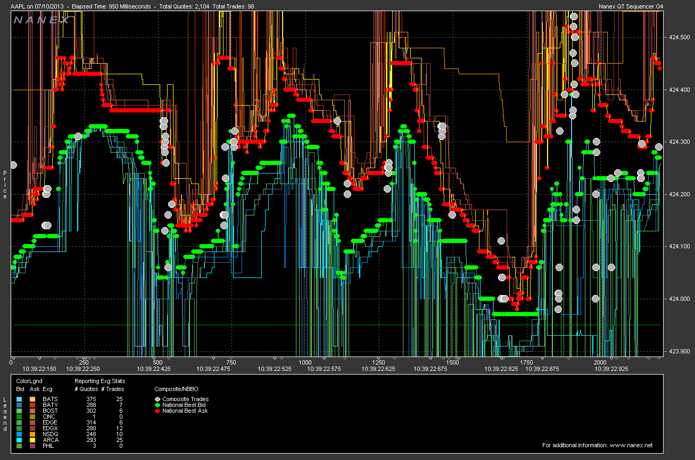
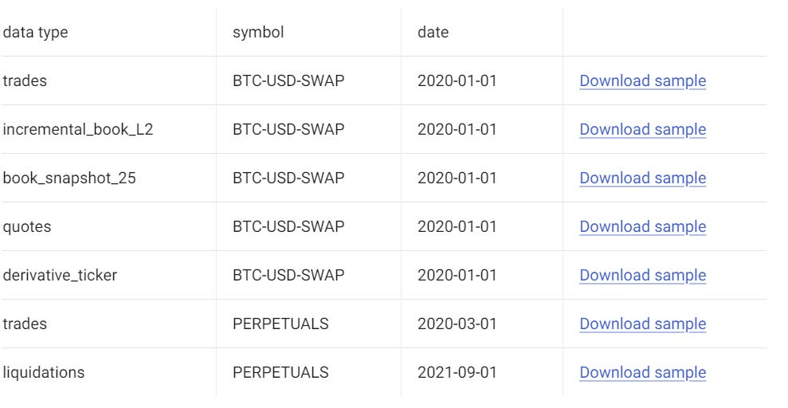
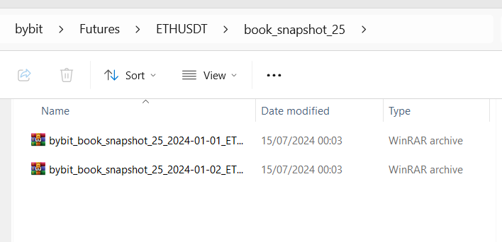
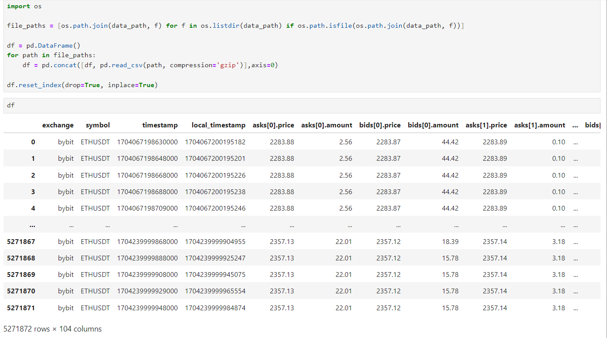
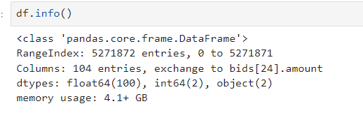
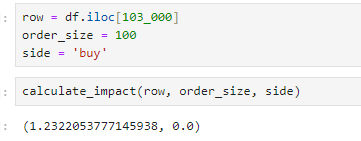
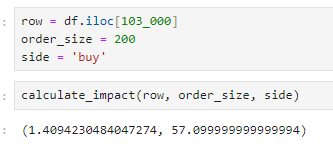
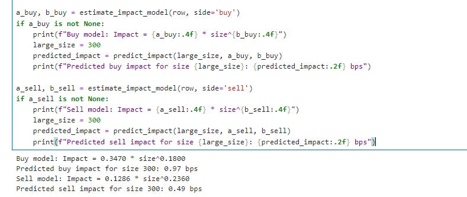
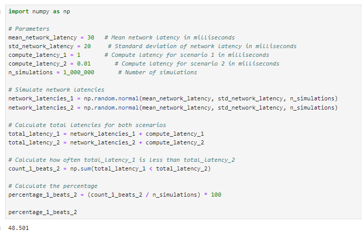
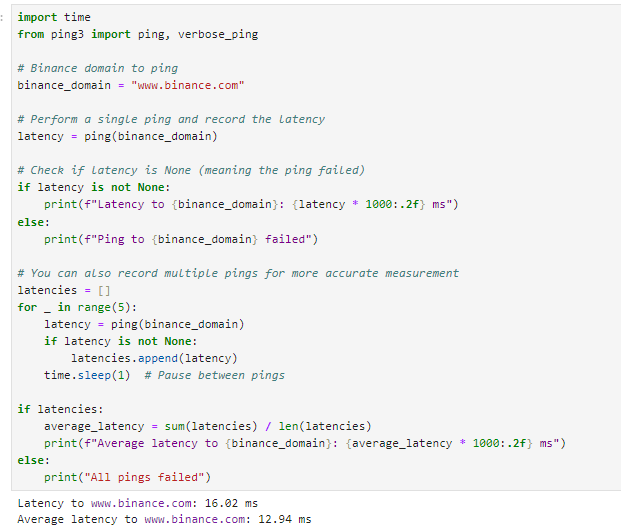

# HFT Research For Dummies

Source HTML: [`html/2024-09-21-hft-research-for-dummies.html`](../html/2024-09-21-hft-research-for-dummies.html)

# HFT Research For Dummies

| 항목 | 값 |
| --- | --- |
| 날짜 | 2024-09-21 |
| 접근 | 유료 |
| URL | https://www.algos.org/p/hft-research-for-dummies |
| 부제 | A How To Guide On Doing HFT Research |

---

[](images/2cccac75bd11.gif)

### Introduction

---

Today, I’ll talk about some general functions and activities in HFT research. It’s not an all encompassing guide by any means, but this tooling should end up being useful for you in your research endeavours. Certainly these are common tasks I have encountered.

### Index

---

1. Introduction
2. Index
3. Orderbook Impacts

   1. Snapshot
   2. Incremental
4. Latency Analysis

   1. Why network latency is key
   2. How to record latency (correctly)
   3. Regime shifts in latency
   4. Finding the best region
   5. Searching the data centre
5. Fill Probability Analysis
6. Pickoff Analysis
7. Post-Trade Analysis
8. Optimizing Parameters

### Orderbook Impacts - Snapshot

---

Usually we just need to find out whether the strategy works in the first place and we infer the capacity from the liquidity of the assets we trade, but in other occasions we need to figure out the impact of a certain size on the orderbook (or otherwise use this data to find the capacity of the strategy itself).

We’ll use [tardis.dev](https://tardis.dev/) data to do this, with the formats shown below, of which book\_snapshot\_25 will be out data type of use today:

[](images/97467b189c4f.png)

Let’s start by pulling some orderbook data for ETHUSDT on Bybit:

```
# Import Libraries

import aiohttp, asyncio, requests, nest_asyncio, json;
from urllib import parse;
from tardis_dev import datasets;
from tqdm import tqdm;


exchange_name = "bybit"
symbol = "ETHUSDT"
dtype="book_snapshot_25"
start_date = "2024-01-01";
end_date = "2024-01-03";
tardis_api_key = json.loads(json.load(open("secrets.json")))['tardis_key']


nest_asyncio.apply()

# Loop through available exchanges
for exchange_name in [exchange_name]:
    # Loop through base tickers
    for current_data_type in [dtype]:
        # Normalizing Ticker Names Based On Exchange
        current_symbol = symbol

        # Some tickers will not be available so are caught with an error
        try:
            datasets.download(
                exchange=exchange_name,
                data_types=[
                    current_data_type
                ],
                from_date=start_date,
                to_date=end_date,
                symbols=[
                    current_symbol
                ],
                download_dir=f"D:/Market_Data/Digital_Assets/Tardis_Data/{exchange_name}/Futures/{current_symbol}/{current_data_type}",
                api_key=tardis_api_key,
            )
        except Exception as e:
            pass
```

Now our data is downloaded, let’s open it up:

[](images/f668fc117af6.png)

[](images/f90b10eb0e1b.png)

Wow, that’s a lot of data for 2 days…

[](images/3d54e7705754.png)

Anyways, we often need to find out the impact of our trades at a given timestamp, so hence we can use the below code to calculate the impact in bps:

```
def calculate_impact(row: pd.Series, order_size: float, side: str = 'buy') -> (str, str):
    bids = [(row[f'bids[{i}].price'], row[f'bids[{i}].amount']) for i in range(25)]
    asks = [(row[f'asks[{i}].price'], row[f'asks[{i}].amount']) for i in range(25)]

    bids = sorted(bids, key=lambda x: x[0], reverse=True)
    asks = sorted(asks, key=lambda x: x[0])

    midprice = (bids[0][0] + asks[0][0]) / 2

    remaining_size = order_size
    weighted_price = 0

    if side == 'buy':
        for price, amount in asks:
            if remaining_size <= 0:
                break
            filled = min(remaining_size, amount)
            weighted_price += price * filled
            remaining_size -= filled
    else:  # sell
        for price, amount in bids:
            if remaining_size <= 0:
                break
            filled = min(remaining_size, amount)
            weighted_price += price * filled
            remaining_size -= filled

    avg_price = weighted_price / (order_size - remaining_size)
    impact_bps = abs(avg_price - midprice) / midprice * 10000

    return impact_bps, remaining_size
```

[](images/c08443ed8e04.png)

This can fail when our size is quite large, however:

[](images/c3053d1a020d.png)

At this point, we can either use the empirical data and then extrapolate from there by fitting a square root law:

```
import numpy as np
from scipy.optimize import curve_fit

def calculate_impact_at_sizes(row, sizes, side='buy'):
    bids = [(row[f'bids[{i}].price'], row[f'bids[{i}].amount']) for i in range(25)]
    asks = [(row[f'asks[{i}].price'], row[f'asks[{i}].amount']) for i in range(25)]

    bids = sorted(bids, key=lambda x: x[0], reverse=True)
    asks = sorted(asks, key=lambda x: x[0])

    midprice = (bids[0][0] + asks[0][0]) / 2

    impacts = []
    for size in sizes:
        remaining_size = size
        weighted_price = 0

        if side == 'buy':
            for price, amount in asks:
                if remaining_size <= 0:
                    break
                filled = min(remaining_size, amount)
                weighted_price += price * filled
                remaining_size -= filled
        else:  # sell
            for price, amount in bids:
                if remaining_size <= 0:
                    break
                filled = min(remaining_size, amount)
                weighted_price += price * filled
                remaining_size -= filled

        if size - remaining_size == 0:
            impacts.append(0)  # Not enough liquidity
        else:
            avg_price = weighted_price / (size - remaining_size)
            impact_bps = abs(avg_price - midprice) / midprice * 10000
            impacts.append(impact_bps)

    return np.array(impacts)

def power_law(x, a, b):
    return a * np.power(x, b)

def estimate_impact_model(row, side='buy'):
    sizes = np.logspace(0, 4, num=20)  # Adjust as necessary otherwise you'll have sizing tune issues
    impacts = calculate_impact_at_sizes(row, sizes, side)

    valid_mask = impacts > 0 # Filter out zero impacts
    valid_sizes = sizes[valid_mask]
    valid_impacts = impacts[valid_mask]

    if len(valid_sizes) < 2:
        return None, None

    # Fit the power law
    popt, _ = curve_fit(power_law, valid_sizes, valid_impacts, p0=[1, 0.5], bounds=([0, 0], [np.inf, 1]))
    a, b = popt

    return a, b

def predict_impact(size, a, b):
    return power_law(size, a, b)
```

[](images/89cd8eb9063c.png)

You can also use the standard sqrt law rule, that's pretty accurate… or tune over a much longer horizon. I won’t go into this too much; it’s a dirty fix for when we don’t want to reconstruct the book on a live basis… which brings us to the next section.

### Orderbook Impacts - Incremental

---

There are a few reasons to prefer the use of incremental orderbook data over snapshot data:

1. It’s far smaller to store on the disk because it avoids duplication.
2. It comes from a feed that is typically slightly faster and would be the one used in production.
3. It shows much more levels than the snapshot, allowing us to gauge the impact of greater sizes.

Continuing from our previous data scraping, we’ll be using Tardis with the same symbol and exchange:

```
dtype = "incremental_book_L2"

# Loop through available exchanges
for exchange_name in [exchange_name]:
    # Loop through base tickers
    for current_data_type in [dtype]:
        # Normalizing Ticker Names Based On Exchange
        current_symbol = symbol

        # Some tickers will not be available so are caught with an error
        try:
            datasets.download(
                exchange=exchange_name,
                data_types=[
                    current_data_type
                ],
                from_date=start_date,
                to_date=end_date,
                symbols=[
                    current_symbol
                ],
                download_dir=f"D:/Market_Data/Digital_Assets/Tardis_Data/{exchange_name}/Futures/{current_symbol}/{current_data_type}",
                api_key=tardis_api_key,
            )
        except Exception as e:
            pass
```

We can then go and build code to transform it into snapshots, but generated live. This is simply an orderbook problem - which I won’t get into here, but you can find many examples on GitHub. Often a BTree is used, but everyone has their own approach which balances the cost of inserts, reads, etc.

You can also use the [Tardis Machine](https://github.com/tardis-dev/tardis-node) which replays the market via a normalized format historically, but can also be switched to live mode where it aggregates feeds behind the scenes. It is like CCXT - but better. The live version is also free.

### Latency Analysis

---

When it comes to HFT strategies, you often reach a point where latency cannot be ignored. Simply having great alphas and modelling is not enough—you also need to be competitive on the latency front. Most of this is concentrated on the cloud network engineering front, so let’s implement some practical experiments, ones that would typically be performed inside of top-tier firms’ latency research operations, to develop optimal network setups.

#### Why network latency is key

---

Let’s start by assuming a normal distribution for latency — it isn’t and has quite the extreme tail, but this would only serve to further help our argument, so it doesn't matter much.

We start by simulating a quick scenario. Given some reasonable network latency assumptions for a volatile market, how often does someone with 1ms latency beat someone with 10us latency? It’s pretty clear that the improvement is quite minimal if we have 1ms compute latency vs. 10us compute latency.

[](images/6aa2503bb425.png)

Network latency can shoot up to hundreds of milliseconds in extreme scenarios, so having optimized network setups can keep your latency within normal ranges during this. This gives you an extraordinary edge that is practically impossible to beat with any sort of computing edge.

Now, we’d be in a rough position if we had 10ms compute latency, so if you are latency-concerned, you will want to be using Rust or C++, but you won’t be doing complex optimizations of your code like in equities. Instead, you will be doing complex optimizations of your network, which we’ll cover in this article.

#### How to Record Latency (Correctly)

---

Let’s ping Binance:

[](images/b78bc4229bad.png)

Wrong! This is a way I once saw it done by someone (not the exact code), and hence, I think it’s important to explain why this is not correct. First of all, we ping www.binance.com. This is the website, not the API - there is no guarantee they are hosted anywhere near each other.

The second issue is that we used a ping. Pinging gets the nearest CDN edge node and may not reach the server (hence why I get such great latency running it on my local laptop - despite being nowhere near Tokyo.
