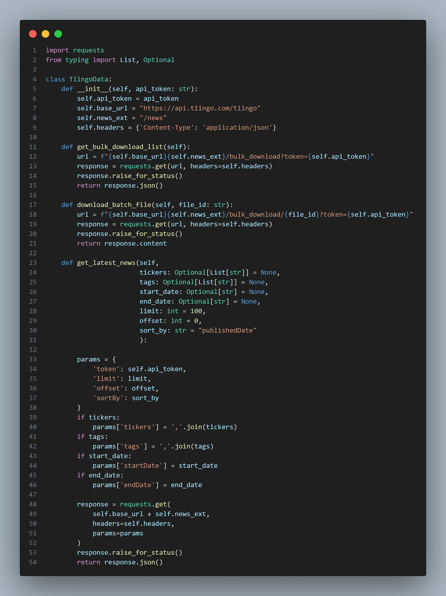
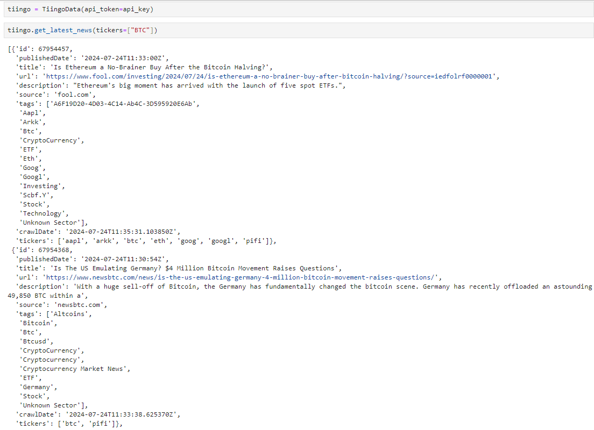
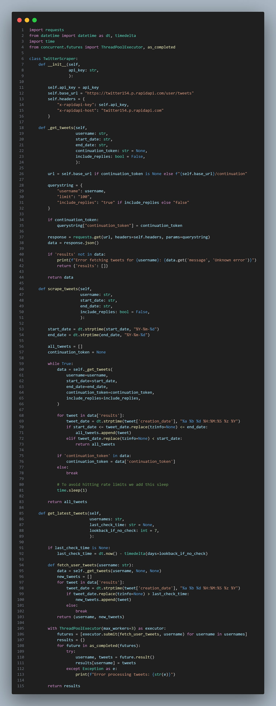
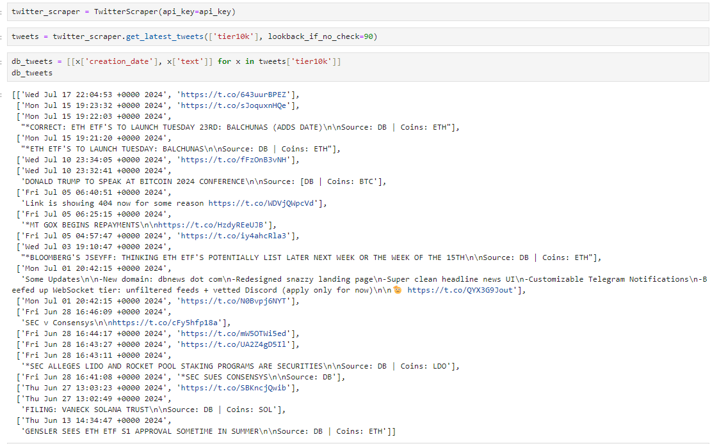
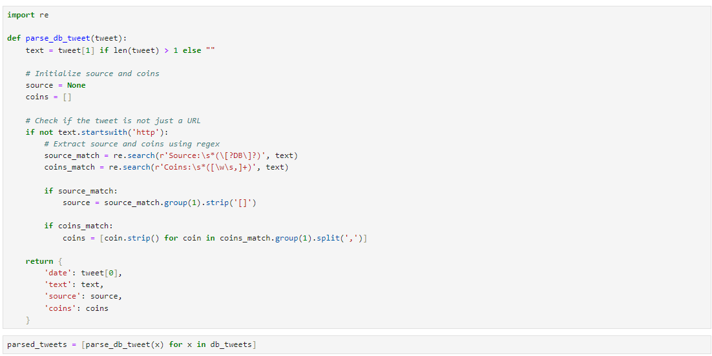
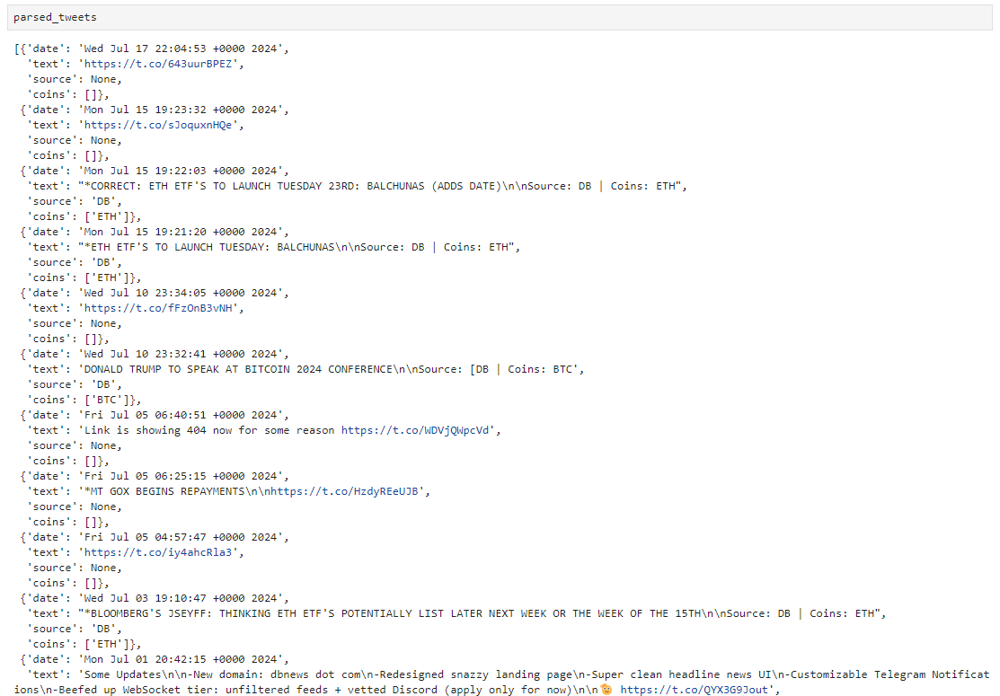
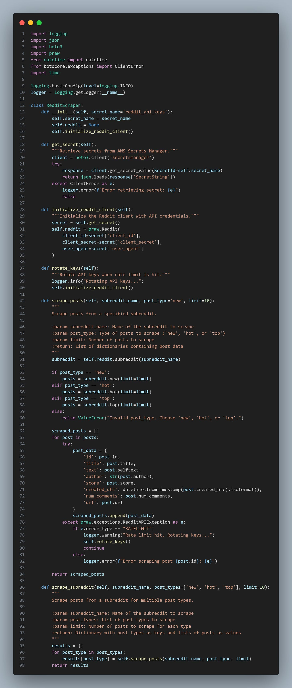
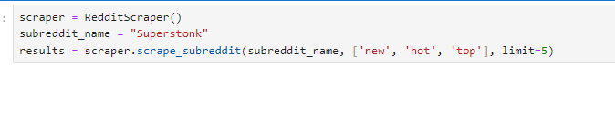
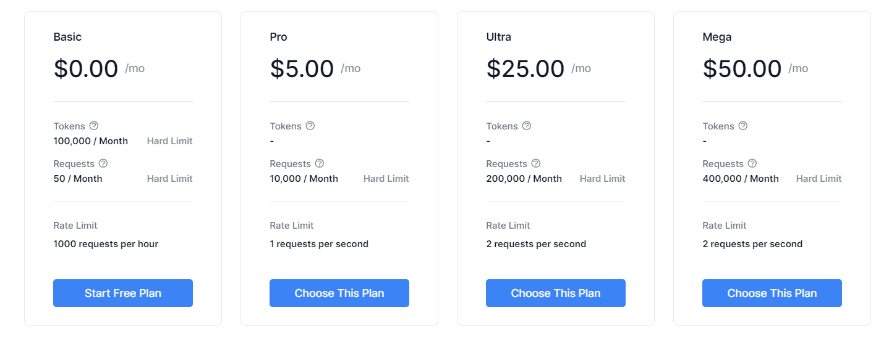
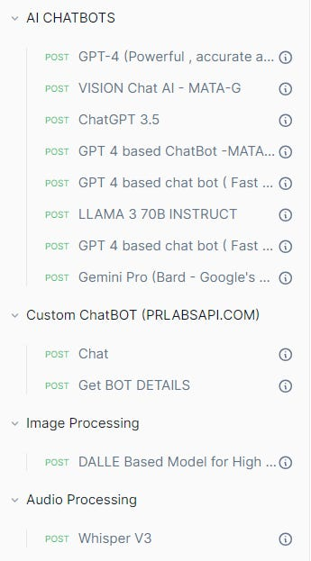

# Sentiment Alpha - Practical Bits

Source HTML: [`html/2024-09-21-sentiment-alpha-practical-bits.html`](../html/2024-09-21-sentiment-alpha-practical-bits.html)

# Sentiment Alpha - Practical Bits

| 항목 | 값 |
| --- | --- |
| 날짜 | 2024-09-21 |
| 접근 | 무료 |
| URL | https://www.algos.org/p/sentiment-alpha-practical-bits |
| 부제 | Exploring how to find alpha using sentiment analysis |

---

### Introduction

---

With the recent introduction of high-powered LLMs, detailed sentiment analysis has never been more accessible to researchers with little more than a prompt and an API call. Of course, these methods are slow and expensive, so we will explore the whole universe of tools and, more importantly, detail how to find the right data to analyse.

This is merely a fun article of my own experiments.

The Quant Stack is a reader-supported publication. To receive new posts and support my work, consider becoming a free or paid subscriber.

### Index

---

1. Introduction
2. Index
3. Data Sources

   1. Tiingo
   2. Twitter
   3. Reddit
   4. Where To Find Alpha
4. Analysis

   1. TextBlob
   2. Contains
   3. LLMs

      1. Llama
      2. CheapGPT
   4. Prompting LLMs

### Data Sources

---

Acquiring the right data is the difference between profitability and a waste of time. In most resources, you get the basic analysis of some news articles and *maybe* a couple of tweets. This will not be one of those articles. I may not build a complete scraping pipeline, but I won’t shy away from where there is worthwhile sentiment.

#### Tiingo News Data

---

In addition to being absurdly cheap at only $30 a month, Tiingo also offers an excellent API for news data. I’ve coded up their API into a Python class for us to use, and we’ll be using this for all of our scraping:

[](images/1e627edda7a9.png)

```
import requests
from typing import List, Optional

class TiingoData:
    def __init__(self, api_token: str):
        self.api_token = api_token
        self.base_url = "https://api.tiingo.com/tiingo"
        self.news_ext = "/news"
        self.headers = {'Content-Type': 'application/json'}

    def get_bulk_download_list(self):
        url = f"{self.base_url}{self.news_ext}/bulk_download?token={self.api_token}"
        response = requests.get(url, headers=self.headers)
        response.raise_for_status()
        return response.json()

    def download_batch_file(self, file_id: str):
        url = f"{self.base_url}{self.news_ext}/bulk_download/{file_id}?token={self.api_token}"
        response = requests.get(url, headers=self.headers)
        response.raise_for_status()
        return response.content

    def get_latest_news(self, 
                        tickers: Optional[List[str]] = None, 
                        tags: Optional[List[str]] = None,
                        start_date: Optional[str] = None,
                        end_date: Optional[str] = None,
                        limit: int = 100,
                        offset: int = 0,
                        sort_by: str = "publishedDate"
                        ):

        params = {
            'token': self.api_token,
            'limit': limit,
            'offset': offset,
            'sortBy': sort_by
        }
        if tickers:
            params['tickers'] = ','.join(tickers)
        if tags:
            params['tags'] = ','.join(tags)
        if start_date:
            params['startDate'] = start_date
        if end_date:
            params['endDate'] = end_date

        response = requests.get(
            self.base_url + self.news_ext,
            headers=self.headers,
            params=params
        )
        response.raise_for_status()
        return response.json()
```

As we can see below, getting the latest news involving BTC is relatively easy:

[](images/1993e1e4a274.png)

#### Twitter

---

Using Twitter normally requires us to use the Twitter API, and that’s still an option if we are a particularly well-funded enterprise and need the lowest latency possible. However, markets tend not to react instantly to Twitter news, so a second of latency isn’t much of a problem.

Hence, we will look at using RapidAPI for our implementation.

[](images/d8134d4a2c14.png)

```
import requests
from datetime import datetime as dt, timedelta
import time
from concurrent.futures import ThreadPoolExecutor, as_completed

class TwitterScraper:
    def __init__(self, 
                 api_key: str,
                 ):

        self.api_key = api_key
        self.base_url = "https://twitter154.p.rapidapi.com/user/tweets"
        self.headers = {
            "x-rapidapi-key": self.api_key,
            "x-rapidapi-host": "twitter154.p.rapidapi.com"
        }

    def _get_tweets(self, 
                    username: str,
                    start_date: str,
                    end_date: str,
                    continuation_token: str = None,
                    include_replies: bool = False,
                    ):

        url = self.base_url if continuation_token is None else f"{self.base_url}/continuation"

        querystring = {
            "username": username,
            "limit": "100",
            "include_replies": "true" if include_replies else "false"
        }

        if continuation_token:
            querystring["continuation_token"] = continuation_token

        response = requests.get(url, headers=self.headers, params=querystring)
        data = response.json()

        if 'results' not in data:
            print(f"Error fetching tweets for {username}: {data.get('message', 'Unknown error')}")
            return {'results': []}

        return data

    def scrape_tweets(self, 
                      username: str,
                      start_date: str,
                      end_date: str,
                      include_replies: bool = False,
                      ):

        start_date = dt.strptime(start_date, "%Y-%m-%d")
        end_date = dt.strptime(end_date, "%Y-%m-%d")

        all_tweets = []
        continuation_token = None

        while True:
            data = self._get_tweets(
                username=username,
                start_date=start_date,
                end_date=end_date,
                continuation_token=continuation_token,
                include_replies=include_replies,
            )

            for tweet in data['results']:
                tweet_date = dt.strptime(tweet['creation_date'], "%a %b %d %H:%M:%S %z %Y")
                if start_date <= tweet_date.replace(tzinfo=None) <= end_date:
                    all_tweets.append(tweet)
                elif tweet_date.replace(tzinfo=None) < start_date:
                    return all_tweets

            if 'continuation_token' in data:
                continuation_token = data['continuation_token']
            else:
                break

            # To avoid hitting rate limits we add this sleep
            time.sleep(1)

        return all_tweets

    def get_latest_tweets(self, 
                          usernames: str,
                          last_check_time: str = None,
                          lookback_if_no_check: int = 7,
                          ):

        if last_check_time is None:
            last_check_time = dt.now() - timedelta(days=lookback_if_no_check)

        def fetch_user_tweets(username: str):
            data = self._get_tweets(username, None, None)
            new_tweets = []
            for tweet in data['results']:
                tweet_date = dt.strptime(tweet['creation_date'], "%a %b %d %H:%M:%S %z %Y")
                if tweet_date.replace(tzinfo=None) > last_check_time:
                    new_tweets.append(tweet)
                else:
                    break
            return (username, new_tweets)

        with ThreadPoolExecutor(max_workers=3) as executor:
            futures = [executor.submit(fetch_user_tweets, username) for username in usernames]
            results = {}
            for future in as_completed(futures):
                try:
                    username, tweets = future.result()
                    results[username] = tweets
                except Exception as e:
                    print(f"Error processing tweets: {str(e)}")

        return results
```

Let’s try scraping DBs tweets:

[](images/54f5b10a987a.png)

Now, we can parse these tweets with some Regex:

[](images/322e762e8d65.png)

Code here:

```
import re

def parse_db_tweet(tweet):
    text = tweet[1] if len(tweet) > 1 else ""

    # Initialize source and coins
    source = None
    coins = []

    # Check if the tweet is not just a URL
    if not text.startswith('http'):
        # Extract source and coins using regex
        source_match = re.search(r'Source:\s*(\[?DB\]?)', text)
        coins_match = re.search(r'Coins:\s*([\w\s,]+)', text)

        if source_match:
            source = source_match.group(1).strip('[]')

        if coins_match:
            coins = [coin.strip() for coin in coins_match.group(1).split(',')]

    return {
        'date': tweet[0],
        'text': text,
        'source': source,
        'coins': coins
    }
```

This then gives us the following output:

[](images/43137ef113c3.png)

We now have a dataset of current news events that can be used for news data. Better yet, we can parse the images with OCR to extract the text and expand our ability to work with the data.

#### Reddit

---

Reddit has become quite heavily scraped in recent times, but alpha still remains, especially for digital assets where the markets are far less efficient. In equities markets, that is much less the case, but in crypto, there still is a remaining degree of edge.

Reddit offers a free API, but it has a limit. This isn’t too much of a problem, but it means we will need to rotate keys. You can create up to 3 per account, so with the creation of a few additional accounts, you can quickly gather enough scraping capacity.

If we want *all* of the posts, then we need to get a bit more creative because the Reddit API only offers to show us these three options:

1. Top
2. New
3. Hot

It’s a great filter that saves us time, but if we want the data for all of Superstonk, we’ll need to scrape better. Hence, we can implement RapidAPI for this. We won’t be implementing RapidAPI, only the main Reddit one, but you can follow the previous Twitter example for a rough idea of how RapidAPI works.

[](images/f02f5e935bc4.png)

```
import logging
import json
import boto3
import praw
from datetime import datetime
from botocore.exceptions import ClientError
import time

logging.basicConfig(level=logging.INFO)
logger = logging.getLogger(__name__)

class RedditScraper:
    def __init__(self, secret_name='reddit_api_keys'):
        self.secret_name = secret_name
        self.reddit = None
        self.initialize_reddit_client()

    def get_secret(self):
        """Retrieve secrets from AWS Secrets Manager."""
        client = boto3.client('secretsmanager')
        try:
            response = client.get_secret_value(SecretId=self.secret_name)
            return json.loads(response['SecretString'])
        except ClientError as e:
            logger.error(f"Error retrieving secret: {e}")
            raise

    def initialize_reddit_client(self):
        """Initialize the Reddit client with API credentials."""
        secret = self.get_secret()
        self.reddit = praw.Reddit(
            client_id=secret['client_id'],
            client_secret=secret['client_secret'],
            user_agent=secret['user_agent']
        )

    def rotate_keys(self):
        """Rotate API keys when rate limit is hit."""
        logger.info("Rotating API keys...")
        self.initialize_reddit_client()

    def scrape_posts(self, subreddit_name, post_type='new', limit=10):
        """
        Scrape posts from a specified subreddit.

        :param subreddit_name: Name of the subreddit to scrape
        :param post_type: Type of posts to scrape ('new', 'hot', or 'top')
        :param limit: Number of posts to scrape
        :return: List of dictionaries containing post data
        """
        subreddit = self.reddit.subreddit(subreddit_name)

        if post_type == 'new':
            posts = subreddit.new(limit=limit)
        elif post_type == 'hot':
            posts = subreddit.hot(limit=limit)
        elif post_type == 'top':
            posts = subreddit.top(limit=limit)
        else:
            raise ValueError("Invalid post_type. Choose 'new', 'hot', or 'top'.")

        scraped_posts = []
        for post in posts:
            try:
                post_data = {
                    'id': post.id,
                    'title': post.title,
                    'text': post.selftext,
                    'author': str(post.author),
                    'score': post.score,
                    'created_utc': datetime.fromtimestamp(post.created_utc).isoformat(),
                    'num_comments': post.num_comments,
                    'url': post.url
                }
                scraped_posts.append(post_data)
            except praw.exceptions.RedditAPIException as e:
                if e.error_type == "RATELIMIT":
                    logger.warning("Rate limit hit. Rotating keys...")
                    self.rotate_keys()
                    continue
                else:
                    logger.error(f"Error scraping post {post.id}: {e}")

        return scraped_posts

    def scrape_subreddit(self, subreddit_name, post_types=['new', 'hot', 'top'], limit=10):
        """
        Scrape posts from a subreddit for multiple post types.

        :param subreddit_name: Name of the subreddit to scrape
        :param post_types: List of post types to scrape
        :param limit: Number of posts to scrape for each type
        :return: Dictionary with post types as keys and lists of posts as values
        """
        results = {}
        for post_type in post_types:
            results[post_type] = self.scrape_posts(subreddit_name, post_type, limit)
        return results
```

Which we can use with the cell below:

[](images/6364c6eeeb7b.png)

#### Where To Find Alpha

---

In our quest for alpha, we have two approaches. We need to compile a large-scale dataset of data that has not been heavily analyzed yet, or we must find our alpha by analyzing existing data that is already freely available but in great detail.

This is the difference between checking to see if Elon has talked about DOGE and reacting rapidly - where we put a lot of work into analyzing a very small amount of data (either through our reaction time like in this case or with great detail to it like analyzing tier10k’s account for news releases) OR on the contrary we could be looking at Reddit’s sentiment overall on a particular set of stocks.

I already have an article on the theory of what works and what doesn’t work when it comes to sentiment data. Today, we will focus on the practical elements of actually using this data.

For a brief list of places you can go to look for alpha:

1. LinkedIn (analyzing headcounts, and statistics about employees)
2. Glassdoor (analyzing reviews on culture to build culture factors)
3. Yelp (reviews about the quality of the service, etc - sudden declines may be a sell signal)
4. Reddit (sentiment and trend following)
5. Twitter (same as Reddit)
6. Tiktok (again, the same, but this may require OCR onto the videos to extract text)
7. Instagram (similar story to TikTok where we can follow investment pages and extract the text)
8. Telegram (bots inside of pump and dump / signal servers can provide us alpha if we frontrun retail flow)
9. Discord (similar story here)
10. Zillow (for home builder stocks / REIT trading)

### Analysis

---

In this section, we’ll walk through a few ways to extract critical information from tweets.

#### TextBlob

---

Here is a basic sentiment analyzer. Sadly, it doesn’t appear to work very well, so hence we’ll move onto the next section. It is extremely fast and does have some applications that it makes sense for:

```
from textblob import TextBlob

class SentimentAnalyzer:
    @staticmethod
    def analyze(text):
        blob = TextBlob(text)
        polarity = blob.sentiment.polarity
        if polarity > 0:
            sentiment = "Positive"
        elif polarity < 0:
            sentiment = "Negative"
        else:
            sentiment = "Neutral"
        return {
            "sentiment": sentiment,
            "polarity": polarity
        }
```

#### Contains

---

This one is straightforward; we must check if someone has mentioned a word or ticker. Merely a large account with many followers mentioning a ticker (which on Twitter can be specifically typed with a dollar sign in front) is very bullish news. This is very easy to scan for.

We don’t even need to run sentiment on it, as we can trade a momentum breakout strategy off of it and ride the move.

#### LLMs

---

**Llama3:**

We have a few options when it comes to LLMs. If we value running speed, we can locally host an LLM. Llama3 is one of our best options here. It will be fast if we run it on very powerful hardware and use a smaller model, but it will also be expensive because we are going to need some very high-quality hardware. It’ll sit dormant most of the time, so perhaps we will want to optimize this in AWS.

**CheapGPT:**

If, instead, we value extremely low costs, then we can use RapidAPI or, again, a locally hosted model. Locally, hosting is cheap if we need to process a lot of data because it averages out. Still, there’s a sneaky workaround to get extremely cheap processing done on a lot of data by using a high-quality model like ChatGPT 4.

[](images/1e58c1e2e271.png)

This RapidAPI [<https://rapidapi.com/rphrp1985/api/chatgpt-42>] effectively puts a scraper on top of a regular ChatGPT Plus user, and since for the monthly price you pay, the amount of prompts you can do is effectively unlimited - it allows for much cheaper access to ChatGPT 4.0 as well as many other LLMs. It works out to be roughly 100x cheaper than the API.

[](images/57ef5ff440dd.png)

#### Prompting

---

Prompting the LLM is an important skill here, as we need to get the right information out of the LLM. Here are a few key things to add:

First, define the role of the LLM:

```
You are a sentiment classifier for tweets about cryptocurrencies. You should make judgements solely based on how the news will affect the current price of the related coins.
```

Second, we need to ensure that we do not acknowledge the task in the response, it needs to follow the right output:

```
For an example of what NOT to do:
"Sure, here's the sentiment of the post: Positive"
For an example of what to do:
"Positive"
```

Third, we want to outline a response format:

```
Respond with "Ignore", "Positive", or "Negative" based on your assessment of it's impact. Ignore should be used when the information is irrelevant to market prices or if the effect will be neutral.
```

Modifying the above, we can have a prefix of our strength:

```
Your responses should follow the below format:
"<strength> <sentiment>"

Strength can be any of ["Weak", "Medium", "Strong", "Extreme", "NULL"]

... Outline the sentiment part as shown in the above blob ...

If sentiment is Ignore, the strength should be NULL. Do not use NULL if the sentiment is not Ignore.
```

You may want to have filters for promotions. Tier10k often promotes his own website, so we want to make sure that the LLM is aware of this:

```
Always respond with "Ignore" if the tweet promotes the account's own website or does not relate to news.
```

You may want to leave examples:

```
Input >> "Elon Musk will be speaking at DogeConference2024"
Response >> "Strong Positive"
```

If you are really into tuning the LLM to get the amount of sentiment specificity you want, then you can fine-tune with a dataset of hand-labelled tweets (perhaps by investigating the actual impact on the price of the news and going from there—this requires that the news be very impactful, or it won’t have the determinism necessary to be useful).
