# Real Strategies - The CPI Trade

Source HTML: [`html/2024-10-17-real-strategies-the-cpi-trade.html`](../html/2024-10-17-real-strategies-the-cpi-trade.html)

# Real Strategies - The CPI Trade

| 항목 | 값 |
| --- | --- |
| 날짜 | 2024-10-17 |
| 접근 | 유료 |
| URL | https://www.algos.org/p/real-strategies-the-cpi-trade |
| 부제 | A low latency trade with multiple profit angles |

---

[](images/e682b11b9a83.webp)

### Introduction

---

Pricing in events typical falls under the realm of event arbitrage, and we’ve talked about this before extensively, but let’s look at a real example that made real PnL. I know a couple other fund manager friends of mine ran this same trade so it certainly was no secret, but it also wasn’t well-known enough to be arbitraged away. There’s also multiple angles on the effect that produce profits.

This is a trade that existed for a long time and still exists today, but to a lesser degree due to the enthusiasm, mostly from retail traders, that surrounds CPI releases.

This will be a short article. It’s not a crazy complicated alpha - I’ll explain it in as much detail as needed and leave the rest to the reader.

### Index

---

1. Introduction
2. Index
3. Basic Overview
4. Reacting To Information
5. Engineering The Latency Side
6. The Statistical Angle
7. The Lead-Lag Play

### Basic Overview

---

There are many key economic releases, CPI is one of them, and they have a huge impact on the market. We can also look at FOMC, but this is not as simple to monetize so we are focusing on simple economic statistics.

For CPI there is a forecast from the market and an actual. We can use this to form our alpha:

```
alpha = np.sign(actual - forecast) * -1
```

Surely it isn’t that simple? It sort of is. A lot of stupid effects occur because of stupid flows. In this case, it was lots of CPI flows.

You can run this on many releases including:

- CPI
- GDP
- ISM PMI
- NFP
- PCE
- PPI
- UR (Unemployment Rate)

You can look for examples on [investing.com](http://investing.com) of important economic events:

[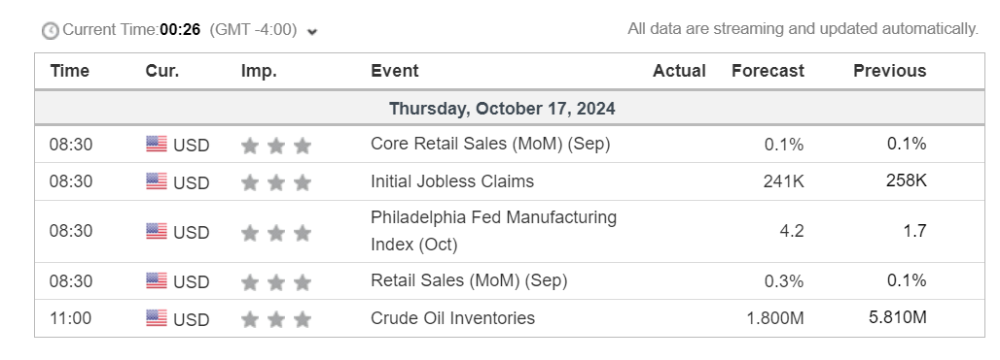](images/e6af227870e8.png)

### Reacting To Information

---

There is a clear relationship between surprise level and the level of movement in price. However, the binary signal we discussed earlier does a great job regardless.

[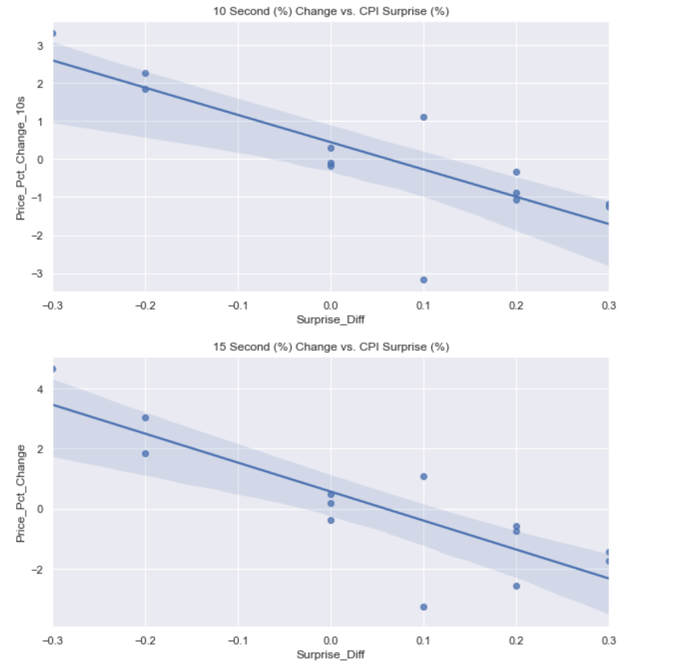](images/d78c5d67694d.png)

Most of the shock materializes in the first 10-15s. Our models assume 3 second latency and exit after 15 seconds. That gives us this backtest when we use CPI, PPI, and PCE as our economic events we react to.

[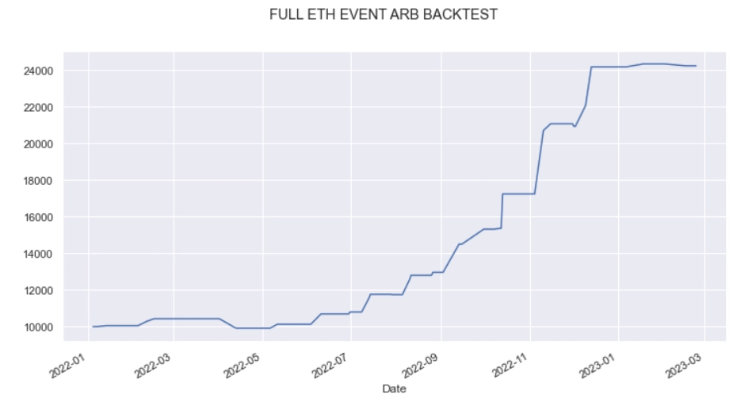](images/f9a2ae2a8b25.webp)

This takes into account best bid/ask and assumed the top fees on Binance (could assume the worst, wouldn’t change much - spread is the biggest killer). All data is HFT quote data for Binance provided by Tardis.

What if we want to add other indicators?

[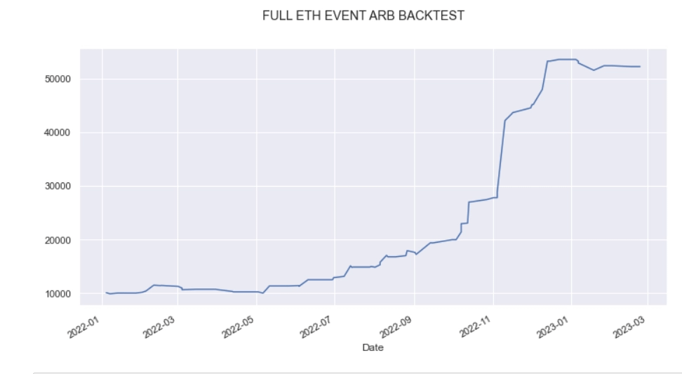](images/bc2b729c8bde.webp)

This includes GDP, PMI, and NFP on top of existing indicators. This appears to work in equities as well (there’s plenty of time to ride the wave) - just one specific example:

[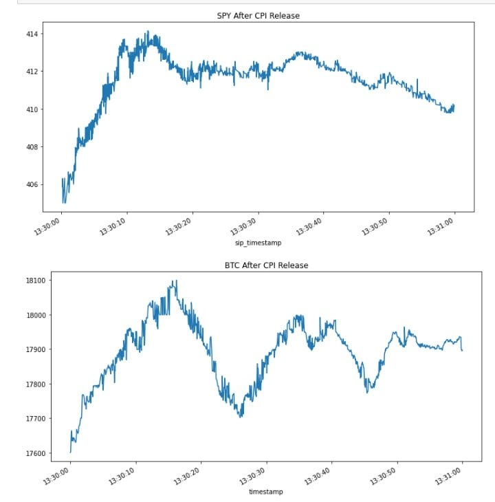](images/53357e3e0a7a.webp)

### Engineering The Latency Side

---

This is where the trade gets creative, we have about 2-3 seconds to react, which is already a lot, but it gets sent out via email so it can certainly take a while. How do we ensure that we get the data first?

We make 1000s of email accounts and sign up to receive the emails from BLS, this dramatically lowers the latency. Although, for a period, the trade worked even without this.

It’s not exactly a fast trade by any means - you can run it in Python, and really should.

### The Statistical Angle

---

The below is the typical path that price follows after a CPI release.

[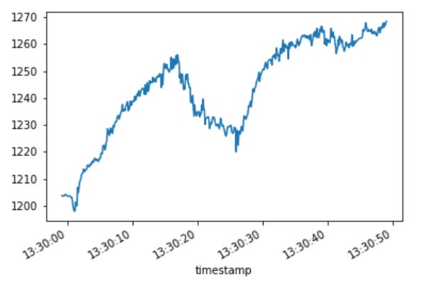](images/050e3bbe8af8.png)

There is a small dip prior to announcement - this isn’t clear how to profit off of, and then there is the large move for the first 15 or so seconds - which we’ve already established how to profit from, but after that we have two profitable effects:

- Reversal
- Momentum

The reversal is harder to capture, and spread is typically too wide for us to make money without using limit orders. Luckily, you can get filled very easily - or you certainly used to be able to get filled very easily because of all the retail flow. Post limit orders, get the fill, and you can make it profitable. I know from experience - back when I was involved in this trade.

Now, momentum. This one is simple. I found the alpha of “if buying from release to 10s after release made money with the worst fees, then buy and hold for another 60s. Same logic for sells.”. That produces this:

[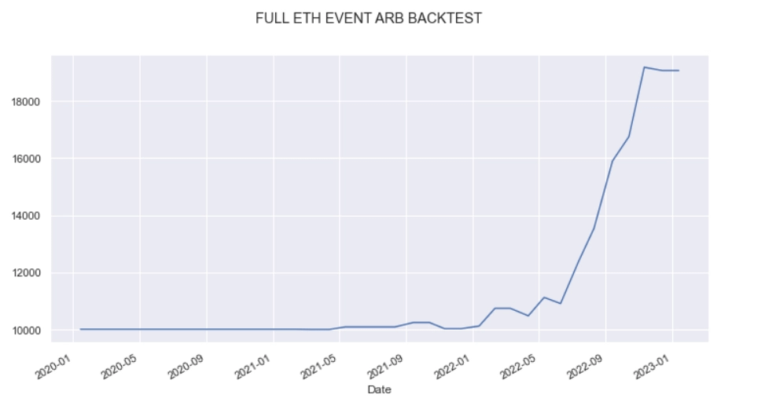](images/ff0c150ef428.webp)

Bad day to be a retail trader on the other side of this, eh?

### The Lead-Lag Play

---

What about a third strategy off this effect??? Surely there can’t be more alpha here! Oh, but there is. When this event occurs, arbitrages arise, and the prices fall out of sync easily. So you can thus, easily make money with a simple lead-lag trade. This one works well and my graphs are recent:

[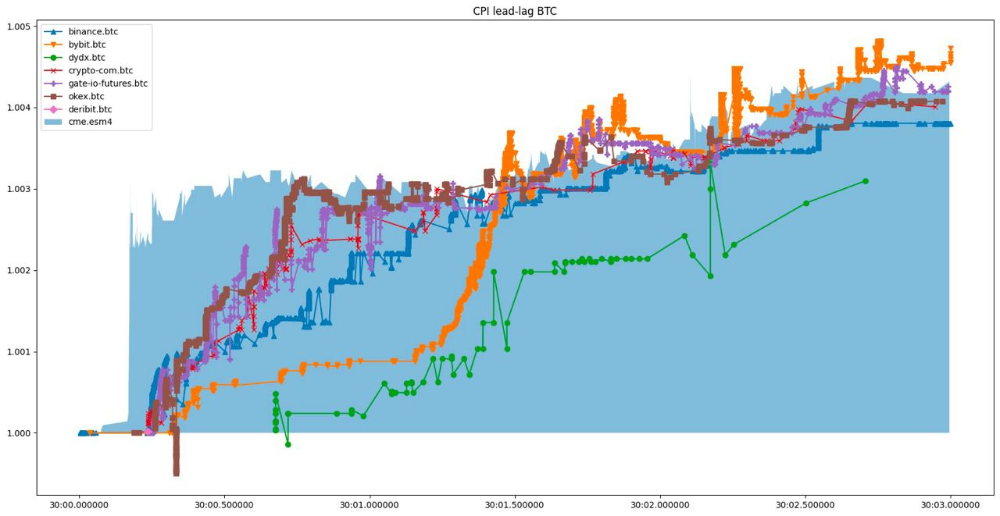](images/b781ef7a7985.jpeg)

What about more tokens than BTC?

[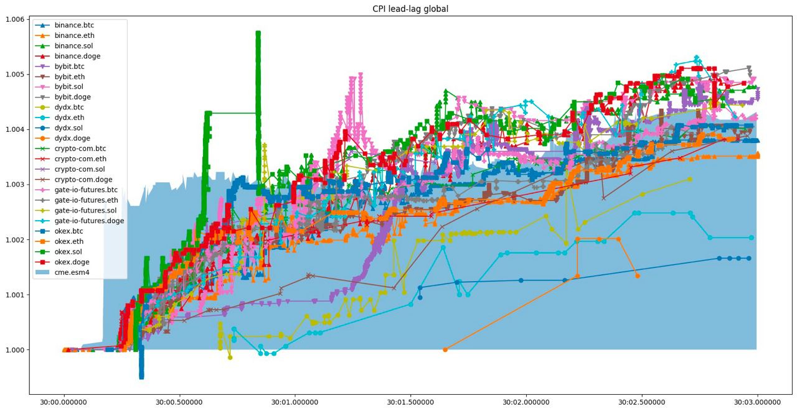](images/51b98a663274.jpeg)

As we can see, there’s many seconds to play off DYDX (the slower exchange) against a fast one. Here’s the general placement of laggards:

[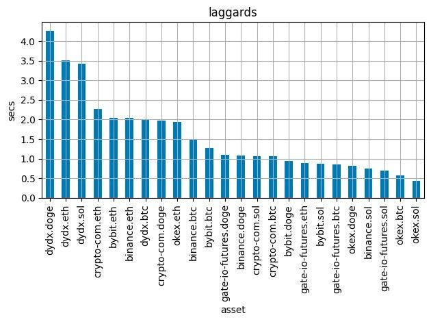](images/23e8fb36a23a.jpeg)

Let’s visualize that across different events:

[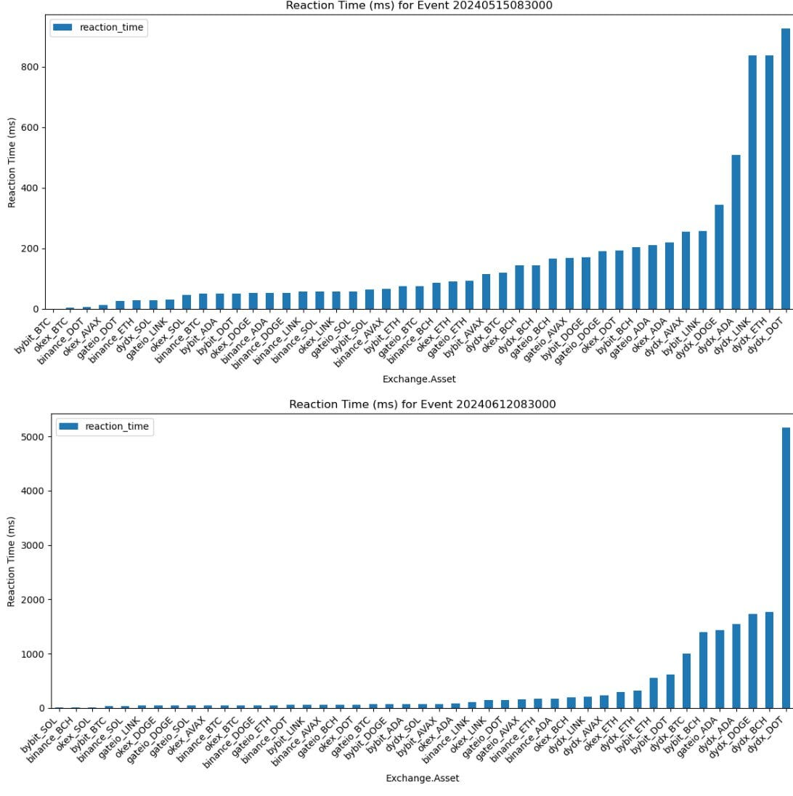](images/b573291ad673.jpeg)

[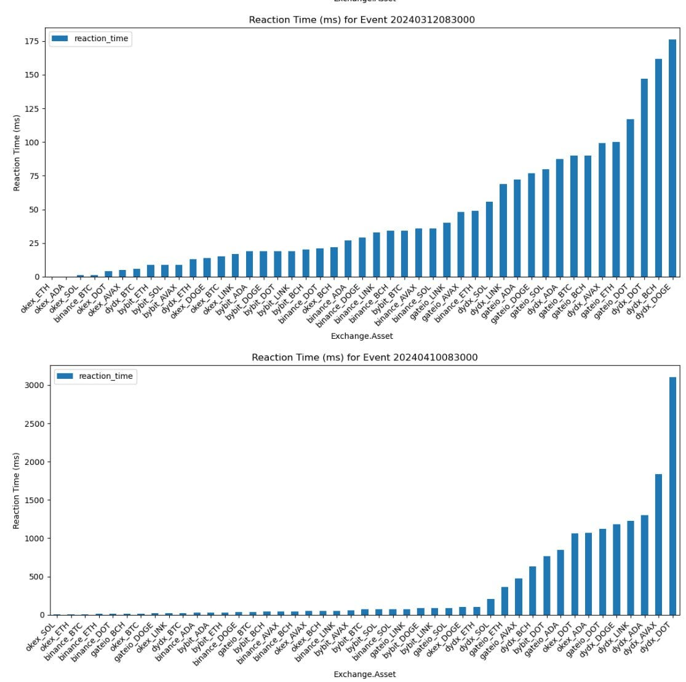](images/2787305a9929.jpeg)

[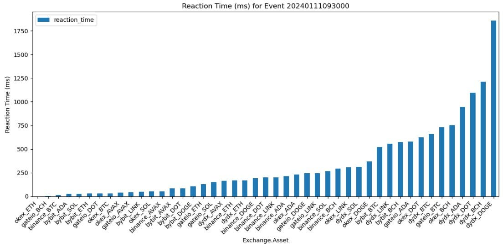](images/07966518a8f8.jpeg)

What about spread for the lead-lag trade? I’ve got you covered:

[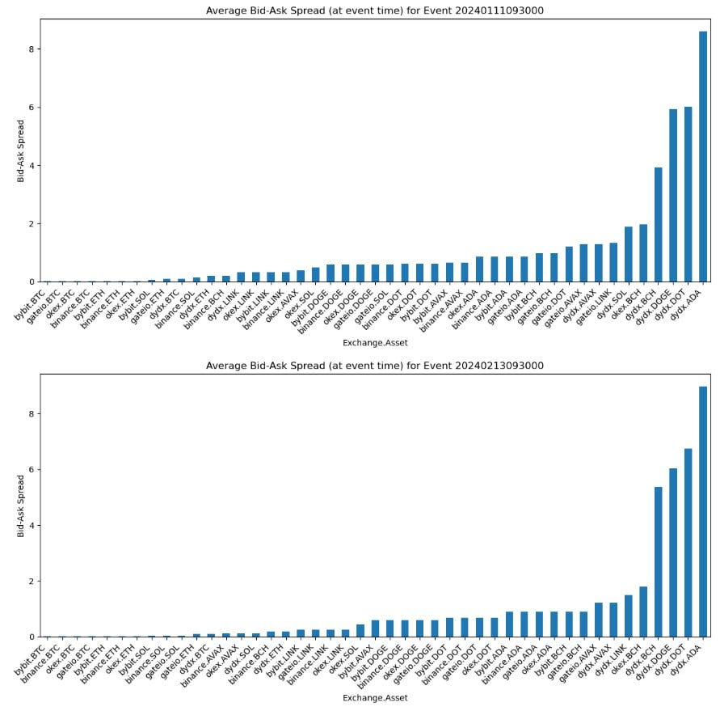](images/ff74e29f8c42.jpeg)

It can get high (axis is in bps), but nowhere near as high as the potential whole % moves triggered by CPI and similar events. You can always maker out afterwards / wait for it to simmer a little as well. You’ll benefit from the post-shock momentum. That or put on a spread and lock it in.
