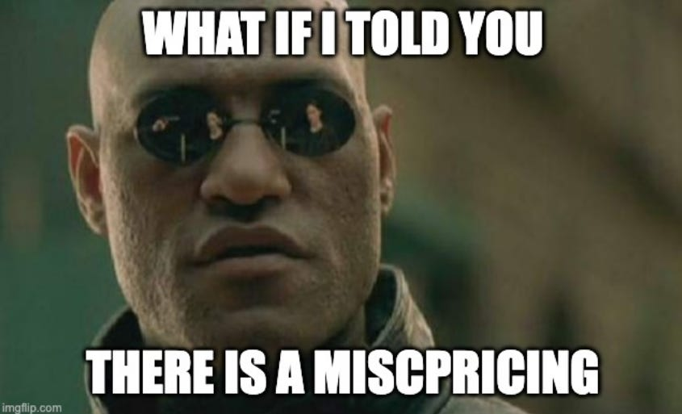
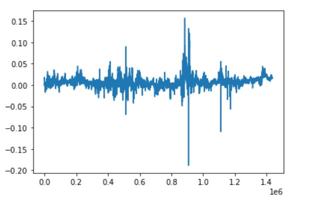
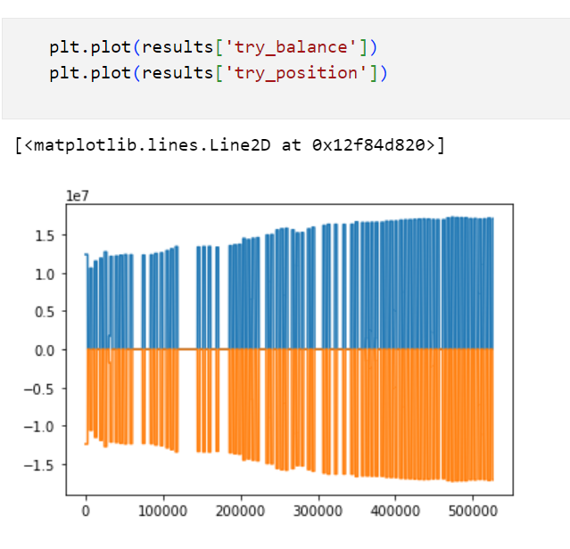
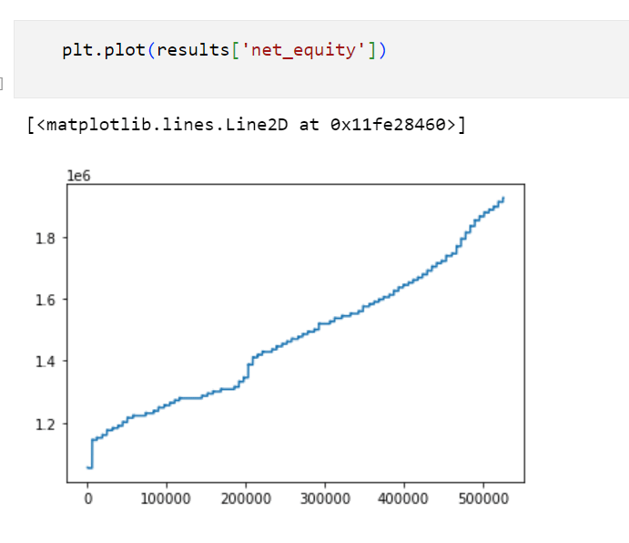
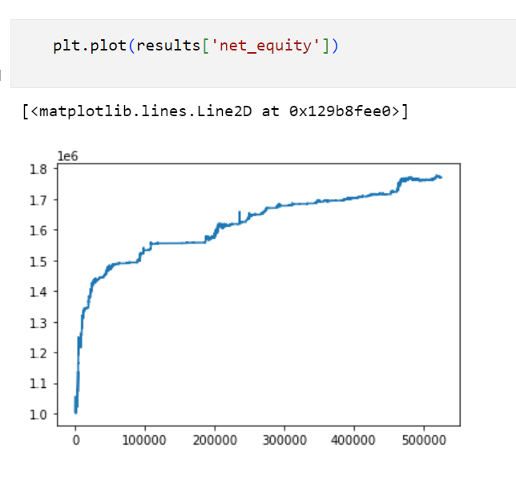
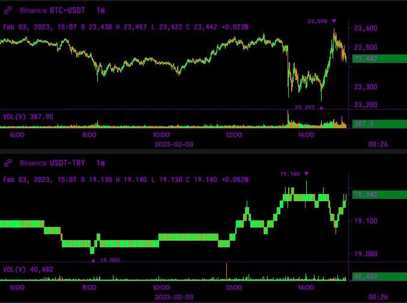

# Geographic Arbitrage

Source HTML: [`html/2024-11-17-geographic-arbitrage.html`](../html/2024-11-17-geographic-arbitrage.html)

# Geographic Arbitrage

| 항목 | 값 |
| --- | --- |
| 날짜 | 2024-11-17 |
| 접근 | 유료 |
| URL | https://www.algos.org/p/geographic-arbitrage |
| 부제 | An operational edge that requires you to get down and dirty in the weeds of it |

---

### Introduction

---

> “Maybe the real small trader alpha is just not having a compliance department” - Quant Arb to WorstContrarian via Twitter

There are many kinds of edges, but one of the most defendable edges is an operational edge. Effectively, your edge comes from the fact that doing the trade is a lot of work. Who wants to make friends with local bankers in Türkiye? Very few is the answer.

This is a niche that can hit quite a bit of scale, and as a result is an area me and my team spent a fair few months looking into (about 2 years ago) so today let’s talk a bit about the trade and it’s core details.

Geographic arbitrages move money between local and international markets for a currency.

### Index

---

1. Introduction
2. Index
3. How the trade works
4. Where it works
5. Bribes & Smuggling
6. Getting money out of Türkiye
7. Liquidity maximization
8. Price Effects

### How the trade works

---

Let’s take the example of the Turkish Lira. We start with USD, or another highly liquid and easily transferable currency (JPY, EUR, GBP). The imbalance is typically created via a mass exodus from a certain currency to liquid international currencies so in basically every case we will be selling into international markets and buying local markets.

We move our USD to local Turkish exchanges and then trade for TRY, we then transfer the TRY out of the country to a liquid international FX exchange such as LMAX and convert TRY back to USD.

We can optimize this by using cryptocurrencies. Instead of starting with USD, we start with USDT, BTC, ETH, or any combination of popular liquid cryptocurrencies. We then send these directly to BTCTurk, a popular Turkish crypto exchange. We can then convert this into TRY on exchange, withdraw it, transfer to LMAX, convert to USD, move to Binance or a liquid crypto exchange and convert back to crypto. We may also prefer to use an OTC dealer that can convert TRY directly to crypto. We end up with a roughly 1-2% profit per cycling of our capital through this trade.

Many locals will use crypto exchanges to move money out of the country as it provides a liquid conversion to a currency (crypto) that the government cant prevent them from transferring out of the country. It typically has a stronger imbalance as a result, not to mention that the cycle time is faster since getting your crypto into BTCTurk is almost instant.

You may end up stuck in the local currency for a bit of time, likely the longest time out of all currencies, and there is a price risk with this because these currencies tend to be declining in value rapidly so hence it is often wise to look at putting on a swap hedge to cover yourself there. This way you can also check your APR is better than the cost of holding the short position because there will be a heavy carry cost here.

On top of this, you may use leverage as a way to improve the APR of the strategy.

### Where it works

---

This typically works in places where there is both restrictions (official or unofficial) on transfers of the currency out of the country, paired with enough demand to move currency offshore from the locals. Here are some examples:

1. India (INR)
2. South Korea (KRW)
3. Brazil (BRL)
4. Türkiye (TRY)
5. Ukraine (UAH)
6. Russia (RUB)
7. Nigeria (NGN)

You then need to find their local crypto exchange and get hold of an account. This part can get tricky as it often requires bringing on a local who allows you to use their account.

For extremely high APR versions of this trade you end up trading currencies of countries currently at war. Things get risky on the legal side past this point…

### Bribes & Smuggling

---

Russia and Ukraine it is flat out illegal to do. People smuggle the money out with mules because the premium is >20% per cycle.

Nigeria had 40% difference when I last looked, but to put any meaningful size through the trade you’d need to pay-out significant bribes to government officials.

These trades start getting really murky for the higher APR trades.

Even for currencies where there are no official restrictions, it just isn’t easy, such as Türkiye, there is still major problems with others paying out bribes.

I think it goes without saying that I do not condone bribery and have always attempted these sorts of trades the legal way.

### Getting money out of Türkiye

---

Setting up the local entity as a liaison office worked best for Türkiye with large international banks such as HSBC being the least likely to attempt to prevent you from transferring internationally.

If you do this trade enough, the government will send you a letter which basically says “we think you are doing money laundering”. From my understanding of the trade from others who ran it - this is basically an empty threat used to scare people off from running the strategy.

There are no actual laws in Türkiye that prevent you from running this strategy in Türkiye after all, but that doesn’t mean they wont try to stop you.

### Liquidity Maximization

---

The liquidity on most of these local crypto exchanges is generally relatively poor. To maximize the amount of capital that can be cycled you’ll need to market make one side of the book and VWAP into the position.

For the other legs it is relatively liquid so a simple execution strategy is fine.

### Price Effects

---

Often it is too expensive to actually go and convert between the markets, but it still produces many exploitable effects. One is the seasonality that happens in the spread between bank hours and non-bank hours for the USD/TRY spread internationally vs on Binance. I.e. USD/TRY on Binance vs USDT/TRY on Binance. The difference blows out to about double it’s usual during non-bank hours, and then gets tighter. This seasonality can be exploited for small profits.

This assumes we can transfer between the two:

This simply assumes we trade the seasonality:

There also appears to be a relationship between large shocks in BTC-USDT on Binance and USDT-TRY on Binance. Likely driven by flow from other traders arbing.
