# Seasonal Alpha in Small Caps

Source HTML: [`html/2024-12-15-seasonal-alpha-in-small-caps.html`](../html/2024-12-15-seasonal-alpha-in-small-caps.html)

# Seasonal Alpha in Small Caps

| 항목 | 값 |
| --- | --- |
| 날짜 | 2024-12-15 |
| 접근 | 유료 |
| URL | https://www.algos.org/p/seasonal-alpha-in-small-caps |
| 부제 | Detailing an alpha that trade a variety of cryptocurrencies and detects seasonality systematically |

---

[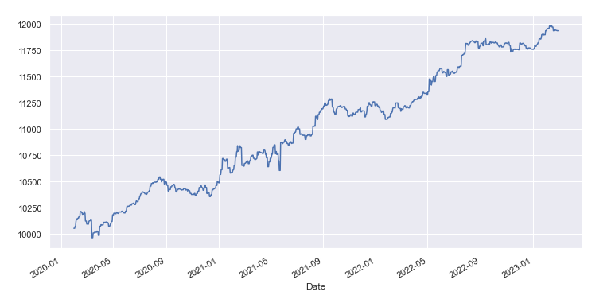](images/f9fe57078bd1.png)

### Introduction

---

A while ago, me and HangukQuant wrote a paper applying a generalized seasonality approach to commodities markets. Today, we are applying it to a variety of digital assets.

Unlike most seasonality approaches where people come up with a hypothesis about what timeframe it could appear on and then test it, this approach simply detects seasonality up to monthly using regression as our tooling.

### How GenSeason Works

---

The model detects seasonality using prime dummy variables. Here’s how:

We start with prime numbers as the core of our algorithm. Prime numbers (e.g., 2, 3, 5, 7) are used because their inherent indivisibility avoids overlapping patterns that can occur with composite periodicities. This therefore makes them perfect for isolating seasonal effects in our data without fitting aggressively or using fancy non-linear models.

**F** or each prime number, we create a binary column in the dataset. These variables mark rows where the index corresponds to multiples of the prime number. for example:

- `pi_2: rows where (index + 1) % 2 == 0 (every 2nd row)`
- `pi_3: rows where (index + 1) % 3 == 0 (every 3rd row)`

The regression model uses these prime dummies as predictors (pi\_2, pi\_3, etc.) to explain variations in forward returns. Each and every prime captures a specific periodic influence, and their regression coefficients measure the impact of that periodicity on forward returns.

Hopefully that makes sense, but the important idea is regression + prime dummy variables lets you forecast out to the product of all your dummy primes (i.e. if you have 2, 3, and 5 → you can look 2 \* 3 \* 5 = 30 periods ahead for seasonality).

We can also do some joint hypothesis testing to then see if there are seasonal effects on the timeframe, but I prefer to skip straight to the backtest.

### Code

---

The below code lets us backtest the alpha:

```
def isPrime(n):
    if n == 2:
        return True
    if (n % 2 == 0):
        return False
    for i in range(3, int(n**0.5 + 1), 2):
        if (n % i == 0):
            return False
    return True

def countPrimes(list_of_numbers):
    count = 0
    for num in list_of_numbers:
        if isPrime(num):
            count = count + 1
    return count

def get_prime_factors(x: int):
    list_of_numbers = list(range(2, x+1))

    pf = []
    for num in list_of_numbers:
        if isPrime(num):
            pf.append(num)
    return pf;

def prime_counting_function(x: int):
    return countPrimes(range(2, x+1));
```

The above is some utilities since we work with prime numbers as a core part of the strategy. Here is the backtest:

```
from typing import Dict, List
import pandas as pd
import statsmodels.api as sm
import seaborn as sns
import matplotlib.pyplot as plt

# initialize dictionaries and dataframes
regression_parameter_fits: Dict[str, pd.Series] = {}
saved_logs: Dict[str, pd.DataFrame] = {}
forward_pvalues = pd.DataFrame()
backtest_performance = pd.DataFrame()

for symbol in symbols[:20]:
    data_path = f"Data/Binance/DailyOHLCV/Extended/binance_kline_{symbol}_daily_spot.parquet"
    daily_data = pd.read_parquet(data_path)

    additional_data_path = f"Data/Binance/DailyOHLCV/binance_kline_{symbol}_daily_spot.parquet"
    daily_data = (
        daily_data.append(pd.read_parquet(additional_data_path))
        .drop_duplicates()
    )

    prime_period = 7

    daily_data = daily_data[["close_time", "close_price"]]
    daily_data = daily_data.set_index("close_time")
    daily_data["close_price"] = daily_data["close_price"].pct_change()
    daily_data["forward_returns"] = daily_data["close_price"]
    daily_data = daily_data.dropna().reset_index()

    daily_data = daily_data[daily_data["close_time"] >= pd.to_datetime("2021-01-01")].reset_index(drop=True)

    prime_factors = get_prime_factors(prime_period)

    for factor in prime_factors:
        daily_data[f"pi_{factor}"] = ((daily_data.index + 1) % factor == 0).astype(int)

    f_pvalues: List[float] = []
    regression_params: List[pd.Series] = []

    # split into training and testing sets
    training_data = daily_data[daily_data["close_time"] < pd.to_datetime("2022-01-01")].reset_index(drop=True)
    testing_data = daily_data[daily_data["close_time"] >= pd.to_datetime("2022-01-01")].reset_index(drop=True)

    for i, factor in enumerate(prime_factors):
        predictors = [f"pi_{x}" for x in get_primes_below_j(prime_period, i)]
        endogenous = training_data["forward_returns"]
        exogenous = sm.add_constant(training_data[predictors])

        regression_results = sm.OLS(endogenous, exogenous).fit()

        f_pvalues.append(regression_results.f_pvalue)
        regression_params.append(regression_results.params)

    forward_pvalues = forward_pvalues.append(
        pd.DataFrame([f_pvalues], columns=[f"pi_{x}" for x in prime_factors], index=[symbol])
    )

    if f_pvalues[2] < 0.25:
        selected_params = regression_params[2]
        regression_parameter_fits[symbol] = selected_params

        testing_data["prediction"] = (
            selected_params.const
            + testing_data.pi_2 * selected_params.pi_2
            + testing_data.pi_3 * selected_params.pi_3
            + testing_data.pi_5 * selected_params.pi_5
        )

        # calculate rolling statistics without lookahead
        testing_data["prediction_mean"] = testing_data["prediction"].rolling(30, min_periods=1).apply(lambda x: x[:-1].mean() if len(x) > 1 else float("nan"), raw=False)
        testing_data["prediction_std"] = testing_data["prediction"].rolling(30, min_periods=1).apply(lambda x: x[:-1].std() if len(x) > 1 else float("nan"), raw=False)
        testing_data = testing_data.dropna().reset_index(drop=True)

        testing_data["prediction_zscore"] = (
            (testing_data["prediction"] - testing_data["prediction_mean"])
            / testing_data["prediction_std"]
        )

        saved_logs[symbol] = testing_data.copy()

        initial_cash = 10_000.0
        portfolio_value = []
        leverage = 0.1
        transaction_fee = 0.0006

        for _, row in testing_data.iterrows():
            prediction_z = row.prediction_zscore
            return_rate = row.close_price

            if prediction_z >= 1:
                initial_cash *= 1 + (return_rate - transaction_fee) * leverage

            portfolio_value.append([row.close_time, initial_cash])

        equity_curve = pd.DataFrame(portfolio_value, columns=["Date", "Equity"]).set_index("Date")

        sns.set_theme()
        plt.figure(figsize=(12, 6))
        plt.title(f"LONG ONLY {symbol}")
        equity_curve["Equity"].plot()
        plt.show()

        equity_curve.columns = [symbol]
        backtest_performance = pd.concat([backtest_performance, equity_curve], axis=1)
```

### The Performance

---

The above code produces a lot of plots for many different cryptocurrencies. I have put these ones in the appendix because there is a fair few of them, but here are aggregated portfolios of the alpha.

As you should be able to notice, we assume 6 bps of trading costs. This is perhaps accurate for currencies like BTC, but definitely not for many of the currencies in our universe. You can get trading costs even lower than this for all assets in the universe if you put in enough work into execution. I remember talking to Jump crypto regarding a pod deal and they asked me “What would you do if you could trade for 0 cost in all currencies?”. I’ve certainly got below those costs before on my own although I definitely cannot claim to have gotten anywhere near Jump’s cost of trading.

Regardless, there’s your catch with the performance I’m about to show you. I’ve also constructed my portfolios in a very scrappy way - I’m not sure you should copy me here and instead should spend some more time optimizing it (for me this is just a test to prove a point, no point doing anything fancy unless it’s going into prod).

Here’s the performance using 0.25 as the threshold (long-only):

[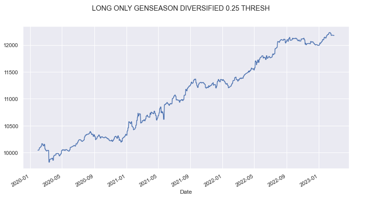](images/c2fea57349e6.png)

Here’s the performance using 0.35 as the threshold (long-only):

[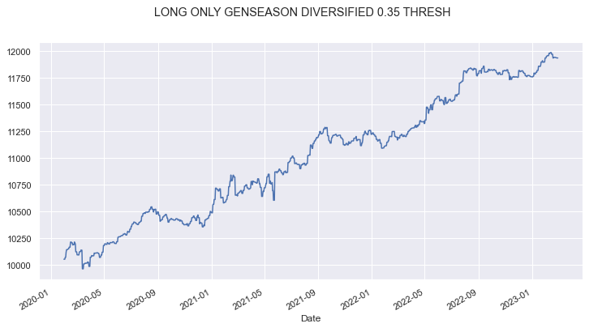](images/85ebe68a3652.png)

What about 0.45:

[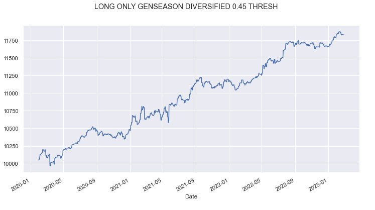](images/af303710bade.png)

Okay, not much change - lets stop playing around with that, and just see what happens with no threshold:

[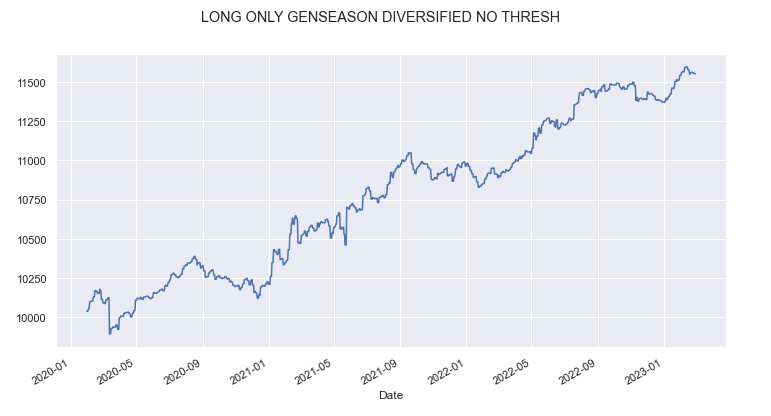](images/7456440e5596.png)

Appears some threshold is worthwhile but there isn’t a lot in it. What about if we filter by F-Test:

[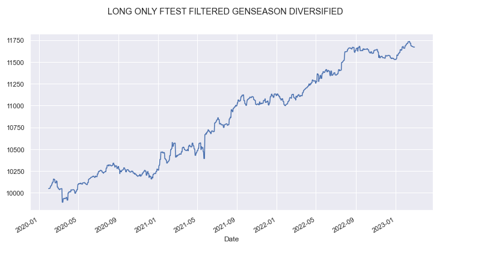](images/42e77e572377.png)

Pretty much the same thing, now what happens if we start allowing us to go short:

[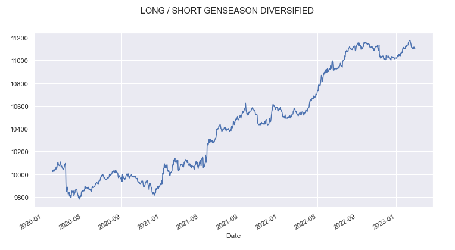](images/7d17e6fb11b4.png)

Yep, that’s pretty terrible as expected. Seasonality does not perform on the short leg in almost every case I’ve seen.

Whilst our assumptions on costs require really strong execution, we will see in the next part that even for symbols where this cost is conservative it performs and for our OOS part the algorithm worked. This backtest is until 2023 since I came up with it back then.

### Appendix

---

Here’s our individual plots:

[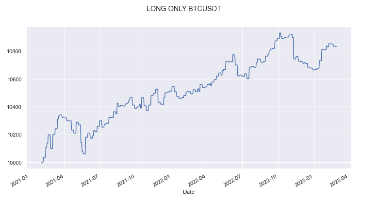](images/2be555755ab7.png)

[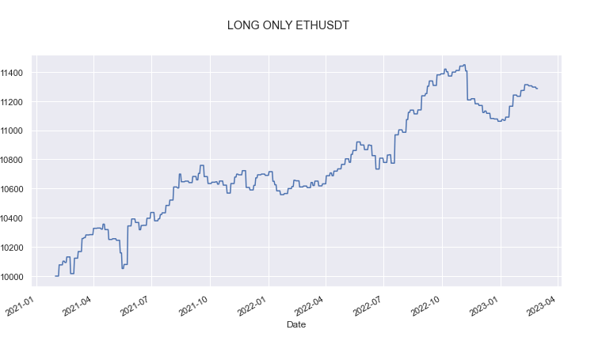](images/eb94253b67d7.png)

[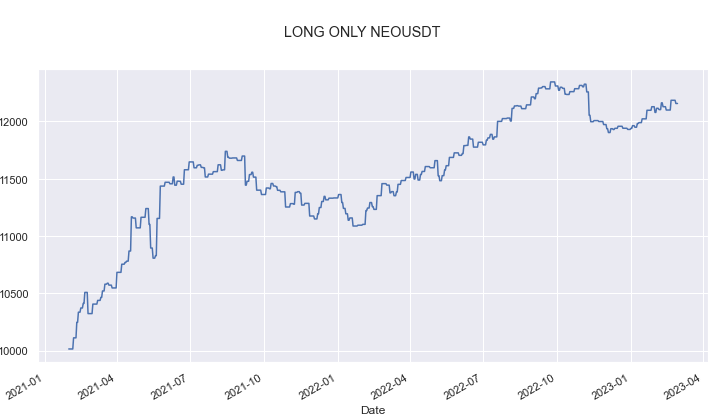](images/fe1d0932c6ff.png)

[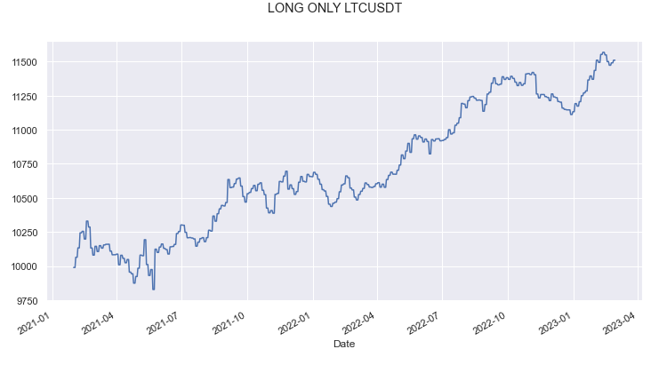](images/627983b03517.png)

[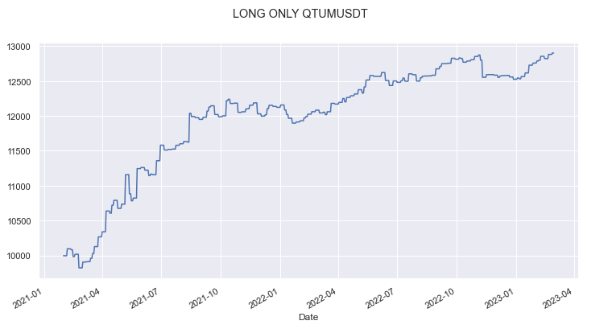](images/989a5c9c4cba.png)

[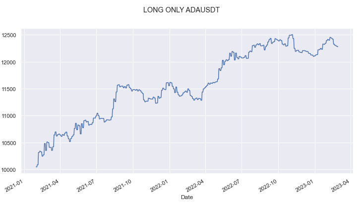](images/762f4b308c07.png)

[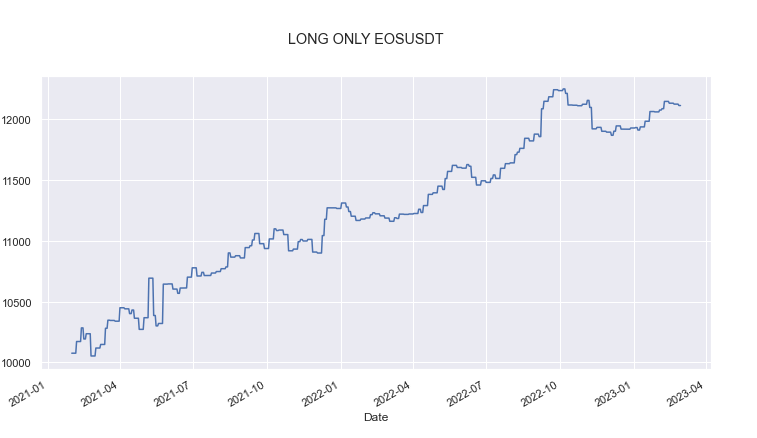](images/77e36c6c0bc1.png)

[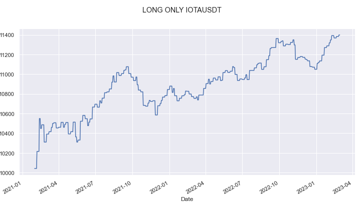](images/b54e24d2af06.png)

[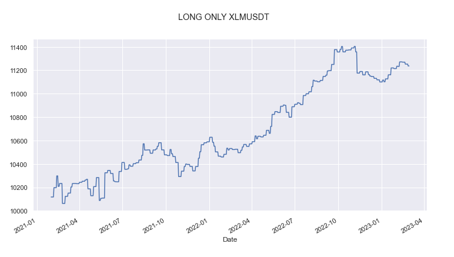](images/750e4dd09598.png)

[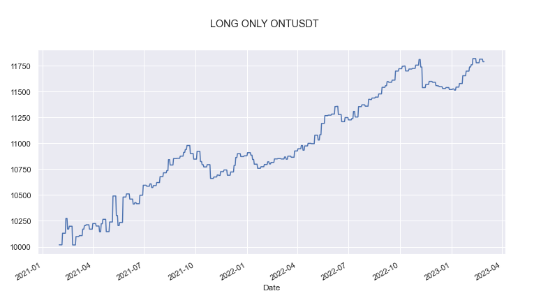](images/4945651742fd.png)

[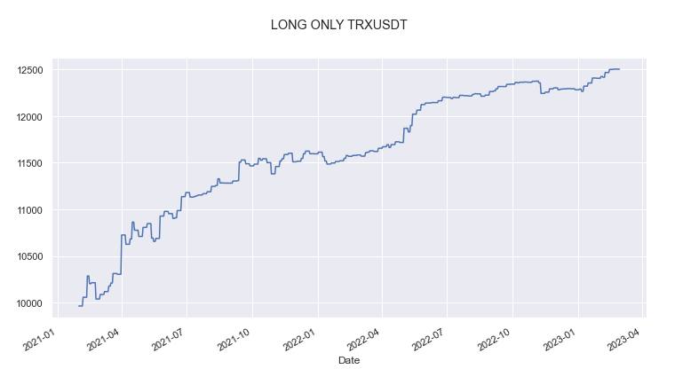](images/ae58562d46b4.png)
