# Professional Options Market Making & Taking [CODE INCLUDED]

Source HTML: [`html/2025-01-26-professional-options-market-making.html`](../html/2025-01-26-professional-options-market-making.html)

# Professional Options Market Making & Taking [CODE INCLUDED]

| 항목 | 값 |
| --- | --- |
| 날짜 | 2025-01-26 |
| 접근 | 유료 |
| URL | https://www.algos.org/p/professional-options-market-making |
| 부제 | How Optiver, IMC, and the rest of the pros decide how much an option is worth |

---

### Introduction

---

It’s been a busy few months for me, as I’ve started a new role a few months back in the world of linear instruments I’ve decided to write an article regarding some of my previous experience in options and how fair values are fitted as well as profited from.

When it comes down to it, the core money maker for making and taking remains roughly the same. Sure, you have maker models which don’t rely on vol curves (although they’re extremely simple to say the least) and there’s taker strategies that don’t do this, but by and large this is the most popular way of trading options at large institutions.

For a rough overview of how this article will be structured, we will first start with explaining how to fit some basic SSVI and SVI models. Then we’ll move on to working with the Wing model. Then we’ll explore a taker strategy where we exploit differences between the market fit vol curve and our values. We will also talk about how market makers fit their parameters that they then end up quoting around. In general, this is an options market making 101 guide for the pricing side of things.

This article will work with 2 models. The Orc Wing model which was a model used by Optiver as well as a range of other firms well over a decade ago, as well as SSVI (Stochastic Skew Volatility Inspired) which is publicly available in the literature. In modern times, Vola Dynamics is the choice model for most firms, if not an in-house proprietary solution. I’ve used Vola before but I can’t afford the $25,000-30,000 price tag per month or at least not until many many more people subscribe to this blog just for personal use and I’d have been fired if I used it to write an article at work so we’ll stick to slightly behind the leading edge.

We will be fitting cryptocurrency markets today which probably could use a C9 (9-parameter) curve as it isn’t exactly super advanced and there aren’t things like VIX options which can actually get you picked off on the tails if you were quoting something like SPY options (in which case you would be in the high teens, maybe even 20s).

[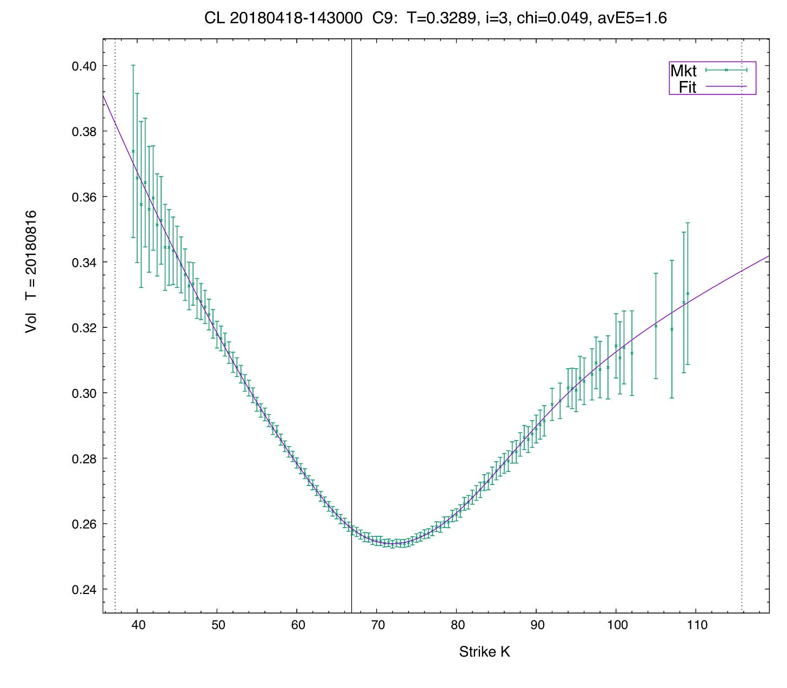](images/5405b028eb18.png)

Above is what one of these looks like. Sadly, C9 curves are from Vola Dynamics so we will be using a 6 parameter model with the Orc model and an even more simplified model with only 3 parameters under the SSVI model. The reason I bring it up of course is to emphasize that unlike equity options, the markets for cryptocurrencies don’t require as complex a model and your time is best spent on figuring out other types of dynamics / strategy optimizations outside of the vol curve - which I won’t delve into now. SSVI is probably a bit too simple, but we’ll get away with it.

In all honesty, even if you were quoting around the Orc Wing model you’d probably be able to do quite well if your parameters had been fit properly (although if you have the opex to spend, get Vola still) in cryptocurrency markets whereas I would reserve the SSVI model for taking only whereas Orc is more capable of both. In equities, you’ll need Vola but that's a whole new ballpark

### Index

---

1. Introduction
2. What’s a Vol Curve?
3. How to fit an SVI model so that it is arbitrage-free
4. Options Data Wrangling
5. Fitting SSVI parameters to the market
6. Patterns in SSVI models and exploiting them
7. When SSVI isn’t enough (it rarely is enough)
8. How to trade parameters themselves

   1. Maker
   2. Taker
9. Appendix: Orc Wing Model Code

### What’s a Vol Curve?

---

Starting with a more proper explanation, a vol curve, like an SSVI curve, is basically a smooth function that maps the strike prices (or moneyness) of options to their implied volatilities in a way that looks realistic and consistent with market data. Think of it this way: for different options on the same underlying asset but with different strike prices, the implied volatility can vary—forming what’s called a “smile” or “skew.” An SSVI curve is one mathematically elegant method to fit (or interpolate) these implied volatility smiles so that they move in a plausible way over time and across strikes, so that traders (or risk managers, really whoever is using it at these prop firms) to price options consistently.

Really, a volatility curve is a generalization across all of the different options prices so we can reduce the dimensionality of what is a very high dimensionality asset class.

If I get filled on an option with X delta, Y gamma, etc etc, do I really want to have to fit a parameter for every single option I am quoting as to how this should change my pricing? And even if I do have that what if the delta or gamma of that option changes - how do those parameters even change? The point is, you just can’t do it the same way as it’s done in equities where you can simply have a pricing model for each different symbol and that’s it. Whether that’s the optimal model is a different question, but importantly - it can be done.

So what are these parameters and what do they represent for each of our models?

Let’s start first with the simpler model, SSVI. We have 3 main parameters: theta, rho, and phi. (k is just the strike in the below formula)

w(k)=θ2[1+ρϕk+(ϕk+ρ)2+1−ρ2]

θ - Theta represents the total implied variance at-the-money. It’s basically the total level of the curve and doesn’t affect the shape of the curve, merely how high it is overall. Here’s what happens when we play around with it theta:

[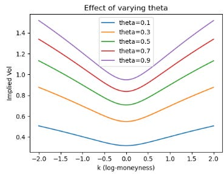](images/8cf53167f785.png)

ρ - Rho represents the skew or the asymmetry of the curve. If we rotate the curve around we are saying put volatility is more expensive than calls or vice versa. It let’s us express whether we think large up or down moves are more likely. If we vary it we get this:

[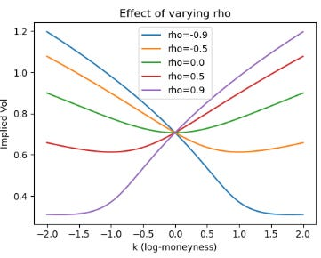](images/42be3be12f75.png)

ϕ - Phi is the convexity of the curve, it changes how likely we think extreme moves are. Here’s what variations look like:

[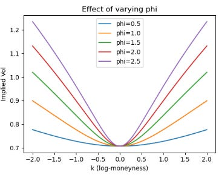](images/f88bd2853e6c.png)

For those following along at home, here’s the code to run:

```
import numpy as np
import matplotlib.pyplot as plt

def ssvi_total_variance(k: float, theta: float, rho: float, phi: float) -> float:
    """
    Returns total implied variance w(k) under the SSVI parameterization:
    w(k) = (theta/2) * [ 1 + rho * phi * k + sqrt((phi*k + rho)**2 + 1 - rho**2) ]
    """
    return (theta / 2.0) * (
        1.0 
        + rho * phi * k 
        + np.sqrt((phi * k + rho) ** 2 + 1 - rho**2)
    )

# Create a range of log-moneyness points k
k_values = np.linspace(-2, 2, 200)

# -------------------------------
# 1) Vary theta
# -------------------------------
theta_list = [0.1, 0.3, 0.5, 0.7, 0.9]
rho_fixed = 0
phi_fixed = 2.00

plt.figure(figsize=(15, 4))

plt.subplot(1, 3, 1)
for theta in theta_list:
    w = ssvi_total_variance(k_values, theta, rho_fixed, phi_fixed)
    implied_vol = np.sqrt(w)  # T = 1 for simplicity
    plt.plot(k_values, implied_vol, label=f"theta={theta:.1f}")
plt.title("Effect of varying theta")
plt.xlabel("k (log-moneyness)")
plt.ylabel("Implied Vol")
plt.legend()

# -------------------------------
# 2) Vary rho
# -------------------------------
rho_list = [-0.9, -0.5, 0.0, 0.5, 0.9]
theta_fixed = 0.5
phi_fixed = 1.0

plt.subplot(1, 3, 2)
for rho in rho_list:
    w = ssvi_total_variance(k_values, theta_fixed, rho, phi_fixed)
    implied_vol = np.sqrt(w)
    plt.plot(k_values, implied_vol, label=f"rho={rho:.1f}")
plt.title("Effect of varying rho")
plt.xlabel("k (log-moneyness)")
plt.ylabel("Implied Vol")
plt.legend()

# -------------------------------
# 3) Vary phi
# -------------------------------
phi_list = [0.5, 1.0, 1.5, 2.0, 2.5]
theta_fixed = 0.5
rho_fixed = 0

plt.subplot(1, 3, 3)
for phi in phi_list:
    w = ssvi_total_variance(k_values, theta_fixed, rho_fixed, phi)
    implied_vol = np.sqrt(w)
    plt.plot(k_values, implied_vol, label=f"phi={phi:.1f}")
plt.title("Effect of varying phi")
plt.xlabel("k (log-moneyness)")
plt.ylabel("Implied Vol")
plt.legend()

plt.tight_layout()
plt.show()
```

### How to fit an SVI model so that it is arbitrage-free

---

The formula I showed earlier is SSVI, it is the re-parameterization of SVI that enforces certain smoothness or arbitrage-free conditions more naturally (especially when done across expiries). In the below article, I showed some code for doing this with the raw SVI model which is generally a simpler model:

[![Finding Fair Value [CODE INSIDE]](images/ea553a6c0209.png)Finding Fair Value [CODE INSIDE][Quant Arb](<https://substack.com/profile/101799233-quant-arb>)·March 10, 2024[Read full story](<https://www.algos.org/p/finding-fair-value-code-inside>)](https://www.algos.org/p/finding-fair-value-code-inside)

I won’t delve into the raw SVI model here since all the code and plots are in this article, but I will show how we fit the SSVI model in this chapter. There is also code for the Orc Wing model in that article, which I will actually toy about with in this article (later chapter).

Let’s first start with a slightly more complicated approach to things before leaving the SVI world for the SSVI and eventually Wing world. We will enforce no-arbitrage constraints using a penalty-based approach. We will enforce both butterfly and calendar arbitrage bounds for our options:

mina,b,σ,ρ,m∑i=1n(wraw(x;a,b,σ,ρ,m)−wmkt)2+λcal⋅max(0,w(x,τi−1)−w(x,τi))2+λfly⋅max(0,−g(x;a,b,σ,ρ,m))2

Let’s explain what these terms mean. First of all we have { a, b, σ, ρ, m }. These are rather simple and are the 5 parameters for the original SVI model (which can be read more about in the article mentioned earlier).

Next, we have w\_raw​( x; a, b, σ, ρ, m ) - this denotes the total implied variance at log-moneyness x. It’s basically just the model’s prediction for how much variance an option at strike x should have.

w\_mkt is the market observed implied variance - our observed data.

∑n i=1​(…)^2 - This is the least-squares term for optimization.

𝜏\_i represents the time to expiry for the i-th maturity.

λ\_cal represents a penalty weight for calendar arbitrage. If the model violates the arbitrage bound that variance should not decrease as time-to-expiration increases, a penalty is applied. The larger this value the more strictly we are enforcing the no-arbitrage bound.

​max(0, w(x, 𝜏\_i − 1​) − w(x, 𝜏\_i​))^2 - this captures the calendar arbitrage violations. For a later maturity compared to an earlier maturity we want w(x, 𝜏\_i − 1​) <= w(x, 𝜏\_i​).

λ\_fly represents the penalty weight for butterfly arbitrage similarly to how we set up the penalty for calendar arbitrage. It ensures the implied volatility curve remains convex enough to avoid negatively priced butterfly spreads. A larger value for this means a more strict enforcement of convexity.

Finally, g(x;a,b,σ,ρ,m) is out function which checks for butterfly arbitrage. If the SVI parameters lead to concavity or other violations, g becomes negative, and you pay a penalty max(0,−g(⋅))^2.

Okay… That’s enough math. Let’s put this into code, here’s our penalty functions:

```
def butterly_arb(a,b,sigma,rho,m, T, m_range):
    g_x = [g(x,a,b,sigma,rho,m) for x in m_range]  
    return sum([max(0, -x) for x in g_x])

def calender_arb(a,b,sigma,rho,m, T, a_prior, b_prior, sigma_prior, rho_prior, m_prior, T_prior, m_range):
    if T_prior == 0:
        return 0

    w = [raw_svi(x,a,b,sigma,rho,m) for x in m_range]
    w_prior = [raw_svi(x,a_prior,b_prior,sigma_prior,rho_prior,m_prior) for x in m_range]

    return sum([max(0, prior-now) for now,prior in zip(w,w_prior)])

def residual_penalty(params,T,params_prior,T_prior, market, m_range, bpen, cpen):
    barb = butterly_arb(*params, T, m_range)
    carb = calender_arb(*params, T, *params_prior,T_prior, m_range)
    w = [raw_svi(x,*params) for x in market.loc[market['time_to_expiry_yrs']==T, 'log_moneyness']]
    iv_actual = market.loc[market['time_to_expiry_yrs']==T, 'mid_iv']
    return iv_actual - (w/T)**0.5 + bpen*barb**2 + cpen*carb**2
```

We can then optimize it as such:

```
# acceptable calender and butterfly arbitrage limit.
b_limit = 0.0005
c_limit = 0.0005

# starting penalty factors
b_penalty = 10
c_penalty = 10

no_runs = 0
keep_going = True
while keep_going:

    no_runs+=1

    T_prior = 0 # used to calc calednder arb (time slice prior needed for comparison)

    # used to keep track of the max arb across all time slices
    max_fly_arb = 0 
    max_cal_arb = 0

    print('----------------------')
    print(f'Run {no_runs}')
    print(f'Butterfly penalty factor = {b_penalty} and calender penalty factor = {c_penalty}')
    print('----------------------')
    print('')

    results = [] # store the results of each time slice optimisation
    prev_result = [0,0,0,0,0] # store the result of the prev timeslice optimisation (needed for calender arb calc)
    for T in btc_market['time_to_expiry_yrs'].unique():

        #use the parameters from the initial optimisation as the initial guess
        initial_guess = param_matrix[T].tolist()

        if T_prior == 0:
            params_prior = [0,0,0,0,0]
        else:
            params_prior = param_matrix[T_prior].tolist()

        result = least_squares(
            residual_penalty, 
            initial_guess, 
            max_nfev=1000, 
            args=(T, params_prior, T_prior, btc_market, m, b_penalty, c_penalty), 
            verbose=0,
        )

        results.append(result)

        print(f'Ran for T = {T:.4f}: SUCCESS')
        b = butterly_arb(*result.x, T, m)
        c = calender_arb(*result.x, T, *prev_result, T_prior, m)

        print(f'butterfly penalty = {b_penalty*b} and calender penalty = {c_penalty*c}')
        print(' ')

        max_fly_arb=max(max_fly_arb,b)
        max_cal_arb=max(max_cal_arb,c)

        T_prior = T
        prev_result = result.x

    print(f'Maximum butterfly arb = {max_fly_arb} and calender arb = {max_cal_arb}')
    print(' ')

    if max_fly_arb > b_limit:
        b_penalty*=10
    if max_cal_arb > c_limit:
        c_penalty*=10

    keep_going = (max_fly_arb>b_limit or max_cal_arb>c_limit)

print(f'Final maximum butterfly arb = {max_fly_arb} and calender arb = {max_cal_arb}')
```

Your outputs should look something like this:

[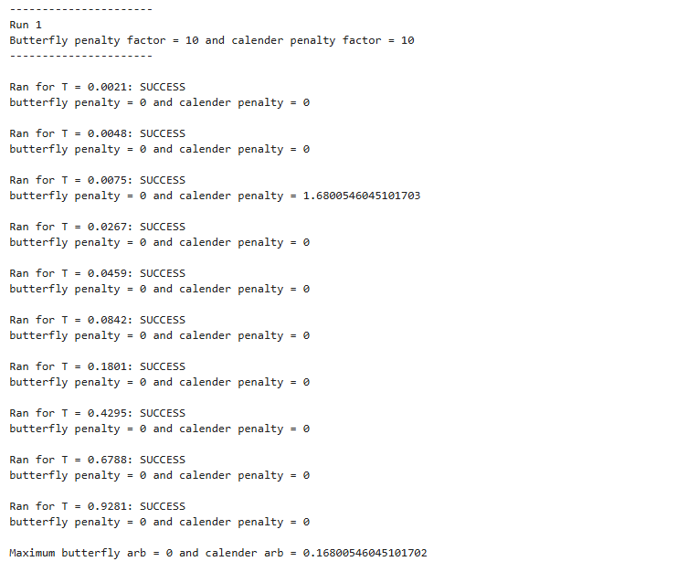](images/5d29731d68e4.png)

If we then use the function create\_parameters\_matrix(btc\_market, results) from the previous article as below:

```
param_matrix_2 = create_parameters_matrix(btc_market, results)
param_matrix_2
```

[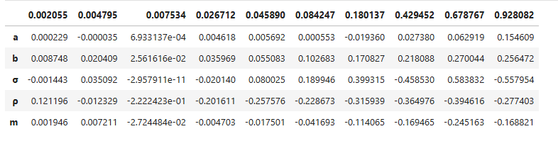](images/af88b64eee6b.png)

Then:

```
m, iv_ssvi_2 = generate_implied_volatility_surface(btc_market, param_matrix_2)


plt.style.use('default')
%matplotlib notebook
plot_surface(btc_market, m , iv_ssvi_2, True)
```

[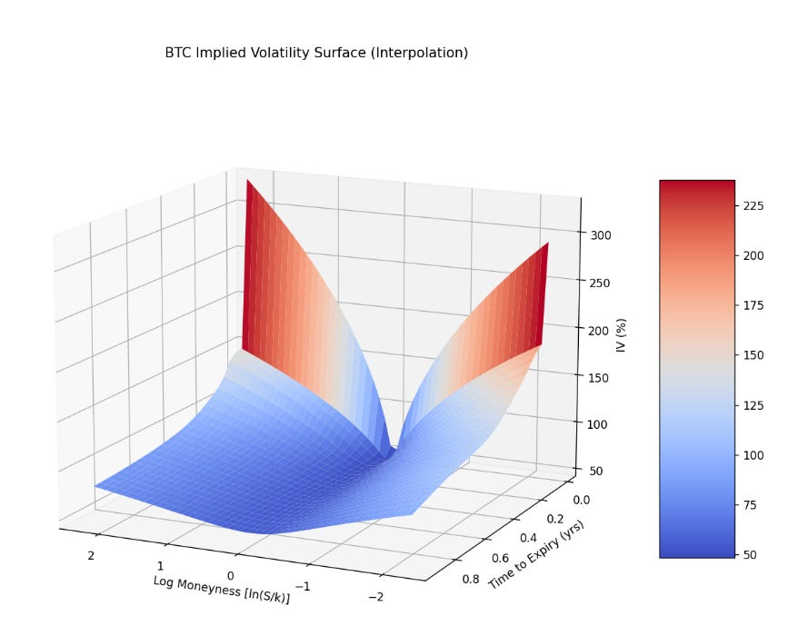](images/db80fdde9ceb.png)

We have successfully optimized an arbitrage free surface for BTC options.

### Options Data Wrangling

---

Now, we will work with the SSVI model from now on since it has less parameters and I generally find it to be more intuitive. More importantly we will start to find patterns in the parameters. If we can find patterns in how the parameters of the model behave over time we can exploit them by trading against the market either as a maker or taker.

But first! Some data wrangling…

Let’s start by scraping some more recent data:

```
from research_tools.scraping.tardis import *
from research_tools.preprocessing.process_options import parse_option_characteristics

exchange='deribit'

options_tickers = get_tickers(exchange, return_type='pandas')

options_tickers = options_tickers[options_tickers['type'] == 'option']
options_tickers = options_tickers[options_tickers['id'].str[:3].isin(["BTC"])]

options_tickers[['base_asset', 'expiry_dt', 'strike_price', 'option_type']] = options_tickers['id'].apply(
    lambda symbol: pd.Series(parse_option_characteristics(symbol, 'DERIBIT'))
)

expiry_dt = '2024-12-01 08:00:00'

options_tickers = options_tickers[options_tickers.expiry_dt == expiry_dt]
options_tickers = options_tickers[options_tickers.availableSince == "2024-11-28 00:00:00+00:00"]

scrape_tardis_data(
    data_types_list=['quotes', 'trades'],
    start_date='2024-11-28',
    end_date='2024-12-02',
    instrument_type='options',
    exchange_names=[exchange],
    tardis_api_key=tardis_api_key,
    symbols_to_scrape=options_tickers['id'].tolist()
)
```

A few functions here come from my personal tooling, here’s get\_tickers and parse\_option\_characteristics:

```
def get_tickers(exchange: str, return_type: str = "list") -> list[dict[str, str]]:
    r = requests.get(f"https://api.tardis.dev/v1/exchanges/{exchange}")
    tickers = r.json()['availableSymbols']

    if return_type == "pandas":
        df = pd.DataFrame(tickers)
        df['availableSince'] = pd.to_datetime(df['availableSince'], errors='coerce')
        df['availableTo'] = pd.to_datetime(df['availableTo'], errors='coerce')
        return df
    elif return_type == "list":
        return tickers
    else:
        raise ValueError("return_type must be either 'pandas' or 'list'")

def parse_option_characteristics(symbol: str, exchange: str) -> list[tuple[str, pd.Timestamp, float, str]]:
    exchange = exchange.upper()
    split_symbol = symbol.split('-')

    exchange_parsers = {
        "DERIBIT": (0, 1, 2, 3, True, 8),
        "OKEX": (0, 2, 3, 4, False, 8),
        "OKX": (0, 2, 3, 4, False, 8),
        "BYBIT": (0, 1, 2, 3, True, 8),
        "BINANCE": (0, 1, 2, 3, False, 8),
    }

    if exchange not in exchange_parsers:
        raise ValueError(f"Unsupported exchange: {exchange}")

    base_idx, date_idx, strike_idx, type_idx, dayfirst, hour_offset = exchange_parsers[exchange]

    base_asset = split_symbol[base_idx]
    expiry_dt = pd.to_datetime(split_symbol[date_idx], dayfirst=dayfirst) + timedelta(hours=hour_offset)
    strike_price = float(split_symbol[strike_idx])
    option_type = split_symbol[type_idx]

    return [base_asset, expiry_dt, strike_price, option_type]
```

The scrape\_tardis\_data function is quite long and has many different functions attached (designed so that you can put in symbols in Bybit or really any exchanges format and specify Gate (or any exchange) as the exchange and it’ll still understand it - so lots of conversion functions). The idea of what the function does should be quite self-explanatory though.

I also scrape ‘quotes’, ‘trades’, and importantly ‘derivative\_ticker’ so we can use the index price to tell whether our options are ITM, ATM, or OTM (the quotes and trades are just in case I need them).

```
scrape_tardis_data(
    data_types_list=['quotes', 'trades', 'derivative_ticker'],
    start_date='2024-11-28',
    end_date='2024-12-02',
    instrument_type='futures',
    exchange_names=['deribit'],
    tardis_api_key=tardis_api_key,
    symbols_to_scrape=['BTC-PERPETUAL', 'ETH-PERPETUAL']
)
```

Now, we load it in. My tooling is setup so it figures out the right folder to place everything in and puts it in there - however you may have a slightly different setup so hence feel free to modify the code:

```
symbols = options_tickers['id'].tolist()

options_data = {}

for symbol in symbols:
    data_folder_path = Path(os.path.join(base_folder_path, symbol, 'quotes'))
    gz_files = list(data_folder_path.glob('*.csv.gz'))
    curr_df = pd.DataFrame()
    for gz_file in gz_files:
        temp_df = pd.read_csv(gz_file, compression='gzip')
        if not temp_df.empty:
            temp_df['timestamp'] = pd.to_datetime(temp_df['timestamp'], unit='us')
            temp_df = temp_df.set_index('timestamp', drop=True)
            curr_df = pd.concat([curr_df, temp_df], axis=0).sort_index()
    options_data[symbol] = curr_df
```

I’ll load in the index price data below:

```
def load_data(
    path: str,
    start_date: str,
    end_date: str,
) -> pd.DataFrame:
    start_date = dt.strptime(start_date, "%Y-%m-%d")
    end_date = dt.strptime(end_date, "%Y-%m-%d")
    folder_path = Path(path)
    gz_files = list(folder_path.glob("*.csv.gz"))

    indexer = 3 if "derivative_ticker" in path else 2

    to_read = []
    for gz_file in gz_files:
        file_date_str = gz_file.stem.split('_')[indexer]
        file_date = dt.strptime(file_date_str, "%Y-%m-%d")

        if start_date <= file_date <= end_date:
            to_read.append(gz_file)

    dfs = []
    for gz_file in tqdm(to_read):
        dfs.append(pd.read_csv(gz_file, compression='gzip'))

    if dfs:
        return pd.concat(dfs)
    else:
        return pd.DataFrame()


index_px = load_data(base_asset_path, start_date='2024-11-28', end_date='2024-12-02')


index_px = index_px.dropna(axis=1)
index_px['timestamp'] = pd.to_datetime(index_px['timestamp'], unit='us')
index_px = index_px.set_index('timestamp', drop=True)
index_px = index_px.resample('1min', closed='right', label='right').last().ffill()
index_px
```

[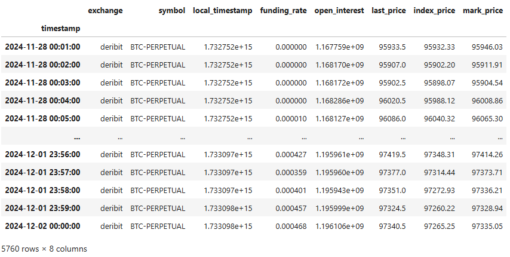](images/8585695ec3b9.png)

We’ve now done the things you have to do basically every time which is to scrape and load the data. Now we just need a couple more functions. We need to be able to iterate through it at regular intervals (say every 5 mins) and get the latest data for every symbol, so there’s one of our functions. We also need a function to filter out OTM options.

Starting with the function to get OTM options:

```
def get_otm_options(index_price: float, symbols: list[str]) -> list[str]:
    return [
        s for s in symbols
        if (s.endswith("C") and float(s.split("-")[2]) >= index_price)
        or (s.endswith("P") and float(s.split("-")[2]) <= index_price)
    ]
```

and a function for getting our options data at the timestamp:

```
def get_quotes_for_timestamp(options_data: dict[str, pd.DataFrame], symbols: list[str], query_timestamp: pd.Timestamp) -> pd.DataFrame:
    rows = []
    for symbol in symbols:
        df = options_data[symbol]
        df = df.sort_index()
        df_subset = df.loc[:query_timestamp]
        if not df_subset.empty:
            row = df_subset.iloc[-1].copy()
            row['symbol_name'] = symbol
            rows.append(row)
        else:
            pass
    if rows:
        result_df = pd.DataFrame(rows)
    else:
        result_df = pd.DataFrame()
    return result_df
```

Now putting it all together:

```
ts = '2024-11-28 8:30:00'
current_index_price = index_px.loc[ts].index_price
otm_options = get_otm_options(current_index_price, symbols)
get_quotes_for_timestamp(options_data, otm_options, ts)
```

[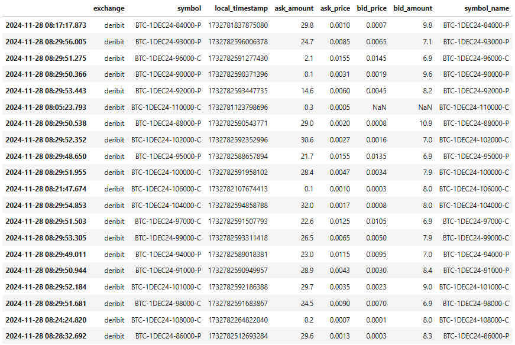](images/3febde05efe5.png)

Now, because we are working with Deribit we need to adjust prices from BTC terms into the USD space, which we do below:

```
def adjust_prices(index_price: float, current_df: pd.DataFrame) -> pd.DataFrame:
    current_df['ask_price'] *= index_price
    current_df['bid_price'] *= index_price
    return current_df


current_df = get_quotes_for_timestamp(options_data, otm_options, ts)
current_df = adjust_prices(current_index_price, current_df)
current_df
```

[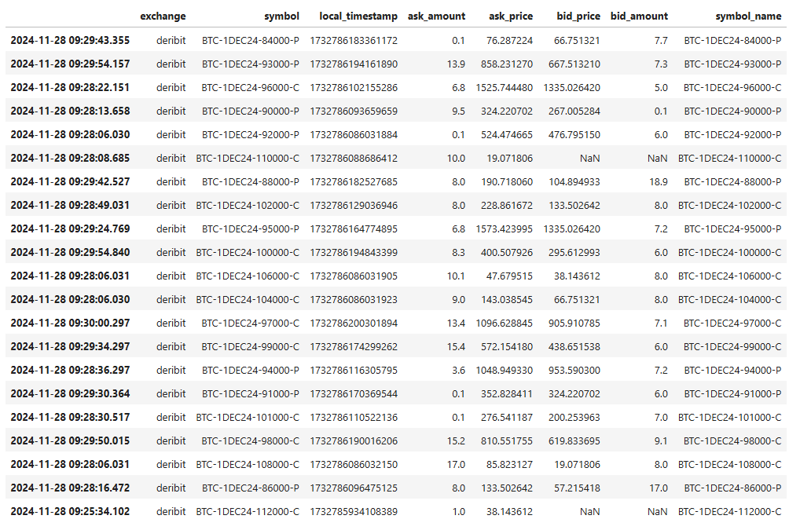](images/87326ae96b27.png)

I’d say our data is now sufficiently wrangled - I can definitely fit something to this… which segways nicely into the next chapter!

### Fitting SSVI parameters to the market

---

I have skipped precalculating the implied volatilities in a vectorized fashion using py\_vollib\_vectorized which you could do if you wanted to optimize for speed, and do that as part of the preprocessing steps. Instead, we use the non-vectorized version.

```
''' the function itself '''

from scipy.optimize import minimize

def ssvi_total_variance(k: float, theta: float, rho: float, m: float) -> float:
    a = (k - m) / np.sqrt(theta)
    return theta * 0.5 * (
        1.0 + rho * a + np.sqrt(a**2 + 2.0 * (1.0 - rho**2))
    )

def objective(params: np.ndarray, ks: np.ndarray, w_market: np.ndarray) -> float:
    theta, rho, m = params
    w_model = [ssvi_total_variance(k, theta, rho, m) for k in ks]
    return np.sum((w_market - w_model) ** 2)

def fit_ssvi_from_df(
    df: pd.DataFrame,
    expiry_dt: pd.Timestamp,
    index_price: float
) -> tuple[dict[str, float], Callable[[float], float]]:
    df = df.dropna(subset=["bid_price", "ask_price"])
    if df.empty:
        return {}, lambda x: np.nan
    t = (expiry_dt - df.index[-1]).total_seconds() / (365.0 * 24.0 * 3600.0)
    df["mid_price"] = 0.5 * (df["ask_price"] + df["bid_price"])
    df = df.dropna(subset=["mid_price"])
    def otype(s: str) -> str:
        return "c" if s.endswith("C") else "p"
    ks, w_market = [], []
    ivs = {}
    for _, row in df.iterrows():
        s = row["symbol"]
        k_str = s.split("-")[2]
        k = float(k_str)
        try:
            iv = implied_volatility(
                row["mid_price"],
                index_price,
                k,
                t,
                0.0,
                otype(s)
            )
            bid_iv = implied_volatility(
                row["bid_price"],
                index_price,
                k,
                t,
                0.0,
                otype(s)
            )
            ask_iv = implied_volatility(
                row["ask_price"],
                index_price,
                k,
                t,
                0.0,
                otype(s)
            )
            ks.append(np.log(k / index_price))
            w_market.append(iv**2 * t)
            ivs[k] = (bid_iv, iv, ask_iv)
        except:
            pass
    if not ks:
        return {}, lambda x: np.nan
    ks = np.array(ks)
    w_market = np.array(w_market)
    x0 = np.array([0.1, 0.0, 0.0])
    bounds = [(1e-8, None), (-0.999, 0.999), (None, None)]
    res = minimize(objective, x0, args=(ks, w_market), bounds=bounds, method="L-BFGS-B")
    theta, rho, m = res.x
    def ssvi_iv(k_log: float) -> float:
        return np.sqrt(ssvi_total_variance(k_log, theta, rho, m) / t)
    return {"theta": theta, "rho": rho, "m": m}, ssvi_iv, ivs


''' running the function '''

expiry_dt = pd.to_datetime('2024-12-01 08:00:00') # this var was an str before, now its a datetime
p, curve, mkt_ivs = fit_ssvi_from_df(current_df, expiry_dt, current_index_price)


''' this code is for plotting it '''

strikes = current_df['symbol'].str.split("-").str[2].astype(float).sort_values().tolist()
curve_vals = [curve(np.log(k / current_index_price)) for k in strikes]
log_strikes = [np.log(k / current_index_price) for k in strikes]

sorted_moneyness = sorted(mkt_ivs)  
x_vals = [np.log(k / current_index_price) for k in sorted_moneyness]

bid_vals = [mkt_ivs[k][0] for k in sorted_moneyness]
mid_vals = [mkt_ivs[k][1] for k in sorted_moneyness]
ask_vals = [mkt_ivs[k][2] for k in sorted_moneyness]

lower_err = [mid - bid for mid, bid in zip(mid_vals, bid_vals)]
upper_err = [ask - mid for ask, mid in zip(ask_vals, mid_vals)]
y_err = [lower_err, upper_err]

plt.figure(figsize=(10, 6))
plt.plot(log_strikes, curve_vals, label='Fitted Curve', color='blue', linewidth=2)
plt.errorbar(
    x_vals, mid_vals, yerr=y_err, fmt='o', 
    ecolor='gray', capsize=4, elinewidth=1, 
    markeredgecolor='black', markerfacecolor='red', 
    label='Market IV (mid) with bid/ask'
)
plt.xlabel('Log Moneyness (log(K / S))')
plt.ylabel('Implied Volatility')
plt.title('Implied Volatility vs. Log-Moneyness')
plt.legend()
plt.show()
```

[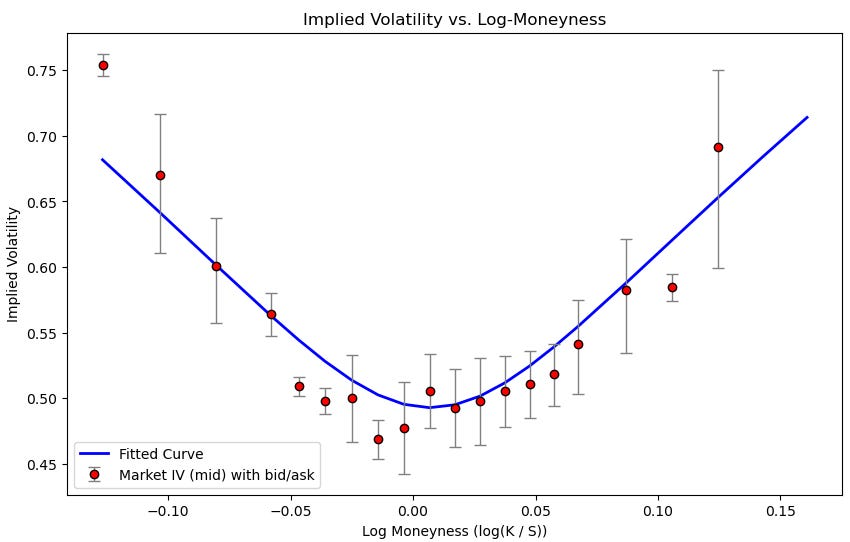](images/5c04a19ddb1d.png)

Cool looking graph, but now let’s turn it into a piece of data that’s very useful to us…

```
''' you may want to do this prior because this function will bark at you '''

import warnings
warnings.filterwarnings("ignore")


params = {}
for ts in tqdm(timestamps):
    current_index_price = index_px.loc[ts].index_price
    otm_options = get_otm_options(current_index_price, symbols)
    current_df = get_quotes_for_timestamp(options_data, otm_options, ts)
    current_df = adjust_prices(current_index_price, current_df)
    p, curve, mkt_ivs = fit_ssvi_from_df(current_df, expiry_dt, current_index_price)
    params[ts] = p
```

[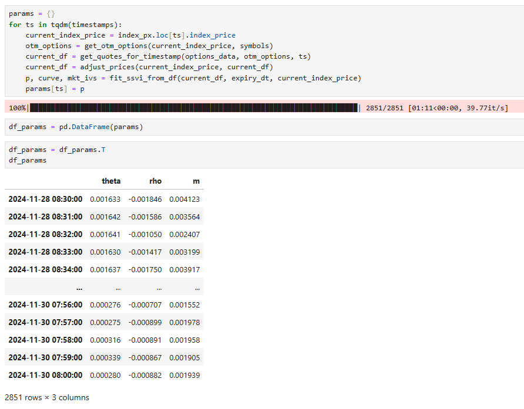](images/4a0f54214ef7.png)

See where this is going… we can now start trying to predict these parameters.

### Patterns in SSVI models and exploiting them

---

When we plot Phi (m) we get:

[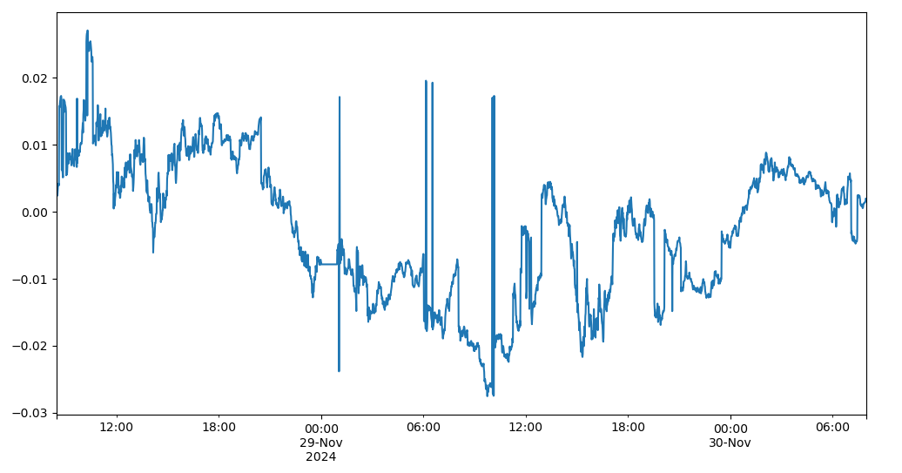](images/fc7001fa3a76.png)

When we plot rho we get:

[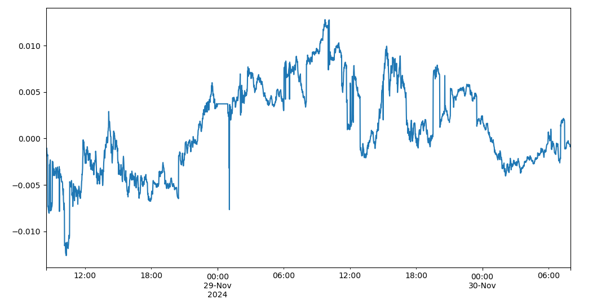](images/a5dc7d84bbc9.png)

Visibly we can see sharp spikes which often mean revert in rho and phi. We don’t have long enough of a sample to properly model this but I will give the hint: these parameters are mean-reverting across various timeframes.

Keep in mind some spikes can also just be because the quotes have disappeared for some of these options, so it is better to use mark prices instead of mid prices. That requires the options chain feed from Tardis which is a bit messier. The mean reversion effect is definitely present though.

What predictors can we use to forecast the changes in these parameters other than just the historical time series of the parameters themselves?

1. Changes in the underlying
2. Trades
3. Changes in other parameters

We actually talked about how to model the first one of these in the previous article I mentioned earlier, but for trades, let’s talk about how these would be incorporated.

You’ll find that the more OTM the trade is the more it will affect rho (skew). That is to say that OTM trades make the curve rotate around ATM. OTM trades also increase the phi (convexity) of the curve when they are buys. All trades affect theta (overall volatility level) based on whether they are buys or sells. You can conduct this analysis as a lead-lag analysis between these trades occurring and the parameters changing for yourself and you will observe these results.

Finally, you’ll have fit a model for how to incorporate a trade into your curve. Congratulations you have a pricing model that goes beyond simply quoting around the market.

### When SSVI isn’t enough (it rarely is enough)

---

Let’s fit the wing model. The code was provided in the previous model for the Wing model but I will put it in the appendix this time as a copy paste able cell.

To start, we need a function to pre-process the data into a format that the Wing Model likes:

```
from py_vollib.black_scholes.greeks.numerical import vega as bs_vega # use numerical not analytical (I had issues with analytical)

def prepare_data_for_wing_model(
    df: pd.DataFrame,
    expiry_dt: pd.Timestamp,
    index_price: float,
    interest_rate: float = 0.0
) -> pd.DataFrame:
    df = df.copy()
    df["mid_price"] = 0.5 * (df["ask_price"] + df["bid_price"])
    df["strike"] = df["symbol"].apply(lambda s: float(s.split("-")[2]))
    index_price = float(index_price)
    def opt_type(sym: str) -> str:
        return "c" if sym.endswith("C") else "p"

    iv_list, vega_list, x_list = [], [], []
    for idx, row in df.iterrows():
        t = (expiry_dt - idx).total_seconds() / (365.0 * 24.0 * 3600.0)
        mid = row["mid_price"]
        strike = row["strike"]
        if pd.isna(mid):
            iv_list.append(np.nan)
            vega_list.append(np.nan)
            x_list.append(np.nan)
            continue
        try:
            iv_ = implied_volatility(mid, index_price, strike, t, interest_rate, opt_type(row["symbol"]))  
            v_ = bs_vega(opt_type(row["symbol"]), index_price, strike, t, interest_rate, iv_)
            x_ = np.log(strike / index_price)
        except:
            iv_ = np.nan
            v_ = np.nan
            x_ = np.nan
        iv_list.append(iv_)
        vega_list.append(v_)
        x_list.append(x_)

    df["iv"] = iv_list
    df["vega"] = vega_list
    df["x"] = x_list
    df.dropna(subset=["iv", "vega", "x"], inplace=True)
    return df


prepped_wing_df = prepare_data_for_wing_model(current_df, expiry_dt, current_index_price)

x_array   = prepped_wing_df["x"].values
iv_array  = prepped_wing_df["iv"].values
vega_array= prepped_wing_df["vega"].values
```

And to plot it:

```
params, loss, arb_indicator = ArbitrageFreeWingModel.calibrate(
    x_array,       # log-moneyness array (e.g. np.log(K_i / S))
    iv_array,      # implied vol array
    vega_array,    # vega array
    dc=-0.2,
    uc=0.2,
    dsm=0.5,
    usm=0.5,
    epochs=10,
    use_constraints=True
)
sc, pc, cc = params


interp_func = interp1d(
    x_array,
    iv_array,
    kind="cubic",
    fill_value="extrapolate"
)
vc = interp_func(0.0)  # volatility at x=0 (ATM log-moneyness)

dc  = -0.2
uc  =  0.2
dsm =  0.5
usm =  0.5

x_plot = np.linspace(min(x_vals) - 0.05, max(x_vals) + 0.05, 200)

wing_ivs = ArbitrageFreeWingModel.skew(
    x_plot,  # array of log-moneyness
    vc,      # ATM vol from interpolation
    sc, pc, cc,
    dc, uc, dsm, usm
)

plt.figure(figsize=(10, 6))

plt.plot(
    x_plot, wing_ivs,
    label="Wing Model Fit",
    color="blue", linewidth=2
)

plt.errorbar(
    x_vals, mid_vals,
    yerr=y_err,  
    fmt="o",
    ecolor="gray",
    capsize=4,
    elinewidth=1,
    markeredgecolor="black",
    markerfacecolor="red",
    label="Market IV (mid) with bid/ask"
)

plt.xlabel("Log Moneyness (log(K/S))")
plt.ylabel("Implied Volatility")
plt.title("Wing Model vs. Market Implied Volatility")
plt.legend()
plt.show()
```

[](images/4566d098f0dd.png)

As we can see, it’s a much much better fit an our SSVI model. We were slightly naughty in the code and used the SSVI’s output for the bid\_iv and ask\_iv so you do need to run the SSVI cell beforehand - you can also just modify the code.

When options get close to expiry you will have a hard time fitting them with the Wing model, but this is generally true of most models.

I won’t dive into it, but if you want to start market making options - you would do what we did with the SSVI model for the Wing model and try to see how trades change the parameters as well as if there are any patterns in them over time. For example, when convexity increases you will tend to see the level of very OTM options decline a bit relative to this gain just because these options become almost ‘too expensive’ for people to want to trade otherwise.

### How to trade parameters themselves

---

What do you mean you can trade these parameters? Well, of course you can, if your parameters disagree with the market then your prices in your curve will be different than the market prices and you can express this either as a maker or taker.

You can either market make around your curve and as your prices disagree with the market you will pickup inventory (by being more aggressive on those options) and pickup what ideally should be profitable inventory.

As a taker, it is a little more complicated, but we can estimate the edge for every single option based on how we differ from the market and then from there we can optimize for a minimization of the net greeks of our portfolio whilst maximizing edge. It’s basically a delta neutral portfolio optimization task. The issue then becomes trading into it - which is quite complicated but firms like Optiver and IMC do manage it (although usually through an expression of skews in their market maker instead as this is more cost effective).

In fact, even when taking you’ll need to try and make into most legs just because otherwise it’ll destroy all your edge.

### Appendix: Orc Wing Model Code

---

```
from functools import partial

from numpy import ndarray, array, arange, zeros, ones, argmin, minimum, maximum, clip
from numpy.linalg import norm
from numpy.random import normal
from scipy.interpolate import interp1d
from scipy.optimize import minimize


class WingModel(object):
    @staticmethod
    def skew(moneyness: ndarray, vc: float, sc: float, pc: float, cc: float, dc: float, uc: float, dsm: float,
             usm: float) -> ndarray:
        """

        :param moneyness: converted strike, moneyness
        :param vc:
        :param sc:
        :param pc:
        :param cc:
        :param dc:
        :param uc:
        :param dsm:
        :param usm:
        :return:
        """
        assert -1 < dc < 0
        assert dsm > 0
        assert 1 > uc > 0
        assert usm > 0
        assert 1e-6 < vc < 10  # The numerical optimization process is stable
        assert -1e6 < sc < 1e6
        assert dc * (1 + dsm) <= dc <= 0 <= uc <= uc * (1 + usm)

        # volatility at this converted strike, vol(x) is then calculated as follows:
        vol_list = []
        for x in moneyness:
            # volatility at this converted strike, vol(x) is then calculated as follows:
            if x < dc * (1 + dsm):
                vol = vc + dc * (2 + dsm) * (sc / 2) + (1 + dsm) * pc * pow(dc, 2)
            elif dc * (1 + dsm) < x <= dc:
                vol = vc - (1 + 1 / dsm) * pc * pow(dc, 2) - sc * dc / (2 * dsm) + (1 + 1 / dsm) * (
                        2 * pc * dc + sc) * x - (pc / dsm + sc / (2 * dc * dsm)) * pow(x, 2)
            elif dc < x <= 0:
                vol = vc + sc * x + pc * pow(x, 2)
            elif 0 < x <= uc:
                vol = vc + sc * x + cc * pow(x, 2)
            elif uc < x <= uc * (1 + usm):
                vol = vc - (1 + 1 / usm) * cc * pow(uc, 2) - sc * uc / (2 * usm) + (1 + 1 / usm) * (
                        2 * cc * uc + sc) * x - (cc / usm + sc / (2 * uc * usm)) * pow(x, 2)
            elif uc * (1 + usm) < x:
                vol = vc + uc * (2 + usm) * (sc / 2) + (1 + usm) * cc * pow(uc, 2)
            else:
                raise ValueError("x value error!")
            vol_list.append(vol)
        return array(vol_list)

    @classmethod
    def loss_skew(cls, params: [float, float, float], x: ndarray, iv: ndarray, vega: ndarray, vc: float, dc: float,
                  uc: float, dsm: float, usm: float):
        """

        :param params: sc, pc, cc
        :param x:
        :param iv:
        :param vega:
        :param vc:
        :param dc:
        :param uc:
        :param dsm:
        :param usm:
        :return:
        """
        sc, pc, cc = params
        vega = vega / vega.max()
        value = cls.skew(x, vc, sc, pc, cc, dc, uc, dsm, usm)
        return norm((value - iv) * vega, ord=2, keepdims=False)

    @classmethod
    def calibrate_skew(cls, x: ndarray, iv: ndarray, vega: ndarray, dc: float = -0.2, uc: float = 0.2, dsm: float = 0.5,
                       usm: float = 0.5, is_bound_limit: bool = False,
                       epsilon: float = 1e-16, inter: str = "cubic"):
        """

        :param x: moneyness
        :param iv:
        :param vega:
        :param dc:
        :param uc:
        :param dsm:
        :param usm:
        :param is_bound_limit:
        :param epsilon:
        :param inter: cubic inter
        :return:
        """

        vc = interp1d(x, iv, kind=inter, fill_value="extrapolate")([0])[0]

        # init guess for sc, pc, cc
        if is_bound_limit:
            bounds = [(-1e3, 1e3), (-1e3, 1e3), (-1e3, 1e3)]
        else:
            bounds = [(None, None), (None, None), (None, None)]
        initial_guess = normal(size=3)

        args = (x, iv, vega, vc, dc, uc, dsm, usm)
        residual = minimize(cls.loss_skew, initial_guess, args=args, bounds=bounds, tol=epsilon, method="SLSQP")
        assert residual.success
        return residual.x, residual.fun

    @staticmethod
    def sc(sr: float, scr: float, ssr: float, ref: float, atm: ndarray or float) -> ndarray or float:
        return sr - scr * ssr * ((atm - ref) / ref)

    @classmethod
    def loss_scr(cls, x: float, sr: float, ssr: float, ref: float, atm: ndarray, sc: ndarray) -> float:
        return norm(sc - cls.sc(sr, x, ssr, ref, atm), ord=2, keepdims=False)

    @classmethod
    def fit_scr(cls, sr: float, ssr: float, ref: float, atm: ndarray, sc: ndarray,
                epsilon: float = 1e-16) -> [float, float]:
        init_value = array([0.01])
        residual = minimize(cls.loss_scr, init_value, args=(sr, ssr, ref, atm, sc), tol=epsilon, method="SLSQP")
        assert residual.success
        return residual.x, residual.fun

    @staticmethod
    def vc(vr: float, vcr: float, ssr: float, ref: float, atm: ndarray or float) -> ndarray or float:
        return vr - vcr * ssr * ((atm - ref) / ref)

    @classmethod
    def loss_vc(cls, x: float, vr: float, ssr: float, ref: float, atm: ndarray, vc: ndarray) -> float:
        return norm(vc - cls.vc(vr, x, ssr, ref, atm), ord=2, keepdims=False)

    @classmethod
    def fit_vcr(cls, vr: float, ssr: float, ref: float, atm: ndarray, vc: ndarray,
                epsilon: float = 1e-16) -> [float, float]:
        init_value = array([0.01])
        residual = minimize(cls.loss_vc, init_value, args=(vr, ssr, ref, atm, vc), tol=epsilon, method="SLSQP")
        assert residual.success
        return residual.x, residual.fun

    @classmethod
    def wing(cls, x: ndarray, ref: float, atm: float, vr: float, vcr: float, sr: float, scr: float, ssr: float,
             pc: float, cc: float, dc: float, uc: float, dsm: float, usm: float) -> ndarray:
        """
        wing model

        :param x:
        :param ref:
        :param atm:
        :param vr:
        :param vcr:
        :param sr:
        :param scr:
        :param ssr:
        :param pc:
        :param cc:
        :param dc:
        :param uc:
        :param dsm:
        :param usm:
        :return:
        """
        vc = cls.vc(vr, vcr, ssr, ref, atm)
        sc = cls.sc(sr, scr, ssr, ref, atm)
        return cls.skew(x, vc, sc, pc, cc, dc, uc, dsm, usm)


class ArbitrageFreeWingModel(WingModel):
    @classmethod
    def calibrate(cls, x: ndarray, iv: ndarray, vega: ndarray, dc: float = -0.2, uc: float = 0.2, dsm: float = 0.5,
                  usm: float = 0.5, is_bound_limit: bool = False, epsilon: float = 1e-16, inter: str = "cubic",
                  level: float = 0, method: str = "SLSQP", epochs: int = None, show_error: bool = False,
                  use_constraints: bool = False) -> ([float, float, float], float):
        """

        :param x:
        :param iv:
        :param vega:
        :param dc:
        :param uc:
        :param dsm:
        :param usm:
        :param is_bound_limit:
        :param epsilon:
        :param inter:
        :param level:
        :param method:
        :param epochs:
        :param show_error:
        :param use_constraints:
        :return:
        """
        vega = clip(vega, 1e-6, 1e6)
        iv = clip(iv, 1e-6, 10)

        # init guess for sc, pc, cc
        if is_bound_limit:
            bounds = [(-1e3, 1e3), (-1e3, 1e3), (-1e3, 1e3)]
        else:
            bounds = [(None, None), (None, None), (None, None)]

        vc = interp1d(x, iv, kind=inter, fill_value="extrapolate")([0])[0]
        constraints = dict(type='ineq', fun=partial(cls.constraints, args=(x, vc, dc, uc, dsm, usm), level=level))
        args = (x, iv, vega, vc, dc, uc, dsm, usm)
        if epochs is None:
            if use_constraints:
                residual = minimize(cls.loss_skew, normal(size=3), args=args, bounds=bounds, constraints=constraints,
                                    tol=epsilon, method=method)
            else:
                residual = minimize(cls.loss_skew, normal(size=3), args=args, bounds=bounds, tol=epsilon, method=method)

            if residual.success:
                sc, pc, cc = residual.x
                arbitrage_free = cls.check_butterfly_arbitrage(sc, pc, cc, dc, dsm, uc, usm, x, vc)
                return residual.x, residual.fun, arbitrage_free
            else:
                epochs = 10
                if show_error:
                    print("calibrate wing-model wrong, use epochs = 10 to find params! params: {}".format(residual.x))

        if epochs is not None:
            params = zeros([epochs, 3])
            loss = ones([epochs, 1])
            for i in range(epochs):
                if use_constraints:
                    residual = minimize(cls.loss_skew, normal(size=3), args=args, bounds=bounds,
                                        constraints=constraints,
                                        tol=epsilon, method="SLSQP")
                else:
                    residual = minimize(cls.loss_skew, normal(size=3), args=args, bounds=bounds, tol=epsilon,
                                        method="SLSQP")
                if not residual.success and show_error:
                    print("calibrate wing-model wrong, wrong @ {} /10! params: {}".format(i, residual.x))
                params[i] = residual.x
                loss[i] = residual.fun
            min_idx = argmin(loss)
            sc, pc, cc = params[min_idx]
            loss = loss[min_idx][0]
            arbitrage_free = cls.check_butterfly_arbitrage(sc, pc, cc, dc, dsm, uc, usm, x, vc)
            return (sc, pc, cc), loss, arbitrage_free

    @classmethod
    def constraints(cls, x: [float, float, float], args: [ndarray, float, float, float, float, float],
                    level: float = 0) -> float:
        """Butterfly spreads are not arbitrage-bound

        :param x: guess values, sc, pc, cc
        :param args:
        :param level:
        :return:
        """
        sc, pc, cc = x
        moneyness, vc, dc, uc, dsm, usm = args

        if level == 0:
            pass
        elif level == 1:
            moneyness = arange(-1, 1.01, 0.01)
        else:
            moneyness = arange(-1, 1.001, 0.001)

        return cls.check_butterfly_arbitrage(sc, pc, cc, dc, dsm, uc, usm, moneyness, vc)

    """Butterfly spreads have no arbitrage constraints
    """

    @staticmethod
    def left_parabolic(sc: float, pc: float, x: float, vc: float) -> float:
        """

        :param sc:
        :param pc:
        :param x:
        :param vc:
        :return:
        """
        return pc - 0.25 * (sc + 2 * pc * x) ** 2 * (0.25 + 1 / (vc + sc * x + pc * x * x)) + (
                1 - 0.5 * x * (sc + 2 * pc * x) / (vc + sc * x + pc * x * x)) ** 2

    @staticmethod
    def right_parabolic(sc: float, cc: float, x: float, vc: float) -> float:
        """

        :param sc:
        :param cc:
        :param x:
        :param vc:
        :return:
        """
        return cc - 0.25 * (sc + 2 * cc * x) ** 2 * (0.25 + 1 / (vc + sc * x + cc * x * x)) + (
                1 - 0.5 * x * (sc + 2 * cc * x) / (vc + sc * x + cc * x * x)) ** 2

    @staticmethod
    def left_smoothing_range(sc: float, pc: float, dc: float, dsm: float, x: float, vc: float) -> float:
        a = - pc / dsm - 0.5 * sc / (dc * dsm)

        b1 = -0.25 * ((1 + 1 / dsm) * (2 * dc * pc + sc) - 2 * (pc / dsm + 0.5 * sc / (dc * dsm)) * x) ** 2
        b2 = -dc ** 2 * (1 + 1 / dsm) * pc - 0.5 * dc * sc / dsm + vc + (1 + 1 / dsm) * (2 * dc * pc + sc) * x - (
                pc / dsm + 0.5 * sc / (dc * dsm)) * x ** 2
        b2 = (0.25 + 1 / b2)
        b = b1 * b2

        c1 = x * ((1 + 1 / dsm) * (2 * dc * pc + sc) - 2 * (pc / dsm + 0.5 * sc / (dc * dsm)) * x)
        c2 = 2 * (-dc ** 2 * (1 + 1 / dsm) * pc - 0.5 * dc * sc / dsm + vc + (1 + 1 / dsm) * (2 * dc * pc + sc) * x - (
                pc / dsm + 0.5 * sc / (dc * dsm)) * x ** 2)
        c = (1 - c1 / c2) ** 2
        return a + b + c

    @staticmethod
    def right_smoothing_range(sc: float, cc: float, uc: float, usm: float, x: float, vc: float) -> float:
        a = - cc / usm - 0.5 * sc / (uc * usm)

        b1 = -0.25 * ((1 + 1 / usm) * (2 * uc * cc + sc) - 2 * (cc / usm + 0.5 * sc / (uc * usm)) * x) ** 2
        b2 = -uc ** 2 * (1 + 1 / usm) * cc - 0.5 * uc * sc / usm + vc + (1 + 1 / usm) * (2 * uc * cc + sc) * x - (
                cc / usm + 0.5 * sc / (uc * usm)) * x ** 2
        b2 = (0.25 + 1 / b2)
        b = b1 * b2

        c1 = x * ((1 + 1 / usm) * (2 * uc * cc + sc) - 2 * (cc / usm + 0.5 * sc / (uc * usm)) * x)
        c2 = 2 * (-uc ** 2 * (1 + 1 / usm) * cc - 0.5 * uc * sc / usm + vc + (1 + 1 / usm) * (2 * uc * cc + sc) * x - (
                cc / usm + 0.5 * sc / (uc * usm)) * x ** 2)
        c = (1 - c1 / c2) ** 2
        return a + b + c

    @staticmethod
    def left_constant_level() -> float:
        return 1

    @staticmethod
    def right_constant_level() -> float:
        return 1

    @classmethod
    def _check_butterfly_arbitrage(cls, sc: float, pc: float, cc: float, dc: float, dsm: float, uc: float, usm: float,
                                   x: float, vc: float) -> float:
        """Check for butterfly spread arbitrage opportunities to ensure fit

        time-slice iv-curve

        It is a no-arbitrage (butterfly-free spread, static arbitrage) curve

        :param sc:
        :param pc:
        :param cc:
        :param dc:
        :param dsm:
        :param uc:
        :param usm:
        :param x:
        :param vc:
        :return:
        """
        # if x < dc * (1 + dsm):
        #     return cls.left_constant_level()
        # elif dc * (1 + dsm) < x <= dc:
        #     return cls.left_smoothing_range(sc, pc, dc, dsm, x, vc)
        # elif dc < x <= 0:
        #     return cls.left_parabolic(sc, pc, x, vc)
        # elif 0 < x <= uc:
        #     return cls.right_parabolic(sc, cc, x, vc)
        # elif uc < x <= uc * (1 + usm):
        #     return cls.right_smoothing_range(sc, cc, uc, usm, x, vc)
        # elif uc * (1 + usm) < x:
        #     return cls.right_constant_level()
        # else:
        #     raise ValueError("x value error!")

        if dc < x <= 0:
            return cls.left_parabolic(sc, pc, x, vc)
        elif 0 < x <= uc:
            return cls.right_parabolic(sc, cc, x, vc)
        else:
            return 0

    @classmethod
    def check_butterfly_arbitrage(cls, sc: float, pc: float, cc: float, dc: float, dsm: float, uc: float, usm: float,
                                  moneyness: ndarray, vc: float) -> float:
        """

        :param sc:
        :param pc:
        :param cc:
        :param dc:
        :param dsm:
        :param uc:
        :param usm:
        :param moneyness:
        :param vc:
        :return:
        """
        con_arr = []
        for x in moneyness:
            con_arr.append(cls._check_butterfly_arbitrage(sc, pc, cc, dc, dsm, uc, usm, x, vc))
        con_arr = array(con_arr)
        if (con_arr >= 0).all():
            return minimum(con_arr.mean(), 1e-7)
        else:
            return maximum((con_arr[con_arr < 0]).mean(), -1e-7)
```
