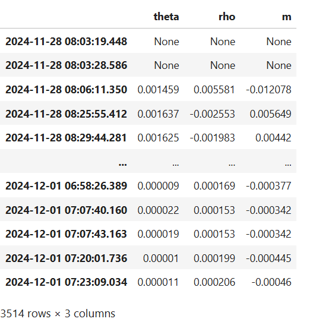
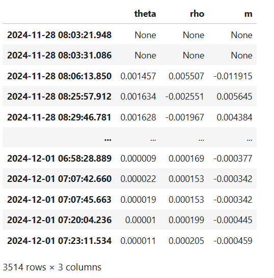
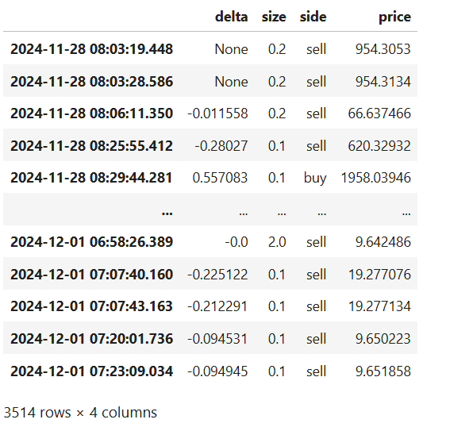
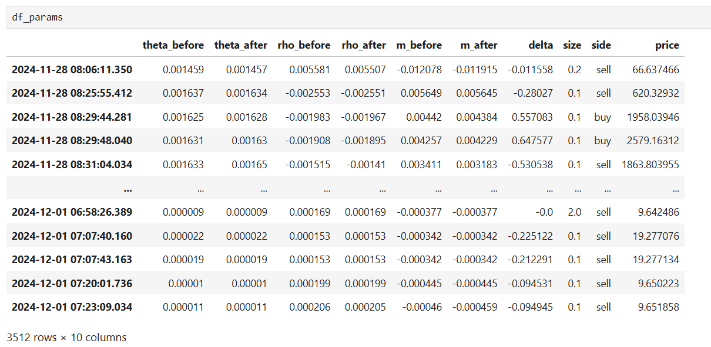

# Options MM Part 2 - Options Trade Impact Modelling [CODE INSIDE]

Source HTML: [`html/2025-03-01-options-mm-part-2-options-trade-impact.html`](../html/2025-03-01-options-mm-part-2-options-trade-impact.html)

# Options MM Part 2 - Options Trade Impact Modelling [CODE INSIDE]

| 항목 | 값 |
| --- | --- |
| 날짜 | 2025-03-01 |
| 접근 | 유료 |
| URL | https://www.algos.org/p/options-mm-part-2-options-trade-impact |
| 부제 | How to price any trade into your volatility curve |

---

When a trade happens on an options exchange there is a brief moment between the trade occurring and the rest of the options curve pricing it in. If you are an options market maker it is unwise to wait for everyone else to update their quotes so that you can update yours. You need to have figured out how the trade affects the pricing of every option on the curve at the same time as everyone else (which will be when the trade gets received from the trade feed).

This is not a modelling task exclusive to market makers, you also can run it as a taker. If a large order hits the market and you feel market makers have priced it poorly, you can pick them off. You don’t necessarily need to be fighting over microseconds, many impact models regard the evolution of prices over 15 minutes etc after the fill (mostly for large impacts only). That said, most impact models price in an average sized trade, and with a very short forecast horizon.

We’ll be working with the Wing model because SSVI is too simple for us, and I want to model put and call wing dynamics and not just simple volatility goes up vs down type of things.

### Index

---

1. Introduction
2. Index
3. Data
4. Impact Modelling (Pre-Processing / Data Wrangling)
5. Impact Modelling

### Data

---

In the previous article, we already scraped the data so you can either refer back to that or just read the same code below:

```
import pandas as pd
import numpy as np
import matplotlib.pyplot as plt
import seaborn as sns
import sys
import os

tardis_api_key='get your own from tardis.dev (I don't get paid I just like them)'

from research_tools.scraping.tardis import *
from research_tools.preprocessing.process_oa_orders import parse_option_characteristics

exchange='deribit'

scrape_tardis_data(
    data_types_list=['quotes', 'trades', 'derivative_ticker'],
    start_date='2024-11-28',
    end_date='2024-12-02',
    instrument_type='futures',
    exchange_names=['deribit'],
    tardis_api_key=tardis_api_key,
    symbols_to_scrape=['BTC-PERPETUAL', 'ETH-PERPETUAL']
)

options_tickers = get_tickers(exchange, return_type='pandas')

options_tickers = options_tickers[options_tickers['type'] == 'option']
options_tickers = options_tickers[options_tickers['id'].str[:3].isin(["BTC"])]

options_tickers[['base_asset', 'expiry_dt', 'strike_price', 'option_type']] = options_tickers['id'].apply(
    lambda symbol: pd.Series(parse_option_characteristics(symbol, 'DERIBIT'))
)

expiry_dt = '2024-12-01 08:00:00'

options_tickers = options_tickers[options_tickers.expiry_dt == expiry_dt]
options_tickers = options_tickers[options_tickers.availableSince == "2024-11-28 00:00:00+00:00"]

scrape_tardis_data(
    data_types_list=['quotes', 'derivative_ticker', 'trades'],
    start_date='2024-11-28',
    end_date='2024-12-02',
    instrument_type='options',
    exchange_names=['deribit'],
    tardis_api_key=tardis_api_key,
    symbols_to_scrape=options_tickers['id'].tolist()
)
```

We will be working with quote data (to fit our curve), trade data (for our impacts), and derivative\_ticker data (to adjust coin terms into USD terms).

### Impact Modelling (Pre-Processing / Data Wrangling)

---

We will assume we are working in the same notebook as the first article, so please follow along with the code there to understand how to get a DataFrame of parameters as we will be analysing this.

```
params = {}
for ts in tqdm(timestamps):
    current_index_price = index_px.loc[ts].index_price
    otm_options = get_otm_options(current_index_price, symbols)
    current_df = get_quotes_for_timestamp(options_data, otm_options, ts)
    current_df = adjust_prices(current_index_price, current_df)
    prepped_wing_df = prepare_data_for_wing_model(current_df, expiry_dt, current_index_price)
    x_array   = prepped_wing_df["x"].values
    iv_array  = prepped_wing_df["iv"].values
    vega_array= prepped_wing_df["vega"].values
    p, loss, arb_indicator = ArbitrageFreeWingModel.calibrate(
        x_array, iv_array, vega_array,
        dc=-0.2,
        uc=0.2,
        dsm=0.5,
        usm=0.5,
        epochs=10,
        use_constraints=True
    )
    params[ts] = p
```

As a note related to our params, you can generate it for the Wing model instead, with this as an example for our regular interval parameters (we will use a slightly different timestamping). The only reason I have stuck with SSVI is because it’s much slower to use the Wing model. Ideally, we would have all of this in some Rust or C++ tooling with Python bindings, but instead we are stuck with slow Python for now. In a later article, we may convert them… we’ll see how far this series goes.

This time around, we need trade data, so let’s load that in:

```
symbols = options_tickers['id'].tolist()

trade_data = {}

for symbol in symbols:
    data_folder_path = Path(os.path.join(base_folder_path, symbol, 'trades'))
    gz_files = list(data_folder_path.glob('*.csv.gz'))
    curr_df = pd.DataFrame()
    for gz_file in gz_files:
        try:
            temp_df = pd.read_csv(gz_file, compression='gzip')
            if not temp_df.empty:
                temp_df['timestamp'] = pd.to_datetime(temp_df['timestamp'], unit='us')
                temp_df = temp_df.set_index('timestamp', drop=True)
                curr_df = pd.concat([curr_df, temp_df], axis=0).sort_index()
        except:
            pass
    trade_data[symbol] = curr_df
```

If you haven’t noticed, it’s the same code as we used for loading in the options quote data, but with a renaming of the dict and changing the folder to trades (this is specific to how I have my flat files stored, change for your own).

```
df_trades = pd.DataFrame()
for symbol, df in trade_data.items():
    df_trades = pd.concat([df_trades, df], axis=0)
```

We’ll aggregate this back up again, probably could have done that in the earlier code, but we were re-using old code so this is easier…

```
df_trades = df_trades.sort_index()
```

Sort the index as well, we want the trades in order. Next, we will shift the index, you are welcome to play around with how much we shift it, but it’s effectively our lookahead horizon. Keep in mind that fitting a vol curve is expensive computationally so in crypto the prices tend not to update insanely fast like they would in perps. 2.5 seconds is much more than it takes, but I figured I would be safe:

```
lookahead_time_usec = 2_500_000
forward_shifted_index = list(df_trades.index + pd.Timedelta(microseconds=lookahead_time_usec))
unshifted_index = list(df_trades.index)
```

Now, let’s get our before, and after datasets:

```
import py_vollib_vectorized

before_params = {}
trade_data = {}
for i, ts in tqdm(enumerate(unshifted_index), total=len(unshifted_index)):
    current_trade = df_trades.iloc[i]
    pos = index_px.index.searchsorted(ts, side='left')
    current_index_price = index_px.iloc[pos].index_price
    current_trade['price'] *= current_index_price
    otm_options = get_otm_options(current_index_price, symbols)
    current_df = get_quotes_for_timestamp(options_data, otm_options, ts)
    p = None
    delta = None
    if not current_df.empty:
        current_df = adjust_prices(current_index_price, current_df)
        p, curve, mkt_ivs = fit_ssvi_from_df(current_df, expiry_dt, current_index_price)
        base_asset, expiry_dt, strike_px, option_type = parse_option_characteristics(current_trade['symbol'], current_trade['exchange'])
        iv = curve(np.log(strike_px / current_index_price))
        t = (expiry_dt - current_trade.name).total_seconds() / 31_536_000
        r = 0
        delta = py_vollib_vectorized.vectorized_delta(
            option_type.lower(),
            current_index_price,
            strike_px,
            t, 
            r, 
            iv,
            model='black_scholes',
            return_as='numpy'
        )[0]
    trade_data[ts] = {"delta" : delta, "size": current_trade["amount"], "side": current_trade['side'], "price": current_trade['price']} 
    before_params[ts] = p


after_params = {}
for ts in tqdm(forward_shifted_index):
    pos = index_px.index.searchsorted(ts, side='left')
    current_index_price = index_px.iloc[pos].index_price
    otm_options = get_otm_options(current_index_price, symbols)
    current_df = get_quotes_for_timestamp(options_data, otm_options, ts)
    p = None
    if not current_df.empty:
        current_df = adjust_prices(current_index_price, current_df)
        p, curve, mkt_ivs = fit_ssvi_from_df(current_df, expiry_dt, current_index_price)
    after_params[ts] = p
```

And put them in a DataFrame:

```
df_before_params = pd.DataFrame(before_params)
df_before_params = df_before_params.T
df_before_params
```

[](images/d1288cf8ccb9.png)

```
df_after_params = pd.DataFrame(after_params)
df_after_params = df_after_params.T
df_after_params
```

[](images/df3e802a85c1.png)

```
df_trade_data = pd.DataFrame(trade_data)
df_trade_data = df_trade_data.T
df_trade_data
```

[](images/c891996e4635.png)

And to merge them we unshift the index on the after frame:

```
df_after_params.index -= pd.Timedelta(microseconds=lookahead_time_usec)
```

Then we can merge them:

```
df_params = pd.DataFrame(index=df_before_params.index)

for col_name in df_before_params:
    df_params[f'{col_name}_before'] = df_before_params[col_name]
    df_params[f'{col_name}_after'] = df_after_params[col_name]

for col_name in df_trade_data:
    df_params[col_name] = df_trade_data[col_name]

df_params = df_params.dropna()
```

[](images/2abf503d0089.png)

Let's add a few extra columns I think will be useful:
