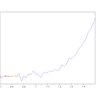
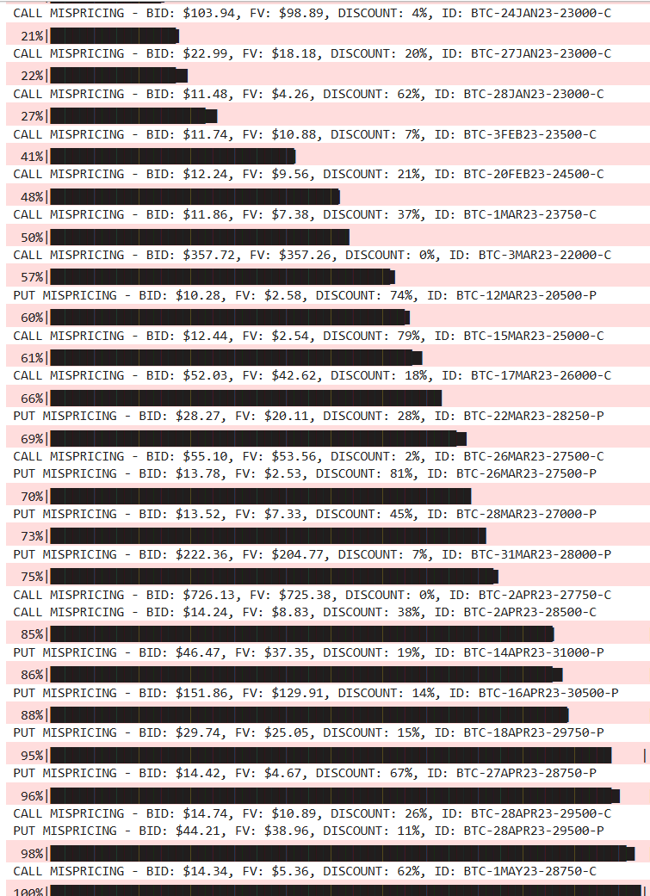
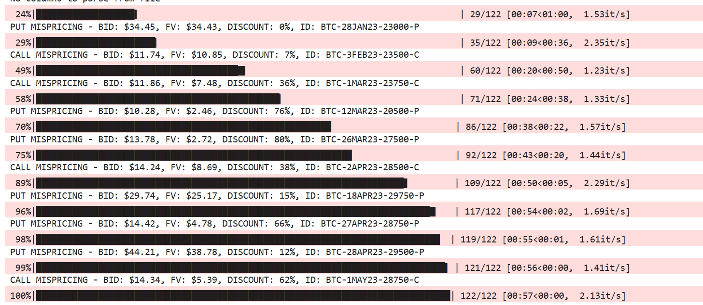

# Alpha in reading the contract specs

Source HTML: [`html/2025-03-22-alpha-in-reading-the-contract-specs.html`](../html/2025-03-22-alpha-in-reading-the-contract-specs.html)

# Alpha in reading the contract specs

| 항목 | 값 |
| --- | --- |
| 날짜 | 2025-03-22 |
| 접근 | 무료 |
| URL | https://www.algos.org/p/alpha-in-reading-the-contract-specs |
| 부제 | A real example of a mispricing stemming from an asset being priced wrong |

---

Discover more from The Quant Stack

Articles about cool quantitative research

Over 23,000 subscribers

Subscribe

By subscribing, you agree Substack's [Terms of Use](https://substack.com/tos), and acknowledge its [Information Collection Notice](https://substack.com/ccpa#personal-data-collected) and [Privacy Policy](https://substack.com/privacy).

Already have an account? Sign in

# Alpha in reading the contract specs

### A real example of a mispricing stemming from an asset being priced wrong

[Quant Arb](https://substack.com/@quantarb)

Mar 22, 2025

24

2

Share

### Introduction

---

Often you can find an edge where others have made assumptions simply by reading the contract specification carefully. Today, we’ll walk through one example of this which causes options market makers to misprice their options. There is also the explanation that they are fully aware of this, but can’t be bothered to develop a model to fix it since this is a rather small mispricing, but it’s a clear case where options trade at a quarter to a third of their value in some cases.

This will be a short article as I’ve already written my main article for the day, and the effect doesn’t really need a deep dive into options pricing. It’s an explanation of where the mismatch is and how to correctly price it… not much more needed so it’s a short article.

[Why is my backtest wrong?·March 22, 2025[Read full story](<https://www.algos.org/p/why-is-my-backtest-wrong>)](https://www.algos.org/p/why-is-my-backtest-wrong)

The Quant Stack is a reader-supported publication. To receive new posts and support my work, consider becoming a free or paid subscriber.

Subscribe

### How it works

---

With options on crypto exchanges, they all settle to a TWAP for the major exchanges. However, almost all market makers will treat them as if they expire at the last trade price so they get more and more mispriced as they head towards expiry.

A lot of market makers will factor in the accumulated prices so far since the exchange will have a feed for the expected settlement price which most MMs will use as their underlying price for the option, and this expected settlement price will factor in the TWAP value so far so this part is factored in and there is no trade here.

However, when you settle to a TWAP the volatility of the option is effectively halved. This is a rough proxy but based on my testing I found it usually ends up around half the volatility. This affects OTM options the most, but we are talking about options that are about to expire in a matter of hours, so there is a trade off between mispricing amount and whether this thing has any quotes left on it.

Usually just slightly out of the money is optimal for this liquidity vs mispricing trade-off. Keep in mind the ask will be 2x the price of the bid on a lot of these options.

### A quick Monte Carlo

---

Running a quick Monte Carlo model, we can see that various discounts are revealed:

This is the output of 2 different models I developed to price these options, both based around Monte Carlos.

I made them both intentionally conservative. If it says 75% discount, it’s probably about twice as bad as that, but I didn’t want to be doing it wrong in the other direction.

I factored in the incredibly high volatility risk premium behind these options that are high gamma near expiry as well so you would likely collect this edge, although this comes with tails so not sure I would consider that a standalone strategy.

### The Caveat

---

Sadly, there is a caveat here since you need to be willing to short a very high gamma option (most of these are overpriced since they are trading at 2x their implied vol as they should be). This is awful on your margin so you can only get so much efficiency.

The options are also fairly illiquid, it’s the type of alpha where you set up a pricing script with a telegram bot then manually pick off the market makers pricing these things.

You are still selling a nasty tail so not many are interested in that. I can’t say this is an immense alpha (if it was more actionable this would probably be a paid article), but it’s an interesting example about how market makers on Deribit either can’t be bothered or don’t think to price in this TWAP settlement into the volatility surface.

The Quant Stack is a reader-supported publication. To receive new posts and support my work, consider becoming a free or paid subscriber.

Subscribe

24 Likes∙

[2 Restacks](https://substack.com/note/p-159176559/restacks?utm_source=substack&utm_content=facepile-restacks)

24

2

Share
