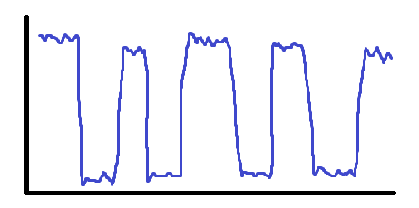
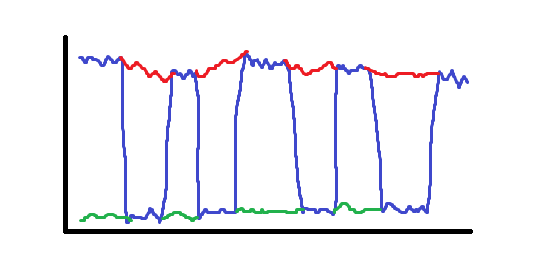
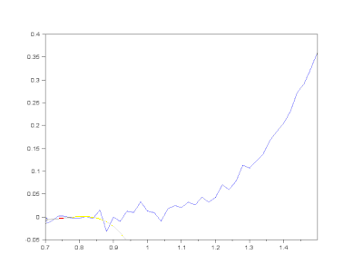
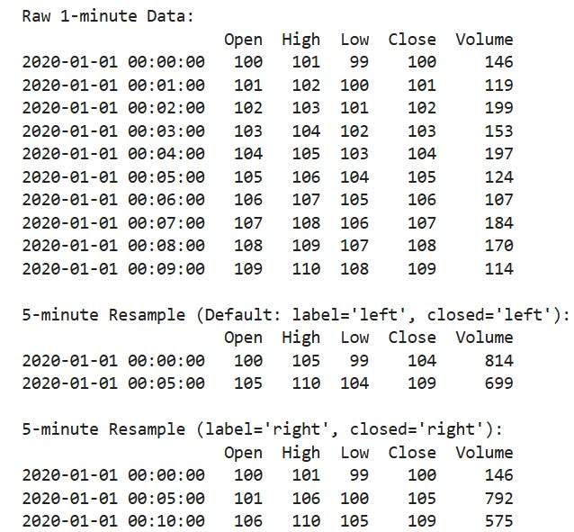
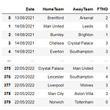

# Why is my backtest wrong?!

Source HTML: [`html/2025-03-22-why-is-my-backtest-wrong.html`](../html/2025-03-22-why-is-my-backtest-wrong.html)

# Why is my backtest wrong?!

| 항목 | 값 |
| --- | --- |
| 날짜 | 2025-03-22 |
| 접근 | 유료 |
| URL | https://www.algos.org/p/why-is-my-backtest-wrong |
| 부제 | Every way you could've messed up compiled into one article |

---

### Introduction

---

It’s a rite of passage in the quant world to fuck up your first backtest. I remember a particularly good backtest early on in my career that promptly sent me to the Lamborghini dealership website to size up which model I would soon be buying. Spoiler! This strategy did not buy me a Lamborghini.

In this specific case, I had messed up the timestamps on my data collection so data from the future was randomly stitched with current data, creating some too good to be true mean-reversion. It looked a little bit like this:

Which was really just two series (with the gaps filled in using red/green) that had stitched together poorly in my data scraper:

That was a fun lesson, and one I would learn many more times after. If your reaction upon seeing an amazing backtest isn’t “ah man what broke” then you haven’t seen enough of them to know better. There is no exception to this. Every entirely straight line I have ever generated in backtest has had some flaw, and the only super straight lines that actually realized in production weren’t backtest-able in the first place (market making). I’ve certainly had backtests that looked good and turned out to be good, but they never looked so good it was unbelievable - I certainly didn’t google any Lambos.

In the article today, I am going to dive into 20 different ways you can ruin your backtest. This isn’t so much meant to be a Wikipedia article on what overfitting is, since I’m sure you can find that easily, but more an example of many issues and caveats I’ve had to deal with throughout my career so that you can also be aware of them too.

### Index

---

1. Lookahead
2. Overfitting
3. Survivorship Bias
4. Fees
5. Spread
6. Market Impact
7. Latency Assumptions
8. Limit Order Assumptions
9. Adversity Assumptions
10. Short Borrow
11. Funding Rates
12. Withdrawal Issues
13. Broken API
14. Assumed Infinite / Free Leverage
15. Tick Size Issues
16. Ignoring Gaming Dynamics
17. Assumed Trading Price is Trade-Able
18. Trade Price Bid/Ask Bounce
19. OTC Trades on Main Feed
20. Wash Flow

### Lookahead

---

This is by far the most common cause of bad backtests. I’ll walk through some key ways that this can happen:

Some smoothing algorithms like [Savitzky–Golay](https://en.wikipedia.org/wiki/Savitzky%E2%80%93Golay_filter) actually have lookahead inherent to their logic so whenever you are using a niche smoothing method, just make sure of this - it’s a mistake I’ve made before and it’s cost me a load of time figuring out what happened:

Another common way to introduce lookahead bias is when resampling. We will look below at the default version of pd.DataFrame.resample() compared to the correct way to do it:

If you use resample with the default arguments (Default: label=’left’, closed=’left’) then you get the example shown above which contains lookahead. We see that the high of 105 occurs at 04 but the timestamp is 05 — thus we have lookahead. When doing resample, always pass in the arguments label=’right’ and closed=’right’. Otherwise your timestamps will be at the open of the bar, which can easily lead to lookahead bias occurring, especially after merging dataframes.

There are about a trillion different ways that lookahead bias can occur and it usually produces a very strong effect in your data, so it’s the most likely answer when you have a really good PnL curve. The only other error that will make a curve look insanely good (completely straight line) is execution based assumptions that are wildly off such as limit fills + rebate + zero adversity + instant fill.

### Overfitting

---

Overfitting is also fairly common. People like to tweak parameters until they eventually find something and a lot of the advice related to avoiding overfitting is fairly sensible. Always keep some data spare that you haven’t tested on. Whether that’s some newer data, a load of other assets, ideally both even, and then right at the end you can validate on this and if it fails you’ve used it and you call it a day. You need some piece of data ideally that you don’t play around with until the end.

Slowly increasing the amount of data you use until you are done the analysis helps. Visually, inspecting the backtest helps a lot as well. You can tell by how smooth the PnL curve is and how many trades were taken whether a curve has a high level of robustness. If all the PnL was made in 3 large jumps and it was flat otherwise then that means we have 3 events that made all our PnL. 3 isn’t many… You can have lots of trades and very few events that make the money, which can still happen in working strategies, positive skewness is a thing afterall, but it means you need to down-weight your mental view of how confident you are in this strategies ability to perform OOS (out of sample).

Double check out of sample very aggressively with not just one but 2 out of sample sets (validation set) when working with machine learning models because even after you fit it, you’ll do hyperparameter tuning.

On the subject of parameter tuning, if you make small-ish changes in your parameters and the overall trend of the curve flips completely then your alpha isn’t likely to be robust. You may see performance change a bit, but for great alphas the signal will shine through regardless of exact parameter choices. I.e. you can be very dirty on the machine learning, portfolio construction, and parameterization components and it’ll still make money.

### Survivorship Bias

---

This is one that is not always worth preventing. Yes, you can use a dynamic universe, but guess what? That’s complicated and a real pain in the ass to code up. At some point you have to say — maybe I’ll only fix this one where it makes sense. If you have a fancy backtester then this makes sense to have in there, but if it’s a one off simulation, then I’m not sure this one always is worth the extra effort.

If you are doing long only momentum, best believe you will be bringing out that dynamic trading universe because survivorship bias will genuinely ruin your results.

If you are on the other hand doing a super delta neutral strategy or one that is directional but with equal long to short exposure over it’s history (which is much easier to check for than coding up a dynamic universe) then it’s worth skipping. I have very rarely had issues with survivorship bias.

It’s not an extremely strong force either so if you are working with 2 years of data and trying to find 3 Sharpe strategies, it isn’t going to be the thing ruining your backtest.

If you are doing 40 year backtests for heavily long strategies then this can destroy you backtest and rip the results to bits. It entirely depends on what you are simulating and whether we are doing it on long enough time horizons where it can make up a very large part of the total PnL at the end.

General tips here:

- If you are direction neutral you can skip it
- Affects longer term strategies more

### Fees

---

Everyone loves to mess around with fees and assume wildly inaccurate fees at the start of their careers. Finding alphas that barely beat fees isn’t very valuable because they won’t survive the market impact side once you actually want to trade them with size. If it only takes a couple of bps to kill an alpha, especially one that isn’t HFT then you are unlikely to have a very good alpha. That said, plenty of HFT alphas survive off a couple of bps of edge, but that’s simply because they make lots of trades. If you are doing MFT strategies, demand more edge out of your strategies.

You can usually find the fees for exchanges online, but if you are unsure, go on the higher side. You’ll need to throw in some extra bps anyways just to demonstrate you can chuck some serious money in there.

And if you are doing HFT, then it’s expected you know everything about that specific exchange because that is what will trip you up over. Do your research there.

Apart from the wrong fees, sometimes people ignore rounding issues, which can be a big deal for smaller trades. This is mostly an HFT arbitrage issue, but if they round to a decimal place then slight taker arbitrages can go away. This was an issue on occasion when I was running triangular arbitrage strategies a while back on Binance.

### Spread

---

Spread can often be underestimated, but it’s not usually an issue with the actual parameter itself, but that when people want to trade the market is very volatile and the spread becomes wider than average. It’s generally best to just pull up quote data, resample to your bar frequency and then go from there. It’s not a lot more work to do and you won’t have to deal with spread issues.

You also don’t want to have to write out a spread cost for every asset you trade — in fact most people will have some flat spread cost they add to their trading fees, but this becomes very inaccurate for smaller assets. You just end up overdoing it for the bigger names and underdoing it for smaller names.

### Market Impact

---

Market impact is usually just a capacity estimation problem. An alpha isn’t very useful if you can’t put any size into it. You need to simulate a minimum amount of price impact (which I usually just add a multiplier onto the spread for and call it a day) if you want to be able to trade it.

Wouldn’t say market impact is one of the more common ones, but in general, people tend to overestimate capacity. You don’t realize your capacity sucks until you actually have to dig into it and realize it’s terrible. Being a bit more conservative is wise, a lot of things have less liquidity than you think.

### Latency Assumptions

---

This is really only relevant for HFT trades, but it especially gets people who are trying to do cross exchange arbitrages. Latency is fairly hard to model since it isn’t just the network component, there is also the matching engine - and you can’t get historical data for the matching engine time without having traded during that period. In fact, Jump and other large firms collect data by ping-ponging between best bid/ask to collect data regarding fill probabilities and matching engine related times - not to mention their own trading history helps.

Generally, you should look at tail latency instead of average latency since you will likely want to trade when the latency spikes, but ideally you look at the latency conditional on you wanting to put a trade through using production data.

Average latency tends to be rather useless, only the latency conditional on wanting to trade — and the best proxy for that is the 99.9% value for it.

This, of course, requires that you are collecting the data since the latency on data vendors won’t be reflective of what you could get if you bothered to optimize your systems latency.

Latency is one of those things where collecting your own data matters and testing things in production is one of the only ways to do it.

That OR you assume a really high amount of latency and if your trade survives that then you’ll probably be fine. If you can prove that your trade survives even the most unlikely assumptions then you should feel free to go ahead with it.

### Limit Order Assumptions

---

If your trade assumes limit order fills, then things can get tricky. If you are trying to make into an HFT trade then you typically can only verify it by testing in production - there’s been cases where everything lined up, I placed my limit orders and then got no fills despite trades happening in front of my very eyes. Turns out the exchange was faking all of it’s volume, but, oh well, that’s the sort of thing you have to deal with and why doing a live test with something crappy before you build out that fancy trading system is really quite critical.

You can sometimes look at the trades that hit the tape, and see where they would’ve impacted in the book. If they are big enough of a trade, then you can often assume that you can simply place in the book and simulate fills based off those trades. Anyone paying 50 bps spread by massively impacting the orderbook isn’t thinking about whether they should trade or not based on whether your small order is in the book.

However, if you are competing for top of the book, then you need to test in production. Any assumption on limit order fill time is also going to vary, instant fills are a big no-no, and you will have an adversity cost to your trading.

### Adversity Assumptions

---

Speaking of which, we have adversity in all of our maker trades usually. This means that there is an inherent cost to making which isn’t immediately obvious. For every amount you adjust your market makers skew parameter by there will be a cost to the inventory you put on.

If you are market making into a fairly medium to low frequency trading strategy then it is a reasonable assumption to just take the average cost to put on inventory and use that as your adversity cost.

If you have a decent system you can usually improve upon taking, but a basic hummingbot type strategy will often get rinsed much worse than taking normally so don’t count on making beating taking.

### Short Borrow

---

This is a rather simple one and affects spot trading. If you haven’t simulated whether you can even borrow the asset, and the asset is fairly illiquid then your alpha may exist purely because borrow is impossible to get. If you go back to one of my article about trading sports team tokens based on their games, you will see that despite the incredibly high performance - the edge was actually coming from being able to source the borrow on these tokens, not to mention their small capacity.

[A Novel Approach to Frontrunning Drunk Brits[Quant Arb](<https://substack.com/profile/101799233-quant-arb>)·March 1, 2023[Read full story](<https://www.algos.org/p/a-novel-approach-to-frontrunning>)](https://www.algos.org/p/a-novel-approach-to-frontrunning)

In equities, you can assume that anything in the S&P500 has borrow available for it, but beyond that you need to buy expensive datasets that can run you upwards of $250,000 for the borrow histories of different assets.

Similarly, you need to make sure you are simulating the borrow costs. Keep in mind that in crypto, most exchanges round to the nearest hour so if you are looking to flip in and out of positions in spot with minute timeframes between these position changes then you may run into trouble with fees racking up, but honestly at that point you may as well just hold some inventory in spot and try hedge with the future, it’ll be cheaper in the long run either way.

Borrow costs on spot are much more expensive than funding on futures typically (for crypto) so I recommend trading futures wherever possible (also less fees, more liquidity, etc).

### Funding Rates

---

Funding rates can pose an issue if they are particularly high, ie you are targeting coins that have had a crazy breakout or if you are expecting to hold them, particularly in the direction of momentum for a reasonable duration of time.

They also affect seasonality strategies since every time funding pays out the price moves so if you don’t adjust for the funding payments you will believe that there are strong effects for certain hours of the day and the last minute of the hour (these effects are still real but you will not correctly estimate them if you don’t adjust for funding rates).

### Withdrawal Issues

---

Often, the largest spot arbitrages are for assets where withdrawals have been disabled so they can’t be transferred. This is pretty plan and simple but check this first.

### API Issues

---

If you measure the toxicity for every asset on an exchange, you’ll find that the ones with the least toxicity are funnily enough the ones where the API is messed up or the data feed seems not to work for some reason. This happens even on big exchanges like Binance sometimes and if one token is having a datafeed issue for any particular reason then the flow will be dumb as a rock but good luck adjusting your orders to trade it without sitting in front of the Binance dashboard and doing it manually (not the worst idea for a strategy, although a very niche one at that).

On top of this, you will find that the best exchanges to market make on will just shut off their maker API whenever they feel like it. MEXC did this for ages and took all of the (entirely retail flow) to themselves, all whilst kicking off anyone that made any money / being jerks about withdrawals, and this isn’t exactly uncommon — it’s the case with about half of the exchanges on the coinmarketcap rankings, much higher % wise near the bottom even. If you try to do any sort of market making they’ll just turn off your API access, and it’s a nightmare to negotiate with them otherwise.

I know people where their alpha is just trading through personal accounts because the exchanges don’t allow accounts from institutions since the flow is toxic and if you aren’t from South Korea for example, it’s hard to open an account on certain South Korean exchanges. Then from there they just pick off the market makers with simple arbitrage strategies because they quote like shit (as is expected when their entire counterparty-base is South Korean degens who want to buy Fartcoin because it is above the 73% fib retracement).

### Assumed Infinite / Free Leverage

---

Often trades based around spreads between assets can have a very small amount of edge in them so require leverage, but if the trade makes 10% a year and leverage is at 8% and you mess up the cost of that loan then you will massively overestimate returns. Similarly if you just arbitrarily let your algorithm set the leverage for the strategy to whatever your portfolio optimizer thinks is optimal then you may end up exceeding the leverage limit allowed.

For many cross exchange positions you can only get up to 3x without running into event risk issues where if you have a large gain on one exchange, you could get liquidated on the other. Really up to 5x if you are pushing it.

This is probably one of the less common mistakes as most strategies can be leveraged way beyond what is necessary (most strategies don’t trade cross exchange spreads and instead trade single exchange perps which are super efficient leverage wise), but it is a mistake that occasionally is made nonetheless.

### Tick Size Issues

---

Make sure you can actually post a price at the price you want. You can’t quote 3.60086928746784 as your price for almost every exchange — there is a minimum amount of rounding.

This doesn’t really tend to affect you unless you are doing strategies like triangular arbitrage where you end up with small bits of remaining inventory due to tick size mismatches and then you lose a lot of your profit to accumulating loads of random coins which are a pain to then offload.

It’s not a consideration you would think of normally but we used to have to dump lots of random coins every so often and I probably had about 400 different coins being held in my Binance account at any given time.

### Ignoring Gaming Dynamics

---

Put quite simply, if you try one-up someone’s order there is a good chance you will get into a bidding war and piss away all of the profit. Sometimes you can’t make into a trade without bidding it away against some other traders algo.

### Assuming Trade Price is Trade-Able

---

I think this is one of the most common yet easily solve-able mistakes out there. I can never understand why people prefer to use trade bars over bars created from mid price but regardless they seem to be the standard.

They shouldn’t be YOUR standard however, and wherever possible use mid price instead.

Why?

Well, you get fake mean reversion in your data equal to the distance between the bid price and the ask price (at minimum!!). Each trade is either on the bid or ask and between trades it bounces between them, so even if fair value remains constant, the price will bounce around.

For illiquid assets, this means that you will see fake mean reversion, especially if someone is hammering the book about and the spread is wide. Combine this with use of the average spread instead of the actual bid/ask price at the time of trading and you have a recipe for a disaster of a mean-reversion strategy that looks real but you are actually trying to make the bid/ask spread but as a taker!

### OTC Trades on the Main Feed

---

Some big exchanges will stick OTC trades on the main feed and this can wreck havoc if you are incorporating them into certain metrics. It’s not necessarily going to break your backtest or make it ‘wrong’ but it may hurt your metrics if a massive OTC clip moves your metric but the open market doesn’t react at all.

### Wash Flow

---

Fake flow, fake orderbooks, all of it. This is what causes you to waste days of precious work integrating new exchanges and researching trading opportunities only to find out that no one actually trades on there.

I remember one exchange was ranked #1 for volume and was called BTCex and claimed 400 billion in BTC volume, 100 billion in ETH volume and 3 million in total volume for every other coin. Not all of them are this blatant, but test with a quick script before you spend lots of time if you think it might be dodgy. Even top 20s suck.

Poloniex and Ascendex have a lot of wash flow for example.
