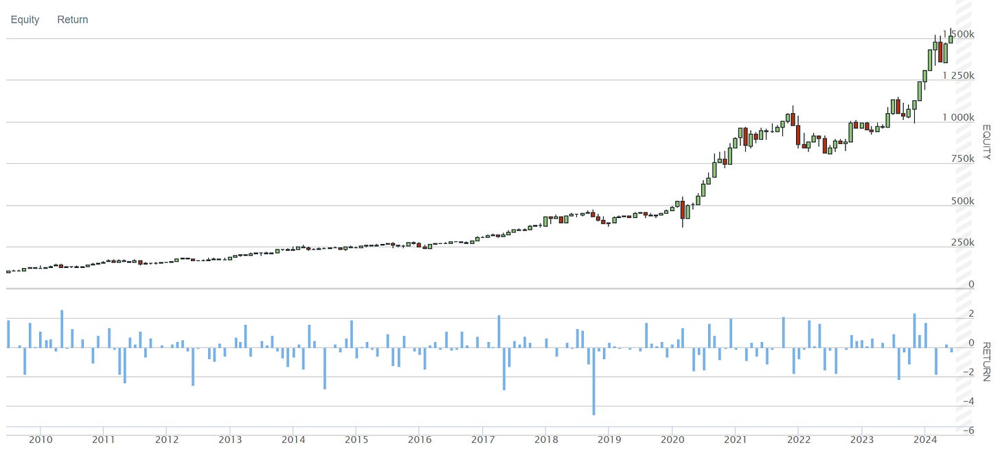
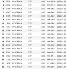
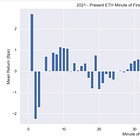

# Easy Alpha Portfolio - 5 Strategies That Just Work

Source HTML: [`html/2025-05-19-easy-alpha-portfolio-5-strategies.html`](../html/2025-05-19-easy-alpha-portfolio-5-strategies.html)

# Easy Alpha Portfolio - 5 Strategies That Just Work

| 항목 | 값 |
| --- | --- |
| 날짜 | 2025-05-19 |
| 접근 | 유료 |
| URL | https://www.algos.org/p/easy-alpha-portfolio-5-strategies |
| 부제 | A guide through some simple strategies that work |

---

### Introduction

---

Today, we’ll take a look at 5 relatively simple strategies that work well. They have a solid track record of performing and whilst many can be modified / improved to a large extent by yourself, they aren’t really that complicated to get up and running for a profitable MVP.

### Index

---

1. Introduction
2. Index
3. Strategy 1 - Funding Arbitrage
4. Strategy 2 - Momentum
5. Strategy 3 - Seasonality
6. Strategy 4 - Special Situations Arbitrage
7. Strategy 5 - Reward farming

### Funding Arbitrage

---

This is one of the easiest strategies to deploy for an MVP as it only involves a simple long and short position to take advantage of. There are, of course, much more complex versions that exploit cross exchange imbalances and actively trade in and out of positions as deemed optimal - however the basic version of the strategy often yields well enough. I’ve always treated it as the risk free rate.

Funding arbitrage appears to come in cycles, at one point about 4 or so months ago yields hit 130% unlevered on BTC for a solid 2-3 week period. At that point, a couple active fund managers I knew turned off core strategies to run funding arbitrages. Who wouldn’t? You can get triple digit percentage returns off a simple long short position with capacity for the whole fund. Count me in! I pitched it to my team there and then and the next day we already had a million on.

It’s a strategy that’s worth monitoring because of this cyclical effect. When it’s good, you want to turn it on fast. Ideally, have some notifications set up which tracks yields or maybe even auto allocated if you are willing to do that far.

I assume most are familiar with the core of this strategy and a fair few with the advanced details, but for those who aren’t - I have an extremely detailed article which goes from the most basic version of the strategy to the state of the art:

[Small Trader Alpha #4 - Funding Arbitrage[Quant Arb](<https://substack.com/profile/101799233-quant-arb>)·January 30, 2024[Read full story](<https://www.algos.org/p/small-trader-alpha-4-funding-arbitrage>)](https://www.algos.org/p/small-trader-alpha-4-funding-arbitrage)

### Long-Only Momentum

---

Momentum is a strategy that is quite well known throughout the world, below is a simple backtest of it I coded up in QuantConnect. There are better ways to do it, but this version works good enough and beats the S&P500 on both Sharpe and CAGR. Full report of the strategy with detailed statistics below.

Strategy report:

Momentum Strategy Report

2.9MB ∙ PDF file

[Download](https://www.algos.org/api/v1/file/70b53611-b67c-43bb-903e-7cc687df567c.pdf)

[Download](https://www.algos.org/api/v1/file/70b53611-b67c-43bb-903e-7cc687df567c.pdf)

### Seasonality

---

Seasonality is a common strategy that’s been known to work across many markets, and has many many forms that are known to work, but also much more that I’ve found to be long dead.

I won’t waste time, here’s the strategies that still work:

- End of month rebalance works in crypto and less developed markets but not really equities. Last 3/4 days of the month for crypto.
- Last minute of hour and 15 min seasonality works but is too weak to actively trade, good for execution.
- Election risk premium seasonality works well, I have an article on it below.
- Options rebalance effect works well but do some work conditioning on the size of the flow and I would avoid crypto because option flows are too small. This one is probably dying.

The most robust being end of month and election risk premium. Easy to run and very simple. Options rebalance with a little extra research and you’re set. Here is my article where I backtest all seasonality strategies that exist and a detailed analysis on election risk premium which I believe my article is novel in the sense that it backtests the strategy across all countries elections not individually.

[Election Cycle Seasonality Effects[Quant Arb](<https://substack.com/profile/101799233-quant-arb>)·February 26, 2023[Read full story](<https://www.algos.org/p/election-cycle-seasonality-effects>)](https://www.algos.org/p/election-cycle-seasonality-effects)

[Seasonality - A Comprehensive Overview[Quant Arb](<https://substack.com/profile/101799233-quant-arb>)·August 18, 2023[Read full story](<https://www.algos.org/p/seasonality-a-comprehensive-overview>)](https://www.algos.org/p/seasonality-a-comprehensive-overview)

### Special Situations Arbitrage

---

#### Vers La Luna

---

Vers La Luna - To The Moon. A common phrase in the degen dictionary, usually meaning that prices go towards the moon - i.e., up, up, and up. However, in this case, the moon was the one plummeting, specifically the aptly named token LUNA. I’m sure readers are already somewhat familiar with the events that took place during the LUNA collapse, and if not, there is plenty of material online detailing those events.

Recapping, the UST stablecoin departed from its 1:1 USD peg. This caused an algorithmic meltdown where LUNA was minted to repeg the asset. As capital was pulled from UST, the supply of LUNA soared, and its price plummeted - worsening the situation. Either way, we now had one of the top tokens heading toward 0 rapidly from an ATH of $119.18. This created some very interesting opportunities we will explore in the next 3 mini-chapters for our LUNA case study.

#### Vers La Luna - Conversion

---

This is one opportunity where >100% returns were possible in under a day of trading simply through minting and burning LUNA/UST. The pegging mechanism treats UST as 1:1 with USD, so if there is a depeg we can exploit this for a large profit. Say UST is at $0.75, and LUNA is at $20.0 (rough prices around the 10th of May). Since the mechanism assumes UST is worth $1 always, we can burn 100 UST and receive $100 of LUNA (5 tokens at $20/token). Our cost for the UST is $75, but we received $100 of LUNA. We sell the LUNA and get back to $100 cash minus some losses because LUNA was plummeting.

This was all done on-chain via the Terra Station, and being early to this opportunity was where the best profits were made.

#### Vers La Luna - Sitting Wide

---

People did not want to own LUNA or UST. This led to some very price-insensitive sellers who were dumping size without any regard for the market impact. One nice benefit of bear markets is that you have a much lower risk to provide deep liquidity. That is, posting wide-limit orders with the intention of immediately propagating this flow

#### ETH Upgrades

---

The merge was a big event for ETH, nobody knew what would happen, and that was reflected in the arbitrages for ETH and assets running on ERC20 (which is a lot of crypto) when looking at cross-exchange pricing. Arbitrages of 20%+ (simple ones you can do manually that persisted) were extremely common and you had plenty of time to get in position for it as well. Information about this case was available in advance.

### Reward Farming

---

Now this strategy is probably the most involved of them all, but it is the one with the best returns. It requires you to get market making, and occasionally doing taking on exchange.

It’s been a rather dry time lately since Hyperliquid has been hogging all the flow, but there are still a few names out there with reward programs. They’ll usually offer something where you get paid for time on top of book, depth of quoting, and share of volume (some sort of points system). For some exchanges, this can be extremely profitable.

For one exchange, Lyra there was an easy arbitrage where there was a maker reward program (that was paying very well) and on top of that a taker reward program. When you did the math on the taker rewards, you were getting paid 5x the exchange fees in rewards to take, AND on top of that you could get paid to make the other side of it. You would’ve definitely got in trouble if you wash traded any sort of flow, but come up with a simple alpha which trades around divergences from Binance (for futures) and Deribit (for options) and the volume you rack up pays out a fortune in rewards. Now keep in mind, you’d lose money running this otherwise, but the exchange subsidy makes it extremely attractive.

The only issue is that you do need to stay on top of the current best opportunities. Currently, Lighter has a lot of good flow (I haven’t dug into the situation w/ rewards but the flow is good, may still be profitable anyways) and Citrex is doing a reward program, but the opportunities are rather sparse currently. It can be cyclical so perhaps when the VCs start pouring money back in and the opportunities ramp back up we’ll see this float to the top of my list for how to make money in the market. It’s surely the best Sharpe strategy.
