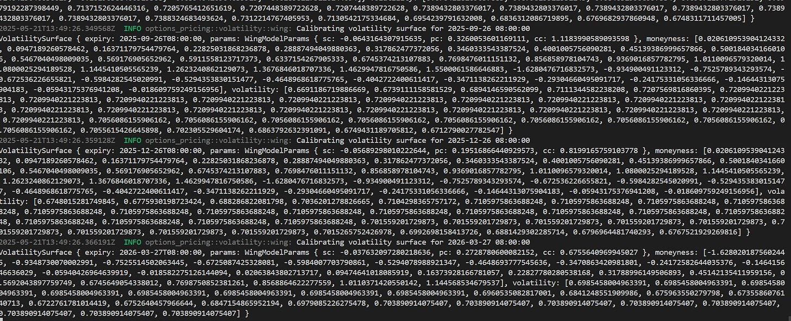
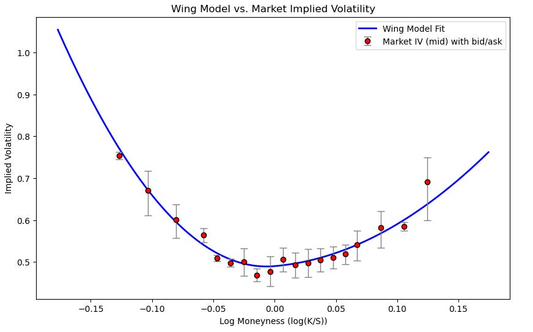
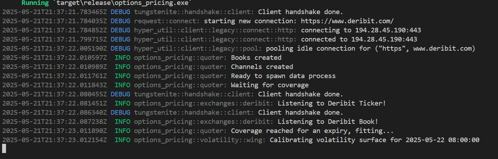
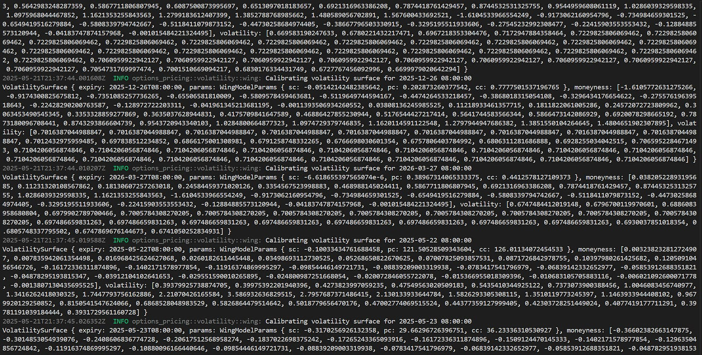

# Live Options Market Making Quoter (OMM Pt.3)

Source HTML: [`html/2025-05-21-live-options-market-making-quoter.html`](../html/2025-05-21-live-options-market-making-quoter.html)

# Live Options Market Making Quoter (OMM Pt.3)

| 항목 | 값 |
| --- | --- |
| 날짜 | 2025-05-21 |
| 접근 | 유료 |
| URL | https://www.algos.org/p/live-options-market-making-quoter |
| 부제 | Building a real-time volatility curve pricing model |

---

### Introduction

---

*Note: The full Rust implementation of the quoter can be found in the appendix*

So we’ve looked a lot at theoretical volatility curves, but this hasn’t yet been translated into something we can derive quotes from in real time. So today, we will write out a full pricing server. The server will spit out our delta neutral quotes. This is the first half of building a proper options market making system. It’s by far the easier part in terms of developer work, but does involve a lot of research and code still.

My model for developing HFT systems has always been that you have your pricing server and your trader server. Sometimes the pricing server is simply there to stream data and doesn’t do anything other than that, but often you use it to calculate fair values or in the case of taker strategies, different opportunities. Today, we will be building the first half of that - building a full options market maker is a very large lift and probably unrealistic for a single article. That said, this will still be a fairly large amount of code and a longer article as a result. Our system prices options and comes up with it’s own fair values without simply copying the market. If spot prices change, we have our own new option prices before the market updates. If a trade happens, we can price it into our curve as well. Probably nowhere near as good as other MMs, but that can be tuned in production.

We will assume that we have an empty portfolio for our quotes so there will be no skewing involved, but in a real system we would skew our quotes based on various risk factors (Greeks, notional limits, etc).

The hardest part of building an options market making system is the portfolio management, OEMS, risk management, reporting, controllers, data robustness handlers. There’s a world of difference between spitting out quotes in a system that doesn't have any sort of complex data quality checking logic + connection assurances + low latency optimizations for the data feeds, and what we will be doing. That said, the code below is by no means trivial and will involve us putting together components from all the prior articles as well as including many new additions.

Here is what some of the quotes look like when running live. You can see some of the fit parameters to the model, and then also the log-moneyness vs. the implied volatility for each of the strikes on the expiry:

[](images/3997430629a0.png)

If we were to plot the values it would look similar to the curve we fit in the previous article on option market making:

[](images/4566d098f0dd.png)

The only difference is that this is being done extremely fast and live. We use the same Python code under the hood as this uses SciPy’s minimize which is made of super fast FORTRAN anyways so the optimization time is still fairly acceptable. We also don’t need to fit too aggressively.

### Further Work

---

As I mentioned earlier, this is not a full option market maker — merely the quoting component, we would need to implement execution to bring it live.

It also likely makes sense to incorporate VCR, SCR, SSR, etc into the model by using spot price updates to modify the curve in-between fits. I’ll show you how to do that live in the next article. The current implementation has the functions to do it implemented, but the spot feed has not been fit to yet.

From here, we would add on our skews our view on where the curve is going based on various fits and skews for different Greek preferences and we would have a half decent start at being an options market maker.

Now that we have this live code, I will use this as a platform in the next articles to show how this will be done in a live environment. I’ll also put down a quick dashboard so we can visualize it.

If you want to have a toy with it, the code is below.

### Appendix

---

Here is the code for the quoter, to start here is the file directory overview:

```
options_pricing
├── python
│   └── wing_model.py
└── src
    ├── exchanges
    │   ├── deribit.rs
    │   └── mod.rs
    ├── volatility
    │   └── wing.rs
    ├── main.rs
    ├── model.rs
    ├── py_utils.rs
    ├── quoter.rs
    ├── ticker_universe.rs
    └── wing_model.rs
Cargo.toml
.gitignore
```

It should look like this when it connects to the exchanges:

[](images/2039e44a1b76.png)

And here are the fitted surfaces which happen live:

[](images/b8cc3db2affe.png)

main.rs:

```
// Optional: Remove this, only so it doesn't crowd my terminal.
#![allow(unused_variables, unreachable_code, unused_imports, deprecated, dead_code, unused_mut)]

pub mod ticker_universe;
pub mod model;
pub mod quoter;
pub mod exchanges;

pub mod py_utils;
pub mod wing_model;
pub mod volatility {
    pub mod wing;
}

pub use exchanges::{
    ExchangeClient,
    DeribitClient,
};

use color_eyre::eyre::Error;
use model::Exchange;
use quoter::Quoter;
use ticker_universe::TickerUniverse;

#[tokio::main]
async fn main() -> Result<(), Error> {
    tracing_subscriber::fmt()
        .with_max_level(tracing::Level::DEBUG)
        .init();

    let client: DeribitClient = DeribitClient::connect_mainnet().await?;
    let instruments = client.get_instruments(None, "option", Some(true), None).await?; 
    let universe = TickerUniverse::new(instruments, Exchange::Deribit);
    let mut quoter = Quoter::new(Exchange::Deribit, universe, client);
    quoter.start_quoting().await.expect("Error");
    loop {};
    Ok(())
}
```

model.rs:

```
use std::fmt;
use color_eyre::eyre::{eyre, Error, Result};
use chrono::{NaiveDate, NaiveDateTime, Duration};
use tokio::sync::mpsc::{UnboundedReceiver, UnboundedSender};
use indexmap::IndexMap;
use tracing::{info, error};
use std::collections::HashSet;

use serde::{
    de::{self, SeqAccess, Visitor},
    Deserialize, Deserializer, Serialize,
};
use serde_json::Value;

#[derive(Debug, Clone, PartialEq, PartialOrd, Serialize, Deserialize)]
pub struct ChannelEvent<T> {
    pub channel: String,
    pub data: T,
}

impl<T> ChannelEvent<T> {
    pub fn map<U>(self, f: impl FnOnce(T) -> U) -> ChannelEvent<U> {
        ChannelEvent {
            channel: self.channel,
            data: f(self.data),
        }
    }
}

#[derive(Default, Debug)]
pub struct Books {
    books: IndexMap<(String, &'static str), Book>,
}

impl Books {    
    pub fn handle(&mut self, book: Book) {
        match self
            .books
            .entry((book.instrument_name.clone(), book.exchange))
        {
            indexmap::map::Entry::Occupied(mut entry) => {
                let old_book = entry.get_mut();
                if old_book.timestamp >= book.timestamp {
                    return;
                }
                *old_book = book;
            }
            indexmap::map::Entry::Vacant(entry) => {
                entry.insert(book);
            }
        }
    }
    pub fn get(&self, raw_ticker: String, exchange: &'static str) -> Option<&Book> {
        self.books.get(&(raw_ticker, exchange))
    }
}

#[derive(Default, Debug)]
pub struct Tickers {
    pub tickers: IndexMap<(String, &'static str), Ticker>,
}

impl Tickers {
    pub fn get(&self, raw_ticker: String, exchange: &'static str) -> Option<&Ticker> {
        self.tickers.get(&(raw_ticker, exchange))
    }
    pub fn handle(&mut self, ticker: Ticker) {
        match self
            .tickers
            .entry((ticker.instrument_name.clone(), ticker.exchange))
        {
            indexmap::map::Entry::Occupied(mut entry) => {
                entry.insert(ticker);
            }
            indexmap::map::Entry::Vacant(entry) => {
                entry.insert(ticker);
            }
        }
    }

    pub fn get_coverage(&self, instruments: Vec<Instrument>, exchange: &'static str) -> f64 {
        if instruments.is_empty() {
            error!("Empty instruments");
            return 0.0;
        }

        let mut unique = HashSet::<String>::with_capacity(instruments.len());
        let mut covered = 0usize;

        for inst in instruments {
            let name = inst.instrument_name;
            if !unique.insert(name.clone()) {
                continue;
            }
            if self.tickers.contains_key(&(name, exchange)) {
                covered += 1;
            }
        }

        covered as f64 / unique.len() as f64
    }
}

#[derive(Debug, Clone, Serialize, Deserialize, PartialEq)]
pub struct TickerMessageEvent {
    pub instrument_name: String,
    pub exchange: String,
    pub bid_iv: Option<f64>,
    pub ask_iv: Option<f64>,
    pub mark_iv: Option<f64>,
    pub mark_px: Option<f64>,
    pub delta: Option<f64>,
    pub vega: Option<f64>,
    pub volume: Option<f64>,
}

#[derive(Debug, Clone, Serialize, Deserialize)]
pub struct TickerMessage {
    pub msg_type: String,
    pub ticker: TickerMessageEvent,
}

pub struct EventConsumer {
    pub books: UnboundedReceiver<Book>,
    pub tickers: UnboundedReceiver<Ticker>
}

pub enum DataChangeEvent {
    BookChange(BookChangeEvent),
    TickerChange(TickerChangeEvent),
}

#[derive(Debug, Clone)]
pub struct BookChangeEvent {
    pub instrument_name: String,
    pub exchange: &'static str,
}

#[derive(Debug, Clone)]
pub struct TickerChangeEvent {
    pub instrument_name: String,
    pub exchange: &'static str,
}

pub struct InstrumentUpdateCommand {
    pub update: InstrumentUpdate,
    pub channel: Option<String>,
}

#[derive(Debug, Clone, PartialEq, Serialize, Deserialize)]
pub struct InstrumentUpdate {
    pub timestamp: i64,
    pub state: String,
    pub instrument_name: String,
}

#[derive(Debug, PartialEq, Eq, Clone, Hash)]
pub enum OptionType {
    Put,
    Call,
}

impl std::str::FromStr for OptionType {
    type Err = Error;
    fn from_str(s: &str) -> Result<Self, Self::Err> {
        match s.to_uppercase().as_str() {
            "P" => Ok(OptionType::Put),
            "PUT" => Ok(OptionType::Put),
            "C" => Ok(OptionType::Call),
            "Call" => Ok(OptionType::Call),
            other => Err(eyre!("Unsupported option format: {}", other)),
        }
    }
}

#[derive(Debug, PartialEq, Eq, Clone, Hash)]
pub enum Exchange {
    Deribit,
}

impl std::str::FromStr for Exchange {
    type Err = Error;
    fn from_str(s: &str) -> Result<Self, Self::Err> {
        match s.to_uppercase().as_str() {
            "DERIBIT" => Ok(Exchange::Deribit),
            other => Err(eyre!("Unsupported exchange: {}", other)),
        }
    }
}

#[derive(Debug, Deserialize, PartialEq, PartialOrd, Clone)]
pub struct Instrument {
    pub kind: String,
    pub is_active: bool,
    pub instrument_name: String,
}

#[derive(Debug)]
pub struct OptionCharacteristics {
    pub base_asset: String,
    pub expiry_dt: NaiveDateTime,
    pub strike_price: f64,
    pub option_type: String,
}

pub fn parse_option_characteristics(
    symbol: &str,
    exchange: &Exchange,
    btc_eth_only: Option<bool>,
) -> Result<Option<OptionCharacteristics>, Error> {

    let filter_to_btc_eth = btc_eth_only.unwrap_or(true);

    let (base_idx, date_idx, strike_idx, type_idx, dayfirst, hour_offset) = match exchange {
        Exchange::Deribit  => (0, 1, 2, 3, true,  8),
    };

    let split_symbol: Vec<&str> = symbol.split('-').collect();

    if split_symbol.len() <= type_idx {
        return Err(eyre!("Symbol '{}' does not have enough parts", symbol));
    }

    let base_asset = split_symbol[base_idx].to_string();
    let date_str = split_symbol[date_idx];
    let strike_str = split_symbol[strike_idx];
    let option_type = split_symbol[type_idx].to_string();

    if filter_to_btc_eth && base_asset != "BTC" && base_asset != "ETH" {
        return Ok(None);
    }

    let date_format = if dayfirst { "%d%B%y" } else { "%Y%m%d" };

    let naive_date = NaiveDate::parse_from_str(date_str, date_format)
        .map_err(|e| eyre!("Unable to parse date '{}': {}", date_str, e))?;
    let expiry_dt = naive_date
        .and_hms_opt(0, 0, 0)
        .expect("hms opt failed")
        .checked_add_signed(Duration::hours(hour_offset))
        .ok_or(eyre!("Overflow when adding hour_offset"))?;

    let strike_price = strike_str.parse::<f64>()
        .map_err(|e| eyre!("Unable to parse strike price '{}': {}", strike_str, e))?;

    Ok(Some(OptionCharacteristics {
        base_asset,
        expiry_dt,
        strike_price,
        option_type,
    }))
}

#[derive(Debug, Clone, PartialEq, Serialize, Deserialize)]
pub struct Ticker {
    pub instrument_name: String,
    pub exchange: &'static str,
    pub timestamp: u64,
    pub index_price: f64,
    pub mark_price: f64,
    pub best_ask_price: Option<f64>,
    pub best_bid_price: Option<f64>,
    pub ask_iv: Option<f64>,
    pub bid_iv: Option<f64>,
    pub mark_iv: Option<f64>,
    pub volume: Option<f64>,
    pub volume_usd: Option<f64>,
    pub open_interest: Option<f64>,
    pub high: Option<f64>,
    pub low: Option<f64>,
    pub price_change: Option<f64>,
    pub greeks: Option<Greeks>,
}

#[derive(Debug, Clone, PartialEq, Serialize, Deserialize)]
pub struct Greeks {
    pub delta: f64,
    pub gamma: f64,
    pub rho: f64,
    pub theta: f64,
    pub vega: f64,
}

#[derive(Debug, Clone)]
pub struct Book {
    pub instrument_name: String,
    pub exchange: &'static str,
    pub id: u64,
    pub timestamp: u64,
    pub asks: Vec<Level>,
    pub bids: Vec<Level>,
    // ms since epoch
    pub received: u64,
}

impl Book {
    /// Get latency of receiving this book in milliseconds
    ///
    /// NOTE: negative latency implies something is wrong, e.g. system clock skew
    pub fn latency(&self) -> i64 {
        self.received as i64 - self.timestamp as i64
    }

    pub fn best_bid_ask(&self) -> (Option<f64>, Option<f64>) {
        let best_bid = self.bids.iter().max_by(|a, b| a.price.partial_cmp(&b.price).unwrap()).map(|b| b.price);
        let best_ask = self.asks.iter().min_by(|a, b| a.price.partial_cmp(&b.price).unwrap()).map(|a| a.price);
        (best_bid, best_ask)
    }
}

#[derive(Debug, Copy, Clone, PartialEq, PartialOrd, Serialize)]
#[repr(C)]
pub struct Level {
    pub price: f64,
    pub quantity: f64,
}

impl<'de> Deserialize<'de> for Level {
    fn deserialize<D>(deserializer: D) -> Result<Level, D::Error>
    where
        D: Deserializer<'de>,
    {
        struct LevelVisitor;

        impl<'de> Visitor<'de> for LevelVisitor {
            /// Return type of this visitor. This visitor computes the max of a
            /// sequence of values of type T, so the type of the maximum is T.
            type Value = Level;

            fn expecting(&self, formatter: &mut fmt::Formatter) -> fmt::Result {
                formatter.write_str("a tuple of a price and quantity, as strings")
            }

            fn visit_seq<S>(self, mut seq: S) -> Result<Level, S::Error>
            where
                S: SeqAccess<'de>,
            {
                let price = value_to_f64(
                    seq.next_element::<Value>()?
                        .ok_or_else(|| de::Error::custom("missing price"))?,
                )
                .map_err(|_| de::Error::custom("price not a valid float"))?;
                let quantity = value_to_f64(
                    seq.next_element::<Value>()?
                        .ok_or_else(|| de::Error::custom("missing quantity"))?,
                )
                .map_err(|_| de::Error::custom("quantity not a valid float"))?;

                Ok(Level { price, quantity })
            }
        }

        let visitor = LevelVisitor;
        deserializer.deserialize_seq(visitor)
    }
}

fn value_to_f64(value: Value) -> Result<f64, ()> {
    match value {
        Value::Number(num) => num.as_f64().ok_or(()),
        Value::String(str) => str.parse::<f64>().map_err(|_| ()),
        _ => Err(()),
    }
}

#[cfg(test)]
mod test {
    use super::*;
    use serde_json::json;

    #[test]
    fn test_string_as_f64() {
        assert_eq!(
            serde_json::from_value::<Level>(json!(["1.0", "2.0"])).unwrap(),
            Level {
                price: 1.0,
                quantity: 2.0
            }
        );
        assert_eq!(
            serde_json::from_value::<Level>(json!([3.0, 4.0])).unwrap(),
            Level {
                price: 3.0,
                quantity: 4.0
            }
        );
    }
}
```

py\_utils.rs:

```
use once_cell::sync::Lazy;
use pyo3::prelude::*;
use std::sync::Mutex;
use chrono::{NaiveDate, NaiveDateTime};
use crate::volatility::wing::WingModelService;
use crate::wing_model::{calibrate_wing_model, interp1d, calculate_wing_model, WingCalibrationOptions, WingModelParams};

static PY_INIT: Lazy<Mutex<bool>> = Lazy::new(|| Mutex::new(false));

pub fn ensure_python_initialized() -> PyResult<()> {
    let mut initialized = PY_INIT.lock().unwrap();

    if *initialized {
        return Ok(());
    }

    // Find Python installation path
    let python_home = find_python_installation()?;

    // Clean environment before setting anything
    unsafe {
        // Clear any existing Python-related environment variables
        std::env::remove_var("PYTHONPATH");

        // Set paths based on detected Python home
        std::env::set_var("PYTHONHOME", &python_home);

        // Create paths for standard library and site-packages
        let lib_path = format!("{}\\Lib", &python_home);
        let site_packages_path = format!("{}\\Lib\\site-packages", &python_home);
        std::env::set_var("PYTHONPATH", format!("{};{}", lib_path, site_packages_path));
    }

    pyo3::prepare_freethreaded_python();

    Python::with_gil(|py| {
        let sys = py.import("sys")?;
        let path = sys.getattr("path")?;

        path.call_method0("clear")?;

        let python_dir = std::env::current_dir()?.join("python");
        path.call_method1("append", (python_dir.to_str().unwrap(),))?;

        path.call_method1("append", (format!("{}\\Lib", &python_home),))?;
        path.call_method1("append", (format!("{}\\Lib\\site-packages", &python_home),))?;
        path.call_method1("append", (format!("{}\\DLLs", &python_home),))?;

        *initialized = true;
        Ok(())
    })
}

fn find_python_installation() -> PyResult<String> {
    if let Ok(path) = std::env::var("PYTHONHOME") {
        if std::path::Path::new(&path).exists() {
            return Ok(path);
        }
    }

    if let Ok(path_var) = std::env::var("PATH") {
        for path in path_var.split(';') {
            let python_exe = format!("{}\\python.exe", path);
            if std::path::Path::new(&python_exe).exists() {
                let parent = std::path::Path::new(&python_exe).parent()
                    .ok_or_else(|| PyErr::new::<pyo3::exceptions::PyRuntimeError, _>("Failed to get parent directory"))?;
                return Ok(parent.to_string_lossy().into_owned());
            }
        }
    }

    let username = std::env::var("USERNAME").unwrap_or_else(|_| String::from(""));

    for version in (6..=12).rev() {
        let user_path = format!("C:\\Users\\{}\\AppData\\Local\\Programs\\Python\\Python3{}", username, version);
        if std::path::Path::new(&user_path).exists() {
            return Ok(user_path);
        }

        let program_files = format!("C:\\Program Files\\Python3{}", version);
        if std::path::Path::new(&program_files).exists() {
            return Ok(program_files);
        }

        let program_files_x86 = format!("C:\\Program Files (x86)\\Python3{}", version);
        if std::path::Path::new(&program_files_x86).exists() {
            return Ok(program_files_x86);
        }
    }

    Err(PyErr::new::<pyo3::exceptions::PyRuntimeError, _>(
        "Could not find Python installation. Please set PYTHONHOME environment variable."
    ))
}

#[cfg(test)]
mod tests {
    use super::*;
    use pyo3::Python;

    #[test]
    fn check_project_structure() {
        let current_dir = std::env::current_dir().expect("Failed to get current directory");
        println!("Current directory: {}", current_dir.display());

        let mut dir = current_dir.clone();
        loop {
            let numpy_dir = dir.join("numpy");
            if numpy_dir.exists() {
                println!("Found numpy directory at: {}", numpy_dir.display());
            }

            let init_py = dir.join("__init__.py");
            if init_py.exists() {
                println!("Found __init__.py at: {}", dir.display());
            }

            if let Some(parent) = dir.parent() {
                if dir == parent {
                    break;
                }
                dir = parent.to_path_buf();
            } else {
                break;
            }
        }

        assert!(true);
    }

    #[test]
    fn numpy_import() {
        let _ = ensure_python_initialized();

        Python::with_gil(|py| {
            py.import("numpy").unwrap();
        })
    }

    #[test]
    fn scipy_import() {
        let _ = ensure_python_initialized();

        Python::with_gil(|py| {
            py.import("scipy").unwrap();
        })
    }

    #[test]
    fn interp1d_test() {
        let _ = ensure_python_initialized();

        let moneyness = vec![-0.0403237, -0.008575, -0.05113462, 0.05204962, -0.0190463, 0.03224699, 0.0714677, 0.00178778, 0.02219665, -0.02962841, -0.06206369, 0.04219732, 0.01204428];
        let implied_volatility = vec![0.42462001, 0.23726492, 0.50167129, 0.50495177, 0.272915, 0.38904247, 0.63784246, 0.2485942, 0.32217814, 0.34949636, 0.59085897, 0.46103134, 0.27628486];

        let interp_func = interp1d(&moneyness, &implied_volatility, Some("cubic")).unwrap();

        let test_x = vec![-0.07, -0.025, -0.008575, 0.0, 0.025, 0.04219732, 0.08];
        let expected_vols = vec![0.66732773, 0.31407761, 0.23726492, 0.24482869, 0.33885784, 0.46103134, 0.78738581];

        Python::with_gil(|py| {
            for (x, expected) in test_x.iter().zip(expected_vols.iter()) {
                let result: f64 = interp_func.interp_func.call1(py, (*x,)).unwrap().extract(py).unwrap();
                assert!((result - expected).abs() < 1e-6, "Interpolation mismatch at x={}: got {}, expected {}", x, result, expected);
            }
        })
    }

    #[test]
    fn wing_model_calibration_test() {
        let _ = ensure_python_initialized();

        let calibration_options = WingCalibrationOptions {
            dc: -0.2,
            uc: 0.2,
            dsm: 0.5,
            usm: 0.5,
            epochs: Some(10_i32),
            use_constraints: true,
            ..Default::default()
        };

        let mut wing_service = WingModelService::new(calibration_options);

        let expiry = NaiveDate::from_ymd_opt(2027, 9, 14).unwrap().and_hms_opt(16, 23, 42).unwrap();
        let moneyness = vec![-0.0403237, -0.008575, -0.05113462, 0.05204962, -0.0190463, 0.03224699, 0.0714677, 0.00178778, 0.02219665, -0.02962841, -0.06206369, 0.04219732, 0.01204428];
        let implied_volatility = vec![0.42462001, 0.23726492, 0.50167129, 0.50495177, 0.272915, 0.38904247, 0.63784246, 0.2485942, 0.32217814, 0.34949636, 0.59085897, 0.46103134, 0.27628486];
        let vega = vec![3.82228786, 15.88369637, 2.96011745, 2.9856749, 8.23055909, 5.86412354, 2.12079664, 20.04651521, 8.59511368, 5.36666953, 2.61749925, 4.47675985, 14.37535386];

        let ref_price = 96826.74; 
        let atm_price = 96826.74;

        let surface = wing_service.calibrate_surface(
            &expiry,
            moneyness,
            implied_volatility,
            vega,
            ref_price,
            atm_price,
        ).expect("Calibration failed");

        let expected_sc = 1.7350086041608717;
        let expected_pc = 134.99451087310732;
        let expected_cc = 66.29403477631412;

        let tolerance = 1e-4;

        assert!((surface.params.sc - expected_sc).abs() < tolerance, "sc mismatch");
        assert!((surface.params.pc - expected_pc).abs() < tolerance, "pc mismatch");
        assert!((surface.params.cc - expected_cc).abs() < tolerance, "cc mismatch");
    }

}
```

quoter.rs:

```
use tokio::sync::mpsc::{self, UnboundedReceiver, UnboundedSender};
use std::sync::Arc;
use tokio::sync::Mutex;
use color_eyre::eyre::Error;
use std::collections::HashMap;
use tracing::{info, error};
use std::time::{Duration, Instant};

use crate::{model::*, ticker_universe};
use crate::ticker_universe::{TickerUniverse, expiry_to_t, dropna_options, retain_atm_or_otm};
use crate::exchanges::ExchangeClient;
use crate::exchanges::deribit::{deribit_ticker_process, deribit_book_process, deribit_instrument_process};
use crate::volatility::wing::{self, WingModelService};

const RISK_FREE_RATE: f64 = 0.0;
const ASSETS: [&str; 2] = ["BTC", "ETH"];
const DIAGNOSTICS: bool = false;

async fn data_process(
    book_snd: UnboundedSender<Book>,
    book_cmd: UnboundedReceiver<InstrumentUpdateCommand>,
    ticker_snd: UnboundedSender<Ticker>,
    ticker_cmd: UnboundedReceiver<InstrumentUpdateCommand>,
    symbols: HashMap<Exchange, Vec<String>>,
) -> Result<(), Error> {

    // Get the symbols
    let deribit_symbols = symbols.get(&Exchange::Deribit).expect("Failed to get Deribit symbol").clone();

    // Spin up books
    let deribit_book_handle = tokio::spawn(deribit_book_process(book_snd, deribit_symbols.clone(), book_cmd));

    // Spin up tickers
    let deribit_ticker_handle = tokio::spawn(deribit_ticker_process(ticker_snd, deribit_symbols, ticker_cmd));

    // Await
    match deribit_book_handle.await {
        Ok(Ok(())) => {
            info!("deribit_book_process completed successfully.");
        }
        Ok(Err(e)) => {
            error!("deribit_book_process returned an error: {:?}", e);
        }
        Err(join_error) => {
            if join_error.is_cancelled() {
                error!("deribit_book_process was cancelled: {:?}", join_error);
            } else {
                error!("deribit_book_process panicked: {:?}", join_error);
            }
        }
    };
    match deribit_ticker_handle.await {
        Ok(Ok(())) => {
            info!("deribit_ticker_handle completed successfully.");
        }
        Ok(Err(e)) => {
            error!("deribit_ticker_handle returned an error: {:?}", e);
        }
        Err(join_error) => {
            if join_error.is_cancelled() {
                error!("deribit_ticker_handle was cancelled: {:?}", join_error);
            } else {
                error!("deribit_ticker_handle panicked: {:?}", join_error);
            }
        }
    };

    Ok(())
}

async fn update_books(
    mut books_receiver: UnboundedReceiver<Book>,
    books: Arc<Mutex<Books>>,
    data_event_snd: UnboundedSender<DataChangeEvent>
) -> Result<(), Error> {
    while let Some(book) = books_receiver.recv().await {
        let mut books = books.lock().await;
        books.handle(book.clone());
        let event = BookChangeEvent {
            instrument_name: book.instrument_name,
            exchange: book.exchange, 
        };
        data_event_snd.send(DataChangeEvent::BookChange(event)).expect("Failed to send book event");    
    }
    Ok(())
}

async fn update_tickers(
    mut tickers_receiver: UnboundedReceiver<Ticker>,
    tickers: Arc<Mutex<Tickers>>,
    data_event_snd: UnboundedSender<DataChangeEvent>,
    ticker_event_snd: UnboundedSender<TickerChangeEvent>,
) -> Result<(), Error> {    
    while let Some(ticker) = tickers_receiver.recv().await {
        let mut tickers = tickers.lock().await;
        tickers.handle(ticker.clone());

        let event = TickerChangeEvent {
            instrument_name: ticker.instrument_name,
            exchange: ticker.exchange, 
        };
        data_event_snd.send(DataChangeEvent::TickerChange(event.clone())).expect("Failed to send (data) ticker event");    
        ticker_event_snd.send(event).expect("Failed to send ticker event");    
    }
    Ok(())
}

async fn update_surface(
    tickers: Arc<Mutex<Tickers>>,
    wing_service: Arc<Mutex<WingModelService>>,
    ticker_universe: TickerUniverse,
) -> Result<(), Error> {

    let mut last_update = Instant::now();
    let mut last_coverage_update = Instant::now();

    info!("Waiting for coverage");

    let mut coverage_hit = false;

    loop {
        // Check if 1 second has passed since last Wing model update
        if last_update.elapsed() >= Duration::from_secs(1) {
            for asset in ASSETS {
                let expiries = ticker_universe.get_unique_expiries(asset);
                for expiry in expiries {
                    let mut instruments_for_expiry = ticker_universe.get_all_instruments_for_expiry(asset, expiry);
                    let mut tickers_guard = tickers.lock().await;
                    let coverage = tickers_guard.get_coverage(instruments_for_expiry.clone(), "deribit"); // Would need to fit for multiple exchanges in a multi-exchange case
                    std::mem::drop(tickers_guard);

                    if coverage > 0.8 {

                        if !coverage_hit {
                            coverage_hit = true;
                            info!("Coverage reached for an expiry, fitting...");
                        }

                        let mut wing_service = wing_service.lock().await;
                        let mut tickers_guard = tickers.lock().await;

                        let index_price: f64 = instruments_for_expiry
                            .iter()
                            .find_map(|instr| {
                                tickers_guard
                                    .get(instr.instrument_name.clone(), "deribit") 
                                    .map(|ticker| ticker.index_price) 
                            }).expect("no index_price found in ticker cache");

                        let mut strikes = ticker_universe.extract_strikes(instruments_for_expiry.clone(), "deribit");
                        let mut option_types = ticker_universe.extract_option_types(instruments_for_expiry.clone(), "deribit");

                        retain_atm_or_otm(
                            &mut instruments_for_expiry,
                            &mut strikes,
                            &mut option_types,
                            index_price,
                        );

                        let mut moneyness: Vec<f64> = strikes.iter().map(|&k| (k / index_price).ln()).collect();
                        let mut implied_volatility: Vec<f64> = instruments_for_expiry.iter()
                                .map(|inst| tickers_guard.get(inst.instrument_name.clone(), "deribit").and_then(|t| t.mark_iv).unwrap_or(f64::NAN))
                                .collect();

                        implied_volatility = implied_volatility.iter() 
                                .map(|&x| x / 100.0)
                                .collect();

                        let t = expiry_to_t(expiry);

                        dropna_options(
                            &mut implied_volatility,                       
                            &mut [&mut strikes, &mut moneyness, &mut option_types],
                        );

                        let mut vega: Vec<f64> = option_types
                            .iter()
                            .enumerate()
                            .map(|(i, opt)| match opt {
                                OptionType::Call => black_scholes::call_vega(index_price, strikes[i], RISK_FREE_RATE, implied_volatility[i], t),
                                OptionType::Put  => black_scholes::put_vega (index_price, strikes[i], RISK_FREE_RATE, implied_volatility[i], t),
                            })
                            .collect();

                        vega = vega.iter() 
                            .map(|&x| x / 100.0)
                            .collect();

                        if DIAGNOSTICS {
                            // ─── diagnostics start ───────────────────────────────────────────────
                            info!("Wing-model input snapshot for expiry {expiry:?}");
                            info!("  ▸ t (years)     : {:.6}", t);
                            info!("  ▸ index_price   : {:.6}", index_price);
                            info!("  ▸ vector lengths: {}", strikes.len());

                            for i in 0..strikes.len() {
                                info!(
                                    "    [{i:>3}] strike={:.2}, type={:?}, mny={:.5}, iv={:.5}, vega={:.5}",
                                    strikes[i],
                                    option_types[i],
                                    moneyness[i],
                                    implied_volatility[i],
                                    vega[i],
                                );
                            }
                            info!("───────────────────────────────────────────────────────────────");
                            // ─── diagnostics end ────────────────────────────────────────────────
                        }

                        // Update the Wing model
                        if let Err(e) = wing_service.calibrate_surface(
                            &expiry,
                            moneyness,
                            implied_volatility,
                            vega,
                            index_price.clone(),
                            index_price.clone(),
                        ) {
                            error!("Failed to update Wing model for {}: {:?}", expiry, e);
                        }

                        println!("{:?}", wing_service.get_surface(&expiry).unwrap());

                    } else {
                        if !coverage_hit && last_coverage_update.elapsed() >= Duration::from_secs(5) {
                            info!("Coverage currently at {:?} %...", (coverage * 100.0_f64).round());
                            last_coverage_update = Instant::now();
                        }
                    }
                }
            }
            last_update = Instant::now();
        }

    }

    Ok(())
}


pub struct Quoter<E: ExchangeClient> {
    pub universe: TickerUniverse,
    pub exchange: Exchange,
    pub client: E,
    pub wing_service: WingModelService,
    last_wing_update: Instant,
}

impl<E: ExchangeClient> Quoter<E> {
    pub fn new(exchange: Exchange, universe: TickerUniverse, client: E) -> Self {
        let books = Arc::new(Mutex::new(Books::default()));
        let tickers = Arc::new(Mutex::new(Tickers::default()));
        let wing_service = WingModelService::default();
        Self { 
            exchange, 
            universe, 
            client,
            wing_service,
            last_wing_update: Instant::now(),
        }
    }
    pub async fn start_quoting(&mut self) -> Result<(), Error> {
        let books = Arc::new(Mutex::new(Books::default()));
        let tickers = Arc::new(Mutex::new(Tickers::default()));
        let wing_service = Arc::new(Mutex::new(self.wing_service.clone()));

        info!("Books created");

        let (book_snd, book_recv) = mpsc::unbounded_channel();
        let (ticker_snd, ticker_recv) = mpsc::unbounded_channel();

        let (data_event_snd, data_event_recv) = mpsc::unbounded_channel::<DataChangeEvent>();
        let (ticker_event_snd, ticker_event_recv) = mpsc::unbounded_channel::<TickerChangeEvent>();

        let (book_cmd_snd, book_cmd_recv) = mpsc::unbounded_channel::<InstrumentUpdateCommand>();
        let (ticker_cmd_snd, ticker_cmd_recv) = mpsc::unbounded_channel::<InstrumentUpdateCommand>();

        info!("Channels created");

        let events = EventConsumer { books: book_recv, tickers: ticker_recv };
        let mut data_tickers: HashMap<Exchange, Vec<String>> = HashMap::new();
        let deribit_tickers: Vec<Instrument> = self.universe.get_active_instruments();
        data_tickers.insert(Exchange::Deribit, deribit_tickers.into_iter()
                                                .map(|i| i.instrument_name.clone())
                                                .collect::<Vec<String>>().clone());

        let ticker_handling_tickers = Arc::clone(&tickers);
        let surface_handling_tickers = Arc::clone(&tickers);
        let surface_handling_universe = self.universe.clone();

        let book_handling_book = Arc::clone(&books);
        let book_handling_data_event_snd = data_event_snd.clone();
        let ticker_handling_wing_service = Arc::clone(&wing_service);

        let ticker_handling = tokio::spawn(async move {
            if let Err(e) = update_tickers(
                events.tickers, 
                ticker_handling_tickers, 
                data_event_snd, 
                ticker_event_snd,
            ).await {
                eprintln!("Error updating tickers {e}");
            };
        });

        let surface_handling = tokio::spawn(async move {
            if let Err(e) = update_surface(
                surface_handling_tickers,
                ticker_handling_wing_service,
                surface_handling_universe,
            ).await {
                eprintln!("Error updating surface {e}");
            };
        });

        let book_handling = tokio::spawn(async move {
            if let Err(e) = update_books(events.books, book_handling_book, book_handling_data_event_snd).await {
                eprintln!("Error updating books {e}");
            };
        });

        info!("Ready to spawn data process");

        let data_streaming = tokio::spawn(async move {
            if let Err(e) = data_process(book_snd, book_cmd_recv, ticker_snd, ticker_cmd_recv, data_tickers).await {
                eprintln!("Error with data process {e}")
            };
        });

        let _ = tokio::join!(
            book_handling, 
            ticker_handling, 
            data_streaming,
            surface_handling,
        );

        Ok(())
    }
}
```

ticker\_universe.rs:

```
use std::collections::{HashMap, HashSet};
use chrono::{NaiveDateTime, Utc};

use crate::model::{Exchange, OptionType, Instrument, parse_option_characteristics};

pub fn group_by_asset_expiry_option_type<'a>(
    instruments: &'a [Instrument],
    exchange: &Exchange,
) -> HashMap<String, HashMap<NaiveDateTime, HashMap<String, Vec<&'a Instrument>>>> { // Asset Type <> Expiry Date <> Option Type (KEYS)

    let mut grouped = HashMap::new();

    for instrument in instruments {
        if !instrument.is_active || instrument.kind.to_lowercase() != "option" {
            continue;
        }

        match parse_option_characteristics(&instrument.instrument_name, exchange, None) {
            Ok(None) => {}
            Ok(Some(oc)) => {
                grouped
                    .entry(oc.base_asset)
                    .or_insert_with(HashMap::new)
                    .entry(oc.expiry_dt)
                    .or_insert_with(HashMap::new)
                    .entry(oc.option_type)
                    .or_insert_with(Vec::new)
                    .push(instrument);
            }
            Err(err) => {
                eprintln!(
                    "Skipping instrument {}: failed to parse characteristics: {}",
                    instrument.instrument_name, err
                );
            }
        }
    }

    grouped
}

#[derive(Debug, Clone)]
pub struct TickerUniverse {
    pub active_tickers: Vec<Instrument>,
    pub grouped_tickers:
        HashMap<String, HashMap<NaiveDateTime, HashMap<String, Vec<Instrument>>>>,
    pub exchange: Exchange,
}

impl TickerUniverse {
    /// Create a new TickerUniverse from raw instruments. We call `update_grouped_tickers`
    /// so that `grouped_tickers` is properly populated at creation.
    pub fn new(tickers: Vec<Instrument>, exchange: Exchange) -> Self {
        let mut universe = TickerUniverse {
            active_tickers: tickers,
            grouped_tickers: HashMap::new(),
            exchange,
        };
        universe.update_grouped_tickers();
        universe
    }

    /// Update the entire `active_tickers` list, then re-group.
    pub fn update_tickers(&mut self, tickers: Vec<Instrument>) {
        self.active_tickers = tickers;
        self.update_grouped_tickers();
    }

    /// Remove a ticker from `active_tickers`, then re-group.
    pub fn remove_ticker(&mut self, ticker: &Instrument) {
        if let Some(pos) = self
            .active_tickers
            .iter()
            .position(|t| t == ticker)
        {
            self.active_tickers.remove(pos);
            self.update_grouped_tickers();
        }
    }

    /// Add a new ticker to `active_tickers`, then re-group.
    pub fn add_ticker(&mut self, ticker: Instrument) {
        if !self.active_tickers.contains(&ticker) {
            self.active_tickers.push(ticker);
            self.update_grouped_tickers();
        }
    }

    /// Re-compute the `grouped_tickers` from the current `active_tickers`.
    /// Since `group_by_asset_expiry_option_type` returns references, we clone them
    /// so TickerUniverse fully owns the grouped instruments.
    fn update_grouped_tickers(&mut self) {
        let grouped_refs = group_by_asset_expiry_option_type(&self.active_tickers, &self.exchange);

        let mut new_grouped = HashMap::new();
        for (asset, expiry_map) in grouped_refs {
            let mut expiry_map_owned = HashMap::new();
            for (expiry, option_type_map) in expiry_map {
                let mut option_type_map_owned = HashMap::new();
                for (opt_type, instruments_vec) in option_type_map {
                    let owned_instruments: Vec<Instrument> = instruments_vec
                        .into_iter()
                        .map(|i| i.clone())
                        .collect();
                    option_type_map_owned.insert(opt_type, owned_instruments);
                }
                expiry_map_owned.insert(expiry, option_type_map_owned);
            }
            new_grouped.insert(asset, expiry_map_owned);
        }

        self.grouped_tickers = new_grouped;
    }

    /// Verify that every instrument in `active_tickers` appears in `grouped_tickers` (and vice versa).
    /// Typically, you might compare them by some unique key like the `instrument_name`.
    pub fn verify_integrity(&self) -> bool {
        let active_set: HashSet<_> = self
            .active_tickers
            .iter()
            .map(|i| &i.instrument_name)
            .collect();

        let grouped_set: HashSet<_> = self
            .grouped_tickers
            .values() // HashMap<NaiveDateTime, HashMap<String, Vec<Instrument>>>
            .flat_map(|expiry_map| expiry_map.values())
            .flat_map(|option_type_map| option_type_map.values())
            .flatten()
            .map(|i| &i.instrument_name)
            .collect();

        active_set == grouped_set
    }

    pub fn get_active_instruments(&mut self) -> Vec<Instrument> {
        return self.active_tickers.clone();
    }

    pub fn get_grouped_instruments(&mut self) -> HashMap<String, HashMap<NaiveDateTime, HashMap<String, Vec<Instrument>>>> {
        return self.grouped_tickers.clone();
    }

    pub fn get_all_instruments_for_expiry(
        &self,
        asset:  &str,
        expiry: NaiveDateTime,
    ) -> Vec<Instrument> {
        let mut instruments = Vec::new();

        if let Some(expiry_map) = self.grouped_tickers.get(asset) {
            if let Some(option_map) = expiry_map.get(&expiry) {
                for v in option_map.values() {
                    instruments.extend(v.clone());
                }
            }
        }

        instruments
    }

    /// Get all unique expiries available for a given asset, sorted in ascending order.
    pub fn get_unique_expiries(&self, asset: &str) -> Vec<NaiveDateTime> {
        if let Some(expiry_map) = self.grouped_tickers.get(asset) {
            let mut expiries: Vec<NaiveDateTime> = expiry_map.keys().cloned().collect();
            expiries.sort();
            expiries.dedup();
            expiries
        } else {
            Vec::new()
        }
    }

    pub fn extract_strikes(
        &self,
        tickers: Vec<Instrument>,
        exchange: &'static str,
    ) -> Vec<f64> {
        let mut strikes: Vec<f64> = Vec::with_capacity(tickers.len());

        if exchange == "deribit" {
            for instrument in tickers {
                let strike_field = instrument
                    .instrument_name
                    .split('-')
                    .nth(2)
                    .expect("instrument_name missing strike component");

                let strike = strike_field
                    .parse::<f64>()
                    .expect("strike component is not a valid f64");

                strikes.push(strike);
            }
        } else {
            panic!("Invalid exchange, {}", exchange);
        }

        strikes
    }

    pub fn extract_option_types(
        &self,
        tickers: Vec<Instrument>,
        exchange: &'static str,
    ) -> Vec<OptionType> {
        if exchange != "deribit" {
            panic!("Invalid exchange!!!");
        }

        tickers
            .into_iter()
            .map(|inst| {
                inst.instrument_name
                    .split('-')
                    .last()
                    .expect("instrument_name missing option type")
                    .parse::<OptionType>()
                    .expect("unsupported option type")
            })
            .collect()
    }

}

pub fn expiry_to_t(expiry: NaiveDateTime) -> f64 {
    let now = Utc::now().naive_utc();
    let seconds = (expiry - now).num_seconds() as f64;
    seconds / (365.0 * 24.0 * 3600.0)
}

pub trait VecAny {
    fn remove_at(&mut self, idx: usize);
    fn len(&self) -> usize;
}

impl<T> VecAny for Vec<T> {
    fn remove_at(&mut self, idx: usize) { self.remove(idx); }
    fn len(&self) -> usize { self.len() }
}

pub fn dropna_options(primary: &mut Vec<f64>, others: &mut [&mut dyn VecAny]) {
    for v in others.iter() { assert_eq!(v.len(), primary.len()); }
    for i in (0..primary.len()).rev() {
        if primary[i].is_nan() {
            primary.remove(i);
            for v in others.iter_mut() { v.remove_at(i); }
        }
    }
}

pub fn retain_atm_or_otm(
    instruments:   &mut Vec<Instrument>,
    strikes:       &mut Vec<f64>,
    option_types:  &mut Vec<OptionType>,
    index_price:   f64,
) {
    assert_eq!(instruments.len(), strikes.len());
    assert_eq!(strikes.len(), option_types.len());

    // Walk *backwards* so `remove(i)` doesn’t invalidate later indices.
    for i in (0..instruments.len()).rev() {
        let strike = strikes[i];
        let keep = match option_types[i] {
            OptionType::Call => strike >= index_price,
            OptionType::Put  => strike <= index_price,
        };

        if !keep {
            instruments.remove(i);
            strikes.remove(i);
            option_types.remove(i);
        }
    }
}
```

wing\_model.rs:

```
use crate::py_utils::ensure_python_initialized;
use color_eyre::eyre::{Error, Result};
use pyo3::prelude::*;
use pyo3::{Python, PyErr, types::PyDict};
use tracing::error;

#[derive(Debug, Clone)]
pub struct WingModelParams {
    pub sc: f64,
    pub pc: f64,
    pub cc: f64,
}

#[derive(Debug, Clone)]
pub struct WingModelCalibrationResult {
    pub params: WingModelParams,
    pub loss: f64,
    pub arbitrage_free: bool,
}

#[derive(Debug, Clone)]
pub struct WingCalibrationOptions {
    pub dc: f64,
    pub uc: f64,
    pub dsm: f64,
    pub usm: f64,
    pub is_bound_limit: bool,
    pub epsilon: f64,
    pub inter: String,
    pub level: f64,
    pub method: String,
    pub epochs: Option<i32>,
    pub show_error: bool,
    pub use_constraints: bool,
}

impl Default for WingCalibrationOptions {
    fn default() -> Self {
        Self {
            dc: -0.2,
            uc: 0.2,
            dsm: 0.5,
            usm: 0.5,
            is_bound_limit: false,
            epsilon: 1e-16,
            inter: "cubic".to_string(),
            level: 0.0,
            method: "SLSQP".to_string(),
            epochs: None,
            show_error: false,
            use_constraints: false,
        }
    }
}

/// Calibrate the WingModel using the Python implementation
pub fn calibrate_wing_model(
    moneyness: &[f64],
    iv: &[f64],
    vega: &[f64],
    options: &WingCalibrationOptions,
) -> Result<WingModelCalibrationResult> {
    // Ensure Python is initialized and our module is in the path
    ensure_python_initialized()?;

    Python::with_gil(|py| {
        // Import the wing model module
        let wing_model = py.import("wing_model")?;

        // Get the ArbitrageFreeWingModel class
        let af_wing_model_cls = wing_model.getattr("ArbitrageFreeWingModel")?;
        let af_wing_model_instance = af_wing_model_cls.call0()?;

        // Convert Rust arrays to NumPy arrays
        let np = py.import("numpy")?;
        let x_array = np.call_method1("array", (moneyness,))?;
        let iv_array = np.call_method1("array", (iv,))?;
        let vega_array = np.call_method1("array", (vega,))?;

        // Create kwargs for the calibrate method
        let kwargs = PyDict::new(py);
        kwargs.set_item("dc", options.dc)?;
        kwargs.set_item("uc", options.uc)?;
        kwargs.set_item("dsm", options.dsm)?;
        kwargs.set_item("usm", options.usm)?;
        kwargs.set_item("is_bound_limit", options.is_bound_limit)?;
        kwargs.set_item("epsilon", options.epsilon)?;
        kwargs.set_item("inter", &options.inter)?;
        kwargs.set_item("level", options.level)?;
        kwargs.set_item("method", &options.method)?;
        kwargs.set_item("show_error", options.show_error)?;
        kwargs.set_item("use_constraints", options.use_constraints)?;

        // Handle optional epochs
        if let Some(epochs) = options.epochs {
            kwargs.set_item("epochs", epochs)?;
        }

        // Call the calibrate method
        let result = af_wing_model_instance.call_method("calibrate", (x_array, iv_array, vega_array), Some(&kwargs))?;

        // Extract the results
        let params = result.get_item(0)?;
        let sc: f64 = params.get_item(0)?.extract()?;
        let pc: f64 = params.get_item(1)?.extract()?;
        let cc: f64 = params.get_item(2)?.extract()?;

        let loss: f64 = result.get_item(1)?.extract()?;
        let arbitrage_indicator: f64 = result.get_item(2)?.extract()?;
        let arbitrage_free: bool = arbitrage_indicator <= 1e-7;

        Ok(WingModelCalibrationResult {
            params: WingModelParams { sc, pc, cc },
            loss,
            arbitrage_free,
        })
    })
    .map_err(|e: PyErr| {
        error!("Python error: {:?}", e);
        Error::from(e)
    })
}

/// Calculate model values using the Wing model
pub fn calculate_wing_model(
    moneyness: &[f64],
    ref_price: f64,
    atm_price: f64,
    vr: f64,
    vcr: f64,
    sr: f64,
    scr: f64,
    ssr: f64,
    pc: f64,
    cc: f64,
    dc: f64,
    uc: f64,
    dsm: f64,
    usm: f64,
) -> Result<Vec<f64>> {
    ensure_python_initialized()?;

    Python::with_gil(|py| {
        let wing_model = py.import("wing_model")?;
        let model_class = wing_model.getattr("WingModel")?;

        // Convert Rust array to NumPy array
        let np = py.import("numpy")?;
        let x_array = np.call_method1("array", (moneyness,))?;

        // Create a Python dictionary for keyword arguments
        let kwargs = pyo3::types::PyDict::new(py);
        kwargs.set_item("ref_price", ref_price)?;
        kwargs.set_item("atm_price", atm_price)?;
        kwargs.set_item("vr", vr)?;
        kwargs.set_item("vcr", vcr)?;
        kwargs.set_item("sr", sr)?;
        kwargs.set_item("scr", scr)?;
        kwargs.set_item("ssr", ssr)?;
        kwargs.set_item("pc", pc)?;
        kwargs.set_item("cc", cc)?;
        kwargs.set_item("dc", dc)?;
        kwargs.set_item("uc", uc)?;
        kwargs.set_item("dsm", dsm)?;
        kwargs.set_item("usm", usm)?;

        // Call with x_array as positional arg and rest as keyword args
        let result = model_class.call_method("wing", (x_array,), Some(&kwargs))?;

        // Convert result back to Rust Vec
        let result_vec: Vec<f64> = result.extract()?;
        Ok(result_vec)
    })
    .map_err(|e: PyErr| {
        error!("Python error: {:?}", e);
        Error::from(e)
    })
}

/// Calculate model values using the Wing model
pub fn calculate_wing_model_skew(
    moneyness: &[f64],
    vc: f64, // ATM vol from interpolation
    sc: f64, // Current slope
    pc: f64, // Put curvature
    cc: f64, // Call curvature
    dc: f64, // Down cutoff
    uc: f64, // Up cutoff
    dsm: f64, // Down smoothing range
    usm: f64, // Up smoothing range
) -> Result<Vec<f64>> {
    ensure_python_initialized()?;

    Python::with_gil(|py| {
        let wing_model = py.import("wing_model")?;
        let model_class = wing_model.getattr("ArbitrageFreeWingModel")?;

        // Convert Rust array to NumPy array
        let np = py.import("numpy")?;
        let x_array = np.call_method1("array", (moneyness,))?;

        // Call with x_array as positional arg and rest as keyword args
        let result = model_class.call_method("skew", (x_array, vc, sc, pc, cc, dc, uc, dsm, usm), None)?;

        // Convert result back to Rust Vec
        let result_vec: Vec<f64> = result.extract()?;
        Ok(result_vec)
    })
    .map_err(|e: PyErr| {
        error!("Python error: {:?}", e);
        Error::from(e)
    })
}

/// Rust-side handle for the Python `interp1d` object
pub struct Interp1D {
    /// Owning reference to the Python callable (GIL-independent)
    pub interp_func: Py<PyAny>,
}

impl Interp1D {
    /// Evaluate the spline on an arbitrary set of x-points
    pub fn evaluate(&self, x: &[f64]) -> Result<Vec<f64>, PyErr> {
        Python::with_gil(|py| {
            let np   = py.import("numpy")?;
            let x_np = np.call_method1("array", (x,))?;

            let y_np = self.interp_func.as_ref().call1(py, (x_np,))?;
            y_np.extract(py)
        })
    }
}

/// Build a cubic (or user-selected) spline that extrapolates
pub fn interp1d(
    x: &[f64],
    y: &[f64],
    kind: Option<&str>,         
) -> Result<Interp1D, PyErr> {
    ensure_python_initialized()?;

    Python::with_gil(|py| {
        // ---- Python imports ------------------------------------------------
        let np        = py.import("numpy")?;
        let scipy_int = py.import("scipy.interpolate")?;
        let interp1d  = scipy_int.getattr("interp1d")?;

        // ---- Convert slices to NumPy arrays --------------------------------
        let x_np = np.call_method1("array", (x,))?;
        let y_np = np.call_method1("array", (y,))?;

        // ---- Create the underlying Python object ---------------------------
        let kwargs = PyDict::new(py);
        kwargs.set_item("kind", kind.unwrap_or("cubic"))?;
        kwargs.set_item("fill_value", "extrapolate")?;

        let func = interp1d.call((x_np, y_np), Some(&kwargs))?;

        // Wrap and return
        Ok(Interp1D {
            interp_func: func.into(),
        })
    })
}
```

volatility/wing.rs:

```
use crate::model::{Ticker, Tickers};
use crate::wing_model::{calculate_wing_model, calibrate_wing_model, interp1d, calculate_wing_model_skew, WingCalibrationOptions, WingModelCalibrationResult, WingModelParams};
use chrono::NaiveDateTime;
use pyo3::prelude::*;
use color_eyre::eyre::Result;
use futures_util::future::UnwrapOrElse;
use std::collections::HashMap;
use tracing::{info, warn};

#[derive(Debug, Clone)]
pub struct VolatilitySurface {
    pub expiry: NaiveDateTime,
    pub params: WingModelParams,
    pub moneyness: Vec<f64>,
    pub volatility: Vec<f64>,
}

#[derive(Debug, Clone)]
pub struct WingModelService {
    pub calibration_options: WingCalibrationOptions,
    pub surfaces: HashMap<NaiveDateTime, VolatilitySurface>,
}

impl Default for WingModelService {
    fn default() -> Self {
        Self {
            calibration_options: WingCalibrationOptions::default(),
            surfaces: HashMap::new(),
        }
    }
}

impl WingModelService {
    pub fn new(options: WingCalibrationOptions) -> Self {
        Self {
            calibration_options: options,
            surfaces: HashMap::new(),
        }
    }

    pub fn get_surface(&self, expiry: &NaiveDateTime) -> Option<&VolatilitySurface> {
        self.surfaces.get(expiry).clone()
    }

    /// Calibrate the volatility surface for a given instrument using options data
    pub fn calculate_surface(
        &mut self,
        expiry: &NaiveDateTime,
        moneyness: Vec<f64>,
        implied_volatility: Vec<f64>,
        vega: Vec<f64>,
        ref_price: f64,
        atm_price: f64,
        vr: f64,
        vcr: f64,
        sr: f64,
        scr: f64,
        ssr: f64,
    ) -> Result<&VolatilitySurface> {
        info!("Calibrating volatility surface for {}", expiry);

        // Calibrate the model
        let result = self.surfaces.get(expiry).clone().expect("Failed to get results");

        // Calculate the volatility surface using the calibrated parameters
        let volatility = self.calculate_volatility(
            &moneyness,
            ref_price,
            atm_price,
            vr,
            vcr,
            sr,
            scr,
            ssr,
            &result.params.clone(),
        )?;

        // Store the surface
        let surface = VolatilitySurface {
            expiry: expiry.clone(),
            params: result.params.clone(),
            moneyness,
            volatility,
        };

        self.surfaces.insert(expiry.clone(), surface);

        Ok(self.surfaces.get(expiry).unwrap())
    }

    /// Calibrate the volatility surface for a given instrument using options data
    pub fn calibrate_surface(
        &mut self,
        expiry: &NaiveDateTime,
        log_moneyness: Vec<f64>,
        ivs: Vec<f64>,
        vega: Vec<f64>,
        ref_price: f64,
        atm_price: f64,
    ) -> Result<&VolatilitySurface> {
        info!("Calibrating volatility surface for {}", expiry);

        // Calibrate the model
        let result = self.calibrate_volatility(
            &log_moneyness,
            &ivs,
            &vega,
            &self.calibration_options,
        )?;

        if !result.arbitrage_free {
            warn!("Calibration resulted in arbitrage opportunity for {}", expiry);
        }

        let interp_func = interp1d(&log_moneyness, &ivs, Some("cubic")).unwrap();

        let vc: f64 = Python::with_gil(|py| {
            interp_func.interp_func.call1(py, (0.0,)).unwrap().extract(py).unwrap()
        });

        let wing_ivs = self.skew_arbitrage_free(
            &log_moneyness,
            vc,
            result.params.sc,
            result.params.pc,
            result.params.cc,
        ).expect("failed to unwrap wing_ivs");

        // Store the surface
        let surface = VolatilitySurface {
            expiry: expiry.clone(),
            params: result.params,
            moneyness: log_moneyness,
            volatility: wing_ivs,
        };

        self.surfaces.insert(expiry.clone(), surface);

        Ok(self.surfaces.get(expiry).unwrap())

    }

    /// Calibrate parameters of the volatility model
    pub fn calibrate_volatility(
        &self,
        moneyness: &[f64],
        iv: &[f64],
        vega: &[f64],
        options: &WingCalibrationOptions,
    ) -> Result<WingModelCalibrationResult> {
        calibrate_wing_model(
            moneyness,
            iv,
            vega,
            options
        )
    }

    /// Calculate volatility values using calibrated parameters
    pub fn calculate_volatility(
        &self,
        moneyness: &[f64],
        ref_price: f64,
        atm_price: f64,
        vr: f64,
        vcr: f64,
        sr: f64,
        scr: f64,
        ssr: f64,
        params: &WingModelParams,
    ) -> Result<Vec<f64>> {
        calculate_wing_model(
            moneyness,
            ref_price,
            atm_price,
            vr,
            vcr,
            sr,
            scr,
            ssr,
            params.pc,
            params.cc,
            self.calibration_options.dc,
            self.calibration_options.uc,
            self.calibration_options.dsm,
            self.calibration_options.usm,
        )
    }

    pub fn skew_arbitrage_free(
        &self,
        moneyness: &[f64],
        vc: f64, // ATM vol from interpolation
        sc: f64, // Current slope
        pc: f64, // Put curvature
        cc: f64, // Call curvature
    ) -> Result<Vec<f64>> {
        calculate_wing_model_skew(
            moneyness,
            vc,
            sc,
            pc,
            cc,
            self.calibration_options.dc,
            self.calibration_options.uc,
            self.calibration_options.dsm,
            self.calibration_options.usm,
        )
    }

}
```

exchanges/deribit.rs:

```
use color_eyre::eyre::{Result, Error};
use futures_util::{SinkExt, StreamExt};
use reqwest::Client as HttpClient; 
use serde::{Deserialize, Serialize};
use serde_json::Value;
use tokio::net::TcpStream;
use tokio::sync::mpsc::{UnboundedReceiver, UnboundedSender};
use tokio_tungstenite::{tungstenite::Message, MaybeTlsStream, WebSocketStream};
use async_trait::async_trait;
use tracing::{instrument, trace, debug, info};

use crate::model::*;
use crate::exchanges::ExchangeClient;

/// The URL for the Deribit test websocket API
pub const DERIBIT_TESTNET_WSS_URL: &'static str = "wss://test.deribit.com/ws/api/v2";

/// The URL for the Deribit test REST API
pub const DERIBIT_TESTNET_REST_URL: &'static str = "https://test.deribit.com/api/v2";

/// The URL for the Deribit main websocket API
pub const DERIBIT_MAINNET_WSS_URL: &'static str = "wss://www.deribit.com/ws/api/v2";

/// The URL for the Deribit main REST API
pub const DERIBIT_MAINNET_REST_URL: &'static str = "https://www.deribit.com/api/v2";

#[derive(Debug)]
pub struct DeribitClient {
    socket: WebSocketStream<MaybeTlsStream<TcpStream>>,
    http_client: HttpClient,           
}

#[derive(Debug, Deserialize)]
pub struct DeribitResponse {
    pub jsonrpc: String,
    pub result: Vec<Instrument>,
}

#[derive(Debug, Clone, PartialEq, Serialize, Deserialize)]
pub struct DeribitInstrumentUpdate {
    pub timestamp: i64,
    pub state: String,
    pub instrument_name: String,
}

impl DeribitInstrumentUpdate {
    pub fn into_update(self) -> InstrumentUpdate {
        InstrumentUpdate {
            timestamp: self.timestamp,
            state: self.state,
            instrument_name: self.instrument_name,
        }
    }
}

#[derive(Debug, Clone, PartialEq, Serialize, Deserialize)]
pub struct DeribitBook {
    pub instrument_name: String,
    pub change_id: u64,
    pub timestamp: u64,
    pub asks: Vec<Level>,
    pub bids: Vec<Level>,
}

impl DeribitBook {
    pub fn into_book(self, received: u64) -> Book {
        Book {
            //TODO: normalize
            instrument_name: self.instrument_name,
            exchange: "deribit",
            id: self.change_id,
            timestamp: self.timestamp,
            asks: self.asks,
            bids: self.bids,
            received,
        }
    }
}

#[derive(Debug, Clone, PartialEq, Serialize, Deserialize)]
pub struct DeribitTicker {
    ask_iv: f64,
    best_ask_amount: f64,
    best_ask_price: f64,
    best_bid_amount: f64,
    best_bid_price: f64,
    bid_iv: f64,
    estimated_delivery_price: f64,
    greeks: DeribitGreeks,
    index_price: f64,
    instrument_name: String,
    interest_rate: f64,
    last_price: Option<f64>,
    mark_iv: f64,
    mark_price: f64,
    max_price: f64,
    min_price: f64,
    open_interest: f64,
    settlement_price: Option<f64>,
    state: String,
    stats: DeribitStats,
    timestamp: u64,
    underlying_index: String,
    underlying_price: f64,
}

#[derive(Debug, Clone, PartialEq, Serialize, Deserialize)]
pub struct DeribitGreeks {
    delta: f64,
    gamma: f64,
    rho: f64,
    theta: f64,
    vega: f64,
}

#[derive(Debug, Clone, PartialEq, Serialize, Deserialize)]
pub struct DeribitStats {
    high: Option<f64>,
    low: Option<f64>,
    price_change: Option<f64>,
    volume: f64,
    volume_usd: f64,
}

impl DeribitTicker {
    pub fn into_ticker(self) -> Ticker {
        Ticker {
            instrument_name: self.instrument_name,
            exchange: "deribit",
            timestamp: self.timestamp,
            index_price: self.index_price,
            mark_price: self.mark_price,
            best_ask_price: Some(self.best_ask_price),
            best_bid_price: Some(self.best_bid_price),
            ask_iv: Some(self.ask_iv),
            bid_iv: Some(self.bid_iv),
            mark_iv: Some(self.mark_iv),
            volume: Some(self.stats.volume),
            volume_usd: Some(self.stats.volume_usd),
            open_interest: Some(self.open_interest),
            high: self.stats.high,
            low: self.stats.low,
            price_change: self.stats.price_change,
            greeks: Some(Greeks {
                delta: self.greeks.delta,
                gamma: self.greeks.gamma,
                rho: self.greeks.rho,
                theta: self.greeks.theta,
                vega: self.greeks.vega,
            }),
        }
    }
}

#[async_trait]
impl ExchangeClient for DeribitClient {
    /// Connect to the Deribit testnet at [`DERIBIT_TESTNET_WSS_URL`]
    async fn connect_testnet() -> Result<Self, Error> {
        let (socket, response) = tokio_tungstenite::connect_async(DERIBIT_TESTNET_WSS_URL).await?;
        if response.status() != 101 {
            return Err(Error::msg(
                "expected status 101 Switching Protocols for websocket initiation",
            ));
        }
        Ok(DeribitClient { socket, http_client: HttpClient::new() })
    }

    /// Connect to the Deribit mainnet at [`DERIBIT_MAINNET_WSS_URL`]
    async fn connect_mainnet() -> Result<Self, Error> {
        let (socket, response) = tokio_tungstenite::connect_async(DERIBIT_MAINNET_WSS_URL).await?;
        if response.status() != 101 {
            return Err(Error::msg(
                "expected status 101 Switching Protocols for websocket initiation",
            ));
        }
        Ok(DeribitClient { socket, http_client: HttpClient::new() })
    }

    async fn get_instruments(
        &self,
        currency: Option<&str>,
        kind: &str,
        btc_eth_only: Option<bool>,
        testnet: Option<bool>,
    ) -> Result<Vec<Instrument>> {
        let currency = currency.unwrap_or("any");
        let btc_eth_only = btc_eth_only.unwrap_or(true);
        let testnet = testnet.unwrap_or(false);
        let rest_url = match testnet {
            true => DERIBIT_TESTNET_REST_URL,
            false => DERIBIT_MAINNET_REST_URL,
        };
        let url = format!(
            "{}/public/get_instruments?currency={}&kind={}",
            rest_url, currency, kind
        );

        let resp = self
            .http_client
            .get(&url)
            .header("Content-Type", "application/json")
            .send()
            .await?;

        if !resp.status().is_success() {
            return Err(Error::msg(format!(
                "Error: received status code {} from Deribit",
                resp.status()
            )));
        }

        let response_body: DeribitResponse = resp.json().await?;

        if btc_eth_only {
            let filtered: Vec<Instrument> = response_body.result
                                                .into_iter()
                                                .filter(|inst| {
                                                    let name = &inst.instrument_name;
                                                    name.starts_with("BTC") || name.starts_with("ETH")
                                                })
                                                .collect();
            return Ok(filtered)
        }

        Ok(response_body.result)
    }

    async fn subscribe(&mut self, channels: &[impl Serialize + std::marker::Sync]) -> Result<(), Error> {
        self.socket
            .send(Message::Text(
                serde_json::json!({
                    "jsonrpc": "2.0",
                    "id": 1,
                    "method": "public/subscribe",
                    "params": {
                        "channels": channels
                    }
                })
                .to_string().into(),
            ))
            .await?;
        Ok(())
    }
}

impl DeribitClient {
    /// Subscribe to channel `book.{instrument_name}.{group}.{depth}.{interval}`
    ///
    /// `interval` can be `100ms` or `agg2`
    pub async fn subscribe_to_book(
        &mut self,
        instrument_name: &str,
        depth: u32,
        group: Option<u32>,
        interval: &str,
    ) -> Result<(), Error> {
        match group {
            Some(group_num) => {
                self.subscribe(&[format!("book.{instrument_name}.{group_num}.{depth}.{interval}")])
                    .await
            },
            _ => {
                self.subscribe(&[format!("book.{instrument_name}.none.{depth}.{interval}")])
                    .await
            },
        }
    }

    /// Subscribe to channel `instrument.state.{kind}.{currency}`
    ///
    /// Gets updates for instruments as they are added / removed.
    /// We use this to keep an up-to-date universe without needing to restart.
    pub async fn subscribe_to_instruments(
        &mut self,
        kind: Option<&str>,
        currency: Option<&str>,
    ) -> Result<(), Error> {
        let kind = kind.unwrap_or("option");
        let currency = currency.unwrap_or("any");
        self.subscribe(&[format!("instrument.state.{kind}.{currency}")])
            .await
    }

    /// Subscribe to channel `book.{instrument_name}.{group}.{depth}.{interval}`
    ///
    /// `interval` can be `100ms` or `agg2`
    pub async fn subscribe_to_multiple_books(
        &mut self,
        instrument_names: Vec<&str>,
        depth: u32,
        group: Option<u32>,
        interval: &str,
    ) -> Result<(), Error> {
        // Iterate over instrument_names and construct channel strings
        let channels: Vec<String> = match group {
            Some(group_num) => {
                instrument_names.iter().map(|&instrument_name| {
                    format!("book.{}.{}.{}.{}", instrument_name, group_num, depth, interval)
                }).collect()
            },
            _ => {
                instrument_names.iter().map(|&instrument_name| {
                    format!("book.{}.none.{}.{}", instrument_name, depth, interval)
                }).collect()
            }
        };

        // The chunk size
        let chunk_size = 50;

        // Iterate over the channels in chunks of 50
        for chunk in channels.chunks(chunk_size) {
            // Subscribe to the current chunk of channels
            let chunk_vec = chunk.to_vec();
            self.subscribe(&chunk_vec).await?;
        }

        Ok(())
    }

    /// Subscribe to channel `ticker.{instrument_name}.{interval}`
    pub async fn subscribe_to_ticker(
        &mut self,
        instrument_name: &str,
        interval: &str,
    ) -> Result<(), Error> {
        self.subscribe(&[format!("ticker.{instrument_name}.{interval}")])
            .await
    }

    /// Subscribe to channels `ticker.{instrument_name}.{interval}`
    pub async fn subscribe_to_multiple_tickers(
        &mut self,
        instrument_names: Vec<&str>,
        interval: &str,
    ) -> Result<(), Error> {
        const MAX_CHANNELS_PER_SUBSCRIBE: usize = 50;

        for chunk in instrument_names.chunks(MAX_CHANNELS_PER_SUBSCRIBE) {
            let channels: Vec<String> = chunk
                .iter()
                .map(|instrument_name| format!("ticker.{instrument_name}.{interval}"))
                .collect();

            self.subscribe(&channels)
                .await?;
        }

        Ok(())
    }

    /// Get the next message on the underlying websocket
    pub async fn next_message(&mut self) -> Result<Value, Error> {
        let msg = self.socket.next().await.unwrap()?;
        let msg = match msg {
            Message::Text(msg) => msg,
            _ => return Err(Error::msg("expected text message")),
        };
        let msg: Value = serde_json::from_str(&msg)?;
        Ok(msg)
    }
}

pub async fn deribit_ticker_process(snd: UnboundedSender<Ticker>, channels: Vec<String>, channel_updates: UnboundedReceiver<InstrumentUpdateCommand>) -> Result<(), Error> {
    let mut client = DeribitClient::connect_mainnet().await.unwrap();
    client
        .subscribe_to_multiple_tickers(channels.iter().map(|s| s.as_str()).collect(), "agg2")
        .await
        .unwrap();
    info!("Listening to Deribit Ticker!");
    while let Ok(mut event) = client.next_message().await {
        if event["method"] != "subscription" {
            continue;
        }
        let event: ChannelEvent<DeribitTicker> =
            serde_json::from_value(event["params"].take()).unwrap();   
        let event = event.map(|ticker| ticker.into_ticker());
        snd.send(event.data).unwrap();
    }
    Ok(())
}

pub async fn deribit_book_process(snd: UnboundedSender<Book>, channels: Vec<String>, channel_updates: UnboundedReceiver<InstrumentUpdateCommand>) -> Result<(), Error> {
    let mut client = DeribitClient::connect_mainnet().await.unwrap();
    client
        .subscribe_to_multiple_books(channels.iter().map(|s| s.as_str()).collect(), 1, None, "agg2")
        .await
        .unwrap();
    info!("Listening to Deribit Book!");
    while let Ok(mut event) = client.next_message().await {
        if event["method"] != "subscription" {
            continue;
        }
        let event: ChannelEvent<DeribitBook> =
            serde_json::from_value(event["params"].take()).unwrap();
        let now = std::time::SystemTime::now()
            .duration_since(std::time::UNIX_EPOCH)
            .unwrap()
            .as_millis();
        let event = event.map(|book| book.into_book(now as u64));
        snd.send(event.data).unwrap();
    }
    Ok(())
}

pub async fn deribit_instrument_process(update_snd: Vec<UnboundedSender<InstrumentUpdate>>) -> Result<(), Error> {
    let mut client = DeribitClient::connect_mainnet().await.unwrap();
    client
        .subscribe_to_instruments(Some("option"), Some("any"))
        .await
        .unwrap();
    info!("Listening to Deribit Instruments!");
    while let Ok(mut event) = client.next_message().await {
        if event["method"] != "subscription" {
            continue;   
        }
        let event: ChannelEvent<DeribitInstrumentUpdate> =
            serde_json::from_value(event["params"].take()).expect("Failed to parse JSON from event params (instrument)");   
        let event = event.map(|update| update.into_update());

        for sender in &update_snd {
            sender.send(event.data.clone()).expect("Failed to send instrument update");
        }
    }
    Ok(())
}
```

exchanges/mod.rs:

```
pub mod deribit;

pub use deribit::DeribitClient;

use async_trait::async_trait;
use color_eyre::eyre::Error;
use crate::model::Instrument;

#[async_trait]
pub trait ExchangeClient: Send + Sync {
    async fn connect_testnet() -> Result<Self, Error>
    where
        Self: Sized;

    async fn connect_mainnet() -> Result<Self, Error>
    where
        Self: Sized;

    async fn get_instruments(
        &self,
        currency: Option<&str>,
        kind: &str,
        btc_eth_only: Option<bool>,
        testnet: Option<bool>,
    ) -> Result<Vec<Instrument>, Error>;

    async fn subscribe(&mut self, channels: &[impl serde::Serialize + std::marker::Sync]) -> Result<(), Error>;
}
```

python/wing\_model.py:

```
from functools import partial

from numpy import ndarray, array, arange, zeros, ones, argmin, minimum, maximum, clip
from numpy.linalg import norm
from numpy.random import normal
from scipy.interpolate import interp1d
from scipy.optimize import minimize


class WingModel(object):
    @staticmethod
    def skew(moneyness: ndarray, vc: float, sc: float, pc: float, cc: float, dc: float, uc: float, dsm: float,
             usm: float) -> ndarray:
        """

        :param moneyness: converted strike, moneyness
        :param vc:
        :param sc:
        :param pc:
        :param cc:
        :param dc:
        :param uc:
        :param dsm:
        :param usm:
        :return:
        """
        assert -1 < dc < 0
        assert dsm > 0
        assert 1 > uc > 0
        assert usm > 0
        assert 1e-6 < vc < 10  # The numerical optimization process is stable
        assert -1e6 < sc < 1e6
        assert dc * (1 + dsm) <= dc <= 0 <= uc <= uc * (1 + usm)

        # volatility at this converted strike, vol(x) is then calculated as follows:
        vol_list = []
        for x in moneyness:
            # volatility at this converted strike, vol(x) is then calculated as follows:
            if x < dc * (1 + dsm):
                vol = vc + dc * (2 + dsm) * (sc / 2) + (1 + dsm) * pc * pow(dc, 2)
            elif dc * (1 + dsm) < x <= dc:
                vol = vc - (1 + 1 / dsm) * pc * pow(dc, 2) - sc * dc / (2 * dsm) + (1 + 1 / dsm) * (
                        2 * pc * dc + sc) * x - (pc / dsm + sc / (2 * dc * dsm)) * pow(x, 2)
            elif dc < x <= 0:
                vol = vc + sc * x + pc * pow(x, 2)
            elif 0 < x <= uc:
                vol = vc + sc * x + cc * pow(x, 2)
            elif uc < x <= uc * (1 + usm):
                vol = vc - (1 + 1 / usm) * cc * pow(uc, 2) - sc * uc / (2 * usm) + (1 + 1 / usm) * (
                        2 * cc * uc + sc) * x - (cc / usm + sc / (2 * uc * usm)) * pow(x, 2)
            elif uc * (1 + usm) < x:
                vol = vc + uc * (2 + usm) * (sc / 2) + (1 + usm) * cc * pow(uc, 2)
            else:
                raise ValueError("x value error!")
            vol_list.append(vol)
        return array(vol_list)

    @classmethod
    def loss_skew(cls, params: [float, float, float], x: ndarray, iv: ndarray, vega: ndarray, vc: float, dc: float,
                  uc: float, dsm: float, usm: float):
        """

        :param params: sc, pc, cc
        :param x:
        :param iv:
        :param vega:
        :param vc:
        :param dc:
        :param uc:
        :param dsm:
        :param usm:
        :return:
        """
        sc, pc, cc = params
        vega = vega / vega.max()
        value = cls.skew(x, vc, sc, pc, cc, dc, uc, dsm, usm)
        return norm((value - iv) * vega, ord=2, keepdims=False)

    @classmethod
    def calibrate_skew(cls, x: ndarray, iv: ndarray, vega: ndarray, dc: float = -0.2, uc: float = 0.2, dsm: float = 0.5,
                       usm: float = 0.5, is_bound_limit: bool = False,
                       epsilon: float = 1e-16, inter: str = "cubic"):
        """

        :param x: moneyness
        :param iv:
        :param vega:
        :param dc:
        :param uc:
        :param dsm:
        :param usm:
        :param is_bound_limit:
        :param epsilon:
        :param inter: cubic inter
        :return:
        """

        vc = interp1d(x, iv, kind=inter, fill_value="extrapolate")([0])[0]

        # init guess for sc, pc, cc
        if is_bound_limit:
            bounds = [(-1e3, 1e3), (-1e3, 1e3), (-1e3, 1e3)]
        else:
            bounds = [(None, None), (None, None), (None, None)]
        initial_guess = normal(size=3)

        args = (x, iv, vega, vc, dc, uc, dsm, usm)
        residual = minimize(cls.loss_skew, initial_guess, args=args, bounds=bounds, tol=epsilon, method="SLSQP")
        assert residual.success
        return residual.x, residual.fun

    @staticmethod
    def sc(sr: float, scr: float, ssr: float, ref: float, atm: ndarray or float) -> ndarray or float:
        return sr - scr * ssr * ((atm - ref) / ref)

    @classmethod
    def loss_scr(cls, x: float, sr: float, ssr: float, ref: float, atm: ndarray, sc: ndarray) -> float:
        return norm(sc - cls.sc(sr, x, ssr, ref, atm), ord=2, keepdims=False)

    @classmethod
    def fit_scr(cls, sr: float, ssr: float, ref: float, atm: ndarray, sc: ndarray,
                epsilon: float = 1e-16) -> [float, float]:
        init_value = array([0.01])
        residual = minimize(cls.loss_scr, init_value, args=(sr, ssr, ref, atm, sc), tol=epsilon, method="SLSQP")
        assert residual.success
        return residual.x, residual.fun

    @staticmethod
    def vc(vr: float, vcr: float, ssr: float, ref: float, atm: ndarray or float) -> ndarray or float:
        return vr - vcr * ssr * ((atm - ref) / ref)

    @classmethod
    def loss_vc(cls, x: float, vr: float, ssr: float, ref: float, atm: ndarray, vc: ndarray) -> float:
        return norm(vc - cls.vc(vr, x, ssr, ref, atm), ord=2, keepdims=False)

    @classmethod
    def fit_vcr(cls, vr: float, ssr: float, ref: float, atm: ndarray, vc: ndarray,
                epsilon: float = 1e-16) -> [float, float]:
        init_value = array([0.01])
        residual = minimize(cls.loss_vc, init_value, args=(vr, ssr, ref, atm, vc), tol=epsilon, method="SLSQP")
        assert residual.success
        return residual.x, residual.fun

    @classmethod
    def wing(cls, x: ndarray, ref: float, atm: float, vr: float, vcr: float, sr: float, scr: float, ssr: float,
             pc: float, cc: float, dc: float, uc: float, dsm: float, usm: float) -> ndarray:
        """
        wing model

        :param x:
        :param ref:
        :param atm:
        :param vr:
        :param vcr:
        :param sr:
        :param scr:
        :param ssr:
        :param pc:
        :param cc:
        :param dc:
        :param uc:
        :param dsm:
        :param usm:
        :return:
        """
        vc = cls.vc(vr, vcr, ssr, ref, atm)
        sc = cls.sc(sr, scr, ssr, ref, atm)
        return cls.skew(x, vc, sc, pc, cc, dc, uc, dsm, usm)


class ArbitrageFreeWingModel(WingModel):
    @classmethod
    def calibrate(cls, x: ndarray, iv: ndarray, vega: ndarray, dc: float = -0.2, uc: float = 0.2, dsm: float = 0.5,
                  usm: float = 0.5, is_bound_limit: bool = False, epsilon: float = 1e-16, inter: str = "cubic",
                  level: float = 0, method: str = "SLSQP", epochs: int = None, show_error: bool = False,
                  use_constraints: bool = False) -> ([float, float, float], float):
        """

        :param x:
        :param iv:
        :param vega:
        :param dc:
        :param uc:
        :param dsm:
        :param usm:
        :param is_bound_limit:
        :param epsilon:
        :param inter:
        :param level:
        :param method:
        :param epochs:
        :param show_error:
        :param use_constraints:
        :return:
        """
        vega = clip(vega, 1e-6, 1e6)
        iv = clip(iv, 1e-6, 10)

        # init guess for sc, pc, cc
        if is_bound_limit:
            bounds = [(-1e3, 1e3), (-1e3, 1e3), (-1e3, 1e3)]
        else:
            bounds = [(None, None), (None, None), (None, None)]

        vc = interp1d(x, iv, kind=inter, fill_value="extrapolate")([0])[0]
        constraints = dict(type='ineq', fun=partial(cls.constraints, args=(x, vc, dc, uc, dsm, usm), level=level))
        args = (x, iv, vega, vc, dc, uc, dsm, usm)
        if epochs is None:
            if use_constraints:
                residual = minimize(cls.loss_skew, normal(size=3), args=args, bounds=bounds, constraints=constraints,
                                    tol=epsilon, method=method)
            else:
                residual = minimize(cls.loss_skew, normal(size=3), args=args, bounds=bounds, tol=epsilon, method=method)

            if residual.success:
                sc, pc, cc = residual.x
                arbitrage_free = cls.check_butterfly_arbitrage(sc, pc, cc, dc, dsm, uc, usm, x, vc)
                return residual.x, residual.fun, arbitrage_free
            else:
                epochs = 10
                if show_error:
                    print("calibrate wing-model wrong, use epochs = 10 to find params! params: {}".format(residual.x))

        if epochs is not None:
            params = zeros([epochs, 3])
            loss = ones([epochs, 1])
            for i in range(epochs):
                if use_constraints:
                    residual = minimize(cls.loss_skew, normal(size=3), args=args, bounds=bounds,
                                        constraints=constraints,
                                        tol=epsilon, method="SLSQP")
                else:
                    residual = minimize(cls.loss_skew, normal(size=3), args=args, bounds=bounds, tol=epsilon,
                                        method="SLSQP")
                if not residual.success and show_error:
                    print("calibrate wing-model wrong, wrong @ {} /10! params: {}".format(i, residual.x))
                params[i] = residual.x
                loss[i] = residual.fun
            min_idx = argmin(loss)
            sc, pc, cc = params[min_idx]
            loss = loss[min_idx][0]
            arbitrage_free = cls.check_butterfly_arbitrage(sc, pc, cc, dc, dsm, uc, usm, x, vc)
            return (sc, pc, cc), loss, arbitrage_free

    @classmethod
    def constraints(cls, x: [float, float, float], args: [ndarray, float, float, float, float, float],
                    level: float = 0) -> float:
        """Butterfly spreads are not arbitrage-bound

        :param x: guess values, sc, pc, cc
        :param args:
        :param level:
        :return:
        """
        sc, pc, cc = x
        moneyness, vc, dc, uc, dsm, usm = args

        if level == 0:
            pass
        elif level == 1:
            moneyness = arange(-1, 1.01, 0.01)
        else:
            moneyness = arange(-1, 1.001, 0.001)

        return cls.check_butterfly_arbitrage(sc, pc, cc, dc, dsm, uc, usm, moneyness, vc)

    """Butterfly spreads have no arbitrage constraints
    """

    @staticmethod
    def left_parabolic(sc: float, pc: float, x: float, vc: float) -> float:
        """

        :param sc:
        :param pc:
        :param x:
        :param vc:
        :return:
        """
        return pc - 0.25 * (sc + 2 * pc * x) ** 2 * (0.25 + 1 / (vc + sc * x + pc * x * x)) + (
                1 - 0.5 * x * (sc + 2 * pc * x) / (vc + sc * x + pc * x * x)) ** 2

    @staticmethod
    def right_parabolic(sc: float, cc: float, x: float, vc: float) -> float:
        """

        :param sc:
        :param cc:
        :param x:
        :param vc:
        :return:
        """
        return cc - 0.25 * (sc + 2 * cc * x) ** 2 * (0.25 + 1 / (vc + sc * x + cc * x * x)) + (
                1 - 0.5 * x * (sc + 2 * cc * x) / (vc + sc * x + cc * x * x)) ** 2

    @staticmethod
    def left_smoothing_range(sc: float, pc: float, dc: float, dsm: float, x: float, vc: float) -> float:
        a = - pc / dsm - 0.5 * sc / (dc * dsm)

        b1 = -0.25 * ((1 + 1 / dsm) * (2 * dc * pc + sc) - 2 * (pc / dsm + 0.5 * sc / (dc * dsm)) * x) ** 2
        b2 = -dc ** 2 * (1 + 1 / dsm) * pc - 0.5 * dc * sc / dsm + vc + (1 + 1 / dsm) * (2 * dc * pc + sc) * x - (
                pc / dsm + 0.5 * sc / (dc * dsm)) * x ** 2
        b2 = (0.25 + 1 / b2)
        b = b1 * b2

        c1 = x * ((1 + 1 / dsm) * (2 * dc * pc + sc) - 2 * (pc / dsm + 0.5 * sc / (dc * dsm)) * x)
        c2 = 2 * (-dc ** 2 * (1 + 1 / dsm) * pc - 0.5 * dc * sc / dsm + vc + (1 + 1 / dsm) * (2 * dc * pc + sc) * x - (
                pc / dsm + 0.5 * sc / (dc * dsm)) * x ** 2)
        c = (1 - c1 / c2) ** 2
        return a + b + c

    @staticmethod
    def right_smoothing_range(sc: float, cc: float, uc: float, usm: float, x: float, vc: float) -> float:
        a = - cc / usm - 0.5 * sc / (uc * usm)

        b1 = -0.25 * ((1 + 1 / usm) * (2 * uc * cc + sc) - 2 * (cc / usm + 0.5 * sc / (uc * usm)) * x) ** 2
        b2 = -uc ** 2 * (1 + 1 / usm) * cc - 0.5 * uc * sc / usm + vc + (1 + 1 / usm) * (2 * uc * cc + sc) * x - (
                cc / usm + 0.5 * sc / (uc * usm)) * x ** 2
        b2 = (0.25 + 1 / b2)
        b = b1 * b2

        c1 = x * ((1 + 1 / usm) * (2 * uc * cc + sc) - 2 * (cc / usm + 0.5 * sc / (uc * usm)) * x)
        c2 = 2 * (-uc ** 2 * (1 + 1 / usm) * cc - 0.5 * uc * sc / usm + vc + (1 + 1 / usm) * (2 * uc * cc + sc) * x - (
                cc / usm + 0.5 * sc / (uc * usm)) * x ** 2)
        c = (1 - c1 / c2) ** 2
        return a + b + c

    @staticmethod
    def left_constant_level() -> float:
        return 1

    @staticmethod
    def right_constant_level() -> float:
        return 1

    @classmethod
    def _check_butterfly_arbitrage(cls, sc: float, pc: float, cc: float, dc: float, dsm: float, uc: float, usm: float,
                                   x: float, vc: float) -> float:
        """Check for butterfly spread arbitrage opportunities to ensure fit

        time-slice iv-curve

        It is a no-arbitrage (butterfly-free spread, static arbitrage) curve

        :param sc:
        :param pc:
        :param cc:
        :param dc:
        :param dsm:
        :param uc:
        :param usm:
        :param x:
        :param vc:
        :return:
        """
        # if x < dc * (1 + dsm):
        #     return cls.left_constant_level()
        # elif dc * (1 + dsm) < x <= dc:
        #     return cls.left_smoothing_range(sc, pc, dc, dsm, x, vc)
        # elif dc < x <= 0:
        #     return cls.left_parabolic(sc, pc, x, vc)
        # elif 0 < x <= uc:
        #     return cls.right_parabolic(sc, cc, x, vc)
        # elif uc < x <= uc * (1 + usm):
        #     return cls.right_smoothing_range(sc, cc, uc, usm, x, vc)
        # elif uc * (1 + usm) < x:
        #     return cls.right_constant_level()
        # else:
        #     raise ValueError("x value error!")

        if dc < x <= 0:
            return cls.left_parabolic(sc, pc, x, vc)
        elif 0 < x <= uc:
            return cls.right_parabolic(sc, cc, x, vc)
        else:
            return 0

    @classmethod
    def check_butterfly_arbitrage(cls, sc: float, pc: float, cc: float, dc: float, dsm: float, uc: float, usm: float,
                                  moneyness: ndarray, vc: float) -> float:
        """

        :param sc:
        :param pc:
        :param cc:
        :param dc:
        :param dsm:
        :param uc:
        :param usm:
        :param moneyness:
        :param vc:
        :return:
        """
        con_arr = []
        for x in moneyness:
            con_arr.append(cls._check_butterfly_arbitrage(sc, pc, cc, dc, dsm, uc, usm, x, vc))
        con_arr = array(con_arr)
        if (con_arr >= 0).all():
            return minimum(con_arr.mean(), 1e-7)
        else:
            return maximum((con_arr[con_arr < 0]).mean(), -1e-7)
```

Cargo.toml:

```
[package]
name = "options_pricing"
version = "0.1.0"
edition = "2024"

[dependencies]
async-trait = "0.1.88"
black_scholes = "0.10.2"
chrono = { version = "0.4.40", features = ["serde"] }
color-eyre = "0.6.3"
futures-util = "0.3.31"
indexmap = "2.8.0"
once_cell = "1.21.3"
pyo3 = { version = "0.25.0", features = ["auto-initialize"] }
reqwest = { version = "0.12.15", features = ["json", "native-tls"] }
serde = { version = "1.0.219", features = ["derive"] }
serde_json = "1.0.140"
tokio = { version = "1.44.1", features = ["full"] }
tokio-tungstenite = { version = "0.26.2", features = ["native-tls"] }
tracing = "0.1.41"
tracing-subscriber = "0.3.19"

[profile.release]
lto = true
```

.gitignore:

```
# Generated by Cargo
# will have compiled files and executables
debug/
target/

# These are backup files generated by rustfmt
**/*.rs.bk

# MSVC Windows builds of rustc generate these, which store debugging information
*.pdb
```
