# Building an AI Agent Hedge Fund

Source HTML: [`html/2025-06-04-building-an-ai-agent-hedge-fund.html`](../html/2025-06-04-building-an-ai-agent-hedge-fund.html)

# Building an AI Agent Hedge Fund

| 항목 | 값 |
| --- | --- |
| 날짜 | 2025-06-04 |
| 접근 | 무료 |
| URL | https://www.algos.org/p/building-an-ai-agent-hedge-fund |
| 부제 | Creating a fully agent driving quantitative research process |

---

[](images/f0f87f659fa1.jpeg)

### Introduction

---

First of all, this is entirely a nerd-hole, I’m not sure you should spend your time doing this as a quant. It’s a fun topic and this is a blog not a trading firm so I have the leniency to explore nerd holes but I would not spend your time on this if you want to maximize profit. If you decide that this is how you plan on making money as a fund then I am not liable for that nerd hole, but hopefully you have a fun time. That said, I find this fairly interesting and want to see where it leads and I hope the readers will also enjoy reading about the adventure. And of course, I wouldn’t be doing this if I didn’t think there is at least some edge in using AI - whether I am the guy who is going to find that edge is a different question (perhaps only Jane Street, WorldQuant, and XTX will have the time to sink into this to produce serious edge), so hey maybe we find something - but no promises.

Not just that — I also think that most people will completely mess it up and introduce some lookahead when looking at players other than the big shops - I’m talking about the academics *cough* *cough*. The issue with research that is intellectually exciting is that it is mostly popular with those who are not employed in the industry. Academics love to toy around with neural networks, complex models, and lately AI. So as a result, they lack the rigor in a lot of their (being academic - I definitely don’t get to see what the moon-shot projects are at any of the top firms sadly) research and today I hope to approach this in a much more sensible way than a lot of the papers I’ve seen.

Automated alpha discovery has been around for at least a decade, likely more. It’s a large part of WorldQuant’s investment process — amongst many other firms. Especially on the HFT timescale, the bigger firms use huge clusters to search for alphas (or just embed them inside the neural network - to be honest I don’t know the specifics, only the guys actually working there would, but we all know they like to play around with neural networks, and so far I think they’ve been fairly successful at it). Automated alpha search is something I’ve written about how to do and my views on the best way to approach the problem (I’ve had my fair share of toying around with it from the genetic approach), so feel free to check out prior articles if you want to know how it’s been done pre-AI hype (no neural networks involved!):

I can’t say I have experience working on these ML/AI teams but, I know a few people who have been a part of it and frankly things that have been done by these teams for long enough will eventually trickle down to non-AI peasants like myself who have to rely on linear regression and manual feature search to survive in this world. Outside of this though, a lot of what will inform my design of this system is really stemming from years of experience with how to make a research pipeline rigorous. Much of this article is inspired by this thread I wrote in response to a question, I will stick that in the appendix.

### The Data

---

Everything starts with the data, and our case is no different. We will be working with data from Tardis [[link](http://tardis.dev)] and will be making our own OHLCV bars. This will be made from the quote and trade feed. We could also give access to book data, but that will probably be quite slow to process so we will skip that (It also won’t be very useful unless we aggregate the incremental feed into at least 100 book levels. The standard 25 levels Tardis provides is not sufficient and will only be the first couple grand of liquidity for most assets).

One mistake I often see made is with how OHLC bars are created. Using trade prices for your OHLC bars creates fake mean reversion in your data since the last trade price will oscillate between the bid and the ask price. This isn’t really a lot of noise for large cap assets, but as you start going down the list of market caps (or in extremely volatile environments), then these oscillations will get very large. If you then combine this with a fixed spread cost assumption (instead of using live quote data) then you end up often finding fake mean reversion strategies. It’s one part fake mean reversion patterns from not using mid-price and another part not using the live bid/ask spread. You should make sure you fix both, but they can definitely mess up a backtest, especially on illiquid names. I talk about this a lot in my past pairs trading articles because in this case specifically you are optimizing for mean-reversion so this can easily become an issue.

Our first script is a fairly simple bit of code which takes in quote data and converts it to OHLC bars + adds data for the bid/ask price at open/close (so we can accurately simulate costs):

```
import pandas as pd
from tqdm import tqdm
import glob
import os

base_dir = "C:/Market_Data/Digital_Assets/Tardis_Data/Binance/Futures"

symbols = [
    'DOGEUSDT',
    'XRPUSDT',
    'LTCUSDT',
    'BNBUSDT',
    'BCHUSDT',
    'EOSUSDT',
    'ADAUSDT',
    'LINKUSDT',
    'XLMUSDT',
    'AVAXUSDT',
    'SHIBUSDT',
    'SUIUSDT',
    'DOTUSDT',
    'NEARUSDT',
    'APTUSDT',
    'UNIUSDT',
    'TONUSDT',
    'BTCUSDT',
    'ETHUSDT',
    'SOLUSDT'
]

frequencies = [
    '1min',
    '5min',
    '15min',
    '1h',
    '4h',
    '12h',
    '1d',
]

for symbol in symbols:
    data_path = os.path.join(base_dir, symbol, "quotes")

    resampled_ohlc = {freq: [] for freq in frequencies}

    file_pattern = os.path.join(data_path, f"binance-futures_quotes_*_{symbol}.csv.gz")
    files = sorted(glob.glob(file_pattern))

    for file in tqdm(files):
        df = pd.read_csv(file, compression='gzip')

        df['timestamp'] = pd.to_datetime(df['timestamp'], unit='us')
        df.set_index('timestamp', inplace=True)

        df['mid_price'] = (df['bid_price'] + df['ask_price']) / 2

        for freq in frequencies:
            resampled_mid = df['mid_price'].resample(freq, label='right', closed='right').ohlc()
            resampled_ask = df['ask_price'].resample(freq, label='right', closed='right').agg(['first', 'last'])
            resampled_bid = df['bid_price'].resample(freq, label='right', closed='right').agg(['first', 'last'])

            resampled = pd.concat([resampled_mid,
                                resampled_ask.rename(columns={'first': 'open_ask_price', 'last': 'close_ask_price'}),
                                resampled_bid.rename(columns={'first': 'open_bid_price', 'last': 'close_bid_price'})], axis=1)

            resampled_ohlc[freq].append(resampled)

    output_dir ='resampled_ohlc'
    os.makedirs(output_dir, exist_ok=True)

    for freq, df_list in resampled_ohlc.items():
        df_resampled = pd.concat(df_list)
        output_file = os.path.join(output_dir, f"{symbol}_ohlc_{freq}.parquet")
        df_resampled.to_parquet(output_file)
```

Then from here we add in some volume based data to increase what our AI has to work with when building its alphas:

```
import pandas as pd
import numpy as np
import glob
import os
from tqdm import tqdm
import gc

base_dir = "C:/Market_Data/Digital_Assets/Tardis_Data/Binance/Futures"

symbols = [
    'DOGEUSDT',
    'XRPUSDT',
    'LTCUSDT',
    'BNBUSDT',
    'BCHUSDT',
    'EOSUSDT',
    'ADAUSDT',
    'LINKUSDT',
    'XLMUSDT',
    'AVAXUSDT',
    'SHIBUSDT',
    'SUIUSDT',
    'DOTUSDT',
    'NEARUSDT',
    'APTUSDT',
    'UNIUSDT',
    'TONUSDT',
    'BTCUSDT',
    'ETHUSDT',
    'SOLUSDT'
]

frequencies = [
    '1min',
    '5min',
    '15min',
    '1h',
    '4h',
    '12h',
    '1d',
]

for symbol in symbols:
    save_dir = os.path.join('temp_trade_folders', symbol)
    os.makedirs(save_dir, exist_ok=True)

    trades_path = os.path.join(base_dir, symbol, 'trades')
    trade_files_pattern = os.path.join(trades_path, f"binance-futures_trades_*_{symbol}.csv.gz")
    trade_files = sorted(glob.glob(trade_files_pattern))

    existing_files = glob.glob(os.path.join(save_dir, f"*.parquet"))
    existing_dates = [pd.to_datetime(os.path.basename(file).split('_')[2]) for file in existing_files]

    for trade_file in tqdm(trade_files, desc=f"Processing trades for {symbol}"):
        trade_date = os.path.basename(trade_file).split('_')[2]
        if trade_date in existing_dates:
            continue

        df_trades = pd.read_csv(trade_file, engine='pyarrow', compression='gzip')
        df_trades['timestamp'] = pd.to_datetime(df_trades['timestamp'], unit='us')
        df_trades.set_index('timestamp', inplace=True)

        df_trades['volume'] = df_trades['price'] * df_trades['amount']
        df_trades['buy_volume'] = df_trades.apply(lambda x: x['volume'] if x['side'] == 'buy' else 0, axis=1)
        df_trades['sell_volume'] = df_trades.apply(lambda x: x['volume'] if x['side'] == 'sell' else 0, axis=1)
        df_trades['buy_trades'] = (df_trades['side'] == 'buy').astype(int)
        df_trades['sell_trades'] = (df_trades['side'] == 'sell').astype(int)

        resampled_trades = df_trades.resample('1min', label='right', closed='right').agg({
            'buy_volume': 'sum',
            'sell_volume': 'sum',
            'volume': 'sum',
            'buy_trades': 'sum',
            'sell_trades': 'sum',
            'amount': 'sum',
        })

        df_trades.to_parquet(os.path.join(save_dir, f'{symbol}_trades_{trade_date}.parquet'), engine='pyarrow')
        del df_trades, resampled_trades
        gc.collect()

for symbol in tqdm(symbols, desc="Processing symbols"):
    ohlc_path   = 'resampled_ohlc'
    ohlcv_path  = 'resampled_ohlcv'
    bars_1m_dir = os.path.join('temp_trade_folders', symbol)

    one_min_files = sorted(glob.glob(os.path.join(bars_1m_dir, '*.parquet')))

    if '1min' in frequencies:
        df_ohlc  = pd.read_parquet(f"{ohlc_path}/{symbol}_ohlc_1min.parquet")
        df_1m    = pd.concat([pd.read_parquet(f) for f in one_min_files])

        df_1m.rename(columns={'volume': 'total_volume', 'buy_trades': 'buy_trades_count', 'sell_trades': 'sell_trades_count'}, inplace=True)
        df_1m['total_trades'] = df_1m['buy_trades_count'] + df_1m['sell_trades_count']
        df_1m['vwap'] = df_1m['total_volume'] / df_1m['amount']

        df_final = df_ohlc.merge(df_1m, left_index=True, right_index=True, how='left')
        df_final.to_parquet(f"{ohlcv_path}/{symbol}_ohlcv_1min.parquet")

    slower_freqs = [f for f in frequencies if f != '1min']

    for freq in slower_freqs:
        agg = df_1m.resample(freq, label='right', closed='right').agg({
            'buy_volume'        : 'sum',
            'sell_volume'       : 'sum',
            'total_volume'      : 'sum',
            'buy_trades_count'  : 'sum',
            'sell_trades_count' : 'sum',
            'amount'            : 'sum',
        })

        # total trades and VWAP
        agg.rename(columns={'amount': 'base_volume'}, inplace=True)
        agg['total_trades'] = agg['buy_trades_count'] + agg['sell_trades_count']
        agg['vwap'] = agg['total_volume'] / agg['base_volume'].replace(0, np.nan)

        df_ohlc  = pd.read_parquet(f"{ohlc_path}/{symbol}_ohlc_{freq}.parquet")
        df_final = df_ohlc.merge(
            agg.drop(columns=['base_volume']),
            left_index=True, right_index=True, how='left'
        )

        df_final.to_parquet(f"{ohlcv_path}/{symbol}_ohlcv_{freq}.parquet")
        gc.collect()
```

Keep in mind that the code does hardcode in the way I have my data setup for storage with Tardis, so this may need to be changed if you like to have a different folder structure for your data. It shouldn’t be too hard — Tardis file naming / format will be the same no matter how you place it in your folders when downloading.

### The Constructors

---

Let’s start by identifying the data types which we will feed into our system prompt:

[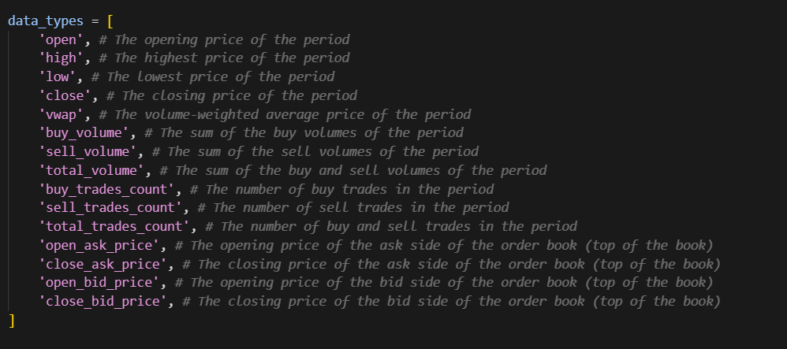](images/8c46d46baaf4.png)

(see appendix for text that can be copy-pasted)

Now, from here we need to come up with transforms, these are the valid operations that the system is allowed to do. We will not allow it to come up with custom ones since this could introduce lookahead bias (which it will definitely do if you let it):

[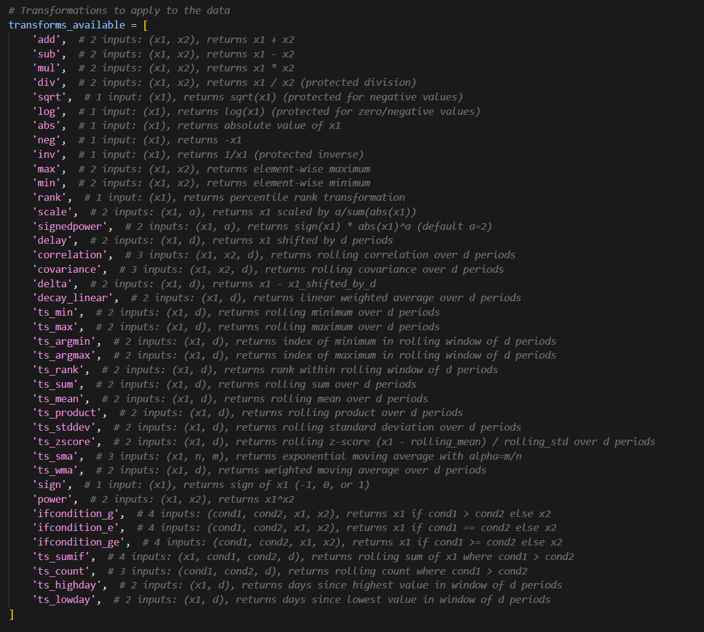](images/7fdd473696e3.png)

(see appendix for text that can be copy-pasted)

To me these feel like a reasonable set of transforms + data types to create a wide range of strategies.

### Developing The System Prompt

---

Now let’s try a first attempt at a prompt to generate a strategy (model=o3):

[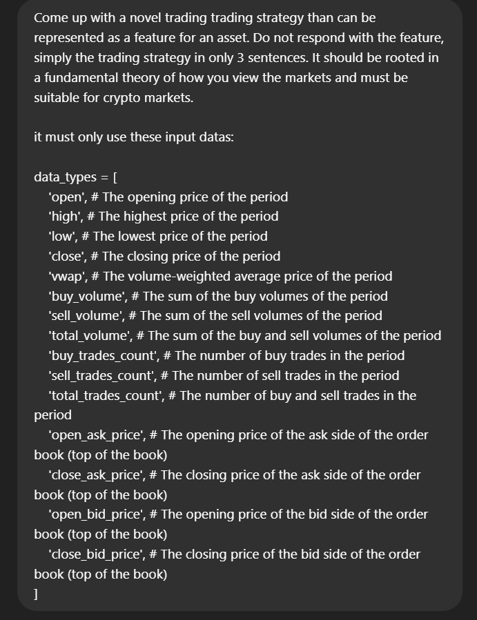](images/c161b5fef540.png)

[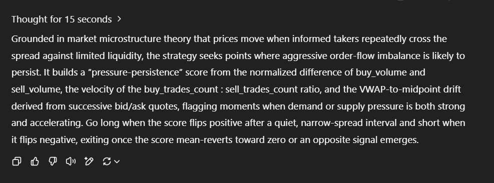](images/08c29f7d0f60.png)

(text for prompt in appendix)

Okay, we’ve now got a first attempt at our prompt for our strategy generation agent — in all honesty, I think we will have multiple stages to this otherwise there won’t be enough diversity. I.e. we have an agent which produces a list of categories and then we loop through that to generate ideas. This should help enforce better diversity, then every so and so often maybe we let it purely go from scratch with a high temperature on for a wildcard or two. This is something we can play around with — although this is just a fun project so maybe an exercise for the reader if you really want to spend the time building intuition (which is the best way to get good at a strategy, it’s to have a gut feeling about how something will behave).

[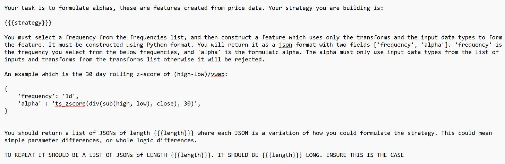](images/e37ecf68f506.png)

I have the above system prompt, and then after it I have the below list of frequencies, data\_types, and transforms\_available (which we came up with earlier in the constructors section).

[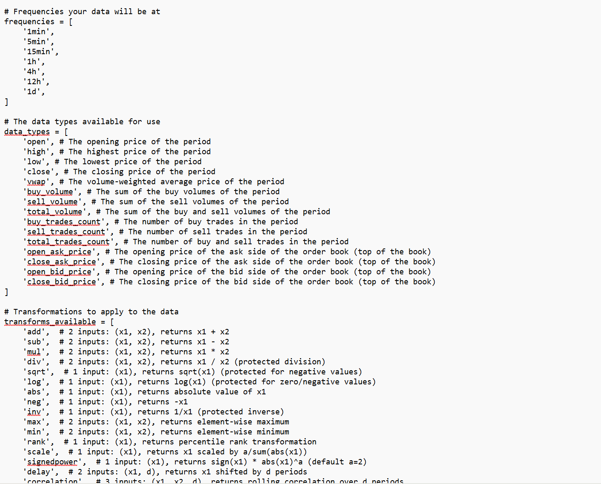](images/f4eb93896e9a.png)

Let’s try it out for a spin with our {{{length}}} set to 5, and our strategy set to the one we generated:

[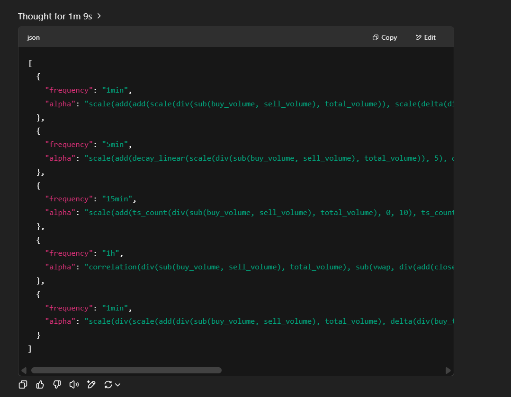](images/7c7e8faec347.png)

Nice… it looks like we’ve just built our AI hedge fund… well not really… we still need to test these alphas, record them to a database, run aggregate testing statistics of their performance, and automate all of this prompting, but hey! it’s a pretty cool step for now to know we’ve managed to generate some alphas based around an actual idea and not just automated guesswork like with genetic algorithms.

Now, digging into the alphas we can see that a lot of them try to synthetically replicate midprice by using bid\_price and ask\_price added together then divided by two. This is already in our dataset so it would be wise to add that in as context for the prompt.

[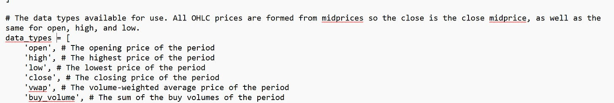](images/9affe0855d83.png)

Now, let’s try again…

[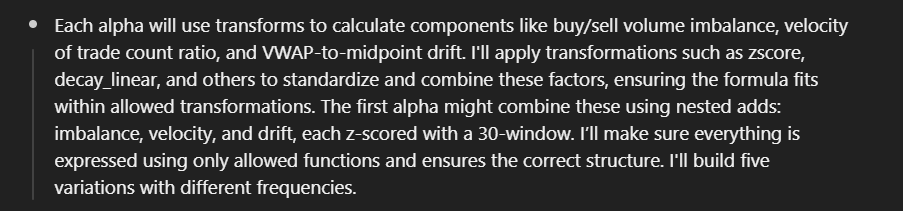](images/af96b1ef7625.png)

When investigating the thought process this time, we can see it’s latched onto the example of using z-scores and 30-period parameter. Z-scores are great and that does give me an idea of potentially listing my “favourite transforms” or something along those lines, but for now let’s stick to an approach that enforces diversity as best possible. I also want to be doing that explicitly if I decide to, so to resolve this issue, I will add this quick line in after we give the AI the example:

```
***This is simply an example of how one would be formatted, you should use the input data, parameters, and transform you feel best suit the strategy.***
```

Running again…

[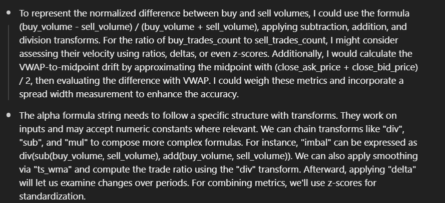](images/709306656c1c.png)

Okay, looks like it is still doing the midprice thing… let’s just ban it from calculating midprice:

```
DO NOT USE (close_bid_price + close_ask_price) / 2 (OR THE EQUIVALENT FOR OPEN). YOU SHOULD DIRECTLY USE CLOSE OR OPEN AS THESE ARE EQUIVALENT SINCE THEY ARE THE CLOSE/OPEN MIDPRICE, NO TRADE PRICES ARE USED FOR OPEN, HIGH, LOW, OR CLOSE.
```

And now let’s try again:

[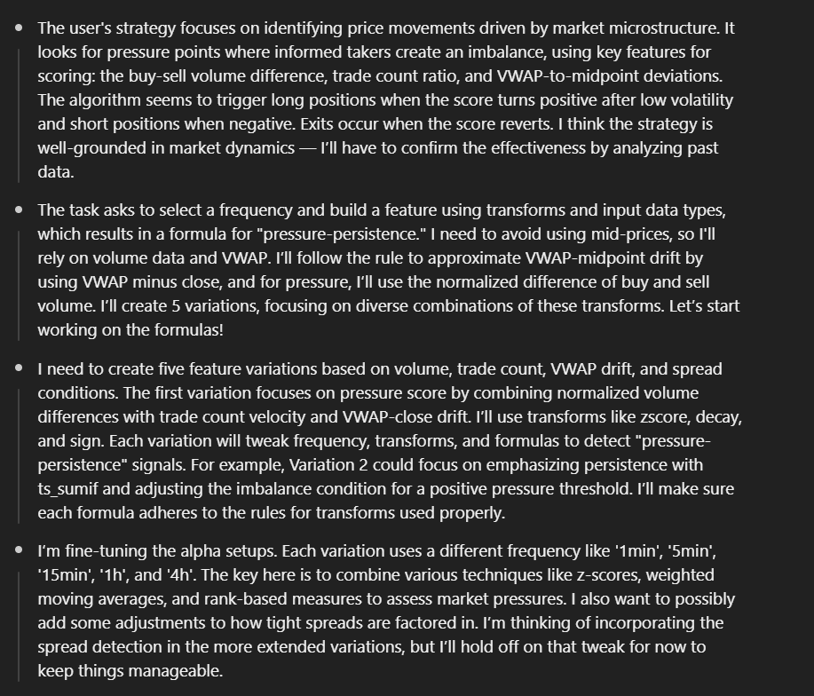](images/b8aa6ff9c576.png)

Pretty reasonable logic, and the alphas make sense:

[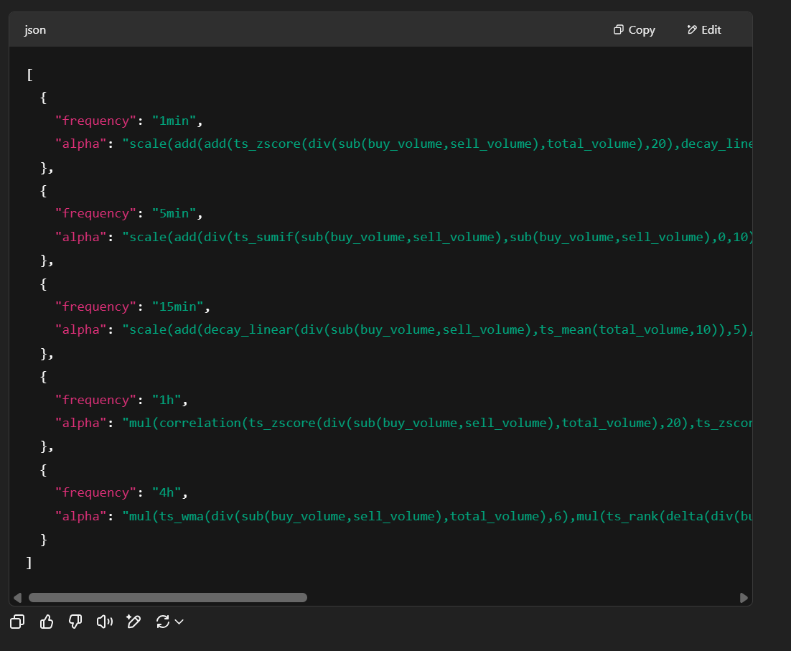](images/09cab4669b20.png)

But, they are starting to get awfully long…

```
[
  {
    "frequency": "1min",
    "alpha": "scale(add(add(ts_zscore(div(sub(buy_volume,sell_volume),total_volume),20),decay_linear(delta(div(buy_trades_count,add(sell_trades_count,1)),1),5)),sign(sub(vwap,close))))"
  },
  {
    "frequency": "5min",
    "alpha": "scale(add(div(ts_sumif(sub(buy_volume,sell_volume),sub(buy_volume,sell_volume),0,10),ts_sum(abs(sub(buy_volume,sell_volume)),10)),add(delta(ts_mean(div(buy_trades_count,add(sell_trades_count,1)),5),1),ts_zscore(sub(vwap,close),10))))"
  },
  {
    "frequency": "15min",
    "alpha": "scale(add(decay_linear(div(sub(buy_volume,sell_volume),ts_mean(total_volume,10)),5),add(decay_linear(delta(div(buy_trades_count,add(sell_trades_count,1)),1),5),sign(sub(vwap,close)))))"
  },
  {
    "frequency": "1h",
    "alpha": "mul(correlation(ts_zscore(div(sub(buy_volume,sell_volume),total_volume),20),ts_zscore(sub(vwap,close),20),5),sign(delta(div(buy_trades_count,add(sell_trades_count,1)),1)))"
  },
  {
    "frequency": "4h",
    "alpha": "mul(ts_wma(div(sub(buy_volume,sell_volume),total_volume),6),mul(ts_rank(delta(div(buy_trades_count,add(sell_trades_count,1)),1),6),mul(ts_rank(inv(sub(close_ask_price,close_bid_price)),6),sign(sub(vwap,close)))))"
  }
]
```

I think to solve our issues relating to extra long features we will add to the prompt a ‘soft’ form of feature regularization:

```
Prefer simplicity wherever possible when designing your features so that we avoid overfitting.
```

Now the new features start to look more reasonable in their length:

```
[
  {
    "frequency": "1min",
    "alpha": "add(ts_zscore(div(sub(buy_volume, sell_volume), total_volume), 60), add(ts_zscore(delta(div(buy_trades_count, sell_trades_count), 1), 60), ts_zscore(sub(vwap, close), 60)))"
  },
  {
    "frequency": "5min",
    "alpha": "add(decay_linear(div(sub(buy_volume, sell_volume), total_volume), 12), add(decay_linear(delta(div(buy_trades_count, sell_trades_count), 1), 12), decay_linear(sub(vwap, close), 12)))"
  },
  {
    "frequency": "15min",
    "alpha": "add(ts_wma(div(sub(buy_volume, sell_volume), total_volume), 20), add(ts_wma(delta(div(buy_trades_count, sell_trades_count), 1), 20), ts_wma(sub(vwap, close), 20)))"
  },
  {
    "frequency": "1h",
    "alpha": "add(correlation(div(sub(buy_volume, sell_volume), total_volume), delta(div(buy_trades_count, sell_trades_count), 1), 30), ts_zscore(sub(vwap, close), 30))"
  },
  {
    "frequency": "4h",
    "alpha": "add(add(ts_rank(div(sub(buy_volume, sell_volume), total_volume), 40), ts_rank(delta(div(buy_trades_count, sell_trades_count), 1), 40)), ts_rank(sub(vwap, close), 40))"
  }
]
```

The reason I call this a soft form of feature regularization is we are simply suggesting in the prompt to be more mindful about the feature length without making the penalty explicit. We could use the regularization technique I discussed in my previous articles (linked at the start of this article) regarding automated alpha search, the traditional way, where we represent the feature as a tree and count the number of levels present in that tree (picture from prev. article):

[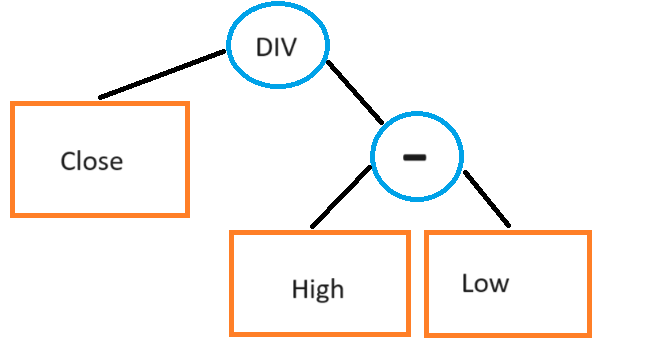](images/04d3556ba7ca.png)

We could also do something dirtier like counting the number of operators in the feature OR purely looking at the text length of the feature (maybe with the names of the input data excluded. Then if we exceed a certain threshold we would re-prompt the AI with a command to shorten the specific features that were too long, likely with a guideline of how much % shorter they needed to become. This is a bit much for now, but feel free to visit this topic yourself if you are replicating this work yourself!

Whilst doing some experimenting, I’ve realized the strategy generation prompt likes to throw in random TA indicators like ATR and RSI (in the strategy definition), but those are not in our list of transforms so I’ve now added a list of the transforms to the strategy idea generation prompt (see appendix for prompt v2).

### Feature Compilation

---

The code which evaluates it and generates the features is in the appendix, but here is some output when I run the example function in there:

[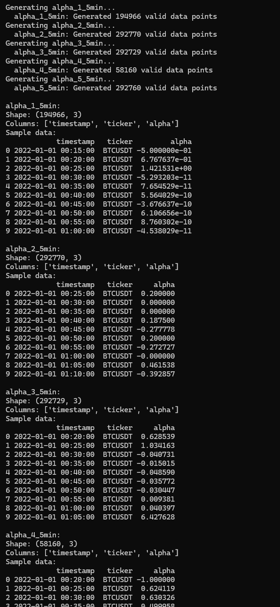](images/9acf39f3a668.png)

### The Backtester

---

Now, in order to validate these alphas we also need the ability to backtest them. I’ve built a quick backtester and stuck it in the appendix.

I’ve decided to use the OHLC data because it took 14 hours for DOGE to process on volume data, and I have 19 more symbols to process and don’t plan on waiting for them to finish (and I did do some reasonable optimizations on the Pandas code). Either get a large server and multi-process or optimize it with Polars if you want it to run faster, but I think we’ll do just fine with OHLC and prove our point regardless so I’ve opted to use this data instead.

The article up until now uses the volume data though since I think better results would be found if that data is included so I will leave this open to the reader.

### Wiring It All Up

---

The appendix has the copy-paste-able version of this, but here is the wire up:

[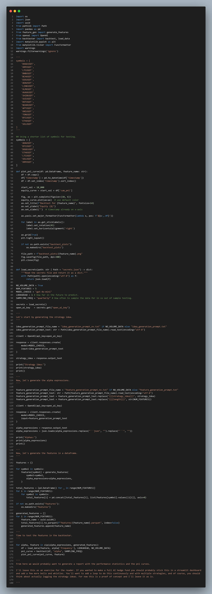](images/fa01da00f02f.png)

I think this is much nicer to read compared to the Substack code insert. Here’s a quick look into the terminal output:

[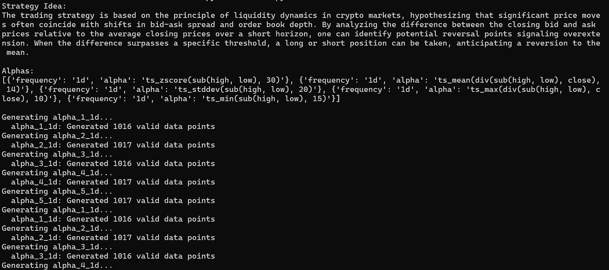](images/3e48ef914fae.png)

And of course, what do the alphas look like?

[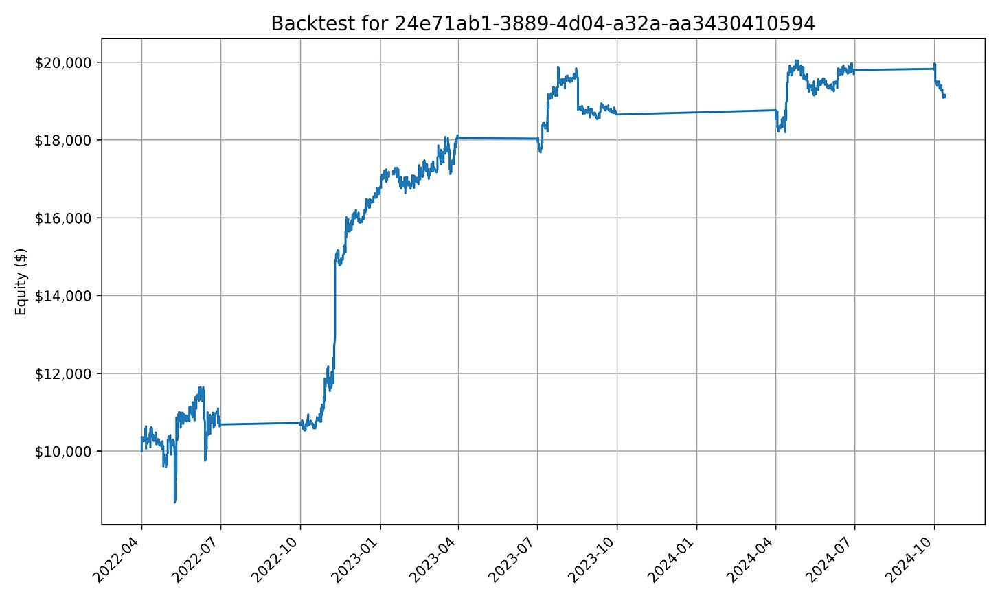](images/50ee34b6f5ea.png)

[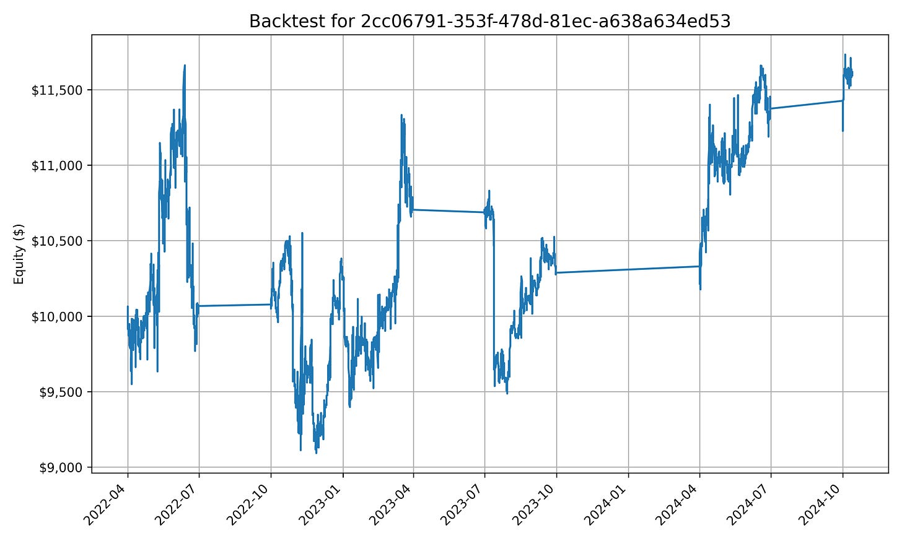](images/23274f4f37c4.png)

[](images/ca5f1da1da10.png)

[](images/5d0afae23fa1.png)

… yeah I can’t say they’re amazing, but perhaps with some better prompting, and more data than simply open, high, low, and close and 7 symbols (this is probably one of the biggest issues, but I don’t have weeks to pre-process data + infinite storage space on my laptop) then better results could be produced.

I think that’s all for today. Hope it was a fun read :)

The Quant Stack is a reader-supported publication. To receive new posts and support my work, consider becoming a free or paid subscriber.

### Appendix

---

#### Feature Compiler

---

```
"""
Alpha Feature Generator

This module contains all the functions and utilities to create and evaluate
alpha features from trading data using various technical analysis operations.
"""

import numpy as np
import pandas as pd
import re

# =============================================================================
# BASIC MATHEMATICAL OPERATIONS
# =============================================================================

def add(x1: pd.DataFrame, x2: pd.DataFrame) -> pd.DataFrame:
    """Element-wise addition: x1 + x2"""
    return x1 + x2

def sub(x1: pd.DataFrame, x2: pd.DataFrame) -> pd.DataFrame:
    """Element-wise subtraction: x1 - x2"""
    return x1 - x2

def mul(x1: pd.DataFrame, x2: pd.DataFrame) -> pd.DataFrame:
    """Element-wise multiplication: x1 * x2"""
    return x1 * x2

def div(x1: pd.DataFrame, x2: pd.DataFrame) -> pd.DataFrame:
    """Protected division: x1 / x2 (handles division by zero)"""
    with np.errstate(divide='ignore', invalid='ignore'):
        result = x1 / x2
        if isinstance(result, pd.DataFrame):
            result = result.replace([np.inf, -np.inf], np.nan)
        return result

def sqrt(x1: pd.DataFrame) -> pd.DataFrame:
    """Protected square root (handles negative values)"""
    with np.errstate(invalid='ignore'):
        return np.where(x1 >= 0, np.sqrt(x1), np.sign(x1) * np.sqrt(np.abs(x1)))

def log(x1: pd.DataFrame) -> pd.DataFrame:
    """Protected logarithm (handles zero/negative values)"""
    with np.errstate(divide='ignore', invalid='ignore'):
        return np.where(x1 > 0, np.log(x1), np.sign(x1) * np.log(np.abs(x1)))

def abs(x1: pd.DataFrame) -> pd.DataFrame:
    """Absolute value"""
    return np.abs(x1)

def neg(x1: pd.DataFrame) -> pd.DataFrame:
    """Negation: -x1"""
    return -x1

def inv(x1: pd.DataFrame) -> pd.DataFrame:
    """Protected inverse: 1/x1"""
    with np.errstate(divide='ignore', invalid='ignore'):
        result = 1.0 / x1
        result = result.replace([np.inf, -np.inf], np.nan)
        return result

def max(x1: pd.DataFrame, x2: pd.DataFrame) -> pd.DataFrame:
    """Element-wise maximum"""
    return np.maximum(x1, x2)

def min(x1: pd.DataFrame, x2: pd.DataFrame) -> pd.DataFrame:
    """Element-wise minimum"""
    return np.minimum(x1, x2)

def sign(x1: pd.DataFrame) -> pd.DataFrame:
    """Sign function: returns -1, 0, or 1"""
    return np.sign(x1)

def power(x1: pd.DataFrame, x2: pd.DataFrame) -> pd.DataFrame:
    """Power function: x1^x2"""
    with np.errstate(invalid='ignore', over='ignore'):
        result = np.power(x1, x2)
        result = result.replace([np.inf, -np.inf], np.nan)
        return result

# =============================================================================
# STATISTICAL AND RANKING OPERATIONS
# =============================================================================

def rank(x1: pd.DataFrame) -> pd.DataFrame:
    """Percentile rank transformation"""
    return x1.rank(pct=True, axis=0)

def scale(x1: pd.DataFrame, a: float = 1) -> pd.DataFrame:
    """Scale by a/sum(abs(x1))"""
    a = int(a)
    sum_abs = np.nansum(np.abs(x1), axis=0)
    # Avoid division by zero
    sum_abs = np.where(sum_abs == 0, 1, sum_abs)
    return (a * x1) / sum_abs

def signedpower(x1: pd.DataFrame, a: float = 2) -> pd.DataFrame:
    """Signed power: sign(x1) * abs(x1)^a"""
    a = int(a)
    return np.sign(x1) * np.power(np.abs(x1), a)

# =============================================================================
# TIME SERIES OPERATIONS
# =============================================================================

def delay(x1: pd.DataFrame, d: int = 5) -> pd.DataFrame:
    """Lag/shift operation: x1 shifted by d periods"""
    d = max(1, int(d))
    return x1.shift(periods=d)

def delta(x1: pd.DataFrame, d: int = 5) -> pd.DataFrame:
    """Difference: x1 - x1_shifted_by_d"""
    d = max(1, int(d))
    return x1 - x1.shift(periods=d)

def ts_sum(x1: pd.DataFrame, d: int = 5) -> pd.DataFrame:
    """Rolling sum over d periods"""
    d = max(2, int(d))
    return x1.rolling(window=d, min_periods=1).sum()

def ts_mean(x1: pd.DataFrame, d: int = 5) -> pd.DataFrame:
    """Rolling mean over d periods"""
    d = max(2, int(d))
    return x1.rolling(window=d, min_periods=1).mean()

def ts_min(x1: pd.DataFrame, d: int = 5) -> pd.DataFrame:
    """Rolling minimum over d periods"""
    d = max(2, int(d))
    return x1.rolling(window=d, min_periods=1).min()

def ts_max(x1: pd.DataFrame, d: int = 5) -> pd.DataFrame:
    """Rolling maximum over d periods"""
    d = max(2, int(d))
    return x1.rolling(window=d, min_periods=1).max()

def ts_stddev(x1: pd.DataFrame, d: int = 5) -> pd.DataFrame:
    """Rolling standard deviation over d periods"""
    d = max(2, int(d))
    return x1.rolling(window=d, min_periods=2).std()

def ts_zscore(x1: pd.DataFrame, d: int = 5) -> pd.DataFrame:
    """Rolling z-score: (x1 - rolling_mean) / rolling_std over d periods"""
    d = max(2, int(d))
    rolling_mean = x1.rolling(window=d, min_periods=1).mean()
    rolling_std = x1.rolling(window=d, min_periods=2).std()
    return (x1 - rolling_mean) / rolling_std

def ts_product(x1: pd.DataFrame, d: int = 5) -> pd.DataFrame:
    """Rolling product over d periods"""
    d = max(2, int(d))
    return x1.rolling(window=d, min_periods=1).apply(lambda x: np.prod(x), raw=True)

def ts_rank(x1: pd.DataFrame, d: int = 5) -> pd.DataFrame:
    """Rank within rolling window of d periods"""
    d = max(2, int(d))

    def rank_last(x):
        """Rank the last value in the window"""
        if len(x) < 1:
            return np.nan
        return (x < x[-1]).sum() / len(x) + (x == x[-1]).sum() / (2 * len(x))

    return x1.rolling(window=d, min_periods=1).apply(rank_last, raw=True)

def ts_argmin(x1: pd.DataFrame, d: int = 5) -> pd.DataFrame:
    """Index of minimum in rolling window"""
    d = max(2, int(d))
    return x1.rolling(window=d, min_periods=1).apply(lambda x: np.argmin(x), raw=True)

def ts_argmax(x1: pd.DataFrame, d: int = 5) -> pd.DataFrame:
    """Index of maximum in rolling window"""
    d = max(2, int(d))
    return x1.rolling(window=d, min_periods=1).apply(lambda x: np.argmax(x), raw=True)

def decay_linear(x1: pd.DataFrame, d: int = 5) -> pd.DataFrame:
    """Linear weighted average over d periods"""
    d = max(2, int(d))
    weights = 2 * np.arange(1, d + 1) / (d * (d + 1))

    def weighted_avg(x):
        if len(x) < 1:
            return np.nan
        actual_weights = weights[-len(x):]
        actual_weights = actual_weights / actual_weights.sum()
        return np.dot(x, actual_weights)

    return x1.rolling(window=d, min_periods=1).apply(weighted_avg, raw=True)

def ts_wma(x1: pd.DataFrame, d: int = 5) -> pd.DataFrame:
    """Weighted moving average over d periods"""
    d = max(2, int(d))
    weights = 2 * np.arange(1, d + 1) / (d * (d + 1))

    def weighted_avg(x):
        if len(x) < 1:
            return np.nan
        actual_weights = weights[-len(x):]
        actual_weights = actual_weights / actual_weights.sum()
        return np.dot(x, actual_weights)

    return x1.rolling(window=d, min_periods=1).apply(weighted_avg, raw=True)

def ts_sma(x1: pd.DataFrame, n: int = 5, m: int = 1) -> pd.DataFrame:
    """Exponential moving average with alpha=m/n"""
    if int(n) <= 1 or int(m) <= 0:
        n, m = 5, 1
    elif m / n > 1:
        m = 1
    else:
        n, m = int(n), int(m)

    return x1.ewm(alpha=m/n).mean()

def ts_highday(x1: pd.DataFrame, d: int = 5) -> pd.DataFrame:
    """Days since highest value in window"""
    d = max(2, int(d))

    def days_since_high(x):
        if len(x) < 1:
            return np.nan
        return len(x) - 1 - np.argmax(x)

    return x1.rolling(window=d, min_periods=1).apply(days_since_high, raw=True)

def ts_lowday(x1: pd.DataFrame, d: int = 5) -> pd.DataFrame:
    """Days since lowest value in window"""
    d = max(2, int(d))

    def days_since_low(x):
        if len(x) < 1:
            return np.nan
        return len(x) - 1 - np.argmin(x)

    return x1.rolling(window=d, min_periods=1).apply(days_since_low, raw=True)

# =============================================================================
# CORRELATION AND COVARIANCE OPERATIONS
# =============================================================================

def correlation(x1: pd.DataFrame | pd.Series, x2: pd.DataFrame | pd.Series, d: int = 5) -> pd.DataFrame | pd.Series:
    """Rolling correlation between x1 and x2"""
    d = max(2, int(d))

    # If both inputs are Series, return Series
    if isinstance(x1, pd.Series) and isinstance(x2, pd.Series):
        return x1.rolling(window=d, min_periods=2).corr(x2)

    # If either is a Series, convert to DataFrame for consistent handling
    if isinstance(x1, pd.Series):
        x1 = x1.to_frame()
    if isinstance(x2, pd.Series):
        x2 = x2.to_frame()

    # Ensure both dataframes have the same columns
    common_cols = x1.columns.intersection(x2.columns)
    result = pd.DataFrame(index=x1.index, columns=common_cols)

    for col in common_cols:
        x1_series = x1[col]
        x2_series = x2[col]
        corr = x1_series.rolling(window=d, min_periods=2).corr(x2_series)
        result[col] = corr

    return result

def covariance(x1: pd.DataFrame, x2: pd.DataFrame, d: int = 5) -> pd.DataFrame:
    """Rolling covariance between x1 and x2"""
    d = max(2, int(d))

    # Ensure both dataframes have the same columns
    common_cols = x1.columns.intersection(x2.columns)
    result = pd.DataFrame(index=x1.index, columns=common_cols)

    for col in common_cols:
        # Calculate rolling covariance for each column
        x1_series = x1[col]
        x2_series = x2[col]

        # Calculate rolling covariance
        cov = x1_series.rolling(window=d, min_periods=2).cov(x2_series)
        result[col] = cov

    return result

# =============================================================================
# CONDITIONAL OPERATIONS
# =============================================================================

def ifcondition_g(condition_var1: pd.DataFrame, condition_var2: pd.DataFrame, 
                    x1: pd.DataFrame, x2: pd.DataFrame) -> pd.DataFrame:
    """If condition_var1 > condition_var2 then x1 else x2"""
    flag = condition_var1 > condition_var2
    result = x1.copy()
    result[~flag] = x2[~flag]
    return result

def ifcondition_ge(condition_var1: pd.DataFrame, condition_var2: pd.DataFrame,
                    x1: pd.DataFrame, x2: pd.DataFrame) -> pd.DataFrame:
    """If condition_var1 >= condition_var2 then x1 else x2"""
    flag = condition_var1 >= condition_var2
    result = x1.copy()
    result[~flag] = x2[~flag]
    return result

def ifcondition_e(condition_var1: pd.DataFrame, condition_var2: pd.DataFrame,
                    x1: pd.DataFrame, x2: pd.DataFrame) -> pd.DataFrame:
    """If condition_var1 == condition_var2 then x1 else x2"""
    flag = condition_var1 == condition_var2
    result = x1.copy()
    result[~flag] = x2[~flag]
    return result

def ts_sumif(x1: pd.DataFrame, condition_var1: pd.DataFrame, 
                condition_var2: pd.DataFrame, d: int = 5) -> pd.DataFrame:
    """Rolling sum of x1 where condition_var1 > condition_var2"""
    d = max(2, int(d))
    flag = condition_var1 > condition_var2
    masked_x1 = x1.copy()
    masked_x1[~flag] = 0
    return masked_x1.rolling(window=d, min_periods=1).sum()

def ts_count(condition_var1: pd.DataFrame, condition_var2: pd.DataFrame, 
                d: int = 5) -> pd.DataFrame:
    """Rolling count where condition_var1 > condition_var2"""
    d = max(2, int(d))
    condition = condition_var1 > condition_var2
    return condition.rolling(window=d, min_periods=1).sum()


class AlphaFeatureGenerator:
    """
    A comprehensive alpha feature generator that can evaluate complex alpha expressions
    and apply various technical analysis functions to trading data.
    """

    def __init__(self, alpha_expressions: list[dict[str, str]], data_types: list[str] = None):

        if data_types is None:
            data_types = [
                'open_ask_price', 'close_ask_price', 'open_bid_price', 'close_bid_price',
                'open', 'high', 'low', 'close',
                #'vwap', 'buy_volume', 'sell_volume', 'total_volume',
                #'buy_trades_count', 'sell_trades_count', 'total_trades_count',
            ]

        self.data_types = data_types
        self.alpha_expressions = alpha_expressions

    # =============================================================================
    # ALPHA EVALUATION ENGINE
    # =============================================================================

    def substitute_data(self, alpha: str) -> str:
        """
        Puts the data types in the alpha expression in the form of a DataFrame column.
        Uses a single regex pass to avoid conflicts.
        """
        # Sort by length (longest first) and create pattern
        sorted_data_types = sorted(self.data_types, key=len, reverse=True)
        pattern = r'\b(' + '|'.join(re.escape(dt) for dt in sorted_data_types) + r')\b'

        def replace_func(match):
            return f"df['{match.group(1)}']"

        return re.sub(pattern, replace_func, alpha)

    def evaluate_alpha(self, df: pd.DataFrame, alpha_expression: str) -> pd.DataFrame:
        """
        Evaluate an alpha expression on the given DataFrame.

        Parameters:
        -----------
        df : pd.DataFrame
            DataFrame containing the required data columns
        alpha_expression : str
            Alpha expression to evaluate

        Returns:
        --------
        pd.DataFrame
            Result of the alpha expression evaluation
        """
        alpha_expression = self.substitute_data(alpha_expression)

        try:
            result = eval(alpha_expression)

            if isinstance(result, pd.Series):
                result = result.to_frame()
            elif not isinstance(result, pd.DataFrame):
                result = pd.DataFrame(result, index=df.index)

            return result

        except Exception as e:
            print(f"Error evaluating alpha expression: {alpha_expression}")
            print(f"Error: {str(e)}")
            return pd.DataFrame()

    def format_output(self, alpha_result: pd.DataFrame, alpha_name: str, symbol: str) -> pd.DataFrame:
        """
        Format the alpha result into the desired output format.

        Parameters:
        -----------
        alpha_result : pd.DataFrame
            Raw alpha calculation result
        alpha_name : str
            Name of the alpha feature
        symbol : str
            Trading symbol/ticker

        Returns:
        --------
        pd.DataFrame
            Formatted output with columns: timestamp, ticker, alpha
        """
        if alpha_result.empty:
            return pd.DataFrame(columns=['timestamp', 'ticker', 'alpha'])

        if alpha_result.shape[1] == 1:
            alpha_values = alpha_result.iloc[:, 0]
        else:
            alpha_values = alpha_result.mean(axis=1)

        output = pd.DataFrame({
            'timestamp': alpha_result.index,
            'ticker': symbol,
            'alpha': alpha_values
        })

        output = output.dropna(subset=['alpha'])        
        output = output.reset_index(drop=True)

        return output

    def generate_feature(self, df: pd.DataFrame, feature_i: int, symbol: str) -> pd.DataFrame:
        """
        Generate alpha feature for the given DataFrame.

        Parameters:
        -----------
        df : pd.DataFrame
            DataFrame containing the required data columns
        feature_i : int
            Index of the feature to generate
        symbol : str
            Trading symbol/ticker

        Returns:
        --------
        pd.DataFrame
            Formatted alpha feature with columns: timestamp, ticker, alpha
        """
        alpha_config = self.alpha_expressions[feature_i]

        freq = alpha_config["frequency"]
        expression = alpha_config["alpha"]

        feature_name = f"alpha_{feature_i+1}_{freq}"
        print(f"Generating {feature_name}...")

        alpha_result = self.evaluate_alpha(df, expression)
        if not alpha_result.empty:
            formatted_output = self.format_output(alpha_result, feature_name, symbol)
            print(f"  {feature_name}: Generated {len(formatted_output)} valid data points")
            return formatted_output
        else:
            print(f"  {feature_name}: No valid data generated")
        return pd.DataFrame(columns=['timestamp', 'ticker', 'alpha'])

def load_data(symbol: str, freq: str):
    """
    Load data for the specified timeframe.
    """
    return pd.read_parquet(f"resampled_ohlc/{symbol}_ohlc_{freq}.parquet")

def generate_features_for_timeframe(symbol: str, alpha_expressions: list[dict[str, str]], data_types: list[str] = None):
    """
    Generate alpha features for a specific timeframe using the load_data function.

    Parameters:
    -----------
    symbol : str
        Trading symbol/ticker
    alpha_expressions : list[dict[str, str]]
        List of alpha expressions to evaluate
    data_types : list[str], optional
        List of data column types to use

    Returns:
    --------
    dict[str, pd.DataFrame]
        Dictionary mapping alpha names to their computed values
    """
    features = {}
    generator = AlphaFeatureGenerator(alpha_expressions, data_types)

    for i, alpha in enumerate(alpha_expressions):
        freq = alpha["frequency"]
        df = load_data(symbol, freq)
        feature = generator.generate_feature(df, i, symbol)
        features[f"alpha_{i+1}_{freq}"] = feature

    return features


def example_usage():
    """Example of how to use the AlphaFeatureGenerator with load_data function"""

    symbol = 'BTCUSDT'

    # Define the alpha expressions
    alpha_expressions = [
        {
            "frequency": "5min",
            "alpha": "mul(ts_zscore(delta(close, 1), 20), ts_zscore(neg(delta(sub(close_ask_price, close_bid_price), 1)), 20))"
        },
        {
            "frequency": "5min",
            "alpha": "mul(sign(ts_zscore(delta(close, 3), 15)), sub(ts_rank(neg(delta(sub(close_ask_price, close_bid_price), 1)), 20), div(1, 2)))"
        },
        {
            "frequency": "5min",
            "alpha": "mul(ts_zscore(delta(close, 2), 30), neg(delta(div(sub(close_ask_price, close_bid_price), decay_linear(sub(close_ask_price, close_bid_price), 10)), 1)))"
        },
        {
            "frequency": "5min",
            "alpha": "correlation(ts_zscore(delta(close, 1), 20), ts_zscore(neg(delta(sub(close_ask_price, close_bid_price), 1)), 20), 10)"
        },
        {
            "frequency": "5min",
            "alpha": "mul(sign(delta(close, 2)), neg(delta(sub(close_ask_price, close_bid_price), 5)))"
        }
    ]


    features = generate_features_for_timeframe(symbol, alpha_expressions)

    return features

'''
if __name__ == "__main__":
    features = example_usage()

    for name, feature in features.items():
        if not feature.empty:
            print(f"\n{name}:")
            print(f"Shape: {feature.shape}")
            print(f"Columns: {feature.columns.tolist()}")
            print("Sample data:")
            print(feature.head(10))
        else:
            print(f"\n{name}: Failed to generate")
'''
```

#### Auto Hedge Fund Code

---

```
import os
import json
import uuid
from pathlib import Path
import pandas as pd
from feature_gen import generate_features
from openai import OpenAI
from backtester import backtest, load_data
import matplotlib.pyplot as plt
from matplotlib.ticker import FuncFormatter
import warnings
warnings.filterwarnings('ignore')

'''
symbols = [
    'DOGEUSDT',
    'XRPUSDT',
    'LTCUSDT',
    'BNBUSDT',
    'BCHUSDT',
    'EOSUSDT',
    'ADAUSDT',
    'LINKUSDT',
    'XLMUSDT',
    'AVAXUSDT',
    'SHIBUSDT',
    'SUIUSDT',
    'DOTUSDT',
    'NEARUSDT',
    'APTUSDT',
    'UNIUSDT',
    'TONUSDT',
    'BTCUSDT',
    'ETHUSDT',
    'SOLUSDT'
]
'''

## Using a shorter list of symbols for testing. 
symbols = [
    'ADAUSDT',
    'BTCUSDT',
    'DOGEUSDT',
    'ETHUSDT',
    'LTCUSDT',
    'SOLUSDT',
    'XRPUSDT',
]

def plot_pnl_curve(df: pd.DataFrame, feature_name: str):
    df = df.copy()
    df['timestamp'] = pd.to_datetime(df['timestamp'])
    df = df.set_index('timestamp').sort_index()

    start_val = 10_000
    equity_curve = start_val + df['cum_pnl']

    fig, ax = plt.subplots(figsize=(10, 6))
    equity_curve.plot(ax=ax)  # use default color
    ax.set_title(f"Backtest for {feature_name}", fontsize=14)
    ax.set_ylabel("Equity ($)")
    ax.set_xlabel("")  # timestamp already on x-axis

    ax.yaxis.set_major_formatter(FuncFormatter(lambda x, pos: f'${x:,.0f}'))

    for label in ax.get_xticklabels():
        label.set_rotation(45)
        label.set_horizontalalignment('right')

    ax.grid(True)
    plt.tight_layout()

    if not os.path.exists("backtest_plots"):
        os.makedirs("backtest_plots")

    file_path = f"backtest_plots/{feature_name}.png"
    fig.savefig(file_path, dpi=300)
    plt.close(fig)


def load_secrets(path: str | Path = "secrets.json") -> dict:
    """Read the secrets file and return it as a dict."""
    with Path(path).open(encoding="utf-8") as f:
        return json.load(f)

NO_VOLUME_DATA = True
NUM_FEATURES = 5
MODEL_CHOICE = "gpt-4o-mini"
LOOKAHEAD = 1 # How far in the future to predict.
SAMPLING_FREQ = "quarterly" # How often to sample the data for in vs out of sample testing.

secrets = load_secrets()                 
open_ai_key   = secrets.get("open_ai_key")

'''
Let's start by generating the strategy idea.
'''

idea_generation_prompt_file_name = "idea_generation_prompt_nv.txt" if NO_VOLUME_DATA else "idea_generation_prompt.txt"
idea_generation_prompt_text: str = Path(idea_generation_prompt_file_name).read_text(encoding="utf-8")

client = OpenAI(api_key=open_ai_key)

response = client.responses.create(
    model=MODEL_CHOICE,
    input=idea_generation_prompt_text
)

strategy_idea = response.output_text

'''
Now, let's generate the alpha expressions.
'''

feature_generation_prompt_file_name = "feature_generation_prompt_nv.txt" if NO_VOLUME_DATA else "feature_generation_prompt.txt"
feature_generation_prompt_text: str = Path(feature_generation_prompt_file_name).read_text(encoding="utf-8")
feature_generation_prompt_text = feature_generation_prompt_text.replace("{{{strategy_idea}}}", strategy_idea)
feature_generation_prompt_text = feature_generation_prompt_text.replace("{{{length}}}", str(NUM_FEATURES))

client = OpenAI(api_key=open_ai_key)

response = client.responses.create(
    model=MODEL_CHOICE,      
    input=feature_generation_prompt_text
)

alpha_expressions = response.output_text
alpha_expressions = json.loads(alpha_expressions.replace("```json", "").replace("```", ""))

'''
Now, let's generate the features in a dataframe.
'''

features = {}

for symbol in symbols:
    features[symbol] = generate_features(
        symbol=symbol,
        alpha_expressions=alpha_expressions,
    )

total_features = [pd.DataFrame() for _ in range(NUM_FEATURES)]
for i in range(NUM_FEATURES):
    for symbol in symbols:
        total_features[i] = pd.concat([total_features[i], list(features[symbol].values())[i]], axis=0)

if not os.path.exists("features"):
    os.makedirs("features")

generated_features = []
for i in range(NUM_FEATURES):
    feature_name = uuid.uuid4()
    total_features[i].to_parquet(f"features/{feature_name}.parquet", index=False)
    generated_features.append(feature_name)

'''
Time to test the features in the backtester.
'''

for alpha, feature in zip(alpha_expressions, generated_features):
    df = load_data(feature, alpha['frequency'], LOOKAHEAD, NO_VOLUME_DATA)
    pnl_curve = backtest(df, "alpha", SAMPLING_FREQ)
    plot_pnl_curve(pnl_curve, feature)

'''
From here we would probably want to generate a report with the performance statistics and the pnl curves.

I'll leave this as an exercise for the reader. If you wanted to make a full AI hedge fund you should probably stick this in a streamlit dashboard
and add a few more bells and whistles. You'll want to add a loop to do this continuously and with multiple strategies, and of course, you should
think about actually logging the strategy ideas. For now this is a proof of concept and I'll leave it as is.

'''
```

#### Backtester Code

---

```
import pandas as pd

symbols = [
    'ADAUSDT',
    'BTCUSDT',
    'DOGEUSDT',
    'ETHUSDT',
    'LTCUSDT',
    'SOLUSDT',
    'XRPUSDT',
]


def load_sim_data(freq: str = '1min', target_lookahead: int = 1, no_volume_data: bool = False) -> pd.DataFrame:
    """
    Load the simulation data for the given frequency and lookahead.
    This data will be used for calculating transaction costs and the target.
    """

    df_sim = pd.DataFrame()
    for symbol in symbols:
        df_symbol_sim = pd.read_parquet(
            f'resampled_ohlcv/{symbol}_ohlcv_{freq}.parquet' if not no_volume_data else f'resampled_ohlc/{symbol}_ohlc_{freq}.parquet',
            columns=[
                "close",
                "close_bid_price",
                "close_ask_price",
            ],
            engine='pyarrow',
        )
        df_symbol_sim.index.name = 'timestamp'
        df_symbol_sim.reset_index(inplace=True)
        df_symbol_sim['timestamp'] = pd.to_datetime(df_symbol_sim['timestamp'])
        df_symbol_sim['ticker'] = symbol
        df_symbol_sim['target'] = (
            df_symbol_sim['close']
                .pct_change(periods=target_lookahead)
                .shift(-target_lookahead)
        )
        df_symbol_sim['entry_spread_bps'] = 10_000 * ((df_symbol_sim['close_ask_price'] - df_symbol_sim['close_bid_price']) / \
                                                      ((df_symbol_sim['close_ask_price'] + df_symbol_sim['close_bid_price']) / 2)) / 2
        df_symbol_sim['exit_spread_bps'] = 10_000 * ((df_symbol_sim['close_ask_price'].shift(-target_lookahead) - df_symbol_sim['close_bid_price'].shift(-target_lookahead)) / \
                                                      ((df_symbol_sim['close_ask_price'].shift(-target_lookahead) + df_symbol_sim['close_bid_price'].shift(-target_lookahead)) / 2)) / 2

        df_symbol_sim.dropna(inplace=True)
        df_symbol_sim.drop(columns=['close'], inplace=True)
        df_sim = pd.concat([df_sim, df_symbol_sim], axis=0)
    return df_sim

def load_features(feature_name: str) -> pd.DataFrame:
    """
    Load the features for the given feature name.
    """
    df_features = pd.read_parquet(
        f'features/{feature_name}.parquet',
        engine='pyarrow',
    )
    return df_features

def merge_data(df_features: pd.DataFrame, df_sim: pd.DataFrame) -> pd.DataFrame:
    """
    Merge the features and the simulation data.
    """
    df_features = df_features.sort_values(by=['timestamp', 'ticker'])
    df_sim = df_sim.sort_values(by=['timestamp', 'ticker'])
    df_merged = pd.merge(df_features, df_sim, on=['timestamp', 'ticker'], how='left')
    df_merged.dropna(inplace=True)
    return df_merged

def load_data(
    feature_name: str,
    freq: str,
    target_lookahead: int,
    no_volume_data: bool = False,
) -> pd.DataFrame:
    """
    Load the data for the given features and target.
    """
    df_sim = load_sim_data(freq, target_lookahead, no_volume_data)
    df_features = load_features(feature_name)
    df_merged = merge_data(df_features, df_sim)
    return df_merged

def backtest(
    df: pd.DataFrame,
    feature_name: str,
    sampling_freq: str,
) -> pd.DataFrame:
    """
    Backtest the feature and the target.
    """

    if sampling_freq.lower() == "quarterly":
        df = df.loc[
            ((df['timestamp'].dt.quarter % 2) == (df['timestamp'].dt.year % 2))
        ]
    elif sampling_freq.lower() == "monthly":
        df = df.loc[(df['timestamp'].dt.month % 2) == (df['timestamp'].dt.year % 2)]
    else:
        raise ValueError(f"Sampling frequency {sampling_freq} not supported")

    df[f"position"] = 10000 * df.groupby('timestamp')[feature_name].transform(
            lambda x: (x - x.mean()) / x.sub(x.mean()).abs().sum()
    )
    df[f"pnl"] = df[f"position"] * df["target"]

    df[f"cum_pnl"] = df[f"pnl"].cumsum()

    return df
```

#### Data Types / Transforms Text

---

```
data_types = [ 
    'open', # The opening price of the period
    'high', # The highest price of the period
    'low', # The lowest price of the period
    'close', # The closing price of the period
    'vwap', # The volume-weighted average price of the period
    'buy_volume', # The sum of the buy volumes of the period
    'sell_volume', # The sum of the sell volumes of the period
    'total_volume', # The sum of the buy and sell volumes of the period
    'buy_trades_count', # The number of buy trades in the period
    'sell_trades_count', # The number of sell trades in the period
    'total_trades_count', # The number of buy and sell trades in the period
    'open_ask_price', # The opening price of the ask side of the order book (top of the book)
    'close_ask_price', # The closing price of the ask side of the order book (top of the book)
    'open_bid_price', # The opening price of the bid side of the order book (top of the book)
    'close_bid_price', # The closing price of the bid side of the order book (top of the book)
]


# Transformations to apply to the data
transforms_available = [
    'add',  # 2 inputs: (x1, x2), returns x1 + x2
    'sub',  # 2 inputs: (x1, x2), returns x1 - x2
    'mul',  # 2 inputs: (x1, x2), returns x1 * x2
    'div',  # 2 inputs: (x1, x2), returns x1 / x2 (protected division)
    'sqrt',  # 1 input: (x1), returns sqrt(x1) (protected for negative values)
    'log',  # 1 input: (x1), returns log(x1) (protected for zero/negative values)
    'abs',  # 1 input: (x1), returns absolute value of x1
    'neg',  # 1 input: (x1), returns -x1
    'inv',  # 1 input: (x1), returns 1/x1 (protected inverse)
    'max',  # 2 inputs: (x1, x2), returns element-wise maximum
    'min',  # 2 inputs: (x1, x2), returns element-wise minimum
    'rank',  # 1 input: (x1), returns percentile rank transformation
    'scale',  # 2 inputs: (x1, a), returns x1 scaled by a/sum(abs(x1))
    'signedpower',  # 2 inputs: (x1, a), returns sign(x1) * abs(x1)^a (default a=2)
    'delay',  # 2 inputs: (x1, d), returns x1 shifted by d periods
    'correlation',  # 3 inputs: (x1, x2, d), returns rolling correlation over d periods
    'covariance',  # 3 inputs: (x1, x2, d), returns rolling covariance over d periods
    'delta',  # 2 inputs: (x1, d), returns x1 - x1_shifted_by_d
    'decay_linear',  # 2 inputs: (x1, d), returns linear weighted average over d periods
    'ts_min',  # 2 inputs: (x1, d), returns rolling minimum over d periods
    'ts_max',  # 2 inputs: (x1, d), returns rolling maximum over d periods
    'ts_argmin',  # 2 inputs: (x1, d), returns index of minimum in rolling window of d periods
    'ts_argmax',  # 2 inputs: (x1, d), returns index of maximum in rolling window of d periods
    'ts_rank',  # 2 inputs: (x1, d), returns rank within rolling window of d periods
    'ts_sum',  # 2 inputs: (x1, d), returns rolling sum over d periods
    'ts_mean',  # 2 inputs: (x1, d), returns rolling mean over d periods
    'ts_product',  # 2 inputs: (x1, d), returns rolling product over d periods
    'ts_stddev',  # 2 inputs: (x1, d), returns rolling standard deviation over d periods
    'ts_zscore',  # 2 inputs: (x1, d), returns rolling z-score (x1 - rolling_mean) / rolling_std over d periods
    'ts_sma',  # 3 inputs: (x1, n, m), returns exponential moving average with alpha=m/n
    'ts_wma',  # 2 inputs: (x1, d), returns weighted moving average over d periods
    'sign',  # 1 input: (x1), returns sign of x1 (-1, 0, or 1)
    'power',  # 2 inputs: (x1, x2), returns x1^x2
    'ifcondition_g',  # 4 inputs: (cond1, cond2, x1, x2), returns x1 if cond1 > cond2 else x2
    'ifcondition_e',  # 4 inputs: (cond1, cond2, x1, x2), returns x1 if cond1 == cond2 else x2
    'ifcondition_ge',  # 4 inputs: (cond1, cond2, x1, x2), returns x1 if cond1 >= cond2 else x2
    'ts_sumif',  # 4 inputs: (x1, cond1, cond2, d), returns rolling sum of x1 where cond1 > cond2
    'ts_count',  # 3 inputs: (cond1, cond2, d), returns rolling count where cond1 > cond2
    'ts_highday',  # 2 inputs: (x1, d), returns days since highest value in window of d periods
    'ts_lowday',  # 2 inputs: (x1, d), returns days since lowest value in window of d periods
]
```

#### Prompts

---

This is the prompt we used to generate our strategy (v1):

```
Come up with a novel trading trading strategy than can be represented as a feature for an asset. Do not respond with the feature, simply the trading strategy in only 3 sentences. It should be rooted in a fundamental theory of how you view the markets and must be suitable for crypto markets.

it must only use these input datas:

data_types = [ 
    'open', # The opening price of the period
    'high', # The highest price of the period
    'low', # The lowest price of the period
    'close', # The closing price of the period
    'vwap', # The volume-weighted average price of the period
    'buy_volume', # The sum of the buy volumes of the period
    'sell_volume', # The sum of the sell volumes of the period
    'total_volume', # The sum of the buy and sell volumes of the period
    'buy_trades_count', # The number of buy trades in the period
    'sell_trades_count', # The number of sell trades in the period
    'total_trades_count', # The number of buy and sell trades in the period
    'open_ask_price', # The opening price of the ask side of the order book (top of the book)
    'close_ask_price', # The closing price of the ask side of the order book (top of the book)
    'open_bid_price', # The opening price of the bid side of the order book (top of the book)
    'close_bid_price', # The closing price of the bid side of the order book (top of the book)
]
```

And (v2):

```
Come up with a novel trading trading strategy than can be represented as a feature for an asset. Do not respond with the feature, simply the trading strategy in only 3 sentences. It should be rooted in a fundamental theory of how you view the markets and must be suitable for crypto markets.

it must only use these input datas:

data_types = [ 
    'open', # The opening price of the period
    'high', # The highest price of the period
    'low', # The lowest price of the period
    'close', # The closing price of the period
    'vwap', # The volume-weighted average price of the period
    'buy_volume', # The sum of the buy volumes of the period
    'sell_volume', # The sum of the sell volumes of the period
    'total_volume', # The sum of the buy and sell volumes of the period
    'buy_trades_count', # The number of buy trades in the period
    'sell_trades_count', # The number of sell trades in the period
    'total_trades_count', # The number of buy and sell trades in the period
    'open_ask_price', # The opening price of the ask side of the order book (top of the book)
    'close_ask_price', # The closing price of the ask side of the order book (top of the book)
    'open_bid_price', # The opening price of the bid side of the order book (top of the book)
    'close_bid_price', # The closing price of the bid side of the order book (top of the book)
]

and it should be able to be constructed with these transforms:

# Transformations to apply to the data
transforms_available = [
    'add',  # 2 inputs: (x1, x2), returns x1 + x2
    'sub',  # 2 inputs: (x1, x2), returns x1 - x2
    'mul',  # 2 inputs: (x1, x2), returns x1 * x2
    'div',  # 2 inputs: (x1, x2), returns x1 / x2 (protected division)
    'sqrt',  # 1 input: (x1), returns sqrt(x1) (protected for negative values)
    'log',  # 1 input: (x1), returns log(x1) (protected for zero/negative values)
    'abs',  # 1 input: (x1), returns absolute value of x1
    'neg',  # 1 input: (x1), returns -x1
    'inv',  # 1 input: (x1), returns 1/x1 (protected inverse)
    'max',  # 2 inputs: (x1, x2), returns element-wise maximum
    'min',  # 2 inputs: (x1, x2), returns element-wise minimum
    'rank',  # 1 input: (x1), returns percentile rank transformation
    'scale',  # 2 inputs: (x1, a), returns x1 scaled by a/sum(abs(x1))
    'signedpower',  # 2 inputs: (x1, a), returns sign(x1) * abs(x1)^a (default a=2)
    'delay',  # 2 inputs: (x1, d), returns x1 shifted by d periods
    'correlation',  # 3 inputs: (x1, x2, d), returns rolling correlation over d periods
    'covariance',  # 3 inputs: (x1, x2, d), returns rolling covariance over d periods
    'delta',  # 2 inputs: (x1, d), returns x1 - x1_shifted_by_d
    'decay_linear',  # 2 inputs: (x1, d), returns linear weighted average over d periods
    'ts_min',  # 2 inputs: (x1, d), returns rolling minimum over d periods
    'ts_max',  # 2 inputs: (x1, d), returns rolling maximum over d periods
    'ts_argmin',  # 2 inputs: (x1, d), returns index of minimum in rolling window of d periods
    'ts_argmax',  # 2 inputs: (x1, d), returns index of maximum in rolling window of d periods
    'ts_rank',  # 2 inputs: (x1, d), returns rank within rolling window of d periods
    'ts_sum',  # 2 inputs: (x1, d), returns rolling sum over d periods
    'ts_mean',  # 2 inputs: (x1, d), returns rolling mean over d periods
    'ts_product',  # 2 inputs: (x1, d), returns rolling product over d periods
    'ts_stddev',  # 2 inputs: (x1, d), returns rolling standard deviation over d periods
    'ts_zscore',  # 2 inputs: (x1, d), returns rolling z-score (x1 - rolling_mean) / rolling_std over d periods
    'ts_sma',  # 3 inputs: (x1, n, m), returns exponential moving average with alpha=m/n
    'ts_wma',  # 2 inputs: (x1, d), returns weighted moving average over d periods
    'sign',  # 1 input: (x1), returns sign of x1 (-1, 0, or 1)
    'power',  # 2 inputs: (x1, x2), returns x1^x2
    'ifcondition_g',  # 4 inputs: (cond1, cond2, x1, x2), returns x1 if cond1 > cond2 else x2
    'ifcondition_e',  # 4 inputs: (cond1, cond2, x1, x2), returns x1 if cond1 == cond2 else x2
    'ifcondition_ge',  # 4 inputs: (cond1, cond2, x1, x2), returns x1 if cond1 >= cond2 else x2
    'ts_sumif',  # 4 inputs: (x1, cond1, cond2, d), returns rolling sum of x1 where cond1 > cond2
    'ts_count',  # 3 inputs: (cond1, cond2, d), returns rolling count where cond1 > cond2
    'ts_highday',  # 2 inputs: (x1, d), returns days since highest value in window of d periods
    'ts_lowday',  # 2 inputs: (x1, d), returns days since lowest value in window of d periods
]
```

no volume version:

```
Come up with a novel trading trading strategy than can be represented as a feature for an asset. Do not respond with the feature, simply the trading strategy in only 3 sentences. It should be rooted in a fundamental theory of how you view the markets and must be suitable for crypto markets.

it must only use these input datas:

data_types = [ 
    'open', # The opening price of the period
    'high', # The highest price of the period
    'low', # The lowest price of the period
    'close', # The closing price of the period
    'open_ask_price', # The opening price of the ask side of the order book (top of the book)
    'close_ask_price', # The closing price of the ask side of the order book (top of the book)
    'open_bid_price', # The opening price of the bid side of the order book (top of the book)
    'close_bid_price', # The closing price of the bid side of the order book (top of the book)
]

and it should be able to be constructed with these transforms:

# Transformations to apply to the data
transforms_available = [
    'add',  # 2 inputs: (x1, x2), returns x1 + x2
    'sub',  # 2 inputs: (x1, x2), returns x1 - x2
    'mul',  # 2 inputs: (x1, x2), returns x1 * x2
    'div',  # 2 inputs: (x1, x2), returns x1 / x2 (protected division)
    'sqrt',  # 1 input: (x1), returns sqrt(x1) (protected for negative values)
    'log',  # 1 input: (x1), returns log(x1) (protected for zero/negative values)
    'abs',  # 1 input: (x1), returns absolute value of x1
    'neg',  # 1 input: (x1), returns -x1
    'inv',  # 1 input: (x1), returns 1/x1 (protected inverse)
    'max',  # 2 inputs: (x1, x2), returns element-wise maximum
    'min',  # 2 inputs: (x1, x2), returns element-wise minimum
    'rank',  # 1 input: (x1), returns percentile rank transformation
    'scale',  # 2 inputs: (x1, a), returns x1 scaled by a/sum(abs(x1))
    'signedpower',  # 2 inputs: (x1, a), returns sign(x1) * abs(x1)^a (default a=2)
    'delay',  # 2 inputs: (x1, d), returns x1 shifted by d periods
    'correlation',  # 3 inputs: (x1, x2, d), returns rolling correlation over d periods
    'covariance',  # 3 inputs: (x1, x2, d), returns rolling covariance over d periods
    'delta',  # 2 inputs: (x1, d), returns x1 - x1_shifted_by_d
    'decay_linear',  # 2 inputs: (x1, d), returns linear weighted average over d periods
    'ts_min',  # 2 inputs: (x1, d), returns rolling minimum over d periods
    'ts_max',  # 2 inputs: (x1, d), returns rolling maximum over d periods
    'ts_argmin',  # 2 inputs: (x1, d), returns index of minimum in rolling window of d periods
    'ts_argmax',  # 2 inputs: (x1, d), returns index of maximum in rolling window of d periods
    'ts_rank',  # 2 inputs: (x1, d), returns rank within rolling window of d periods
    'ts_sum',  # 2 inputs: (x1, d), returns rolling sum over d periods
    'ts_mean',  # 2 inputs: (x1, d), returns rolling mean over d periods
    'ts_product',  # 2 inputs: (x1, d), returns rolling product over d periods
    'ts_stddev',  # 2 inputs: (x1, d), returns rolling standard deviation over d periods
    'ts_zscore',  # 2 inputs: (x1, d), returns rolling z-score (x1 - rolling_mean) / rolling_std over d periods
    'ts_sma',  # 3 inputs: (x1, n, m), returns exponential moving average with alpha=m/n
    'ts_wma',  # 2 inputs: (x1, d), returns weighted moving average over d periods
    'sign',  # 1 input: (x1), returns sign of x1 (-1, 0, or 1)
    'power',  # 2 inputs: (x1, x2), returns x1^x2
    'ifcondition_g',  # 4 inputs: (cond1, cond2, x1, x2), returns x1 if cond1 > cond2 else x2
    'ifcondition_e',  # 4 inputs: (cond1, cond2, x1, x2), returns x1 if cond1 == cond2 else x2
    'ifcondition_ge',  # 4 inputs: (cond1, cond2, x1, x2), returns x1 if cond1 >= cond2 else x2
    'ts_sumif',  # 4 inputs: (x1, cond1, cond2, d), returns rolling sum of x1 where cond1 > cond2
    'ts_count',  # 3 inputs: (cond1, cond2, d), returns rolling count where cond1 > cond2
    'ts_highday',  # 2 inputs: (x1, d), returns days since highest value in window of d periods
    'ts_lowday',  # 2 inputs: (x1, d), returns days since lowest value in window of d periods
]
```

This is the final prompt we ended up with for turning strategy ideas into features:

```
Your task is to formulate alphas, these are features created from price data. Your strategy you are building is:

{{{strategy}}}

You must select a frequency from the frequencies list, and then construct a feature which uses only the transforms and the input data types to form the feature. It must be constructed using Python format. You will return it as a json format with two fields ['frequency', 'alpha']. 'frequency' is the frequency you select from the below frequencies, and 'alpha' is the formulaic alpha. The alpha must only use input data types from the list of inputs and transforms from the transforms list otherwise it will be rejected.

An example which is the 30 day rolling z-score of (high-low)/vwap:

{
    'frequency': '1d',
    'alpha' : 'ts_zscore(div(sub(high, low), close), 30)',
}

This is simply an example of how one would be formatted, you should use the input data, parameters, and transform you feel best suit the strategy.

You should return a list of JSONs of length {{{length}}} where each JSON is a variation of how you could formulate the strategy. This could mean simple parameter differences, or whole logic differences.

TO REPEAT IT SHOULD BE A LIST OF JSONs of LENGTH {{{length}}}. IT SHOULD BE {{{length}}} LONG. ENSURE THIS IS THE CASE

Prefer simplicity wherever possible when designing your features so that we avoid overfitting.

DO NOT USE (close_bid_price + close_ask_price) / 2 (OR THE EQUIVALENT FOR OPEN). YOU SHOULD DIRECTLY USE CLOSE OR OPEN AS THESE ARE EQUIAVELANT SINCE THEY ARE THE CLOSE/OPEN MIDPRICE, NO TRADE PRICES ARE USED FOR OPEN, HIGH, LOW, OR CLOSE.

Do not respond in a way that acknowledges the prompt. You must simply follow the prompt. Here's some examples of what NOT to do and what to do:

For an example of what NOT to do:
"Sure, here's an alpha about... :

"{
        "frequency": "5min",
        "alpha": "ts_correlation(close, high, 30)"
}"

For an example of what to do:
"{
        "frequency": "5min",
        "alpha": "ts_correlation(close, high, 30)"
}"

You also should not respond with an explanation and should only answer with the JSON. Your output will be parsed, and if you respond with anything other than a JSON it will break the parser.

# Frequencies your data will be at 
frequencies = [
    '1min',
    '5min',
    '15min',
    '1h',
    '4h',
    '12h',
    '1d',
]

# The data types available for use. All OHLC prices are formed from midprices so the close is the close midprice, as well as the same for open, high, and low.
data_types = [ 
    'open', # The opening price of the period
    'high', # The highest price of the period
    'low', # The lowest price of the period
    'close', # The closing price of the period
    'vwap', # The volume-weighted average price of the period
    'buy_volume', # The sum of the buy volumes of the period
    'sell_volume', # The sum of the sell volumes of the period
    'total_volume', # The sum of the buy and sell volumes of the period
    'buy_trades_count', # The number of buy trades in the period
    'sell_trades_count', # The number of sell trades in the period
    'total_trades_count', # The number of buy and sell trades in the period
    'open_ask_price', # The opening price of the ask side of the order book (top of the book)
    'close_ask_price', # The closing price of the ask side of the order book (top of the book)
    'open_bid_price', # The opening price of the bid side of the order book (top of the book)
    'close_bid_price', # The closing price of the bid side of the order book (top of the book)
]

# Transformations to apply to the data
transforms_available = [
    'add',  # 2 inputs: (x1, x2), returns x1 + x2
    'sub',  # 2 inputs: (x1, x2), returns x1 - x2
    'mul',  # 2 inputs: (x1, x2), returns x1 * x2
    'div',  # 2 inputs: (x1, x2), returns x1 / x2 (protected division)
    'sqrt',  # 1 input: (x1), returns sqrt(x1) (protected for negative values)
    'log',  # 1 input: (x1), returns log(x1) (protected for zero/negative values)
    'abs',  # 1 input: (x1), returns absolute value of x1
    'neg',  # 1 input: (x1), returns -x1
    'inv',  # 1 input: (x1), returns 1/x1 (protected inverse)
    'max',  # 2 inputs: (x1, x2), returns element-wise maximum
    'min',  # 2 inputs: (x1, x2), returns element-wise minimum
    'rank',  # 1 input: (x1), returns percentile rank transformation
    'scale',  # 2 inputs: (x1, a), returns x1 scaled by a/sum(abs(x1))
    'signedpower',  # 2 inputs: (x1, a), returns sign(x1) * abs(x1)^a (default a=2)
    'delay',  # 2 inputs: (x1, d), returns x1 shifted by d periods
    'correlation',  # 3 inputs: (x1, x2, d), returns rolling correlation over d periods
    'covariance',  # 3 inputs: (x1, x2, d), returns rolling covariance over d periods
    'delta',  # 2 inputs: (x1, d), returns x1 - x1_shifted_by_d
    'decay_linear',  # 2 inputs: (x1, d), returns linear weighted average over d periods
    'ts_min',  # 2 inputs: (x1, d), returns rolling minimum over d periods
    'ts_max',  # 2 inputs: (x1, d), returns rolling maximum over d periods
    'ts_argmin',  # 2 inputs: (x1, d), returns index of minimum in rolling window of d periods
    'ts_argmax',  # 2 inputs: (x1, d), returns index of maximum in rolling window of d periods
    'ts_rank',  # 2 inputs: (x1, d), returns rank within rolling window of d periods
    'ts_sum',  # 2 inputs: (x1, d), returns rolling sum over d periods
    'ts_mean',  # 2 inputs: (x1, d), returns rolling mean over d periods
    'ts_product',  # 2 inputs: (x1, d), returns rolling product over d periods
    'ts_stddev',  # 2 inputs: (x1, d), returns rolling standard deviation over d periods
    'ts_zscore',  # 2 inputs: (x1, d), returns rolling z-score (x1 - rolling_mean) / rolling_std over d periods
    'ts_sma',  # 3 inputs: (x1, n, m), returns exponential moving average with alpha=m/n
    'ts_wma',  # 2 inputs: (x1, d), returns weighted moving average over d periods
    'sign',  # 1 input: (x1), returns sign of x1 (-1, 0, or 1)
    'power',  # 2 inputs: (x1, x2), returns x1^x2
    'ifcondition_g',  # 4 inputs: (cond1, cond2, x1, x2), returns x1 if cond1 > cond2 else x2
    'ifcondition_e',  # 4 inputs: (cond1, cond2, x1, x2), returns x1 if cond1 == cond2 else x2
    'ifcondition_ge',  # 4 inputs: (cond1, cond2, x1, x2), returns x1 if cond1 >= cond2 else x2
    'ts_sumif',  # 4 inputs: (x1, cond1, cond2, d), returns rolling sum of x1 where cond1 > cond2
    'ts_count',  # 3 inputs: (cond1, cond2, d), returns rolling count where cond1 > cond2
    'ts_highday',  # 2 inputs: (x1, d), returns days since highest value in window of d periods
    'ts_lowday',  # 2 inputs: (x1, d), returns days since lowest value in window of d periods
]
```

no volume version:

```
Your task is to formulate alphas, these are features created from price data. Your strategy you are building is:

{{{strategy}}}

You must select a frequency from the frequencies list, and then construct a feature which uses only the transforms and the input data types to form the feature. It must be constructed using Python format. You will return it as a json format with two fields ['frequency', 'alpha']. 'frequency' is the frequency you select from the below frequencies, and 'alpha' is the formulaic alpha. The alpha must only use input data types from the list of inputs and transforms from the transforms list otherwise it will be rejected.

An example which is the 30 day rolling z-score of (high-low)/close:

{
    'frequency': '1d',
    'alpha' : 'ts_zscore(div(sub(high, low), close), 30)',
}

This is simply an example of how one would be formatted, you should use the input data, parameters, and transform you feel best suit the strategy.

You should return a list of JSONs of length {{{length}}} where each JSON is a variation of how you could formulate the strategy. This could mean simple parameter differences, or whole logic differences.

TO REPEAT IT SHOULD BE A LIST OF JSONs of LENGTH {{{length}}}. IT SHOULD BE {{{length}}} LONG. ENSURE THIS IS THE CASE

Prefer simplicity wherever possible when designing your features so that we avoid overfitting.

DO NOT USE (close_bid_price + close_ask_price) / 2 (OR THE EQUIVALENT FOR OPEN). YOU SHOULD DIRECTLY USE CLOSE OR OPEN AS THESE ARE EQUIAVELANT SINCE THEY ARE THE CLOSE/OPEN MIDPRICE, NO TRADE PRICES ARE USED FOR OPEN, HIGH, LOW, OR CLOSE.

Do not respond in a way that acknowledges the prompt. You must simply follow the prompt. Here's some examples of what NOT to do and what to do:

For an example of what NOT to do:
"Sure, here's an alpha about... :

"{
        "frequency": "5min",
        "alpha": "ts_correlation(close, high, 30)"
}"

For an example of what to do:
"{
        "frequency": "5min",
        "alpha": "ts_correlation(close, high, 30)"
}"

You also should not respond with an explanation and should only answer with the JSON. Your output will be parsed, and if you respond with anything other than a JSON it will break the parser.

# Frequencies your data will be at 
frequencies = [
    '1min',
    '5min',
    '15min',
    '1h',
    '4h',
    '12h',
    '1d',
]

# The data types available for use. All OHLC prices are formed from midprices so the close is the close midprice, as well as the same for open, high, and low.
data_types = [ 
    'open', # The opening price of the period
    'high', # The highest price of the period
    'low', # The lowest price of the period
    'close', # The closing price of the period
    'open_ask_price', # The opening price of the ask side of the order book (top of the book)
    'close_ask_price', # The closing price of the ask side of the order book (top of the book)
    'open_bid_price', # The opening price of the bid side of the order book (top of the book)
    'close_bid_price', # The closing price of the bid side of the order book (top of the book)
]

# Transformations to apply to the data
transforms_available = [
    'add',  # 2 inputs: (x1, x2), returns x1 + x2
    'sub',  # 2 inputs: (x1, x2), returns x1 - x2
    'mul',  # 2 inputs: (x1, x2), returns x1 * x2
    'div',  # 2 inputs: (x1, x2), returns x1 / x2 (protected division)
    'sqrt',  # 1 input: (x1), returns sqrt(x1) (protected for negative values)
    'log',  # 1 input: (x1), returns log(x1) (protected for zero/negative values)
    'abs',  # 1 input: (x1), returns absolute value of x1
    'neg',  # 1 input: (x1), returns -x1
    'inv',  # 1 input: (x1), returns 1/x1 (protected inverse)
    'max',  # 2 inputs: (x1, x2), returns element-wise maximum
    'min',  # 2 inputs: (x1, x2), returns element-wise minimum
    'rank',  # 1 input: (x1), returns percentile rank transformation
    'scale',  # 2 inputs: (x1, a), returns x1 scaled by a/sum(abs(x1))
    'signedpower',  # 2 inputs: (x1, a), returns sign(x1) * abs(x1)^a (default a=2)
    'delay',  # 2 inputs: (x1, d), returns x1 shifted by d periods
    'correlation',  # 3 inputs: (x1, x2, d), returns rolling correlation over d periods
    'covariance',  # 3 inputs: (x1, x2, d), returns rolling covariance over d periods
    'delta',  # 2 inputs: (x1, d), returns x1 - x1_shifted_by_d
    'decay_linear',  # 2 inputs: (x1, d), returns linear weighted average over d periods
    'ts_min',  # 2 inputs: (x1, d), returns rolling minimum over d periods
    'ts_max',  # 2 inputs: (x1, d), returns rolling maximum over d periods
    'ts_argmin',  # 2 inputs: (x1, d), returns index of minimum in rolling window of d periods
    'ts_argmax',  # 2 inputs: (x1, d), returns index of maximum in rolling window of d periods
    'ts_rank',  # 2 inputs: (x1, d), returns rank within rolling window of d periods
    'ts_sum',  # 2 inputs: (x1, d), returns rolling sum over d periods
    'ts_mean',  # 2 inputs: (x1, d), returns rolling mean over d periods
    'ts_product',  # 2 inputs: (x1, d), returns rolling product over d periods
    'ts_stddev',  # 2 inputs: (x1, d), returns rolling standard deviation over d periods
    'ts_zscore',  # 2 inputs: (x1, d), returns rolling z-score (x1 - rolling_mean) / rolling_std over d periods
    'ts_sma',  # 3 inputs: (x1, n, m), returns exponential moving average with alpha=m/n
    'ts_wma',  # 2 inputs: (x1, d), returns weighted moving average over d periods
    'sign',  # 1 input: (x1), returns sign of x1 (-1, 0, or 1)
    'power',  # 2 inputs: (x1, x2), returns x1^x2
    'ifcondition_g',  # 4 inputs: (cond1, cond2, x1, x2), returns x1 if cond1 > cond2 else x2
    'ifcondition_e',  # 4 inputs: (cond1, cond2, x1, x2), returns x1 if cond1 == cond2 else x2
    'ifcondition_ge',  # 4 inputs: (cond1, cond2, x1, x2), returns x1 if cond1 >= cond2 else x2
    'ts_sumif',  # 4 inputs: (x1, cond1, cond2, d), returns rolling sum of x1 where cond1 > cond2
    'ts_count',  # 3 inputs: (cond1, cond2, d), returns rolling count where cond1 > cond2
    'ts_highday',  # 2 inputs: (x1, d), returns days since highest value in window of d periods
    'ts_lowday',  # 2 inputs: (x1, d), returns days since lowest value in window of d periods
]
```

#### Conversation

---

Below is some excerpts from a conversation I had on Twitter which inspired the article. As I went through my own logic of how to do it I realized this might not a total disaster of an idea and by the end of it was very tempted to have a go at it (so here we are today).

```
==== Quant Arb ====
Hi,

Quick thoughts :

ChatGPT produces what I would call “intern-like” responses to a lot of quant questions.

It will cause lookahead and then get excited and think this should go into production.

It also has a very surface level understanding of things that lacks nuance.

It’s more of a “let’s put a neural network on momentum with some vague ML” than understanding characteristics where momentum works (low volatility, low volume, low chatter activity—if you have sentiment data, smooth prices).

It doesn’t want to think fundamentally about the problem and it has no concept of good research practices.

I think to avoid this you could have it plug in the alphas as a formula as well as parameters and then have the portfolio optimisation, backtest, forecasting, etc literally just be a dropdown esque parameterisation, but really you’d need to do 3 core things:

Not let it backtest anything itself (this will always be fucked)

Not let it do any ML and just create features (if you let it do ML it will be trigger happy like any intern. Let it pick from a couple options and that’s your ml— ie ridge, boosted tree, GAM). All interns go ham on ML if you let them

Not letting it do portfolio optimisation. It will 100% screw this up.

Alternatively make it use ranked long short because it’s already getting complex, and we can upgrade it later (id recommend this, leave the fancy stuff for later)

Then from there you need some metric of how many tests have been run etc because I also wouldn’t trust it not to overfit so give it some KPIs on this — QuantConnect has something like this on their platform.

And then from there you need to get it to come up with ideas about markets it can refine. It needs to have ideas about behaviour. Perhaps try to pipeline it from 1) idea 2) feature construction 3) the system takes over because we don’t trust it for anything else

That said, automated feature search is already a thing - I wrote a couple articles about it on my blog. This is nothing new and has been around like a decade so I don’t think it’s implausible that ChatGPT could do features but I wouldn’t trust it beyond that.

Lmk if you try it, keep it simple and don’t trust ChatGPT to behave itself with data practices — it will break it if you let it

==== Quant Arb ====

Alternatively you could have ChatGPT’s view on events as a feature itself and try to model that but of course part of your dataset may be in ChatGPT’s memory so be careful with that etc etc

==== Klass (Macro Arb) ====

Yeah this is an annoying obstacle for back of the envelope mid-freq backtests with an implementation like that: persistent lookahead

Will flag if anything interesting.

==== Quant Arb ====

You can use older GPT models. You've got at least a couple years of data here.

Then you can compare if the performance drops off in recent years.

There's a few papers that have done this - some good, some not so good.

==== Quant Arb ====

One of the reasons having GPT come up with alphas is nice is because there's very little chance it knows how

zscore(fracdiff(close), 30_day) / sentiment_5d

performed historically even if it does know how the prices performed -- even then you can compare vs data that is after train date.

So especially if it is delta neutral and the features abstract away the price movement it should be fine

==== Quant Arb ====

As opposed to turning chatgpts views into an alpha ie

management_rating: 
is_this_place_hell_to_work_at: 
etc 
etc

as fields which chatgpt decides what it thinks the score is based on whatever your prompt is for said score

==== Quant Arb ====

Or even more plainly having it pick stocks which is most likely to get you in lookahead jail

==== Klass (Macro Arb) ====

This is really interesting actually yeah I didn't think of it like this but I can defo see how adding a layer or two of abstraction eliminates a fairly significant portion of lookahead

essentially when you ask "pick what stock you think will do well", the shortest distance to the answer will be "what stock does my memory say did really well" so 99% of the time it defaults to that

whereas when you ask "what features do you think should be a good predictor of stock returns" a much more parsimonious path to answering it is the earnest one

==== Quant Arb ====

I mean even with something like a management score if a company then went bankrupt like enron did because the management were horrid then it would give it a terrible score BUT most analysts at the time quite liked enron, their stock performed great and they looked like they made money. So I suppose you'd need to validate it against out of sample stuff, and check returns are consistent between in sample and out of sample.

But yeah pure features is pretty near impossible for it to mess up although for big name strats like momentum theres a good chance it will know the performance of that but beyond that it's probably out of it's reach

==== Quant Arb ====

Also you can't just say what features should I do because it will copy paste literature. You need some novelty in the prompt engineering.

Ie come up with a theory about participants and crowding.

Thats stage one, then stage 2 is saying how do we make this into an alpha. Give a few examples.

Any param tuning for lookback/ settings can be done automatically with an optimizer and with explicit lookahead controls, don't let it do this part

==== Quant Arb ====

If you say "give me features that make money" it'll give you the dumbest shit ever because it will regurgitate what is already well known (basic momentum, reversion, etc)

You have to make it come up with a whole idea process and then finally put that idea into feature.

You really are generating theories about market behaviour and effects then making features. Not directly asking it for them.
```
