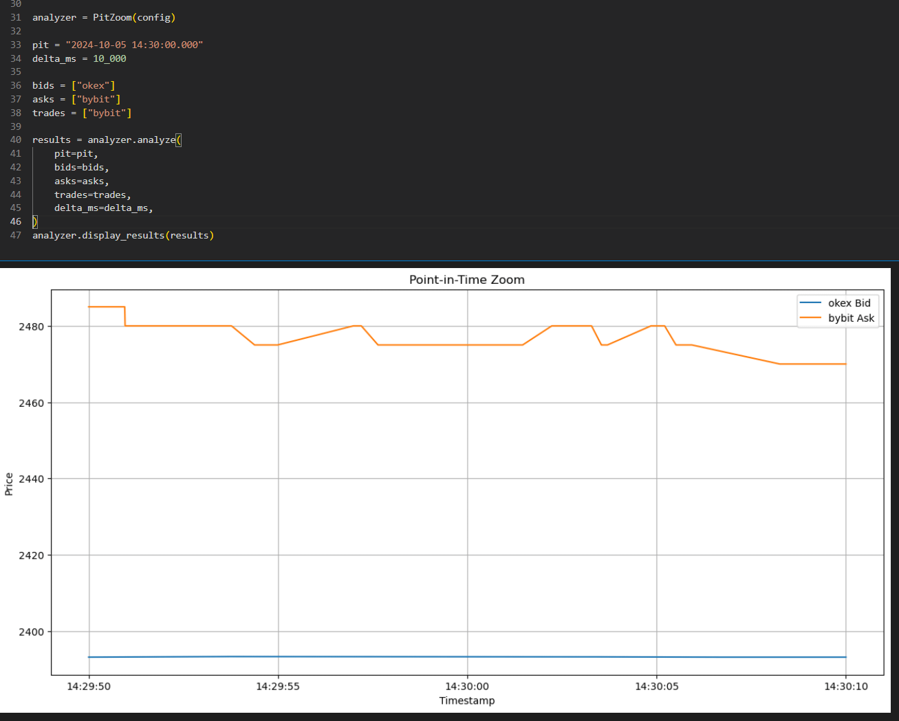

# Researching HFT Strategies

Source HTML: [`html/2025-07-01-researching-hft-strategies.html`](../html/2025-07-01-researching-hft-strategies.html)

# Researching HFT Strategies

| 항목 | 값 |
| --- | --- |
| 날짜 | 2025-07-01 |
| 접근 | 유료 |
| URL | https://www.algos.org/p/researching-hft-strategies |
| 부제 | How to work well with high frequency data |

---

### Introduction

---

This article is a mix of various thoughts I have about how to work well with HFT data and perform high quality quantitative research. HFT data is interesting to deal with because it’s cumbersome, slow, and often messy. You want to find out what happened but you need to dig through 20 different data types from your internal logs, and on top of that often the dataset is big enough to keep your server forever if you try to process any attempt at a multi-year backtest.

How should we approach things such that we end up somewhere productive?

Well, that’s roughly what I aim to talk about in this article. I can’t promise this will be a detailed tutorial on how to be an HFT researcher, you won’t get anywhere near that far from reading articles - in fact, you’ll need to get working with the data itself if you want to travel that far (and probably get a bit of mentorship along the way as we all tend to get), but I do think this article provides insights that can only be acquired through many years of working with the data (even if to truly become a pro you need to spend some time with the data), I would argue that a lot of this information would otherwise take ages of toiling around to figure out. Part of my professional experience has involved running research in HFT operations and as part of that I have gained insights into how to organize the research process in order for it to produce useful results. I do hope this article is useful for those in the industry who have to work with HFT data regularly. These are observations from my experience working in various HFT operations.

The Quant Stack is a reader-supported publication. To receive new posts and support my work, consider becoming a free or paid subscriber.

Subscribed

### Index

---

1. Introduction
2. Index
3. Big data projects usually are bad projects
4. Making logs useful
5. ***FAST*** Tooling
6. Prior Pre-Processing & Scraping
7. Analysis tooling

   1. Markouts, Markouts, and Markouts!
   2. PIT Zoom
   3. Post-Trade Analysis
8. Working in prod
9. Tightening Feedback Loops
10. Being close to the trade

### Big data projects are usually bad projects

---

As the title of this section suggests, it’s typically a bad idea to work with more data than you can handle or otherwise do things that are slow to process (even if you had optimized tooling, and probably even a mistake to spend tons of time optimizing your tooling just for this one project). Why? It takes forever. I’m not saying that big data projects don’t yield results, they often do, but the iteration speed is a tenth the usual speed and you almost never end up with a project where it is 10x as valuable in terms of it’s output compared to the next best opportunity outside of the big data list of TODOs.

Even when it comes to fitting your mid-price models, you can usually use a limited set of data. A year of data is often excessive, and a couple weeks is typically fine. In fact, you sometimes get a benefit from only using the most recent data, especially if you can determine the exact right point to start your lookback. Where is the right point to put your lookback? Where the regime changes. Regimes change often in the HFT world, the book will go from toxic to extremely easy money in a matter of a week. Sure, there are also much longer term trends, but personally I think it’s a total waste in time to work with large data periods for fitting if it’s a standard model, and if you are trying to do a more complex ML model which captures regime differences and changes over time then you are probably going down a nerd-hole and should think about behaving yourself and getting back to the feature mines.

It’s not a blanket rule, you do sometimes need to process lots of data, but ask yourself (at least a few times over) can I get 80% the way there for 20% of the effort and in almost every case you can. Think about reducing the dataset size, using dirty guesses that are right enough, lower frequency proxies for your questions, etc.

In the HFT world, things behave extremely mechanically, and you often only need a handful of plots from what happened in production to see some patterns. What you DO NOT need is a 1 year backtest of some complex ML analysis that will finish running in a week or will cost your firm it’s entire annual income in server bills. Come up with a quick guess for what is happening, put together a metric, and test on a couple weeks of data — if it’s strong you’ll see it in the stats.

### Making logs useful

---

First of all, let’s make sure that you are logging everything, and in a way that is useful. If the data does not meet this criteria then it is often useless:

- Easily accessible to researchers
- Is segregated by type of log and level of detail
- Isn’t too big
- Has the necessary tooling to use it
- Contains all the necessary details

Let’s talk about accessibility to researchers. This is fairly simple, you just need it to download automatically to a mount. People (or you if you are solo) shouldn’t need to SSH into a machine and rsync the logs over. I know that may sound unbelievable, but some people manually fetch logs. Take the time to set up the means to get the data easily.

Segregating your data is EXTREMELY important. I should not have to wade through 10ms frequency price updates to find the CANCEL\_ACK messages. Split them into reasonable categories, and make sure that if there is some piece of data within that category that is small + often needed, but the rest of the data is very large and unnecessary, then that often needed & small data should be in it’s own area. Again, I shouldn’t have to wade through a load of other messages to find the hourly update message or whatever example you can think of. There should be no case where you often wade through unnecessary data and have to take time to split the data simply because it has not been properly segregated. You may question this with “Well, surely it isn’t hard to just do df[df[‘msg\_type’] == msg\_type] and filter it out”, but often it’s not about the filtering itself, it’s also about having to load it in. Log messages usually aren’t short and also tend to need pre-processing before being useful. If I need to wait 10 minutes to access data that should take 15 seconds all because there is data I don’t want in-between then things are not set up correctly.

Isn’t too big… This is one that surprisingly can becomes a problem and completely ruin a data source. At a previous firm I worked at, we had a large DynamoDB database that reached 1 TB in size. It cost us an absolutely fortune monthly, but that aside it was practically unusable. DynamoDB searches the whole thing when you scan it, and that meant it needed to search through a whole TB of data. There was basically no point in having it (and frankly it was a pretty useful set of logs that would’ve greatly helped research). Anyways, eventually we decided it was useless and stuck it in a cold storage S3 bucket never to be seen again and reduced our bill pretty easily with just that alone. In all honesty, the dataset would’ve been fine if I only had a week, probably would have got a fair bit done even with a day of it, but instead it slowed research, so that goes to show that even if you can’t use all of it, you should probably set up a task to shove it in S3 after it is older than a week (or whatever the appropriate threshold is). We still got plenty done, and to be entirely honest there were far more important datasets we used + tooling with (arguably a fair bit more work) could produce the same information as said dataset, but it’s a cautionary tale as to not let your data grow so big that it eats it’s own usefulness whole.

Continuing on the point of making logs useful, logs are usually pretty hard to work with if you don’t have great parsing and pre-processing tooling available. You should be able to get useful statistics and data that is super easy to work with (well formatted) with the run of a single function. This is very important in my experience. Logs take a lot longer to use if you need to keep writing custom code in each notebook or scrolling through old notebook copies for the last log reading code. It makes it harder to react quickly and stay “close to the trade” meaning in the action of things (more on this later), and this is critical to successful trading.

### ***FAST*** Tooling

---

Working with HFT data is slow even if you use a limited dataset, let’s face it. Your tooling should be fast. I’m not sure this section will be very detailed because it’s a fairly simple point: if you use a piece of tooling really often then make it fast.

Waiting for your data to load for 10 minutes instead of 1 minute makes for a much bigger difference in overall productivity than you would imagine, and the difference between 10 minutes and half an hour is even bigger. It’s not just about the time it takes, it’s that you lose your state of being locked in when there’s nothing that can be done because data is loading. It’s a context switch that costs you a lot more than the cumulative total of time that the data loads for.

A few easy boosts:

1. Save as parquet files
2. Only load in the columns you need (this only works with parquet files, no effect for CSVs, but if you load in 10% of the columns, it’s 1/10th the speed).
3. If it’s a parquet file use engine=’fastparquet’ to make it 10% faster
4. If it’s a CSV file use engine=’pyarrow’ to make it 2000% faster
5. Use Polars, Polars is extremely fast, especially when reading parquet files with a reduced column set.
6. You can also use Rust or low level language tooling to load data in parallel. Assuming you have lots of RAM and CPU power you should be able to load in 20 files at once and they will scale linearly (ie 20x faster with 20 threads). This has worked that way for me at least, but only in Rust, Python isn’t much faster when you multi-thread it in my view because it’s not real multi-threading. This trick is very useful for data pre-processing as well.

These should all be very useful in terms of making your tooling faster. Data loading isn’t the only category, of course, and if you have pre-processing that often happens, or analysis that often takes a while and is common then it’s probably also worth optimizing that.

In fact, on the note of analysis, you should aim to make any function you use re-useable by putting it into a utils file instead of simply keeping it in the notebook. If you think there’s a good chance it will be re-used, make it so that it can actually be re-used. This will come back to be very helpful.

### Prior Pre-Processing & Scraping

---

It should go without saying that if your blocking task for the research you are doing is data scraping, and this is not some niche alternative dataset that you just got the subscription activated for, then you are doing it all wrong. Even if you are working independently then you should be making this investment.

Go over to Hetzner, get a server with some HDDs attached, make sure it’s a few TBs, or even just stick a large NVME in your laptop, whatever floats your boat (and budget), and then get downloading. You should have:

- Daily scrapers which scrape all tick data feeds (quotes, trades, derivative ticker, probably even book data)
- Pre-processors which aggregate that data (incremental to snapshots, trades to trade bars, quotes to quote bars, options related data, etc)
- Universe scripts which update a rolling universe file based on some logic (usually use rolling average volume, market cap data is a bit harder to get and volume works fine if you use a reasonable lookback, especially if you take the log of each day individually then take the mean of that)

It’s not incredibly hard to set up, and prevents you from waiting hours because you don’t have the data for this task. Data scraping and pre-processing scripts won’t take more than a day or two and will save you an immense amount of time.

Even for MFT this should be standard practice, but when it’s HFT and downloading raw trade data for everything can take a full day then it’s disastrous if you end up getting blocked by it, and for no real reason other than that you didn’t bother to set this up.

### Analysis Tooling

---

In my view, there are 3 pieces of analysis tooling you will spend a lot of time using for HFT strategies R&D, or at least they’re my favourite 3, I’m not sure if everyone else will have the same exact 3, but I’m sure these will still be familiar components of their toolboxes.

#### Markouts:

Starting with the market makers favourite metric… the markout plot!

A markout is the change in price before and after a trade happens plotting as a continuous line. It’s fairly useful for seeing the timeframe that your adversity occurs on as well as the rate at which this happens (ie in the first 100ms how much do I lose). You can also gleam a lot of information from the price moves before and after a fill. If you align the timestamps properly and include information based on the implied state of the orderbook then you will often see the price move on Binance before your markouts on smaller exchanges, this is clearly just a lead-lag happening and you getting caught on the wrong side of it. It’s also fairly useful for mid-frequency trading as it shows you the optimal time to execute over in order to properly balance execution quality with capturing as much of the potentially available PnL as possible.

PnL can still be worse with better markouts but that’s only going to be because you are trading less. Still worth checking volumes.

For our plots we’ll be stealing them from DataBento’s article [[link](https://databento.com/docs/examples/algo-trading/execution-slippage/example)] where they generate some markout plots of their own:

It’s not awfully hard to actually generate these (you just do some time shifting around for the quotes at the time of the trade), and they are fairly useful. I always ensure that all trades come tagged with the markouts before and after. It’s a great way to see what is happening in your trades.

#### PIT Zoom:

PIT (Point In Time) zoom tooling lets us zoom in on the state of the market for a range of time. Usually you add options to see the below data sources as part of that:

1. Bid/Ask Prices
2. Implied Bid/Ask Prices (best bid/ask inferred from trade prices)
3. Trades
4. Cancels (can be inferred from incremental\_book\_L2 data)
5. Inserts (can be inferred from incremental\_book\_L2 data)
6. Our forecast of price
7. Our fills
8. Our quotes

Simply being able to see what happened around a fill is one of the best ways to infer what occurred, and having to load in all the different datasets, index into their timestamps, and then write code to plot them is repetitive and slow. It’s much easier to specify the window, what data (and from where) you want in your plot, and run it. So having a pit\_zoom function in your tooling is extremely helpful.

This is very useful on the arbitrage side because you can often identify signs as to whether an arbitrage will cause an incomplete arbitrage (arbitrage trades where only some of the legs get the limit IOC price and the others fail - these are really expensive and cost you maybe >10x the expected profit if they hadn’t failed usually, hence we look to identify where they happen). For example, one issue I had often was that two market participants would one-up each other until it eventually got to a point where one would pull their quotes and then so would the other. Typically this point was where the arbitrage was because the quotes were so attractive to take against that they decided to pull out of the fight. Anyways, this cycle would continue and they would pull orders into the arbitrage price zone and then quickly pull them out after one would pull leading to the other also pulling back to the next best quote to one up (which happened to be the other guy). This would cause a flurry of arbitrages to trigger in the system, but by the time the trades actually arrived the orders would be gone. This then led to use flagging certain behaviour patterns and avoiding arbitrages where this behaviour had occurred prior. It was only possible because we were plotting the quotes before and after our arbitrage trades were sent.

This is a much simpler example (I don’t actually have any exciting events I can share with everyone because I like to keep these things private), but I hope the general idea behind it is fairly obvious.

#### Post Trade Analysis

---

Especially for arbitrage strategies, one of the most useful datasets is the PnL by trade as well as all of the characteristics of those trades. One of the best ways to improve the performance of an arbitrage strategy is purely to just group trades by certain characteristics or run regressions on metrics and see how it affects PnL.

Does one exchange have a very high rate of incomplete trades? Perhaps you realize that suddenly there was a massive spike on a certain symbol having loads of incompletes for a period of time causing the strategy to blow through tons of PnL, and because of this you decide to implement some logic that if the rate of incompletes gets too high on a single symbol you stop trading it for X hours. This is how you refine strategy logic and improve your trading.

This example is just PnL tagging where you tag real orders you put into the market with how much PnL they generated, but it has extensions on the market making side. At the simpler level, you can try to figure out how much of the PnL was gained from each fill with some utility for inventory being taken off + markouts on the fill combined together, but for an even more useful tool you will need a simulator. I discuss in some of the next sections about how to do this, but any mature market making operation will have a simulator.

For arbitrage, it will depend. In my experience, I have found that simply the orders that were traded live works great for post-trade analysis, and haven’t had enough of a reason to actually build an advanced simulator. I’ve built plenty of simple backtests just to check there were arbitrages, but nothing comprehensive. To be entirely honest, as long as you are really really conservative with cost and latency assumptions (and ensure they match production), then a simple backtest should be accurate for taker arbitrage. When you get into making into the arbitrages you start to need to refine your setup. It can be very accurate still to assume trade impacts as maker fills like we do in the articles I have on triangular arbitrage, but I would argue things are basically market making once most of your legs hit maker. On that point of trade impacts to maker fills, you should check that this matches production - it often does, but sometimes you get caught offside with those sorts of assumptions (specifically on whether you can exit in time / that the liquidity will still be there).

### Working in prod

---

If you are doing any sort of large scale HFT, or even certain types of small scale HFT (usually market making) then you will probably encounter some scenario where you cannot feasibly test this outside of production.

There’s typically two reasons:

- scale of computation
- the joys of simulating limit orders

Computation is fairly simple, and mostly applies to large scale arbitrage strategies where you are calculating arbitrages across many exchanges at once and hence will struggle to compute it in a backtest. That or it’s something like triangular arbitrage where you may only have one exchange but still need to search a lot of paths. Either way, both of these stem from needing to search a large number of paths and not being able to feasibly do it in backtest (hard enough to do live!). You end up with a situation that in order to test any sort of logic improvements you need to test it in production, so having good infrastructure to test these sorts of things in production is crucial.

Similarly, on the market making angle (or really anything dealing with limit orders) we will struggle to deal with the accurate simulation of our fills and the adversity of our counterparties without considerable work being put into a simulator. You can obviously just go ahead and build a simulator, which mind you is not easy, and even then certain things will still need to be tested in production because your simulator may not take into account the behaviour. Say for example you make a simulator out of various agents with lookahead enabled and they take against your positions as well as other market maker agents quoting in competition with you: if you decide to simulate diming logic your simulator obviously will have no logic to accurately simulate how others will react to it (you’re not going to have implemented this into your simulator if you haven’t even put it in your own logic!). Even then, to fit the simulator you need to test it live to validate your assumptions and refine your model of the market. All that is to say that it is unavoidable that you will need to test in production at some point.

There is also the question of whether to have your testing system be the exact same as your actual system. You probably want to have that be the case for anything the developers are testing, but in previous roles I’ve always had a fairly mutilated and sometimes dumbed down version I would toy around with as a researcher when I wanted to scan for arbitrages and couldn’t do it via a backtest (or when it was just easier to test it live). People assume you can seamlessly hand things off to developers but in reality the response is “okay I need to fix this I’ll get on it later today” best case or more commonly “I’ll get to it tomorrow” or worst case “later…”. You can’t expect the same level of feedback loop tightness when other people with other priorities in their day to day task list have to be relied upon in order for you to do your own work. Making it so that any given person has to rely on another person as little as possible is key to desk efficiency, and that includes researchers testing things.

### Tightening Feedback Loops

---

Whilst I’m on the topic of feedback loops and tightening them. There’s other angles beyond testing new features in production. You often also want to try new parameters or symbols or anything that can be modified via a YAML file. I find being able to toy around with these things, even if they don’t cover all the possibilities of the potential modifications to production a researcher may want to make are useful to have available via a system where certain parameters can be modified by them through a JSON or YAML file.

In fact, the whole feedback loop discussion is why I think the most efficient and fastest moving HFT pods have developers doing research or minimally segregated roles between traders, devs, and QR. Not necessarily the most profitable because it makes it harder to specialise and scale (at a certain scale you lose efficiency anyways), but it’s clear if you’ve worked with these teams that their speed is practically unparalleled. Things get theorised and then implemented into production within the same evening. I’d argue the most productive I’ve ever been with implementing things non stop was when I was working on my own trading algorithms as a developer as well as a researcher. But there’s another reason solo developers are so productive or developers in general when it comes to finding logic improvements and that’s because they’re close to the trade.

### Being close to the trade

---

We used to have a saying at one of the firms that I worked at that being “close to the trade” is everything. That means you are monitoring everything, you are really seeing things happen live. A lot of researchers think that they sit in their little research bubble and get to do analysis which happens completely out of sync with what’s happening on the day to day. “I don’t need to monitor the trading algorithm, I’m here to analyze the aggregate statistics” a junior might say. The reality is that you learn TONS about the dynamics of the strategy, where money is made, and where it’s lost by watching it live. Frankly, this isn’t exclusive to HFT either (although it’s a lot stronger in HFT because of how clear and mechanical the effects are).

In fact, when you hire traders, one of their main value points is to give feedback to the researchers because some people just have a knack for spotting things happening live, and often then the traders get to make modifications on the fly by adjusting parameters and doing research of their own even. If you want to be a successful researcher, you need to be close to what is happening with your trades. You can get away with just sticking things in production and not monitoring the day to day (short of the alerts that tell you if you’re getting yelled at when the end of day PnL reports come out) a little more when it’s MFT, and that’s mostly down to the fact that we need to take a more statistical approach in general (there’s no mechanical feedback). However, for HFT, the feedback is rapid and extremely mechanical. You can take a small number of live data points and infer a lot about what’s happening. I talk about this shift in paradigm in quite a bit of detail in this article, you’re welcome to give it a read:

[Timeframes & Research Types[Quant Arb](<https://substack.com/profile/101799233-quant-arb>)·May 15, 2024[Read full story](<https://www.algos.org/p/timeframes-and-research-types>)](https://www.algos.org/p/timeframes-and-research-types)
