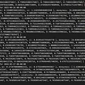
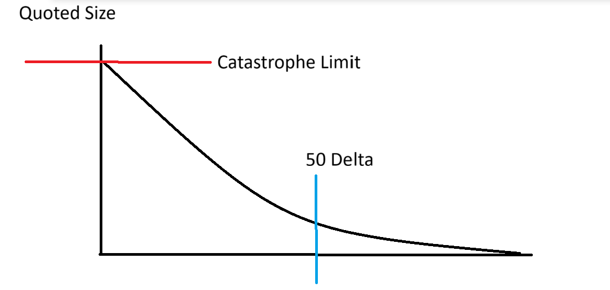
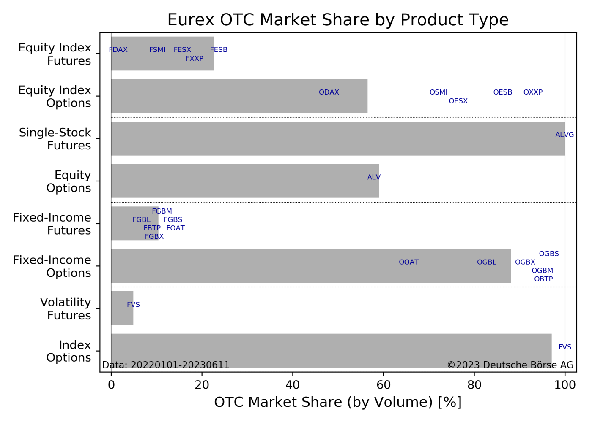

# Advanced Options Market Making

Source HTML: [`html/2025-11-18-advanced-options-market-making.html`](../html/2025-11-18-advanced-options-market-making.html)

# Advanced Options Market Making

| 항목 | 값 |
| --- | --- |
| 날짜 | 2025-11-18 |
| 접근 | 유료 |
| URL | https://www.algos.org/p/advanced-options-market-making |
| 부제 | How to run a mature options market making strategy |

---

### Introduction

---

So far we have covered how to get fair value when doing options market making, but we are yet to cover the complex parts relating to quote sizing, skewing, spreads, quoting OTC, quoting illiquids, quoting multiple exchanges, and the risks that we skew to avoid outside of the usual greeks (which are well known).

So today, in the 4th article in our options market making series, we will focus on completing the pipeline.

### Index

---

1. Introduction
2. Index
3. Recapping the basic model
4. Spreads & Skewing
5. How to determine quote sizes
6. The relationship between size and spread
7. Risk dimensions
8. Why OTC/RFQ?
9. Quoting in illiquid markets
10. Global quoting

### Recapping the basic model

---

Let’s go back to our basic model of how we end up with our quotes. It’s practically the exact same as in futures with some small tweaks. We start with our market price. In futures, this is usually just the mid-price, but for us we are actually fitting a volatility curve to the market. We’ve talked about this already in the first article of our series below:

[![Professional Options Market Making & Taking [CODE INCLUDED]](images/591a572a3b75.png)Professional Options Market Making & Taking [CODE INCLUDED][Quant Arb](<https://substack.com/profile/101799233-quant-arb>)·January 27, 2025[Read full story](<https://www.algos.org/p/professional-options-market-making>)](https://www.algos.org/p/professional-options-market-making)

From here we can make modifications to this market price which reflect our edge. Normally, in futures we would just add on our forecast (often multiplied by some scaling factor to prevent overly aggressive shifts to our fair value). Unlike with futures, we have many different prices so cannot fit a forecast to each price (this wouldn’t be very stable anyways since moneyness / tenor will change. So instead, we forecast the parameters to our volatility curve which we describe as a basic example in the 2nd article of our series:

[![Options MM Part 2 - Options Trade Impact Modelling [CODE INSIDE]](images/6aa50f9d9768.jpg)Options MM Part 2 - Options Trade Impact Modelling [CODE INSIDE][Quant Arb](<https://substack.com/profile/101799233-quant-arb>)·March 2, 2025[Read full story](<https://www.algos.org/p/options-mm-part-2-options-trade-impact>)](https://www.algos.org/p/options-mm-part-2-options-trade-impact)

One of those inputs is the ATM forward (underlying price) which we showed how to do in the first article. Now, having implemented this logic in the 3rd article:

[Live Options Market Making Quoter (OMM Pt.3)[Quant Arb](<https://substack.com/profile/101799233-quant-arb>)·May 22, 2025[Read full story](<https://www.algos.org/p/live-options-market-making-quoter>)](https://www.algos.org/p/live-options-market-making-quoter)

We are then moving onto completing the system with how to determine spreads, manage risk, skew prices, size quotes, and deal with the nicher details.

Assuming we have now got our curve which we have modified to reflect our expectations of where the curve will be in the future (i.e. including our forecasts), we can skew it around based on our risks. Then, we add on a spread. Finally, we determine the quote size, and that’s how we get our price.

Quoted Price=Fair Value+Skew+Spread

### **Spread and Skew**

---

There are more complicated ways to determine spreads and skews using matrices but it would deserve its own article so we will explain a basic yet very effective and functional method. That method is simply to have a spread and skew contribution for all risks and you tune those parameters with the market. The simplest being delta/vega exposure + all the usual Greeks and more complex exposures I describe later on in the risk dimensions section. You may decide to use a linear or exponential function for this but generally your spread increases as a function of the options risk and then perhaps we may add some other spread wideners for when the market goes crazy (ie microstructural volatility, and this widens everything).

### Determining Quote Size:

---

There are two ways to do this. They are somewhat different and differ in complexity. The latter method is preferable in my opinion but I will introduce both concepts for knowledge sake as the first is much simpler, and could potentially be combined with the second if one so wished.

Starting with the first approach:

We take a range of ticks that price trades in normally (what is relevant to the spreads we are quoting) and take the EWMA of the size that many ticks wide. We then have some scalar that we use to quote a multiple of this amount.

For the second approach, which I believe is the best practice, we want to quote a constant edge. That’s how our model works. We take our edge per contract (say this is $2 per contract for a 50 delta option, and our baseline size is 500 contracts. That’s how many contracts of the 50 delta we would like to quote normally). From here, we quote the necessary number of contracts on every option to earn $1,000 of edge per option. If we push our quotes wider on one option because we have inventory then we will also reduce our size (which is intuitively correct) because we earn more edge. In the same respect, we will increase size on the tighter side quote after gaining inventory. We have a delta limit, where we won’t quote past a certain delta, that prevents us from going off into the right tail of the diagram too far, and we have a contract limit overall because the left side of the diagram would go to infinity otherwise. Again, we think of everything in contract terms. Not notional.

### The relationship between size and spread

---

Typically we scale our spreads when quoting large size as a function of:

sigma∗sqrt(expected holding time)

Where sigma represent the risk of the position and expected holding time roughly translates to our size. This is actually the core formula from Avellaneda and Stoikov, and generally reigns quite accurate as a quoting rule especially in OTC products.

This is even seen in Black Scholes Merton where we use it to go from d1 to d2 or rather the variance time adjustment. It’s a very common formula seen all across quant finance. It’s also how we derive the square root law of impacts, since if MMs increase their spread as the square root of size then we increase our impact with square root of size.

This is not always the case of course, and in the world of impacts we often see linear or even exponential impacts when execution is done in highly illiquid names and done so poorly. As a general rule, you must be doing a TWAP/VWAP in a highly liquid name for the square root law to apply. When you switch to market impacts or illiquid names it gets much worse.

This rule is not just for RFQ quoting but also explains how you scale your quotes when quoting multi level books. We have our first quote at X ticks wide and then our second quote at sqrt((x^2) \* 2) assuming the second order is the same size of our first order.

Anyways, when you quote size OTC/ multiple levels in the same book, keep this in mind. It’s a very useful concept.

### What are the dimensions in which we have risk?

---

We obviously already know about delta and vega (we’d use cash vega amount here), but there are many more than that. There’s also more Greeks than just these two. I will not cover Greeks because there’s a million articles on the internet that will explain every one of those to you, but here are the special limits you’ll have outside of that space:

1. Skewness
2. Kurtosis
3. Roll limit (exposure on each expiry)
4. Local Moneyness Limit (limit on exposure that is local to a region of the moneyness curve. Even if exposures in that region offset each other) (Covers slide risk - If forward moves by a large amount and ends up at that point and now a small exposure is a large exposure you don’t end up with a difficult to manage position) (This also takes care of sticky deltas because as you approach expiry, and as sticky deltas actually begin to matter, the moneyness will shift in such a way that you become adverse to sticky delta risk)
5. Position Concentration (max amount on a single strike) (Good for short option margin requirements and basis risks)
6. Premium Limit (Interest rate exposure).

Each limit contributes to certain parts of our quotes (spread and skew).

### Why do we quote OTC/RFQ?

---

We’ve established that our cost is basically a function of size and risk. Now say I want to buy a tight vertical. Individually, those options carry a lot of risk naked to quote, but when netted they form a structure with MUCH LESS risk than the gross options exposure. If we directly went into the open market and purchased this structure we would pay the spread in accordance with the gross risk of the structure. However, if we say “hey I want this structure which actually doesn’t carry much risk in terms of Greeks” to the OTC market they will come back and quote us a spread which is in accordance with the significantly reduced amount of risk of the structure compared to the raw options. That is to say that we pay the spread commensurate with the net exposure and not the gross exposure. Obviously an extremely large notional with very little net will still be expensive because there is margin requirements etc which makes MMing highly netted positions still use up a decent chunk of margin so there’s still a small charge for notional (and you also pay a little extra since RFQ market typically is less price efficient than the lit markets), but generally when you are trading structures which net well you always want to trade OTC.

The other reason for OTC is the same as in any other market, and that is execution gaps. If I have horrific execution but the firm I sell it to has amazing execution then they can charge me less than if I tried to execute it myself and still make a great profit. There’s an execution arb via OTC and especially if you don’t shop around in a lit market like an RFQ platform they can quietly dispose of this position without it being shown on the tape/ or even any hint existing that it traded and hence avoiding moving the market (meaning even better execution for the OTC firm which then trickles down to you via better spreads!).

### Quoting in Illiquid Markets

---

Typically when quoting in illiquid markets you will see a lot of the volume happen OTC. For many TradFi instruments, the purpose of listing is to provide infrastructure such as clearing which is useful for those who need to trade OTC to have available to them. Especially, when you see illiquid options you’ll find that most of the volume will happen in the OTC market. This is especially true for cryptocurrency markets where outside of BTC & ETH basically every other option trades OTC. A few exchanges offer lit markets for XRP, DOGE, BNB, SOL, and other top 20 coins (namely Binance and PowerTrade) but the venues offering these products aren’t particularly liquid.

So, when trades are sparse, and hedging directly in the instrument is expensive what do we do?

There are roughly two options:

- Dispersion
- Correlation

In equities, it’s very common for firms to make markets on illiquid option names and then hedge in a liquid index option product where trading is far more frequent and being aggressive to reduce large inventory exposures is not that expensive (comparatively). This is dispersion. Many prop desks trade dispersion directly as a bet on average market correlations as well, but it’s one of the main ways options market makers can balance their exposure where an index exists. In equities this is usually the case but crypto for example does not have this luxury.

In crypto markets, we’re forced to use correlation hedging where we hedge in correlated instruments.

Generally, you should not treat correlations or dispersion hedges as gospel and understand that they come with an inherent toxicity risk. Say I have a long short BTC/ETH straddle strategy where I am trading the relative value of volatility in BTC and ETH. I have an edge in determining the correlation, so hence if a market maker quotes against me with the idea of correlation in mind he will find himself getting picked off on the correlation. You still need to have tight risk limits on what you allow to be hedged via correlation because otherwise you can accumulate massively toxic inventory which then burns you. I’ve assumed this before and it cost my futures market making a fair bit of edge until we realized it and decided that BTC and ETH perps shouldn’t offset. In this case completely banning it was fine because they are both super liquid but for options it’s more of a decision you can be open to especially if it is in altcoins instead of BTC and ETH.

In cryptocurrency markets, when I’ve had to price an OTC altcoin I usually quote based on realized volatility forecast multiplied with a mix of the BTC/ETH vol curve, using the realized volatility forecast as a scalar for it. It’s not the best model, but in the cases where I’ve been asked to quote it my spread was really high so it was more than good enough to earn a considerable profit.

### Global Quoting

---

Global quoting is quoting across many exchanges. This presents an issue where our margins do not cancel out. Hence you must maintain specific risk limits between exchanges to prevent one leg blowing up in a large crash (net flat, but +10m on one exchange -10m on the other exchange, get liquidated on the -10m PnL exchange before you can transfer the 10m over and end up losing lots of money).

How do we do it? Well we maintain limits for individual exchanges and for our net which are separate. In terms of our spread (which is based on risk) we apply a liquidity premium (LP) for less liquid venues. We start with our most liquid venue, in crypto options this is Deribit, and we score this as 1 for the LP which is what we multiply our spreads by. For the other exchanges we then have a number greater than or equal to 1 (since they are all less than or equal to our main exchange in terms of liquidity). So to get our spreads and skews we calculate our risks at the exchange level, and get our exchange level spreads/skews, then at the global level, and net the spread and skew adjustments. Then finally, we apply the liquidity premium.
