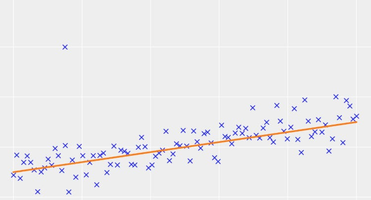
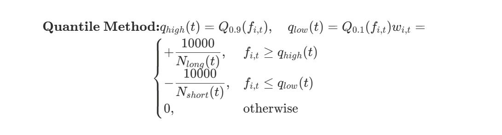
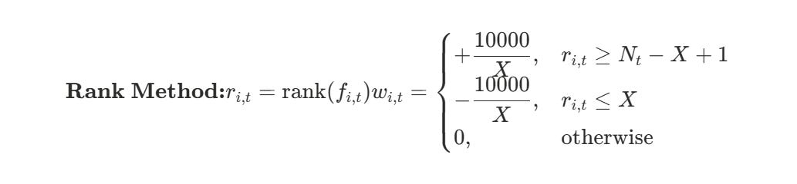
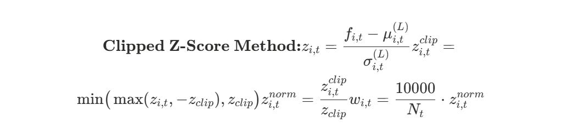
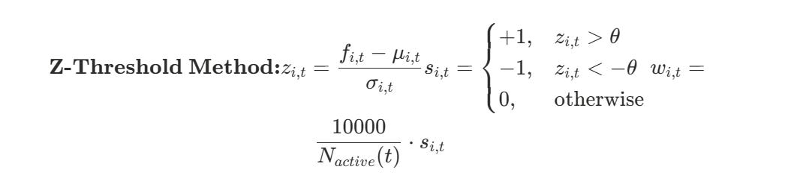
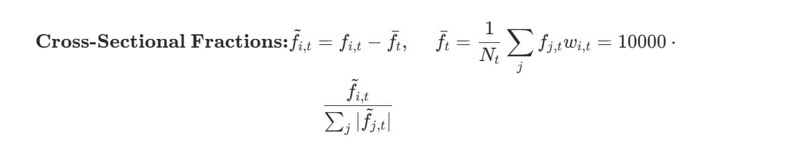

# Forecasting Done Right

Source HTML: [`html/2025-12-15-forecasting-done-right.html`](../html/2025-12-15-forecasting-done-right.html)

# Forecasting Done Right

| 항목 | 값 |
| --- | --- |
| 날짜 | 2025-12-15 |
| 접근 | 유료 |
| URL | https://www.algos.org/p/forecasting-done-right |
| 부제 | Various thoughts on forecasting |

---

[](images/ee73a37ff20c.png)

### Introduction

---

There is no doubt that regardless of whatever area of quant you end up in, you will end up having to do some degree of forecasting. Whether that is forecasting returns (for stat arb strategies), funding rates (for funding arb strategies), volumes (for execution strategies), or even parameters is a vol curve, it is a problem that comes up time and time again in the work of quants. Today, me and [Systematic Long Short](https://open.substack.com/users/425089357-systematic-long-short?utm_source=mentions) are going to be walking through our thoughts on how to do forecasting properly with some practical tips. We focus primarily on return forecasting in a statistical arbitrage manager context.

[This article is available to readers of either of our publications in it’s entirety so feel free to subscribe to either!]

### Index

---

**[Quant Arb]**

1. Introduction
2. Index
3. What are we forecasting
4. Implicit Forecasts (and why they work!)
5. Models
6. Features come first
7. What doesn’t work

   1. Dropping features at the model level
   2. Dimensionality reductions
   3. Lots of bad features
8. Forecasting isn’t the best edge…

**[Systematic Long Short] - On Combining Forecasts**

1. The Limits Of Diversification
2. Optimal Forecast Weighting
3. When Forecast Combining Breaks Down
4. A Few Simple Heuristics…

---

## [QUANT ARB] Modelling and Construction

### What are we forecasting

---

This is the first question to ask and isn’t immediately obvious to most people. The process here usually focuses on how we should be doing our forecast horizons / what makes sense, but not on how we define returns. To get horizons we need to follow our markouts. In an HFT context, it’s the markout of our fills and hence how far out we need to forecast mid-price, but even then we will often layer multiple horizons to take into account longer term alphas which add a little bit of edge by skewing into them slightly. In an MFT context, it’s the markouts of our alphas. Often we go into a problem aiming to forecast a certain horizon or set of horizons (largely influenced by our execution capabilities and capacity requirements. If we don’t require large capacity and have great execution we will tend to go shorter term since it’s easier to generate higher Sharpes, but if we want to trade large size we will need to go longer term).

Once we’ve established the horizon of our returns we can now think about what returns mean. Do we want raw returns (which may be appropriate in a 100/-100% long/short strategy) or do we want idiosyncratic returns (which makes more sense for a market neutral strategy) or do we want to use VWAP instead of close to close returns since we expect to be executing size using VWAP algorithms. All of these come into play when determining what we should be forecasting.

Additionally, we do not even need to be forecasting returns directly and in some cases may prefer to forecast ranks or other categorical labels. One way to do this is to say that if an asset is in the top 10% we label it 1, if it’s in the bottom 10% we label it -1, and otherwise 0. This way we have a categorical model which we can directly translate into positions in a cross sectional model. This isn’t very efficient, however, because it isn’t very compatible with the standard portfolio optimization process and requires ad-hoc portfolio construction. The one benefit though is that you can use information from other assets to try and assess their relative ranks. It also allows you to focus on extremes and not means. This isn’t the approach I would personally take but I have seen it used by others before.

### Implicit Forecasts

---

Implicit forecasts come from methods of ad-hoc portfolio construction. These are ways we can turn any feature directly into a portfolio. They all have different forecasting assumptions inbuilt into them.

However, it gets a lot more interesting for formulaic alphas. Here are the general ad-hoc methods:

- Quantile Method
- Rank Method
- Clipped Z-Scores
- Z-Threshold
- Cross Sectional Fractions

Starting with the Quantile method, we are basically taking the upper 10% percentile and the lower 90% percentile threshold and any assets where the value is above the top 10% we long, and any assets below the 90% percentile threshold we short. It’s a way of doing cross sectional trading whilst prioritizing extreme values. It’s mostly relevant if you want to add fees to your backtest because it’s less turnover heavy than the other cross sectional method which is cross sectional fractions.

[](images/71b495783466.png)

The rank method is a worse version of the quantile method where we rank the assets based on the feature and take the top N assets and long them, then short the bottom N assets. The only real reason you’d prefer the rank method is because it’s a few less lines to type up than the quantile method, but this is more a reflection on your lack of tooling because you should have one function called backtest which takes in the feature and the method and various other inputs and spits out a backtest. Regardless, it’s a method we can use:

[](images/8ac1f040985b.png)

Now, the clipped z-score method is a very effective method. It is not a method which focuses on the extremes and is well suited for strategies where we do not want a market neutrality constraint as positions do not net to 0 under this construction method. We first take a rolling z-score of the feature, then we clip it so that we don’t have extreme values. So say we clip it at 3 we now range from -3 to 3. We then scale it back down to -1 ↔ 1 as our range by dividing by the clipping threshold. Then we set our positions equal to this but scaled down based on the number of assets in our portfolio. It’s basically just converting rolling z-score directly into a portfolio position:

[](images/2fc4da77d5c4.png)

The Z-Threshold method is a way to turn any metric into a logical alpha (buy / sell binary). Often logical signals are combined so that they must all trigger at once or some combination must trigger so it’s a very nice way to get an idea of how extreme a threshold is without having to do some testing. I think if you’re using this you either think extreme values have all the edge (like the quantile method) or you are already working with a logical alpha and want to add a metric in:

[](images/067ff1461698.png)

Cross sectional fractions is simply de-meaning all of the features (using the cross sectional mean) and then dividing by their share of the sum of the absolute values of all the demeaned features. It’s a very effective way to test alphas for cross sectional trading:

[](images/d164f208ce4a.png)

These are ad-hoc methods, and the most proper way to do things would be to convert the alpha to a forecast and then use the optimizer to generate a portfolio based on this forecast. This is a lot of work, and these often provide a simple way to get things into production which directly reflect our preferences for market neutrality and extremes vs mean values.

### Models

---

There is a lot of discussion about model choice. Typically I find for out of the box problems XGBOOST and ridge regression come in first place (depending on how much data you have available). If you want something in between, you can fit a non-parametric regression between each feature and forward returns, ideally clipping the tails so we don’t extrapolate where it is unstable, and then take these forecasts into a ridge regression. This can highlight some simple non-linearities in each feature.

In addition to this, you can add custom enhancements such as:

- Huber Loss
- Maximum coefficient for each feature to prevent overconcentration
- Requirement that all features have positive coefficients (if I decide this alpha is a positive sign then it should stay that way)
- Weighting recent data points slightly more (highlights alpha decay)

These are all things that can be played around with, but generally if you have enough data like with HFT XGBOOST will beat Ridge, and if you don’t have enough data ridge regression should be optimal.

If you are dead set on an ensemble, I find that the best way to do it is to weight based on the IC of each feature. This has two nice properties:

1. It works well, but not as good as XGBOOST or ridge.
2. No need to impute NaN values as you can calculate the coefficients on the fly when one of the forecasts is missing in a very computationally cheap manner.

Generally I find that manually engineering features is beaten by sticking it into ridge when testing out of sample. You shouldn’t stick junk in your model of course, but try to be conservative if you think something is on the line since ridge is usually smart to deal with it (I have spent much time making features orthogonal only for ridge to do a better job!).

### Features come first

---

Most of the edge in a trading strategy comes from knowledge and description of the effects you’ve found in the data. These tend to be fairly linear in relationship to forward returns so there is not an incredibly large amount of room for models to find edge without overfitting. Hence, when we do look for non-linear effects we do it in a very constrained manner (like with the non-parametric regression example we gave earlier). This means that when we dig into our pipeline and try to understand where the edge concentrates we find that it all comes down to the features. We’ve already seen that with implicit forecasts we can directly skip the forecasting and portfolio optimization stages (even if it is dirty and sub-optimal) and still potentially generate PnL.

So when it comes down to how you think about forecasting, a lot of it should centre on the features and how we are translating them into forward returns. If we believe there is some non-linear interaction between features we should do that at the feature level potentially with interaction terms or other direct ways of expressing this instead of leaving it up to the model.

### What doesn’t work

---

Giving a quick brief on what I’ve found to not work so well:

- Dropping features at the model level
- Dimensionality reductions
- Lots of bad features

Dropping features at the model level, i.e. using LASSO instead of Ridge I find to be sub-optimal and generally decreases performance. In fact, dropping features at any point tends to require a fairly strong belief that the alpha is truly dead.

Using PCA to reduce dimensionality tends to hurt performance and really it should only be used to understand how orthogonal your features are.

This one should be fairly obvious, but taking tons of features with no edge in a standalone context such as “raw ATR” where it is simply a market metric and has not yet been formed into an alpha and then putting it through a complex ML pipeline with the hope that the model will use it to encode features within the model does not work. You need to encode the patterns yourself in the alphas and not just try to provide “useful metrics” which some fancy model should magically turn into alpha.

### Forecasting isn’t the best edge

---

A lot of people come into quant, especially after seeing all the exciting developments in machine learning and neural networks, and expect to be able to extract a lot of edge purely from their forecasts. It is not wise to do this. Forecasting as an edge itself is a pretty poor edge because it’s really incremental. The only reason you see people who have forecasting as their entire job is because it’s for a firm that is big enough to warrant such an expense. Your Jane Streets of the world make a lot of money and a couple extra % on that means a lot to them so they’ll hire whole teams to work on just this. Your book is not JS (most likely) and instead you really be thinking about forecasting as a step in your pipeline.

It’s not that hard to do forecasting at a reasonable level and get solid results. Testing a handful of models out of the box with existing libraries should get you to a pretty great start, and from here the gains will be fairly incremental. Your time will most likely be best spent trying to find new and improved features and not dedicating huge parts of your time to forecasting. Not that we should neglect it, but I feel it is worth clearing this up as many neural network lovers feel that forecasting is a place to derive “an edge” where you rely solely on this to beat the competition and that simply is not going to work out.

That is all to say that whilst forecasting is very important to our process, it is not a place to find “your edge” because it fundamentally is a multiplier on what you already have. If your features are very poor then you will only see a small boost in absolute terms because we are multiplying a small number.

---

# [SysLS] On Combining Forecasts

### The Limits Of Diversification

---

You may brag about running thousands, if not millions of forecasts. It sounds impressive. More signals, more diversification, better risk-adjusted returns. Except there’s a formula that says otherwise - and it puts a hard ceiling on how much diversification you can actually buy.

The ceiling depends on one number: the average correlation between your forecasts. And most people dramatically underestimate what it means for their portfolio.

### The Problem

---

Say you run 50 forecasts. Each pair has an average correlation of 20%. That sounds pretty uncorrelated. You might think you have 50 independent bets generating 50 independent streams of alpha.

You don’t. You have maybe 5.

The intuition is straightforward: if forecasts move together 20% of the time, you’re not really getting 50 different views on the market. You’re getting **variations on a handful of underlying themes**. The math just makes this precise.

Most portfolio construction focuses on the wrong question. Instead of asking “how do I optimally weight these 50 forecasts?”, you should be asking “how many of these 50 forecasts are actually giving me new information?”

### The Ceiling

---

Here’s the formula. If you have N forecasts with average pairwise correlation ρ, the variance of your equal-weight portfolio is:

```
Var(portfolio) = (1 + ρ(N-1)) / N
```

As N gets large, this converges to ρ. Not zero. No matter how many forecasts you add, you cannot push portfolio variance below the correlation floor.

What does this mean for Sharpe ratio? If μ is your average return per unit of volatility across forecasts:

```
Max Sharpe ≈ μ / √ρ
```

With 10% average correlation, you can improve Sharpe by at most a factor of √10 ≈ 3.2 through diversification. With 25% correlation, the factor drops to 2.

The practical rule: you get meaningful diversification from roughly 1/ρ forecasts. After that, you’re just averaging more correlated bets. With ρ = 0.10, that’s about 10 forecasts. With ρ = 0.25, it’s about 4.

### Where optimal weighting goes wrong

---

The textbook answer to combining forecasts is mean-variance optimization. Estimate expected returns and covariances, invert the covariance matrix, compute optimal weights. It’s elegant. It’s theoretically justified.

It also fails spectacularly.

Here’s what happens in practice: you estimate a 50×50 covariance matrix from noisy data. Every estimation error gets amplified when you invert the matrix. The “optimal” weights become garbage - large positive weights on some forecasts, large negative weights on others, all driven by noise rather than signal.

### Developing An Intuition

---

For two forecasts, there’s a beautiful geometric interpretation that builds intuition.

If your forecasts have Sharpe ratios S₁ and S₂, and correlation ρ, the combined Sharpe is:

```
S_combined = √[(S₁² - 2ρS₁S₂ + S₂²) / (1-ρ²)]
```

Two implications:

First, the combined Sharpe is always at least as good as the better component. When controlling for risk, diversification can only help.

**Second, and less obvious: if correlation is high enough, the optimal weight on the weaker strategy goes negative. Even if that strategy is profitable standalone.**

The threshold is ρ > S₂/S₁. If your second strategy has Sharpe 0.5 and your first has Sharpe 1.0, then any correlation above 0.5 means you should short the second strategy (or just drop it, with the non-negativity constraint).

This is counter-intuitive until you think about what high correlation means. The second strategy isn’t giving you new information - it’s just a noisier version of the exposure you already have from the first strategy. You’re better off with concentrated exposure to the cleaner signal.

### What actually works

---

The fix is regularization. Specifically: constrain the weights to be non-negative.

This sounds almost too simple. You’re just saying “don’t short forecasts.” But the constraint does several useful things:

1. It acts as a prior that your forecasts are meant to be profitable, not hedging instruments
2. It dramatically reduces the effective degrees of freedom in your optimization
3. Most weights end up at zero, giving you a sparse, interpretable solution

The implementation is a standard quadratic program:

```
from scipy.optimize import minimize

def combine_forecasts(expected_pnl, cov_matrix, risk_aversion=1.0):
    n = len(expected_pnl)

    def objective(weights):
        ret = weights @ expected_pnl
        risk = risk_aversion * weights @ cov_matrix @ weights
        return -(ret - 0.5 * risk)

    # Non-negativity constraints
    bounds = [(0, None) for _ in range(n)]
    result = minimize(objective, np.ones(n)/n, bounds=bounds)
    return result.x
```

### When this breaks down

---

The entire framework assumes correlations are stable. They’re not.

Correlations tend to spike during stress - exactly when you need diversification most. The 20% average correlation that looks comfortable in backtest might become 60% during a drawdown. Your “5 independent forecasts” become 1.5.

Estimating the correlation matrix is also harder than it looks. With 50 forecasts and daily data, you need years of history to get stable estimates. Strategy behavior drifts. Market regimes change. The correlation matrix you estimated is probably already stale.

The curse of dimensionality applies to correlation estimation too. With 1000 forecasts, you have 499,500 pairwise correlations to estimate. Good luck!

### A Few Simple Heuristics…

---

A few systematic rules emerge:

1. **Compute your effective number of** forecasts**before bragging about quantity.**

   ```
    def effective_forecasts(correlation_matrix):
        n = len(correlation_matrix)
        avg_corr = (correlation_matrix.sum() - n) / (n * (n-1))
        return 1 / max(avg_corr, 0.01)
   ```
2. **Before adding a new forecast, check marginal diversification value.**

If the new strategy is more than 30% correlated with your existing portfolio, it probably adds more estimation error than diversification benefit. Either skip it or accept you’re not actually diversifying.

1. **Default to equal-weight unless you have specific reason otherwise.**

You need very long lookbacks and very few forecasts for sophisticated optimization to beat simple averaging. In most practical cases, equal-weight is competitive or better.

1. **If you do optimize, constrain weights to be non-negative.**

This single constraint does most of the regularization work. It’s cheap, interpretable, and empirically effective.

1. **Be skeptical of correlation estimates.**

Whatever correlation structure you measure in calm markets, assume it doubles in stress. Size positions accordingly.

### Conclusion

---

The core point when combining forecasts is that diversification has hard mathematical limits, and those limits kick in much sooner than most people realize.

The practical framework: compute your effective number of independent forecasts (roughly 1/average-correlation), use that as your diversification budget, and default to equal-weight combination unless you have strong reason for something fancier. When you do optimize, non-negative constraints are cheap regularization that actually works.

The framework won’t tell you which forecasts to use. But it will tell you when you’re fooling yourself about how much diversification you’re actually getting.
