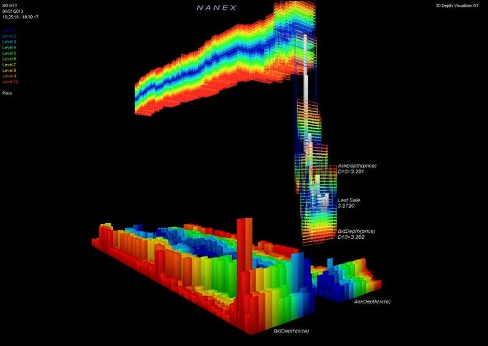

# Ultimate Crypto Latency Guide

Source HTML: [`html/2026-02-08-ultimate-crypto-latency-guide.html`](../html/2026-02-08-ultimate-crypto-latency-guide.html)

# Ultimate Crypto Latency Guide

| 항목 | 값 |
| --- | --- |
| 날짜 | 2026-02-08 |
| 접근 | 유료 |
| URL | https://www.algos.org/p/ultimate-crypto-latency-guide |
| 부제 | Implementing and understanding latency optimisation infrastructure |

---

### Introduction

---

When it comes to HFT strategies, you often reach a point where latency cannot be ignored. Simply having great alphas and modelling is not enough — you also need to be competitive on the latency front. Most of this is concentrated on the cloud network engineering front, so in today's article, we catalogue many different latency tricks.

We will dive into >10 different latency optimisations in this article to help you improve your latency setup.

Latency touches all elements of HFT strategies. For arbitrage strategies you are often competing against a couple other participants on any given market and having even a mild latency edge is often enough to thrash the competition, ensuring you aren’t left picking up their crumbs. It’s not just arbitrage strategies that need low latency, market making (which most arbitrage strategies eventually lead to since making into opportunities is the optimal approach), needs low latency in order to ensure your quotes are up to date with the latest estimates of global fair value (which a large part is just data feeds of various exchanges and getting that fast). Even statistical strategies often have latency requirements when they’re run on the HFT timescales.

This is all to say that latency is extremely important in the HFT world, and by not learning how to optimize it — you are missing out on a valuable skill which can make the difference between thrashing your competition.

### Index

---

1. Latency Tricks:

   1. WS Rotate
   2. FIX feed
   3. Machine Gun Orders
   4. Modify and cancel+new
   5. Limit modify
   6. Private feed
   7. Limit IOC Spam
   8. Overlapping feeds
   9. Base URLs
   10. VIP feed
   11. Implied Best Bid/Ask Price
   12. Canary orders

### Latency Tricks

---

Below is an extensive list of latency tricks. You can get a lot of performance gain from having a fast system, but sometimes you need to go beyond this and optimize the network side of things as well. I will leave the standard compute side optimizations up to the reader as there is plenty of material on this topic publicly available, and instead I will dive into latency tricks that focus on other aspects than computing efficiently. Most of these are not publicly known and this will be to my knowledge the only place on the internet where these tricks are available. These tricks are based on knowledge that I’ve gained whilst optimizing HFT strategies and working on trading desks.

#### WS rotate

---

Let’s start with quite an easy optimization to implement, it involves taking 3 WebSockets for the exact same feed and at some interval, say every 5 seconds, we drop the slowest of the 3, and replace it with a new feed. If you keep doing this, eventually you will get a very fast feed for your fastest feed. The logic behind this is that you climb up the list of who to send the data out to and become one of the first people to get the data sent to them.

#### FIX

---

Often exchanges will have a FIX feed much like exchanges from TradFi. The FIX feed isn’t necessarily going to be faster for all actions but for certain actions it is often faster than WebSockets and for others it may be slower. On one exchange I remember the FIX feed was faster for cancelling or modifying orders but the WebSocket feed was faster for new orders. I’m not sure I can give a good explanation as to why that was the case, but it was about 10% faster and consistently so. So if there is a FIX feed, it’s worth implementing it as well as the WebSocket feed.

#### 

#### Machine Gun Orders

---

Let’s say we need to place an order and want to ensure it gets there as fast as possible, how can we optimize our latency? Well, we have an interesting phenomenon with our latency because of how jitter works in the cloud. In equities markets, if you send and order and then send another the second one will always get there after the other so there’s no element of luck in it, but when you’re working in the cloud there is a random amount of noise which can make an order faster or slower compared to peers.

How can this be taken advantage of? Send tons of orders, and ensure that all the other orders will fail after the first had arrived. To ensure failure is fairly simple, just set them all to have the same client order id. This depends on the exchange, but for lots of exchanges you cannot have the same client order id. Some exchanges like KuCoin are a strange in-between where you cannot have the same client order id for orders sent within a few seconds of each other. Regardless, for exchanges where this works you can spam tons of orders and get the best side of the jitter every single time whereas everyone else has their orders held back by jitter.

There is a balancing act here though. If we send 100 orders every time we want to send 1 order we will quickly destroy our rate limit, so I find 5 is about the optimal amount.

This logic also applies to order cancellations, which are by default idempotent meaning that you can send as many as you want but that order is only going to get cancelled once. Roughly 5 works as well for this, you ideally want a YAML/JSON file where this is a parameter (or whatever parameter tracking approach you use for your trading system), that way you can increase or lower it easily when you use too much of the rate limit or if you’ve got some spare.

#### Modify & Cancel+New

---

Often you have the choice between sending a cancel order and then after that sending a new limit order *OR* instead you can use the modify endpoint which will do the same thing. In extreme tail events when the modify endpoint is clogged up (since it’s the default route for most MMs) then doing a cancel and then a new order is much more effective.

If you combine this with the machine gun trick we discussed earlier and spam new orders using the same client order id, then you get an extremely fast modify and it can often beat the actual modify endpoint when others are trying desperately to use it.

#### Limit modify

---

This is one of the older tricks but for certain exchange it still works. It works for BitMEX and it used to work for FTX before they shut down.

What you do is you place a limit order very wide such that it will never get filled, making sure that it is not a post only order and can be filled as a taker. Then you modify the price of the order such that it fills as a taker order (ie it’s better than best bid ask, ask for buy order bid for sell order). This will make you skip the queue and get filled super fast. The logic behind why this work is that some trading engines use the original creation time and neglect the modify time when calculating queue priority; this gives those who place early but modify later an edge.

#### Private feed

---

As we have discussed in previous articles, on many exchanges the private feeds are sent out before any other feeds. When I say private feeds I mean feeds that tell you about events that are specific to you such as the status of your orders or your trade fills.

Much like how we were able to infer the current implied best bid ask (see section below for more detail on this) from trade prices we can do the same from our own fills and on most exchanges we know that we are one of the very few people that have this information.

Even if you are quoting on another exchange, you will be pricing based on the top exchanges — especially Binance so by having orders there you’ll have the latest updates about price and often before anyone else.

#### Limit IOC Spam

---

This trick is mostly relevant for arbitrage strategies or when you know that if the price reaches a certain level you will want to hit that order really fast. So in this case you will spam limit IOCs every X ms at that price so that if an order is placed at this price you will be filled before anyone even has the chance to receive the data packet that this has occurred. This is not a super popular trick, however, as it will absolutely destroy your rate limit. There are more advanced tricks not discussed in this article which allow rate limit bypasses or you can negotiate really high rate limits directly with the exchange and then this trick becomes fairly useful, but until the rate limit issue is minimized the trick isn’t *THAT* helpful.

#### Overlapping Feeds

---

Most people assume that if there is a 100ms feed and a 500ms feed that the 500ms feed is redundant to the 100ms feed, but this assumes that the messages are perfectly aligned which is often not the case. If they are 50ms misaligned then you could get an update 50ms before everyone else on the 100ms feed just by also tracking the 500ms feed. Wherever possible, you should pick up a feed even if you think that it will be made redundant by a lower frequency feed. There are exceptions to this, of course, and it is silly to start picking up 1-minute bar feeds, but there’s nothing wrong with grabbing everything up to the 1s feed in my view. It’s a really easy way to improve your latency.

#### Base URLs

---

Using Binance (Spot) as an example, we already have multiple endpoints for REST requests:

- https://api.binance.com
- https://api-gcp.binance.com
- https://api1.binance.com
- https://api2.binance.com
- https://api3.binance.com
- https://api4.binance.com

Ideally, you should have a script running which tests which of these endpoints is currently the fastest and switches your default endpoint to the fastest one. If you are even more serious about your latency, you can select the top ones (or even all of them) and stream WebSockets from each of them. Ensure that you don’t overload your network card by doing this though (you will need to profile this) because it can actually end up making you much slower if you do this.

You may want to collect the data for which one is fastest over a long sample period because it isn’t really going to matter which one is fastest on average (they all are very close for this) - where they differ the most is actually in their tail latencies and this is what you’ll want to monitor. Tail latencies are when you want to trade the most and when the majority of PnL is lost / made, the mean latency usually means very little for any given base url.

#### VIP Feeds

---

For a lot of exchanges, there is a base URL which is available only to traders with a certain VIP level. This base URL tends to be roughly the same speed as the other base URLs, but it tends to be a bit faster when it comes to tail latencies and as a result is worth having integrated if you can get access to it.

#### Implied Bid/Ask Price

---

You should also track something I call the implied bid/ask price. If there was a buy trade (buy aggressor, meaning it hit the ask) then you set your implied ask price to the price of this trade. Similar for sell trades (sell as the aggressor, meaning it hit the bid) where you set your implied bid to the price of the sell trade. This is useful because the trade feed is sent out before the quote feed is sent out. In fact, in the order of data being sent out there is:

1. Private endpoints (updates on your own orders)
2. Trade feed
3. Orderbook deltas
4. Quotes
5. X level snapshots

Quotes is basically a 1 level snapshot feed so is sent out only slightly before the rest of the snapshots, and the snapshots are fairly slow to get sent out. Private endpoints are not always sent out first (it depends on the exchange), but they often are. We will dig into this a bit more in one of the next latency tricks because it’s useful to us.

Sometimes you can get mismatches between the actual best bid/ask and the implied best bid/ask if they put OTC trades into the trade feed from their RFQ platform or do other weird things like this so it is worth keeping best bid/ask and your implied best bid/ask as separate fields (you can track the deltas between these two as a type of system health metric as well), but generally I would treat implied bid/ask price as if it’s the real bid/ask price and use it to form my midprice I quote around.

This is one of the easiest and best performing latency tricks of them all.

#### Canary Orders

---

Often we aren’t actually profitable on the big exchanges like Binance, Okex, and Bybit, but we are profitable on the smaller exchanges. If we are trading a large book and making lots of money on other exchanges then it suddenly becomes worthwhile to place small orders on the bigger exchanges to take advantage of the previously mentioned private feed trick. These orders, which exist simply to give us information about the current implied price, are called canary orders (like canaries in a coal mine).

You do need to be careful when placing these orders though. A lot of people will simply place orders at the minimum possible size and think that this is perfectly fine. However, the exchanges don’t like canary orders and will get mad at you if you have a poor cancel to fill ratio. Ensure that you are quoting at least $125 USD for Okex and $100 for Binance. These are the numbers that Binance stops giving you shit for canary orders if your orders have at least this much USD size behind them. Sure, you can post as low as $10, but you’ll get your API limited (or account suspended) because you’ll trigger their market manipulation alarms (even though this isn’t against any legal rules and counts as behaving yourself). It’s wise to ensure that your canary orders meet the minimum size. Some exchanges won’t have this like Bybit (Bybit generally cares less about this sort of stuff) so just keep it in mind when you are trading.

####
