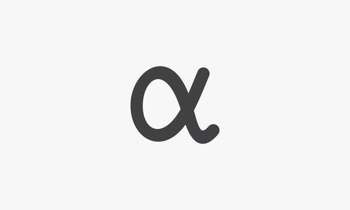

# It’s All Alphas

Source HTML: [`html/2026-03-07-its-all-alphas.html`](../html/2026-03-07-its-all-alphas.html)

# It’s All Alphas

| 항목 | 값 |
| --- | --- |
| 날짜 | 2026-03-07 |
| 접근 | 유료 |
| URL | https://www.algos.org/p/its-all-alphas |
| 부제 | The core driver of PnL across strategies |

---

### Introduction

---

Alphas make up the core of what drives a large majority of firms trading PnL. You can have complicated quoting rules, great models, amazing optimizers, advanced vol curves, or fast latency, but the gist of most trading firms edge can be compiled into some alpha representation. Even execution relies heavily on “execution alphas” in order to deliver highly effective execution costs to trading strategies. In this article, we will cover how to structure and trade alphas in the context of MFT, HFT, execution trading, arbitrage, and options (OMM + options MFT).

Out of all the ways to find an edge, one stands out the most and it is having very strong alphas signals. HFT strategies use this, MFT strategies use this, options strategies use this, execution algorithms use this - practically all advanced trading operations will have some set of proprietary alphas they use to inform their understanding of where price is going. The only exception will be arbitrage, but even that we will see becomes quite alpha like in some cases.

### MFT Alphas

---

This is where everyone hears about alphas mostly, and when I say alphas I am specifically talking about features or “formulaic alphas”. You can generate logical alphas as well, but I find these to be very inefficient. The pipeline I will mention, is a very well known pipeline - one I have talked about in the past. You take in data, you engineer it into your features or “alphas” which is where the true profitability lives and then from here everything else serves as a performance enhancer which builds on your alphas. This is your forecasting, and then your optimizer. I like to view each block in the pipeline as a converter. We convert data into alphas (feature engineering), alphas into forecasts (forecasting / ML), forecasts into target portfolios (portfolio optimization) and target portfolios into individual trades (execution - which we will go over in the next section). The reason logical alphas are inefficient is because they bypass the portfolio optimization and forecasting stages and directly output a target portfolio in many cases. You can include them in the pipeline, but it is quite tricky to use binary outputs, and the best case is that you find a way to represent the idea as a formulaic alpha or run it separately from your formulaic pipeline (they don’t tend to like to work together and this is often what has to occur).

For MFT, it couldn’t be more clear that the alphas are the foundation. In logical form they are the whole strategy and in formulaic form they are the base of what makes all the money. If you do not have good alphas, you will find it impossible to make any money trading in any reasonably competitive market. Unless you find some horribly inefficient market (in which case finding & accessing said market is the alpha itself because such a thing is so rare!) you will rely on alphas to drive profits. Even in the case of a horribly inefficient market you will still need to have some alphas although they may be extremely basic such as quoting around Binance on a small exchange (in this case Binance’s price is the feature itself). This is a common mistake among beginner quants - they falsely believe that you can save bad features with advanced & complicated machine learning. Mentally you should view what happens after the alphas as a multiplier, *ESPECIALLY* machine learning as it is the most multiplier like of them all. 2 \* 0 is still 0! Portfolio optimization is also important and can save you from trading yourself to death, but the boosts from here on are very incremental - and the alpha is driven by your alphas (aptly named!).

### Execution

---

How does really high-performance execution work? Well, at some level it is very much an HFT problem, since you are trying to get limit orders filled with great markouts (hence having some HFT overlap), but at a higher timeframe it becomes an alpha problem. Say we want to do a 1h TWAP. We can choose to speed up or slow down our execution based on our view of liquidity and our view of price. Part of this is deciding the parameters of the execution algorithm itself, this is fairly simple for a market order TWAP as we can take the alpha decay of our signals we want to trade and the curve for how our execution improves as we wait longer and find the optimal intersection through interval iteration where we maximize total edge (inclusive of trading costs). From here, we can figure out the optimal number of chunks and how aggressive to be on limit orders through similar forms of analysis. This gets us to a fairly basic execution setup.

If we want to be smarter we need to find alphas to predict liquidity and price. A simple model usually suffices for liquidity since it is not so hard to recognize that a given level of liquidity is particularly high relative to its history - a particularly advanced operation may go beyond this, but for most execution traders the focus will be on execution alphas which really are no different than any other type of alphas other than how we will be trading them.

To set the stage, we may have an hourly rebalance signal which earns it’s edge on a 4-6h timeframe, but every hour we rebalance it. When our optimizer flags that we should rebalance into a new position, we execute a TWAP. For simplicity, let’s assume this is a 15-min TWAP always (In practice, we would likely vary it based on the size of the order itself. A $100 order can be done almost instantly with no change in impact vs an hour TWAP.). We now get to decide how to speed up or slow down trading. If we calculate 1-minute alphas we can use those alphas to modify our trading schedule and end up capturing the edge in those alphas (Not trading and trading faster is almost free! The only cost is the additional market impact costs from being more aggressive). This let’s us get a few extra bps of edge into our signal if we have very strong short term signals, and allows us to really significantly improve our total execution costs.

From the perspective of the strategy trading the 1h rebalance it simply ends up with a TWAP execution price which is a few bps better and hence pays much less to execute. This can make for a very profitable setup.

### HFT

---

In HFT, we will similarly use alphas, but again the setup changes only in how we trade them. We will be unlikely to use an optimizer (although this is not necessarily a bad idea for deciding how to skew into longer term positions!) - at least on our short term alphas, and we will not be executing a desired position either. Instead, we use our alphas to modify our mid-price that we quote around and inherently end up trading into very profitable positions.

There are many HFT pods where their core driver of PnL is their alphas, and not some mysteriously smart game-theory optimized quoting logic. It is simply just lots of solid alphas combined across timeframes into a very profitable fair value to skew around. This will vary from 1 second alphas where they are mostly known and can easily be found with brute force search using genetic algorithms and complicated ML techniques to higher timeframes like 5-min, 15-min, and 1h where you start to get close to what an MFT pod might be running as their execution (or even part of their main trading) alphas.

### Alphas on different timeframes

---

You may have noticed that we started on 1 week alphas and worked our way down to 1 second alphas, but all that realistically changed is the way we decide to go about capturing the alphas. In fact, there is much overlap. HFT strategies may skew into MFT positions and hence become MFT strategies or use those same alphas used by execution algorithms to skew into 1h positions using their 1s alphas to further improve their costs.

Alphas serve as the foundation of what drives profitability for the strategies in our examples and the optimizer (MFT), forecasting (MFT), quoting logic (HFT), low latency design (HFT), selective volume-based aggression (execution) are simply optimizations that let us better capture these edges for our intended style of trading. In execution, we trade with a desired target in mind as part of a larger strategy, and in MFT or HFT we decide the position ourself with KPIs that look more like Sharpe, capacity, Calmar, CAGR instead of bps of volume executed for execution algorithms.

### Arbitrage

---

Many people like to think of arbitrage from a purely X>Y perspective, but this isn’t very efficient because it leads to hard thresholds where once you cross them you take. These may work in certain scenarios (specifically ones where you alphas is very constrained, i.e. we only make money on opportunities that have been around longer than 500ms between these specific exchange pairs, and want to be sure we only trade these setups), but when you are in the very common scenario (for those with edge at least!) of having some incredibly silly flow/market maker on a smaller exchange then it usually works out that you simply want to quote like a market maker trading around some fair value. You don’t need to show these quotes, they can be internal to your trading system and only revealed when they cross the best bid/ask of the orderbook in which case they are sent out as taker orders. We are likely making around the price of Binance, and in this setup we are effectively just market making using a cross-exchange basis alpha. Its that simple. Our forecast is just what Binance’s price is. This is a pretty good trade to make if the exchange is inefficient enough, but the reason this setup is ideal is because you can now trade very optimally in and out of the opportunity without the need for hedging. Hedging cross-exchange is usually sub-optimal in these cases since you have enough turnover to be “diversified across time” and have the trades average out. Reducing costs by trading optimally is the name of the game.

### Options Market Making

---

How does this extend to options? Its quite simple, we just have multiple variables to predict instead of one variable (mid-price in futures). Those targets are our vol curve parameters at some forward lookahead. Many people get hung up on vol models as if they are some sort of alpha - they are not. They are simply a way to compress 100s of options into a handful of parameters so that we can reasonably be expected to model them - once we have done this, then all of the edge lies in how well we can predict those parameters ahead of time.

Some of these parameters may be familiar as well known forecasting tasks like the ATM vol parameter. This is just standard volatility forecasting, but there is also a question of predicting skew, specific wing components, etc. So how does this work from a research setup?

Settle on a model first. Let’s pick the vola C9 model, meaning we have 9 parameters to predict. A pretty common model, but you are free to read back to my previous articles on OMM and go through our discussions of simpler models like the Wing model and SSVI, see below. Think of it more as a choice of how I want to condense my curve into parameters, what parameters make for a useful approximation of the behaviour of hundred of options?

We then take our model, and we fit it to the market at a given interval. For a market maker this may be 100ms or 1s, but for an MFT strategy we may use 1min or 1h, it depends on how you intend to trade it (we talk about how to run MFT strategies trading around option vol curves in the professional options making & taking article, see below).

[![Professional Options Market Making & Taking [CODE INCLUDED]](images/591a572a3b75.png)Professional Options Market Making & Taking [CODE INCLUDED][Quant Arb](<https://substack.com/profile/101799233-quant-arb>)·January 27, 2025[Read full story](<https://www.algos.org/p/professional-options-market-making>)](https://www.algos.org/p/professional-options-market-making)

Now, come up with a set of lookaheads. Perhaps 1 period, 5 period, 15 period and 60 period. We can look at how changes in a parameter effect changes in other parameters. We discuss this in the below article with some practical examples:

[![Options MM Part 2 - Options Trade Impact Modelling [CODE INSIDE]](images/6aa50f9d9768.jpg)Options MM Part 2 - Options Trade Impact Modelling [CODE INSIDE][Quant Arb](<https://substack.com/profile/101799233-quant-arb>)·March 2, 2025[Read full story](<https://www.algos.org/p/options-mm-part-2-options-trade-impact>)](https://www.algos.org/p/options-mm-part-2-options-trade-impact)

In the article we talk quite heavily about the idea of nowcasting and how it works in options. This is the idea of an extremely short lookeahead forecast which revolves around incorporating events faster than other market participants. In this case it is the impact of a trade on the vol surface. If a trade happens with a given size, in an option with a set of greeks, we can run a set of regressions to forecast how that will change our parameters in the next period. If we are fast, then we can adjust our parameters to incorporate the information in this trade before anyone else can. Similarly, we discussed how VCR works in the first part of the OMM series which is simply a nowcast but for incorporating changes in spot price.

These are all very relevant for a low-latency market maker, but for a trader who is trading a little longer out (perhaps an MFT trader or an options strategy that makes its edge on alphas instead of latency - figuring out the effects of trades in a nowcasting setup is not incredibly hard; the hard part is in the latency, and that is very winner takes all) then we will be predicting the parameters from effects much more similar to those we see in MFT alphas.
