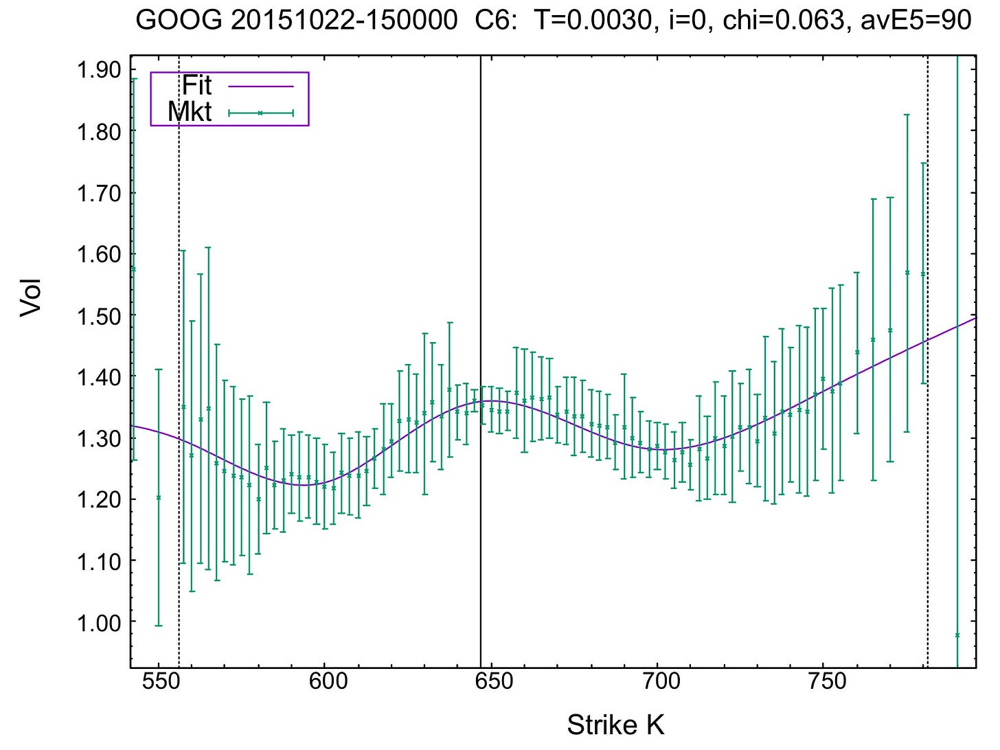

# Options MFT Strategies

Source HTML: [`html/2026-03-19-options-mft-strategies.html`](../html/2026-03-19-options-mft-strategies.html)

# Options MFT Strategies

| 항목 | 값 |
| --- | --- |
| 날짜 | 2026-03-19 |
| 접근 | 유료 |
| URL | https://www.algos.org/p/options-mft-strategies |
| 부제 | Finding alpha in options markets |

---

# Options MFT Strategies

### Finding alpha in options markets

[Quant Arb](https://substack.com/@quantarb)

Mar 19, 2026

∙ Paid

17

Share

### Introduction

---

Personally, I feel as though the whole world of options statistical arbitrage has always been fairly confusing for most people. In my view, there’s 4 main ways to approach statistical arbitrage strategies using options (that I’ve worked with at least). I’m not talking about pairs trading here for those who may be a little confused, I’m instead talking about statistical medium frequency alphas that trade options. I will give the frameworks for modelling these effects and the ways in which alpha is often discovered.

This is perhaps one of the areas most shrouded in mystery (as if doing good statistical arbitrage research wasn’t hard enough). I’ll break it down in this article the ways that I’ve always approached the problem (all of which I’ve found to be fairly successful, although some a bit more than others)

We will talk only about strategies that directly trade options, and not about strategies that use information from options markets to trade. You can do that and it works well, although for crypto options effects are a fairly weak in my opinion and I’ve always had trouble monetising the metrics I found that worked partially because you can only really trade BTC/ETH (so it’s either BTC/ETH relative value or a time series strategy, which rules out cross sectional which would be my preferred way do it if I could), but mostly because the options market in crypto is a much smaller part of the total volume compared to markets like equities where options flows are big game. Anyways, you can still use options as signals in linear stuff, but that’s a story for another time.

## This post is for paid subscribers

[Subscribe](https://www.algos.org/subscribe?simple=true&next=https%3A%2F%2Fwww.algos.org%2Fp%2Foptions-mft-strategies&utm_source=paywall&utm_medium=web&utm_content=167209313)

[Already a paid subscriber? **Sign in**](https://substack.com/sign-in?redirect=%2Fp%2Foptions-mft-strategies&for_pub=quantarb&change_user=false)
