# A Real HFT/MFT Alpha

Source HTML: [`html/2026-04-06-a-real-hftmft-alpha.html`](../html/2026-04-06-a-real-hftmft-alpha.html)

# A Real HFT/MFT Alpha

| 항목 | 값 |
| --- | --- |
| 날짜 | 2026-04-06 |
| 접근 | 유료 |
| URL | https://www.algos.org/p/a-real-hftmft-alpha |
| 부제 | An advanced 1h frequency cross sectional alpha |

---

### Introduction

---

In this article we will detail 2 (two!) proprietary orderbook alphas which achieve over 3 sortino when combined and over 2 Sharpe each individually. To date, there is no public literature documenting this alpha and is an entirely novel creation presented exclusively to readers of the Quant Arb Substack. We achieve the below performance as a raw signal using cross sectional z-score portfolio construction:

[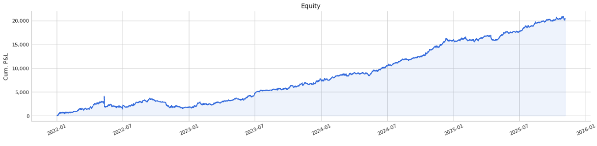](images/b66c6dae03bc.png)

### The Alpha

---

Our alpha revolves around splitting orders based on their age. We cannot directly estimate the age of orders, however, so instead we estimate using new and old levels in the orderbook. Old levels are defined as levels where the level had over $100 on it last snapshot (1-minute ago), and new levels are levels where it did not have $100 on it last snapshot. We use this as a proxy for new and old orders. We then aggregate the orderbook into 5 bps and 10 bps of depth.

We use a rolling universe of the top 50 most liquid cryptocurrencies (using market capitalization to rank), and construct our portfolio weights by z-scoring the feature cross-sectionally and then setting our weights equal to those z-scores, scaling to ensure our leverage remains exactly 1. You can clip z-scores if you would prefer more stable weights. We rebalance the portfolio every hour and target against raw 1h close to close returns.

We define our orderbook imbalance as such:

```
def safe_imbalance(bid: np.ndarray, ask: np.ndarray, eps: float = 1e-10) -> np.ndarray:
    """
    Compute (bid - ask) / (bid + ask) with safe division.
    Returns 0 where both bid and ask are zero.
    """
    total = bid + ask
    mask = total > eps
    result = np.zeros_like(bid, dtype=np.float64)
    result[mask] = (bid[mask] - ask[mask]) / total[mask]
    return result
```

### Performance

---

We multiply the old orders imbalance by -1 because the signal has the exact opposite direction to new orders imbalance. The metrics however, are very correlated and their PnL curves follow each other closely once you have inverted the old orders sign multiplier. We present the performance of the new and old orderbook imbalance 5/10bps and a combo feature which combines both:

New orders imbalance (5bps and 10bps):

[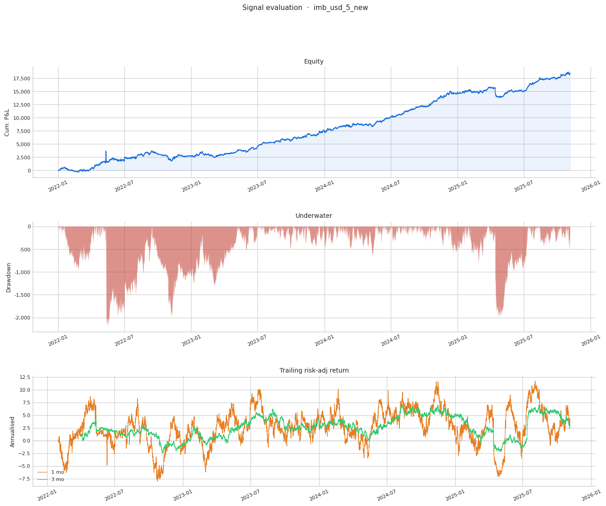](images/fab6e652a1e8.png)

[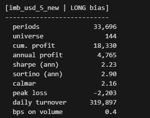](images/e8ba812ad832.png)

[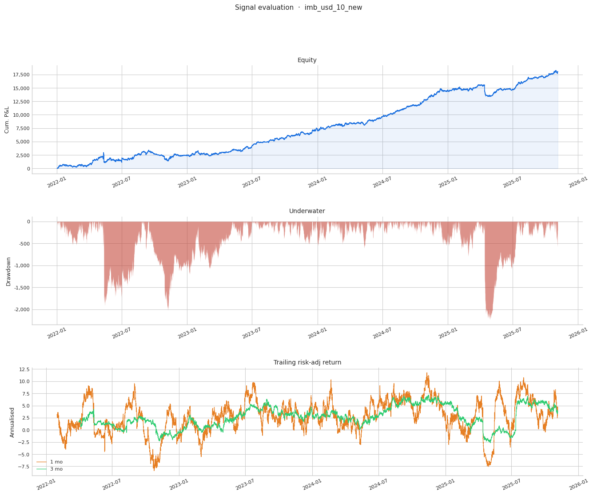](images/fe5f9818d1d9.png)

[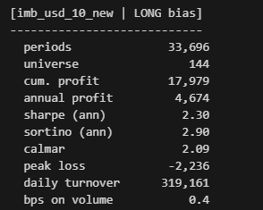](images/979969df62bb.png)

Old orders imbalance (5bps and 10bps):

[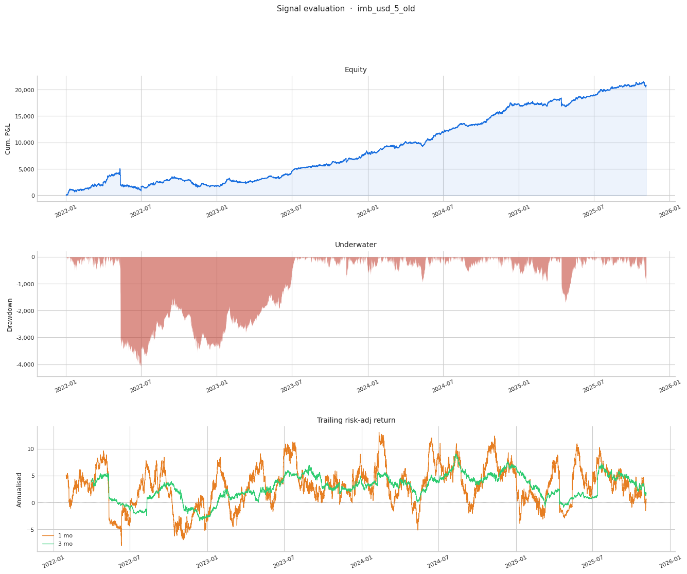](images/e16a6008fb5d.png)

[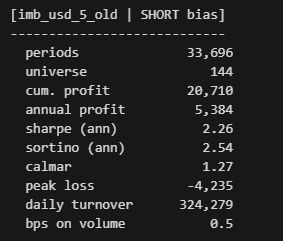](images/b13ce66214b3.png)

[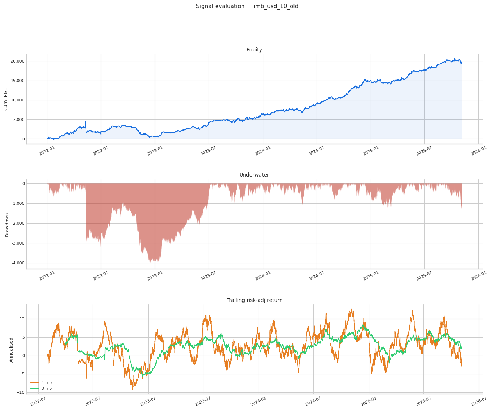](images/46b337013f5c.png)

[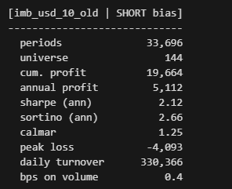](images/518cac74a140.png)

Combined alphas (new\_imbalance - old\_imbalance):

[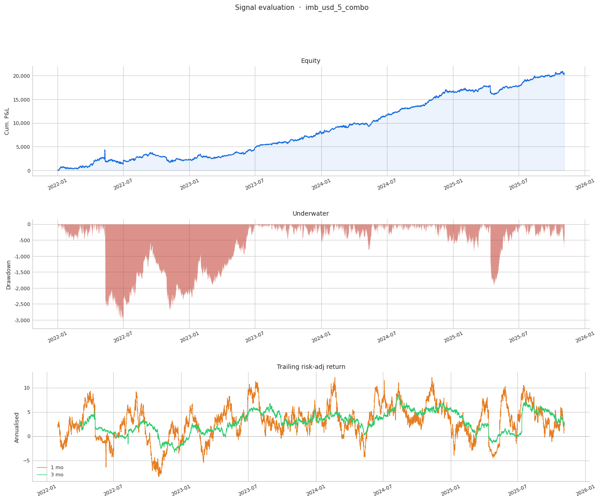](images/ced3db0c1aa9.png)

[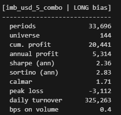](images/9ec2f63919dd.png)

[](images/96205d01bf4b.png)

[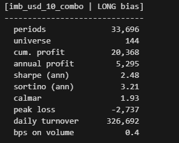](images/82752c60773c.png)
