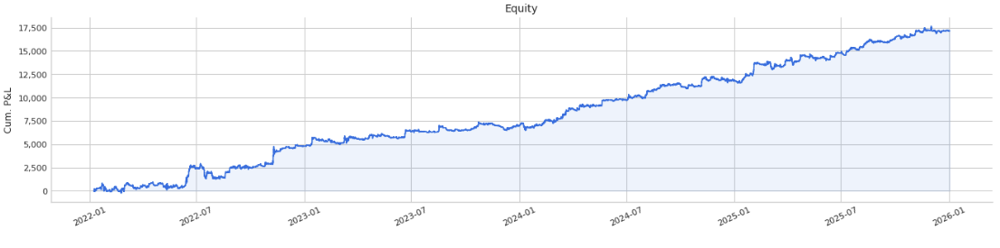
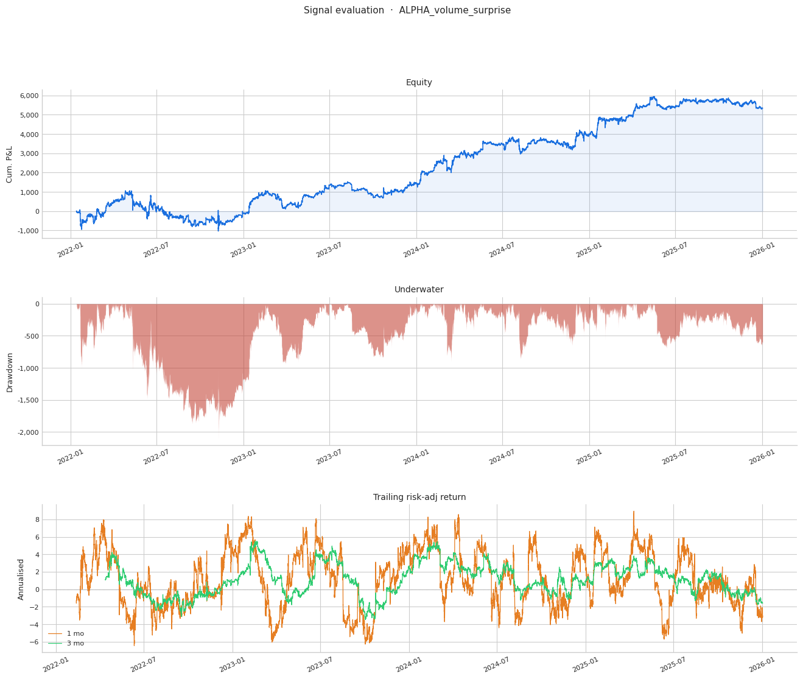
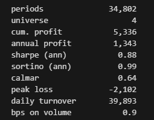
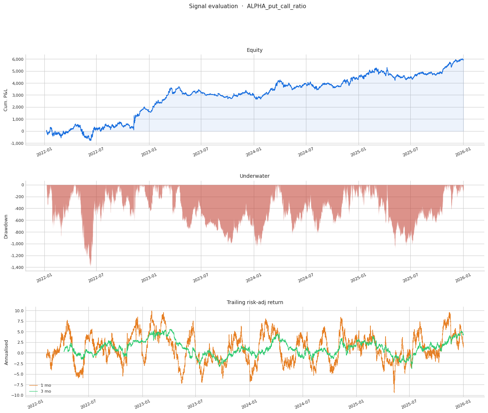
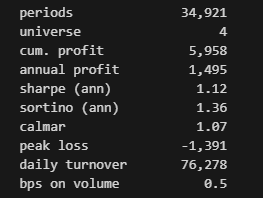
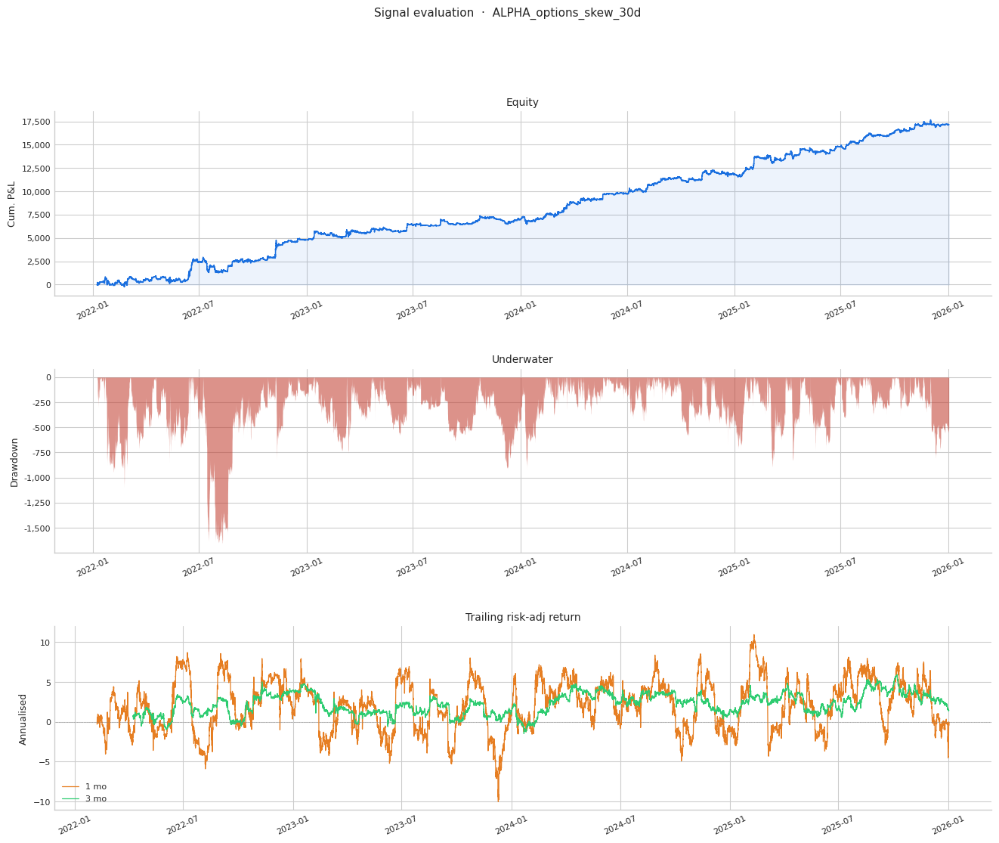
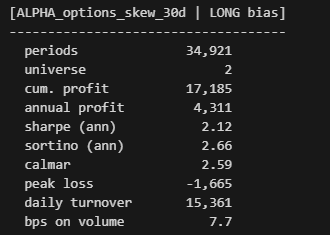
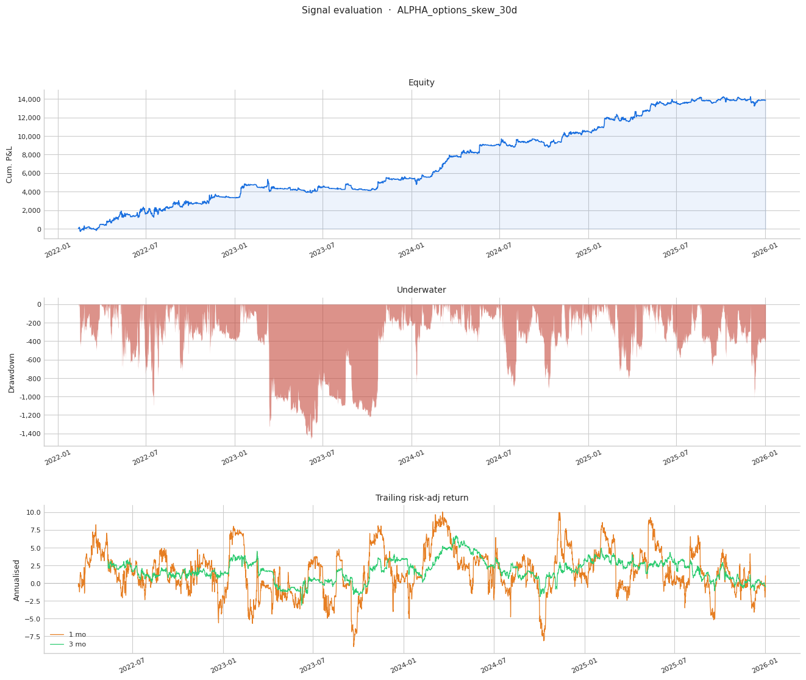
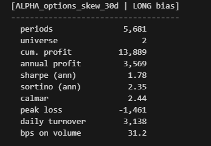

# Options Alphas Pt. 1

Source HTML: [`html/2026-04-07-options-alphas-pt-1.html`](../html/2026-04-07-options-alphas-pt-1.html)

# Options Alphas Pt. 1

| 항목 | 값 |
| --- | --- |
| 날짜 | 2026-04-07 |
| 접근 | 유료 |
| URL | https://www.algos.org/p/options-alphas-pt-1 |
| 부제 | We present 3 options alphas for trading BTC, ETH, SOL, and XRP |

---

### Introduction

---

In this article, the first in a three part series, we will present 3 working options alphas where we use options data to predict perpetual prices. Over the three articles we will present 5 alphas which achieve a combined performance above 2 Sharpe combined and 110 bps on dollars traded (All assets have sub-5 bps trading costs) on 72h rebalance (~1.5 Sharpe at 72h rebalance, ~2 Sharpe at 1h rebalance).

In the second article, we will share 2 more alphas ranging between 1 and 2 Sharpe, and show how to combine them. Then we will analyse the signal as a fully monetizable strategy in the 3rd article. These alphas use options data to predict perpetual prices of BTC, ETH, SOL, and XRP on Binance, one of the 3 we will present today is shown below:

[](images/3b734194f64d.png)

The alphas are fairly uncorrelated and orthogonal (not perfectly, but still very good for all being from the same dataset type) as seen in the scree plot below:

[](images/bebb166baf4a.png)

I think this series will be a real treat for readers as we present real working alpha which can actually be monetized now with no part left unexplained (other than data aggregation methods as this is very extensive, we will explain how to create the features of course though).

As with the previous article, I will not bore you with excessive writing as these are not complicated ideas and the work has already been done by myself in finding them, I will provide the feature, how to replicate it, and the performance.

### Alpha 1 - Options Volume Surprise

---

Starting with the weakest, we engineer the feature `ALPHA_volume_surprise` with the below formula:

```
df["ALPHA_volume_surprise"] = df["total_options_volume_1h"] - \
    df.groupby("ticker")["total_options_volume_1h"].transform(lambda x: x.rolling(24 * 5).mean())
```

Effectively, we are taking the surprise in volume relative to a 5-day history. `total_options_volume_1h` refers to the total volume traded in options contracts (in USD) in the last 1h. We achieve the below performance:

[](images/e1f2a6be5157.png)

[](images/1b8948566fa3.png)

### Alpha 2 - Options Put/Call Ratio

---

Next, coming in at just above 1 Sharpe we take the ratio of put and call volume to get the put/call ratio. Our volumes are aggregated from Binance options, Okex options, Bybit options, (and most importantly as this is where most of the volume is), Deribit options. We do:

```
df["ALPHA_put_call_ratio"] = (df["call_volume"] - df["put_volume"]) / \
    (df["call_volume"] + df["put_volume"])
```

We achieve the below performance:

[](images/5ee7cb8b70de.png)

[](images/a4d085b50108.png)

### Alpha 3 - Volatility Skew

---

Saving the best for last, we have volatility skew, which is a single measure which measures the overall volatility skewness of the volatility curve. We use the 30d expiry since it is both liquid and fairly short term (we are not forecasting months, only hours to days so short is better).

We take the total volatility priced into out-of-the-money call options for the expiry 30d out (or closest expiry), and we call this “upside\_volatility” and then we take the total implied volatility from out-of-the-money put options for the expiry 30d out (or closest expiry) and we call this “downside\_volatility”. Our volatility skew alpha is quite literally just:

```
df["ALPHA_options_skew_30d"] = df["upside_volatility"] - df["downside_volatility"]
```

We achieve the below performance, in excess of 2 Sharpe:

[](images/c274eb384f30.png)

[](images/9fc1b586ff53.png)

We achieve a very strong 7.7 bps on dollars traded for hourly rebalance, but we can instead rebalance only every 6h and achieve 31.2 bps on dollars traded (which is much larger than trading costs, this only trades BTC and ETH which both trade with sub 1 bps spread often and taker fees are <2 bps for top tier (less for maker which is easy to get on these names)).

[](images/d11873f3e7b7.png)

[](images/61d1e7308959.png)

### Portfolio Construction

---

Options skew uses BTC and ETH as its universe, and we use BTC, ETH, SOL, and XRP for the other two metrics as the universe.

We construct portfolios by z-scoring over the last 1 week, dividing the z-score by 3, and taking the tanh of it to effectively clip it.
