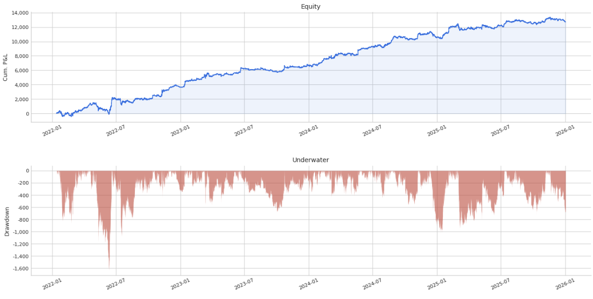
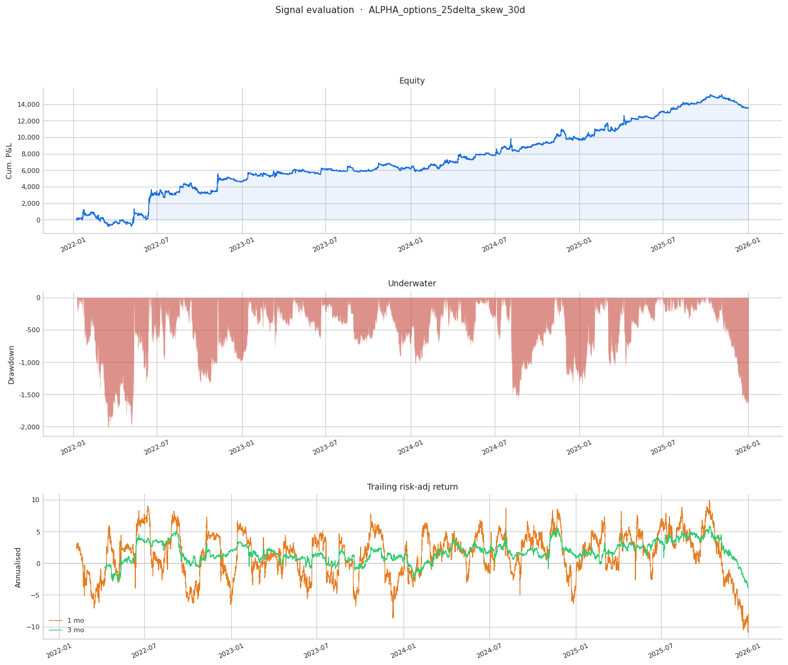
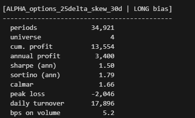
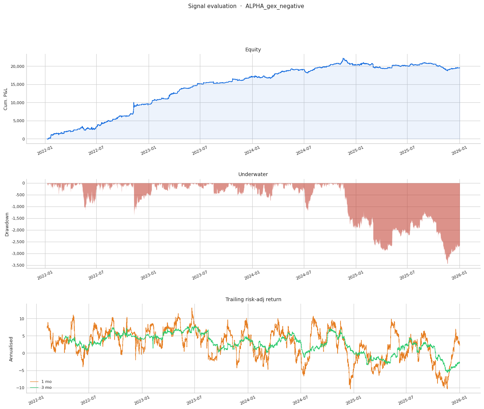
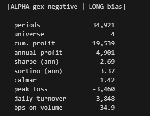
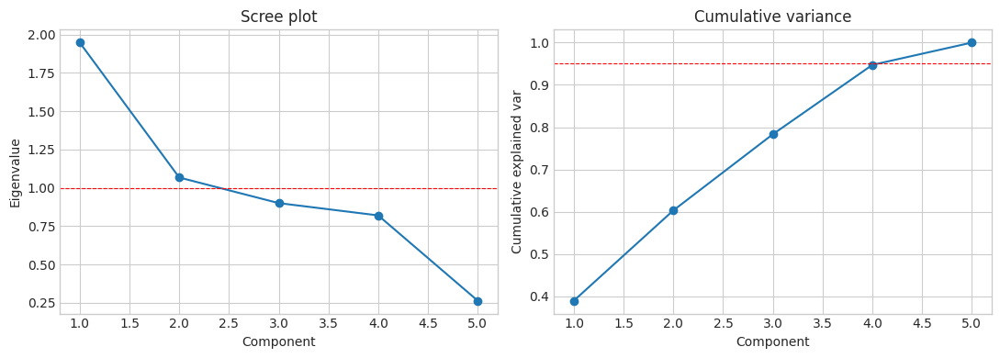
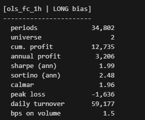
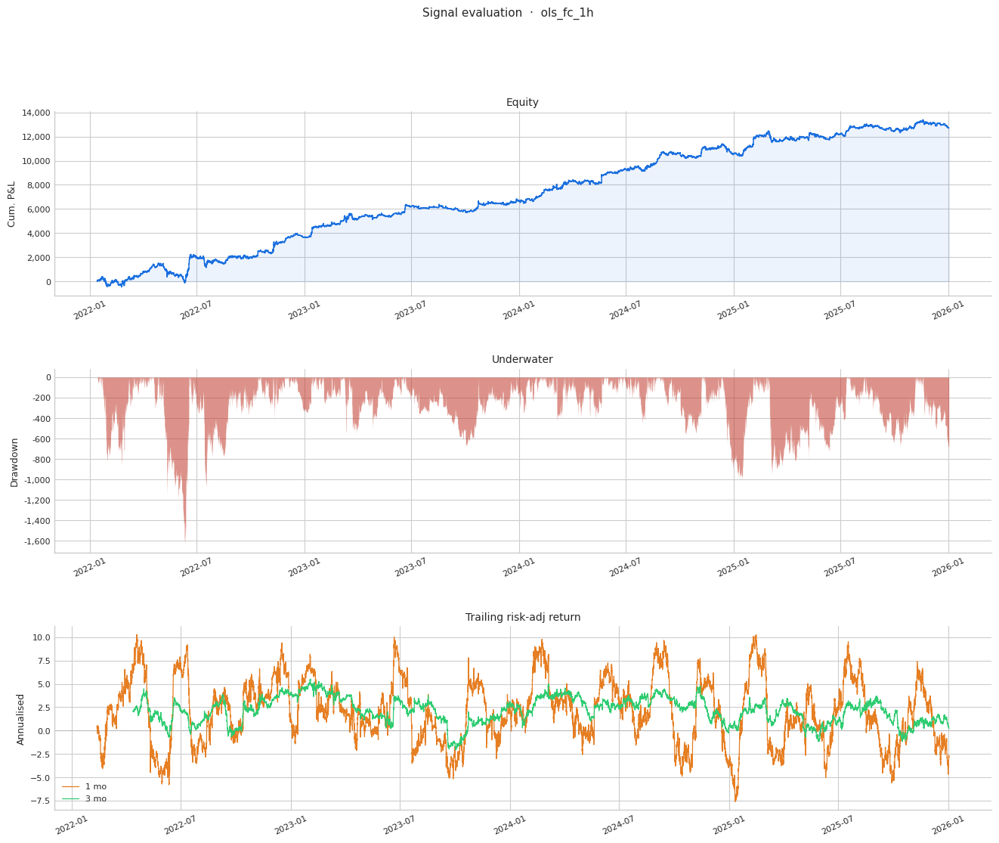
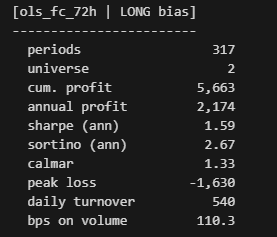
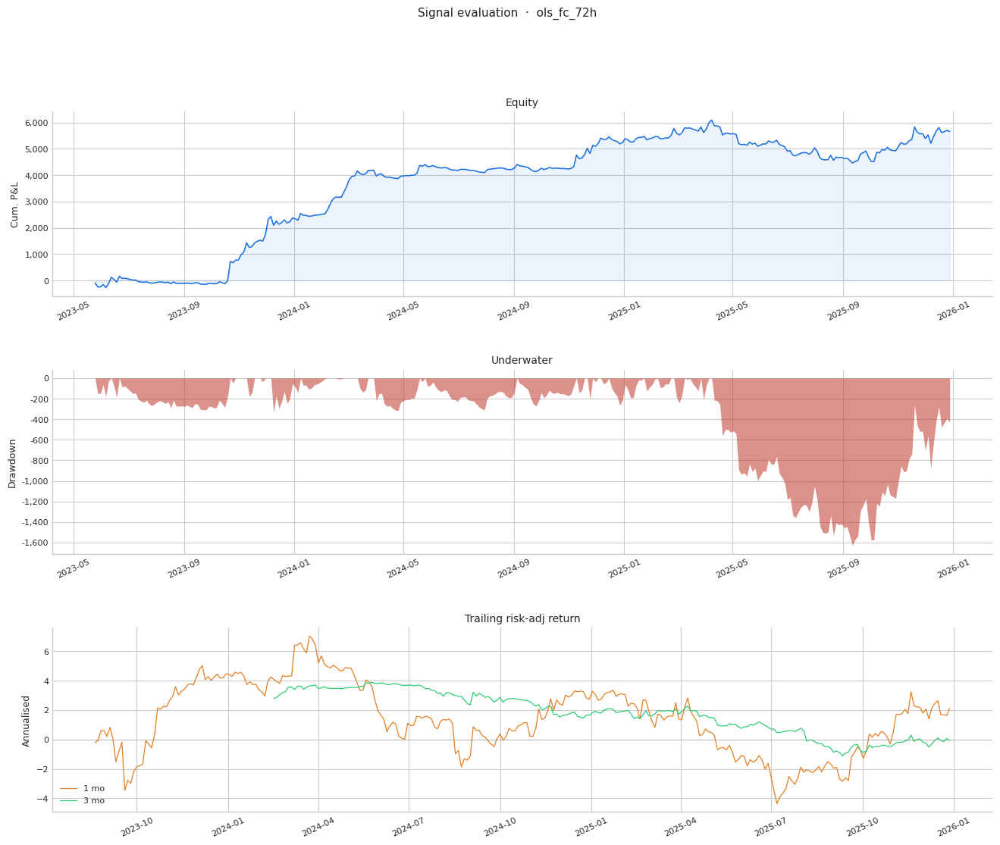

# Options Alphas Pt. 2

Source HTML: [`html/2026-04-14-options-alphas-pt-2.html`](../html/2026-04-14-options-alphas-pt-2.html)

# Options Alphas Pt. 2

| 항목 | 값 |
| --- | --- |
| 날짜 | 2026-04-14 |
| 접근 | 유료 |
| URL | https://www.algos.org/p/options-alphas-pt-2 |
| 부제 | Two more options alphas, and combining our alphas |

---

[The Quant Stack](https://www.algos.org)

[Options Alphas Pt. 2](https://www.algos.org/p/options-alphas-pt-2)

Two more options alphas, and combining our alphas

[](/@quantarb)

[Quant Arb](https://substack.com/@quantarb)

Apr 15, 2026

∙ Paid

---

### Introduction

---

In the last article, we covered 3 working alphas, 2 weaker alphas and one strong alpha. Now we will present a medium strength alpha and a second strong alpha then show how to combine them to form a very profitable trading strategy both before and after real world trading costs. In the final part to this series (the next article), we will explain how to trade and monetise the alphas although the explanation today will be more than sufficient to make money trading (even the first article presented enough alpha standalone to make money).

We combine to form the below curve:

[](images/a2a4d0da4ae8.png)

Which when we rebalance every 72h we achieve 2.7 Sortino, and 110 bps on dollars traded!

Much like the prior article this will be fairly short. There is little reason to ramble on when I am merely presenting working alphas to the reader, I will resume more educational material in further articles in this series (research processes, and data pipelines to find said alphas).

### Alpha 4 - Options 25 Delta Skew

---

We achieve the below performance by taking the skew of the 25 delta options (you can use other deltas, but 25 delta is the strongest and we see the performance slowly improve going from 5-25 delta before peaking at around 25 delta):

[](images/1ba80cb4546a.png)

[](images/2c6425b03312.png)

Similar to our skew alpha from the last article we use the 30d expiry as this performs the best.

### Alpha 5 - Options GEX

---

Using the standard gamma exposure formula:

```
GEX (per strike) = Option Gamma × Open Interest × Contract Size × Spot Price² × 0.01

Net GEX (market total) = Σ (Call GEX) − Σ (Put GEX) across all strikes & expirations
```

We calculate GEX and find that it has a negative correlation with forward returns, after multiplying with \* -1 we get `ALPHA_gex_negative` :

[](images/b6df1b97b5b9.png)

[](images/21d4a4cf9725.png)

The alpha achieves an incredibly high 34.9 bps on dollars traded despite a very aggressive hourly rebalance simulation. This is an incredibly high performance and means that almost all of the Sharpe seen is monetizable (we trade BTC, XRP, SOL and ETH perpetuals which are tight books).

### Orthogonality

---

We can see in the below scree plot that when we take all of our 5 alphas, we do not explain the variance in a limited set of components and whilst they are not perfectly orthogonal, given that they are all from the same dataset, and we have two versions of skew, this is an incredibly good performance:

[](images/c87da2f42be6.png)

### Combination & Simulation

---

Using an OLS (Ordinary Least Squares) regression to combine our alphas we achieve the below curve:

[](images/840ce56b67fd.png)

[](images/ef8774daaf6b.png)

The bps on dollars traded is not ideal, we could of course exclude the alphas where the bps on dollars traded is too poor or we can choose to rebalance the alpha fairly infrequently instead. A 72h rebalance gives us the below performance:

[](images/3b0f560115d3.png)

[](images/ef8ca151cfef.png)

Our Sortino is almost 2.7, our Sharpe 1.6, and our bps on dollars traded is so high that transaction costs are easy to ignore. This is an example of the kind of strategy you can run on really significantly sized books (liquid names, high bps per dollar traded)

In the next article, we will go over the research process, data construction, and how to better trade this (72h rebalance is a sub-optimal way to combine alphas).

18 Likes
